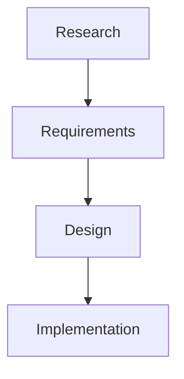

# Choose Diagram Form by Readability

Mermaid is not the default for every relationship. Use it when the visual graph does explanatory work that a smaller text form cannot do as clearly.

- USE Mermaid for non-trivial branching, cycles, fan-in or fan-out, multi-component topology, temporal interaction, and ER semantics when visual layout materially improves comprehension
- KEEP compact linear workflows, precedence chains, stacked branch lists, annotated file or layout trees, and one-line relationships in fenced text, lists, or tables when those forms are more direct
- DO NOT convert text or ASCII to Mermaid solely because it contains arrows, ordering, or semantic relationships
- PREFER the representation with less syntax and visual bulk when both forms communicate the same information equally well

## Bad

````markdown

````

## Good

````markdown
```text
research → requirements → design → implementation
```
````
