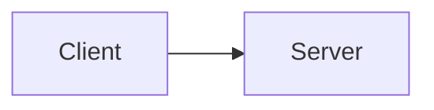

# Mermaid for Semantic Diagrams

Use Mermaid when the reader must understand semantic connections or ordering, not merely because structured text contains arrows, branches, boxes, or tree characters.

- ALWAYS use Mermaid for architecture relationships, topology, process flow, sequences, and ER diagrams in `*.md` files
- AVOID ASCII box-and-arrow diagrams that represent semantic relationships
- KEEP literal UI, CLI, and output examples in fenced text when exact appearance is the content
- USE the clearest of fenced text, tables, lists, or tree notation for compact record, schema, and data shapes and for directory trees

## Bad

````markdown
```
┌──────────┐     ┌──────────┐
│  Client  │ ──> │  Server  │
└──────────┘     └──────────┘
```
````

## Good

````markdown

````
