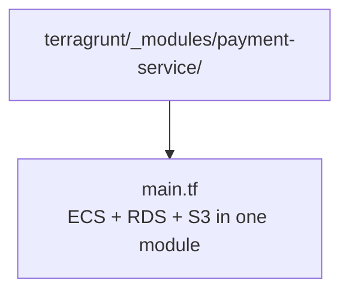
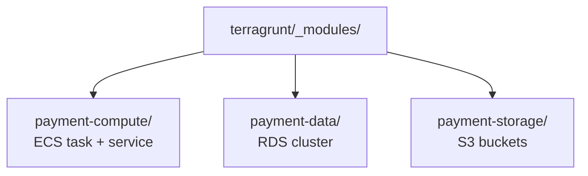

# Module Separation by Role

A module that creates ECS + RDS together forces you to redeploy the database to change a task definition, and vice versa. Separating compute from stateful resources keeps blast radius small.

- ECS / Lambda / Step Functions → compute module
- RDS / S3 / DynamoDB → data module
- Cross-environment IAM, VPC, shared KMS → `terragrunt/common/`
- Per-environment wiring → `terragrunt/<env>/<module>/`

## Bad

## Good

