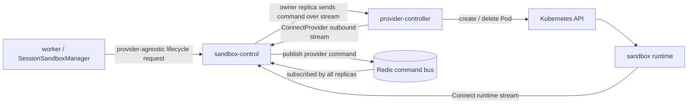

# ADR-0036: Simplify sandbox-control Provider Routing

## Context

ADR-0035 introduced `SandboxProviderControl` and adopted a structure where a provider controller opens an outbound `ConnectProvider` stream to NoIntern. After implementation, production rollout repeatedly exposed these problems:

1. Provider stream is attached to a process-local store in `sandbox-control`.
2. Worker reads Redis active provider registry and performs provider selection/allocation.
3. Redis liveness record, worker allocation decision, and `sandbox-control` stream ownership became separate sources of truth.
4. During rollout/reconnect/checkpoint restore timing, worker repeatedly hit `No active sandbox provider is available`.

This cannot be solved only with TTL, heartbeat, or retry. The real problem is that the actual owner of provider-control connection differs from the owner of allocation decision.

## Decision

Simplify provider-control lifecycle command routing with a Redis command bus among `sandbox-control` replicas.

1. Worker does not directly use provider registry, provider connection store, or provider stream owner.
2. Worker sends runtime lifecycle intent through a provider-agnostic service boundary.
3. Application service performs provider selection, but does not expose stream owner endpoint to callers.
4. Provider lifecycle commands are published through Redis pub/sub or Redis Streams-based command bus.
5. All `sandbox-control` replicas subscribe to the command bus, and only the replica that owns the matching process-local provider stream handles the command.
6. Redis provider registry acts as active stream owner/fencing/read-model. However, it is not exposed as an API requiring callers to know owner endpoint directly.
7. Checkpoint restore does not treat provider unavailable and checkpoint corruption as the same failure. Provider readiness failure is runtime allocation failure; only checkpoint object validation failure is a reason for checkpoint invalidation.

Target flow:

## Consequences

### Positive

- Provider commands are delivered to the owner replica even though worker does not know provider stream owner.
- Worker replica count and worker rollout do not affect provider stream routing correctness.
- `sandbox-control` can remain stateless replicas while owning process-local streams.
- Existing security topology where provider-controller connects outbound as a client is preserved.
- Checkpoint restore failure classification becomes clearer.
- Future local Docker provider can use the same `sandbox-control` ownership model.

### Negative

- Redis command bus request/response correlation, timeout, idempotency, and cancellation policies must be defined.
- `SandboxControlWorker` or application service RPC surface must expand to include lifecycle operations.
- `sandbox-control` owns lifecycle orchestration as well as command/file/checkpoint plane, so internal responsibility grows.
- Existing `ProviderControlSessionSandboxClient` and dependency wiring must be cleaned up.
- Existing tests and diagnostic APIs that directly use Redis provider registry for allocation decision must be redefined.

## Alternatives

### Keep existing structure and reinforce TTL/heartbeat/retry

Rejected. Production already reinforced `registry TTL`, heartbeat, and reconnect lifecycle, but the structural issue remains: worker does not own the process-local provider stream.

### Worker directly calls owner sandbox-control replica for provider command

Rejected. sandbox-control is stateless replicas, and provider stream is a process-local resource. A structure where callers need to know owner endpoint exposes topology details to callers.

### Use only Kubernetes Service load balancing without Redis command bus

Rejected. A load-balanced endpoint sends requests to arbitrary replicas, so there is no guarantee that the command reaches the provider stream owner replica.

### Connect provider-controller directly to worker

Rejected. This couples worker replica topology with provider ownership, and worker rollout would disconnect provider connections. It also conflicts with sandbox-control already being runtime stream owner.

## Status

Accepted. Detailed design follows `docs/nointern/design/sandbox-provider-routing-simplification.md`.
