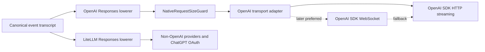

# ADR-0147: Use an OpenAI-Native Responses Transport Family

## Status

Accepted. Implementation has not started.

## Context

Azents currently lowers its canonical event transcript through `LiteLLMResponsesLowerer` and calls the Responses API through LiteLLM. OpenAI Responses WebSocket mode is available only through the official OpenAI protocol and SDK; LiteLLM 1.91.3 exposes no public outbound-client WebSocket transport, and its private `_aresponses_websocket()` entry point is documented for proxy use only.

Using the OpenAI SDK for WebSocket while retaining LiteLLM for the OpenAI HTTP fallback would create two transformation paths for the same provider. Even if both start from the same Azents events, LiteLLM may independently transform model identifiers, optional parameters, instructions, tools, headers, input items, stream events, and response metadata. The WebSocket default and its HTTP fallback would therefore not have a stable semantic-parity boundary.

The transport migration must preserve the existing logical execution semantics:

- the canonical event transcript remains the durable source of truth;
- compaction and file materialization happen before native request-size enforcement;
- `NativeRequestSizeGuard` continues to evaluate the final logical provider request;
- ChatGPT OAuth remains a full-context LiteLLM HTTP path with `store=false`;
- OpenAI continuation remains an in-memory transport optimization and never replaces canonical transcript lowering.

## Decision

### Create a canonical OpenAI Responses lowerer

Add an OpenAI-specific lowerer that produces one canonical OpenAI Responses request from the Azents event transcript. It owns OpenAI request semantics independently of the physical HTTP or WebSocket transport.

The lowerer is the single OpenAI request-transformation boundary for model selection, instructions, input items, tools, reasoning options, include fields, sampling options, prompt-cache options, and other supported Responses parameters. Transport adapters may add or remove only protocol-specific envelope fields required to send that request.

`NativeRequestSizeGuard` runs against the fully lowered OpenAI request before either transport sends it. Existing logical lowering, compaction, and file materialization behavior remains unchanged unless separately designed.

### Migrate OpenAI HTTP before introducing WebSocket

The first implementation phase routes `LLMProvider.OPENAI` through the OpenAI lowerer and the official OpenAI SDK HTTP streaming API. This phase establishes request, event, usage, cost, error, cancellation, and logging parity while physical transport remains HTTP.

WebSocket support is a later phase. After HTTP parity is verified, OpenAI WebSocket becomes the preferred transport and the OpenAI SDK HTTP streaming path becomes its fallback. Both transports consume the same canonical OpenAI request and share the same output-normalization contract.

### Keep LiteLLM outside the OpenAI transport fallback

LiteLLM remains the adapter family for non-OpenAI providers and for ChatGPT OAuth. It may continue to provide public metadata or cost-calculation utilities when their behavior is explicitly validated, but it does not send OpenAI HTTP fallback requests after the OpenAI-native migration.

The provider boundary is therefore:

### Keep continuation state transport-local

OpenAI continuation may use `previous_response_id` only as an in-memory optimization. HTTP migration preserves the current full-request fallback when continuation is unsafe or fails. The later WebSocket implementation binds continuation state to one live socket and clears it whenever that socket is replaced or fails.

All OpenAI requests continue to use `store=false`. ChatGPT OAuth continues to send full context and does not use response-ID continuation.

### Preserve privacy-safe observability

Operational logs may record whether continuation was used, but must not include response IDs, request inputs, model outputs, or raw WebSocket frames. The HTTP migration and later WebSocket transport share this restriction.

## Consequences

- OpenAI HTTP and WebSocket request semantics have one owner, making fallback parity testable.
- OpenAI-specific capabilities no longer depend on LiteLLM exposing an equivalent transport feature.
- The HTTP-first phase introduces migration work before WebSocket latency benefits are realized.
- OpenAI usage and cost extraction must be adapted because LiteLLM-specific `_hidden_params.response_cost` is unavailable on direct SDK responses.
- OpenAI stream events and errors require an OpenAI-native adapter/normalizer boundary, while existing canonical output and run lifecycle contracts remain unchanged.
- Non-OpenAI providers do not need to migrate and continue to benefit from LiteLLM's provider normalization.

## Alternatives Considered

### Use the OpenAI SDK for WebSocket and LiteLLM for HTTP fallback

Rejected because the two paths can transform the same logical request differently. Maintaining a parity matrix against every relevant LiteLLM upgrade would leave fallback semantics dependent on two independent request compilers.

### Use LiteLLM's private WebSocket function

Rejected because `_aresponses_websocket()` is a private proxy-only interface rather than a supported outbound-client transport contract.

### Introduce WebSocket and the new lowerer in one cutover

Rejected because request-lowering, event normalization, usage/cost accounting, and transport lifecycle would change simultaneously. Stabilizing direct OpenAI HTTP first isolates semantic migration from WebSocket connection behavior.

### Replace LiteLLM for every provider

Rejected because the current requirement is specific to OpenAI transport parity. Migrating unrelated providers would expand scope without helping establish the OpenAI HTTP/WebSocket invariant.

## Deferred Decisions

The detailed design will decide:

- the exact parity contract and rollout gates for the OpenAI HTTP migration;
- OpenAI event normalization and usage/cost accounting details;
- WebSocket ownership, connection rotation, retry, cancellation, and fallback behavior;
- feature-flag, canary, benchmark, and rollback policy.
