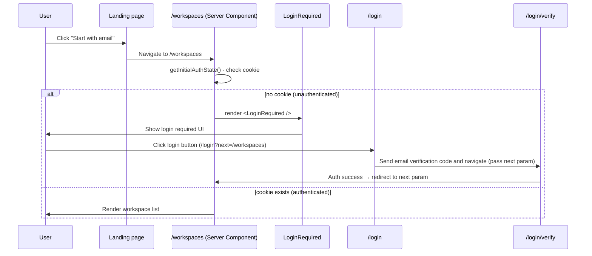

# nointern-web Login Guard Historical Decision Reconstruction

- Snapshot: `auth-260219`
- Status: historical reconstruction; not a newly accepted decision.
- Source Design: `docs/azents/design/auth-guard.md`
- Original requester confirmation: not recorded in this reconstruction.

## Reconstructed Decisions

### auth-260219/ADR-D1 — Explicit decisions recoverable from the source Design

The following sections are copied only from explicit source Design text. No additional intent is inferred.

### Explicit source section: Architecture

### Explicit source section: Key Design Decisions

1. **Dual-client pattern**: Separate `refreshClient` (no interceptor) and `client` (with interceptor) to prevent infinite loop.
2. **Proactive refresh**: Refresh 5 minutes before expiry to minimize 401 errors.
3. **resHeaders pattern**: Set Set-Cookie through tRPC `resHeaders` instead of `cookies()` API (tRPC compatibility).
4. **No encryption needed**: Unlike azents, use only httpOnly cookie without encryption (no COOKIE_SECRET required).

## Historical Unknowns

- Decision acceptance date, rejected alternatives, and requester confirmation are unknown unless explicit in the source.
