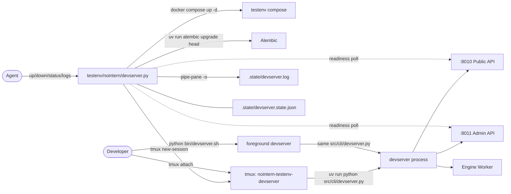

# Full-stack Local Test Environment — Stage 1b (devserver lifecycle) Historical Decision Reconstruction

- Snapshot: `devserver-260406`
- Status: historical reconstruction; not a newly accepted decision.
- Source Design: `docs/azents/design/devserver-lifecycle.md`
- Original requester confirmation: not recorded in this reconstruction.

## Reconstructed Decisions

### devserver-260406/ADR-D1 — Explicit decisions recoverable from the source Design

The following sections are copied only from explicit source Design text. No additional intent is inferred.

### Explicit source section: Architecture

**Key point**: tmux session serves as "process supervisor". Instead of PID management, check liveness with `tmux has-session`, send SIGINT with `tmux send-keys C-c` to induce graceful shutdown, and capture stdout/stderr to file with `tmux pipe-pane`.

## Historical Unknowns

- Decision acceptance date, rejected alternatives, and requester confirmation are unknown unless explicit in the source.
