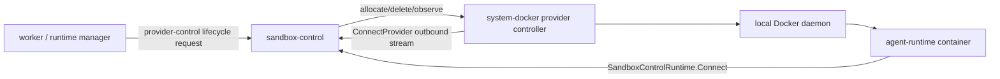

# docker-260523/ADR: Introduce system Docker Sandbox Provider

## Context

After provider-control rollout, we needed a provider implementation that can reproduce and isolate production K8s provider issues locally. The current local dev path has `DockerSessionSandboxClient`, but that backend has the worker process directly control Docker. Therefore it cannot verify provider-control stream, provider heartbeat, lease, or provider-owned lifecycle command routing.

The customer local Docker provider discussed in separate issues #3906/#3916 is a workspace-scoped provider daemon running on a customer's machine. That product feature includes login UX, provider credential, public TLS, credential revoke, workspace provider UI, and local-machine trust boundary hardening. The purpose here is not to implement that feature. It is to manage Docker runtime as a system-level provider inside NoIntern devserver/testenv so K8s provider issues can be separated from provider-control core issues.

## Decision

Introduce `system-docker` sandbox provider as an internal NoIntern system provider.

1. `system-docker` is a system provider run by operator/devserver. It is not workspace/user-owned provider.
2. Separate its name, scope, and credential model from customer local Docker provider.
3. Use the same provider-control protocol, heartbeat, lease, runtime token, and sandbox-control readiness path as K8s provider.
4. Reuse Docker container lifecycle by restructuring the existing `DockerSessionSandboxClient` runtime contract as a provider backend.
5. In devserver/testenv standalone mode, start `system-docker` provider without K8s and verify the provider-control path end-to-end.
6. Do not implement customer local Docker provider login/start daemon, workspace credential, public endpoint, revoke, or hardening in this scope.

Target topology:

## Consequences

### Positive

- devserver/testenv can reproduce provider-control production path without K8s.
- Provider-control core issues can be separated from K8s provider implementation issues.
- Existing local Docker container contract is promoted to provider-control, reducing dependency on direct worker Docker path.
- Creates a reference implementation to verify Docker runtime contract for future customer local Docker provider.

### Negative

- Docker provider controller and legacy direct Docker backend temporarily coexist.
- Local Docker runtime isolation is best-effort for dev/test and does not satisfy customer-machine security contract.
- Provider-control E2E depends on Docker daemon availability.

## Alternatives

### Keep existing direct Docker backend

Rejected. Because worker directly controls Docker, it cannot verify provider-control stream, heartbeat, lease, or runtime token path.

### Implement customer local Docker provider immediately

Rejected. The goal is cause reproduction and devserver standalone support. Customer provider is a separate product scope including credential, public TLS, workspace UI, revoke, and hardening.

### Keep only fake provider E2E

Rejected. Fake provider verifies only protocol handshake and some ack paths. It cannot verify real Docker runtime allocation, sandbox-control client registration, or shell/file command path.

## Status

Accepted. Detailed design follows `docs/nointern/design/docker-260523-docker-sandbox.md`.

## Migration provenance

- Historical source filename: `0037-system-docker-sandbox-provider.md`
- Source date basis: `adr.created`
- This ADR was reconstructed as a historical record; no new requester confirmation is implied.
