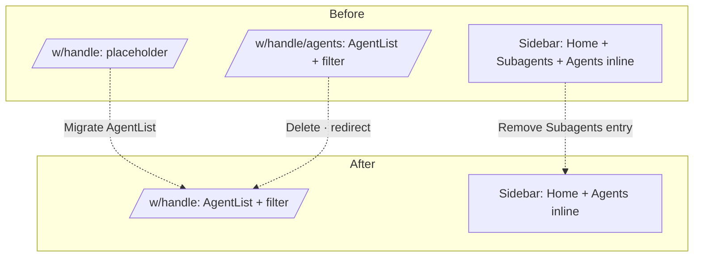

# Home-as-agent-list Reorganization Historical Decision Reconstruction

- Snapshot: `home-260421`
- Status: historical reconstruction; not a newly accepted decision.
- Source Design: `docs/azents/design/home-as-agent-list-2026-04-21.md`
- Original requester confirmation: not recorded in this reconstruction.

## Reconstructed Decisions

### home-260421/ADR-D1 — Explicit decisions recoverable from the source Design

The following sections are copied only from explicit source Design text. No additional intent is inferred.

### Explicit source section: Architecture

## Historical Unknowns

- Decision acceptance date, rejected alternatives, and requester confirmation are unknown unless explicit in the source.
