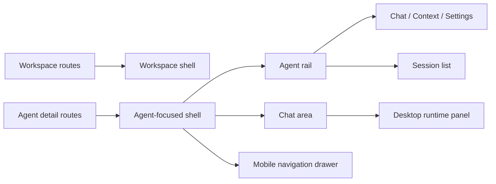

# Agent-Focused Session Layout Historical Decision Reconstruction

- Snapshot: `layout-260626`
- Status: historical reconstruction; not a newly accepted decision.
- Source Design: `docs/azents/design/agent-focused-session-layout.md`
- Original requester confirmation: not recorded in this reconstruction.

## Reconstructed Decisions

### layout-260626/ADR-D1 — Explicit decisions recoverable from the source Design

The following sections are copied only from explicit source Design text. No additional intent is inferred.

### Explicit source section: Decision

Agent detail routes use an Agent-focused shell instead of the workspace-wide shell.

Desktop layout:

- The global app bar remains at the top.
- The workspace sidebar is removed for Agent detail routes.
- A dedicated Agent rail appears on the left.
- The rail contains a workspace escape hatch, Agent identity, Agent tabs, the session list, and a new-session action.
- Chat content remains the main center region.
- The existing runtime/workspace panel remains on the desktop right side of chat.

Mobile layout:

- The page remains single-column.
- The Agent header has a menu button that opens the Agent rail as a drawer.
- The drawer contains Agent tabs and sessions.
- The runtime/workspace panel remains a secondary right drawer opened from the chat header.

## Historical Unknowns

- Decision acceptance date, rejected alternatives, and requester confirmation are unknown unless explicit in the source.
