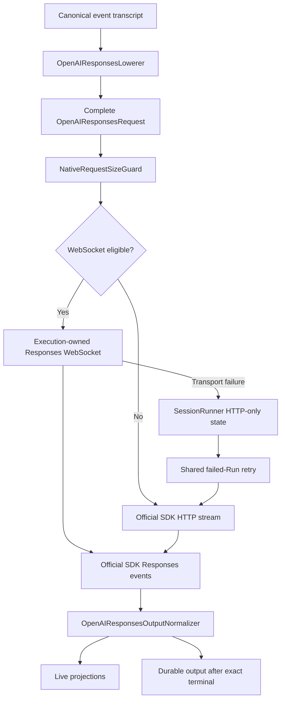

# OpenAI Responses WebSocket Transport Historical Decision Reconstruction

- Snapshot: `openai-260717`
- Status: historical reconstruction; not a newly accepted decision.
- Source Design: `docs/azents/design/openai-responses-websocket-transport.md`
- Original requester confirmation: not recorded in this reconstruction.

## Reconstructed Decisions

### openai-260717/ADR-D1 — Explicit decisions recoverable from the source Design

The following sections are copied only from explicit source Design text. No additional intent is inferred.

### Explicit source section: Transport Architecture

### Explicit source section: CI policy and skip/fail rules

- Unit and backend integration tests are mandatory and fail the PR on any error.
- Deterministic E2E remains mandatory where selected by the existing CI workflow.
- Live external tests run only through the repository's opt-in live workflow or maintainer authorization.
- An explicitly requested live run fails when credentials or prerequisite snapshots are missing; optional nightly runs may report prerequisite-not-ready as skipped.
- A terminal event other than the accepted exact typed boundary fails the live test rather than being accepted heuristically.

## Historical Unknowns

- Decision acceptance date, rejected alternatives, and requester confirmation are unknown unless explicit in the source.
