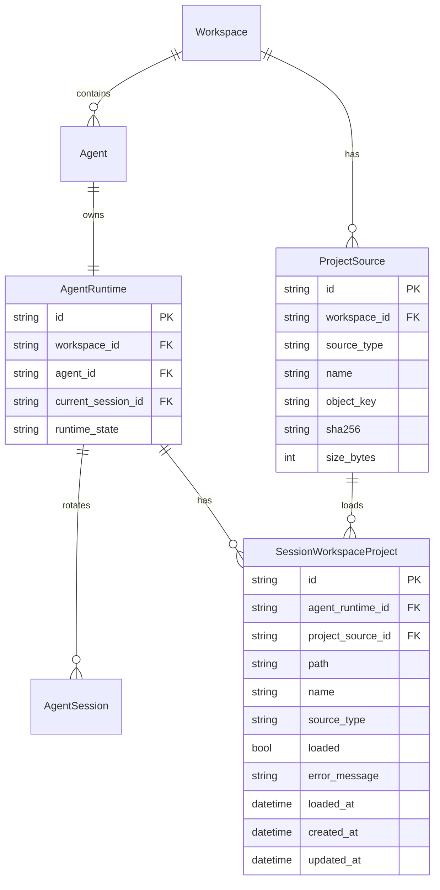
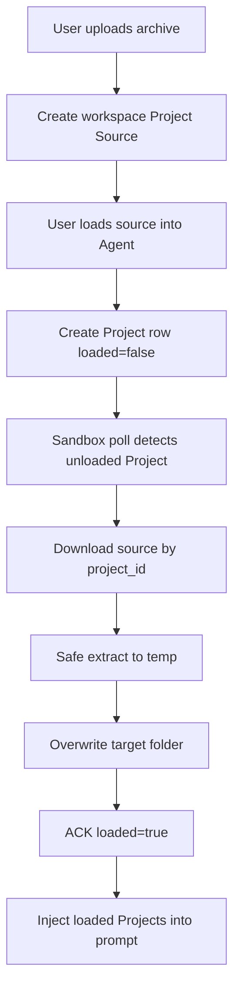

# Session Workspace Project Contract Historical Decision Reconstruction

- Snapshot: `projects-260509`
- Status: historical reconstruction; not a newly accepted decision.
- Source Design: `docs/azents/design/session-workspace-projects.md`
- Original requester confirmation: not recorded in this reconstruction.

## Reconstructed Decisions

### projects-260509/ADR-D1 — Explicit decisions recoverable from the source Design

The following sections are copied only from explicit source Design text. No additional intent is inferred.

### Explicit source section: Architecture

### Explicit source section: API / Tool contract

Initial implementation keeps backend API and engine tool contract at following level.

## Historical Unknowns

- Decision acceptance date, rejected alternatives, and requester confirmation are unknown unless explicit in the source.
