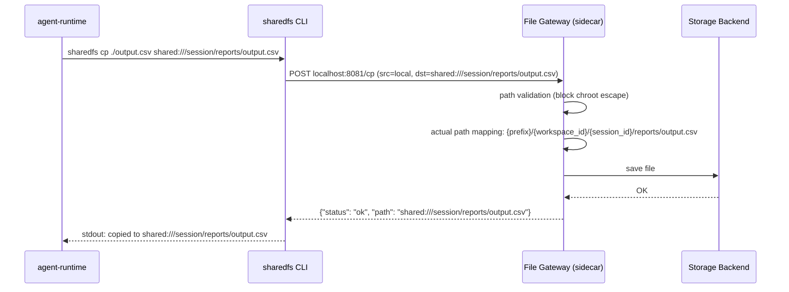

# Agent Sandbox Historical Decision Reconstruction

- Snapshot: `sandbox-260225`
- Status: historical reconstruction; not a newly accepted decision.
- Source Design: `docs/azents/design/agent-sandbox.md`
- Original requester confirmation: not recorded in this reconstruction.

## Reconstructed Decisions

### sandbox-260225/ADR-D1 — Explicit decisions recoverable from the source Design

The following sections are copied only from explicit source Design text. No additional intent is inferred.

### Explicit source section: Path policy: Chroot pattern

```
session root (fixed by platform, cannot be changed by agent)
  └── {prefix}/{workspace_id}/{session_id}/
        ├── reports/monthly/out.csv    ← agent free
        ├── data/cleaned.json          ← agent free
        └── chart.png                  ← agent free
```

- **Session root**: platform determines from `workspace_id` and `session_id`. Agent does not know this path.
- **Subpath**: agent may freely create directory structure.
- **Escape blocked**: access outside session root through `..`, absolute path, etc. is rejected.

When agent requests `shared:///session/reports/monthly/out.csv`, File Gateway internally maps it to `{prefix}/{workspace_id}/{session_id}/reports/monthly/out.csv`.

### Explicit source section: Architecture: File Gateway Sidecar

Add **File Gateway** sidecar to Sandbox Pod. `sharedfs` CLI talks to File Gateway on localhost, and File Gateway handles actual storage backend.



## Historical Unknowns

- Decision acceptance date, rejected alternatives, and requester confirmation are unknown unless explicit in the source.
