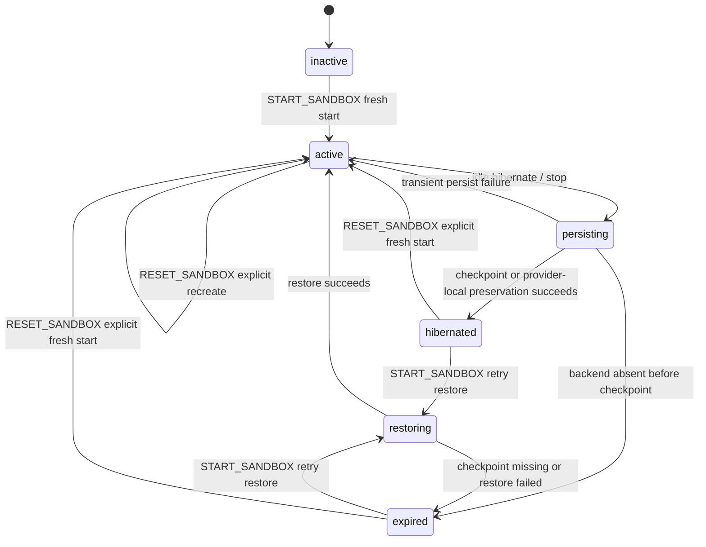

# Sandbox Restore Retry and Explicit Reset Historical Decision Reconstruction

- Snapshot: `sandbox-260524`
- Status: historical reconstruction; not a newly accepted decision.
- Source Design: `docs/azents/design/sandbox-explicit-restore-reset.md`
- Original requester confirmation: not recorded in this reconstruction.

## Reconstructed Decisions

### sandbox-260524/ADR-D1 — Explicit decisions recoverable from the source Design

The following sections are copied only from explicit source Design text. No additional intent is inferred.

### Explicit source section: State Contract

`EXPIRED` means the current durable source is missing, invalid, or unavailable for restore. It does not authorize automatic fresh allocation. Only `RESET_SANDBOX` may discard the failed durable state and create a new empty `/home/sandbox`.

### Explicit source section: API Contract

Session Workspace actions expose separate action types:

- `START_SANDBOX`: start fresh if no durable state exists, attach active runtime, or retry restore.
- `STOP_SANDBOX`: persist/hibernate an active sandbox.
- `RESET_SANDBOX`: discard current sandbox durable state and start an empty sandbox.

`GET /chat/v1/sessions/{session_id}/workspace`:

- `SANDBOX_INACTIVE` includes `start_action`.
- `HIBERNATED` includes `start_action` and `reset_action`.
- `RESTORE_FAILED` includes `start_action` and `reset_action`.
- `READY` includes `stop_action` and `reset_action`.

`POST /chat/v1/sessions/{session_id}/workspace/sandbox/start`:

- idempotently attaches/starts/resumes the AgentRuntime.
- may retry restore for `HIBERNATED` or `EXPIRED`.
- must not create an empty fresh sandbox for a `HIBERNATED` runtime whose checkpoint is missing.
- must not create an empty fresh sandbox after restore corruption/failure.

`POST /chat/v1/sessions/{session_id}/workspace/sandbox/reset`:

- requires the same session access check as start/stop.
- resets the AgentRuntime-owned sandbox, not only the current AgentSession view.
- removes local manager cache for the runtime.
- invalidates latest S3/RustFS checkpoint metadata if a checkpoint service is configured.
- deletes provider compute with `preserve_home=false`, even when the provider normally supports home preservation.
- starts a fresh empty sandbox and marks runtime `ACTIVE`.

Agent settings exposes the same reset operation by active session lookup:

- Web resolves the team primary session for the agent, then calls `resetSessionWorkspaceSandbox(sessionId)`.
- This keeps backend authorization/session ownership checks centralized in the Session Workspace API.

## Historical Unknowns

- Decision acceptance date, rejected alternatives, and requester confirmation are unknown unless explicit in the source.
