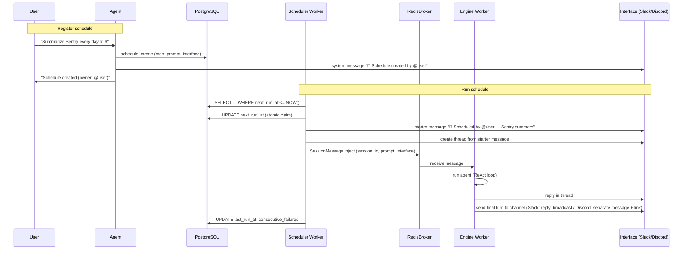
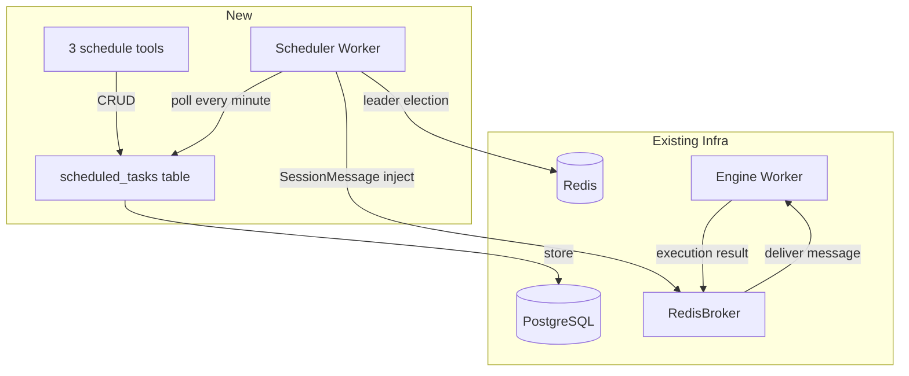

> 📌 **Related design document**: [scheduled-tasks.md](../design/scheduled-tasks.md)
>
> This document records design-stage discussion. See the linked document for the final design and implementation state.

# scheduled-260331/ADR: Scheduled Tasks Design

## Overview

This feature lets agents create and manage scheduled work by themselves.

- **Cron-based recurring execution** — "Summarize Sentry issues every day at 9 AM."
- **One-shot scheduled execution** — "Check deployment status tomorrow at 3 PM."

During a conversation, the agent calls a tool to register a schedule. At the specified time, the system creates a new session and triggers the agent.

## Discussion Points and Decisions

### 1. Session model for scheduled execution

**Decision: create a new session every time**

- Create `ConversationSession(type=SYSTEM)` for each fire.
- Deliver results to the interface as a new thread, such as Slack thread or Discord thread.
- Because each run is independent, previous execution context does not pollute the next one.

Rejected: reuse a fixed session. If comparing against previous execution results is needed, the agent can query the data directly with tools. It does not need to depend on session context.

### 2. Delivering execution results

**Decision: fixed original interface, with future Web fallback in mind**

- Store interface information from schedule creation time, such as channel ID.
- On fire, send a starter message to the channel → create thread → connect session.
- If delivery fails, log error and disable the schedule. Session data remains in DB.
- Web notification fallback can be added later.

### 3. Schedule storage

**Decision: PostgreSQL only**

- `scheduled_tasks` table with `next_run_at` index.
- Minute-level polling has sufficient precision.
- Schedule count is small, so Redis cache is unnecessary.

### 4. Schedule execution owner

**Decision: dedicated Scheduler Worker**

- Add `src/cli/scheduler.py` and a K8s Deployment.
- Redis SETNX-based leader election.
- Poll DB every minute → find schedules to run → inject SessionMessage into broker.
- Separate concerns from Engine Worker.

### 5. Agent tool interface

**Decision: use cron expressions directly, with upsert behavior**

Tool list:

- `schedule_create(cron | at, prompt, timezone)` — upsert behavior; same ID updates and transfers ownership.
- `schedule_list()` — all schedules for the current channel target, regardless of owner.
- `schedule_delete(schedule_id)` — can delete schedules targeting the current channel, regardless of owner.

One-shot uses ISO 8601 datetime through the `at` parameter. Cron validation is performed on the server.

### 6. Duplicate execution prevention

**Decision: atomic UPDATE at DB level**

```sql
UPDATE scheduled_tasks
SET next_run_at = {next_run_time}, last_run_at = NOW()
WHERE id = {id} AND next_run_at <= NOW()
```

If affected rows = 1, claiming succeeded. No separate lock is needed.

### 7. Execution history management

**Decision: summary fields + session reference**

- Add `last_run_at`, `consecutive_failures`, and `last_error` fields to `scheduled_tasks`.
- Add `scheduled_task_id` FK to `conversation_sessions`.
- No separate `schedule_runs` table is needed because sessions themselves are execution history.

### 8. Schedule expiration policy

**Decision:**

- **One-shot**: automatically delete after execution.
- **Cron**: no default expiration; automatically disable after 5 consecutive failures.
- Clean up by cascade when workspace is deleted.

### 9. Security and cost controls

**Decision:**

- **Ownership**: schedules belong to their creator. On upsert, ownership transfers to the caller to prevent privilege escalation.
- **Access scope**:
  - list/delete: same channel scoping, any channel member.
  - create/update: owner only.
- **Execution permission**: always run as the current owner's `user_id`, including toolkit authentication.
- **Permission visibility**:
  - Tool return values must include owner and permission guidance.
  - On upsert, adapter sends a system message to the channel.
  - On execution, starter message displays owner.
- **Toolkit access**: dynamic according to agent settings at execution time. Record as a risk; later add notification when toolkit settings change.
- **Limits**: limit schedules per workspace, minimum execution interval, and aggregate token usage at workspace level.

## Architecture

### Execution Flow



### Components



## Data Model

### scheduled_tasks table

```python
class RDBScheduledTask(Base):
    __tablename__ = "scheduled_tasks"

    id: Mapped[str] = mapped_column(sa.String(32), primary_key=True)
    workspace_id: Mapped[str] = mapped_column(
        sa.String(32),
        sa.ForeignKey("workspaces.id", ondelete="CASCADE"),
    )
    agent_id: Mapped[str] = mapped_column(
        sa.String(32),
        sa.ForeignKey("agents.id", ondelete="CASCADE"),
    )
    owner_user_id: Mapped[str] = mapped_column(sa.String(32))

    # Schedule definition
    schedule_type: Mapped[ScheduleType] = mapped_column(
        ENUM(ScheduleType, name="schedule_type", create_type=False),
    )  # "cron" | "once"
    cron_expression: Mapped[str | None] = mapped_column(sa.String(100))
    scheduled_at: Mapped[datetime | None] = mapped_column(sa.DateTime(timezone=True))
    timezone: Mapped[str] = mapped_column(sa.String(50))  # "Asia/Seoul"

    # Execution config
    prompt: Mapped[str] = mapped_column(sa.Text)

    # Result delivery, interface info JSON
    interface_context: Mapped[dict[str, object]] = mapped_column(sa.JSON)

    # State
    enabled: Mapped[bool] = mapped_column(sa.Boolean, default=True)
    next_run_at: Mapped[datetime | None] = mapped_column(sa.DateTime(timezone=True))
    last_run_at: Mapped[datetime | None] = mapped_column(sa.DateTime(timezone=True))
    last_error: Mapped[str | None] = mapped_column(sa.Text)
    consecutive_failures: Mapped[int] = mapped_column(sa.Integer, default=0)

    created_at: Mapped[datetime] = mapped_column(sa.DateTime(timezone=True))
    updated_at: Mapped[datetime] = mapped_column(sa.DateTime(timezone=True))

    IX_NEXT_RUN = sa.Index("ix_scheduled_tasks_next_run_at", "next_run_at")
    IX_WORKSPACE = sa.Index("ix_scheduled_tasks_workspace_id", "workspace_id")
    IX_AGENT = sa.Index("ix_scheduled_tasks_agent_id", "agent_id")

    __table_args__ = (IX_NEXT_RUN, IX_WORKSPACE, IX_AGENT)
```

### conversation_sessions change

```python
# Add FK to existing table
scheduled_task_id: Mapped[str | None] = mapped_column(
    sa.String(32),
    sa.ForeignKey("scheduled_tasks.id", ondelete="SET NULL"),
)
```

## Tool Implementation

### schedule_create (upsert)

```python
class ScheduleCreateInput(BaseModel):
    """Input for schedule_create tool."""

    cron: str | None = Field(
        default=None,
        description="Cron expression (e.g. '0 9 * * 1-5' for weekdays 9am)",
    )
    at: str | None = Field(
        default=None,
        description="ISO 8601 datetime for one-shot (e.g. '2026-04-01T15:00:00')",
    )
    prompt: str = Field(
        description="Message to send to the agent when the schedule fires",
    )
    timezone: str = Field(
        default="UTC",
        description="IANA timezone (e.g. 'Asia/Seoul', 'America/New_York')",
    )
    schedule_id: str | None = Field(
        default=None,
        description="Existing schedule ID for upsert. Omit to create new.",
    )
```

Example return:

```text
Schedule created: sch_a1b2c3d4
Cron: 0 9 * * 1-5 (Asia/Seoul)
Next run: 2026-03-31 09:00 KST
Owner: @username
⚠️ This schedule runs with @username's permissions and tool access.
```

### schedule_list

Return all schedules targeting the current channel, regardless of owner:

```text
ID              | Owner    | Schedule          | Prompt               | Next Run
sch_a1b2c3d4    | @alice   | 0 9 * * 1-5 KST   | Summarize Sentry     | 2026-03-31 09:00
sch_e5f6g7h8    | @bob     | once              | Check deployment     | 2026-04-01 15:00
```

### schedule_delete

Any channel member can delete a schedule targeting that channel.

## Scheduler Worker

### Main Loop

```python
async def run(self, shutdown_event: asyncio.Event) -> None:
    """Main loop for Scheduler Worker."""
    while not shutdown_event.is_set():
        if not await self._acquire_leader_lock():
            await asyncio.sleep(10)
            continue

        try:
            tasks = await self._poll_due_tasks()
            for task in tasks:
                claimed = await self._claim_task(task)
                if not claimed:
                    continue
                await self._fire_task(task)
        except Exception:
            logger.exception("Scheduler poll failed")

        await asyncio.sleep(60)
```

### fire_task flow

```python
async def _fire_task(self, task: ScheduledTask) -> None:
    """Run a schedule."""
    # 1. Send starter message to channel
    starter = await self._send_starter_message(task)

    # 2. Create thread
    thread_id = await self._create_thread(task, starter)

    # 3. Create new session
    session_id = await self._create_session(task, thread_id)

    # 4. Inject SessionMessage into broker
    await self.broker.send_message(
        SessionMessage(
            agent_id=task.agent_id,
            session_id=session_id,
            messages=[InputMessage(text=task.prompt, ...)],
            user_id=task.owner_user_id,
            additional_system_prompt=None,
            interface=task.interface_context,
            workspace_id=task.workspace_id,
            workspace_handle=...,
        )
    )
```

### Channel result delivery

Send the final turn's text to the channel as well:

- **Slack**: send thread message with `reply_broadcast=True`.
- **Discord**: send separate channel message and attach a link to the original thread message.

This logic is implemented in `DiscordAdapter` / `SlackAdapter`. It detects scheduled sessions and applies only to the final turn.

## Infrastructure

- **K8s Deployment**: `scheduler-worker`, replicas: 1, with leader election for HA.
- **DB Migration**: `scheduled_tasks` table + `conversation_sessions.scheduled_task_id` FK.
- No change to existing infrastructure; reuse PostgreSQL, Redis, and Broker.

## Risks

| Risk | Impact | Mitigation |
|--------|------|------|
| Scheduler Worker as single point of failure | Schedule execution delay | Redis leader election + K8s liveness probe for automatic recovery |
| Sensitive toolkit access | Schedule accesses a new toolkit without user awareness | Show owner in starter message + later add notification for toolkit changes |
| Cron expression error | Wrong schedule registration | Server validation + display next run time |
| Channel deletion | Result delivery failure | Disable after consecutive failures + keep session in DB |

## Implementation Plan

### Phase 1: Core

- `scheduled_tasks` DB model + migration.
- Add `conversation_sessions.scheduled_task_id` FK.
- Repository: CRUD + poll_due_tasks + claim_task.
- 3 schedule tools: create/list/delete.

### Phase 2: Scheduler Worker

- `src/cli/scheduler.py` main loop.
- Redis leader election.
- fire_task: starter message → thread → create session → broker inject.
- K8s Deployment.

### Phase 3: Interface Integration

- Slack adapter: support `reply_broadcast`.
- Discord adapter: channel result delivery + original link.
- Channel notification message on upsert.
- Show owner in starter message.

### Phase 4: Stabilization

- Consecutive failure disable logic.
- One-shot auto-delete.
- Workspace deletion cascade.
- Limits: schedules per workspace, minimum interval.
- Monitoring with Sentry and logs.

## Alternatives Reviewed

| Alternative | Reason Rejected |
|------|-----------|
| Redis Sorted Set store | Persistence uncertainty; PostgreSQL polling is enough |
| Scheduler inside Engine Worker | Singleton logic does not fit horizontally scaled Workers |
| Temporal Workflow | Not used in nointern and too large a dependency |
| Reuse fixed session | Data comparison can be solved with tools; session may grow too large |
| Structured fields such as interval/time/days | Limited expressiveness; cron is more general |
| Separate schedule_runs table | Session itself is execution history; duplicate |
| Agent permission independent of user | Toolkit auth is user-scoped, so user context is required |

## Migration provenance

- Historical source filename: `0023-scheduled-tasks.md`
- Source date basis: `adr.created`
- This ADR was reconstructed as a historical record; no new requester confirmation is implied.
