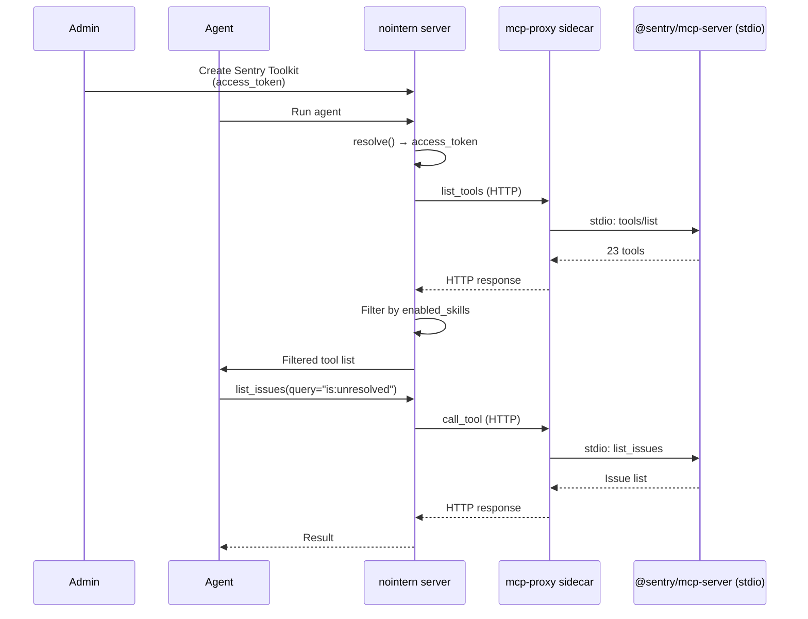

# Sentry Toolkit — access_token Mode (stdio via mcp-proxy) Historical Decision Reconstruction

- Snapshot: `sentry-260327`
- Status: historical reconstruction; not a newly accepted decision.
- Source Design: `docs/azents/design/sentry-toolkit-stdio.md`
- Original requester confirmation: not recorded in this reconstruction.

## Reconstructed Decisions

### sentry-260327/ADR-D1 — Explicit decisions recoverable from the source Design

The following sections are copied only from explicit source Design text. No additional intent is inferred.

### Explicit source section: Architecture

## Historical Unknowns

- Decision acceptance date, rejected alternatives, and requester confirmation are unknown unless explicit in the source.
