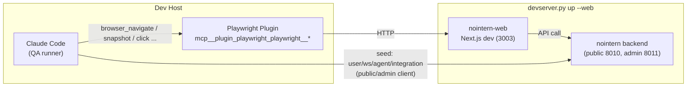

# Stage 4 (browser/web QA) Historical Decision Reconstruction

- Snapshot: `stage4-260410`
- Status: historical reconstruction; not a newly accepted decision.
- Source Design: `docs/azents/design/stage4-web.md`
- Original requester confirmation: not recorded in this reconstruction.

## Reconstructed Decisions

### stage4-260410/ADR-D1 — Explicit decisions recoverable from the source Design

The following sections are copied only from explicit source Design text. No additional intent is inferred.

### Explicit source section: Core Decisions (Discussion #2441)

| ID | Decision |
|---|---|
| **P1** | Caller of Playwright MCP is **Claude Code (QA runner)**. Do not touch nointern engine/toolkit code. |
| **P2** | Add only `devserver.py up --web`; do **not** add MCP server lifecycle such as `--playwright`. Enable Playwright plugin in `testenv/nointern/.claude/settings.json`. |
| **P3** | Scenarios use **runbook .md format**. Browser tests minimize API bypass and verify directly through UI. |
| **P4** | `seed/web.py` — storage state cache helper. Backend seed reuses existing helpers such as `seed/auth.py`. |
| **P5** | No need for browser_* matchers in `live/matchers.py` — Claude Code judges snapshot directly in its own context with natural language. |
| **P6** | Write all TC-WEB-001 ~ 005 (homepage smoke / login / chat / agent create / shell tool result). |

### Explicit source section: Architecture

Core:
- **Playwright caller is Claude Code itself**. There is no browser-related toolkit inside nointern.
- nointern-web communicates with nointern backend as usual (no change).
- testenv seeds only backend state (user, workspace, agent, model integration, ...) through nointern public/admin client. All UI manipulation is done directly by Claude Code through Playwright.

## Historical Unknowns

- Decision acceptance date, rejected alternatives, and requester confirmation are unknown unless explicit in the source.
