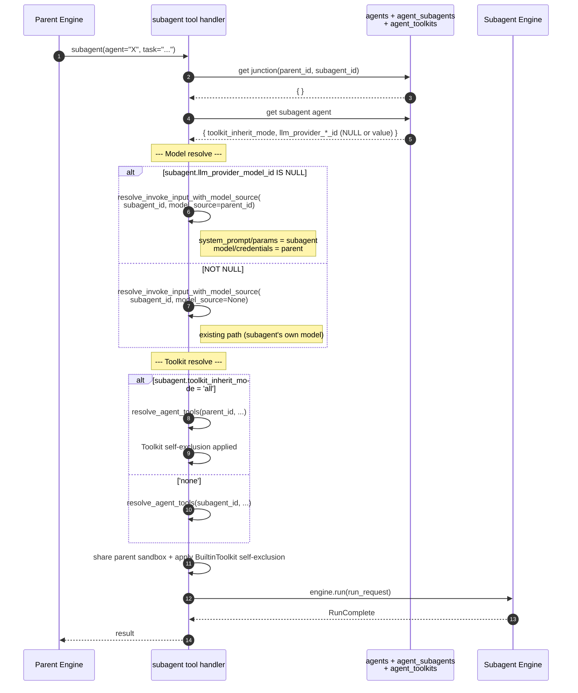

# Subagent Toolkit/Model Inherit Historical Decision Reconstruction

- Snapshot: `subagent-260424`
- Status: historical reconstruction; not a newly accepted decision.
- Source Design: `docs/azents/design/subagent-inherit-2026-04-24.md`
- Original requester confirmation: not recorded in this reconstruction.

## Reconstructed Decisions

### subagent-260424/ADR-D1 — Explicit decisions recoverable from the source Design

The following sections are copied only from explicit source Design text. No additional intent is inferred.

### Explicit source section: DP8. Cross-Workspace constraint

Existing `[integration-same-workspace]` rule: subagent and parent are in same workspace. Inherit happens only within same workspace, so there is no scope validation problem.

### Explicit source section: Architecture

**Change scope** (reflecting review #2976):
- DB:
  - add `agents.toolkit_inherit_mode` column (VARCHAR(10), NOT NULL, DEFAULT 'all') + update existing subagents with `UPDATE ... SET 'none'`
  - `agents.llm_provider_integration_id`, `llm_provider_model_id` NOT NULL → nullable + CHECK constraint
- Runtime:
  - `engine/tools/subagent.py` handler — branch model/toolkit source
  - add `toolkit_type` field to `ToolkitBinding` in `engine/engine.py`
  - add `resolve_invoke_input_with_model_source` helper in `engine/run/resolve.py`
- Service:
  - `services/agent/__init__.py` — pass `toolkit_inherit_mode` + allow subagent model NULL + pair validation
- API:
  - POST/PATCH agent (`toolkit_inherit_mode` + nullable llm_provider_*_id for subagent)
- Frontend:
  - Agent edit page (`AgentForm.tsx`) — "Inherit toolkits" + "Inherit model" checkboxes for subagent
- Spec: `domain/agent.md`, `domain/toolkit.md`, `flow/subagent-delegation.md`

## Historical Unknowns

- Decision acceptance date, rejected alternatives, and requester confirmation are unknown unless explicit in the source.
