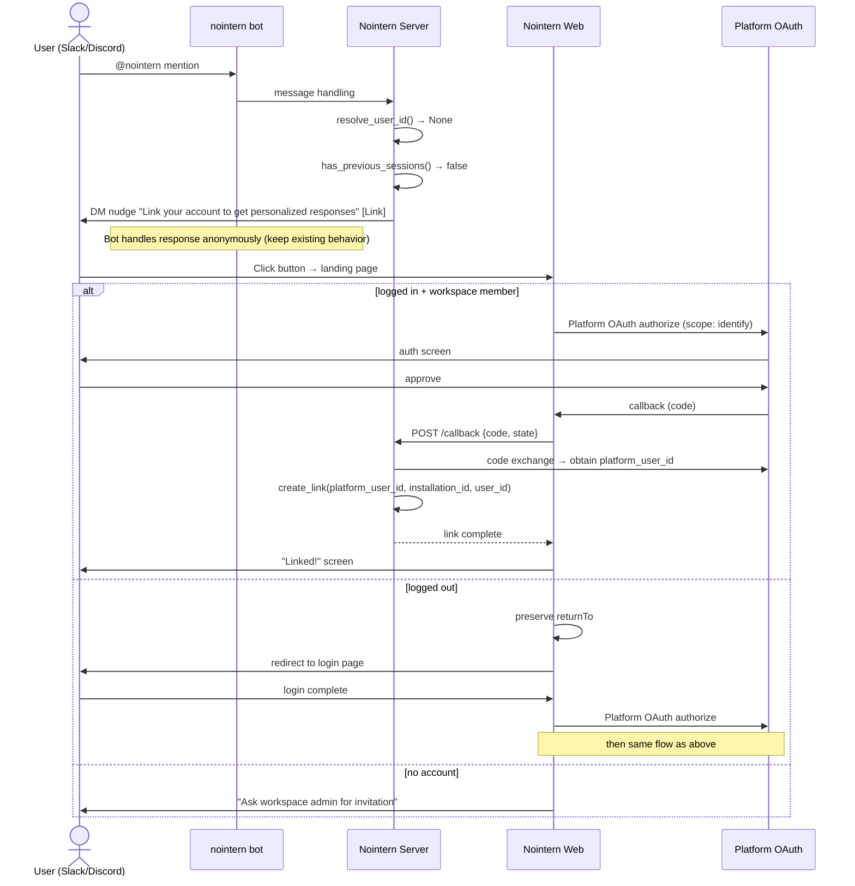
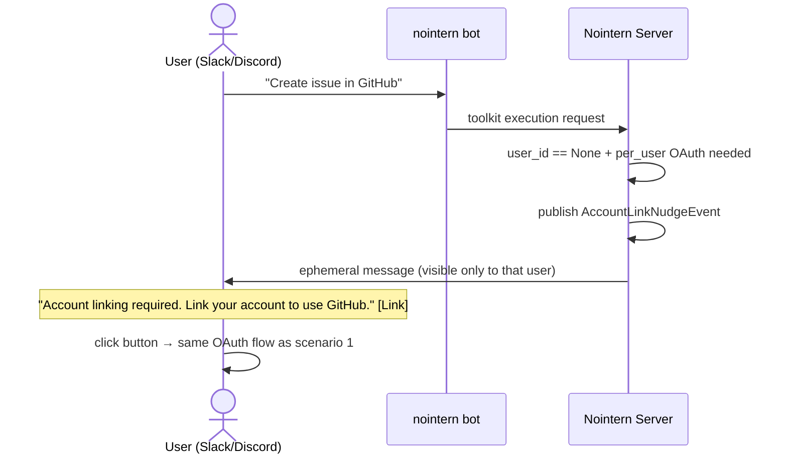
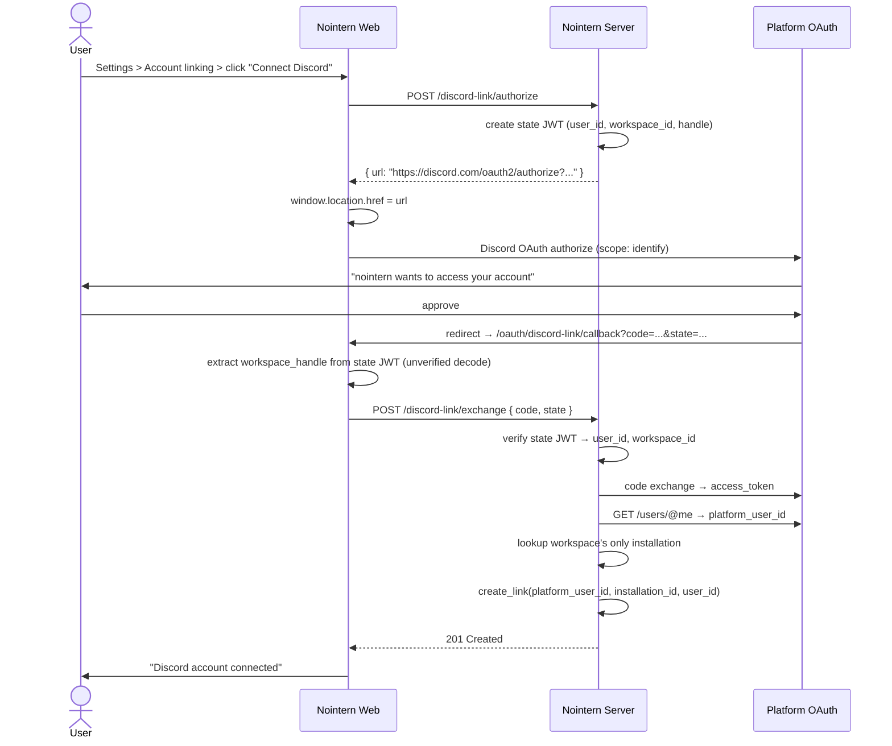
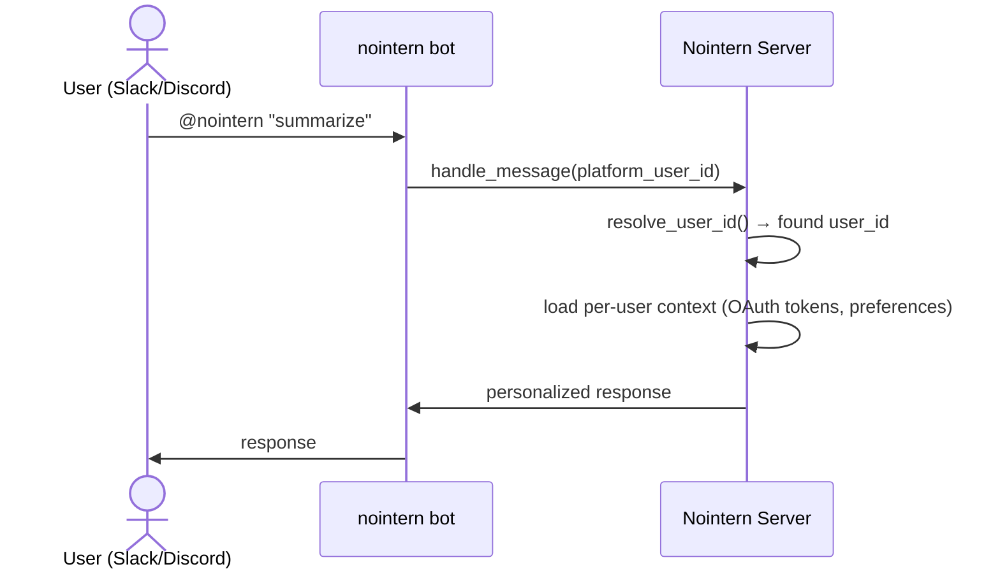

# External Platform Account Linking Design

## Overview

Design feature that links external platform user IDs such as Slack/Discord with nointern user ID. After linking completes, bot can identify the user on mention and provide personalized responses plus per-user OAuth toolkit usage.

## Design Principles

- **Single OAuth path**: verify user identity through platform OAuth. Existing link token (JWT) method is discarded.
- **Limit to one installation per workspace**: maximum one Discord guild and one Slack team per workspace. No installation selection UI needed.
- **Minimum OAuth scope**: use only Discord `identify` and Slack `users:read`.
- **Different entrypoints, same code path after OAuth**: nudge (platform → web) and reverse direction (web settings) share same infrastructure.

## Data Model

Use existing tables as-is.

- `discord_user_links`: `(installation_id, discord_user_id)` unique → nointern `user_id`
- `slack_user_links`: `(installation_id, slack_user_id)` unique → nointern `user_id`

### Mapping Policy

| Direction | Allowed | Rationale |
|------|------|------|
| 1 nointern user → Discord + Slack simultaneously | ✅ | natural multi-platform scenario |
| 1 platform account → 1 nointern user (per installation) | ✅ | `(installation_id, platform_user_id)` unique constraint |
| 1 platform account → N nointern users | ❌ | blocked by above unique constraint |

## Scenarios

### Scenario 1: Bot mention on platform → nudge → link

When user mentions nointern bot for first time in Slack/Discord, user receives account link nudge by DM and links account.

#### DM Nudge Message

- Discord: Embed + "Link" button (Link style)
- Slack: Section block + "Link" primary button
- URL: workspace-specific linking landing page (includes handle)

### Scenario 2: Inline nudge during toolkit use → link

Unlinked user receives inline nudge when trying to use per-user OAuth toolkit (GitHub, etc.) and links account.

#### Ephemeral Message

- **Slack**: use `response_type: ephemeral` or `chat_postEphemeral`
- **Discord**: use `flags: 64` (EPHEMERAL) flag
- Visible only to that user, so no security issue.

### Scenario 3: Reverse linking from Web

User with existing nointern account links platform account from web dashboard settings.

Slack uses same structure, only OAuth endpoint differs (`oauth.v2.access`, scope: `users:read`).

### Scenario 4: Normal interaction by linked user

## Logged-out User Branches

Branch handling on web landing page when nudge button is clicked:

| State | Behavior |
|------|------|
| logged in + workspace member | → Platform OAuth → link complete |
| logged in + not member | → error "You do not have access to this workspace" |
| logged out (account exists) | → login page (preserve returnTo) → after login OAuth → link |
| logged out (no account) | → login page → guide "Ask workspace admin for invitation" |

- `returnTo` allows only paths in same domain (prevent open redirect).
- Current signup is invitation-based, so self-signup flow for users without account is future design.

## OAuth Settings

### Scope

| Platform | Scope | Purpose |
|--------|-------|------|
| Discord | `identify` | user ID, username, avatar |
| Slack | `users:read` (user scope) | user identity |

Minimum scope principle. Since installation is one per workspace, guild/team list query is unnecessary.

### State Management

Follow existing `create_oauth_state()` / `verify_oauth_state()` pattern in `core/oauth2.py`:

- include `user_id`, `workspace_id` in AES-GCM encrypted state
- PKCE support (Discord does not support PKCE, so optional)

## Existing Code Changes

### To Remove

- `generate_link_token()` / `verify_link_token()` (both Discord and Slack)
- API endpoint using `CreateLinkRequest { token }`
- Current behavior of frontend `/discord/link?token=...`, `/slack/link?token=...` pages

### New API

| Endpoint | Description |
|----------|------|
| `POST /discord-user-link/v1/workspaces/{handle}/me/discord-links/authorize` | Return Discord OAuth authorize URL (auth required). redirect_uri is frontend callback page |
| `POST /discord-user-link/v1/workspaces/{handle}/me/discord-links/exchange` | Exchange OAuth code → create link (auth required). Called from frontend callback |
| `POST /slack-user-link/v1/workspaces/{handle}/me/slack-links/authorize` | Return Slack OAuth authorize URL (auth required). redirect_uri is frontend callback page |
| `POST /slack-user-link/v1/workspaces/{handle}/me/slack-links/exchange` | Exchange OAuth code → create link (auth required). Called from frontend callback |

> **Important**: OAuth callback `redirect_uri` points to fixed frontend paths (`/oauth/discord-link/callback`, `/oauth/slack-link/callback`). It must exactly match redirect URI registered in Discord/Slack Developer Console. Workspace information is extracted from JWT state.

Keep existing list / delete endpoints.

### Nudge Changes

- DM nudge: change URL from link-token URL to landing page URL.
- Inline nudge (`AccountLinkNudgeEvent`): switch to ephemeral message, include landing page URL.

## Web UI

### Account Settings Page

Account linking section inside workspace settings:

- Unlinked: platform icon + "Link" button
- Linked: platform icon + username + server/team name + "Unlink" button

### Link Success Screen

- Show platform icon + linked username
- Link back to workspace dashboard

## Prerequisite

- [Limit Installation count per workspace](../issues/installation-limit-per-workspace.md) — 1:1 guarantee is prerequisite of this design
