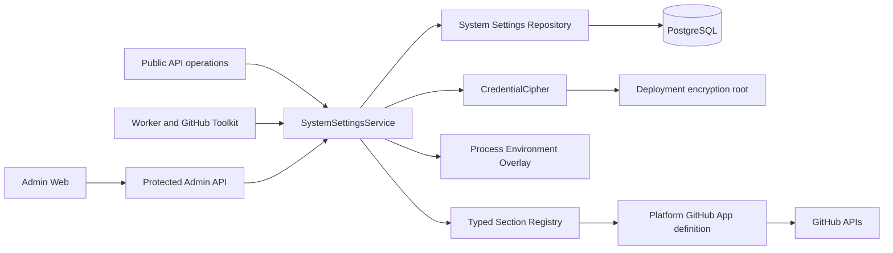
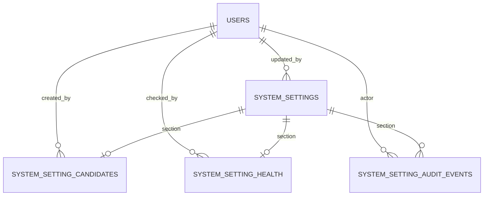
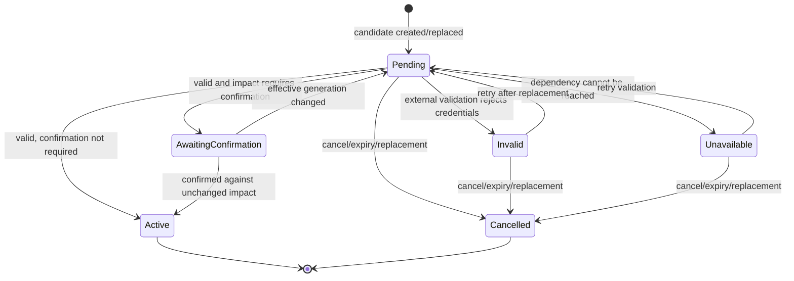

# Admin-Managed System Configuration Design

## Overview

Azents will add an instance-scoped System Settings capability managed through the Admin API and Admin Web.
The first section is the Platform GitHub App, but the storage, authorization, secret handling, validation,
activation, audit, and runtime-resolution paths are provider-neutral so later sections can reuse the same
lifecycle.

The design separates three configuration classes:

1. **Deployment configuration** is required before PostgreSQL-backed settings can be read or controls a
   deployment security boundary. It remains environment/Secret/GitOps managed.
2. **Admin-managed base configuration** is persisted in PostgreSQL and mutated only by a live
   database-backed `system_admin`.
3. **Environment overlays** are explicit field bindings for selected Admin-managed sections. A present
   environment variable overrides only its bound field without being copied into PostgreSQL.

The hard-to-reverse decisions are recorded in
[admin-260718/ADR](../adr/admin-260718-admin-configuration.md).

## Goals

1. Provide a reusable typed Section registry rather than a GitHub-specific settings store.
2. Make instance settings visible and manageable through the existing protected Admin surface.
3. Encrypt Admin-managed secrets and never return plaintext or a comparable secret fingerprint.
4. Support optimistic concurrency, external validation, impact confirmation, and metadata-only audit.
5. Resolve effective settings at consumer operation boundaries without requiring Redis or process restart
   for Admin-managed changes.
6. Preserve permanent field-level environment ownership for the four existing Platform GitHub App
   variables.
7. Detect GitHub App identity changes before external token exchange and preserve affected Toolkit
   configuration for reconnection.
8. Remove optional GitHub credentials from the Helm core auth Secret contract.
9. Preserve the current Admin bootstrap, system-role, final-admin, and Debug authorization invariants.
10. Define an implementation and E2E-first verification plan that can be delivered without an ambiguous
    mixed configuration state.

## Non-goals

- Move PostgreSQL, credential-encryption root, JWT material, process endpoints, object-storage connectivity,
  Runtime Control authentication, network policy, Kubernetes RBAC, or other deployment security boundaries
  into Admin-managed settings.
- Make Admin Web a Kubernetes, GitOps, Secret, RBAC, or NetworkPolicy management plane.
- Add `@azents/admin-client` to `typescript/apps/azents-web`.
- Expose bootstrap-token or Admin-managed secret plaintext after submission.
- Store arbitrary untyped key/value settings.
- Retain replayable historical setting or secret payload revisions.
- Require Redis, PostgreSQL `LISTEN/NOTIFY`, or a process-local cache for correctness.
- Automatically select a default Runtime Provider merely because one is registered or connected.
- Move the default Runtime Provider in the first Platform GitHub App delivery. The foundation must support
  it, but provider registration/default selection remains a later feature phase.
- Remove `Config.oauth_secret_key` or `Config.api_url` as part of the required GitHub cutover. Current code
  indicates they are cleanup candidates, but removal requires a separate implementation-time verification.
- Provide a transparent environment-to-Admin secret handoff by copying or duplicating environment values.

## Current Behavior and Constraints

### Process-lifetime configuration

`Config.from_env()` currently combines bootstrap/deployment inputs and product settings into one immutable
process configuration. `Config.github` holds the four Platform GitHub App fields. The Public API OAuth
routes read those values directly, while `get_toolkit_registry()` captures the App ID and private key in a
process-lifetime `GitHubToolkitProvider`.

This means an Admin database write would not affect existing Public API or Worker processes unless all
consumers move behind a dynamic resolver.

### Current GitHub data

- `github_user_installations` records installation ownership by User and installation ID but does not bind
  a row to a Platform App identity.
- `GitHubSecretsAppPlatform` stores installation targets but does not record which Platform App produced
  them.
- Platform Toolkit ownership validation checks only `(user_id, installation_id)`.
- Platform installation tokens are issued from App credentials captured in the Toolkit provider at
  registry construction.
- Toolkit API responses expose only `has_credentials`; there is no Platform App binding status.

An App ID change can therefore combine an installation created by one App with credentials for another App
and fail only after making an external request.

### Admin authorization

All protected Admin routers are mounted through the existing `get_system_admin` dependency. That dependency
uses the ordinary Azents user JWT and a live PostgreSQL `system_admin` assignment. System Settings routes
must use this default protected mount and must not create a second Admin credential path.

### Helm secret contract

The current `secrets.existingSecrets.auth` helper injects JWT, credential-encryption, Sentry, OAuth, and all
four GitHub Platform fields from one Secret. The GitHub keys are therefore operationally required whenever
the shared Secret is used even though the feature is optional.

## Configuration Ownership Boundary

### Deployment-controlled configuration

The following stay outside System Settings because they are needed before System Settings can be read,
anchor application trust, define process identity/topology, or enforce deployment security:

- PostgreSQL connection and authentication;
- credential-encryption root key;
- JWT signing material and algorithm;
- initial Admin bootstrap token source;
- Redis and object-storage connectivity/credentials;
- service bind addresses, internal/public endpoints, and deployment identity;
- Runtime Control authentication and provider deployment credentials;
- logging and telemetry bootstrap, including Sentry delivery configuration;
- Runtime Provider image, namespace, ServiceAccount, RBAC, storage, and network policy;
- MCP egress proxy and other deployment network boundaries;
- testenv-only flags.

Admin inventory may report redacted configured/health state for these values in a future phase, but the
Admin API cannot read or mutate their values.

### Admin-managed configuration

A value belongs in System Settings when PostgreSQL is already available and the value represents
instance-wide product policy or an optional platform integration. Initial and planned examples are:

- `platform_github_app`;
- default Runtime Provider selection after a durable provider registry exists;
- registration and signup-token policy;
- selected email behavior and canonical product URLs;
- file-retention policy.

Each later section needs its own design validation for application timing and security. Registration of a
section does not automatically make every existing environment field Admin-managed.

### Environment overlays

A registered field may retain a permanent environment binding. An environment variable is an authoritative
process-local overlay when it is present, including when its value is empty. It is not an import source or
fallback layer.

For the first section, the permanent bindings are:

| Section field | Environment variable | Sensitive |
|---|---|:---:|
| `app_id` | `AZ_GITHUB_PLATFORM_APP_ID` | No |
| `private_key` | `AZ_GITHUB_PLATFORM_PRIVATE_KEY` | Yes |
| `client_id` | `AZ_GITHUB_PLATFORM_CLIENT_ID` | No |
| `client_secret` | `AZ_GITHUB_PLATFORM_CLIENT_SECRET` | Yes |

A field with a present overlay is read-only in the Admin API and UI. Removing the variable and restarting
the affected process reveals the stored Admin base value. If no base value exists, the field becomes
unconfigured. No API prepares a duplicate shadow value while the environment binding remains present.

## Target Architecture



Consumers receive an immutable resolved snapshot for one operation. They do not access raw rows, generic
JSON dictionaries, or `Config.github`.

## Typed Section Registry

### Definition contract

The registry is constructed through dependency injection and contains one definition per compiled section.
It is not a mutable runtime plugin table or a module-level singleton. A definition provides:

- stable Section key and display metadata;
- current schema version;
- typed Admin base config and secret models;
- field descriptors, sensitivity, and environment bindings;
- local parsing and cross-field validation;
- activation capability (`direct`, `validated`, or dynamically `confirmed`);
- external candidate validator;
- current effective health checker;
- impact analyzer and confirmation behavior;
- candidate retention duration;
- redacted Admin response projection.

The provider-neutral service owns persistence, concurrency, encryption, candidate replacement, activation,
audit, and resolution. The domain definition owns GitHub-specific schemas, GitHub calls, identity semantics,
and impact analysis.

### Schema versions

Every persisted current or candidate row records the Section schema version. Reads require a registered
migration path when the stored version is older than the compiled definition. A newer stored version fails
closed because an older process cannot safely interpret it.

Incompatible schema changes use an explicit application data migration, especially when encrypted payloads
must be transformed. Consumers do not silently rewrite rows during ordinary reads. The first
`platform_github_app` schema is version `1`.

## Persistence Model

### Entity relationship



The diagram expresses logical Section relationships. A candidate or health row may exist for Section
version `0` before an Admin base row exists, so those relationships are not implemented as mandatory
foreign keys to `system_settings`.

### `system_settings`

One current Admin-managed base row per Section:

| Column | Contract |
|---|---|
| `section` | Primary key using the PostgreSQL `system_setting_section` enum |
| `schema_version` | Typed payload schema version |
| `version` | Monotonic optimistic-concurrency version, starting at `1` on first activation |
| `config` | Non-sensitive Admin base JSONB |
| `encrypted_secrets` | Nullable encrypted complete secret payload |
| `secret_metadata` | Non-sensitive per-secret configured/last-changed metadata |
| `validation_status` | Nullable activation validation result (`valid` for externally validated current state) |
| `validated_generation` | Internal generation that passed activation validation |
| `validation_metadata` | Bounded sanitized domain metadata such as GitHub App slug |
| `validated_at` | Activation validation timestamp |
| `updated_by_user_id` | Nullable FK to `users`, `SET NULL` on user deletion |
| `created_at`, `updated_at` | Timezone-aware timestamps |

Absence means Admin base version `0`. The table does not store environment values, effective payloads, or
historical revisions. Activation validation fields describe the current effective Section only while
`validated_generation` matches the newly resolved effective generation. On mismatch, the Admin projection
reports activation validation as stale and does not present its metadata as describing the current effective
configuration.

### `system_setting_candidates`

At most one candidate per Section:

| Column | Contract |
|---|---|
| `id` | UUID7-style stable candidate ID |
| `section` | Unique Section key |
| `schema_version` | Candidate payload schema version |
| `base_version` | Current Admin version from which the candidate was derived |
| `config` | Complete candidate Admin base non-secret payload |
| `encrypted_secrets` | Encrypted complete candidate secret payload |
| `secret_metadata` | Candidate secret presence/change metadata |
| `validation_status` | `pending`, `valid`, `invalid`, or `unavailable` |
| `validated_generation` | Internal opaque effective generation validated by the external check |
| `validation_code`, `validation_message`, `action_hint` | Sanitized operator diagnostics |
| `validation_metadata` | Bounded sanitized domain metadata such as the validated GitHub App slug |
| `impact` | Redacted domain impact report; never includes setting values or secrets |
| `created_by_user_id` | Nullable actor FK |
| `created_at`, `updated_at`, `expires_at` | Candidate lifecycle timestamps |

A new candidate transactionally replaces the previous candidate and its ciphertext. The initial Platform
GitHub App candidate TTL is 24 hours. Expired candidates cannot be confirmed or retried and are deleted on
read/mutation cleanup or scheduled maintenance.

### `system_setting_health`

One latest explicit current-effective health result per Section:

| Column | Contract |
|---|---|
| `section` | Primary key |
| `effective_generation` | Internal generation checked by this result |
| `status` | `healthy`, `invalid`, or `unavailable` |
| `code`, `message`, `action_hint` | Sanitized diagnostics |
| `metadata` | Bounded sanitized domain metadata such as the checked GitHub App slug |
| `checked_by_user_id` | Nullable actor FK |
| `checked_at` | Check timestamp |

A stored health result is current only when its generation matches the newly resolved effective generation.
A mismatch is reported as `not_checked`; stale health never describes a new configuration. Runtime consumer
failures do not automatically overwrite this row in the first delivery.

### `system_setting_audit_events`

Append-only metadata events record:

- Section and event type;
- previous/new Admin version when applicable;
- actor and source (`admin_api`, `application_migration`, or `system`);
- changed non-secret field names;
- secret field actions (`replace` or `clear`) without values;
- validation result and candidate ID;
- whether impact was confirmed and which redacted action was chosen;
- timestamps and bounded non-sensitive metadata.

Audit events never contain config values, environment values, ciphertext, secret presence fingerprints,
request bodies, or effective generation. Environment overlays do not mutate PostgreSQL and therefore do not
create audit events merely because a process restarted with different values.

### `system_data_migrations`

Application migrations that require services such as `CredentialCipher` use a generic marker table:

| Column | Contract |
|---|---|
| `name` | Primary key migration name |
| `outcome` | `applied` or `skipped` |
| `metadata` | Non-sensitive counts/reason code only |
| `completed_at` | Completion timestamp |

A transaction-scoped advisory lock serializes each migration. The marker is inserted in the same
transaction as all transformed data. Failure rolls back both data and marker.

## Secret Handling

### Encryption

The existing deployment-controlled `CredentialCipher` encrypts a canonical JSON serialization of the
complete typed secret payload. Current and candidate ciphertexts are separate. Activating a candidate
replaces current ciphertext and deletes the candidate; superseded ciphertext is not retained for rollback.

The credential-encryption root remains deployment-controlled. System Settings cannot configure the key
needed to decrypt System Settings.

### Mutation semantics

Non-secret fields use patch semantics:

- omitted field: keep the stored Admin base value;
- explicit non-secret `null`: set the Admin base field to null;
- explicit value: replace the Admin base field.

Secret fields use explicit action objects and never overload null or placeholders:

```json
{
  "private_key": {"action": "replace", "value": "..."},
  "client_secret": {"action": "clear"}
}
```

- omitted secret field: keep the stored Admin secret;
- `replace`: validate plaintext and replace it;
- `clear`: remove it;
- `null`, empty masked placeholders, and returned response data are not secret actions.

Plaintext is accepted only on mutation requests, held for validation/resolution, encrypted before durable
storage, and excluded from logs, traces, Sentry context, errors, audit, and responses.

### Read projection

Admin reads expose:

- whether a secret is effectively configured;
- source (`admin`, `environment`, or `unset`);
- environment variable name when bound;
- whether a shadowed Admin fallback exists;
- fallback last-changed time;
- validation/health status.

They do not expose plaintext, prefixes, suffixes, length, hashes, public fingerprints, or effective
generation.

## Effective Resolution

### Resolution algorithm

For one Section read:

1. Load the current Admin base row, treating absence as version `0` and empty optional base fields.
2. Decrypt and parse current Admin secrets when present.
3. Read the registered environment bindings from the actual process environment.
4. Overlay each present environment value on its bound field. Presence, not truthiness, selects the source.
5. Parse and cross-validate the complete effective typed Section.
6. Produce field source metadata and an immutable internal resolved snapshot.
7. Calculate the effective generation from the complete effective typed payload.

An empty environment value remains authoritative and normally makes the effective Section invalid or
incomplete. The resolver never falls through to the Admin value because parsing failed.

### Effective status

The common inventory status is derived rather than stored:

- `not_configured`: no effective field is configured;
- `incomplete`: some required effective fields are absent;
- `invalid`: effective typed/local validation fails, or a matching explicit health result reports that the
  external credentials or identity are invalid;
- `ready`: effective local validation succeeds and no matching unavailable/invalid health result exists;
- `unavailable`: a matching explicit health result reports an external dependency outage;
- `reconnect_required`: the Section is usable for new bindings, but existing domain resources are bound to
  a different or unknown identity and the response reports affected counts.

Candidate state is reported separately and never replaces current effective status before activation.

### Effective generation

The generation is an opaque HMAC-SHA-256 digest over canonical JSON containing:

- Section key;
- Section schema version;
- complete effective non-secret config;
- complete effective secret payload.

The HMAC key is derived from deployment-controlled root material with a domain-separated label such as
`azents/system-settings-effective-generation/v1`. Source labels, Admin version, timestamps, audit metadata,
and health metadata are excluded. Therefore equivalent effective values have the same generation even when
the Admin version or source changes, while any effective secret/config change produces a different
generation.

The generation is internal. It may be stored inside encrypted/signed protocol state or candidate metadata
but is never returned through Admin APIs or logs.

### Operation boundaries

The initial implementation performs a PostgreSQL read at each coherent settings-dependent operation:

- Platform GitHub App install URL creation;
- Platform GitHub App OAuth start;
- OAuth callback/code exchange;
- each Platform GitHub App installation-token issuance;
- Platform Toolkit create/update ownership validation;
- Admin inventory/detail/mutation/health operations.

A single operation keeps one resolved snapshot in memory. Lower-level calls in that operation do not
re-read settings. The next operation resolves again.

No process-local TTL cache, Redis invalidation, or PostgreSQL notification listener is added initially.
`SystemSettingsService` remains the abstraction boundary if measured load later justifies an optional
cache.

### Multi-stage protocols

OAuth start writes the `platform_github_app` effective generation into the existing encrypted OAuth state.
The callback:

1. decrypts and validates the state;
2. resolves the current effective Section;
3. compares generations before exchanging the code;
4. returns `409 Conflict` with stable code `system_setting_changed` when they differ.

The user restarts OAuth. The system does not retrieve an old secret or continue with mixed credentials.

## Candidate, Validation, and Activation Lifecycle



`AwaitingConfirmation` is represented by `validation_status=valid` plus a non-null impact requiring a
confirmation action.

### Mutation sequence

1. Acquire a transaction-scoped Section advisory lock.
2. Read the current version and require the request's `expected_version`.
3. Reject writes to fields whose environment overlay is present in the Admin API process.
4. Merge non-secret patch fields and explicit secret actions into the current Admin base.
5. Apply environment overlays and run complete typed/local validation.
6. For `direct`, activate in the same transaction, increment version, and append audit.
7. For `validated`/`confirmed`, replace the Section candidate and append candidate audit, then commit.
8. Run external validation outside the database transaction.
9. Reacquire the Section lock and update the same candidate only if its ID and base version remain current.
10. If valid without confirmation, activate atomically and copy the validated generation and sanitized
    metadata to the current row. If confirmation is required, persist the redacted impact, validated
    effective generation, and sanitized validation metadata on the candidate.

External `unavailable` is retryable and does not mean invalid credentials. Unexpected internal failures
propagate as failures rather than being converted to a successful response.

### Confirmation sequence

Confirmation requires candidate ID and expected current version. The service recomputes the effective
generation and domain impact under the Section lock.

- generation mismatch: return `409 candidate_effective_setting_changed` and require validation again;
- current version mismatch: return `409 stale_system_setting_version`;
- impact differs from the validated report: return `409 system_setting_impact_changed` with the refreshed
  redacted report;
- unchanged valid impact: apply the chosen confirmation action, activate with the candidate's validated
  generation and sanitized metadata, increment version, delete the candidate, and append audit in one
  transaction.

## Platform GitHub App Section

### Typed models

Admin base fields are all nullable so mixed Admin/environment ownership and an unconfigured state can be
represented:

- non-secret config: `app_id`, `client_id`;
- encrypted secrets: `private_key`, `client_secret`.

The effective operational model requires all four fields to be present and valid. App ID is the sole
installation identity key. Private key and OAuth credentials may rotate without changing installation
identity.

### External validation

A complete candidate is validated without retaining a user OAuth token:

1. Create a GitHub App JWT with the effective App ID/private key.
2. Call the authenticated App endpoint and verify the returned App ID and Client ID match the effective
   values; record only sanitized App slug/identity metadata needed for display.
3. Validate the Client ID/client secret pair against the OAuth token endpoint using a random nonexistent
   authorization code. The expected authenticated-client result is a bad verification code; incorrect
   client credentials invalidate the candidate.
4. Classify network/rate-limit/provider outages as `unavailable`.

No validation response body that might contain a secret is persisted or logged. The domain maps provider
responses to stable sanitized codes and action hints.

### Dynamic activation capability

- App ID unchanged and no ambiguous legacy binding: `validated`, automatically activate on success.
- App ID changed with affected installation records or Platform Toolkits: `confirmed`.
- First App configuration with unbound legacy records: `confirmed` so the Admin explicitly chooses whether
  to claim them.
- App ID change with no affected resources: validated activation may proceed without confirmation.

Impact reports include only counts and stable identifiers suitable for Admin navigation:

- affected Users;
- installation records;
- Platform Toolkits;
- Agents attached to those Toolkits;
- unbound legacy installation/Toolkit counts;
- current source of App ID (`admin` or environment).

### GitHub binding changes

`github_user_installations` gains nullable `platform_app_id`. Bound and unbound uniqueness is enforced with
explicit partial unique indexes so legacy null rows remain deterministic.

`GitHubSecretsAppPlatform` gains nullable internal `app_id`. New Toolkit creates/updates never trust an App
ID from the browser: the backend resolves the current effective App ID and writes it beside the selected
installation targets before encryption. A nullable field is retained so pre-migration credentials can be
parsed and reported as unbound.

OAuth installation synchronization becomes App-aware:

- OAuth state generation must match at callback;
- synchronized rows are written with the effective App ID;
- deletion only removes rows absent from the same App's latest user installation list;
- a verified OAuth reconnect may replace a matching unbound legacy row with a bound row.

Toolkit ownership validation requires `(user_id, effective_app_id, installation_id)`. Platform Toolkit
resolution and every installation-token issuance compare credential `app_id` with the current effective App
ID before any GitHub token call.

### Reconnect behavior

A mismatched or null Toolkit App binding is exposed through the Public Toolkit response as a redacted
authorization state:

```json
{
  "type": "github_platform_app",
  "status": "reconnect_required",
  "reason": "app_identity_changed"
}
```

The alternate reason is `legacy_binding_unbound`. Toolkit name, slug, toolsets, prompt, runtime-environment
preference, and installation metadata remain stored. The engine does not call GitHub with mismatched App
credentials; the affected Toolkit contributes no GitHub tools until a Workspace manager reconnects and
updates its installation targets.

This authorization state is a Public API product projection and requires public OpenAPI/client regeneration.
It does not expose Admin settings or require `@azents/admin-client` in Main Web.

### Environment App ID changes

An environment-provided App ID change cannot pass through Admin confirmation. After restart:

- the resolver uses the new environment value;
- existing bound rows/Toolkits compare unequal and become `reconnect_required`;
- Admin detail reports affected counts and that App ID is environment-managed;
- no records are deleted or automatically rebound.

### Legacy binding data migration

A schema migration first adds nullable binding fields and the System Settings tables. A shared application
migration runner then executes `bind_legacy_platform_github_app_v1` before serving from the Public API,
Admin API, and Worker entrypoints that all receive the Platform GitHub App environment overlay. The
Scheduler and ad hoc operator CLI commands do not decide or record this GitHub-specific migration outcome;
they do not consume that overlay after the Helm cutover.

Under one advisory lock and transaction:

1. If the migration marker exists, return.
2. Read the upgrade-time `AZ_GITHUB_PLATFORM_APP_ID` environment binding.
3. When absent, insert a `skipped` marker and leave all legacy bindings null. A later environment/Admin App
   does not trigger automatic claiming.
4. When present but empty or locally invalid, fail startup without a marker so the operator must remove or
   fix the deployment binding.
5. Bind unbound `github_user_installations` rows to that App ID.
6. List GitHub Toolkit rows, decrypt `github_app_platform` credentials, add the same App ID when unbound,
   and re-encrypt them.
7. Insert an `applied` marker containing only transformed row counts.

Any decryption/validation failure rolls back the whole migration and prevents consumers from running with a
partially bound dataset.

If the marker was skipped, an Admin candidate that first configures an App presents two explicit confirmed
actions:

- `claim_unbound_legacy`: assert that the candidate App is the pre-existing App and bind all still-unbound
  records/Toolkit credentials;
- `leave_unbound`: activate the App but leave legacy resources `reconnect_required`.

A normal user OAuth reconnect is also authoritative for the specific installations it returns. No private
key or client secret is copied from the environment during migration or claim.

## Service and Consumer Changes

### Backend modules

The implementation adds provider-neutral modules equivalent to:

- `azents/rdb/models/system_setting.py`;
- `azents/repos/system_setting/`;
- `azents/services/system_setting/`;
- `azents/api/admin/system_setting/v1/`;
- a typed Section definition under the GitHub domain;
- common application data-migration initialization.

Routes call services, services call repositories, and repositories own SQLAlchemy. The generic repository
stores persistence DTOs; it does not parse GitHub schemas.

### `SystemSettingsService`

The internal service exposes typed operations such as:

- list redacted inventory;
- read one redacted Admin projection;
- patch/create candidate with expected version;
- retry validation;
- confirm or cancel candidate;
- check current effective health;
- resolve a typed effective Section snapshot for consumers.

The consumer resolver returns a frozen, non-serializable domain value containing typed config/secrets,
field source metadata, Admin version, schema version, and effective generation. It is never used as an API
response model.

### GitHub consumer cutover

- Remove GitHub fields from `Settings`, `GitHubConfig`, and `Config.github` after the data migration and
  System Settings resolver are available.
- `get_toolkit_registry()` injects `SystemSettingsService` into `GitHubToolkitProvider`; it does not capture
  Platform secrets.
- Public install/OAuth routes resolve the Section at the operation boundary.
- Platform OAuth encrypted state carries the effective generation.
- `GithubUserInstallationRepository` becomes App-aware.
- Platform Toolkit create/update enriches internal encrypted credentials with the effective App ID.
- Platform token-provider closures resolve current settings at each token issuance and compare App ID before
  calling GitHub.
- `Config.web_url`, credential-encryption root, and MCP proxy remain deployment inputs because they are
  outside this Section.

## Admin API

### Route structure

Mount a protected `system-setting` Admin module through the existing default Admin guard.

| Method | Path | Behavior |
|---|---|---|
| GET | `/system-setting/v1/sections` | List generic inventory/status |
| GET | `/system-setting/v1/sections/platform-github-app` | Read typed redacted detail |
| PATCH | `/system-setting/v1/sections/platform-github-app` | Patch Admin base and create/activate candidate |
| POST | `/system-setting/v1/sections/platform-github-app/candidate/validate` | Retry current candidate validation |
| POST | `/system-setting/v1/sections/platform-github-app/candidate/confirm` | Confirm unchanged validated impact |
| DELETE | `/system-setting/v1/sections/platform-github-app/candidate` | Cancel candidate and delete candidate ciphertext |
| POST | `/system-setting/v1/sections/platform-github-app/health-check` | Validate current effective setting without activation changes |
| GET | `/system-setting/v1/audit-events` | Paginated metadata-only audit projection |

The generic inventory is registry-driven. Typed Section mutations use explicit static routes and schemas so
OpenAPI and generated clients preserve field types; the backend does not accept arbitrary Section JSON at a
dynamic path.

### Request contract

The Platform patch request contains:

- `expected_version` (`0` when no Admin base exists);
- optional nullable `app_id` and `client_id` patch fields;
- optional explicit `private_key` and `client_secret` secret actions.

Supplying an environment-managed field returns `409 Conflict` with stable code
`environment_managed_system_setting_field`. Stale current or candidate state also returns stable `409`
codes. Local schema errors return `422`. External `invalid`/`unavailable` results are candidate states in a
successful typed response, not hidden transport failures.

### Response contract

The detail response includes:

- Section/schema/Admin versions;
- effective status;
- per-field redacted value/source/fallback metadata;
- candidate ID, age, expiry, validation, and redacted impact;
- latest current-effective health state;
- environment-ownership warnings;
- GitHub App slug and affected binding counts when known.

It excludes effective generation and all secret material.

### Client generation

Any implementation PR that changes these routes or the Public Toolkit response must regenerate and commit:

1. Admin/Public OpenAPI specs with `uv run python src/cli/dump_openapi.py` from
   `python/apps/azents`;
2. Python Admin/Public clients with `make generate` in each client library;
3. TypeScript Admin/Public clients with the corresponding filtered `pnpm run generate` commands.

Generated files are never edited manually.

## Admin Web UX

### Navigation and inventory

Add **System Settings** to the existing Admin sidebar. The landing page groups registry entries by:

- editable in Admin;
- partially or fully managed by deployment environment;
- deployment-controlled read-only status;
- not configured or unavailable.

The first editable card is **Platform GitHub App**. The inventory does not imply that deployment-controlled
values can be changed from Admin.

### Platform GitHub App form

- Show App ID and Client ID values because they are non-secret.
- Show secret fields as configured/unconfigured with Replace and Clear actions; never prefill them.
- Show a source badge per field.
- Disable environment-owned fields and identify the exact environment variable.
- When an environment override shadows an Admin value, show fallback presence and age plus a warning that
  removal/restart will reactivate it.
- Never offer a hidden preparation/handoff form for an environment-owned field.
- Show candidate validation state, retry, cancel, expiry, and current-setting health check separately.
- Require a deliberate confirmation panel for App identity changes or unbound legacy claims, including
  affected counts.
- Explain that `leave_unbound` preserves Toolkit configuration but requires Workspace managers to reconnect.

### Environment-to-Admin handoff

The UI documents an operational sequence rather than implementing secret duplication:

1. inspect whether a shadowed Admin fallback already exists;
2. remove the selected environment binding from all relevant process deployments;
3. restart Public API, Admin API, and Worker processes consistently;
4. submit the now-editable Admin field if no fallback exists;
5. validate and activate the Section.

An unconfigured maintenance interval is expected when no fallback exists.

### Frontend architecture

The Admin Web follows its existing page/container/component pattern and calls the Admin API through the
regenerated `@azents/admin-client` inside a protected tRPC router. Meaningful pure UI states receive static
stories where the frontend conventions require them. Main Web receives only the Public Toolkit
authorization-state projection through `@azents/public-client`.

## Helm Design

### Values

Add a dedicated optional block under `server`, for example:

```yaml
server:
  platformGitHubApp:
    existingSecret: ""
    appIdKey: github-platform-app-id
    privateKeyKey: github-platform-private-key
    clientIdKey: github-platform-client-id
    clientSecretKey: github-platform-client-secret
```

`existingSecret: ""` disables all four injections. Key names are configurable, and setting an individual
key name to `""` omits only that environment binding so mixed environment/Admin ownership remains
possible. Chart defaults contain no secret literals.

### Rendering

A helper conditionally renders each of the four existing `AZ_GITHUB_PLATFORM_*` names from the dedicated
Secret block when both `existingSecret` and that field's key name are non-empty. A rendered reference is
required; an omitted key name means that environment variable is absent rather than an optional lookup of a
missing Kubernetes Secret key. The helper is included in:

- Public API;
- Admin API;
- Worker.

The scheduler does not need the GitHub Section or participate in the GitHub binding migration unless a
future scheduled GitHub consumer is added. The same block is applied consistently to every current consumer
so intended source ownership does not vary by process.

Remove GitHub keys from `azents.serverAuthSecretEnv` and related render expectations. Keep the
README/NOTES core auth key lists aligned with the resulting non-GitHub contract.
`secrets.existingSecrets.auth` remains responsible only for its actual bootstrap/security roots and
separately reviewed optional fields. Existing deployments move the Secret name into the new block during
chart upgrade; there are no alias values or automatic chart import.

Update `values.schema.json`, README, NOTES, and Helm render tests. ArgoCD consumer values must account for
whole-object `valuesObject` replacement when adding the new block.

## Security and Failure Handling

- Every System Settings Admin operation requires live `system_admin` authorization.
- Bootstrap routes cannot read or write System Settings.
- Final-system-admin revoke/delete protection and `/debug/v1` protection remain unchanged.
- Secret-bearing request bodies and headers are redacted from application/reverse-proxy/Sentry logging.
- Audit and validation diagnostics use stable sanitized codes, not raw provider bodies.
- Optimistic concurrency and one Section advisory lock prevent stale candidate activation.
- Candidate validation occurs outside long database transactions; activation rechecks all persisted and
  environment-dependent preconditions.
- A GitHub outage marks validation/health `unavailable`; it does not delete or roll back current settings.
- A malformed effective environment overlay fails closed and does not expose/use the shadowed Admin value.
- Missing or invalid current Platform settings produce the existing user-facing not-configured behavior;
  they do not fall back to removed static `Config.github` values.
- A binding mismatch is detected before GitHub token exchange.
- Redis failure has no effect on setting correctness.
- Root-key rotation remains a broader encrypted-credential concern and is not solved by this feature.

## Migration and Rollout Plan

### Phase 1 — Provider-neutral foundation

- Add PostgreSQL enums/tables, repositories, registry contracts, encryption/redaction, versions, candidates,
  health, audit, and application migration markers.
- Add service unit/repository tests and schema-version failure behavior.
- Keep existing GitHub consumers unchanged.

### Phase 2 — Admin API and generated Admin clients

- Add inventory and typed Platform GitHub App routes.
- Add candidate validation/confirmation/health behavior.
- Regenerate Admin OpenAPI and Python/TypeScript clients.
- Keep the UI absent until the API contract is stable.

### Phase 3 — Atomic GitHub binding and runtime cutover

Deliver these together so no supported state combines unbound resources with new runtime credentials:

- nullable App ID bindings and partial unique indexes;
- common application data migration;
- App-aware installation sync/ownership validation;
- internal App ID in Platform Toolkit credentials;
- dynamic settings resolution in Public API and Worker;
- OAuth generation checks;
- Public Toolkit authorization-state projection;
- removal of static `Config.github` and registry-time secret capture;
- Public OpenAPI/client regeneration.

### Phase 4 — Admin/Main Web UX and Helm cutover

- Add Admin System Settings inventory and Platform GitHub App page.
- Add Main Web reconnect-required presentation through the Public projection.
- Add the optional Helm `existingSecret` block and remove GitHub keys from the core auth contract.
- Update render tests, operator documentation, E2E fixtures, and current specs.

### Phase 5 — Validation and spec synchronization

- Run deterministic E2E and optional live GitHub coverage.
- Produce a validation report with sanitized evidence.
- Update living specs only after implementation reflects the target behavior.
- Mark this design `implemented` only after the cutover, validation report, and spec updates are complete.

Later Runtime Provider, auth-policy, email, and retention sections require separate product decisions and
should reuse the foundation rather than expanding the Platform GitHub App delivery implicitly.

## Test Strategy

### E2E primary verification matrix

| Scenario | Surface | Credential mode | Expected result |
|---|---|---|---|
| Fresh bootstrap then Admin inventory | Admin Web/API | none | GitHub Section is not configured; bootstrap invariants preserved |
| Admin-managed GitHub configuration | Admin Web/API + Public API + Worker | live GitHub test App | candidate validates/activates; OAuth and installation token use DB base |
| Full environment ownership | Admin/API/Worker | live or controlled env | fields are read-only, source-visible, and not persisted |
| Mixed field ownership | Admin/API/Worker | env + Admin | complete effective Section validates and operates consistently |
| Environment removal with fallback | restart matrix | controlled env | stored fallback becomes effective after restart |
| Environment removal without fallback | restart matrix | controlled env | Section is explicitly unconfigured until Admin submission |
| App ID change | Admin + Main Web | live GitHub test Apps or deterministic fixture | impact confirmation; existing Toolkits become reconnect-required without deletion |
| Upgrade with env App ID | migration startup | encrypted fixture | legacy rows/Toolkit credentials bind idempotently |
| Upgrade without env App ID | migration startup | encrypted fixture | skipped marker; legacy resources remain unbound until claim/reconnect |
| OAuth setting changes mid-flow | Public API | controlled mutation | callback returns `system_setting_changed` and does not exchange code |
| Concurrent Admin mutations | Admin API | none | one version wins; stale write/confirmation receives stable `409` |
| Unauthorized access | Admin API | ordinary User/Workspace OWNER | `403`; no setting metadata or secret state disclosed |
| Secret redaction | API/log/trace/audit | sentinel secrets | sentinel absent from responses, logs, audit, screenshots, and reports |
| Redis unavailable | API/Worker | controlled Redis outage | settings reads/writes and GitHub operations remain DB-correct |

### E2E plan

The browser-driven path is primary for Admin form/source/confirmation behavior and Main Web reconnect UX.
API assertions verify exact version, candidate, redaction, and error contracts. Worker verification creates a
Platform Toolkit and exercises a real or controlled installation-token/tool path so the test does not stop
at an Admin save response.

Restart scenarios must launch separate Public API, Admin API, and Worker process profiles because environment
overlays are process-local. The fixture asserts that intended profiles receive identical overlay inputs.

### Testenv fixture and prerequisite support

Testenv support is required for deterministic migration, concurrency, restart, and redaction scenarios:

- seed System Settings current/candidate/audit rows;
- seed legacy bound/unbound `github_user_installations` and encrypted Platform Toolkit credentials;
- start process profiles with selected environment-variable presence, absence, or empty values;
- expose sanitized row counts/status, never decrypted secrets;
- coordinate a mutation between OAuth start and callback;
- temporarily make Redis unavailable without making PostgreSQL unavailable;
- capture sanitized logs and request traces.

Fixtures do not bypass the real Admin authorization, API, encryption, candidate, or runtime consumer paths
for core assertions.

### Seed requirements

- one `system_admin` and one ordinary User/Workspace OWNER;
- Workspace, Agent, and GitHub Platform Toolkit fixtures;
- legacy Toolkit credentials with and without internal App ID;
- legacy installation rows with null App ID;
- current App A and candidate App B impact datasets;
- current/candidate version conflict states;
- sentinel secret values unique to each storage/source path.

### Credential and prerequisite snapshots

- Deterministic CI uses fake/local HTTP collaborators for validation classification and generation checks.
- Live GitHub E2E uses dedicated disposable GitHub App credentials and test installations supplied as CI
  secrets.
- The prerequisite snapshot records only presence, App IDs/account names approved for display, installation
  counts, and test repository identifiers. It never records private key, client secret, OAuth code/token, or
  installation token.
- Temporary OAuth/user/installation tokens are revoked by the product flow and never attached as evidence.
- Helm tests require no real Kubernetes Secret or GitHub credential.

### Evidence format

The validation report records:

- commit SHA and database revision;
- exact commands and working directories;
- deterministic/live scenario pass/fail/skip table;
- sanitized API status and stable error codes;
- current/candidate/version and binding-count assertions;
- database ciphertext-present/plaintext-absent assertions;
- log/audit/response secret-sentinel scans;
- OAuth generation mismatch evidence without generation values;
- Helm render matrix;
- OpenAPI and generated-client drift results;
- links to CI artifacts that contain no secret values.

### CI execution and skip/fail policy

- Repository/service/API tests, deterministic E2E, frontend tests, OpenAPI drift, generated clients, and Helm
  render tests run in PR CI and do not skip for missing external credentials.
- Live GitHub E2E runs only when the dedicated prerequisite snapshot is present, normally in protected CI or
  a labeled workflow. Missing optional live credentials produces SKIP.
- Present-but-invalid live credentials, a missing expected installation, or a failed configured live
  environment produces FAIL.
- Secret sentinel detection always fails the job; it is never downgraded to a warning.
- Helm tests may skip only when the Helm binary is unavailable under the repository's existing test policy;
  the normal CI image should provide Helm.

### Supporting verification

Backend:

- repository tests for row locking, version conflicts, candidate replacement, audit metadata, health
  generation matching, and migration markers;
- service tests for overlay precedence, present-empty behavior, secret actions, HMAC generation stability,
  candidate retry/expiry/confirmation, and schema-version mismatch;
- GitHub tests for App validation classification, binding-aware sync, ownership, migration, impact analysis,
  token issuance, and pre-exchange mismatch detection;
- Ruff, Pyright, and focused/full Pytest for `python/apps/azents`.

Frontend:

- Admin container/component tests for inventory, source badges, fallback warnings, secret actions, validation,
  expiry, impact confirmation, and handoff guidance;
- Main Web tests for Platform Toolkit reconnect-required reasons;
- static stories for meaningful pure UI states when required;
- format, lint, typecheck, test, and build for affected TypeScript workspaces.

API/infrastructure:

- regenerate Admin/Public OpenAPI and all generated clients;
- assert `typescript/apps/azents-web` still has no `@azents/admin-client` dependency;
- Helm schema/render tests for disabled, full, and mixed key/reference configuration;
- migration revision update and upgrade tests;
- documentation frontmatter/index validation and spec review.

## Required Spec Updates at Implementation

- `docs/azents/spec/domain/toolkit.md`
  - Platform Toolkit internal App binding, App-aware ownership, reconnect-required projection, and runtime
    token resolution.
- `docs/azents/spec/domain/user-auth.md`
  - reference System Settings authorization only as the existing `system_admin` boundary; preserve bootstrap
    and final-admin behavior.
- Add a System Settings domain spec covering current implemented sections, persistence, API, source
  resolution, redaction, and operation-boundary behavior.
- Update Helm/operator documentation for the dedicated GitHub Secret block and environment/Admin handoff.
- Update current GitHub design references only when they are unimplemented/live documents; historical
  implemented designs remain history and the living Toolkit spec becomes the source of truth.

No living spec is changed by this design-only work because current runtime behavior has not changed.

## Validation Against the Repository

The design was checked against these current boundaries:

- `Config.github` and `get_toolkit_registry()` currently capture Platform App values and must be replaced,
  not supplemented with a second fallback.
- Public GitHub install/OAuth endpoints currently read `Config` directly and use encrypted OAuth state that
  can carry a generation.
- Platform Toolkit credentials are already encrypted JSON, allowing application-level App ID binding with
  `CredentialCipher`.
- `github_user_installations` and its repository currently lack App identity and need App-aware uniqueness,
  synchronization, and access checks.
- Toolkit service/repository layers already decrypt credentials internally while Public responses omit them,
  which permits a computed authorization-state projection without exposing credentials.
- Engine resolution currently skips invalid persisted Toolkits; App mismatch can therefore fail closed while
  the Public UI presents a reconnection action.
- Protected Admin mounting already applies `get_system_admin` by default.
- Admin Web already depends on `@azents/admin-client`; Main Web uses `@azents/public-client`.
- Existing OpenAPI tooling emits both specs and has separate Python/TypeScript generation commands.
- Existing application lifecycles use FastAPI lifespan and `run_with_container`; a shared migration runner
  can be invoked by the Public API, Admin API, and Worker before they serve GitHub-dependent operations.
  Scheduler and ad hoc CLI startup must not record a skipped GitHub migration without the GitHub overlay.
- Current Helm helpers inject all GitHub fields from the core auth Secret, confirming the dedicated optional
  block migration requirement.
- No current testenv GitHub Platform E2E fixture exists, so the implementation must add prerequisite and
  migration/restart support rather than assuming coverage.

## Risks and Mitigations

| Risk | Mitigation |
|---|---|
| Generic store becomes an untyped settings bag | Registry-only Section enum, typed models, static typed mutation routes, and full effective validation |
| Secrets leak through responses or diagnostics | Explicit actions, complete encrypted payloads, redacted projections, sanitized codes, sentinel scans |
| Candidate external call holds a DB transaction | Persist candidate, validate outside transaction, re-lock/recheck before activation |
| Rolling processes use different environment overlays | Same Helm block on every consumer, operation generation checks, App binding checks, deployment diagnostics |
| App change destroys user configuration | Preserve rows/Toolkits, mark reconnect-required, explicit impact confirmation |
| Ambiguous legacy rows are claimed by a new App | Only upgrade-time env binding, explicit Admin claim, or verified user OAuth reconnect can bind them |
| Application migration partially rewrites encrypted Toolkits | One advisory lock and transaction; marker committed with transformed rows; fail startup on corruption |
| Environment removal unexpectedly activates stale Admin fallback | Source/fallback visibility and age warning; deterministic overlay-removal rule; operator maintenance procedure |
| Direct DB read becomes expensive | Initial workload is low; measure first; service boundary permits optional non-correctness-critical cache later |
| Redis outage blocks settings | PostgreSQL operation-boundary reads are the correctness path |
| Root key loss/rotation affects more secrets | Keep root deployment-controlled; address versioned key rotation in a separate credential-system design |
| GitHub OAuth credential validation has provider edge cases | Stable response classification, fake deterministic tests, optional protected live E2E, no raw body persistence |

## Alternatives Considered

The ADR records the rejected system-boundary and lifecycle alternatives. Implementation-level alternatives
were also reviewed:

- **One table per Section** — rejected because every future Section would duplicate version, candidate,
  secret, audit, and inventory behavior.
- **One arbitrary key/value API** — rejected because cross-field invariants and typed clients would be lost.
- **A generic dynamic write endpoint** — rejected for typed static Section routes so OpenAPI clients retain
  concrete schemas.
- **Include Admin version in effective generation** — rejected because metadata-only or source-only changes
  with identical effective values should not invalidate multi-stage operations.
- **Persist effective environment values for visibility** — rejected because it materializes deployment
  secrets and creates different retention/destruction semantics.
- **Validate and activate while holding one DB transaction** — rejected because GitHub latency/outages would
  hold locks and connections.
- **Bind legacy resources to the first App configured later** — rejected because that App may not be the App
  that created the installations.
- **Store Platform App ID only in the current setting** — rejected because each installation/Toolkit needs a
  durable identity binding to detect later mismatch.
- **Put Platform App ID in browser-supplied Toolkit credentials** — rejected because the backend can bind the
  effective identity authoritatively.
- **Delete affected Toolkits on App change** — rejected because toolsets, prompt, name, attachments, and Agent
  linkage remain useful after authorization reconnect.
- **Use Redis Pub/Sub as the change bus** — rejected as a correctness dependency; direct reads are simpler for
  the initial workload.

## Open Questions

None for the first Platform GitHub App delivery. Later System Settings Sections require their own domain
activation, timing, and migration decisions.

## Implementation Readiness

The design resolves:

- configuration ownership and deployment exclusions;
- provider-neutral registry/storage/service boundaries;
- current/candidate/health/audit/data-migration persistence;
- secret mutation, encryption, and redaction;
- environment overlay and explicit handoff behavior;
- effective generation and operation consistency;
- candidate validation, retry, confirmation, and expiry;
- GitHub App identity, legacy backfill/claim, reconnect behavior, and consumer cutover;
- Admin/Public API and generated-client impact;
- Admin/Main Web and Helm boundaries;
- phased rollout and E2E-first verification.

Implementation must use the shipping workflow and must not mark this design implemented until the final
validation/spec phase is complete.
