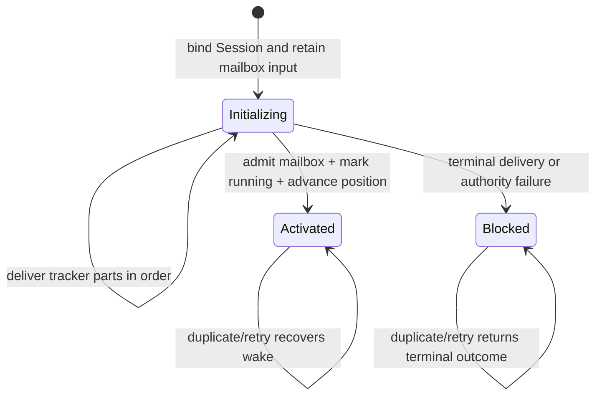

# External Channel Session Activation Design

- Snapshot: `admission-260731`
- Document reference: `admission-260731/DESIGN`
- Requirements: [`admission-260731/REQ`](../requirements/admission-260731-external-channel-session-activation.md)
- Decisions: [`admission-260731/ADR`](../adr/admission-260731-external-channel-session-activation.md)

## Current Behavior and Gap

The shared ingestion service currently prepares a position, reads provider history, commits a Session/binding/work plus delivery intents, delivers provider controls, and then tries to create the mailbox input, mark the Session running, and advance the position. The transient `ExternalChannelIngestionStage` value is the only object connecting these phases, so no canonical input survives a failure between provider mutation and final admission.

A process crash, deadline expiry, authority loss, access change, or position mismatch after provider delivery can therefore leave visible provider state without a canonical input. The Session URL also omits the required `/w` prefix. Although active root Sessions are queryable through the existing Agent Session APIs, the malformed link returns 404 and the flow has no durable admission-progress authority.

## Architecture

### Durable records

Add `external_channel_session_activations`:

- `id`: activation identity;
- `connection_id` and `conversation_position_id`: ordering authority;
- `binding_id` and `agent_session_id`: exact retained Session ownership;
- `trigger_provider_message_key` and `trigger_position`: canonical trigger identity;
- `range_start_position`: provider-history boundary used for the canonical mailbox projection;
- `state`: `initializing`, `activated`, or `blocked`;
- `mailbox_item_id`: immutable canonical input identity retained after the consumed
  mailbox row is promoted and deleted;
- `failure_kind` and `failure_summary`: sanitized terminal diagnostics only;
- `activated_at`, `blocked_at`, `created_at`, and `updated_at`.

Constraints:

- unique trigger identity within one conversation position;
- one non-activated activation per conversation position;
- composite foreign keys keep connection, position, binding, and Session ownership aligned;
- admission and activation verify that the live mailbox item belongs to the bound
  Session, while the activated record keeps only its immutable identity after
  promotion;
- activated rows require an activation timestamp;
- blocked rows require a blocked timestamp and retain the non-promotable mailbox identity.

Add `external_channel_session_activation_deliveries`:

- `activation_id`;
- `ordinal`;
- `delivery_attempt_id`;
- unique activation/ordinal and unique activation/delivery pair.

The ordered child rows link the activation to existing one-attempt delivery attempts. They do not duplicate provider payloads or outcomes.

### Domain and repository boundary

Add activation domain models and repository methods to:

- create or load an activation by trigger identity while holding the conversation-position lock;
- link one ordered required delivery set idempotently and reject incompatible retries;
- fetch one activation with its ordered delivery rows;
- mark an initializing activation blocked with sanitized reason;
- atomically activate the retained mailbox item only when every linked attempt is `delivered` and the binding remains connected;
- find an incomplete activation for a conversation position;
- recover activated mailbox wake identity.

Repository methods own SQLAlchemy. The ingestion store owns routing, history projection, and transaction composition. Provider delivery remains in the existing action service and one-attempt ledger.

The Mailbox service consults activation state before exposing an External Channel FIFO head for inference preparation, pending-work checks, wake eligibility, attachment preparation, or promotion. A mailbox item with `initializing` or `blocked` activation state remains durable and visible but is not promotable. Legacy External Channel mailbox items without an activation record preserve their existing behavior.

## Runtime Flow

### 1. Prepare and history read

The service retains the existing authenticated authority, conversation scope, absolute deadline, bounded history read, and PostgreSQL position lock behavior. Preparation additionally checks for an incomplete activation on the position. When found, it returns that activation for recovery instead of reading or admitting a later trigger.

### 2. Bind the real Session and record activation

Replace `stage` with durable admission.

In one short transaction it:

1. revalidates authority, position, provider history, resource, route, participant access, and Agent lifecycle;
2. creates or reuses the connected binding and root Session;
3. creates or reuses active Channel Work;
4. creates or reuses the Session-link and initial tracker delivery attempts;
5. creates or reuses the deterministic canonical mailbox input;
6. creates or reuses the activation by canonical trigger identity and mailbox identity;
7. links the required attempts in exact delivery order; and
8. commits.

The Session is active and idle, has one retained but non-promotable mailbox input for this trigger, and is available through the existing Session list/get APIs before any provider link is attempted.

### 3. Deliver Session link and tracker

The coordinator loads required delivery IDs from the durable activation, not from transient request state. It settles ordinal zero first and then each later ordinal.

- `delivered`: continue to the next ordinal;
- `pending` or `attempting` with remaining deadline: use the existing one-attempt fence;
- deadline expiry while still non-terminal: return retryable with the activation still `initializing`;
- `failed`, `unknown`, `not_attempted`, missing, incompatible ownership, revoked authority, or disconnected binding: mark the activation `blocked` and return a non-executing terminal result.

No result creates a replacement provider mutation.

The background provider-control drain applies the same durable ordering rule. A
delivery linked to an activation is eligible only when the activation is not
`blocked` and every lower ordinal is already `delivered`. This prevents another
Worker replica from claiming a Tracker delivery before the Session link or from
delivering any remaining initialization control after terminal blocking.

### 4. Activate the retained mailbox input

After every required delivery is durably `delivered`, one short transaction locks
connection authority, conversation position, the retained Session, binding,
activation, and required attempts in the established lifecycle order. Locking the
Session before the binding matches Session archive and decommission ordering.

It:

1. revalidates the trigger, activation, and retained mailbox identity;
2. verifies the mailbox item still belongs to the activation Session;
3. transitions activation `initializing -> activated`;
4. marks the Session running for input wakeup;
5. advances the parent conversation position with compare-and-set; and
6. initializes the provider thread position.

All changes commit together. A failed transaction leaves the existing mailbox input non-promotable and makes no running transition.

### 5. Wake and recovery

After activation commit, the existing mailbox wake dispatcher sends `SessionWakeUp(session_id)`. It no longer owns the running transition; it validates the mailbox identity and sends only the routing wake.

A duplicate callback or retry performs these checks in order:

- blocked activation: return terminal while retaining the non-promotable mailbox input, without provider mutation or wake;
- initializing activation: resume its remaining ordered deliveries, then activate;
- activated activation with mailbox still pending: retry the same wake;
- activated activation whose mailbox is gone: treat wake as already dispatched/consumed;
- advanced position with legacy mailbox evidence and no activation: retain the existing duplicate wake-recovery behavior.

The provider-control drain continues recovering pending provider delivery attempts. Activation completion is opportunistically driven by ingress retries; the durable activation row guarantees that any retry reuses the same identities. No Redis durability is required.

## Conversation Ordering

The conversation position and activation are locked together. A partial unique index permits only one `initializing` or `blocked` activation for a position. Preparation refuses to admit a later trigger while such a barrier exists.

The position advances only when activation commits for the retained mailbox item. This prevents later execution from overtaking the earlier trigger. A blocked activation deliberately keeps both the conversation barrier and inert FIFO input because executing later context past a failed required initialization would violate the confirmed order.

## Session Visibility and URL

Root Session creation already uses `status=active`, `session_kind=root`, and `run_state=idle`. Existing `list_active_unread_by_agent_id` and `get_with_unread_terminal_run_by_id` projections therefore remain authoritative and require no API or generated-client change.

Correct `_session_url` to generate only:

`/w/{workspace}/agents/{agent}/sessions/{session}`

The implementation adds repository/service tests proving that a retained initializing or blocked Session appears in Agent Session list/get queries and that the delivered provider URL contains the exact retained Session ID.

## Failure Handling

| Boundary | Durable result | Execution result | Retry behavior |
| --- | --- | --- | --- |
| Before activation admission commit | No activation | No mailbox, run, or wake | Provider retries normally |
| After admission commit | `initializing` + mailbox | Idle Session with inert input | Reuse activation, input, and deliveries |
| After Session-link delivery | `initializing` + mailbox | Idle Session with inert input | Skip delivered link; continue tracker |
| Tracker pending at deadline | `initializing` + mailbox | Idle Session with inert input | Retry same attempt/activation |
| Delivery failed or unknown | `blocked` + mailbox | Idle Session with permanently inert input | No mutation replay or execution |
| Before activation transaction commit | `initializing` + mailbox | No run or wake | Retry activation transaction |
| After activation commit, before broker send | `activated` + mailbox | Running with durable pending input | Retry same mailbox wake |
| Duplicate after mailbox consumption | `activated` | Existing execution lifecycle | No duplicate wake input |

Diagnostics retain only stable failure kinds and bounded summaries. Provider content, credentials, raw callback payloads, tokens, private URLs, and delivery payloads are not copied into activation rows or logs.

## Migration and Rollout

Generate one additive Alembic revision for the activation state enum and two
tables. Add a following revision for the dedicated External Channel continuation
mailbox and event enum values, then update `db-schemas/rdb/revision`.

No destructive backfill is required. Existing rows remain valid:

- advanced conversation position and mailbox evidence continue through duplicate recovery;
- staged binding/work/delivery state with no mailbox is adopted on the next authenticated retry by creating a canonical mailbox input and activation that reuse those identities;
- delivered controls alone never mark a Session running;
- disconnected bindings are never reactivated.

Rollback drops only the new activation children, activation rows, and enum after verifying no code still depends on them. The deployment must roll application code and schema together because the replacement store requires the new authority.

## Removal and Replacement

| Existing unit or behavior | Why it becomes obsolete | Replacement or remaining authority | Removal boundary | Absence verification |
| --- | --- | --- | --- | --- |
| `ExternalChannelIngestionStage` | Transient value is the only link between Session/provider state and later mailbox admission | Durable activation identity and ordered delivery children | Replace protocol type and all callers/tests | Repository search finds no `ExternalChannelIngestionStage` |
| `ExternalChannelIngestionAcceptance` finalization model | Assumes mailbox admission is the first durable trigger authority | Activation result carrying durable state and mailbox identity | Replace finalize contract | Repository search finds no old acceptance status flow |
| `MailboxIngestionStore.stage/finalize` split | Commits provider-visible intent without a durable canonical input and invocation authority | Durable admission, ordered initialization, and `activate` | Replace methods as one unit | Tests fail if provider mutation can precede mailbox and activation creation |
| Mailbox promotion without activation awareness | Any pending External Channel input can be consumed when its Session runs for another reason | Activation-aware FIFO promotion gate in `MailboxService` | Gate External Channel mailbox readiness in all promotion entry points | Unit tests prove `initializing` and `blocked` items cannot wake or promote |
| Running transition in `mailbox_wake.py` | Duplicates activation ownership and can run independently from provider gates | Activation transaction owns running; dispatcher only routes wake | Remove repository dependency/call | Unit test asserts dispatcher never mutates Session state |
| External Channel continuation encoded as `goal_continuation` | Goal and Channel idle hooks become indistinguishable after persistence, allowing active Goal state to reinterpret completed Channel work | Dedicated `external_channel_continuation` hook, mailbox, event, lowering, API, and UI path | Replace metadata-based branching and regenerate public clients | Repository search finds no External Channel source branch under Goal continuation; file-transfer E2E proves one terminal model request |
| Session URL without `/w` | Does not match the real App Router route | Canonical `/w/...` URL | Replace helper expectation | Unit and E2E link navigation return the retained Session |
| Living specs describing anonymous stage/finalize | Documents the defective current behavior | Updated provider-ingress and lifecycle specs | Update in the same PR | `/spec-review` reports no stale behavior |

## Test Strategy

### E2E primary verification matrix

| Ingress | Success | Duplicate | Provider failure | Session list/detail |
| --- | --- | --- | --- | --- |
| Slack HTTP | Required | Required | Required | Required |
| Slack Socket Mode | Required | Required | Shared failure fixture | Required |
| Discord HTTP interaction | Required for supported invocation path | Required | Shared failure fixture | Required |
| Discord Gateway | Required | Required | Required | Required |

The fake Slack and Discord providers must record ordered control operations and permit deterministic delivered, failed, unknown, and delayed outcomes without retaining credentials. Tests assert one Session, one binding, one activation, and one inert mailbox input exist before the Session-link attempt; then assert the expected tracker attempts and at most one activation/running/wake transition.

### Crash and transaction tests

Add deterministic service/repository tests for crashes or injected failures:

- after activation admission commit;
- a Session wake or manual input while activation remains `initializing` or `blocked`;
- after Session-link delivery;
- after each tracker part;
- before activation commit;
- after activation commit and before broker send;
- duplicate callback during each state;
- deadline expiry;
- authority loss or binding disconnect;
- conversation-position contention and later-trigger blocking.

Add continuation regression tests proving that Goal and External Channel hook
outputs persist as different mailbox and event kinds, lower through different
reminders, and that a completed file-transfer journey produces exactly one
post-finish model request without a repeated idle loop.

### UI/API evidence

Use the actual public Session get/list routes in E2E. Evidence must include the exact same Session ID in the provider link, list response, detail response, binding, activation, and mailbox row. Optional live-provider tests may skip only when credentials are absent; deterministic fake-provider CI tests must fail on any skipped required assertion.

## Traceability

| Requirement | Decisions | Design mechanism |
| --- | --- | --- |
| `admission-260731/REQ-1` | D1, D2, D5, D7 | Committed active/idle Session and activation before provider I/O |
| `admission-260731/REQ-2` | D2, D3, D7, D8 | Canonical `/w` link to retained Session plus list/get verification |
| `admission-260731/REQ-3` | D2, D3, D5 | Retained mailbox identity plus ordered activation-delivery rows and delivered-only continuation |
| `admission-260731/REQ-4` | D1, D2, D6 | Deterministic mailbox enqueue during durable admission plus activation-aware promotion gate |
| `admission-260731/REQ-5` | D1, D3, D5, D6, D8 | Stable identities, activation CAS, mailbox wake recovery |
| `admission-260731/REQ-6` | D1, D4 | PostgreSQL activation barrier and atomic position advancement |
| `admission-260731/REQ-7` | D2, D4, D8 | One shared ingestion protocol for every transport |

## Feasibility

| Scope | Result | Repository evidence |
| --- | --- | --- |
| Real Session before link | feasible | Root creation and binding already run in one caller transaction |
| Existing Session list/get visibility | feasible | Active root queries do not require mailbox or event state |
| Ordered provider initialization | feasible | Existing one-attempt ledger and synchronous coordinator accept stable IDs |
| Durable mailbox idempotency | feasible | Mailbox uniqueness already uses Session, kind, and deterministic idempotency key |
| Atomic activation/run/position | feasible | All repositories accept caller-owned `AsyncSession` transactions |
| Cross-replica ordering | feasible | Conversation-position row locks and PostgreSQL unique/CAS constraints already exist |
| Broker recovery | feasible | Pending mailbox identity survives broker failure and duplicate callbacks |
| API/client compatibility | feasible | Existing routes remain stable; additive continuation event and pending-presentation kinds are generated into both public clients and handled explicitly by azents-web |
| Deterministic provider E2E | feasible | Existing Slack/Discord fake providers already support delivery recording and ingress journeys |

No feasibility blocker remains. The implementation is a focused corrective PR spanning schema, repository, shared ingestion, tests, E2E, and living specs.
