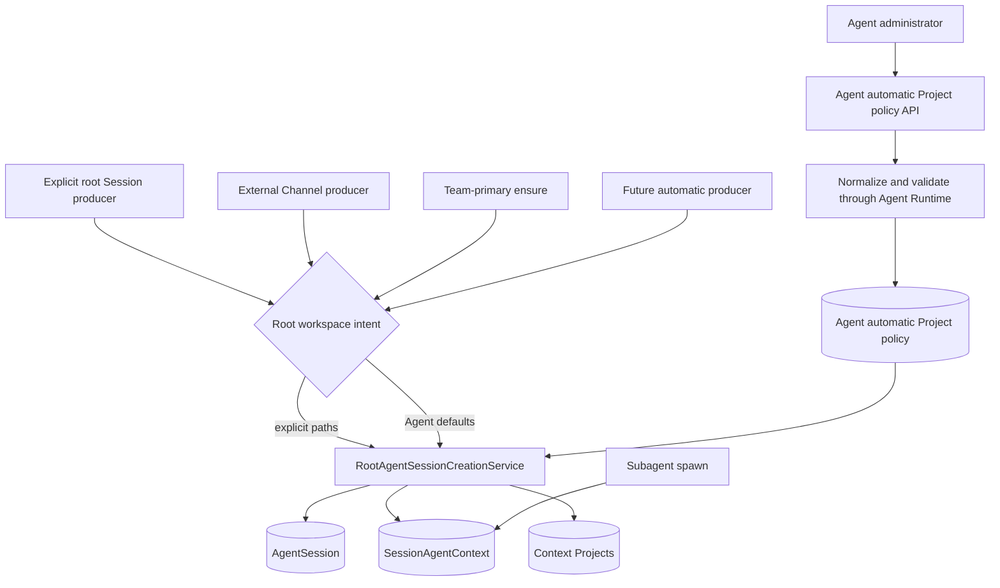
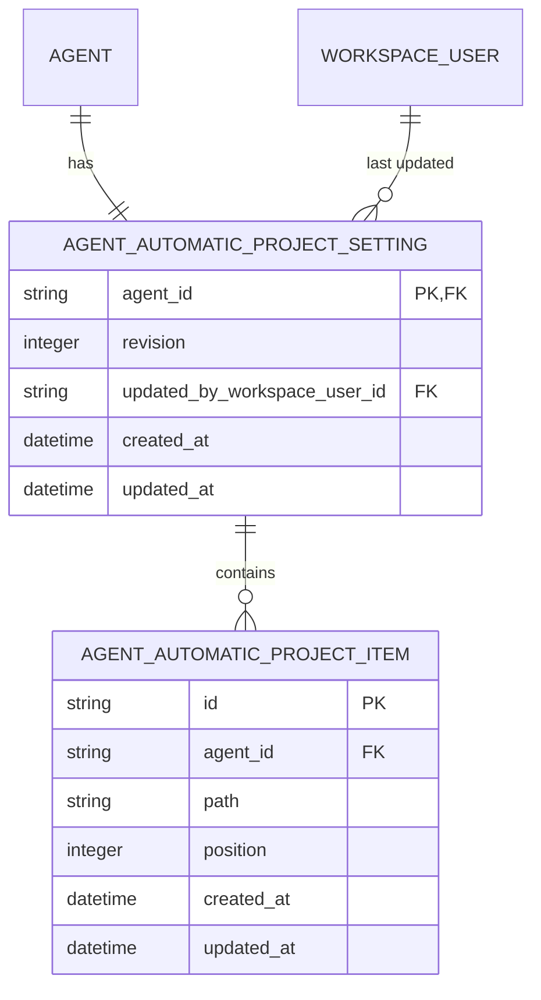

# Agent Default Projects for Automatic Sessions Design

- Snapshot: `agent-260724`
- Requirements: [`agent-260724/REQ`](../requirements/agent-260724-automatic-session-default-projects.md)
- ADR: [`agent-260724/ADR`](../adr/agent-260724-automatic-session-default-projects.md)
- Document reference: `agent-260724/DESIGN`

## Summary

Add one administrator-managed, Agent-scoped policy containing normalized existing Project paths. Root AgentSession creation receives an explicit workspace intent: caller-supplied existing Projects or the Agent policy. A shared creation service creates the AgentSession, root SessionAgentContext, and initial context Project rows atomically. External Channel and team-primary creation use the Agent policy; existing Web/Public API non-primary creation remains explicit; subagent creation continues to inherit its parent context.

The feature does not create Git worktrees or isolate concurrent Sessions. The existing last-created-Session defaults remain a separate Web draft convenience.

## Current Behavior and Gaps

### Explicit non-primary root Sessions

`ChatSessionService.create_team_session(...)` and `AgentSessionInputService.create_team_session_with_buffered_input(...)` receive `existing_project_paths` and ordered setup actions. They normalize paths, create a root AgentSession and SessionAgentContext, register direct context Projects, preserve explicit setup action ordering, and update the existing recency-oriented Project preset/default/catalog projections.

The existing-path create flow validates path syntax and containment but does not call the Runtime to verify directory existence. The draft UI normally supplies real Runtime directories through its folder picker.

### Automatic root Sessions

External Channel creation in `ExternalChannelAccessService` and `ExternalChannelEventProcessorService` calls `AgentSessionRepository.create(...)` directly. Team-primary ensure inserts a root AgentSession through `AgentSessionRepository.ensure_team_primary_for_agent(...)`. These paths create a root SessionAgentContext without Project rows.

### Subagent Sessions

`spawn_agent` creates a hidden `session_kind=subagent` AgentSession and a child SessionAgent that reuses the parent `context_id`. It is not a root workspace initialization boundary.

### Existing Agent defaults

`agent_project_defaults` is replaced by each explicit non-empty non-primary Session workspace selection and is returned to the Web draft as `last_created_session`. It can contain existing-Project and Git-worktree items. Its mutation and item semantics do not satisfy the confirmed administrator policy.

## Proposed Architecture



### Ownership boundaries

- The Agent automatic Project policy owns administrator intent and optimistic revision state.
- `SessionAgentContext` Project rows own the immutable per-root-Session snapshot used at runtime.
- `agent_project_defaults` continues to own the last explicit non-primary Session selection shown in the Web draft.
- `agent_project_catalog` continues to own Agent-scoped path status projection, not policy identity.

## Persistence Model

Add two PostgreSQL tables.



Proposed table names:

- `agent_automatic_project_settings`
- `agent_automatic_project_items`

### Settings row

- `agent_id` is both primary key and `agents.id` foreign key with `ON DELETE CASCADE`.
- `revision` starts at `1` and increments by one for each successful replacement, including clearing an existing non-empty policy.
- `updated_by_workspace_user_id` records the last Agent manager and uses `ON DELETE SET NULL`.
- The row exists for every Agent, including an empty policy, so `revision` has one unambiguous concurrency source.

### Item rows

- `agent_id` references the settings row with `ON DELETE CASCADE`.
- `path` stores the normalized absolute Agent Workspace path.
- `position` preserves administrator order for deterministic management API and UI projection.
- Context Project membership remains set-like after application; existing Session Project APIs may continue their canonical path ordering and do not gain a context-project position column.
- Add named unique constraints for `(agent_id, path)` and `(agent_id, position)` and a named `(agent_id, position)` index.
- The table has no item type or worktree fields.

### Migration

Generate an Alembic revision through the project migration workflow. The migration:

1. creates both tables and named constraints/indexes;
2. backfills one revision-1 empty settings row for every existing Agent;
3. does not copy data from `agent_project_defaults`;
4. updates `db-schemas/rdb/revision`;
5. leaves all existing Sessions and context Projects unchanged.

Agent creation inserts the revision-1 settings row in the same transaction as the Agent. Additive schema permits application rollback without changing old Session behavior; policy writes made after rollout remain inert if application code is rolled back.

## Domain and Repository Contracts

### Policy repository

Add a repository under `repos/agent_automatic_project/` with domain models for:

- policy snapshot: `agent_id`, `revision`, ordered paths, timestamps;
- complete replacement input: expected revision and ordered normalized paths;
- revision conflict result.

Repository operations:

- `get_policy(session, agent_id)`;
- `lock_policy(session, agent_id)`;
- `replace_policy(session, agent_id, expected_revision, paths, updated_by_workspace_user_id)`.

`replace_policy` updates the settings row with a revision predicate, deletes existing items, inserts the complete ordered replacement, and returns the new snapshot. A failed revision predicate returns a conflict without deleting items.

### Root workspace intent

Define a closed service-layer union:

- `ExplicitRootWorkspaceIntent(existing_project_paths)`;
- `AgentDefaultRootWorkspaceIntent()`.

An explicit empty list remains distinct from Agent-default intent. Setup actions remain an explicit non-primary Session concern outside the automatic Project policy.

### Root creation result

Return a structured result containing:

- the root AgentSession;
- whether a team-primary row was newly created or reused when applicable;
- the resolved initial Project paths;
- the applied policy revision when Agent-default intent created a new root context.

The policy revision is operational provenance in the result and structured logs; the context Project rows remain the durable Session snapshot, so no new revision column is required on SessionAgentContext.

## Policy Management Service

Add an Agent-scoped service that requires an explicit active AgentAdmin relationship for the requesting WorkspaceUser.

### Read

The service validates Workspace and Agent ownership and requires permission to manage the Agent. It returns the current revision and ordered paths. Reading does not start the Runtime or refresh status.

### Replace

The service performs work in this order:

1. validate Agent-management permission;
2. normalize and de-duplicate submitted paths while preserving order;
3. read the current policy and reject an already-stale expected revision before Runtime work;
4. if the replacement is non-empty, require the Agent Runtime and Runner to be ready;
5. validate every path as a real directory through the existing Runner-backed Project validation boundary, outside a held database transaction;
6. open a transaction, lock the policy, and recheck the expected revision;
7. atomically replace the complete item set and upsert the validated paths into `agent_project_catalog` with `available` status in that same transaction;
8. return the incremented policy snapshot.

An empty replacement clears the policy without requiring Runtime availability because it introduces no Project path.

The service must not update `agent_project_defaults` or `agent_project_presets`.

### Validation errors

- malformed, root, or outside-workspace path: `400` with the existing user-safe path reason;
- Runtime or Runner unavailable for a non-empty replacement: `409` management-state conflict with explicit retry guidance;
- missing or non-directory Runtime target: `400` identifying the rejected path without exposing credentials;
- stale expected revision: `409` with a stable revision-conflict code;
- unauthorized or cross-Workspace Agent: existing `403`/`404` Agent management behavior.

The tRPC Agent router must preserve the stable backend error discriminator instead of requiring client message parsing. Revision conflict and Runtime-unavailable management conflict both use HTTP `409`, so the router/client error data must expose their distinct API codes for deterministic `CONFLICT` versus retry-required UI states.

## Public API

Add dedicated Public Agent API routes rather than extending the generic Agent PATCH payload.

```text
GET /agent/v1/workspaces/{handle}/agents/{agent_id}/automatic-session-projects
PUT /agent/v1/workspaces/{handle}/agents/{agent_id}/automatic-session-projects
```

### GET response

```json
{
  "revision": 3,
  "project_paths": [
    "/workspace/agent/payment-api",
    "/workspace/agent/order-service"
  ],
  "updated_at": "2026-07-24T00:00:00Z"
}
```

### PUT request

```json
{
  "expected_revision": 3,
  "project_paths": [
    "/workspace/agent/payment-api",
    "/workspace/agent/order-service"
  ]
}
```

### PUT response

Return the same policy shape with the incremented revision. Empty `project_paths` clears the policy.

After adding the routes, regenerate the Public OpenAPI specification and the Python and TypeScript public clients through the approved client-generation workflow.

## Root Session Creation Service

Add a service-layer root creation boundary that accepts an existing database session so producers can include binding, grant, input-buffer, or other domain writes in the same transaction.

### Explicit root creation

1. normalize caller paths;
2. create the root AgentSession and SessionAgentContext;
3. create context Project rows for the explicit paths;
4. preserve existing explicit-selection side effects:
   - update Project presets;
   - upsert Project catalog rows;
   - replace `agent_project_defaults` for a non-empty selection;
5. return the root Session and resolved paths.

Setup action enqueueing remains ordered after direct context Project creation and before the first user message.

### Automatic root creation

1. load the current Agent policy and ordered items from one statement-level database snapshot in the producer transaction; a concurrent complete replacement is observed wholly before or after its commit, never as a mixed item set;
2. create the root AgentSession and SessionAgentContext;
3. create one context Project row for every policy path in stored order;
4. do not call the Runtime;
5. do not update recency defaults or presets;
6. return the Session, resolved paths, and policy revision.

A path that disappeared after configuration remains a registered context Project. Project Browser status refresh and actual Runtime file operations expose the drift.

### Team-primary concurrency

Move team-primary ensure behind the root creation service. Change the repository ensure result to distinguish `created` from `existing`.

- The race-winning transaction creates the team-primary Session, root context, and policy Project rows before commit.
- A conflicting transaction returns the existing team-primary and does not apply the current policy again.
- The unique active team-primary constraint remains the concurrency authority.
- If Project row creation fails, the new team-primary insertion rolls back with the same transaction.

### External Channel integration

Replace both direct root Session creation call sites:

- authorization Allow path;
- already-granted initial binding path.

The root creation service runs inside the existing connection/binding/resource transaction and snapshots the Agent policy before the binding is created. Session, context Projects, binding, grant/decision where applicable, and activation metadata commit atomically. Existing active bindings continue to reuse their bound Session without rereading policy.

### Subagent exclusion

`create_child_session_agent(...)` remains unchanged. It creates the hidden subagent AgentSession and links the child SessionAgent to the existing parent `context_id`. It never reads the Agent policy or creates Project rows.

## Frontend Design

### Information architecture

Add a `Projects` row to the Agent Settings hub under the capabilities group.

- Label: `Default projects`
- Description: `Projects added when a root session is created automatically.`
- Value: configured Project count, or `None`
- Route: `/w/{handle}/agents/{agentId}/settings/projects`

The page is an Agent-level operational settings surface, not part of External Channel settings.

### Page flow

The page contains:

1. compact title and utility description;
2. current ordered Project rows;
3. `Add project` action adjacent to the list;
4. remove and reorder controls on each row;
5. persistent unsaved-state indication and one primary `Save changes` action;
6. Runtime and revision-conflict recovery states.

Each row uses the directory basename as its primary label and the full normalized path as secondary text, matching the Project Browser hierarchy. A status badge is populated from the existing Project Browser preview projection and is informational; policy identity remains the path.

### Folder picker reuse

Reuse the existing Runtime-backed Agent Workspace directory picker and current-folder selection behavior. Extract generic picker state/UI into a reusable feature boundary if importing the current new-Session feature would create reverse or cross-feature ownership. The automatic policy picker supports existing directories only and does not expose repository/worktree mode controls or branch selection.

### UI states

- **Loading:** skeleton rows and disabled save action.
- **Empty:** `Automatic sessions currently start without registered projects.` plus `Add project`.
- **Loaded clean:** ordered rows, no save action emphasis.
- **Dirty:** visible unsaved indicator and enabled primary save action.
- **Runtime unavailable:** retain existing rows and allow navigation; non-empty saves show a concrete `Start the Agent runtime and retry` recovery action. Clearing all remains available.
- **Missing configured path:** red `Missing` status, keep the row visible, and provide remove. A save containing the missing row fails validation.
- **Revision conflict:** retain the unsaved local list, show that settings changed elsewhere, and offer `Reload latest`; never auto-overwrite.
- **Validation failure:** identify the affected row and keep the remaining draft intact.
- **Mobile:** rows stack path/status above local controls; add and save actions remain reachable without a wide table.

Use a container ADT for loading, loaded/clean, loaded/dirty, saving, conflict, and error states. Invalidate the policy and preview queries after a successful mutation.

## Failure Handling and Consistency

| Failure | Result |
|---|---|
| Configuration Runtime unavailable | Non-empty write rejected; existing policy unchanged |
| Configured path missing at save | Complete write rejected; existing policy unchanged |
| Revision changed during Runtime validation | Transaction returns conflict; existing policy unchanged |
| Automatic Session Runtime unavailable | Session creation proceeds from stored paths |
| Configured path disappeared after save | Project row remains; status/file operations expose missing path |
| DB failure during new root creation | Session, context, Projects, and producer-owned transaction all roll back |
| Existing External Channel binding | Existing Session reused; no policy reread |
| Policy updated after Session creation | Existing Session unchanged; later automatic root Sessions use new revision |

No path is silently omitted from an accepted policy or Session snapshot.

## Security and Permissions

- Require an explicit active AgentAdmin relationship for the requesting WorkspaceUser; Workspace ownership alone does not grant policy read or replace access in this snapshot.
- External Channel principals never read or mutate the policy.
- Normalize paths and enforce Agent Workspace containment before Runtime operations and persistence.
- Runtime validation uses system ownership context (`owner_session_id=None`) because no Session exists and the operation manages Agent-level configuration.
- Do not log full path lists in routine structured logs; use Agent ID, revision, Project count, outcome, and failing-path field only in bounded user-visible validation errors.
- The API accepts no worktree action, Git ref, arbitrary filesystem operation, provider identity, or channel selector.

## Observability

Add structured events or logs for:

- policy read/update outcome with Agent ID, old/new revision, count, and actor WorkspaceUser ID;
- revision conflict;
- validation failure category (`runtime_unavailable`, `missing`, `not_directory`, `invalid_path`);
- automatic root Session initialization with Session ID, producer kind, applied Project count, and policy revision;
- explicit root Session initialization with Project count and no policy revision.

Metrics should count policy updates, conflicts, validation failures by category, and automatic root Sessions by producer and Project count. Existing file-tool and Project Catalog errors remain the source for post-save filesystem drift.

## Rollout and Rollback

1. Deploy additive migration and models with empty revision-1 settings for all Agents.
2. Deploy read/write API and settings UI.
3. Deploy shared root creation service and migrate explicit, team-primary, and External Channel producers in the same release or a tightly coupled stack so no producer has ambiguous behavior.
4. Regenerate and publish API clients before frontend use.
5. Existing Agents remain empty by default, so rollout preserves current automatic Session behavior until an administrator configures paths.

Application rollback leaves additive tables unused and preserves existing Session rows. A later forward deployment reads the persisted policy again. Do not copy the policy into `agent_project_defaults` during rollback.

## Test Strategy

### E2E primary verification matrix

| Scenario | Evidence |
|---|---|
| Configure two default Projects | Settings UI shows saved ordered rows and incremented revision |
| External Channel creates a new root Session | Signed Slack fixture journey produces a bound Session whose Project API returns exactly the configured paths |
| Team-primary is first ensured after configuration | Team-primary Project API returns exactly the configured paths |
| Explicit Session supplies an empty selection | Session has no Projects despite non-empty Agent policy |
| Explicit Session supplies different Projects | Session contains only explicit paths and does not merge Agent policy |
| Policy changes after one automatic Session | Existing Session remains unchanged; later automatic Session uses new paths |
| Subagent spawn | Child resolves the same root context Project set without duplicate rows |
| Missing path save | Management write fails and prior policy/revision remain unchanged |
| Runtime unavailable save | Non-empty write fails with retry guidance; empty clear succeeds |
| Concurrent edit | Stale expected revision returns conflict and does not overwrite the winning update |

### E2E plan

Extend the deterministic Azents E2E fixture with multiple real directories under the Agent Workspace. Use Public API and the real settings Web surface for management verification. Reuse the signed fake Slack provider journey for External Channel Session creation and binding evidence. Query the public Session Project API for authoritative post-creation assertions.

The team-primary case must configure the policy before the first team-primary ensure. The explicit-empty case must call the current public create route with explicit empty arrays. The old/new snapshot case must retain both Session IDs and compare their Project lists after the policy update.

### Fixture and prerequisite support

- Seed at least three stable Agent Workspace directories.
- Keep Runtime and Runner READY for successful configuration saves.
- Provide a fixture operation that removes one disposable directory for missing-path validation without mutating a source checkout.
- Reuse External Channel fake credentials and signed callback support; no live Slack credential is required.
- Record only safe provider operation evidence and Project paths inside the disposable test workspace.

### Backend tests

- migration/model constraints and backfill;
- repository ordered replacement, empty clear, duplicate rejection, and revision predicate;
- service permission, normalization, Runtime validation, no-transaction-during-I/O, second revision check, and catalog status update;
- common root creation explicit/default distinction and atomic rollback;
- team-primary race winner/loser behavior;
- both External Channel creation paths;
- existing binding reuse without policy reread;
- explicit-selection side effects preserved and automatic application does not mutate recency defaults or presets;
- subagent inheritance exclusion.

### Frontend tests and stories

Add pure component stories for loading, empty, populated, dirty, Runtime unavailable, missing path, validation error, and revision conflict. Container tests cover query-to-ADT conversion, draft preservation on failure, query invalidation on success, and reload-latest conflict recovery.

### CI policy and evidence

Backend unit/integration, OpenAPI snapshot/client generation checks, TypeScript format/lint/typecheck/build, and deterministic E2E are required. The feature has no optional live-provider test. A skipped deterministic External Channel or Web journey is a failure unless the repository-wide documented infrastructure skip policy applies. Evidence consists of passing CI checks plus E2E assertions against policy revision and Session Project APIs.

## Living Spec Updates

Update current behavior in the implementation PRs:

- `spec/domain/workspace.md` — Agent automatic Project policy, path identity, validation, context snapshot, distinction from recency defaults, and correction of stale session-owned Project/worktree wording to the current SessionAgentContext ownership model;
- `spec/domain/conversation.md` — explicit versus Agent-default root creation, team-primary application, subagent exclusion, and correction of the stale AgentSession-to-Project/worktree ownership diagram and language;
- `spec/domain/agent.md` — administrator-managed policy ownership and API, including the new Public Agent API routes and policy model/repository/service/API code paths in frontmatter;
- `spec/domain/external-channel.md` — binding-to-new-root-Session creation snapshots the Agent policy into the new SessionAgentContext while existing bindings retain their Session snapshot;
- `spec/flow/external-channel-authorization.md` — new binding Session creation snapshots Agent defaults;
- `spec/flow/external-channel-provider-ingress.md` — already-granted initial binding uses the shared automatic root creation boundary.

Update code paths and `last_verified_at` fields with implementation.

## Traceability

| Requirement | ADR decisions | Design mechanism | Verification |
|---|---|---|---|
| `agent-260724/REQ-1` | D1, D3, D4, D5 | Separate policy tables, management service, normalized paths, revisioned full replacement | Settings E2E, repository/service tests |
| `agent-260724/REQ-2` | D2, D3, D4 | Agent-default root workspace intent and atomic context Project creation | External Channel and team-primary E2E |
| `agent-260724/REQ-3` | D1, D2 | Explicit intent remains exact, including empty list; no merge | Explicit empty/different Project E2E |
| `agent-260724/REQ-4` | D1, D3, D4, D5 | Policy revision plus per-context Project snapshot; no retroactive update | Old/new Session comparison and revision conflict tests |
| `agent-260724/REQ-5` | D2, D3 | Empty policy creates no Project rows and does not block root creation | Empty-policy automatic Session tests |
| `agent-260724/REQ-6` | D2 | Subagent remains on parent-context creation path | Subagent repository/integration test |
| `agent-260724/REQ-7` | D1, D3, D4 | Existing-path-only API/schema and no setup actions | API schema tests and absence of worktree allocation in E2E |

## Feasibility Validation

Repository validation found no product or architecture blocker.

| Scope | Result | Repository evidence and required condition |
|---|---|---|
| `agent-260724/REQ-1` policy persistence and management | `feasible` | Agent creation already owns one transaction for the Agent and first AgentAdmin; additive settings/items tables and revision-1 backfill fit the current repository model. Existing Runner-backed directory validation can be reused for non-empty writes. |
| `agent-260724/REQ-2` automatic root Session application | `conditional` | Both External Channel creation paths already create root Sessions inside producer-owned database transactions, and context Project rows can be added through the existing repository. The shared service must accept the existing `AsyncSession`, preserve connection→binding→resource lock order, and commit Project rows before wake-up. |
| `agent-260724/REQ-2` team-primary application | `conditional` | The current partial unique constraint and `INSERT ... ON CONFLICT` race handling are reusable. Every production ensure call site must move behind the shared service, and only the transaction that creates the primary may apply policy Projects. |
| `agent-260724/REQ-3` explicit selection precedence | `feasible` | Current Public API request lists are required, so explicit empty selection is representable. Existing explicit Project, preset, catalog, recency-default, setup-action, and first-message ordering can be retained behind the explicit intent. |
| `agent-260724/REQ-4` creation-time snapshot | `conditional` | Complete policy replacement is transactionally feasible. Automatic creation must read settings and ordered items from one statement-level database snapshot so a concurrent replacement cannot produce a mixed revision. |
| `agent-260724/REQ-5` empty compatibility | `feasible` | Revision-1 empty policy rows preserve current Project-less automatic root creation and require no Runtime operation. |
| `agent-260724/REQ-6` subagent inheritance | `feasible` | The current hidden subagent AgentSession reuses its parent `context_id`; leaving this path outside root initialization satisfies the requirement. |
| `agent-260724/REQ-7` existing-Project-only scope | `feasible` | The proposed API accepts paths only and current context Project creation requires no worktree allocation or setup action. |
| Agent Settings frontend | `conditional` | Existing settings hub, section route, generated-client tRPC pattern, stories, and E2E surfaces are reusable. The chat-owned Runtime directory picker requires a bounded neutral extraction rather than a third copied picker. |
| Optimistic conflict UI | `conditional` | HTTP/tRPC conflict handling exists, but revision conflict and Runtime-unavailable management conflict both use `409`; the stable backend error code must be preserved into client error data for deterministic recovery UI. |
| Living-spec consistency | `feasible` | The listed spec updates cover Agent policy, root Session semantics, SessionAgentContext ownership correction, and both External Channel creation flows. No execution-loop, Runtime-control, or cleanup contract changes are required. |

The conditional items are bounded implementation requirements, not unresolved product decisions. Exact policy order is a management API/UI contract only; current context Project APIs may continue path ordering because the Requirements specify membership rather than observable Session Project order.

## Alternatives Considered

- Reusing `agent_project_defaults` was rejected because explicit Session creation mutates it and it admits worktree items.
- Producer-local default application was rejected because it duplicates transaction and future-adoption policy.
- Repository inference from `start_reason` or omitted fields was rejected because it obscures explicit empty intent.
- Runtime validation during every automatic Session creation was rejected because routing identity must not depend on Runtime availability.
- Catalog or Session Project IDs were rejected as Agent policy identity because they are projection-local or context-local.
- Per-item management mutations and last-write-wins replacement were rejected in favor of coherent revisioned snapshots.

## Remaining Risks and Assumptions

- Existing Projects remain shared mutable filesystem state across Sessions; concurrent modification isolation is explicitly outside this snapshot.
- A path can disappear after an accepted policy write. The design preserves the configured Session snapshot and relies on Project status and tool errors rather than silently dropping it.
- The reusable folder picker may require a bounded frontend extraction to avoid feature ownership inversion.
- Team-primary creation currently has repository-local race handling; the service integration must preserve the unique-constraint race behavior while returning a created/existing result.
- This snapshot introduces no feature-specific Project-count limit. Existing global request-size and operational safeguards continue to apply; adding a user-visible item-count limit requires a later Requirements and API-contract decision.
