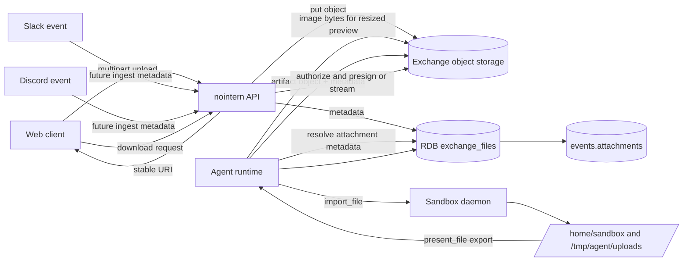
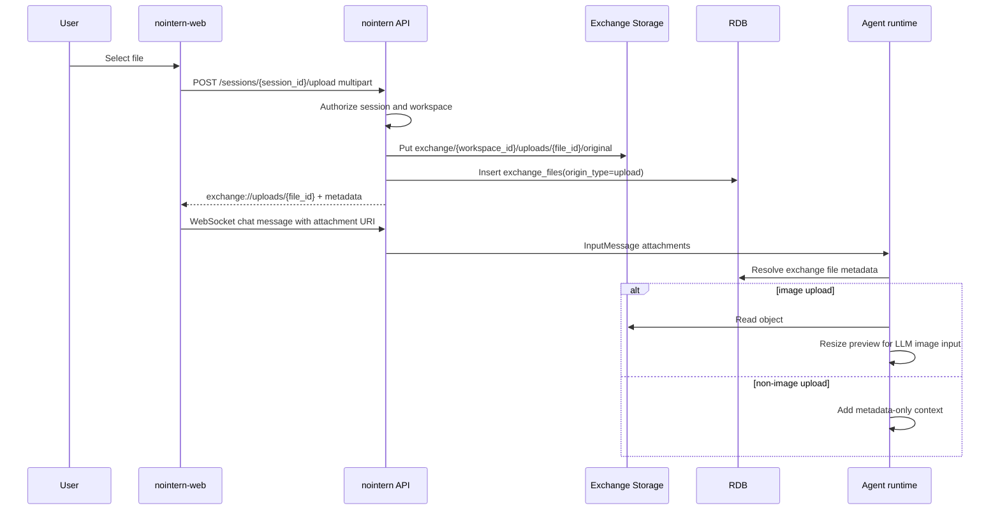
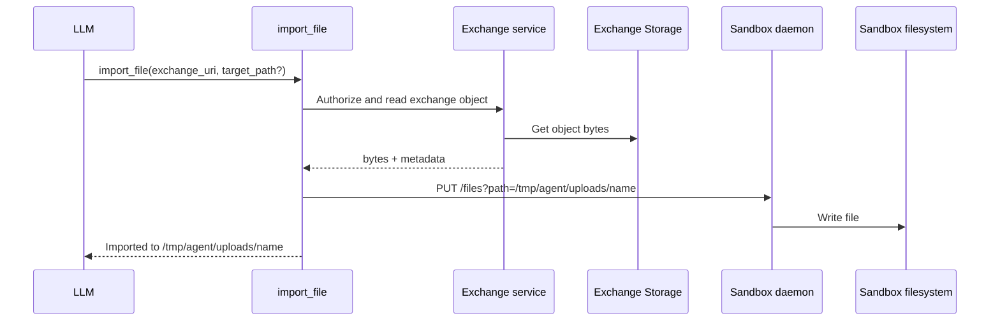
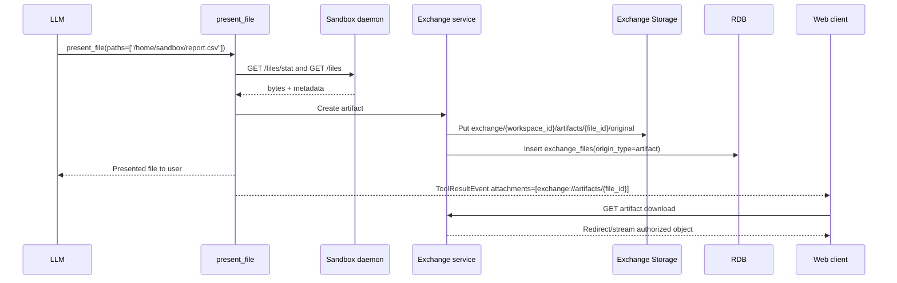
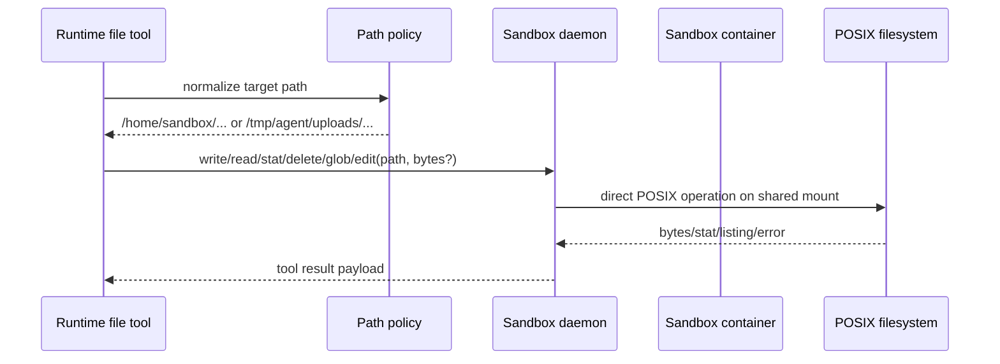
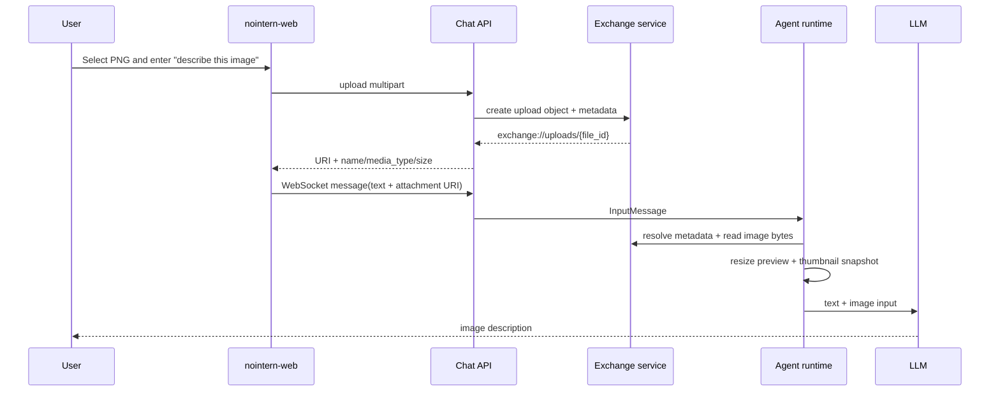
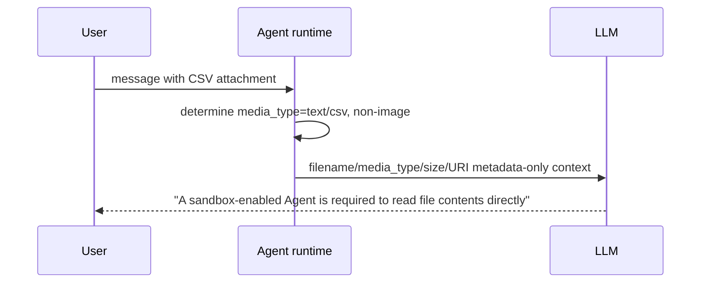
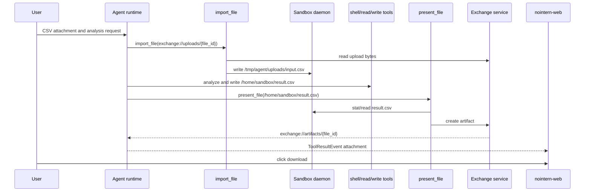

# Agent File Exchange Storage Design

## 1. Overview

Goal of #3336 is to redesign file upload, runtime input, sandbox workspace, artifact export, and download UX into one clear model after Agent-centered raw session transition. The conclusion is to split files into two axes.

| Axis | canonical location | lifecycle | access method |
|---|---|---|---|
| Exchange Storage | object storage + DB metadata | TTL/quota/permission check | backend API resolves stable URI to presigned URL or stream |
| Sandbox workspace | `/home/sandbox/**` | durable workspace tied to AgentRuntime sandbox lifecycle | sandbox daemon file/shell API |

Exchange Storage is the boundary layer for user uploads and sandbox artifact export. Sandbox workspace is POSIX filesystem where Agent performs actual work. The two axes are not automatically synchronized and are connected only through explicit tool calls.

Sandbox identity is tied to AgentRuntime, not AgentSession. AgentSession is event log boundary and can rotate through reset/new, so sandbox workspace lifecycle and `/home/sandbox` persistence path remain based on AgentRuntime.

This document fixes two perspectives together.

1. **Component perspective** — clarify what API, Exchange service, Agent runtime, sandbox daemon, and nointern-web are responsible for and not responsible for.
2. **User flow perspective** — describe full UX step-by-step: user uploads file, Agent reads it, works in sandbox, and user downloads result.

## 2. Goals and Non-goals

### Goals

- Remove dependencies on File API, EFS, `/data/*`, and `shared:///session/*`.
- Store Web uploads in Exchange Storage through backend multipart proxy.
- Separate Slack/Discord inbound attachment ingest and outbound file delivery into separate design.
- Events and messages store stable URIs: `exchange://uploads/{file_id}` or `exchange://artifacts/{file_id}`.
- Agent with Sandbox imports exchange file into sandbox with `import_file` and exports sandbox result as exchange artifact with `present_file`.
- Agent without Sandbox receives image upload as LLM image input, while non-image upload is metadata-only.
- Keep `/home/sandbox/**` as durable workspace contract and place import cache under `/tmp/agent/**` shared mount.
- Remove EFS and nointern-file-api infra in this stack. Actual backup/restore mechanism for `/home/sandbox` is handled in separate workspace durability issue.

### Non-goals

- Slack/Discord file attachment re-upload delivery UX is excluded from this scope.
- Slack/Discord inbound attachment ingest is also out of Phase 1 scope.
- Presigned browser direct upload/finalize flow is out of Phase 1 scope.
- Do not create compatibility bridge for old `/data` path.
- Do not create platform-reserved directory inside `/home/sandbox`.

## 3. Decision Summary

| Decision | Content | Rationale |
|---|---|---|
| Stable URI | `exchange://uploads/{file_id}`, `exchange://artifacts/{file_id}` | persisted event value is unaffected by presigned URL expiration |
| Upload ingest | backend multipart proxy | fix storage semantics first without CORS/finalize/orphan issues |
| Import policy | no auto import, explicit `import_file` call | upload alone does not wake sandbox or pollute workspace |
| Import default path | `/tmp/agent/uploads/{filename}` | user-provided original is not checkpoint target; Agent copies to `/home/sandbox` if needed |
| Workspace canonical | `/home/sandbox/**` | unify durable workspace and transient scratch boundary |
| Current mount topology | mount `/home/sandbox` and `/tmp/agent` as same `emptyDir` in sandbox + sandbox-daemon | daemon file API handles large files via direct POSIX without EFS |
| Follow-up control plane | in-sandbox client outbound control channel designed in #3426 | external vendor/local sandbox and full filesystem access are separate architecture issue |
| Sandbox identity | `AgentRuntime.id` | keep same Agent sandbox workspace after session reset/new |
| Image input | create resized preview from exchange original and send base64 to LLM | Agent without Sandbox can still analyze images |
| Non-image input | only metadata to LLM | avoid injecting arbitrary bytes into context and gate clearly by Sandbox settings |
| Export | `present_file(path)` creates exchange artifact | unify user download and event metadata with stable URI |
| Expiration | keep metadata, clear error for object access | separate past event display from storage lifecycle |
| Old paths | remove File API/EFS/`/data` | break mixed path compatibility and simplify runtime prompt |

## 4. Target Architecture



### 4.1 Upload flow



### 4.2 Sandbox import flow



### 4.3 Artifact export flow



### 4.4 Component responsibility details

| Component | Responsibility | Non-responsibility |
|---|---|---|
| nointern-web | Sends user-selected file to backend as multipart and sends returned exchange URI as chat message attachment. Attachment card converts exchange URI to same-origin download proxy. | Does not directly store S3 presigned URL. Does not create `/data/uploads` or sandbox filesystem path. |
| Chat API | Checks session/workspace permission and provides upload/list/download/delete HTTP contract. Upload/delete/download authorize through `exchange_files` metadata. | Does not reverse-engineer object key from URI string. Does not directly read/write sandbox filesystem. |
| Exchange service | Coordinates object storage put/get/delete/presign/stream and `exchange_files` row creation in one service transaction boundary. | Does not decide sandbox internal path policy. Does not need to know meaning of `/home/sandbox` and `/tmp`. |
| Agent runtime resolver | Resolves message attachment URI into Exchange metadata. Converts image to LLM image input and non-image to metadata-only context. | Does not directly inject non-image bytes into prompt. Does not automatically wake sandbox or import. |
| Runtime file tools | `import_file` copies Exchange object to sandbox; `present_file` exports sandbox file as Exchange artifact. | Does not automatically synchronize Exchange Storage and sandbox workspace. |
| Sandbox daemon | Manipulates POSIX filesystem inside active sandbox container as read/write/stat/delete/glob/grep/edit/exec. | Does not interpret Exchange URI, workspace permission, TTL, or quota. Does not directly access DB or S3. |
| Event store | Stores stable exchange URI and display metadata snapshot in user/tool/assistant events. | Does not store presigned URL or sandbox-local transient path as durable user-facing file reference. |

### 4.5 Sandbox daemon file management details

Sandbox daemon is **file/shell control plane for active sandbox filesystem, not part of Exchange Storage**. At current stack stage, daemon remains sidecar server, but file API reads/writes through direct POSIX on mount shared with sandbox container rather than K8s exec/base64 workaround. When Agent runtime receives tool call, runtime/tool layer first resolves permission and exchange URI, then passes only decided sandbox path and bytes/read request to daemon.

Current mount topology:

| Mount | sandbox container | sandbox-daemon container | Meaning |
|---|---|---|---|
| `/home/sandbox` | `emptyDir(workspace)` | same `emptyDir(workspace)` | durable workspace contract. Actual backup/restore implemented in separate issue |
| `/tmp/agent` | `emptyDir(tmp-agent)` | same `emptyDir(tmp-agent)` | `import_file` default cache. Not preserved by hibernate/restore |
| rest of `/tmp` | container-local | daemon-local | scratch. Outside direct POSIX scope of daemon file API |



Daemon-managed path classes:

| Path class | Example | Created/modified by | hibernate/restore meaning | Direct user exposure |
|---|---|---|---|---|
| Durable workspace | `/home/sandbox/report.csv` | Agent shell/file tools, `import_file(target_path=/home/sandbox/...)` | long-term workspace tied to AgentRuntime sandbox lifecycle. Results that should persist after restore go here. | exposed only after `present_file` creates Exchange artifact |
| Imported transient copy | `/tmp/agent/uploads/input.csv` | `import_file` default target | not checkpoint target. May disappear after hibernate/restore, so Agent copies to `/home/sandbox` if needed. | direct exposure forbidden |
| Scratch | `/tmp/...` | shell/tool temp work | scratch that can disappear anytime | direct exposure forbidden |

Daemon core invariants:

- **Path normalization is performed by tool/service layer first.** Daemon directly handles only file APIs for shared mounts `/home/sandbox/**` and `/tmp/agent/**`; runtime path policy determines user-facing contract.
- **Daemon does not know Exchange URI.** `exchange://uploads/...` is not passed to daemon; `import_file` reads Exchange object bytes and passes to daemon `write`.
- **Daemon does not create artifact.** `present_file` uses daemon `stat/read` to get bytes, then asks Exchange service to create artifact.
- **Daemon error is exposed as tool error.** `ENOENT`, permission denied, path policy violation are converted into English tool result understandable by LLM.
- **Permission boundary is determined from DB metadata.** Daemon path accessibility and workspace/session permission are separate. Exchange file download/list/delete is always checked by API/Exchange service.

Long term, consider architecture where in-sandbox client connects outbound to nointern control plane instead of sidecar server. This direction is covered by separate issue #3426 for external sandbox vendor, local machine connection, and full filesystem direct IO. This stack includes only EFS removal and shared mount transition.

### 4.6 User flow details

#### Flow A — image upload then immediate question



User-visible changes:

- Attachment chip displays filename/size right after upload.
- Image preview displays event attachment thumbnail.
- Download link is nointern-web same-origin URL, not `exchange://...`.

#### Flow B — CSV upload, Agent without sandbox



User-visible changes:

- File uploads and remains as attachment, but Agent without sandbox does not directly read CSV bytes.
- Agent knows filename and URI, so it can guide "sandbox is required" or specialist Agent delegation.

#### Flow C — CSV upload, sandbox Agent analyzes and provides result file



User-visible changes:

- Original upload and Agent result appear as separate attachments.
- Original is `exchange://uploads/*`; result is `exchange://artifacts/*`.
- Tool log records that Agent read original from `/tmp/agent/uploads` and saved result to `/home/sandbox`.

#### Flow D — file reuse after hibernate/restore

1. Agent imports original to `/tmp/agent/uploads/input.csv` with `import_file` default.
2. Analysis result is saved to `/home/sandbox/result.csv`.
3. Sandbox hibernates.
4. After restore, `/home/sandbox/result.csv` should remain but `/tmp/agent/uploads/input.csv` may be gone.
5. If Agent needs original again, it reimports event attachment `exchange://uploads/{file_id}` using `import_file`.

UX invariants for this flow:

- User can still see past upload attachment.
- If object TTL remains, original can be reimported/downloaded.
- If TTL expired, metadata remains but download/import fails with `File is no longer available.`.

## 5. URI and object namespace

### 5.1 Logical URI

| Kind | URI | Created by | Use |
|---|---|---|---|
| Upload | `exchange://uploads/{file_id}` | backend upload API | file user delivered to Agent |
| Artifact | `exchange://artifacts/{file_id}` | `present_file` export | result file Agent shared with user |

URI is stored as-is in API response, WebSocket message attachment, runtime event attachment, and DB JSONB snapshot. S3 key is not inferred from URI alone; workspace/session/agent permission is checked through DB metadata.

### 5.2 S3 prefix

Even when using same object storage infra, lifecycle is separated.

| Use | Prefix example | Lifecycle |
|---|---|---|
| Exchange uploads | `exchange/{workspace_id}/uploads/{file_id}/original` | TTL/quota policy |
| Exchange artifacts | `exchange/{workspace_id}/artifacts/{file_id}/original` | TTL/quota policy |
| Sandbox checkpoints | `sandbox-checkpoints/{agent_runtime_id}/snapshot.tar.zst` | checkpoint retention policy |

Exchange prefix and checkpoint prefix do not reference each other.

## 6. Data Model

### 6.1 `exchange_files` table

Initial model connects DB metadata and object storage key.

| Field | Type | Description |
|---|---|---|
| `id` | UUID/ULID string | `{file_id}` of stable URI |
| `workspace_id` | UUID | permission boundary |
| `agent_id` | UUID nullable | set if file associated with Agent |
| `agent_runtime_id` | UUID nullable | set for sandbox import/export or AgentRuntime-related artifact |
| `session_id` | UUID nullable | set for Web/raw session-related file |
| `created_by_user_id` | UUID nullable | set for user upload |
| `origin_type` | PostgreSQL ENUM | `upload`, `artifact` |
| `object_key` | text | S3 object key |
| `filename` | text | display/download filename |
| `media_type` | text | MIME type |
| `size_bytes` | bigint | object size |
| `sha256` | text nullable | dedupe/integrity check |
| `expires_at` | timestamptz | object access expiration time |
| `created_at` | timestamptz | creation time |

Following nointern convention, boolean fields do not use `is_` prefix. Expiration is represented by `expires_at`; user-deleted file deletes metadata row after object deletion succeeds.

Association rules:

- Web upload stores `workspace_id`, `agent_id`, `session_id`, `created_by_user_id`.
- Artifact through sandbox import/export path also stores `agent_runtime_id`.
- Permission check always verifies `workspace_id` first; session UI query uses `session_id`, and agent-bound artifact query uses `agent_runtime_id` or `agent_id` as auxiliary boundary.
- `agent_runtime_id` is storage/checkpoint identity, and `session_id` tracks which event log displays it.

### 6.2 Runtime Attachment

`Attachment.uri` contains exchange URI. `thumbnail` and `text_preview` remain in event snapshot so UI can maintain minimal display even after object expiration.

```python
class Attachment(BaseModel):
    """File reference snapshot."""

    uri: str
    media_type: str
    size: int
    name: str
    thumbnail: str | None
    text_preview: str | None
```

If additional metadata is needed, prefer `exchange_files` metadata and download resolver over widening `Attachment`. Event snapshot contains only minimum needed for LLM history and UI rendering.

## 7. API Design

### 7.1 Upload

Keep existing backend multipart flow called by Web hook, but change storage location and response URI.

```http
POST /sessions/{session_id}/upload
Content-Type: multipart/form-data

file=<binary>
```

Response:

```json
{
  "uri": "exchange://uploads/01JX...",
  "media_type": "image/png",
  "size": 12345,
  "name": "diagram.png"
}
```

Validation:

- Check session/workspace permission first.
- Filename is display metadata, not path; sanitize for download header safety rather than path traversal.
- Keep current 20MB upload size limit as Phase 1 default; expand later with workspace quota and media-type policy.

### 7.2 Download

Download endpoint receives stable URI or file id, checks permission, then streams object or redirects to short-lived presigned URL.

```http
GET /exchange-files/{file_id}/download
```

If metadata remains but object expired/disappeared, return clear English error.

```json
{
  "detail": "File is no longer available."
}
```

### 7.3 List/Delete

Existing `/session-data` and `/shared-data/{scope}` are tied to `/data` model and are removed. Web UI needs only session-linked exchange upload/artifact list.

```http
GET /sessions/{session_id}/exchange-files?origin_type=upload|artifact
DELETE /exchange-files/{file_id}
```

Delete first deletes object, and deletes DB metadata row only on success. Object delete failure must not be hidden as success; expose failure to caller.

## 8. Runtime Input Handling

### 8.1 Image upload

Image reads original bytes from Exchange Storage and creates LLM input preview with same resize policy as existing image generation pipeline. LLM input payload is base64 binary blob; event stores only stable exchange URI and thumbnail snapshot.

Expiration policy does not affect already constructed LLM input payload. Image blob constructed once within same run is independent of object TTL. However, future turn read/import requires exchange object to still be available.

### 8.2 Non-image upload

Do not directly inject non-image bytes into Agent without Sandbox. Instead, LLM prompt/context receives metadata:

- filename
- media_type
- size
- stable exchange URI
- instruction that Sandbox is required to read/manipulate content with `import_file`

Even Agent with Sandbox does not auto-import. If LLM decides it needs the file, it calls `import_file` tool.

### 8.3 Expired exchange access

When import/download/export resolver tries to read expired URI, return English error such as:

- `File is no longer available.`
- `Exchange file has expired.`

No proactive expired badge is needed in UI. Event metadata and text preview remain for past conversation context display.

## 9. Sandbox Tool Design

### 9.1 Sandbox-dependent file tools

Expose these tools only when Sandbox is configured:

- `read`
- `write`
- `edit`
- `delete`
- `glob`
- `grep`
- `read_image`
- `import_file`
- `present_file`

Do not expose the tools to Agent without Sandbox. If non-image upload content access is needed, delegate to Sandbox-enabled specialist Agent or change Agent settings.

### 9.2 `import_file`

Input:

```json
{
  "uri": "exchange://uploads/01JX...",
  "target_path": "/tmp/agent/uploads/report.csv"
}
```

Rules:

- If `target_path` missing, store at `/tmp/agent/uploads/{filename}`.
- Default location is not checkpoint target.
- If important input file must be preserved long-term or modified, Agent copies it to `/home/sandbox`.
- Reject `target_path` outside `/home/sandbox/**` or `/tmp/agent/uploads/**`.
- Tool result returns original exchange URI and actual import path together.
- For imports to `/tmp/agent/uploads/**`, tool result and description state that files may disappear after hibernate/restore.

Tool description states:

> Files under `/tmp` can disappear. Move important files to `/home/sandbox`.

### 9.3 `present_file`

`present_file` no longer describes `/data/agent`, `$USER_DIR`, or `/platform`. Input path is sandbox filesystem path.

Rules:

- Default allowed export path is `/home/sandbox/**`.
- `/tmp/**` export is not allowed. User-visible result must first be saved by Agent under `/home/sandbox`.
- Read file bytes from sandbox daemon and store as Exchange artifact object.
- Returned `Attachment.uri` is `exchange://artifacts/{file_id}`.
- Image artifact creates thumbnail snapshot.
- Text artifact creates `text_preview` up to 2000 chars.

## 10. Sandbox Workspace and Checkpoint

### 10.1 Workspace layout

`/home/sandbox` is free workspace. No platform-reserved directory is created. Work files Agent needs to preserve long term go under `/home/sandbox/**`.

| Path | Meaning | hibernate/restore meaning |
|---|---|---|
| `/home/sandbox/**` | Agent work artifacts and long-term work files | durable workspace tied to AgentRuntime sandbox lifecycle |
| `/tmp/agent/uploads/**` | temporary copy of imported user upload | excluded. Reimport with original exchange URI if needed |
| `/tmp/**` | transient scratch | excluded |

### 10.2 Hibernation interaction

Exchange Storage is independent from sandbox checkpoint.

- Hibernated sandbox restore restores durable workspace state of AgentRuntime.
- Previously imported `/tmp/agent/uploads/**` may not be restored.
- If needed, Agent reimports stable `exchange://uploads/{file_id}`.
- Artifact exported with `present_file` is in Exchange Storage, so it can be downloaded regardless of sandbox restore. Object access fails after TTL.
- Checkpoint lookup, cleanup, and object prefix are based on `agent_runtime_id`. Even if current active session changes, same AgentRuntime `/home/sandbox` is retained.

## 11. Frontend Design

### 11.1 Upload hook

`useFileUpload` continues to send multipart. Response schema is narrowed to include `name` and exchange URI.

```typescript
interface UploadedFile {
  uri: string; // exchange://uploads/{file_id}
  name: string;
  mediaType: string;
  size: number;
}
```

### 11.2 Attachment rendering

`FileAttachmentList` builds download endpoint based on `uri` scheme.

- `exchange://uploads/{file_id}` → `/api/chat/exchange-files/{file_id}/download`
- `exchange://artifacts/{file_id}` → `/api/chat/exchange-files/{file_id}/download`

If image has embedded thumbnail, render thumbnail and open original through download endpoint on click. Text shows `textPreview`, full content via download.

### 11.3 Session file browser

Existing session-data/shared-data browser is removed because it is based on `/data` model. If needed, show only uploads/artifacts based on `exchange_files` list.

## 12. Slack/Discord Scope

Slack/Discord file attachment delivery is not implemented in current scope.

- Ingesting files attached to Slack/Discord events into Exchange Storage is handled in separate future file attachment design. Phase 1 covers only Web upload/export.
- Artifact exported by Agent with `present_file` is represented only as Web download link.
- Directly re-uploading file into Slack/Discord message remains explicitly unsupported.

This decision stabilizes File API removal and Web upload/export path first in #3336 Phase 1.

## 13. Implementation Feasibility Verification

### 13.1 Removal targets

| Target | Current role | Change |
|---|---|---|
| `python/apps/nointern-file-api/` | EFS/POSIX backed File API | remove app or exclude deployment |
| `nointern.services.file_api_client.FileApiClient` | `/data` file HTTP client | split into Exchange service and SandboxDaemonClient |
| `ACCESSIBLE_PATHS_MSG` | `/data/agent`, `/data/user`, `/platform` prompt | remove |
| `GET /sessions/{id}/session-data` | list `/data/uploads/{session_id}` | replace with exchange file list |
| `GET/DELETE /shared-data/{scope}` | `/data/agent`, `/data/user`, `/platform` browser | remove |
| Slack/Discord file bridge | FileApiClient-based file storage/read | unsupported in current scope / future design |
| Memory files | `/data/agent/memories`, `/data/user/{user_id}/memories` | consolidate into DB-backed memory prompt path |
| Generated image persistence | `/data/agent/{prefix}/generated-images` | switch to Exchange artifact storage |

### 13.2 Reusable pieces

| Target | Reuse method |
|---|---|
| `SessionSandboxManager` | keep sandbox lifecycle, daemon client acquisition, state change notification |
| `SandboxDaemonClient` | keep as canonical sandbox filesystem client |
| `nointern.services.thumbnail.generate_thumbnail` | reuse for upload/artifact image thumbnail generation |
| `session_storage.guess_media_type`, filename helper | reusable for MIME guessing and download filename sanitize |
| `Attachment` event snapshot | keep with only URI scheme changed to exchange |
| existing S3 service patterns | reuse `S3Service` presign/upload patterns in Exchange service |
| nointern-web upload hook | keep fetch multipart flow, change only response URI |
| Kubernetes sandbox snapshot repository | keep AgentRuntime-based lookup, do not mix with Exchange prefix |

### 13.3 New components needed

| Component | Suggested location | Role |
|---|---|---|
| Exchange model | `python/apps/nointern/src/nointern/rdb/models/exchange_file.py` | DB metadata |
| Exchange repository | `python/apps/nointern/src/nointern/repos/exchange_file/` | metadata CRUD |
| Exchange service | `python/apps/nointern/src/nointern/services/exchange_storage.py` | S3 put/get/presign + permission |
| Runtime resolver | near `engine/run/resolve.py` | attachment URI → LLM image/metadata conversion |
| `import_file` tool | `engine/tools/import_file.py` | Exchange upload → sandbox file copy |
| `present_file` rewrite | `engine/tools/present_file.py` | sandbox file → Exchange artifact export |
| Memory prompt cleanup | `services/memory/` | remove `/data` guidance and use DB-backed memory prompt only |
| API routes | `api/public/chat/v1` or dedicated exchange route | upload/download/list/delete |
| Web download proxy | `typescript/apps/nointern-web/src/app/api/...` | cookie-authenticated browser download |

### 13.4 Verification result

| Assumption | Check | Result |
|---|---|---|
| current upload tied to File API and `/data/uploads` | upload/list/download/delete in `chat/v1/__init__.py` inject `FileApiClient` | must replace with Exchange API |
| LLM attachment resolve only handles absolute path | `_process_session_data_attachments` handles only `uri.startswith("/")` | exchange URI parser needed |
| `present_file` prefers File API fallback | selects File API when `file_storage` exists | rewrite to Sandbox-only + Exchange artifact export |
| Sandbox daemon is sufficient for file read/write/stat | `SandboxDaemonClient` provides `get`, `put`, `stat`, `delete`, `glob`, `grep`, `edit` | usable as canonical sandbox client |
| Web upload hook can keep backend multipart | `useFileUpload` sends FormData to `/api/chat/upload` | API response and backend target can be changed |
| existing `/data` E2E breaks | E2E expects `/data/uploads/` prefix | testenv/E2E rewrite needed |
| sandbox identity changed from session to runtime | uses `kubernetes_sandbox_snapshots.agent_runtime_id`, `agent-runtimes/{id}/home-sandbox` | checkpoint/object namespace must be AgentRuntime-based |
| memory prompt guides `/data/agent` | `spec/domain/agent.md` describes memory path as `/data/agent` | cleanup to DB-backed memory prompt needed |

### 13.5 Risks and mitigation

| Risk | Impact | Mitigation |
|---|---|---|
| Exchange object delete and DB delete mismatch | orphan object or broken metadata | compensate with outbox/retry or lifecycle policy |
| expired object clicked from past event | download failure UX | clear English error, keep metadata snapshot |
| Agent without Sandbox tries to read non-image content | user expectation mismatch | state Sandbox requirement in prompt/tool availability |
| large file during `present_file` export | memory pressure | Phase 1 size limit, later streaming put |
| DB migration and generated OpenAPI/TS client drift | web build failure | include OpenAPI client regen and TS router update in same phase |
| Slack/Discord feature reduction | existing QA or ops flow broken | state unsupported scope in release note/testenv and separate future issue |
| `/data` removal affects memory/generated image features | old paths referenced by Agent memory prompt and generated image persistence | split DB-backed memory prompt cleanup and Exchange artifact storage into preceding phase |
| `/tmp/agent/uploads` path remains in event/tool result long term | LLM may reuse missing path after hibernate restore | include original exchange URI and transient warning in tool result |

## 14. Implementation Plan

### Phase 1 — Remove File API and `/data` foundation

1. Add `exchange_files` model/repository/service.
2. Clean up `/data/agent`-based memory prompt and generated image persistence.
3. Switch Web upload API to Exchange Storage.
4. Update Runtime attachment resolver to handle exchange URI.
5. Remove File API app/dependency/config/deployment references.
6. Remove `/session-data`, `/shared-data` APIs and Web UI dependency or replace with exchange list.
7. Change E2E/testenv expectations from `/data/uploads` to exchange URI.

### Phase 2 — Sandbox import/export tool

1. Add `import_file` tool.
2. Rewrite `present_file` as sandbox-only + Exchange artifact export.
3. Remove File API fallback from `read_image` and file tools.
4. Add capability guard so file tools are not exposed to Agent without Sandbox.
5. Add `/home/sandbox` checkpoint and `/tmp` transient rules to Toolkit prompt.

### Phase 3 — Artifact UX and cleanup

1. Change Web `FileAttachmentList` download link to exchange resolver.
2. If upload/artifact list UX is needed, build with exchange list API.
3. Add S3 lifecycle/TTL/quota settings.
4. Add QA for expired/deleted access error path.

### Phase 4 — Split Slack/Discord future work

1. Move Slack/Discord inbound attachment ingest design to separate Discussion/issue.
2. If Slack/Discord outbound file delivery is needed, design platform-specific upload API limits and permissions separately.

## 15. testenv QA Scenarios

### TC-FILE-EXCHANGE-001: Web upload → image input

1. Create Web user, workspace, sandbox-disabled Agent with seed.
2. Upload PNG file through Web/API.
3. Confirm response URI starts with `exchange://uploads/`.
4. Include attachment URI in WebSocket chat message.
5. Confirm Agent run input contains image blob and event attachment stores stable URI + thumbnail.

### TC-FILE-EXCHANGE-002: Non-image upload metadata-only

1. Upload CSV to sandbox-disabled Agent.
2. Confirm LLM input contains only filename/media_type/size/URI metadata.
3. Confirm file read/edit tools are not exposed.

### TC-FILE-EXCHANGE-003: Sandbox import and export

1. Upload CSV to sandbox-enabled Agent.
2. Agent calls `import_file(exchange_uri)`.
3. Confirm file is created in sandbox daemon at `/tmp/agent/uploads/{filename}`.
4. Agent writes result to `/home/sandbox/result.csv` and calls `present_file`.
5. Confirm ToolResult attachment URI starts with `exchange://artifacts/` and Web download succeeds.

### TC-FILE-EXCHANGE-004: Expired artifact download

1. Reproduce case where artifact metadata remains but object lifecycle expired.
2. Confirm download endpoint returns `File is no longer available.`.
3. Confirm previous event still displays filename/media_type/size.

## 16. testenv Impact

- `python/apps/nointern-e2e/src/tests/nointern/public/test_file_upload.py` assertions for `/data/uploads/` must change to exchange URI assertions.
- If `nointern-file-api` is removed from nointern devserver compose, preflight and health checks must be cleaned together.
- Slack/Discord file-related QA should change expected value to unsupported in current scope or move to separate future scenario.
- Seed helper must not INSERT exchange file metadata directly. Test scenarios should create state through user-facing upload API or tool path.

## 17. Alternatives Considered

### Keep `shared:///session/*`

Rejected. Existing design representing both upload and generated file as one session storage does not match raw session/sandbox checkpoint separation. File owner and lifecycle become unclear especially for Agent without sandbox and hibernated sandbox restore.

### Generic object URI such as `niobj://files/{id}`

Rejected. Upload and artifact have different lifecycle and permission explanations, and user should be able to infer origin from URI. `exchange://uploads/*` and `exchange://artifacts/*` are clearer.

### Auto import to `/home/sandbox/uploads`

Rejected. Upload alone would pollute sandbox workspace and unnecessarily include user original file in checkpoint. Explicit import and `/tmp/agent/uploads` default separate cost and meaning better.

### Allow `/tmp` export

Rejected. Result shared with user must be intentionally saved by Agent to `/home/sandbox`. Allowing `/tmp` export blurs transient scratch and durable artifact boundary.

## 18. Follow-up Spec Updates

Implementation PR must update these Living Specs together:

- `docs/nointern/spec/domain/conversation.md`: attachment URI and event snapshot rules.
- `docs/nointern/spec/domain/agent.md`: Agent sandbox workspace and Exchange Storage terminology.
- `docs/nointern/spec/flow/agent-execution-loop.md`: runtime input attachment resolve and tool availability.
- Related design docs: supersede or archive File API/EFS/`/data` premises in existing `file-support-design.md`, `sandbox-daemon.md`.
