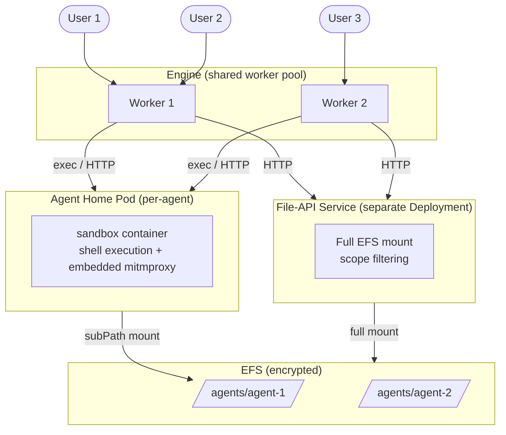
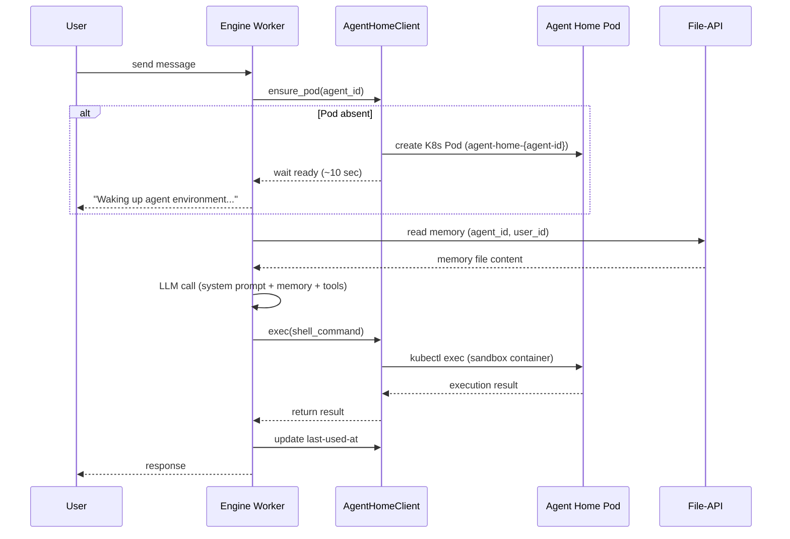
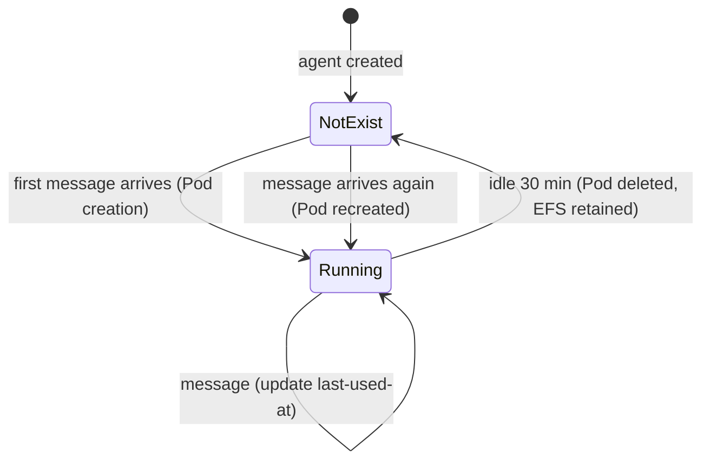
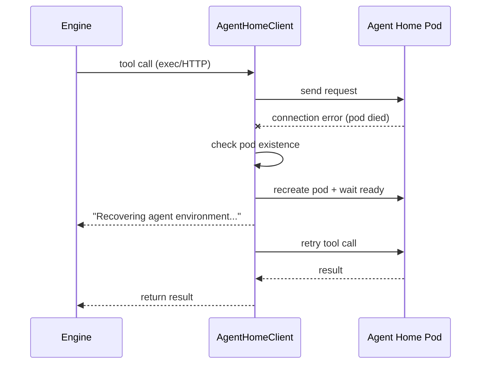

# Agent Home Design

## Overview

Keep one persistent pod ("Agent Home") per agent, managing execution environment at agent level rather than session level for multi-user agents.

### Motivation

The core value of nointern is "the whole team talks to and collaborates with one agent." Current "1 agent : 1 session : 1 sandbox" architecture creates these inefficiencies:

- Sandbox Pod per session → N Pods for same team with same credential
- Ephemeral state → detour through S3 file-gateway
- MCP resolves per session → cold start, distributed credential injection
- Agent "memory" scattered across sessions

### Change summary

| | Current | Agent Home |
|---|---|---|
| Sandbox lifetime | session (ephemeral) | agent (persistent) |
| File storage | S3 (file-gateway) | EFS (File-API) |
| Agent isolation | per Pod (session = Pod) | EFS subPath (kernel mount namespace) |
| User isolation (shell) | none | sandbox-runtime (bwrap) |
| Runtime security | gVisor | sandbox-runtime + seccomp + namespace |
| Pod allocation | WarmPool (sub-second) | Lazy creation (cold start ~10 sec) |
| Memory | through S3, scattered by session | EFS PV, persistent to agent |

## Architecture

### Overall topology



### Component details

#### Engine (shared worker pool, separate Pod)

Engine runs as shared worker pool same as current worker deployment.

- Can access internal network (DB, Redis, internal API)
- Stateless, horizontally scaled by HPA
- Communicates with Agent Home pod through `AgentHomeClient` (shell exec, file access)
- Communicates with File-API Service over HTTP (memory, skills, file read/write)
- On message arrival, ensures corresponding agent's Agent Home pod exists → creates if absent

#### Agent Home Pod (per-agent, persistent)

Execution environment of agent. Kept while agent is active, deleted after idle timeout.

**sandbox container:**
- Executes shell command requested by user
- Isolates per-user path with sandbox-runtime(bwrap)
- EFS subPath mounted at `/mnt/agent-data` — all files, memory, settings of agent live here
- Non-root user (`sandbox`), seccomp Unconfined (needed by bwrap)
- Embedded mitmproxy — entrypoint.sh starts proxy when `ENABLE_PROXY=1`
- Filtering based on domain allowlist/denylist (ALLOWED_DOMAINS, DENIED_DOMAINS env)
- Inspects HTTPS traffic through TLS interception

**Volume mounts:**
- EFS subPath: `/mnt/agent-data` — isolated persistent filesystem per agent. bwrap internally maps to `/home/sandbox/`, `/data/agent/`, `/data/user/`

**Pod spec example:**
```yaml
apiVersion: v1
kind: Pod
metadata:
  name: agent-home-{agent-id}
  namespace: nointern-sandbox
  labels:
    app: agent-home
    nointern/agent-id: "{agent-id}"
  annotations:
    nointern/last-used-at: "2026-03-23T10:00:00Z"
spec:
  containers:
    - name: sandbox
      image: nointern-agent-runtime:latest
      args: ["sleep", "infinity"]
      env:
        - name: ENABLE_PROXY
          value: "1"
        - name: ALLOWED_DOMAINS
          value: "pypi.org,files.pythonhosted.org,..."
        - name: DENIED_DOMAINS
          value: ""
      securityContext:
        runAsNonRoot: true
        runAsUser: 1000
        seccompProfile:
          type: Unconfined  # needed by bwrap
      resources:
        requests: { cpu: 500m, memory: 512Mi }
        limits: { cpu: 2, memory: 2Gi }
      volumeMounts:
        - name: agent-data
          mountPath: /mnt/agent-data
          subPath: agents/{agent-id}
  volumes:
    - name: agent-data
      persistentVolumeClaim:
        claimName: agent-home-efs
```

#### File-API Service (separate Deployment)

Central file service with access to full EFS. Managed/audited/deployed independently as security-critical component.

**Responsibilities:**
- Receive HTTP requests from Engine and read/write EFS files
- Scope filtering based on agent-id + user-id for every request
- Prevent path traversal (symlink resolution, block `..`, boundary check)
- Capacity tracking (application-level write accounting)

**Scope filtering rules:**
```
Request: GET /files?agent_id=abc&user_id=user1&scope=user&path=memory.md
→ Actual path: /efs/agents/abc/users/user1/memory.md

Request: GET /files?agent_id=abc&scope=agent&path=shared/config.json
→ Actual path: /efs/agents/abc/shared/config.json

Request: GET /files?agent_id=abc&scope=agent&path=../../other-agent/secret
→ Reject (path traversal)
```

**Deployment example:**
```yaml
apiVersion: apps/v1
kind: Deployment
metadata:
  name: file-api
  namespace: nointern-sandbox
spec:
  replicas: 2
  template:
    spec:
      containers:
        - name: file-api
          image: nointern-file-api:latest
          ports:
            - containerPort: 8081
          volumeMounts:
            - name: efs
              mountPath: /efs
          resources:
            requests: { cpu: 250m, memory: 256Mi }
            limits: { cpu: 500m, memory: 512Mi }
      volumes:
        - name: efs
          persistentVolumeClaim:
            claimName: file-api-efs  # full EFS mount
```

**Reason for separation:**
1. Has full EFS access → bug directly causes cross-agent leakage, so independently managed/audited
2. Always available even if Sandbox dies (separate deployment)
3. Engine communicates with one service endpoint (no per-pod IP)
4. Agent Home pod becomes simpler

### Reason for separating Engine and Agent Home

| Rationale | Description |
|------|------|
| NetworkPolicy | Pod-level policy — cannot apply different policies to engine (needs internal network) and sandbox (internal network blocked) |
| Independent scaling | Engine is stateless horizontal scale, Agent Home scales with number of agents |
| Deployment independence | Engine changes on service deployment, Agent Home only when runtime changes |
| Failure isolation | sandbox OOM does not affect engine |

**Trade-off:**
- network hop between engine↔sandbox (same as current architecture)
- file access through File-API (no direct PV access). But memory files are KB-scale text, so latency is acceptable

### Request flow



## Security

### Threat model

| Threat | Severity | Defense |
|------|--------|------|
| LLM jailbreak → access other **agent** data | **critical** | EFS subPath (kernel mount namespace) |
| LLM jailbreak → access other **user** data in same agent | low | sandbox-runtime (bwrap mount namespace) + File-API scope filtering |
| LLM jailbreak → internal network access | high | NetworkPolicy (block internal network) + mitmproxy (domain filtering) |
| Container escape → node access | low (unrealistic) | sandbox-runtime seccomp + non-root |

### Isolation between Agents (Hard Boundary)

Cross-agent data access is service-level security incident. Provide kernel-level isolation with **Kubernetes subPath mounting**.

- Pod spec mounts with `subPath: agents/{agent-id}`
- Inside container, only that directory is visible — other agent directories **do not exist**
- Linux mount namespace — **kernel-level isolation**
- sandbox-runtime(bwrap) seccomp + namespace isolation is additional defense layer
- Container escape is extremely unrealistic kernel exploit level (non-root + non-root)

**Advantages over EFS Access Point:**
- Access Point has hard limit 1,000 per filesystem → as agent count grows, filesystem sharding needed (complex batching decisions, rebalancing, metadata management)
- subPath has no count limit — single EFS filesystem scales indefinitely

### Isolation between Users (Soft Boundary)

User-to-user data leakage within agent is same team and jailbreak responsibility can be attributed to user, so risk is relatively lower. Still provide practical defense through sandbox-runtime.

| Access path | Defense mechanism | Strength |
|-----------|---------------|------|
| Shell execution (inside sandbox) | sandbox-runtime — OS-level path restriction with bwrap mount namespace | OS-level |
| Engine file access (via File-API) | File-API — application-level scope filtering | Application-level |

**sandbox-runtime behavior:**
- On shell command execution, bwrap creates new mount namespace
- Mounts only that user's directory: `/mnt/agent-data/home/` → `/home/sandbox/`, `/mnt/agent-data/agent/` → `/data/agent/`, `/mnt/agent-data/users/{user-id}/` → `/data/user/`
- Other user directories are not mounted and cannot be accessed

### Remove gVisor, adopt sandbox-runtime

gVisor and sandbox-runtime(bwrap) are incompatible. bwrap uses `unshare(CLONE_NEWNS)` + `mount MS_SLAVE`, which gVisor does not support (actual test confirmed `Failed to make / slave: Operation not permitted`).

**sandbox-runtime solves more problems than gVisor:**

| | gVisor | sandbox-runtime |
|---|---|---|
| Agent isolation | strong (double kernel) | moderate (bwrap namespace + seccomp) |
| User shell isolation | **impossible** | path isolation with mount namespace |
| Syscall compatibility | many constraints (~60 syscalls) | complete |
| Performance | overhead (10-20%) | native |

Only weakened aspect when removing gVisor is container escape (kernel exploit) defense, but:

- bwrap creates its own mount namespace + seccomp filter → LLM process runs inside bwrap
- escaping bwrap namespace ≈ same difficulty as Docker container escape
- LLM generating working kernel exploit payload is extremely unrealistic
- Additional defense: non-root + NetworkPolicy + non-root + seccomp
- Most production services operate with this level of isolation

### EKS compatibility (sandbox-runtime)

bwrap uses unprivileged user namespace without CAP_SYS_ADMIN.

- EKS nodes (AL2, AL2023, Bottlerocket) compiled with `CONFIG_USER_NS=y` → supported by default
- `kernel.unprivileged_userns_clone` is Debian/Ubuntu-specific sysctl — absent in EKS, no extra setting needed
- EKS default seccomp is Unconfined → allows `unshare` syscall
- Pod Security Standards use `baseline` (`restricted` requires `allowPrivilegeEscalation: false`, conflicts with bwrap)
- AL2023 SELinux enforcing mode may block → need adjust through Karpenter EC2NodeClass userData
- AL2 kernel 5.10 lacks overlayfs-in-userns support → use bwrap `--bind`/`--ro-bind` (sandbox-runtime default behavior, no issue)

**Required verification before implementation:**
```bash
# Run inside unprivileged container on EKS sandbox-dedicated node
bwrap --ro-bind / / --bind /tmp /tmp --dev /dev --proc /proc -- ls /
```

### NetworkPolicy

**Agent Home Pod (block internal network):**
```yaml
apiVersion: networking.k8s.io/v1
kind: NetworkPolicy
metadata:
  name: agent-home-egress
  namespace: nointern-sandbox
spec:
  podSelector:
    matchLabels:
      app: agent-home
  policyTypes: [Egress]
  egress:
    # Allow public internet (except internal networks)
    - to:
        - ipBlock:
            cidr: 0.0.0.0/0
            except:
              - 10.0.0.0/8
              - 172.16.0.0/12
              - 192.168.0.0/16
              - 127.0.0.0/8
              - 169.254.0.0/16
    # Exception: allow only MCP egress proxy internal access
    - to:
        - podSelector:
            matchLabels:
              app: mcp-egress-proxy
      ports:
        - port: 3128
          protocol: TCP
    # DNS
    - ports:
        - port: 53
          protocol: UDP
        - port: 53
          protocol: TCP
```

## Persistent Storage: EFS

### Selection rationale

| Item | EBS | EFS | S3 Mount |
|------|-----|-----|----------|
| RWX (multi-Pod access) | impossible | **possible** | unsafe |
| AZ constraint | AZ fixed | **none** | none |
| Latency | 0.1-0.2ms | 0.5-5ms | 50-100ms+ |
| Idle cost | provisioned GB billing | **IA tier $0.016/GB** | $0.023/GB |
| Provisioning | 10-30 sec | **immediate** | immediate |
| Node limit | 28 | **none** | none |
| Capacity limit | 5,000 per region | **unlimited (PB)** | unlimited |
| POSIX compatibility | full | full | incomplete |
| mount count limit | 28 per node | **none** (thousands concurrent mounts possible) | none |

- **S3 unsuitable**: 50-100ms+ latency unacceptable for frequent memory file I/O. No random write/append support
- **EBS unsuitable**: no RWX (Engine/File-API cannot access), AZ fixed (Pod rescheduling constrained), 28 per-node limit

### EFS configuration

```yaml
# Terraform example
resource "aws_efs_file_system" "agent_home" {
  encrypted  = true  # must be enabled at creation (cannot change later)
  kms_key_id = aws_kms_key.agent_home.arn  # Customer managed key

  lifecycle_policy {
    transition_to_ia = "AFTER_14_DAYS"  # 14 days no access → IA tier ($0.016/GB)
  }

  throughput_mode = "elastic"  # automatically adjusts by usage
}
```

**Encryption:**
- **At rest**: AES-256, Customer managed KMS key — control key policy/rotation
- **In transit**: TLS 1.2 (`-o tls` mount option)

**Mount settings:**
- `noresvport` option required — otherwise NFS ports limited to ~1,000 per node
- Use EFS CSI driver (`efs.csi.aws.com`)

### EFS directory structure

```
/efs/
  agents/
    {agent-id}/           ← Agent Home subPath mount point (/mnt/agent-data)
      home/               ← bwrap → /home/sandbox/ (wipeable)
      agent/              ← bwrap → /data/agent/ (persistent)
      users/
        {user-id}/        ← bwrap → /data/user/ (per-user persistent)
          memory/
            MEMORIES.md
```

### Memory

Keep Memory in EFS filesystem instead of moving to DB/Redis.

**Reason:** like daily log, this allows agent to freely write to filesystem and create new memory patterns. Agent can evolve its own memory system without code changes.

**Access paths:**
- When Engine reads memory: through File-API HTTP (scope filtering applied)
- When Sandbox writes memory: direct EFS write (under subPath `/mnt/agent-data/users/{user-id}/memory/`, accessed as `/data/user/memory/` through bwrap)

### Per-agent capacity limit

EFS itself has no per-directory quota feature.

**Considered and rejected: Loopback mount**
- Sparse image file on EFS → ext4 → loop mount can implement hard quota, but:
- `mount -o loop` requires `CAP_SYS_ADMIN` → effectively root privilege, weakens sandbox security. LLM jailbreak → container escape through shell command becomes **realistic threat**
- File-API (separate deployment) cannot read ext4 inside disk.img → dynamic loop mount management unrealistic

**Adopted: Container-level I/O monitoring + du scan** (not implemented in Phase 1, only secure capability)

> **Note**: Capacity limit/monitoring feature is excluded from Phase 1 implementation. Agent Home pod-per-agent structure naturally provides container-level metrics, so capability exists; actual alert/limit implementation follows later.

Since Agent Home is pod-per-agent, container-level I/O metrics can track per-agent usage.

**1. Container I/O metrics (realtime, including throughput):**

kubelet/cAdvisor exposes per-container I/O metrics, and Pod name is `agent-home-{agent-id}`, so mapping to agent is 1:1.

```promql
# per-agent write throughput (5 min average)
rate(container_fs_writes_bytes_total{pod=~"agent-home-.*"}[5m])

# abnormal write detection (over 10MB/s)
rate(container_fs_writes_bytes_total{pod=~"agent-home-.*"}[5m]) > 10485760
```

- Collect with Prometheus → per-agent I/O dashboard + alert
- Detect not only storage but also **throughput anomalies**
- Stop only corresponding pod on threshold exceed

**2. Async du scan (supporting, accumulated storage):**
- Periodically scan active agents asynchronously with `du -sb`
- Agent workspace 100-500 files → scan 0.1-5 sec (EFS metadata latency)
- Stop sandbox on exceed (block shell execution)

**3. File-API write accounting:**
- Writes through File-API can be checked immediately at application level

### Cost model

**Storage:**

| Tier | Price | Transition condition |
|------|------|-----------|
| Standard | $0.30/GB-month | default |
| Infrequent Access (IA) | $0.016/GB-month | 14 days no access (lifecycle policy) |
| Archive | $0.008/GB-month | 90 days no access |

**Throughput (Elastic mode):**

| Direction | Price |
|------|------|
| Read | $0.03/GB transferred |
| Write | $0.06/GB transferred |
| IA file access (additional) | +$0.01/GB |

### Cost estimate

**By agent count (average 5GB/agent, 80% idle):**

| Agents | Standard (20%) | IA (80%) | Throughput | Monthly total |
|-------------|----------------|----------|------------|---------|
| 100 | $30 | $6 | ~$10 | **~$46** |
| 500 | $150 | $32 | ~$30 | **~$212** |
| 1,000 | $300 | $64 | ~$50 | **~$414** |
| 2,000 | $600 | $128 | ~$80 | **~$808** |
| 5,000 | $1,500 | $320 | ~$150 | **~$1,970** |

**By single agent activity:**

| Activity level | Storage | Throughput | Monthly cost |
|-----------|---------|------------|---------|
| low (5GB, weekly) | $0.08 (IA) | ~$0.01 | **~$0.09** |
| medium (5GB, daily) | $1.50 | ~$0.15 | **~$1.65** |
| high (10GB, 10/day) | $3.00 | ~$1.50 | **~$4.50** |
| heavy (20GB, constant) | $6.00 | ~$10.00 | **~$16.00** |

IA lifecycle policy (14 days no access → IA tier) automatically moves idle agent files to low-cost tier.

### Cost attack scenarios

| Scenario | Attack method | Cost impact | Defense |
|----------|-----------|-----------|------|
| **Storage Bomb** | LLM jailbreak → infinite file creation | $100+/hour | Container I/O metric alert → pod stop |
| **Throughput Drain** | repeatedly read same file | $750/month | Container I/O metric alert → pod stop |
| **Mass IA access** | read many old files | low (+$0.01/GB) | unnecessary |
| **Mass agent creation** | create thousands through API | low (compute side) | agent count limit |
| **File upload bomb** | large upload through File-API | medium | max_file_size limit |

The most dangerous Storage Bomb and Throughput Drain can both be detected per-agent and stopped by **container I/O metrics**.

## Lifecycle

### Lazy creation + idle kill



- Create Agent Home Pod on first message (lazy)
- Delete Pod after idle timeout; EFS subPath retained
- Recreate Pod on next message — same mechanism
- Default idle timeout: **30 minutes**, configurable per agent (customer can keep longer, with corresponding billing)

### Cold start

| Step | Time |
|------|-----------|
| Pod scheduling | ~2 sec |
| Image pull (cached) | ~2 sec |
| Container start | ~1 sec |
| **Total** | **~5-7 sec** |

- WarmPool impossible: each agent has different EFS subPath, so volume mount cannot be preconfigured. subPath can be specified only at Pod creation time

**Frontend UX:**
- Unify cold start and pod failure recovery with same UX: "Preparing agent environment..." system message
- Backend sends pod preparation event → Frontend renders as system message
- Processing starts automatically after Pod ready → system message transition
- User does not need to distinguish cold start from failure recovery — both are "environment preparing"

### Pod management

**Creation:**
- Worker directly creates through K8s Pod API
- Pod name: `agent-home-{agent-id}` (deterministic)
- Duplicate creation prevention: K8s API returns `AlreadyExists` → use existing pod
- No separate controller/CRD needed

**Service discovery:**
- Deterministic naming: `kubectl get pod agent-home-{agent-id}` → query Pod IP
- Communicate directly with Pod IP (exec API, HTTP)

**Idle kill:**
- Worker cleanup loop scans based on pod annotation `last-used-at`
- Deletes pods idle over 30 minutes
- Any worker can scan — not tied to a specific worker

**Orphan GC:**
- Even if worker fails, other worker's idle scan cleans it up
- Existing lease mechanism can be simplified

**Worker RBAC change:**
```yaml
# current: sandboxclaims CRUD + pods get/exec
# changed: pods CRUD + exec (remove sandboxclaims)
rules:
  - apiGroups: [""]
    resources: ["pods"]
    verbs: ["get", "list", "create", "delete"]
  - apiGroups: [""]
    resources: ["pods/exec"]
    verbs: ["create", "get"]
  - apiGroups: ["coordination.k8s.io"]
    resources: ["leases"]
    verbs: ["get", "list", "create", "update", "delete"]
```

### Pod failure recovery

`AgentHomeClient` abstracts every communication with Agent Home pod (shell exec, MCP sidecar HTTP). Individual tools do not need to know retry logic.



- No data loss because EFS persists
- File-API and remote HTTP MCP are separate services, unaffected by pod failure
- Target only components communicating with Agent Home pod (shell exec, MCP sidecar HTTP). File-API and remote MCP are excluded

## Concurrency

Allow without separate concurrency control. Same model as normal multi-user server (multiple people SSH into Linux server). Filesystem handles concurrent access itself; conflicts are users' problem.

## Subagent

Subagent shares parent agent's Agent Home pod. It does not create separate sandbox.

## Implementation Phase

### Phase 1: Basic Agent Home architecture

```
Agent Home Pod [sandbox + embedded mitmproxy]
File-API Service (separate Deployment)
```

**Infra changes:**
- Create EFS filesystem (encryption, IA lifecycle, Elastic throughput)
- Configure EFS PV/PVC (CSI driver)
- Agent Home NetworkPolicy (block internal network, egress proxy exception)
- Change Worker RBAC (pods CRUD, remove sandboxclaims)
- Remove SandboxTemplate/WarmPool CRD
- Remove gVisor runtimeClass from Karpenter sandbox node pool
- Add File-API Deployment/Service

**Backend changes:**
- New `AgentHomeClient` implementation — pod management (creation, discovery, idle kill, failure recovery), exec/HTTP communication abstraction
- Refactor `SandboxManager` — session-level → agent-level. Reuse existing `Sandbox` interface (exec, write_file, read_file)
- Switch `SessionDataStorage` — S3 → File-API HTTP client. Reuse `SharedScope`, URI parsing logic
- Implement File-API service — convert existing file-gateway to EFS backend, strengthen scope filtering
- Integrate sandbox-runtime — apply bwrap wrapper on shell command execution
- Dynamic Pod spec creation — configure Pod spec based on agent setting
- Async du scan — active agent capacity monitoring
- Existing MCP continues to work as remote HTTP (no change)

**Required verification before implementation:**
- Verify bwrap works in unprivileged container on EKS sandbox-dedicated node
- Check/adjust AL2023 SELinux settings

## Local Development (Docker)

Reproduce Agent Home as Docker container in local dev environment. Convert current Docker sandbox structure (3-container model) to Agent Home model.

### K8s vs Docker mapping

| K8s (prod) | Docker (local) | Note |
|---|---|---|
| EFS + subPath | host bind mount `./data/agents/{agent-id}:/mnt/agent-data` | same agent isolation effect |
| sandbox-runtime (bwrap) | sandbox-runtime (bwrap) | **same behavior** — seccomp=unconfined required |
| File-API (separate Deployment) | File-API (separate container) | full `./data/` bind mount |
| embedded mitmproxy | embedded mitmproxy (ENABLE_PROXY env) | controlled by entrypoint.sh |
| NetworkPolicy (block internal network) | **give up** | impractical in Docker, local dev needs internal service access |
| non-root | **not applicable** | |
| Karpenter | **not applicable** | |

### Security requirement reproducibility

| Requirement | Reproduced | Reason |
|----------|------|------|
| Agent isolation | ✅ | per-agent bind mount means container sees only that directory |
| sandbox-runtime (per-user) | ✅ | bwrap works (Linux and macOS Docker Desktop). prod reproducibility required |
| NetworkPolicy | ❌ | iptables control impossible on macOS Docker Desktop, given up for dev convenience |
| mitmproxy | ✅ | embedded in container, controlled by ENABLE_PROXY env |

### Docker container composition

```yaml
# Agent Home container (per-agent, persistent)
agent-home-{agent-id}:
  image: nointern-agent-runtime:local
  volumes:
    - ./data/agents/{agent-id}:/mnt/agent-data
  environment:
    - ENABLE_PROXY=1
    - ALLOWED_DOMAINS=pypi.org,files.pythonhosted.org,...
    - DENIED_DOMAINS=
  security_opt:
    - seccomp=unconfined    # needed by bwrap
  networks:
    - sandbox-restricted
  mem_limit: 512m
  cpus: 0.5

# File-API service (separate container, full data mount)
file-api:
  image: nointern-file-api:local
  ports:
    - "8081:8081"
  volumes:
    - ./data:/efs    # corresponding to full EFS
```

### sandbox-runtime settings

Docker container requires `seccomp=unconfined` for bwrap to work. Change current Docker sandbox code `SecurityOpt`:

```python
# current
"SecurityOpt": ["no-new-privileges"]

# changed
"SecurityOpt": ["seccomp=unconfined"]
```

macOS Docker Desktop runs inside Linux VM, so bwrap works (`CONFIG_USER_NS=y` supported by default).

### Phase 2: MCP Sidecar (TBD)

Add stdio MCP sidecar to Agent Home pod to support stdio-only MCP servers (GCP Observability, Google Analytics, etc.). Detailed design follows after Phase 1 completion.

**Direction:**
- MCP sidecar internally manages stdio MCP process (HTTP↔stdio bridge, using MCP SDK `stdio_client`)
- Dynamically include only sidecars required in per-agent Pod spec
- Team credential only (stdio MCP reads credential from env at process start; cannot switch per-user)
- MCP needing per-user credential supports only HTTP transport (can pass credential through request header)
- Existing `McpBasedToolkit` unchanged, only `server_url` points to MCP sidecar
- External API calls of MCP sidecar go through egress proxy (inject `HTTP_PROXY`/`HTTPS_PROXY` env)
