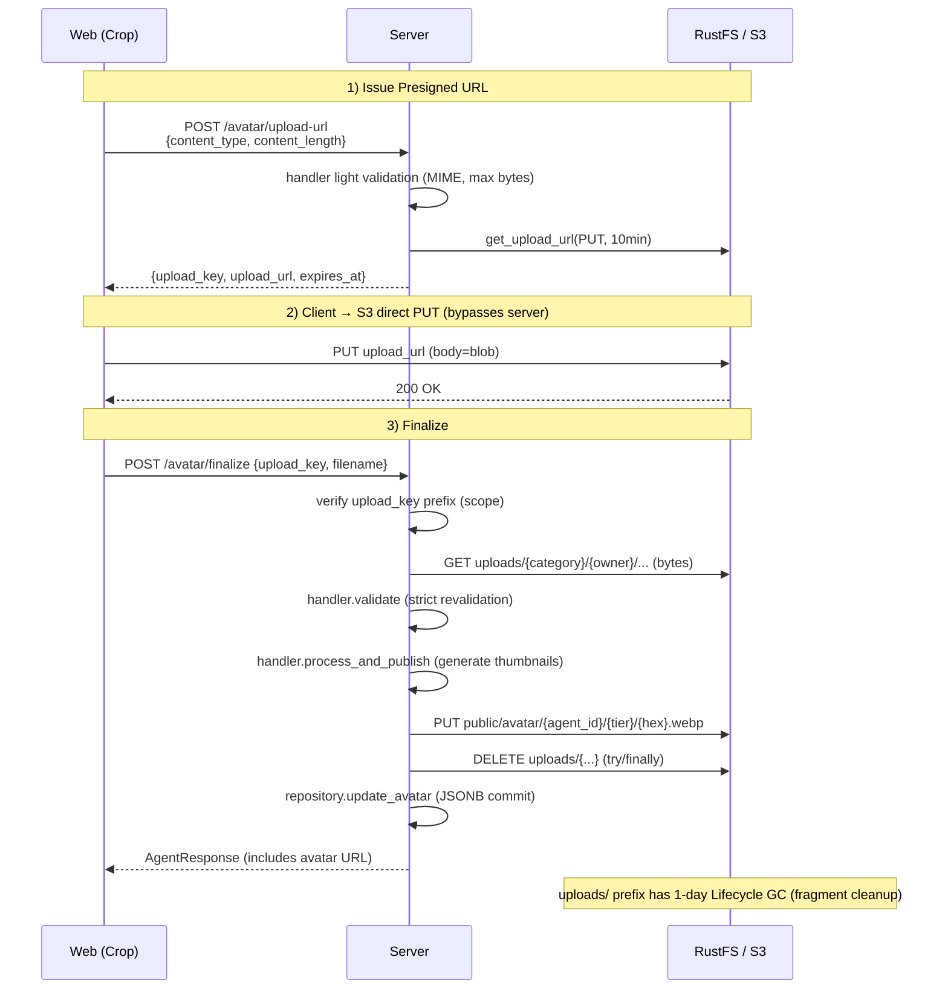
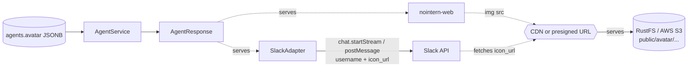

# Agent Profile Image Design

## Overview

Per-Agent profile image upload/serving feature. Reflect per-agent avatar in web UI display and Slack message sending.

This feature is the first nointern feature to **store/serve user-uploaded files in S3**. Therefore, instead of avatar-specific implementation, it introduces a **generalized file upload framework** (`UploadService` + `UploadHandler`) that future chat attachments / workspace icons can share. Avatar is implemented as its first handler.

- Related issue: [#2828](https://github.com/azents/azents/issues/2828)
- Discussion: [#2830](https://github.com/azents/azents/discussions/2830)
- Decision record: [adr/0001-agent-profile-image.md](../adr/0001-agent-profile-image.md)

## User Scenarios

1. Workspace admin creates agent and uploads profile image.
2. In web UI, select file → square crop (react-easy-crop) → upload.
3. Once saved, displayed as circular avatar in agent list/card/chat header.
4. When that agent responds in Slack, displayed as message sender avatar.
5. To change image, upload again (re-crop = re-upload).
6. If image removed, web falls back to client initials, Slack falls back to app default icon.

**Out of scope**: Discord per-agent avatar (Bot REST API cannot override identity per-message; Webhook transition is separate work, so P1=A abandoned).

## Decision Summary (Discussion #2830)

| # | Decision |
|---|---|
| P1 | Give up Discord per-agent avatar (keep Bot API) |
| P2 | avatar is public information + unguessable hash in URL (`secrets.token_hex(16)`) |
| P3 | Scope is Agent only in this iteration |
| P4 | Default avatar: web uses client initials, Slack omits `icon_url` |
| P5 | Discard original image and store thumbnails only |

## Architecture

### Upload flow (presigned 3-step)



**Server traffic load**: upload body does not pass through server, so no proxy cost. However, in `finalize` step, server downloads file once from S3 to validate/resize, so **server ↔ S3 internal round-trip traffic remains** — if large file handler is introduced, async processing with Temporal workflow will be introduced in [#2876](https://github.com/azents/azents/issues/2876).

### Runtime serving



## Generalized File Upload Framework

### Common Key structure

| Prefix | Purpose | Public access | Lifecycle |
|---|---|---|---|
| `uploads/{category}/{owner_id}/{uuid}-{hex}` | temporary upload waiting for validation | No (server GET only) | **1-day TTL** |
| `public/{category}/{owner_id}/...` | public output published by handler | Yes (CDN / presigned) | permanent (handler explicitly deletes on reupload) |
| `internal/{category}/{owner_id}/...` | private output (attachments, etc.) | No (presigned only) | defined per category (future) |

- `category` declared by handler as `ClassVar[str]` (e.g. `"avatar"`, future `"chat_attachment"`).
- `owner_id` is subject of permission boundary (agent, session, etc.), determined by API caller from endpoint path.
- `{uuid}-{hex}` is `uuid.uuid4() + secrets.token_hex(8)` — collision/guessing prevention.

### UploadHandler protocol

Adopt `typing.Protocol` — inside nointern, handler is lightweight contract assembled as instance in DI module, so multiple inheritance unnecessary.

```python
# python/apps/nointern/src/nointern/services/uploads/__init__.py
from typing import ClassVar, Protocol

class UploadHandler(Protocol):
    category: ClassVar[str]
    allowed_mime_types: ClassVar[frozenset[str]]
    max_bytes: ClassVar[int]

    async def validate(self, body: bytes) -> None:
        """Strict validation of uploaded bytes. Fails with ``UploadValidationError``."""

    async def process_and_publish(
        self,
        body: bytes,
        owner_id: str,
        filename: str,
        s3: S3Service,
        bucket: str,
    ) -> StoredImage:
        """Create final output from validated bytes, publish, and return StoredImage."""
```

### UploadService

```python
UPLOAD_URL_EXPIRES = datetime.timedelta(minutes=10)


class UploadValidationError(Exception):
    """handler constraint violation (MIME, size, dimension, etc.)."""


@dataclass(frozen=True)
class UploadTicket:
    upload_key: str
    upload_url: str
    expires_at: datetime.datetime  # tz-aware


@dataclass
class UploadService:
    s3: S3Service
    bucket: str
    handlers: dict[str, UploadHandler]

    async def issue_upload_ticket(
        self,
        category: str,
        owner_id: str,
        content_type: str,
        content_length: int,
    ) -> UploadTicket:
        handler = self._handler(category)
        if content_type not in handler.allowed_mime_types:
            raise UploadValidationError(f"unsupported mime: {content_type}")
        if content_length <= 0 or content_length > handler.max_bytes:
            raise UploadValidationError("content_length out of range")

        upload_key = (
            f"uploads/{category}/{owner_id}/{uuid.uuid4()}-{secrets.token_hex(8)}"
        )
        upload_url = await self.s3.get_upload_url(
            bucket=self.bucket,
            key=upload_key,
            content_type=content_type,
            expires_in=UPLOAD_URL_EXPIRES,
        )
        return UploadTicket(
            upload_key=upload_key,
            upload_url=upload_url,
            expires_at=datetime.datetime.now(datetime.timezone.utc)
            + UPLOAD_URL_EXPIRES,
        )

    async def finalize(
        self,
        category: str,
        owner_id: str,
        upload_key: str,
        filename: str,
    ) -> StoredImage:
        if not upload_key.startswith(f"uploads/{category}/{owner_id}/"):
            raise UploadValidationError("invalid upload_key (scope mismatch)")
        handler = self._handler(category)

        body = await self.s3.download_bytes(bucket=self.bucket, key=upload_key)
        if body is None:
            raise UploadValidationError("upload not found or expired")

        try:
            await handler.validate(body)
            return await handler.process_and_publish(
                body=body,
                owner_id=owner_id,
                filename=filename,
                s3=self.s3,
                bucket=self.bucket,
            )
        finally:
            # Delete uploads/ regardless of validation/processing success/failure. Lifecycle is backup.
            with contextlib.suppress(Exception):
                await self.s3.delete(bucket=self.bucket, key=upload_key)
```

### Security principles

- Revalidate `upload_key` prefix as `uploads/{category}/{owner_id}/` during finalize — cannot hijack another owner's upload into own finalize.
- Server **revalidates with actual bytes** during finalize (do not trust Content-Length header, defend bombs with Pillow decode).
- Minimize Presigned URL TTL (10 min).
- Delete uploads/ immediately even on validation failure + Lifecycle 1-day as second safety net.

### Extension examples (future)

- `ChatAttachmentHandler` (category="chat_attachment", owner_id=session_id)
- `WorkspaceIconHandler` / `UserAvatarHandler` (scope deferred by P3, extend with same framework)

Each only needs new handler registration and can reuse `/upload-url` + `/finalize` pattern as-is.

## Data Layer

### Responsibilities by layer

| Layer | Location | avatar type | Responsibility |
|---|---|---|---|
| **DB row (JSONB)** | `rdb/models/agent.py` | `dict[str, Any] \| None` | raw storage |
| **Domain (Repository return)** | `repos/agent/data.py` Agent | `StoredImage \| None` | structured Pydantic, includes S3 key |
| **Service output** | `services/agent/data.py` AgentOutput | `UploadedImage \| None` | resolved URL |
| **API response** | `api/public/agent/v1/data.py` AgentResponse | `UploadedImage \| None` | reuse same type as service output |

- **Repository handles JSON ↔ Pydantic conversion** — `TypeAdapter.validate_python(row.avatar)` / `model_dump(mode="json")`. Follow existing `model_parameters` JSONB handling pattern (`repos/agent/__init__.py:25, 481-483`).
- **Service layer sees only Pydantic types** — no dict manipulation.

### Common schema

`python/apps/nointern/src/nointern/services/uploads/schema.py`:

```python
# For JSONB storage (internal) — S3 key + metadata

class StoredImageFile(BaseModel):
    key: str
    content_type: str
    size_bytes: int
    width: int | None = None
    height: int | None = None


class StoredImageThumbnails(BaseModel):
    """Declarative 3-tier thumbnail — follows azents FoodImageOutput.

    Optional for future async resize. avatar is sync so all filled,
    but future async handler (#2876) may have some None until resize completes.
    """
    small: StoredImageFile | None = None
    medium: StoredImageFile | None = None
    large: StoredImageFile | None = None


class StoredImage(BaseModel):
    """Image schema for JSONB storage. Repository parses/dumps this type."""
    filename: str
    default: StoredImageFile  # always non-null fallback
    thumbnails: StoredImageThumbnails = Field(default_factory=StoredImageThumbnails)
    original: StoredImageFile | None = None  # None for avatar per P5
    uploaded_at: datetime.datetime


# For API response (external) — resolved URL

class ImageFile(BaseModel):
    url: str
    width: int
    height: int


class ImageThumbnails(BaseModel):
    small: ImageFile | None = None
    medium: ImageFile | None = None
    large: ImageFile | None = None


class UploadedImage(BaseModel):
    """Common image schema for API response. agent avatar / workspace icon / chat
    attachment previews all reuse this type. `default` is always non-null."""
    filename: str
    default: ImageFile
    thumbnails: ImageThumbnails
    uploaded_at: datetime.datetime
```

Follow pattern of azents `FoodImageOutput` (`python/apps/azents/src/azents/services/food/data.py:34`) — declarative tier + always-available fallback — generalized as common schema.

### DB migration

```bash
cd python/apps/nointern
uv run alembic revision -m "add avatar column to agents"
```

- Add nullable JSONB column `agents.avatar`.
- Update `db-schemas/rdb/revision` to new revision ID.

### Repository

```python
# repos/agent/__init__.py
_avatar_adapter = TypeAdapter[StoredImage](StoredImage)

class AgentRepository:
    def _build_row(self, row) -> Agent:
        rdb, provider, identifier = row.tuple()
        return Agent(
            ...,
            avatar=(
                _avatar_adapter.validate_python(rdb.avatar)
                if rdb.avatar is not None
                else None
            ),
        )

    async def update_avatar(
        self,
        session: AsyncSession,
        agent_id: str,
        avatar: StoredImage | None,
    ) -> Result[Agent, NotFound]:
        avatar_dict = avatar.model_dump(mode="json") if avatar is not None else None
        ...
```

## Backend Implementation

### AvatarUploadHandler

`python/apps/nointern/src/nointern/services/uploads/handlers/avatar.py`:

```python
class AvatarUploadHandler:
    category: ClassVar[str] = "avatar"
    allowed_mime_types: ClassVar[frozenset[str]] = frozenset(
        {"image/jpeg", "image/png", "image/webp"}
    )
    max_bytes: ClassVar[int] = 5 * 1024 * 1024
    max_dimension: ClassVar[int] = 4096
    thumbnail_sizes: ClassVar[tuple[tuple[str, int], ...]] = (
        ("small", 128),
        ("medium", 256),
        ("large", 512),
    )

    async def validate(self, body: bytes) -> None:
        # Pillow decode → square? → dimension check
        ...

    async def process_and_publish(
        self, body, owner_id, filename, s3, bucket,
    ) -> StoredImage:
        # generate small/medium/large WebP thumbnails, default = shares same key as large
        # new hex on every upload — reupload automatically invalidates old URL
        ...
```

### AgentService extension

Follow existing `AgentService.update_by_id` (`services/agent/__init__.py:305`) pattern exactly: **workspace_id check + `_check_admin_or_owner` + Result[…, NotFound | NotBelongToWorkspace | NotAdmin]**.

```python
async def request_avatar_upload(
    self,
    agent_id: str,
    *,
    workspace_id: str,
    workspace_user_id: str,
    role: WorkspaceUserRole,
    content_type: str,
    content_length: int,
) -> Result[
    AvatarUploadTicketOutput,
    NotFound | NotBelongToWorkspace | NotAdmin | AvatarUploadRejected,
]:
    ...


async def finalize_avatar(
    self,
    agent_id: str,
    *,
    workspace_id: str,
    workspace_user_id: str,
    role: WorkspaceUserRole,
    upload_key: str,
    filename: str,
) -> Result[
    AgentOutput,
    NotFound | NotBelongToWorkspace | NotAdmin | AvatarUploadRejected,
]:
    ...


async def remove_avatar(
    self,
    agent_id: str,
    *,
    workspace_id: str,
    workspace_user_id: str,
    role: WorkspaceUserRole,
) -> Result[AgentOutput, NotFound | NotBelongToWorkspace | NotAdmin]:
    ...
```

### AgentOutput

`services/agent/data.py` — `Agent` domain model has `avatar: StoredImage | None`, and AgentOutput must expose `UploadedImage | None` with resolved URL. Overriding Pydantic field type creates variance warning, so use **composition**:

```python
class AgentOutput(BaseModel):
    """service output — Agent fields + resolved avatar URL."""
    # explicitly duplicate every field of Agent
    id: str
    workspace_id: str
    ...
    avatar: UploadedImage | None = None  # resolved
    created_at: datetime.datetime
    updated_at: datetime.datetime

    @classmethod
    def from_agent(
        cls,
        agent: Agent,
        *,
        avatar: UploadedImage | None,
    ) -> Self:
        return cls(
            id=agent.id,
            ...,
            avatar=avatar,
            ...,
        )
```

Service `_build_output(agent: Agent) -> AgentOutput` converts `StoredImage → UploadedImage` (apply CDN base URL or generate presigned URL).

## API Endpoints

| Method | Path | Description |
|---|---|---|
| `POST` | `/agent/v1/workspaces/{handle}/agents/{agent_id}/avatar/upload-url` | issue presigned PUT ticket |
| `POST` | `/agent/v1/workspaces/{handle}/agents/{agent_id}/avatar/finalize` | notify upload completion + server validate/resize |
| `DELETE` | `/agent/v1/workspaces/{handle}/agents/{agent_id}/avatar` | remove avatar |

**Permission**: `get_workspace_member` (workspace membership) + service `_check_admin_or_owner` (agent admin). Same as existing `update_agent` (`api/public/agent/v1/__init__.py:245`) pattern.

Add `avatar: UploadedImage | None` field to `AgentResponse` in existing `GET /agents`, `GET /agents/{id}`, etc.

## Frontend Implementation

### Dependency

`pnpm add react-easy-crop` (nointern-web).

### Components

- `AgentAvatar.tsx` — render circular avatar. Use `avatar.default.url` as always-available fallback, select `thumbnails.{small,medium,large}?.url` by size. If no avatar, initials + hash color.
- `AgentAvatarEditor.tsx` — shown in edit mode. crop with react-easy-crop (aspect={1}, cropShape="round") → WebP blob → 3-step upload.

### 3-step hook (`useAgentAvatar`)

```typescript
export function useUploadAgentAvatar() {
  return useMutation({
    mutationFn: async ({ agentId, handle, blob }) => {
      // 1) upload-url
      const { upload_key, upload_url } = await fetchUploadUrl(agentId, handle, blob);
      // 2) direct PUT to S3
      await fetch(upload_url, {
        method: "PUT",
        headers: { "Content-Type": blob.type },
        body: blob,
      });
      // 3) finalize
      return await fetchFinalize(agentId, handle, upload_key, "avatar.webp");
    },
  });
}
```

### Next.js proxy routes (3)

- `src/app/(app)/api/agent/[agentId]/avatar/upload-url/route.ts` (POST)
- `src/app/(app)/api/agent/[agentId]/avatar/finalize/route.ts` (POST)
- `src/app/(app)/api/agent/[agentId]/avatar/route.ts` (DELETE)

Each route injects auth token with `getAccessToken()` and JSON passthrough to backend. Actual image PUT is browser → S3 direct, so it does not go through proxy.

### CORS (brownfield)

Need CORS settings allowing browser PUT on S3/RustFS bucket:

```json
{
  "CORSRules": [{
    "AllowedMethods": ["PUT", "GET"],
    "AllowedOrigins": ["https://{nointern-web-domain}"],
    "AllowedHeaders": ["Content-Type", "x-amz-*"],
    "MaxAgeSeconds": 300
  }]
}
```

AWS S3 uses `aws_s3_bucket_cors_configuration` Terraform resource, RustFS uses `mc cors set` — apply in infra.

## Slack Integration

### Manifest scope

Add `chat:write.customize` to manifest bot_scopes in `api/public/slack_installation/v1/__init__.py`. Add to OAuth URL scope string in `services/slack/installation.py` too.

**BYOA caveat**: existing BYOA installations need reinstall. UI guidance: "reinstall Slack app to reflect avatar" — follow-up issue [#2845](https://github.com/azents/azents/issues/2845).

### SlackAdapter extension

According to [official chat.startStream docs](https://docs.slack.dev/reference/methods/chat.startStream), `username`/`icon_url`/`icon_emoji` are officially supported. slack-sdk 3.41.0 type signature does not expose them, but kwargs are forwarded to API, so call is possible.

Add `agent_name`, `agent_icon_url: str | None` to `SlackAdapter.__init__`. Build `{"username": agent_name, **(icon_url if not None else {})}` with `_identity_kwargs()` helper and pass `**_identity_kwargs()` to every `chat_postMessage` / `chat_postEphemeral` / `chat_stream` call.

| Slack API | Apply | Note |
|---|---|---|
| `chat.postMessage` | yes | official parameter |
| `chat.postEphemeral` | yes | official parameter |
| `chat.startStream` | yes | officially supported (SDK kwargs forward) |
| `chat.appendStream` / `stopStream` | no | API does not support identity override. keeps start identity |
| `chat.update` | no | cannot change identity of already posted message |

### Inject agent from Engine

Before creating SlackAdapter in `worker/engine.py`, look up agent → resolve `StoredImage → UploadedImage` → calculate `agent_icon_url = uploaded.default.url` and pass it. Copy Discord adapter's agent name lookup pattern (`worker/engine.py:697-703`).

## Feasibility Verification

| Item | Status | Note |
|---|---|---|
| boto3 / aioboto3 / Pillow dependencies | ✅ exist | `pyproject.toml` L19-20, 47 |
| `az-common` `S3Service.get_upload_url` | ❌ absent | add in this PR (presigned PUT) |
| `core/email/deps.py` aioboto3 DI pattern | ✅ reusable | same pattern when writing S3Service DI |
| `TypeAdapter` JSONB conversion pattern | ✅ existing (`repos/agent/__init__.py:25`) | same method as `model_parameters` |
| AgentService `_check_admin_or_owner` | ✅ existing (`services/agent/__init__.py:305+`) | reuse update_by_id pattern |
| Pydantic `frozen_as_default` | ✅ existing | follow project convention |
| `chat.startStream` identity | ✅ confirmed | official API support, slack-sdk kwargs forward |
| Slack `chat:write.customize` scope | ❌ not applied | add to manifest and OAuth URL |
| S3 Lifecycle rule (`uploads/` 1-day) | ⚠️ infra needed | track via separate infra PR or this feature docs |
| S3 CORS (browser PUT) | ⚠️ infra needed | same |

### Risks

| Risk | Mitigation |
|---|---|
| synchronous S3 download + resize in `finalize` occupies server thread | small avatar is okay. If large handler is introduced, async with Temporal workflow in [#2876](https://github.com/azents/azents/issues/2876). |
| client does not call finalize (page leave) | uploads/ 1-day Lifecycle auto cleanup. next upload gets new upload_key. |
| malicious image (zip bomb etc.) | defend at decode phase with Pillow `Image.open().load()` + max dim/size check |
| BYOA user did not reinstall scope | deployment notice + [#2845](https://github.com/azents/azents/issues/2845) UI guidance. If not reinstalled, Slack ignores username/icon_url and shows default identity. |

## Implementation Plan (Phase Split)

`/ship-feature` stack configuration:

| PR | Content | Branch |
|---|---|---|
| 1/N | design document (this document) | `docs/agent-profile-image` |
| 2/N | implementation plan | `plan/agent-profile-image` |
| 3/N | Phase 1 — Upload framework + AvatarUploadHandler + S3 DI + az-common extension | `feat/agent-profile-image/phase1` |
| 4/N | Phase 2 — Backend API (migration, repo, service, endpoints) | `feat/agent-profile-image/phase2` |
| 5/N | Phase 3 — Frontend (react-easy-crop, 3-step, components) | `feat/agent-profile-image/phase3` |
| 6/N | Phase 4 — Slack integration (scope, adapter, engine) | `feat/agent-profile-image/phase4` |
| 7/N | testenv QA | `test/agent-profile-image/testenv-qa` |
| 8/N | spec promotion (confirm design `implemented`, spec/domain/agent.md + spec/flow/file-upload.md) | `spec/agent-profile-image/promotion` |
| 9/N | cleanup | `chore/agent-profile-image/cleanup` |

## testenv QA Scenarios

Automated (testenv):

| ID | Scenario |
|---|---|
| AVT-01 | upload-url → PUT → finalize → GET agent response returns `avatar.default.url` / thumbnails |
| AVT-02 | on reupload, new hex applied and previous S3 object deletion confirmed |
| AVT-03 | DELETE → agent.avatar null, S3 object removed |
| AVT-04 | user from another workspace calls upload-url → 403/404 |
| AVT-05 | 400x300 (non-square) bytes → 400 at finalize |
| AVT-06 | 6MB file → 400 at upload-url |
| AVT-07 | image/gif → 400 at upload-url |
| AVT-08 | upload_key prefix mismatch at finalize → 400 |
| AVT-09 | regression: existing agent CRUD works normally |

Manual:

| ID | Scenario |
|---|---|
| AVT-M01 | confirm avatar appears when agent responds in Slack |
| AVT-M02 | agent without avatar → Slack app default icon |
| AVT-M03 | BYOA app (scope missing) → username/icon_url ignored |
| AVT-M04 | web crop modal mobile touch behavior |

## Alternatives Considered

**Temporal workflow based finalize (async)** — rejected reason: avatar is small and immediate feedback matters. Revisit when large handler is introduced ([#2876](https://github.com/azents/azents/issues/2876)).

**Webhook-based Discord sending** (P1 B/C) — rejected reason: redesign burden for existing Bot-based UX (edit, reaction, streaming).

**Create separate `nointern-avatars` bucket** — rejected reason: config already designed to use `workspace_s3_bucket` as shared bucket (`core/config.py:188-190`). Prefix separation is sufficient.

**multipart POST (upload through server)** — rejected reason: server traffic load (review feedback). presigned PUT gives browser → S3 direct.

**avatar-specific Pydantic types (`AgentAvatarOutput`, `AgentAvatarResponse`, etc.)** — rejected reason: not reusable by future handlers such as workspace icon / chat attachment. Unified as common `UploadedImage`.

**Override avatar field type in `AgentOutput(Agent)`** — rejected reason: Pydantic field variance warning + harder-to-read code. Adopt composition (`from_agent` factory).
