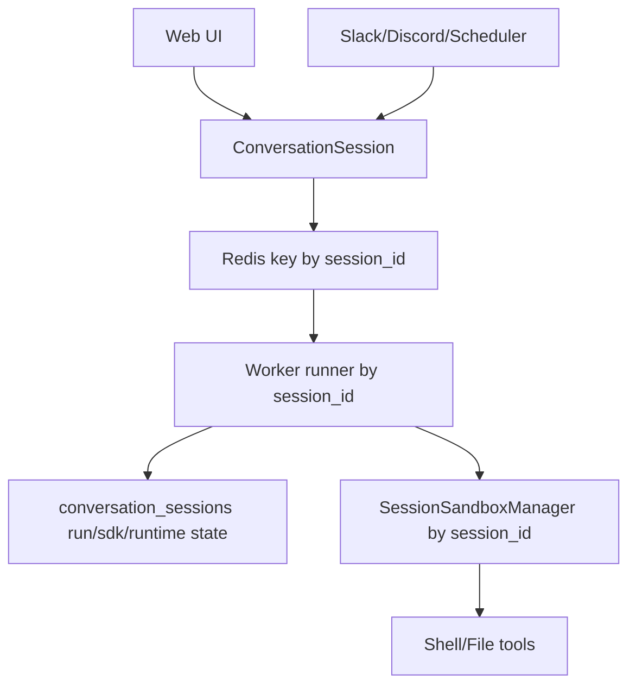
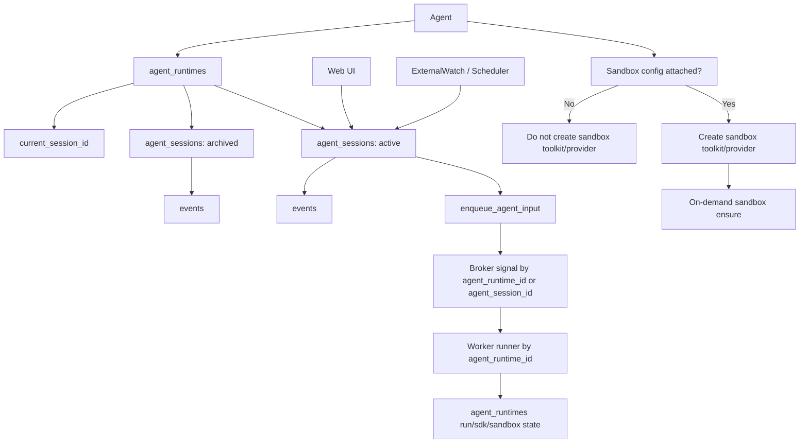
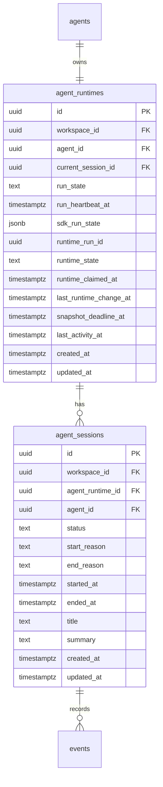
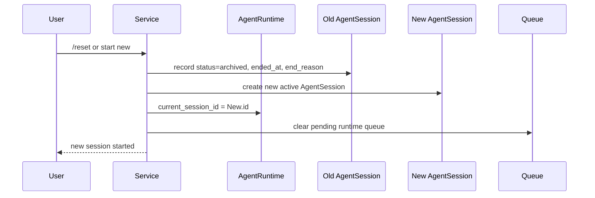
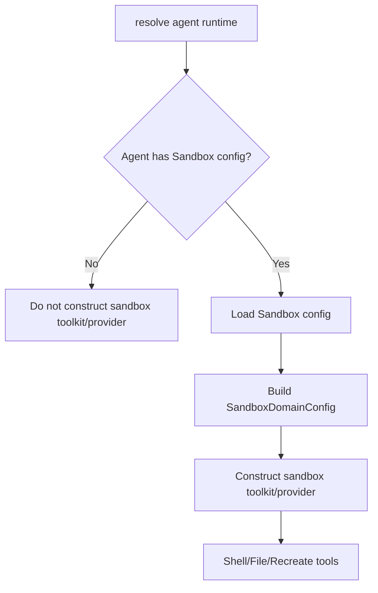
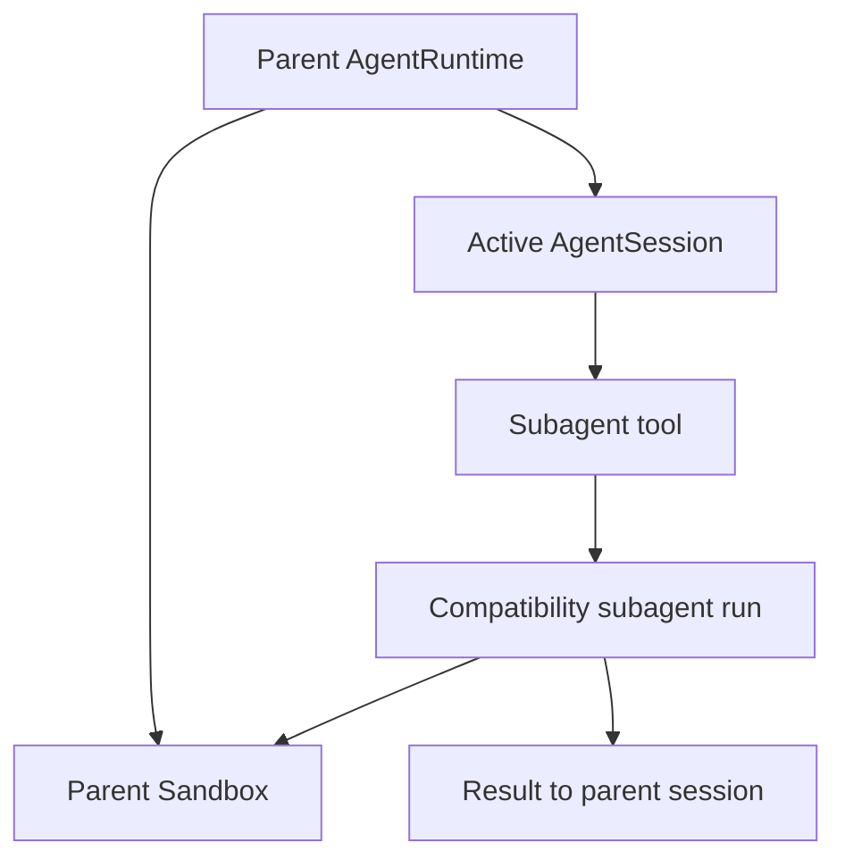

# Agent Runtime and Session Foundation Design

## Overview

This document is design document for #3331. Since #3332 ExternalWatch stack created bridge through which Slack/Discord/Scheduler input can enter agent-dedicated execution flow, durable ownership of runtime is now organized around agent.

Initial discussion tried to represent “one active session per agent” as single `agent_sessions` row, but using session itself as long-term runtime identity is unnatural when considering long-term session reset/new/compaction. This design separates long-term runtime identity and conversation segment.

Core principles are as follows.

- Discard `raw session` vocabulary.
- **1 Agent = 1 AgentRuntime**.
- **1 AgentRuntime = multiple AgentSessions**, and exactly one active AgentSession.
- Events belong to AgentSession.
- Worker run state, SDK run state, and sandbox runtime state belong to AgentRuntime.
- Reset/new is active AgentSession rotation, not AgentRuntime deletion or events deletion.
- Sandbox availability is determined not by separate policy enum but by whether Agent has **Sandbox config** attached.
- Do not create sandbox toolkit/provider path for Agent without Sandbox config.
- Existing subagent execution remains compatibility path and preserves parent sandbox sharing.
- task-scoped ephemeral agent spawn is designed separately in follow-up issue #3363.

## Related Issues and Discussion

- Parent: #3330
- Implementation issue: #3331
- Design discussion: #3362
- Follow-up tracker: #3364
- Ephemeral agent spawn follow-up: #3363
- ConversationSession runtime migration follow-up: #3338

## Terminology

| Existing expression | New expression | Note |
|---|---|---|
| raw session | agent session | Do not use in new design documents and new code. |
| raw_session_id | agent_session_id | Conversation segment id. |
| one raw/session row per agent | agent_runtime | Long-term runtime identity. |
| ShellEnvironment | Sandbox config | schema/API rename is performed gradually. |
| sandbox_policy | none | Do not create separate enum/flag. |

Names provided by external SDK object or existing event payload schema such as `raw_item` remain only at compatibility boundary until separate event schema migration. Do not use them in new nointern domain vocabulary.

## Current Structure



Current `ConversationSession` has responsibilities beyond chat history.

- broker shard key
- worker runner key
- run state / heartbeat
- SDK run-state persistence
- sandbox runtime state
- session snapshot ownership
- stuck recovery scan target

Also, current SDK `clear_session()` and event store `clear()` delete events rows of that session. When Agent becomes long-term runtime identity, this destructive reset is unsuitable.

## Target Structure



## Discussion Points and Decisions

### 1. Canonical storage

**Decision:** Separate long-term runtime identity as `agent_runtimes`, conversation segment as `agent_sessions`.

Do not use `agent_sessions` as canonical runtime row with one row per agent. session should be “conversation segment user can start anew”, and rotates to new row on reset/new.

Invariants:

- One Agent has one AgentRuntime.
- One AgentRuntime can have multiple AgentSessions.
- One AgentRuntime has one active AgentSession.
- Event belongs to one AgentSession.
- Sandbox/runtime state belongs to one AgentRuntime.

### 2. Broker/runtime boundary

**Decision:** Introduce `AgentSessionMessage` / `enqueue_agent_input(...)` facade.

External/Web/Scheduler callers enqueue input to active AgentSession. Internally, while needed, legacy `SessionMessage` compatibility adapter delivers to existing broker/worker path.

Long-term, worker runner/lock/recovery is more natural around `agent_runtime_id`. One AgentRuntime has one active run, and AgentSession is context/history segment. However, message payload and events have `agent_session_id`.

### 3. Sandbox capability gate

**Decision:** sandbox-disabled state is guaranteed by path removal rather than runtime check.

Agent without Sandbox config does not configure sandbox toolkit/provider. Therefore shell/file/recreate/stdio-sandbox tool does not appear in registry and prompt.

Lower ensure guard remains only as final defense against incorrect internal call or regression.

### 4. Sandbox config model

**Decision:** Do not create separate `sandbox_policy` enum/flag.

Rename/organize existing `ShellEnvironment` concept as **Sandbox config**.

- No Sandbox config → sandbox unavailable
- Sandbox config exists → sandbox is always on-demand
- no `always` policy
- prewarm/keep-warm is operational optimization, not domain policy.

### 5. Migration default

**Decision:** Existing Agent keeps Sandbox config attachment for compatibility.

Defaults for not-yet-existing agent spawn are not decided in this design. agent spawn is separately designed in #3363.

### 6. Subagent compatibility and final goal

**Decision:** #3331 keeps existing subagent execution path.

Important current subagent use is parent sandbox sharing. This constraint is preserved.

- Existing subagent invocation does not create separate sandbox.
- If parent Agent has Sandbox config, subagent shares parent sandbox context.
- If parent Agent does not have Sandbox config, subagent also has no sandbox toolkit/provider path.
- In final spawned subagent model, default is also parent sandbox sharing.

Final goal is task-scoped ephemeral agent spawn. Each subagent call creates ephemeral Agent, and that Agent has exactly one AgentRuntime and active AgentSession. This larger work is handled in #3363.

## Data Model

### `agent_runtimes`

Long-term runtime identity of Agent.



Place unique constraint on `agent_runtimes.agent_id`. `agent_runtimes.current_session_id` points to current active AgentSession.

In initial migration, make `current_session_id` nullable to avoid circular FK creation; create runtime row and first session row, then update.

### `agent_sessions`

AgentSession is conversation segment rotated by reset/new.

Recommended columns:

- `id`
- `workspace_id`
- `agent_runtime_id`
- `agent_id` for denormalized lookup
- `status`: `active | archived`
- `start_reason`: `initial | manual_new | manual_reset | system_recovery | compact_rotate`
- `end_reason`: `manual_new | manual_reset | idle | safety | compact_rotate | deleted`
- `started_at`, `ended_at`
- `title`, `summary`

Active session uniqueness is guaranteed by `agent_runtimes.current_session_id`. Additionally, partial unique index `agent_sessions(agent_runtime_id) WHERE status = 'active'` can be added.

### Events

Events belong to AgentSession.

- Add `events.agent_session_id`.
- Keep existing `events.session_id` during migration.
- model context read reads only events of active AgentSession.
- full history/audit read can query events of every AgentSession under AgentRuntime.

### Sandbox snapshots

Sandbox snapshot/checkpoint belongs to AgentRuntime, not conversation segment.

Existing `session_snapshots.session_id` eventually migrates to `agent_runtime_snapshots.agent_runtime_id` or `session_snapshots.agent_runtime_id`. AgentSession reset does not delete sandbox checkpoint.

## Reset/new semantics

Reset/new is not destructive delete.



Things reset should do:

1. Close current AgentSession as archived.
2. Create new AgentSession.
3. Change AgentRuntime `current_session_id` to new session.
4. Clean only ephemeral state such as pending input, follow-up queue, stale system event.
5. Clear run state / active SDK run binding if needed.
6. Do not delete previous AgentSession events.

## Runtime API

### `enqueue_agent_input`

```python
async def enqueue_agent_input(
    *,
    agent_id: UUID,
    input_message: AgentSessionInput,
    origin: AgentInputOrigin,
) -> AgentSessionEnqueueResult:
    runtime = await agent_runtime_repo.ensure_for_agent(agent_id)
    active_session = await agent_session_repo.ensure_active(runtime.id)
    message = AgentSessionMessage(
        agent_id=agent_id,
        agent_runtime_id=runtime.id,
        agent_session_id=active_session.id,
        input=input_message,
        origin=origin,
    )
    await agent_session_broker.enqueue(message)
    return AgentSessionEnqueueResult(
        agent_runtime_id=runtime.id,
        agent_session_id=active_session.id,
    )
```

In initial implementation, `agent_session_broker.enqueue()` can internally create legacy `SessionMessage` and deliver to existing Redis broker. Callers do not know legacy `ConversationSession` id.

### SDK Session adapter

Current SDK `clear_session()` deletes events rows. In new design, meaning must change.

- `clear_session()` is interpreted as active AgentSession rotation.
- `get_items()` returns only active AgentSession events.
- `add_items()` appends to active AgentSession.
- `pop_item()` can keep latest item delete because of SDK rollback contract, but long-term also consider rollback marker or tombstone.

## Compaction semantics

Compaction should also be non-destructive as much as possible.

Recommended direction:

- append compaction summary event to active AgentSession.
- Do not delete older events; leave model-context exclusion state such as `hidden_from_context` / `compacted_at` / `context_excluded_at`.
- model context builder reads only summary + recent tail.
- storage pressure is handled by separate retention/archival job.

However, if existing SDK/EventStore compatibility makes complete removal of destructive compact difficult in initial phase, separate as follow-up and clearly leave in design document/issue.

## Sandbox config and tool resolution



Implementation principles:

- Check Sandbox config presence before `resolve_agent_tools` call.
- If no Sandbox config, pass `builtin_toolkit_provider=None`.
- Also filter toolkit that requires sandbox/sidecar, such as stdio MCP, without Sandbox config.
- If Sandbox config exists, keep current lazy allocation behavior.
- Sandbox runtime state and checkpoint belong to AgentRuntime.

## Subagent compatibility

Current subagent path runs synchronously inside parent worker and overrides parent sandbox identity. #3331 preserves this compatibility.



Final spawned subagent model is designed in #3363. Even in final model, spawned subagent has its own AgentRuntime/AgentSession but shares parent sandbox by default.

## Feasibility Verification Result

| Item | Result | Memo |
|---|---|---|
| introduce `agent_runtimes` + `agent_sessions` | possible | must start with additive migration. |
| move Runtime state ownership | possible but requires phases | many current direct writes to `conversation_sessions`. |
| change Reset to non-destructive rotation | possible | need separate SDK `clear_session()` and chat reset/delete semantics. |
| move Event ownership | possible but needs dual column | risky to remove `events.session_id` immediately. |
| move Sandbox snapshot ownership | possible but separate phase needed | sandbox checkpoint should belong to AgentRuntime. |
| introduce `AgentSessionMessage` | possible | legacy `SessionMessage` adapter needed initially. |
| Sandbox config based gate | possible | TODO where current runtime does not load `ShellEnvironment` is blocker. |
| ShellEnvironment rename | possible but needs phases | wide impact to API/UI/OpenAPI client. |
| keep Subagent parent sandbox sharing | possible | existing path already uses parent sandbox override. |
| remove `raw` vocabulary | partially possible | external SDK `raw_item` / event payload `item["raw"]` remains at compatibility boundary until separate schema migration. |

## Implementation Plan

### Phase 1. AgentRuntime / AgentSession additive foundation

- Create `agent_runtimes`, `agent_sessions` tables with Alembic revision.
- Backfill AgentRuntime and initial AgentSession row for existing Agents.
- Add `AgentRuntimeRepository.ensure_for_agent(...)`.
- Add `AgentSessionRepository.ensure_active(...)`.
- Add nullable bridge `conversation_sessions.agent_runtime_id`, `conversation_sessions.agent_session_id`.
- Add basic repository tests.

### Phase 2. Non-destructive reset/new

- Add `reset_agent_session(...)` service.
- Archive current AgentSession.
- Create new AgentSession.
- Update AgentRuntime `current_session_id`.
- Perform only queue/system-event/runtime binding cleanup.
- Do not delete existing events.
- Change SDK `clear_session()` to rotation semantics.

### Phase 3. Enqueue facade and entrypoint migration

- Add `AgentSessionMessage` / `enqueue_agent_input(...)`.
- Move Web/Slack/Discord/Scheduler entrypoints to facade.
- Internal adapter keeps legacy `SessionMessage`.
- Clean naming from `raw_session_id` to `agent_session_id`.

### Phase 4. Runtime state dual-write

- write worker run state, heartbeat, sdk run state to `agent_runtimes`.
- mirror to `conversation_sessions` while compatibility needed.
- Switch stuck recovery read path to `agent_runtimes`.

### Phase 5. Sandbox config gate

- Load Agent Sandbox config in runtime.
- If no Sandbox config, do not create sandbox toolkit/provider.
- If Sandbox config exists, apply domain config and keep on-demand ensure.
- Add stdio sandbox toolkit filtering.
- Preserve existing Agent Sandbox config compatibility.

### Phase 6. Event/snapshot ownership migration

- Add/backfill `events.agent_session_id`.
- Add/backfill `agent_runtime_id` to sandbox snapshot/checkpoint.
- Add dual-write.
- Switch read path.
- Strengthen non-null/FK in separate phase after soak.

### Phase 7. Non-destructive compaction

- Change destructive event deletion based compaction to context-exclusion + summary append.
- Preserve original events.
- Only model context builder uses compacted view.
- Separate retention/archival policy into separate job.

### Phase 8. Vocabulary and API/UI rename

- Backend domain/service naming: ShellEnvironment → Sandbox config family.
- Provide API compatibility alias.
- Rename TypeScript UI route/feature.
- Regenerate OpenAPI client.
- Update docs/spec.

### Phase 9. Completion review

Before implementation completion, must perform following.

1. Re-read this design document.
2. Confirm implemented code/migration/test/spec matches decisions.
3. Review every comment in #3364 follow-up tracker.
4. Link each follow-up to concrete issue, cancel it, or park it with explicit rationale.
5. Leave final summary in #3331/#3362.

## Testenv QA Scenarios

1. Existing Agent compatibility
   - Seed existing Agent.
   - Confirm one AgentRuntime and one active AgentSession are created.
   - Confirm Sandbox config is attached to Agent.
   - Confirm shell/file tool is exposed and sandbox is created on-demand on first use.

2. No Sandbox config
   - Create Agent without Sandbox config.
   - Confirm shell/file/recreate tool is not exposed in chat runtime.
   - Confirm internal path attempting to bypass through direct sandbox ensure fails.

3. Agent session rotation
   - Accumulate events in active AgentSession.
   - Perform reset/new.
   - Confirm new AgentSession becomes active and previous events were not deleted.
   - Confirm model context includes only new active AgentSession events.

4. AgentRuntime invariant
   - Send multiple inputs (Web/Slack/Discord/Scheduler) and confirm they enqueue to same AgentRuntime.
   - After reset, confirm same AgentRuntime points to new active AgentSession.

5. Subagent parent sandbox sharing
   - Attach Sandbox config to parent Agent.
   - Parent creates file in sandbox.
   - Invoke subagent tool.
   - Confirm subagent can see same sandbox/file state.

6. Completion review
   - Confirm items in #3364 follow-up tracker are organized at implementation end.

## testenv Impact

- Add helper to Agent seed helper for AgentRuntime / active AgentSession confirmation.
- Add helper to confirm old events preservation after reset/new.
- Add Agent seed helper without Sandbox config.
- Alias existing shell environment seed naming to Sandbox config vocabulary.
- Add AgentRuntime and active AgentSession confirmation assertion to Slack/Discord/Scheduler scenarios.
- Add parent sandbox sharing assertion to Subagent scenario.

## Alternatives Considered

### Keep `ConversationSession(type=agent)` bridge as canonical

Rejected. Smaller implementation but conflicts with goal of removing `ConversationSession` runtime ownership.

### Use `agent_sessions` as one long-term runtime row per agent

Rejected. To express “start new session/reset”, epoch/generation concept becomes necessary again. More natural to keep session as conversation segment and separate long-term identity as AgentRuntime.

### Hard delete events on reset

Rejected. Destructive for long-term agent. reset must be active AgentSession rotation.

### Introduce separate `sandbox_policy` enum

Rejected. Sandbox config attachment presence expresses it more clearly.

### Expose tool on Sandbox-disabled agent and return runtime error

Rejected. User wanted “path itself absent”. Remove at tool/provider construction stage.

### Model where Subagent always has separate sandbox

Rejected. Important subagent use is parent sandbox sharing. Work needing separate sandbox is separated as specialist delegation.

## Future Direction

Future directions are collected as comments in #3364 follow-up tracker.

Currently registered items:

- #3363 task-scoped ephemeral agent spawn
- #3338 final removal of legacy `ConversationSession` runtime ownership
- design document re-review and follow-up cleanup after #3331 implementation

Additional candidates to register:

- separate retention/archival policy after removing destructive compaction
- clean up event payload `item["raw"]` compatibility schema
