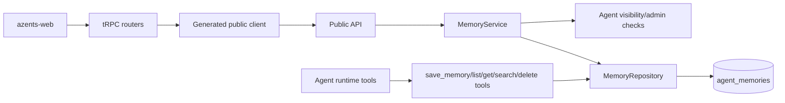

# Agent Settings Pages and Memory UI Design

## Overview

Azents already has DB-backed Agent Memory and runtime tools for model-driven Memory updates, but users cannot inspect or correct Memory from the product UI. The existing Agent settings page is a single long surface that mixes profile, model, capabilities, administrators, runtime reset, and deletion. Adding Memory management directly into that page would increase density and make the Memory workflow hard to operate.

This design first turns Agent settings into a grouped page hub with dedicated subpages. Memory then lands as one settings subpage with list, search, filter, create, edit, and delete flows.

Primary user scenarios:

- An Agent administrator reviews shared Agent Memory to understand why an Agent keeps following a repeated instruction.
- An Agent administrator corrects a stale shared Memory entry without asking the Agent to call a tool.
- A user reviews and edits their own user-scope preferences without exposing them to other workspace members.
- A workspace member can inspect visible Agent-scope Memory for transparency, but cannot change it unless they administer the Agent.

## Requirements

### REQ-1. Settings hub and subpage IA

Agent settings must be split into a hub and focused subpages.

Related decisions: [ambiguous historical ADR reference](../notes/legacy-docid-migration-ambiguity-manifest-2026-07-21.md#ambiguity-ref-206)

Acceptance criteria:

- `/settings` renders a grouped list/table hub.
- The hub links to `/settings/profile`, `/settings/model`, `/settings/capabilities`, `/settings/memory`, `/settings/admins`, and `/settings/danger`.
- Existing Agent settings behavior remains available after the split.
- Agent-focused shell and layout are preserved.

### REQ-2. Memory management as Agent settings

Memory management must live under Agent settings rather than session UI.

Related decisions: [ambiguous historical ADR reference](../notes/legacy-docid-migration-ambiguity-manifest-2026-07-21.md#ambiguity-ref-207)

Acceptance criteria:

- `/settings/memory` renders the Memory management surface.
- The session header tabs are unchanged by Memory management.
- The settings hub includes a Memory row once the Memory phase lands.

### REQ-3. Scope-aware Memory authorization

Memory APIs must enforce scope-aware read and write authorization.

Related decisions: [ambiguous historical ADR reference](../notes/legacy-docid-migration-ambiguity-manifest-2026-07-21.md#ambiguity-ref-208)

Acceptance criteria:

- Agent-scope Memory read requires Agent visibility.
- Agent-scope Memory create, update, and delete require Agent administrator or workspace owner.
- User-scope Memory read and write only uses the current authenticated `user_id`.
- No API can list, read, update, or delete another user's user-scope Memory.

### REQ-4. Strict UI CRUD semantics

Human UI APIs must avoid silent overwrite.

Related decisions: [ambiguous historical ADR reference](../notes/legacy-docid-migration-ambiguity-manifest-2026-07-21.md#ambiguity-ref-209)

Acceptance criteria:

- UI create rejects duplicate `name` within the same effective scope with `409 Conflict`.
- UI update and delete target Memory by `id`.
- UI update rejects name collisions with another Memory in the same effective scope.
- Runtime `save_memory` tool keeps its existing upsert behavior.

### REQ-5. Stacked delivery

The settings IA refactor and Memory UI must ship separately.

Related decisions: [ambiguous historical ADR reference](../notes/legacy-docid-migration-ambiguity-manifest-2026-07-21.md#ambiguity-ref-210)

Acceptance criteria:

- Phase 1 can merge without Memory API/UI changes.
- Phase 2 builds on the new settings IA and adds Memory functionality.
- Each phase has independently reviewable QA evidence.

### REQ-6. No revision or restore in first Memory UI

The first Memory UI must not add revision history, soft delete, or restore.

Related decisions: [ambiguous historical ADR reference](../notes/legacy-docid-migration-ambiguity-manifest-2026-07-21.md#ambiguity-ref-211)

Acceptance criteria:

- No new audit/revision table is required for the first Memory UI.
- Delete is confirmed before execution.
- Future audit/revision can be added behind the service layer without changing the core UI resource identity.

## Decision Table

| Decision | Requirements |
| --- | --- |
| [ambiguous historical ADR reference](../notes/legacy-docid-migration-ambiguity-manifest-2026-07-21.md#ambiguity-ref-212) | REQ-1 |
| [ambiguous historical ADR reference](../notes/legacy-docid-migration-ambiguity-manifest-2026-07-21.md#ambiguity-ref-213) | REQ-2 |
| [ambiguous historical ADR reference](../notes/legacy-docid-migration-ambiguity-manifest-2026-07-21.md#ambiguity-ref-214) | REQ-3 |
| [ambiguous historical ADR reference](../notes/legacy-docid-migration-ambiguity-manifest-2026-07-21.md#ambiguity-ref-215) | REQ-4 |
| [ambiguous historical ADR reference](../notes/legacy-docid-migration-ambiguity-manifest-2026-07-21.md#ambiguity-ref-216) | REQ-5 |
| [ambiguous historical ADR reference](../notes/legacy-docid-migration-ambiguity-manifest-2026-07-21.md#ambiguity-ref-217) | REQ-6 |

## Discussion Points and Decisions

### Settings location and IA

Decision: convert Agent settings into a multi-page settings hub before adding Memory.

The user supplied a list/table settings reference where settings are grouped into rounded sections with row navigation. This pattern fits Agent settings better than a single long form because it gives each settings workflow a focused page while keeping the overview scannable.

### Settings page split

Decision: use hybrid subpages.

Routes:

- `profile`
- `model`
- `capabilities`
- `memory`
- `admins`
- `danger`

This avoids both extremes: one dense page and overly fine-grained pages for every control.

### Memory authorization

Decision: agent-scope read follows Agent visibility; agent-scope write requires Agent admin or workspace owner; user-scope Memory is current-user-only.

### UI create/update semantics

Decision: strict create plus id-based update/delete.

Model tools keep upsert semantics because that is suitable for autonomous tool use. Human UI keeps create and update separate because users need predictable writes.

### Delivery phasing

Decision: two stacked phases.

Phase 1: Agent settings pages. Phase 2: Memory settings.

### Revision and restore

Decision: out of scope for the first Memory UI.

## Architecture



The service layer is the authorization and orchestration boundary for UI Memory operations. Runtime tools continue to use the repository through their existing tool factory path.

## Data Model

The first implementation uses existing `agent_memories` rows:

| Field | Usage |
| --- | --- |
| `id` | Stable UI resource identity for update/delete |
| `agent_id` | Agent owner |
| `user_id` | `NULL` for agent scope, current authenticated user ID for user scope |
| `scope` | `agent` or `user` |
| `type` | Free-form Memory type; UI offers recommended values |
| `name` | Human identifier, unique inside effective scope |
| `description` | One-line summary for lists |
| `content` | Markdown body |
| `created_at`, `updated_at` | UI timestamps |

Repository additions:

- `list(...) -> list[Memory]`
- `get_by_id(...) -> Memory | None`
- `create_strict(...) -> Result[Memory, DuplicateMemoryName]`
- `update_by_id(...) -> Result[Memory, NotFound | DuplicateMemoryName]`
- `delete_by_id(...) -> bool`

No schema change is required for Phase 2 unless implementation discovers missing repository support that cannot be expressed against the existing model.

## Service Implementation

Add `azents.services.memory.MemoryService`.

Responsibilities:

- resolve Agent by ID and workspace;
- enforce Agent visibility for reads;
- enforce Agent admin or workspace owner for agent-scope writes;
- translate user-scope operations to `member.user_id` only;
- hide not-found rows that belong to another scope or user;
- map duplicate names to expected conflict errors.

Service error types:

- `AgentNotFound`
- `NotBelongToWorkspace`
- `PrivateAgentAccessDenied`
- `NotAdmin`
- `MemoryNotFound`
- `DuplicateMemoryName`

## API

Add public routes under a new Memory API module.

```text
GET    /memory/v1/workspaces/{handle}/agents/{agent_id}/memories
GET    /memory/v1/workspaces/{handle}/agents/{agent_id}/memories/{memory_id}
POST   /memory/v1/workspaces/{handle}/agents/{agent_id}/memories
PATCH  /memory/v1/workspaces/{handle}/agents/{agent_id}/memories/{memory_id}
DELETE /memory/v1/workspaces/{handle}/agents/{agent_id}/memories/{memory_id}
```

List query parameters:

| Parameter | Values | Meaning |
| --- | --- | --- |
| `scope` | `agent`, `user` | Scope to list. If omitted, list scopes visible to the current user. |
| `type` | string | Optional exact type filter. |
| `q` | string | Optional lexical search over name, description, and content. |

Response models:

- `MemoryResponse`
- `MemoryListResponse`
- `MemoryCreateRequest`
- `MemoryUpdateRequest`

OpenAPI regeneration is required after adding routes.

## Frontend UX

### Settings hub

The settings hub uses grouped rows rather than cards. Rows are repeated interaction units, so the row itself is the anchor.

Sections:

- Agent customization
  - Profile
  - Model
  - Memory
- Capabilities
  - Tools and subagents
- Access
  - Admins
- Danger
  - Runtime and deletion

Each row contains:

- icon;
- label;
- secondary status/value;
- chevron;
- optional warning or disabled badge.

### Memory page

The Memory page contains:

- scope segmented control: Team memory / My memory;
- search input;
- type filter;
- create button;
- table/list of Memory items;
- editor drawer or modal for create/edit;
- delete confirmation modal.

Agent-scope rows render edit/delete controls only when the current user can manage the Agent. User-scope rows render edit/delete controls for the current user.

### Mobile behavior

The settings hub remains a single-column list. The Memory table collapses to stacked rows with the same actions in a row menu or bottom sheet-style modal.

## Infrastructure

No infrastructure changes.

## Feasibility Verification

| Check | Result |
| --- | --- |
| Existing Memory table supports UI resource identity | Feasible: `id` already exists. |
| Existing Agent auth context contains both `user_id` and `workspace_user_id` | Feasible: `WorkspaceMember` exposes both. |
| Existing frontend route layout supports Agent settings subroutes | Feasible: App Router path already has Agent settings route under Agent-focused layout. |
| OpenAPI-generated client path | Feasible: existing public API routes are generated into `@azents/public-client`. |
| Revision/restore omission | Feasible: current table can be used directly with delete confirmation. |

Risks:

| Risk | Mitigation |
| --- | --- |
| Settings split breaks existing edit flow | Ship Phase 1 separately and E2E existing settings edits before Memory. |
| User-scope privacy regression | Add E2E with two users in the same workspace. |
| Duplicate name race | Back repository checks with existing unique indexes and map integrity conflicts to conflict errors where needed. |
| Generated client drift | Regenerate OpenAPI clients in Phase 2 and run TypeScript typecheck. |

## Test Strategy

Product behavior verification is E2E-first.

### E2E primary verification matrix

| Behavior | Phase | Primary verification |
| --- | --- | --- |
| Settings hub renders and links to subpages | Phase 1 | Browser or public web E2E navigation path |
| Existing profile/model/capability/admin/danger settings still work | Phase 1 | E2E user creates Agent, edits fields, reloads Agent |
| Agent-scope Memory list/read works for visible Agent members | Phase 2 | Public API E2E |
| Agent-scope Memory write requires admin/owner | Phase 2 | Public API E2E with admin and non-admin users |
| User-scope Memory is current-user-only | Phase 2 | Public API E2E with two users |
| Duplicate UI create returns conflict | Phase 2 | Public API E2E |
| Memory UI can create/edit/delete | Phase 2 | Browser E2E or tRPC-backed product flow |

### E2E plan

Use `testenv/azents/e2e` fixtures to create users, workspace, provider settings, and Agent. For Phase 2, seed Memory through the new public API and verify list/read/update/delete behavior through the same public API and UI route.

### Fixture requirements

- Workspace with owner and member.
- Public Agent administered by owner.
- Optional private Agent for visibility checks.
- Memory rows in agent scope and user scope.

### Credential/prerequisite snapshot requirements

No external live credentials are required for Memory API verification. Model provider defaults may be needed only for creating an Agent through existing fixture helpers.

### Evidence format

Record:

- E2E command;
- working directory;
- scenario names;
- pass/fail result;
- relevant API response summaries for authorization and conflict cases.

### CI policy

Phase PRs must run relevant backend tests, OpenAPI/client generation checks when API changes, TypeScript typecheck/lint for frontend changes, and the targeted E2E scenarios.

### Optional/live skip/fail criteria

There are no optional live external service tests for this feature. If browser E2E is unavailable, public API E2E remains required and frontend behavior must be covered by component stories plus TypeScript checks, but final product acceptance should still include a browser route smoke test when the web E2E substrate is available.

## QA Checklist

### QA-1. Settings hub and subpages preserve existing settings behavior

#### What to check

A user can navigate from the Agent settings hub to profile, model, capabilities, admins, and danger pages and perform the settings actions that existed before the split.

#### Why it matters

The IA refactor must not regress current Agent management.

#### How to check

Run targeted E2E against `testenv/azents/e2e` creating an Agent, navigating settings pages, updating a profile field and model-related field, and verifying persisted Agent response.

#### Expected result

All subpages load under the Agent-focused layout, and edits persist after reload.

#### Execution result

TBD

#### Fixes applied

TBD

### QA-2. Agent-scope Memory read/write authorization

#### What to check

A visible member can read agent-scope Memory but cannot create, update, or delete it unless they are an Agent admin or workspace owner.

#### Why it matters

Shared Memory must be transparent without allowing uncontrolled edits.

#### How to check

Run public API E2E with owner/admin and non-admin member tokens against the Memory endpoints.

#### Expected result

Read succeeds for visible member; write succeeds for admin/owner; write returns 403 for non-admin member.

#### Execution result

TBD

#### Fixes applied

TBD

### QA-3. User-scope Memory privacy

#### What to check

User A can create/list/read/update/delete only User A's user-scope Memory. User B cannot observe or mutate User A's user-scope Memory.

#### Why it matters

User-scope Memory may contain personal preferences and must not leak to other workspace users.

#### How to check

Run public API E2E with two users in the same workspace and the same Agent.

#### Expected result

Each user sees only their own user-scope Memory rows.

#### Execution result

TBD

#### Fixes applied

TBD

### QA-4. Strict UI CRUD conflicts

#### What to check

Creating a Memory with a duplicate name in the same effective scope fails with conflict. Updating a Memory to another Memory's name also fails with conflict.

#### Why it matters

Human UI must not silently overwrite existing Memory.

#### How to check

Run public API E2E creating duplicate entries and duplicate rename attempts.

#### Expected result

Both duplicate operations return conflict and leave existing rows unchanged.

#### Execution result

TBD

#### Fixes applied

TBD

### QA-5. Memory UI create/edit/delete flow

#### What to check

The `/settings/memory` page lists Memory entries, filters/searches them, opens create/edit UI, persists changes, and confirms delete before removal.

#### Why it matters

The product value is direct Memory inspection and correction from UI.

#### How to check

Run browser route smoke/E2E through the web app. If full browser E2E is unavailable, run tRPC/public API E2E plus component stories for loaded, empty, error, editing, and delete-confirm states.

#### Expected result

The page supports the full Memory management flow without leaving Agent settings context.

#### Execution result

TBD

#### Fixes applied

TBD

## Implementation Plan

### Phase 1. Agent settings pages

- Add settings hub component and route.
- Add subpage routes for profile, model, capabilities, admins, and danger.
- Move or wrap existing Agent settings sections into focused pages.
- Preserve current Agent-focused shell layout.
- Add component stories for the settings hub states.
- Run TypeScript quality checks and targeted E2E.

### Phase 2. Agent Memory settings

- Extend `MemoryRepository` for id-based strict CRUD.
- Add `MemoryService` authorization and orchestration.
- Add public Memory API routes and schemas.
- Regenerate OpenAPI and TypeScript public client.
- Add tRPC Memory router.
- Add `/settings/memory` page, container, components, and stories.
- Add settings hub Memory row.
- Run backend tests, TypeScript checks, and E2E authorization/CRUD scenarios.

## Alternatives Considered

| Alternative | Reason rejected |
| --- | --- |
| Add Memory to current one-page settings | The page would become denser and mix data management with form settings. |
| Add Memory as session tab | Memory is Agent-level state and should not appear session-local. |
| Use all-viewer write permission for agent-scope Memory | Shared Memory quality would be too easy to change accidentally. |
| Use name upsert for UI create | It risks silent human overwrites. |
| Add soft delete or revisions now | It expands scope beyond the first transparency/editing feature. |
