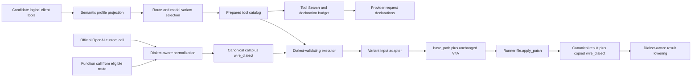

# Apply-Patch Provider Tool Dialects Design

## Summary

Evolve the Azents-executed `apply_patch` capability from one JSON function representation into one logical client tool with provider-selected wire variants:

- verified official OpenAI Responses routes receive a generic plaintext custom tool;
- other semantically eligible and function-capable routes retain the existing JSON function tool; and
- unsupported or unknown combinations receive no `apply_patch` declaration.

The plaintext representation removes JSON string escaping from the large V4A body. It does not change patch execution. Both variants parse into the same absolute Runtime `base_path` plus unchanged V4A bytes and invoke the existing Runner-native `file.apply_patch` operation exactly once.

The design makes the originating wire dialect durable on both client-tool calls and results. Same-compatible model turns reconstruct the correct provider call/output items. A completed custom pair becomes bounded readable historical context when a later provider cannot represent that dialect; a pending continuation never changes dialect or becomes executable text.

The decisions are recorded in [patch-260721/ADR](../adr/patch-260721-patch-dialects.md). [ambiguous historical ADR reference](../notes/legacy-docid-migration-ambiguity-manifest-2026-07-21.md#ambiguity-ref-218) remains authoritative for V4A grammar, Runtime safety, commit, cancellation, and typed result semantics.

## Problem

The current model-visible `apply_patch` declaration is an ordinary function tool:

```json
{
  "base_path": "/workspace/agent/project",
  "patch": "*** Begin Patch\n*** Update File: ...\n*** End Patch"
}
```

The model must generate two independent syntaxes correctly:

1. the strict V4A document; and
2. a JSON string containing the complete document with escaped newlines, quotes, backslashes, and control characters.

This creates failures that do not reflect patch intent or Runner applicability. A syntactically correct V4A body can be rejected before execution because the surrounding JSON argument string is malformed.

OpenAI Responses generic custom tools accept plaintext input and return typed custom call/output items. Azents can therefore remove JSON escaping on verified OpenAI routes. Non-OpenAI providers do not share one verified custom protocol, but many can continue carrying the established JSON function schema.

The change is not declaration-only. The current Engine assumes that every client tool is a JSON function across tool construction, catalog materialization, output normalization, durable events, active-call state, execution, cancellation, transcript lowering, continuation, compaction, hooks, frontend parsing, and tests.

## Goals

- Transport one complete V4A body without JSON string escaping on verified official OpenAI routes.
- Preserve the existing JSON function representation as a preselected fallback on verified eligible routes.
- Keep one logical tool name, `apply_patch`, and one Runner execution contract.
- Preserve exact decoded model input without trimming, normalization, or reconstruction.
- Persist the call dialect wherever it is needed for execution, recovery, result construction, replay, and UI interpretation.
- Prevent provider errors, cancellations, profile changes, or rollout changes from re-executing one admitted call through another dialect.
- Keep unknown models, aliases, endpoints, and transport combinations fail-closed.
- Deploy full lifecycle compatibility before writing a production custom event.

## Non-goals

- Adopting OpenAI's provider-native `type=apply_patch` operation protocol.
- Changing strict V4A parsing, matching, filesystem, staging, commit, partial-failure, or cancellation semantics.
- Inferring `base_path` from the current Project, process directory, or Runtime default.
- Making every Azents tool plaintext.
- Retrying a rejected custom request as a function request.
- Executing or previewing partial streamed patch input.
- Persisting raw provider stream frames or original HTTP bytes.
- Enabling ChatGPT OAuth, OpenRouter, Azure, proxies, or custom OpenAI-compatible endpoints for plaintext input in the initial rollout.

## Current Behavior

### Tool definitions and catalog

`FunctionToolSpec` contains `name`, `description`, and one JSON Schema. `FunctionTool` combines that spec with a handler accepting an argument string. `make_tool()` parses JSON and validates a Pydantic input model before calling the typed handler.

`ToolCatalog.native_tools_for()` emits every selected client declaration as:

```json
{
  "type": "function",
  "name": "...",
  "description": "...",
  "parameters": {},
  "strict": false
}
```

Model compatibility projection currently filters whole tools through `ClientToolProfile.GPT_V4A_APPLY_PATCH`. It does not select among multiple wire variants of one logical tool.

### Canonical events and execution

`ClientToolCallPayload` persists `call_id`, `name`, JSON-string `arguments`, Toolkit source, and a native artifact. `ClientToolResultPayload` persists the call identity, status, output, and metadata. Neither carries call dialect.

`ActiveToolCall` also retains name and arguments without dialect. The executor looks up only by name and passes `call.arguments` directly to the prepared handler. Synthetic cancellation and interruption results therefore have no way to copy a non-function dialect.

Persistent Event JSON is normally decoded through `EventTranscriptRepository`, but the
legacy message projection also validates `RDBEvent.payload` directly and AgentRun state
validates each `active_tool_calls` JSON object directly. A legacy missing-field upgrade
therefore cannot live in only one repository helper or in a permissive general model
default.

### Responses lowering and normalization

The shared Responses lowerer reconstructs every canonical client call/result as `function_call` and `function_call_output`. Orphan cleanup and cache handling recognize only those item types.

The OpenAI normalizer recognizes typed function-call argument deltas and completed `function_call` output items. The shared LiteLLM normalizer recognizes dictionary equivalents. Neither promotes `custom_tool_call`, custom input delta/done events, or `custom_tool_call_output`.

### Continuation and compatibility

The OpenAI continuation planner compares sanitized full logical request input, tools, options, and completed output items. It is structurally generic, but its inputs currently contain only function client-tool items.

Native artifacts replay only when the exact adapter/native-format/provider/model/schema compatibility key matches. Cross-adapter or cross-model replay reconstructs from canonical events.

### UI

The frontend specialized `apply_patch` renderer parses `arguments` as JSON and extracts `base_path` and `patch`. Generic tool argument summaries attempt JSON parsing, then fall back to plain text. The live `ActiveToolCall` shape does not expose dialect.

## Accepted Decisions

1. Use generic OpenAI plaintext custom tools rather than provider-native patch operations.
2. Separate V4A semantic eligibility from route-specific custom/function transport support.
3. Persist `wire_dialect` on both calls and results; treat missing legacy values as JSON function only at persistent-read upgrade boundaries.
4. Use one exact `*** Base Path: ` header followed immediately by an unchanged V4A body.
5. Initially enable custom input only for exact reviewed models on the canonical official OpenAI API-key Responses route.
6. Expand full lifecycle compatibility before any production custom write and retain that compatibility permanently afterward.

## Proposed Architecture

### Terminology

- **Logical client tool**: one Azents capability, handler, execution identity, and result contract.
- **Wire variant**: one provider declaration/input/output representation of a logical tool.
- **Wire dialect**: the canonical discriminator identifying the originating variant.
- **Semantic eligibility**: evidence that a model can generate strict V4A safely enough to receive `apply_patch`.
- **Transport capability**: evidence that one actual provider/model route supports one declaration/call/output protocol.
- **Prepared client tool**: one logical tool frozen to exactly one wire variant for one model request and executor snapshot.

### Architecture overview



## Logical Tool and Wire Variant Model

Replace the JSON-only internal definition with a provider-neutral client-tool definition. This is an internal Engine refactor; provider wire details do not enter Runtime Control.

Conceptual types:

```text
ClientTool
  spec: ClientToolSpec(name, description, variants)
  handler: ClientToolHandler(ClientToolInvocation)
  cancel_handler: optional
  required_semantic_profile: optional

ClientToolVariant
  wire_dialect
  provider declaration data
  optional selected-variant prompt fragment

JsonFunctionVariant
  wire_dialect = json_function
  input_schema
  strict = false

PlaintextCustomVariant
  wire_dialect = plaintext_custom
  format = text
```

`make_tool()` continues to be the standard JSON/Pydantic factory and returns a `ClientTool` with one `JsonFunctionVariant`. It rejects any invocation whose selected dialect is not `json_function` before parsing JSON.

`make_apply_patch_tool()` returns one logical tool with both variants. Its handler branches only through the persisted invocation dialect:

- `json_function`: parse the existing `ApplyPatchInput` object;
- `plaintext_custom`: parse the one-line custom envelope; and
- every other value: fail closed with no Runner call.

Both paths produce an internal `ApplyPatchCommand(base_path, patch_text)` and call the existing shared execution function. Success/failure mapping, metadata, logging, deadlines, and commit-sensitive cancellation remain shared.

Rename the Engine's internal `FunctionTool` abstraction to `ClientTool` rather than keeping a misleading compatibility alias. This is a mechanical internal migration; external model-visible tool names and Toolkit behavior remain unchanged.

### Invocation and cancellation input

Define one immutable invocation type containing:

- `call_id`;
- logical tool name;
- `wire_dialect`; and
- raw decoded `arguments` string.

Handlers and cancellation hooks receive this invocation or an equivalent cancellation view. Standard JSON handlers parse only after verifying the dialect. Result creation always copies the invocation dialect.

Tool-call hook contexts are generalized from `args_json` to `arguments` plus `wire_dialect`. Hooks that interpret paths branch on JSON function and ignore unsupported dialects unless they add an explicit parser. No hook logs or serializes raw custom input.

## Capability Resolution and Variant Selection

### Independent dimensions

Resolve three states independently:

- reviewed V4A semantic profile;
- verified OpenAI custom plaintext transport profile; and
- verified JSON function transport profile.

Each dimension is tri-state: `verified`, `denied`, or `unknown`. Unknown behaves as denied.

The initial semantic rule preserves current [ambiguous historical ADR reference](../notes/legacy-docid-migration-ambiguity-manifest-2026-07-21.md#ambiguity-ref-219) behavior without widening it. The implementation may rename the profile from GPT-specific terminology to `v4a_apply_patch`, while retaining the same reviewed developer/family matching result. New model developers or families require explicit conformance evidence.

### Route identity

Compute a credential-free route classification before variant selection:

- provider enum;
- adapter identity;
- native format;
- authentication class;
- effective endpoint class (`official_openai`, `chatgpt_oauth`, or `custom`);
- model identifier, developer, and family; and
- reviewed exact-model transport rule.

Do not retain API keys, headers, tokens, or full base URLs in the classification or logs. Any explicit or environment-derived base URL override makes the route non-official for the initial custom profile.

### Selection algorithm

```text
if V4A semantic eligibility is not verified:
    omit apply_patch
else if custom transport is verified and rollout permits this cohort:
    select plaintext_custom
else if JSON function transport is verified:
    select json_function
else:
    omit apply_patch
```

Selection occurs before system prompt construction, Tool Search indexing, declaration budgeting, lowerer creation, and executor freezing. Exactly one selected variant exists for one logical tool in one prepared catalog.

In the initial registry, function fallback on a non-OpenAI provider is available only
when the routed model still satisfies the existing OpenAI-developed GPT V4A semantic
profile. OpenRouter or another provider carrying such a reviewed model may qualify after
its function transport is verified. A Claude, Gemini, Grok, or other developer model does
not qualify merely because it supports function calling; it first needs a separate V4A
semantic conformance rule.

The executor validates that a normalized call's dialect equals the prepared variant. A provider call using an undeclared dialect becomes a failed client-tool result with a safe mismatch category and zero handler/Runner invocations.

### Prompt selection

Attach optional prompt content to a wire variant or an equivalent variant-keyed catalog prompt record.

The function prompt retains the existing `{base_path, patch}` guidance. The custom prompt shows the exact plaintext envelope, requires LF after the header, prohibits Markdown fences and surrounding prose, and repeats the retry/partial-commit guidance.

Only the selected variant prompt enters the system prompt. A custom prompt is never paired with a function declaration or vice versa.

### Tool Search and declaration budgets

Tool Search continues to index one logical tool by name and description after semantic and variant projection. The working set stores logical tool names, not dialects. A later request may choose a different variant for the same logical name without rewriting working-set state.

Generalize declaration counting from “client functions” to selected client declarations:

- `TOTAL_TOOLS` counts every selected variant;
- `FUNCTION_DECLARATIONS` counts only `json_function` variants; and
- a custom variant counts as one total tool and zero function declarations.

The initial OpenAI custom route has no current hard-limit rule, but the generalized accounting prevents future provider-budget assumptions from treating every client declaration as a function.

Before official OpenAI provider I/O, validate the complete selected tool list through the
pinned SDK `ToolParam` adapter. The current lowerer validates only selected hosted-tool
shapes; custom support must fail locally on any malformed function, custom, or hosted
declaration rather than relying on a remote 400 response.

## Plaintext Envelope Contract

The exact custom input is:

```text
*** Base Path: /absolute/runtime/path
*** Begin Patch
*** Update File: src/example.py
@@
-old
+new
*** End Patch
```

### Envelope parser

The parser:

1. enforces the total decoded UTF-8 input bound;
2. finds the first U+000A LF;
3. validates the exact first-line prefix `*** Base Path: `;
4. validates one non-empty bounded one-line absolute path;
5. takes the exact string slice after the first LF;
6. requires that slice to start with `*** Begin Patch`; and
7. returns the unmodified path and patch strings.

It does not implement the complete V4A grammar. Runner remains authoritative for the end marker, trailing content, operations, paths, exact context, source state, and mutation.

### Prohibited transformations

Do not call trim/strip, split and rejoin lines, normalize Unicode, translate CRLF, remove fences, insert a final newline, parse/re-emit JSON, or reconstruct patch operations. “Exact” means the exact decoded string assembled from provider events; raw HTTP byte encoding is not persisted.

### Bounds

Use one shared operation-contract source for the maximum V4A bytes accepted by Engine
streaming guards and Runner execution. The current 1 MiB default exists only in the
Runtime Runner app, so implementation must move the cross-process limit constant or
contract metadata into `azents-runtime-control`; the Engine app must not import the Runner
app. Add a bounded header allowance and UTF-8 base-path limit. The streaming accumulator
rejects oversized custom input before durable admission or Runner execution. Runner
retains authoritative validation of the received payload and declared byte count.

### Error contract

Envelope failures produce one failed client-tool result with stable metadata such as:

- `kind=apply_patch_input_failure`;
- `phase=transport`;
- `reason=invalid_base_path_header | base_path_too_long | invalid_base_path_character | base_path_not_absolute | missing_patch_body | invalid_patch_start | input_too_large`; and
- `exact=true`, with no applied changes.

Errors and logs never echo the raw input, nearby malformed text, source/replacement content, or an unapproved path value.

## Canonical Event and Active-State Changes

Add a closed `ClientToolWireDialect` enum:

- `json_function`;
- `plaintext_custom`.

Add required `wire_dialect` to:

- `ClientToolCallPayload`;
- `ClientToolResultPayload`; and
- `ActiveToolCall`.

Redefine the existing physical `arguments` field as raw client-tool input:

- JSON function: raw provider JSON argument string;
- plaintext custom: raw decoded custom input string.

Keep the field name to avoid a simultaneous public event-field rename. Update documentation and every consumer so JSON parsing happens only after checking dialect.

### Legacy persistent-read upgrade

Do not give the Pydantic payload fields a general constructor default. New in-process writers must supply dialect explicitly.

At persistent event and AgentRun active-state read boundaries only:

```text
missing wire_dialect => json_function
```

Apply the upgrade before canonical validation in every direct database reader:

- `EventTranscriptRepository._build()` and its shared Event payload decoder;
- the legacy message repository's direct `RDBEvent.payload` projection; and
- `AgentRunRepository._build()` for each active-call JSON object.

Search for any other direct `ClientToolCallPayload`, `ClientToolResultPayload`, or
`ActiveToolCall` validation of persisted dictionaries during implementation and route it
through the same persisted-data upgrader. Explicit null, unknown, or malformed values
fail validation. This preserves old durable data without allowing new code to omit the
field silently.

No relational event migration is required because event payloads and active tool calls are JSON. Existing historical rows remain unchanged on disk.

### Pair consistency

The call is authoritative. Executors and synthetic-result paths copy its dialect to results. `finalize_tool_result()` validates both call ID and dialect. User Stop, shutdown recovery, unavailable tools, handler errors, output materialization failures, and other synthetic result paths all preserve the call dialect.

A call/result mismatch is corruption. Do not infer a repair from native artifacts, current profiles, or input parseability.

## OpenAI Output Normalization

### Typed SDK events

Extend the official SDK normalizer with the pinned SDK types for:

- `ResponseCustomToolCall`;
- `ResponseCustomToolCallInputDeltaEvent`; and
- `ResponseCustomToolCallInputDoneEvent`.

A completed `custom_tool_call` becomes a canonical client-tool call with:

- original `call_id`;
- logical name;
- raw `input` copied to `arguments`;
- `wire_dialect=plaintext_custom`; and
- a sanitized native artifact.

A completed `function_call` explicitly receives `wire_dialect=json_function`.

### Stream state

Custom input deltas are transport-private state. They are not published through the existing `function_call_delta` compatibility event and do not create a live patch preview.

For each output index, the normalizer tracks:

- call ID and name from item creation;
- cumulative decoded/UTF-8 size;
- ordered input deltas;
- the custom-input-done value; and
- the final output item value.

It enforces the custom input bound cumulatively. At completion, the ordered delta string, done value, and final item input must agree when each representation is present. A mismatch, oversized input, incomplete call, failed stream, or EOF before `response.completed` produces no durable client call and no Runner invocation.

### Shared LiteLLM normalizer

The shared dictionary normalizer recognizes custom call item shapes defensively so persisted fixtures and future route promotion use the same canonical event model. No initial LiteLLM route declares the custom variant. A custom call emitted against a function-only prepared catalog is admitted as its actual dialect and rejected by the prepared executor before handler execution.

## Execution and At-Most-Once Behavior

The model-output transaction persists the completed canonical call before execution, as today. The deterministic external identity remains based on run ID and call ID; dialect does not create a second execution identity.

The prepared executor performs these checks in order:

1. tool name exists in the frozen prepared catalog;
2. call dialect equals the selected variant;
3. call input satisfies the variant adapter;
4. only then invoke the logical tool handler.

One custom `apply_patch` call invokes Runner at most once. Envelope parse failure invokes Runner zero times. Runner cancellation and typed terminal settlement retain [ambiguous historical ADR reference](../notes/legacy-docid-migration-ambiguity-manifest-2026-07-21.md#ambiguity-ref-220) behavior.

`FunctionToolError` may be renamed to `ClientToolError` as part of the internal abstraction migration. It continues to produce one failed canonical result rather than an Engine exception. Unexpected exceptions retain the existing generic failure boundary.

## Transcript Lowering and Continuation

### Structured lowering

Dialect-aware canonical lowering emits:

| Canonical dialect | Call item | Result item |
|---|---|---|
| `json_function` | `function_call` | `function_call_output` |
| `plaintext_custom` | `custom_tool_call` | `custom_tool_call_output` |

Use the original call ID, name, raw input string, and result output. Do not parse and reserialize JSON or rebuild V4A.

### Same-native artifacts

A call artifact may pass through only when `artifact.compatible_with()` confirms the
complete native compatibility key: adapter, native format, provider, model, and schema
version. Its native item type must also agree with the canonical dialect. A compatibility
or artifact/dialect mismatch fails closed. Native artifacts remain opaque and never
determine dialect.

No OpenAI native compatibility-key version bump is required solely for adding a documented output item variant; the provider item schema and sanitizer remain unchanged. The deployment compatibility floor, canonical dialect validation, and no-old-binary rollback rule prevent older code from processing production custom records.

### Orphan filtering

Generalize tool-pair cleanup by dialect:

- a `function_call_output` requires a preceding function call with the same ID;
- a `custom_tool_call_output` requires a preceding custom call with the same ID; and
- cross-dialect pairs are rejected rather than paired by ID alone.

### Current-run continuation

One prepared model call, its admitted foreground tool set, and their execution use one
frozen catalog and route. A turn-boundary context invalidation may rebuild the same
AgentRun with a newly selected model before the next model request, but it occurs only
after the prior call/result pair is durable. Durability alone does not make that pair
historical: if no successful later model boundary has consumed the result, it remains a
pending continuation and the rebuilt request must use a route verified for the stored
dialect or fail before provider I/O. Stored-response continuation on an unchanged complete
native compatibility key compares the exact custom call/output items as part of the
existing sanitized ordered prefix.

A restart of the same run reconstructs the result using persisted dialect. It never reevaluates current tool profiles to select an output item type.

### Later requests and provider/model switches

When a later model request, whether in the same AgentRun after turn-boundary profile
rebuilding or in a later AgentRun, uses a target with verified support for the historical
dialect, lower the completed pair structurally. Otherwise, convert only a call/result pair
that has already crossed a successful later model boundary into deterministic bounded
readable context.

The target lowerer must therefore receive explicit historical-dialect capabilities in
addition to the currently selected declarations. It must not infer replay compatibility
from whether `apply_patch` happens to be exposed on the new request, because rollout or
semantic eligibility may suppress a new declaration while the route can still represent
historical custom items.

The historical projection:

- labels the tool name, completed status, and result;
- identifies that the original input is omitted or truncated rather than presenting an incomplete V4A document as valid;
- never emits an active provider tool item;
- never authorizes execution; and
- remains subject to normal cross-provider transcript data-egress policy.

An unpaired custom call or a result still pending delivery to the next model cannot use
text fallback. It fails compatibility checks before provider I/O.

### Compaction and context inspection

Compaction token estimation and continuity rendering branch on dialect. JSON calls retain canonical JSON rendering. Custom calls use a bounded plaintext summary that never attempts JSON parsing and never emits a truncated patch as executable syntax.

Compaction summaries remain natural-language history; they do not preserve provider continuation identity. A pair covered by compaction is historical and non-executable.

## API, Live State, and Frontend

### Public payloads

Event and live payloads expose `wire_dialect`. No relational migration is required while
Event payloads and AgentRun active state remain JSON, but every public projection must be
audited. In particular, the legacy message repository currently converts client calls to
`FunctionToolCall`, which has no dialect field; it must either carry the discriminator or
be replaced by a dialect-aware projection. Regenerate public clients from OpenAPI source
if any typed API schema changes; do not edit generated clients manually.

### Live active calls

`ActiveToolCall` carries dialect. Live projection, Redis/WebSocket state, AgentRun JSON state, User Stop, and worker recovery preserve it.

The existing `function_call_delta` stream remains function-only. Custom patch input does not stream to the browser. The completed call appears when it is durably admitted.

### Specialized apply-patch presentation

Add a frontend dialect-aware parser:

- JSON function parser validates `{base_path, patch}`;
- plaintext custom parser validates the exact first-line header and extracts the remaining V4A substring without normalization.

Both feed the existing V4A preview adapter and apply-patch result metadata validators. Invalid input or mismatched metadata falls back to the Generic card for that call only.

Generic argument rendering treats custom input as plaintext and applies the existing hard display bound. It does not attempt JSON parsing for `plaintext_custom`.

The UI may display the patch preview because that is existing user-visible tool activity, but it must not send raw input to logging, analytics, error reporting, or telemetry.

## Failure Handling

| Failure | Durable call | Runner invocation | Result/handling |
|---|---:|---:|---|
| Provider rejects custom declaration before output | No | No | Failed model attempt; no function retry |
| Custom stream ends before completed response | No | No | Failed model attempt |
| Custom input exceeds stream bound | No | No | Safe normalization failure |
| Completed call has malformed envelope | Yes | No | Failed client result with transport reason |
| Provider emits undeclared dialect | Yes | No | Failed client result with dialect mismatch |
| Runner preflight failure | Yes | Yes, once | Existing typed failed result |
| Runner partial commit failure | Yes | Yes, once | Existing exact partial-failure result |
| User Stop before commit | Yes | At most once | Existing cancellation semantics, copied dialect |
| User Stop after commit begins | Yes | Once | Wait for typed terminal settlement |
| Result dialect differs from call | Existing state | No new call | Corruption error; fail closed |
| Later provider cannot represent completed custom history | Existing pair | No | Bounded readable historical context |
| Active custom continuation targets incompatible route | Existing state | No | Compatibility failure before provider I/O |

## Security and Privacy

- Treat the complete custom input as untrusted and potentially sensitive source content.
- Never log, trace, metric-label, exception-format, or error-report raw arguments, patch text, source text, replacement text, or nearby malformed input.
- Suppress SDK and transport wire logging exactly as for existing OpenAI model calls.
- Audit hook dispatch, request inspection, model-provider failure mapping, tracing middleware, Sentry breadcrumbs, and frontend analytics for implicit body capture.
- Record only safe fields: dialect, rule IDs, endpoint class, byte counts, stable error category, operation counts after safe Runner parsing, result phase/reason, and applied/not-attempted counts.
- Do not execute custom text through a shell.
- Keep Runtime confinement and authorization ownership unchanged.
- Keep raw input out of result metadata; metadata contains only bounded typed summaries.

## Observability

Structured selection log:

- semantic profile result and rule ID;
- transport profile result and rule ID;
- route/endpoint class;
- selected dialect or omission reason;
- rollout cohort bucket and effective cap;
- no full base URL or credentials.

Custom-call metrics:

- declaration count;
- provider rejection count by safe code;
- incomplete/oversized stream count;
- envelope failure count by stable reason;
- Runner invocation count;
- success, preflight failure, partial commit, and cancellation counts;
- continuation success/failure;
- function fallback selection count; and
- malformed-envelope rate per reviewed model profile.

Metrics must not use call IDs, paths, tool input, or model output as labels.

## Rollout and Rollback

### Compatibility phases

1. **Canonical compatibility** — add dialect-aware models and consumers while function behavior remains unchanged.
2. **Dormant custom lifecycle** — support every custom state from request through UI, with production custom selection impossible.
3. **Profiles and evidence** — add official-endpoint rules, exact models, rollout controls, fixtures, metrics, and live-evaluation tooling; keep production exposure disabled.
4. **Controlled enablement** — verify the fleet barrier, approve evidence, enable a stable bounded cohort, then expand.

### Fleet barrier

Before phase 4, verify all model workers, tool executors, recovery workers, compactors, API/WebSocket projectors, frontend versions, exporters, delayed jobs, and dead-letter reprocessors are compatible. Drain or fence older work.

### Rollback

Operational rollback sets the custom exposure cap to zero or disables affected profiles for new calls. New eligible calls then use verified JSON function fallback or omit `apply_patch`. Existing custom calls/results retain their dialect and continue through the compatible runtime.

Do not deploy a binary below the permanent full-lifecycle compatibility floor after the first production custom record exists. Repair custom lifecycle defects forward while new exposure is disabled.

## Implementation Areas

### Phase 1: canonical compatibility

- `engine/events/types.py`
  - `ClientToolWireDialect`
  - required call/result/active fields
  - persistent-read legacy upgrader
- event and AgentRun repositories
  - apply legacy upgrade only when decoding stored JSON
  - cover Event transcript, legacy message projection, and active-call readers
- execution, finalization, User Stop, run recovery, live projection
  - copy and validate dialect
- frontend event/live types
  - tolerate and retain dialect
- compatibility fixtures
  - legacy missing, explicit JSON, invalid values, pair mismatch

### Phase 2: dormant custom lifecycle

- `engine/run/types.py`
  - provider-neutral client-tool/variant/invocation types
- `engine/tooling/make_tool.py`
  - standard JSON variant factory
- `engine/events/tools.py`
  - prepared variant materialization and executor validation
- `engine/events/openai_responses.py`
  - typed custom stream events and completed items
- `engine/events/responses_output.py`
  - shared custom normalization
- `engine/events/responses_lowering.py`
  - dialect-specific call/output lowering and historical projection
- `engine/events/responses_continuation.py`
  - custom pair fixtures and exact prefix checks
- `engine/tools/apply_patch.py`
  - two variants, envelope parser, shared execution
- hooks, compaction, context inspection, exports
  - dialect-aware input interpretation and redaction
- frontend known-tool presentation
  - custom envelope parser and preview

### Phase 3: profiles and controls

- semantic compatibility registry
  - preserve current V4A eligibility
- route/model transport registry
  - exact official OpenAI custom profiles with source/evidence metadata
- endpoint classification
  - detect official default versus OAuth/custom route without logging secrets
- rollout policy
  - stable cohort and exposure cap
- selection matrix tests and telemetry
- deterministic and live E2E harness

### Suggested PR stack

1. Canonical client-tool dialect compatibility.
2. Dormant end-to-end custom-tool lifecycle.
3. Apply-patch custom variant, route/model profiles, UI, rollout controls, E2E, and specs.
4. Operational enablement after deployment and evidence, with no new protocol code.

Phases 2 and 3 may be reorganized if a reviewable compile-safe boundary requires the envelope tool to land with the custom adapter. The production write barrier remains unchanged.

## Spec Impact

Implementation updates current behavior in:

- `docs/azents/spec/flow/agent-execution-loop.md`
  - variant selection, canonical dialect, normalization, continuation, recovery, and rollout;
- `docs/azents/spec/domain/toolkit.md`
  - logical client tools, selected wire variants, deterministic declaration ordering, Tool Search, and budgets;
- `docs/azents/spec/domain/conversation.md`
  - durable/live dialect fields, completed-history fallback, and frontend rendering;
- `docs/azents/spec/flow/context-260305-context-compaction.md`
  - dialect-aware input rendering and token estimation;
- `docs/azents/spec/flow/failed-260716-failed-retry-to-turn.md`
  - dialect-preserving synthetic terminal results; and
- `docs/azents/spec/flow/agent-runtime-control.md`
  - no semantic change, but verify that the existing Runner contract remains the sole execution boundary.

No spec changes are made by this design-only work.

## Test Strategy

### E2E primary verification matrix

| Scenario | Route/profile | Expected behavior |
|---|---|---|
| Official reviewed OpenAI route, gate enabled | V4A eligible + custom verified | Exactly one custom `apply_patch`; no function duplicate |
| Official OpenAI unknown model | V4A eligible, custom unknown, function verified | JSON function fallback |
| OpenAI custom base URL | V4A eligible | JSON function fallback or unavailable; never custom |
| ChatGPT OAuth | V4A eligible | Initial JSON function fallback |
| OpenRouter-hosted eligible GPT | V4A eligible + function verified | JSON function fallback |
| Function-capable ineligible model | Function verified, V4A denied | No `apply_patch` |
| Valid custom multi-file patch | Official reviewed custom | One Runner call; typed success; final manifest correct |
| Malformed custom header | Official reviewed custom | Durable failed result; zero Runner calls |
| Oversized custom stream | Official reviewed custom | Failed model output; no durable call or Runner call |
| Stream ends before completion | Official reviewed custom | No durable call; no execution |
| Provider emits undeclared dialect | Function-only prepared catalog | Failed result; zero Runner calls |
| User Stop before commit | Custom | Dialect-preserving cancellation; no mutation |
| User Stop after commit starts | Custom | Typed terminal settlement retained |
| Worker restart after call admission | Custom | At-most-once execution/recovery; copied result dialect |
| Same-route continuation | Custom | `custom_tool_call_output` with original call ID |
| Later incompatible provider | Completed custom pair | Bounded historical context, no active call |
| Legacy transcript | Missing dialect | Deterministic JSON function interpretation |
| Rollout disabled after custom call | Existing custom call | Existing continuation remains custom; new calls use function/unavailable |

### Deterministic E2E plan

Extend AIMock/Responses fixtures to emit official custom item and stream-event shapes. Run through public API, Worker, Engine, Runtime Control, real Docker Runtime Provider, and real Runner. Verify:

- prepared provider declaration;
- durable call/result payloads and native artifact;
- ActiveToolCall dialect;
- exact Runner invocation count;
- final workspace manifest;
- result continuation input item;
- live/history projection consistency;
- frontend specialized presentation; and
- absence of raw input markers in captured application logs.

Use deterministic provider fixtures for every required CI scenario. Do not require live credentials for required acceptance.

### Fixture and seed requirements

- exact official OpenAI custom request fixture;
- custom output item, delta, done, item-done, response-completed, incomplete, failed, and EOF fixtures;
- legacy call/result/active-state JSON without dialect;
- explicit JSON and custom dialect fixtures;
- malformed/unknown/null dialect fixtures;
- route classifications for official, OAuth, custom base URL, OpenRouter, and unknown alias;
- stable rollout cohort fixtures;
- V4A workspaces covering add/update/delete, repeated context, CRLF, Unicode, symlinks, path escape, and partial commit;
- duplicate terminal and restart/recovery fixtures;
- frontend custom/function preview stories and tests.

No direct database seed bypass is required; product state should be created through existing API/test fixtures. Existing Runner test-only failure injection remains lower-level only.

### Live model verification

Run optional bounded live verification only after the complete canary processing path meets the compatibility floor. Use disposable Runtime roots and exact reviewed model IDs on the canonical official OpenAI endpoint.

Corpus:

- one-file exact update;
- create and delete;
- multi-file mixed patch;
- quotes, backslashes, long strings, Unicode, LF/CRLF source;
- malformed-header recovery;
- ambiguous-context retry;
- tool result continuation to a final assistant response; and
- safe cancellation boundaries where operationally practical.

Capture only redacted evidence:

- model and route profile IDs;
- declaration dialect;
- safe stream event sequence types;
- input byte count, not input content;
- envelope/Runner result categories;
- call count, latency, token usage;
- final filesystem manifest/diff stored in the controlled test artifact; and
- continuation success.

Missing credentials or an unapproved model profile skips the optional live suite with a recorded reason. When prerequisites are present, provider or assertion failure fails that invocation. Required deterministic CI never skips.

### Lower-level coverage

- client-tool variant type and prefixing tests;
- JSON factory rejects custom invocations;
- apply-patch envelope parser property and boundary tests;
- UTF-8 byte versus character limit tests;
- typed OpenAI custom SDK event tests;
- shared dictionary normalizer tests;
- exact delta/done/final input consistency tests;
- no-durable-call behavior for incomplete streams;
- call/result/active legacy upgrade tests;
- pair mismatch and undeclared-dialect rejection;
- function/custom lowering and orphan-pair tests;
- continuation planner with custom tools and output items;
- Tool Search and declaration-budget accounting;
- hook, compaction, inspector, export, and redaction tests;
- user-stop and run-recovery dialect preservation;
- frontend custom/function argument adapters and Generic fallback.

### CI execution policy and evidence

Required checks include Python formatting/lint/type checks, backend tests, Runtime Control and Runner regressions, deterministic E2E, frontend format/lint/type/build, Storybook/test fixtures where affected, OpenAPI/client generation only if public schemas change, pre-commit, and documentation validation.

Evidence consists of test output, provider request snapshots, sanitized canonical events, Runner invocation counts, typed operation results, live/history payloads, frontend rendered fixtures, and before/after filesystem manifests. No evidence artifact contains raw credentials or production source/patch text.

## Alternatives Considered

### Keep JSON function on every route

Rejected because it retains the failure mode that motivated the change.

### Use OpenAI provider-native apply-patch

Deferred because per-operation native calls do not preserve the current V4A batch and Runner transaction boundary without a separate Runtime protocol decision.

### Expose custom plaintext through every OpenAI-compatible endpoint

Rejected because shared API shape or SDK code is not route capability evidence.

### Expose JSON fallback to every function-calling model

Rejected because transport support does not establish V4A generation quality.

### Infer base path and send plain V4A only

Rejected because it weakens the explicit Runtime execution boundary and is ambiguous in multi-root sessions.

### Use a JSON metadata line plus raw patch

Rejected because one exact ASCII header is sufficient and avoids asking the model to generate two grammars.

### Use provider grammar constraints initially

Deferred because a grammar must accept every Runner-valid V4A document and arbitrary file content. Server validation remains authoritative.

### Infer dialect from native artifacts

Rejected because artifacts are opaque, results lack them, and current provider/model state must not reinterpret history.

## Feasibility Validation

Repository and pinned-SDK validation found no design blocker. The required work is broad,
but each accepted decision has an implementable ownership boundary.

| Area | Result | Evidence and required change |
|---|---|---|
| OpenAI custom request types | feasible | The pinned SDK validates `type=custom` text declarations, `custom_tool_call` inputs, and `custom_tool_call_output` results. `OpenAIResponsesRequest` already carries provider-neutral dictionaries until the official SDK call. |
| OpenAI HTTP and WebSocket streams | feasible | Both physical transports feed the same typed `ResponseStreamEvent` union into `_OpenAIResponsesOutputStream`. The pinned union includes custom input delta and done events; normalization needs new typed branches and bounded private accumulation. |
| Official-route classification | feasible | `openai_responses_client_config()` already resolves credential and environment base-URL overrides, and `openai_responses_websocket_endpoint_eligible()` already distinguishes the default official endpoint from overridden endpoints. Custom selection can reuse a stricter API-key OpenAI predicate without logging URLs or credentials. |
| Variant preparation and prompt/catalog freezing | conditional | `prepare_model_call()` already resolves semantic profiles and freezes one catalog, lowerer, executor, Tool Search projection, and prompt per model request. `FunctionTool`, `CatalogTool`, and function-only budget counts must be generalized before selecting a custom variant. |
| Non-OpenAI JSON fallback | conditional | LiteLLM Responses routes already consume ordinary function declarations. Fallback is safe only with independent V4A semantic and route function-transport approval, pre-dispatch selection, one prepared variant, and no retry after provider failure. Initial eligibility remains OpenAI-developed GPT models, including reviewed provider-hosted routes. |
| Canonical persistence and legacy reads | feasible | Event payloads and AgentRun active calls are JSONB, so no relational migration is required. Upgrade hooks are needed in `EventTranscriptRepository`, the legacy message repository, and `AgentRunRepository`; explicit null or unknown values remain invalid. |
| Execution, cancellation, and at-most-once identity | feasible | Durable identities are already `tool-call:{run_id}:{call_id}` and `tool-result:{run_id}:{call_id}`. `finalize_tool_result()` and every synthetic result builder must validate or copy dialect, while the Runner operation remains unchanged. |
| Same-route continuation | feasible | `ResponsesContinuationPlanner` compares sanitized complete request properties, ordered input, and completed output items generically. Correct custom call/output lowering is sufficient while the complete native compatibility key remains unchanged; no planner algorithm change is required beyond fixtures. |
| Model/provider switch history | conditional | Current lowering reconstructs every canonical client call/result as a function pair and processes events independently. Pair-aware dialect lowering plus explicit target historical-dialect capability is required for structured replay or bounded non-executable text projection. |
| Compaction and context inspection | feasible | Token estimation and continuity rendering consume name/arguments as strings but label them as function calls and may include bounded raw arguments. They need dialect-specific structured values and a custom summary that never presents truncated V4A as executable input. |
| API, live state, and frontend | feasible | Active-call live projection and hand-written frontend types currently omit dialect; the specialized `apply_patch` adapter always parses JSON. Adding the discriminator and a strict custom-envelope parser preserves the existing card and Generic fallback behavior. |
| Compatibility-first rollout | conditional | Older Pydantic readers ignore additive fields, which permits a JSON-only expansion phase, but they cannot safely process custom records. The fleet barrier and permanent reader floor in [patch-260721/ADR-D6](../adr/patch-260721-patch-dialects.md) are therefore required before the first production custom write. |

### Remaining non-blocking risks

- Exact production model identifiers and live conformance sample sizes remain rollout
  evidence, not architecture decisions. Unknown or rolling aliases stay disabled.
- The existing Tool Search budget model names all client capacity as function capacity.
  Refactoring it to count selected declarations must preserve current xAI total-tool and
  Vertex function-only rules.
- The shared patch byte limit must move to a library contract without changing the
  already implemented Runner safety semantics.
- Historical text projection needs a deterministic pair collector and explicit truncation
  copy. This is local lowerer work, but it needs cross-provider fixtures to prove it never
  creates an executable call.
- After production custom writes begin, operational rollback can disable new exposure but
  cannot remove custom lifecycle readers. This is an intentional permanent compatibility
  cost.
