# nointern Architecture Design

## Overview

nointern is an **Agent Builder SaaS** platform composed of these major systems:

- **Web UI**: agent builder (system prompt, tool selection, test chat)
- **API Server**: FastAPI-based layered architecture
- **Agent Runtime**: LLM-based ReAct loop (direct implementation, litellm)
- **Message Broker**: Redis-based distributed message broker (Channel Gateway ↔ Engine Worker)
- **Channel Gateway**: WebSocket (implemented), Slack/Discord and others (future)
- **Tool Layer**: MCP-based tool execution and credential isolation (future)
- **Trigger/Scheduler**: Heartbeat, cron, webhook-based scheduling (future)

## Overall Architecture

```mermaid
graph TB
    subgraph "Web UI (Agent Builder)"
        WEBUI[Next.js 16 + Mantine 8]
        PROMPT[System Prompt Editor]
        TOOLS[Tool Selection - toggle]
        HEARTBEAT_UI[Heartbeat Settings]
        TEST[Test Chat Interface]
    end

    subgraph "API Layer"
        PUBAPI[Public API :8010]
        ADMINAPI[Admin API :8011]
        TRPC[tRPC - Web BFF]
        WS["WebSocket /chat/v1"]
    end

    subgraph "Message Broker"
        REDIS_STREAM["Redis Stream<br/>(incoming)"]
        REDIS_PUBSUB["Redis Pub/Sub<br/>(events)"]
    end

    subgraph "Engine Worker"
        RESOLVE[resolve]
        REACT[ReAct Loop]
        CTX_ASM[Context Assembly]
        MEM_INJ[Memory Injection]
    end

    subgraph "Tool Layer (MCP)"
        MCP_ROUTER[MCP Router]
        TOKEN_INJ[Token Injection]
        MCP1[MCP Server: Slack]
        MCP2[MCP Server: GitHub]
        MCP3[MCP Server: Calendar]
        MCPN[MCP Server: ...]
    end

    subgraph "Memory System"
        PUM[Per-User Memory]
        TMem[Team Memory]
        OMem[Org Memory]
        MEM_STORE[(Memory Storage)]
    end

    subgraph "Channel Gateway (future)"
        SLACK_GW[Slack Gateway]
        DISCORD_GW[Discord Gateway]
        KAKAO_GW["KakaoTalk Gateway"]
    end

    subgraph "Trigger / Scheduler"
        CRON[Cron Scheduler]
        WEBHOOK[Webhook Handler]
        HB[Heartbeat Engine]
    end

    subgraph "Infrastructure"
        RDB[(PostgreSQL)]
        VALKEY[(Redis / Valkey)]
        VECTOR[(Vector Store)]
    end

    WEBUI --> TRPC --> PUBAPI
    TEST --> WS

    WS -->|send_message| REDIS_STREAM
    SLACK_GW -->|send_message| REDIS_STREAM
    DISCORD_GW -->|send_message| REDIS_STREAM
    HB -->|send_message| REDIS_STREAM

    REDIS_STREAM -->|XREADGROUP| RESOLVE
    RESOLVE --> REACT
    REACT --> CTX_ASM
    CTX_ASM --> MEM_INJ
    MEM_INJ --> PUM & TMem & OMem

    REACT -->|publish_event| REDIS_PUBSUB
    REDIS_PUBSUB -->|subscribe_events| WS

    REACT --> MCP_ROUTER
    MCP_ROUTER --> TOKEN_INJ
    TOKEN_INJ --> MCP1 & MCP2 & MCP3 & MCPN

    PUBAPI --> RDB
    ADMINAPI --> RDB
    MEM_STORE --> RDB & VECTOR
    REDIS_STREAM -.-> VALKEY
    REDIS_PUBSUB -.-> VALKEY

    CRON --> HB
```

## Server Architecture

### Layer structure

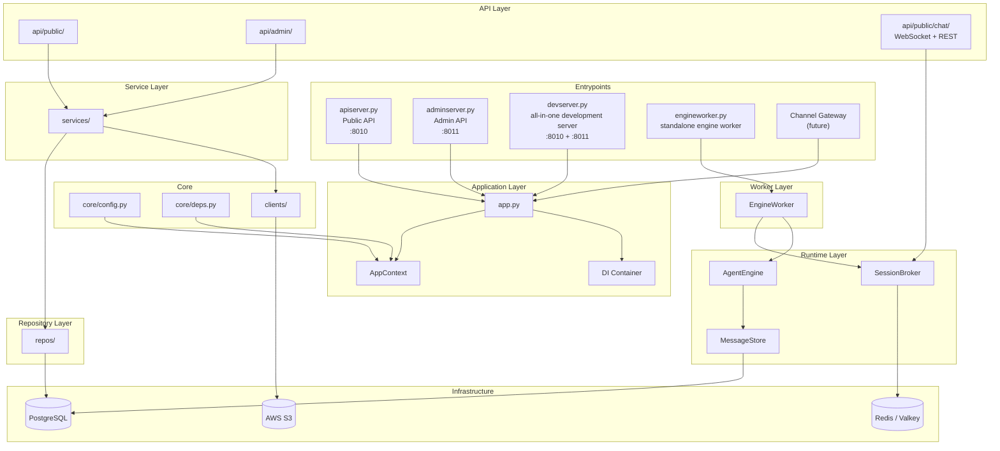

### Public / Admin API separation

Public API and Admin API are separated following the azents pattern.

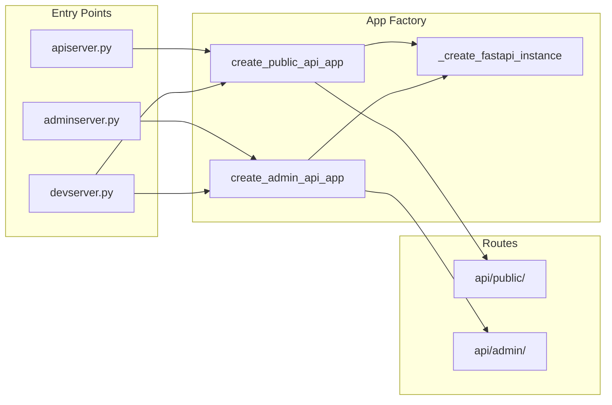

### Differences

| Item | Public API | Admin API |
|------|-----------|-----------|
| **Port** | 8010 | 8011 |
| **Use** | client app | admin tools (Retool) |
| **Pagination** | cursor-based | offset/limit-based |
| **Operations** | mostly read | full CRUD |
| **Endpoint** | `apiserver.py` | `adminserver.py` |

### Entrypoint types

| Entrypoint | Use | Included components |
|-------------|------|-------------|
| `apiserver.py` | production Public API | Public API (:8010) |
| `adminserver.py` | production Admin API | Admin API (:8011) |
| `engineworker.py` | production engine worker | EngineWorker (standalone process) |
| `devserver.py` | local development (all-in-one) | Public API + Admin API + EngineWorker |

### Responsibilities by layer

| Layer | Location | Responsibility | Constraints |
|--------|------|------|----------|
| **API Routes** | `api/` | HTTP request/response handling, input validation | may call only Service |
| **Services** | `services/` | business logic, transaction orchestration | must not use SQLAlchemy directly |
| **Repositories** | `repos/` | data access, query logic | no business logic |
| **Models** | `rdb/models/` | database schema definition | - |

## Agent Runtime

### Framework Decision: direct implementation

Agent runtime is implemented directly without a framework. The essence of a ReAct loop is repeated "call LLM → if tool call, execute → otherwise return", and core logic can be implemented in under 50 lines.

| Framework | Pros | Problems | Decision |
|-----------|------|--------|------|
| **LangGraph** | explicit state management, good multi-agent extension | excessive for MVP; may conflict with Permission Resolver abstraction | revisit in Phase 2-3 |
| **CrewAI** | role-based agents, intuitive | task execution framework, not conversational; no dynamic tool filtering | unsuitable |
| **OpenAI Agents SDK** | simple, official MCP support | dependent on OpenAI models; no multi-LLM | unsuitable |
| **Direct implementation** | full control, custom logic first | — | **adopted** |

Core reason for direct implementation: product-critical logic such as Permission Resolver, dynamic tool filtering, and memory injection conflicts with framework abstractions.

### Technology Stack

```
Runtime:
  litellm        — multi-LLM abstraction (same interface for Claude, GPT, Gemini)
  mcp-client     — MCP server connection and tool call (future)
  direct implementation — ReAct loop, Permission Resolver, Memory Injector

Infrastructure:
  FastAPI        — API server
  PostgreSQL     — agent config, user data, message history
  Redis (Valkey) — message broker (Streams + Pub/Sub)
  pgvector       — memory embedding search (future)

Channel Gateway:
  WebSocket      — Web UI realtime chat (implemented)
  channel adapters — Slack Bolt, Discord.js, etc. (future)
  abstracted through common message interface
```

### ReAct Loop (implemented in `engine/engine.py`)

LLM-based autonomous reasoning loop. Implemented by `AgentEngine` and provides streaming interface (`AsyncIterator[EngineEvent]`).

```python
# engine/engine.py — core logic of AgentEngine.run()
async def run(self, request: RunRequest) -> AsyncIterator[EngineEvent]:
    sid = request.session_id
    tool_map = {t.spec.name: t for t in request.tools}

    # 1. Store user message
    await self._store.append(sid, [request.user_message])

    for _ in range(MAX_ITERATIONS):  # MAX_ITERATIONS = 5
        # 2. Load history + inject system prompt
        history = await self._store.list(sid)
        messages = []
        if request.system_prompt:
            messages.append(Message(role=SYSTEM, content=request.system_prompt))
        messages.extend(history)

        # 3. Call LLM streaming
        async for stream_event in self._llm.stream(CompletionRequest(...)):
            match stream_event:
                case ContentDelta(delta=delta):
                    yield TextDelta(delta=delta)
                case StreamEnd() as end:
                    tool_calls = end.tool_calls
                    usage = end.usage

        if not tool_calls:
            # 4a. Final response → store + yield RunComplete
            await self._store.append(sid, [Message(role=ASSISTANT, content=content)])
            yield RunComplete(content=content, usage=usage)
            return

        # 4b. Tool call → store result → repeat loop
        for tool_call in tool_calls:
            yield ToolCallStart(tool_call=tool_call)
            result = await tool_map[tool_call.name].handler(tool_call.arguments)
            yield ToolCallEnd(tool_call_id=tool_call.id, result=result)
            await self._store.append(sid, [Message(role=TOOL, ...)])

    yield RunComplete(content="Maximum iteration count reached.", usage=None)
```

**Engine event types** (`EngineEvent`):

| Event | Description |
|--------|------|
| `TextDelta(delta)` | LLM text chunk (streaming) |
| `ToolCallStart(tool_call)` | tool call start |
| `ToolCallEnd(tool_call_id, result)` | tool call complete |
| `RunComplete(content, usage)` | execution complete (final response) |

**Core Protocols**:

| Protocol | Location | Responsibility |
|----------|------|------|
| `LLMClient` | `engine/types.py` | LLM call abstraction (litellm implementation) |
| `MessageStore` | `engine/types.py` | conversation history storage/query |

- Prevent infinite loop with `max_iterations = 5`
- `tools` parameter receives only result filtered by Permission Resolver (future)
- `memory` injects relevant memories found by Memory Injector into system prompt (future)
- `litellm` allows replacing LLM without code change
- System prompt is not stored in store; it is injected at front on every call → maximizes token cache hits

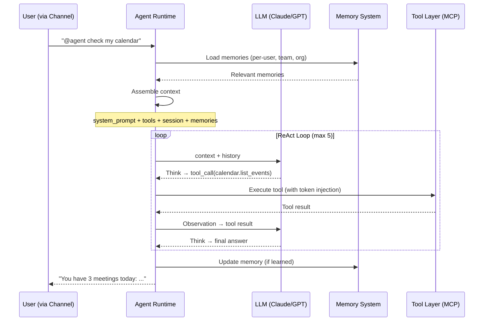

### Context Assembly

Context assembled on each turn:

```python
# Session (ConversationSession): owns event history + tool permission + personal memory scope
context = {
    "system_prompt": agent.system_prompt,
    "tools": filter_by_session(agent.tool_set, session),  # based on session user's integrations
    "channel_context": gateway.fetch_channel_context(...),  # external channel history (Slack API, etc.)
    "session_events": session.events(),                     # event history of this session
    "team_memory": agent.team_memory,                       # shared by all sessions
    "per_user_memory": agent.per_user_memory[session.user], # based on session user
    "org_memory": workspace.org_memory,
}
```

### Context Window Budget

| Item | Token allocation | Notes |
|------|-----------|------|
| system prompt | ~500 | agent personality/role definition |
| tool schemas (10) | ~4,000 | proportional to tool count. 20 tools ≈ ~8,000 |
| memory | ~2,000 (cap) | Per-user 5 + Team 5 + Org 2 |
| conversation history | ~180,000 | managed with compaction |
| response margin | ~13,500 | LLM output buffer |
| total | ~200,000 | based on Claude Sonnet |

### Distributed Runtime Architecture

Channel Gateway (WebSocket, Slack, etc.) and Agent Engine run as **separate processes**, connected by **Redis-based message broker** (`SessionBroker`).

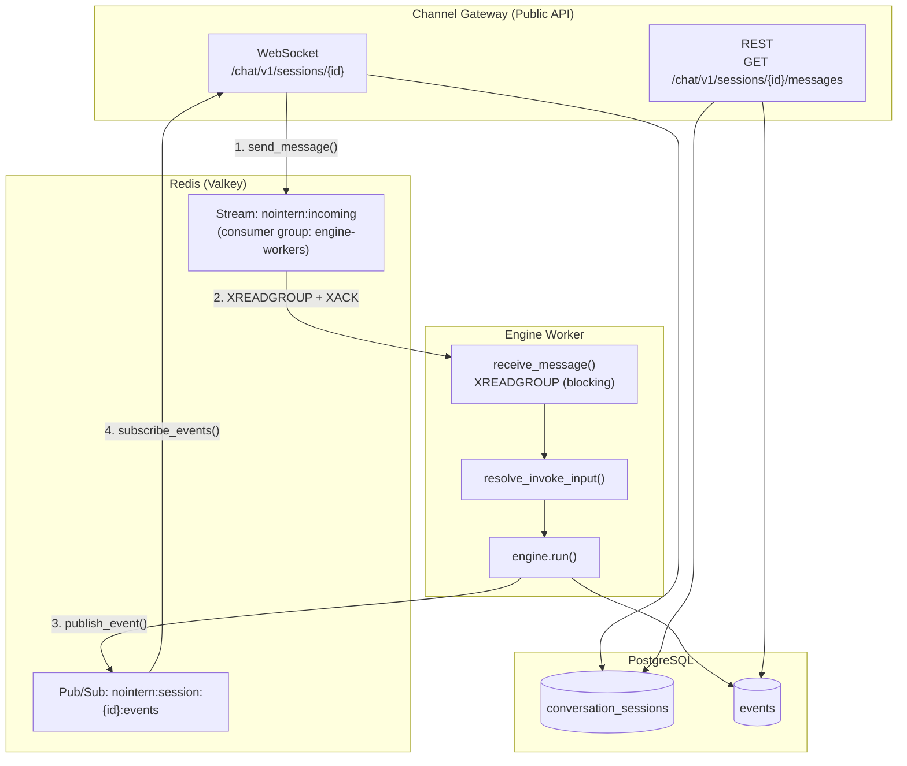

**Data flow**:

1. WebSocket client → `ChatSessionService.ensure_session()` (DB: ConversationSession) → `broker.send_message()` → Redis Stream
2. EngineWorker → `broker.receive_message()` (XREADGROUP blocking) → `resolve_invoke_input()` → `engine.run()`
3. EngineWorker → events from `engine.run()` → `broker.publish_event()` → Redis Pub/Sub
4. WebSocket handler ← `broker.subscribe_events()` ← Redis Pub/Sub → client JSON

**SessionBroker Protocol** (`broker/types.py`):

| Method | Caller | Description |
|--------|--------|------|
| `send_message(message)` | Channel Gateway | XADD to Redis Stream |
| `subscribe_events(session_id)` | Channel Gateway | subscribe to Redis Pub/Sub (async context manager) |
| `receive_message()` | EngineWorker | XREADGROUP from Redis Stream (blocking) |
| `publish_event(session_id, event)` | EngineWorker | PUBLISH to Redis Pub/Sub |

**Redis usage pattern**:

- **Incoming** (Redis Streams): `nointern:incoming` + consumer group `engine-workers`
  - multiple workers competitively consume messages → horizontal scaling
  - XADD → XREADGROUP → XACK
- **Outgoing** (Redis Pub/Sub): `nointern:session:{session_id}:events`
  - realtime event streaming (transient)
  - no loss because WebSocket subscribes before message transmission
  - multiple subscribers possible (multiple browser tabs)

**EngineEvent serialization** (`broker/serialization.py`):

```json
{"type": "text_delta", "delta": "..."}
{"type": "tool_call_start", "tool_call": {"id": "...", "name": "...", "arguments": "..."}}
{"type": "tool_call_end", "tool_call_id": "...", "result": "..."}
{"type": "run_complete", "content": "...", "usage": {...} | null}
```

### Domain Model: ConversationSession

Core domain model for Channel Gateway behavior.

- **ConversationSession**: owns event history, access control, and memory scope. References external channel with `external_channel_id`.

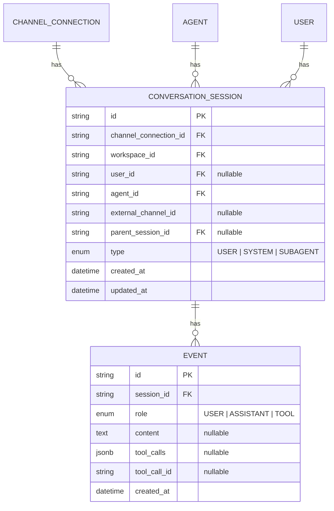

**Session creation flow** (WebSocket):

1. Client passes `session_id` as path parameter when connecting WebSocket
2. On first message, call `ChatSessionService.ensure_session()`
3. If existing session exists, validate user_id match and return it
4. If absent, validate Agent → workspace member, then create ConversationSession

### Event Persistence (RDBEventStore)

Database implementation of `EventStore` protocol. Persists events by `session_id`.

- Implements `EventStore` protocol from `engine/types.py`
- Events are stored/queried directly by `session_id` (session owns events)

**`InMemoryEventStore` remains for tests**. Production uses `RDBEventStore`.

### Chat API: WebSocket + REST

**WebSocket** (`/chat/v1/sessions/{session_id}`):

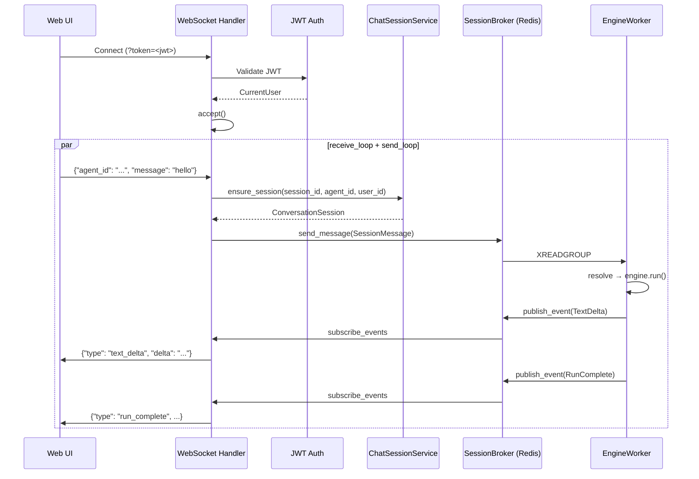

**REST** (`GET /chat/v1/sessions/{session_id}/messages`):

- Bearer token auth (`get_current_user()`)
- Query message history through `ChatSessionService.list_messages()`
- Includes user_id access control

**Auth summary**:

| Endpoint | Auth method | Access control |
|-----------|----------|----------|
| WS `/chat/v1/sessions/{id}` | query param `?token=<jwt>` | user_id match + workspace member |
| GET `/chat/v1/sessions/{id}/messages` | Bearer token | user_id match |

## Tool Layer: MCP + Permission Resolver (future)

### MCP-based tool execution

Each tool is implemented as an MCP Server. The key principle is **agent can never access credentials**.

MCP is a tool "interface standard", but "who calls with which permission" is outside MCP scope. This product's permission requirements are implemented as a platform layer on top of MCP.

| What MCP does | What MCP does not do (platform implementation) |
|-------------|---------------------------|
| define tool schemas (name, parameters, description) | decide whether this session can use this tool |
| tool call protocol (JSON-RPC) | decide whether to use A's token or B's token for this call |
| standardize OAuth 2.1 auth flow in MCP v2 | policy that heartbeat uses only team tokens |

### Permission Resolver Architecture

```
┌──────────────────────────────────────────────────┐
│              Platform Layer                       │
│                                                   │
│  ┌────────────────────────────────────────────┐  │
│  │  Permission Resolver                        │  │
│  │                                             │  │
│  │  Input:                                     │  │
│  │    session      — ConversationSession        │  │
│  │      .agent_id  — which agent?               │  │
│  │      .user_id   — who triggered? (NULL=system) │
│  │      .type      — USER / SYSTEM / SUBAGENT  │  │
│  │    tool_name    — which tool to call?        │  │
│  │                                             │  │
│  │  Logic:                                     │  │
│  │    1. Is this tool connected to the agent?   │  │
│  │    2. Team integration or personal integration? │
│  │    3. If personal, does session.user have token? │
│  │    4. If system session, allow team token only │
│  │                                             │  │
│  │  Output: { allowed, token }                 │  │
│  └──────────────┬──────────────────────────────┘  │
│                 │                                  │
│                 ▼                                  │
│  ┌────────────────────────────────────────────┐  │
│  │  MCP Client (inject token → call MCP server) │
│  └──────────────┬──────────────────────────────┘  │
└─────────────────┼────────────────────────────────┘
                  │ JSON-RPC
                  ▼
         ┌──────────────┐
         │  MCP Server   │
         └──────────────┘
```

### Dynamic Tool Filtering

Tool visibility is pre-filtered (Tool Filtering), while token binding happens at call time (Call-time Enforcement).

```
At the start of each turn, compute available_tools based on session:

  available_tools =
    agent.tools                          // tools connected to agent
    ∩ (session.type == SYSTEM
        ? team_integrations_only         // system session → team integrations only
        : team_integrations              // user session → team +
          ∪ user_integrations[session.user])  //   session user's personal integrations

  → Include only this list in LLM context
  → LLM does not try to call invisible tools
  → Permission Resolver performs final check + token binding at call time
```

Advantage: avoids unnecessary loop where LLM tries unavailable tool → denied → retry.

### Session-Based Token Resolution

| Session type | Personal Integration | Team Integration |
|----------|:---:|:---:|
| USER (user mention) | O (session user) | O |
| SYSTEM (channel heartbeat) | X | O |
| SYSTEM (DM heartbeat) | O (DM channel user) | O |

## Heartbeat System (future)

Heartbeat turns an agent from a "tool that answers when asked" into a "coworker that proactively checks things".

### Execution Flow

Heartbeat uses the same ReAct loop as normal conversation. The trigger is cron instead of user mention, and a **system session** (`type=SYSTEM`) is created.

```
[Scheduler] cron trigger
      │
      ▼
[Create system session]
  group channel heartbeat → ConversationSession(type=SYSTEM, user=NULL, external_channel_id=...)
  DM heartbeat            → ConversationSession(type=SYSTEM, user=DM user reference, external_channel_id=...)
      │
      ▼
[Permission Resolver]
  session.type == SYSTEM, user == NULL → team integrations only
  session.type == SYSTEM, DM user reference → team + that user's personal integrations
      │
      ▼
[Memory Injector] search + inject team memory
      │
      ▼
[Agent Runtime - ReAct Loop]
  system prompt + heartbeat context + memory + filtered tools
      │
      ▼
[Channel Gateway] send message to external channel by external_channel_id
      │
      ▼
[End system session]
```

### Group channel vs DM Heartbeat

| Category | Group channel Heartbeat | DM Heartbeat |
|------|-------------------|-------------|
| Session | SYSTEM (user=NULL) | SYSTEM (DM user reference) |
| Tool access | team integrations only | team + that user's personal integrations |
| Output target | external group channel (public to all) | external DM (that user only) |
| Example | 3 pending PRs, 0 Jira blockers | weather + calendar + PR + email briefing |
| Rationale | system session has no user → no personal token | only member of DM = that user |

### Schedule Design

Schedules are independent per channel. Same agent can run heartbeat at different frequencies per channel.

```
Agent: backend-bot
  #backend:         every day 09:00, 14:00 (weekdays)
  #backend-alerts:  every 30 minutes (monitoring)
  Geonwoo DM:       every day 08:00

User input → cron conversion:
  "every morning at 9"        → 0 9 * * *
  "weekdays at 9 AM and 2 PM" → 0 9,14 * * 1-5
  "every 30 minutes"          → */30 * * * *
```

### Heartbeat Prompt Strategy

In MVP, one system prompt defines all agent behavior (conversation + heartbeat). Heartbeat execution automatically injects time/channel context.

```
Automatically injected Heartbeat Context:
  current time: 2026-02-23 09:00 KST
  execution type: scheduled heartbeat
  channel: #backend
  available tools: github_list_prs, jira_get_board
```

### Cost Management

| Scenario | Tokens/run | Frequency | Monthly cost (estimate) |
|---------|--------|------|-------------|
| #backend heartbeat (2 tools) | ~6,000 | 2/day | ~360K tokens/month |
| DM heartbeat (4 tools) | ~15,000 | 1/day | ~450K tokens/month |
| whole team (3 agents, 10 channels) | — | — | ~6M tokens/month ≈ $18 |

### Output Options

| Option | Description |
|------|------|
| always report | send status report even with no notable items |
| only notable items | send only when there is something to report |
| reaction only | show only ✅ emoji when no notable items |

### Heartbeat vs Event Trigger

| Category | Heartbeat (MVP) | Event Trigger (Phase 2) |
|------|----------------|----------------------|
| Base | time (cron) | event (webhook) |
| Execution | may have no result | only when event occurs |
| Cost | predictable (schedule-based) | varies by event frequency |
| Example | daily 09:00 PR summary | notify immediately when new PR opens |

## E2E Walkthrough: a day of "backend bot"

This validates that all architecture decisions work in a real scenario.

Characters: Geonwoo (tech lead), teammate A (developer), teammate B (new hire, no personal integrations), backend bot (agent)

### Agent settings

```
Name: backend bot
Prompt: "Backend team assistant. PR management, Jira tracking, deployment support."
Tools: GitHub(team), Jira(team), Slack(team), Weather(public), Calendar(personal only), Gmail(personal only)
Channels: #backend, Geonwoo DM
Heartbeat: #backend 09:00 / Geonwoo DM 08:00
```

### 08:00 Geonwoo DM Heartbeat

```
Session: SYSTEM (DM channel → Geonwoo reference) → system session
  available_tools: github(team) + jira(team) + weather(public)
                   + calendar(Geonwoo) + gmail(Geonwoo)

ReAct Loop:
  → weather_forecast(Yangjae-dong) → Sunny 15°C
  → calendar_list(Geonwoo token) → 3 meetings
  → github_list_prs(team token) → 2 pending PRs
  → gmail_unread(Geonwoo token) → 2 unread emails

Output (Geonwoo DM):
  ☀️ Sunny 15°C / 📅 3 meetings / 🔔 2 pending PRs / 📧 2 emails
```

### 09:00 #backend channel Heartbeat

```
Session: SYSTEM (user=NULL) → system session
  available_tools: github(team) + jira(team) + weather(public)
  → Calendar, Gmail not listed (personal integrations)

Output (#backend):
  📋 2 pending PRs, 5 Jira In Progress items, 0 blockers
```

### 10:30 teammate A conversation + memory creation

```
teammate A: @backendbot summarize changes in PR #142

Session: (#backend, teammate A) → user session active
  available_tools: team tools + teammate A personal integrations
  → query PR with GitHub (team token)

Agent: "PR #142 changed 8 files, +342/-128 ..."

teammate A: "From now on, show PR summaries as one line per file only"

Memory Extraction (rule-based immediate):
  "from now on" keyword → explicit preference
  → per_user/teammate A: "Prefers PR summaries in one-line-per-file format"
  → notification: [Personal memory added] ... [Revert]
```

### 14:00 teammate B (no personal integration)

```
teammate B (DM): @backendbot check my calendar

Permission Resolver:
  teammate B Calendar personal integration → absent
  → Calendar excluded from available_tools
  → Calendar tool invisible to LLM

Agent: "Calendar integration is required. [Connect]"
  → send OAuth link

--- teammate B completes OAuth ---

teammate B: @backendbot now check my calendar
  → Permission Resolver: Calendar token exists → tool added
  → calendar_list(teammate B token) → 2 meetings
```

### 16:00 team memory change + Revert

```
teammate A: @backendbot deployment schedule changed to Tue/Thu

Memory: existing "Wed/Fri" → new "Tue/Thu"
  → conflict detected → update
  → Immediate notification:
    "[Team memory changed] Deployment schedule: Wed/Fri→Tue/Thu [Revert]"

Geonwoo clicks [Revert]:
  → restored: "Deployment is Wed/Fri only"
  → "[Memory restored] Deployment schedule restored to Wed/Fri (by Geonwoo)"
```

### Verification result

| Verification item | Result | Rationale |
|---------|------|------|
| Permission Resolver covers all scenarios | ✅ | channel/DM heartbeat, user mention, unlinked user all handled correctly |
| memory system works naturally | ✅ | immediate capture, conflict detection, Revert, daily digest all work |
| heartbeat works independently by channel | ✅ | personal tools in DM, team tools only in channel. Same ReAct loop |
| credential isolation maintained | ✅ | agent never sees token in any scenario |
| architecture simplicity | ✅ | integrated through ReAct loop + Permission Resolver without separate pipeline |

## Full Architecture Diagram

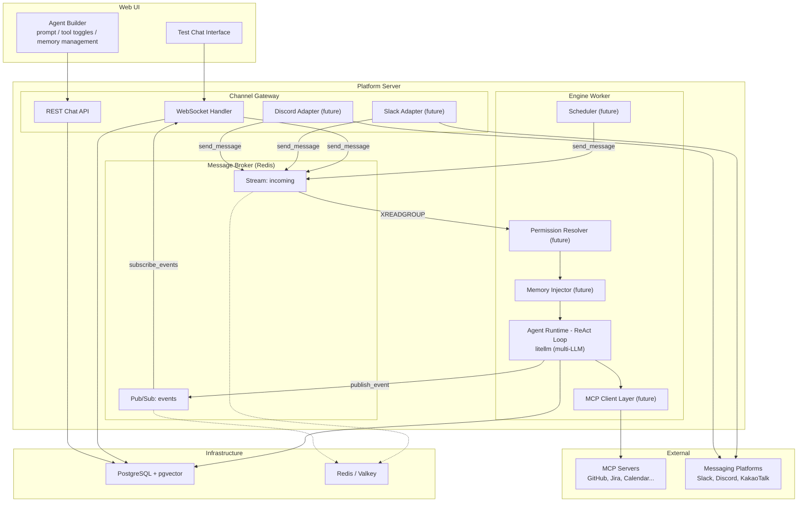

## Channel Gateway

### Abstraction layer

All Channel Gateways communicate with engine through `SessionBroker`. New channels can be added by implementing only `send_message()` + `subscribe_events()`.

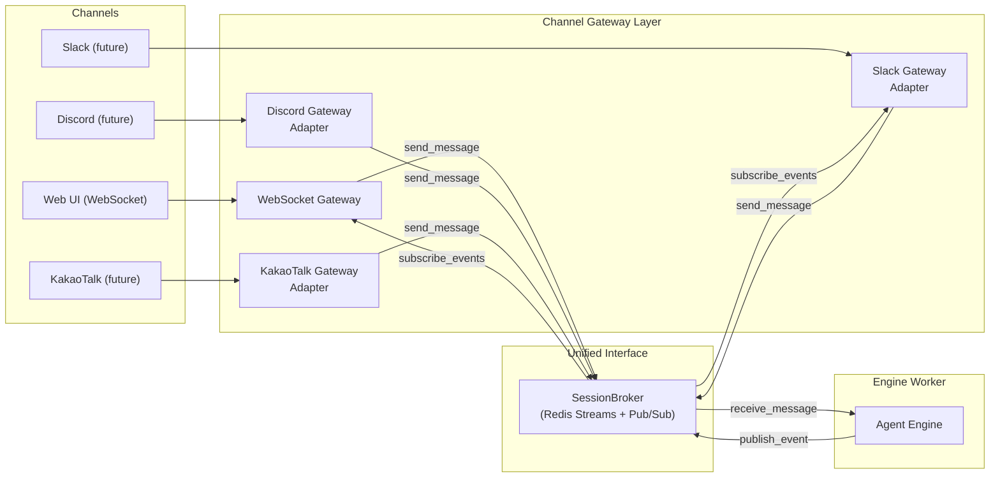

Same agent behaves the same across all channels. Sessions are isolated per channel, but system prompt / tools / memory are shared.

Current **WebSocket Gateway** is complete as first implementation, and external messaging channels such as Slack/Discord will be added later.

## Dependency Injection

### AppContext pattern

AppContext is a container that manages resources kept for application lifetime (DB connection, AWS clients, etc.).

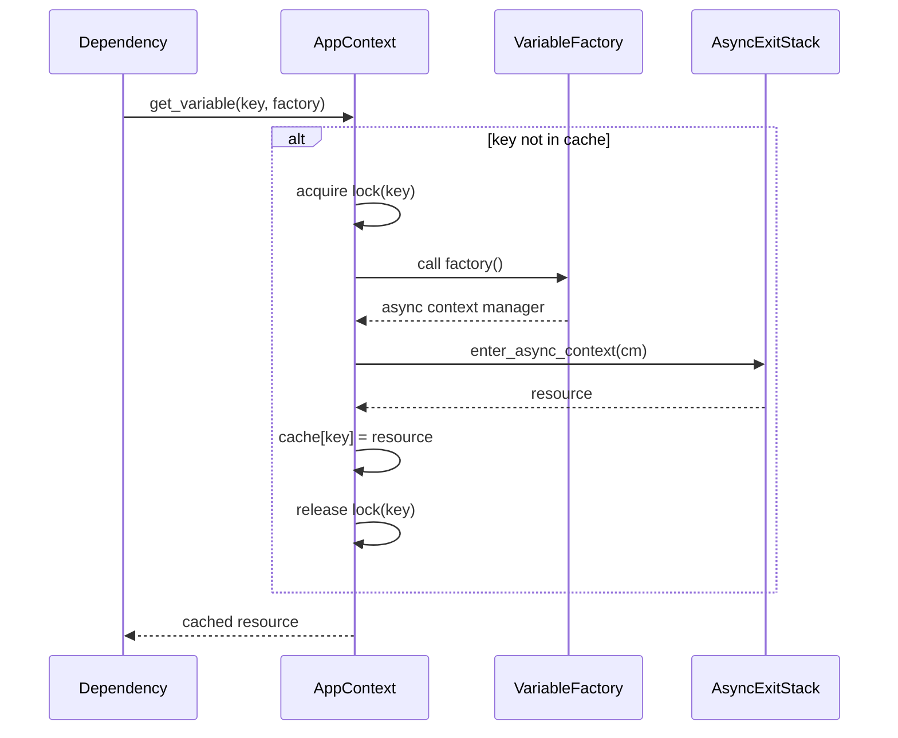

### Dependency flow

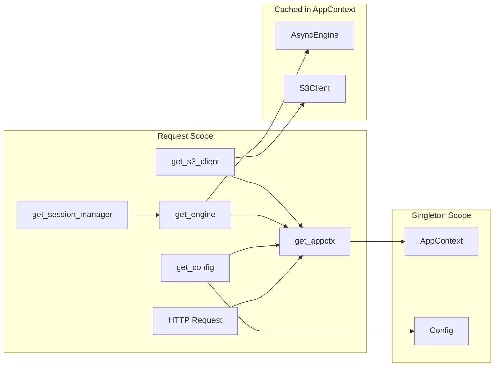

## API Request Processing Flow

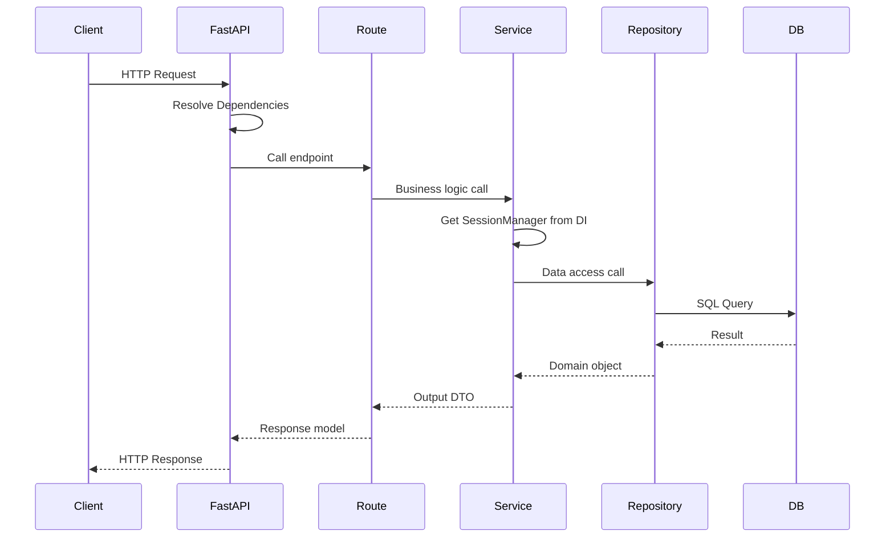

## Configuration Management

### Settings → Config conversion

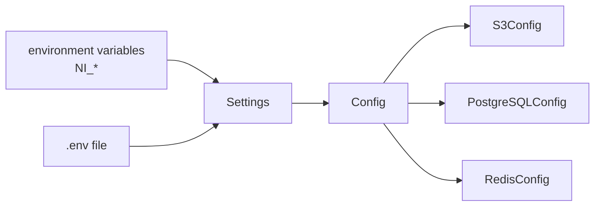

- **Settings**: flat settings loaded from environment variables
- **Config**: immutable settings object structured by domain

## File Structure

```
nointern/
├── apiserver.py           # Public API entrypoint (:8010)
├── adminserver.py         # Admin API entrypoint (:8011)
├── devserver.py           # all-in-one dev server (:8010 + :8011 + EngineWorker)
├── engineworker.py        # standalone engine worker entrypoint
├── pyproject.toml
│
└── src/nointern/
    ├── __init__.py
    ├── app.py                 # FastAPI app factory functions
    │                          # - create_public_api_app(config, broker?)
    │                          # - create_admin_api_app(config)
    │                          # - run_with_container(config)
    ├── consts.py              # constants (PROJECT_ROOT, etc.)
    │
    ├── core/                  # core config and dependencies
    │   ├── __init__.py
    │   ├── config.py          # Settings, Config, *Config, RedisConfig
    │   ├── enums.py           # domain ENUMs (ConversationSessionType,
    │   │                      #   MessageRole, AgentType, LLMProvider, etc.)
    │   ├── credentials.py     # credential schema (Secrets/Config discriminated union)
    │   ├── deps.py            # get_appctx, get_config
    │   └── auth/              # auth/authz
    │       ├── deps.py        # get_current_user, get_workspace_member
    │       └── jwt.py         # JWT issue/verify
    │
    ├── clients/               # external service clients
    │   ├── __init__.py
    │   └── aws.py             # get_aws_session, get_s3_client
    │
    ├── broker/                # message broker (Channel Gateway ↔ Engine)
    │   ├── __init__.py
    │   ├── types.py           # SessionBroker Protocol, SessionMessage
    │   ├── serialization.py   # EngineEvent ↔ JSON serialization
    │   └── redis.py           # RedisBroker (Redis Streams + Pub/Sub)
    │
    ├── runtime/               # Agent Runtime engine
    │   ├── engine.py          # AgentEngine (ReAct loop)
    │   ├── types.py           # LLMClient, MessageStore, Message, ToolCall, etc.
    │   ├── llm.py             # LitellmClient (litellm-based LLM client)
    │   ├── message_store.py   # InMemoryMessageStore (for tests)
    │   └── deps.py            # get_llm_client, get_message_store, get_agent_engine
    │
    ├── worker/                # engine worker
    │   ├── __init__.py
    │   └── engine.py          # EngineWorker (broker receive → engine run → event publish)
    │
    ├── rdb/                   # database layer
    │   ├── __init__.py
    │   ├── session.py         # SessionManager Protocol
    │   ├── deps.py            # get_engine, get_session_manager
    │   ├── models/
    │   │   ├── __init__.py
    │   │   ├── base.py        # RDBModel base class
    │   │   ├── conversation_session.py  # RDBConversationSession
    │   │   └── event.py       # RDBEvent
    │   └── types/
    │       ├── __init__.py
    │       └── datetime.py    # TimeZoneDateTime type
    │
    ├── repos/                 # repositories (data access)
    │   ├── __init__.py
    │   ├── conversation_session/  # ConversationSession repository
    │   └── message/           # Event repository + RDBEventStore
    │       ├── __init__.py    # MessageRepository
    │       ├── data.py        # ChatMessage
    │       └── store.py       # RDBEventStore (EventStore protocol implementation)
    │
    ├── services/              # services (business logic)
    │   ├── __init__.py
    │   ├── agent_runtime/     # Agent invocation service (resolve + invoke)
    │   │   ├── __init__.py    # AgentRuntimeService
    │   │   ├── data.py        # InvokeInput, InvokeOutput, error types
    │   │   └── resolve.py     # standalone resolve_invoke_input() function
    │   └── chat/              # chat session service
    │       ├── __init__.py    # ChatSessionService (session management + message query)
    │       └── data.py        # EnsureSessionInput, error types
    │
    ├── api/                   # API routes
    │   ├── __init__.py
    │   ├── public/            # Public API
    │   │   ├── __init__.py    # mount function
    │   │   ├── health/
    │   │   ├── workspace/
    │   │   ├── workspace_member/
    │   │   ├── team/
    │   │   ├── team_member/
    │   │   ├── auth/
    │   │   ├── llm_provider_integration/
    │   │   ├── llm_provider_model/
    │   │   ├── agent/
    │   │   └── chat/          # WebSocket + REST chat API
    │   │       └── v1/        # WS /sessions/{id}, GET /sessions/{id}/messages
    │   └── admin/             # Admin API (CRUD)
    │       ├── __init__.py    # mount function
    │       ├── health/
    │       ├── workspace/
    │       ├── team/
    │       ├── workspace_user/
    │       ├── team_member/
    │       ├── llm_model/
    │       └── llm_provider_model/
    │
    └── utils/                 # utilities
        ├── __init__.py
        ├── appctx.py          # AppContext class
        └── fastapi/
            ├── __init__.py
            └── route.py       # RouteMounter, generate_short_operation_id
```

## Extension Guide

### Add Channel Gateway server

A new Channel Gateway communicates with engine through `SessionBroker`. `run_with_container()` can be used to leverage DI even in non-FastAPI applications:

```python
# gateway/slack.py
from nointern.app import run_with_container
from nointern.broker.redis import RedisBroker
from nointern.core.config import Config, Settings

async def main() -> None:
    config = Config.from_settings(Settings())
    redis = Redis.from_url(config.redis.url)
    broker = RedisBroker(redis)
    await broker.setup()

    async with run_with_container(config) as container:
        gateway = SlackGateway(broker=broker, ...)
        await gateway.run()
```

Gateway sends user messages with `broker.send_message()` and subscribes to engine responses with `broker.subscribe_events()`, then forwards them to the channel.

### Add new domain

1. Add SQLAlchemy model under `rdb/models/`
2. Add repository under `repos/{domain}/`
3. Add service under `services/{domain}/`
4. Add API routes:
   - **Public API**: add endpoint under `api/public/{domain}/`
   - **Admin API**: add CRUD endpoint under `api/admin/{domain}/`
5. In each API `__init__.py`, import module and add to `modules` list

### New domain route example

```python
# api/public/{domain}/__init__.py
from nointern.utils.fastapi.route import RouteMounter
from . import v1

def mount(mounter: RouteMounter) -> None:
    v1.mount(mounter)

# api/public/{domain}/v1/__init__.py
from fastapi import APIRouter
from nointern.utils.fastapi.route import RouteMounter

router = APIRouter()

@router.get("/items")
async def list_items() -> list[Item]:
    """List items."""
    ...

def mount(mounter: RouteMounter) -> None:
    mounter(
        router,
        prefix="/{domain}/v1",
        tag="{Domain} v1",
        description="{Domain} API",
    )
```

Then add the module to `api/public/__init__.py` or `api/admin/__init__.py`:

```python
from . import health, {domain}

modules = [health, {domain}]
```

### Add new MCP Tool Server (future)

```python
# tools/github/__init__.py
from mcp import Server

server = Server("github")

@server.tool()
async def list_pull_requests(repo: str) -> list[PullRequest]:
    """List pull requests. OAuth token is injected by platform."""
    # token is automatically injected from MCP context
    ...
```

Adding a tool = adding one MCP server. New tools can be connected without changing agent code.
