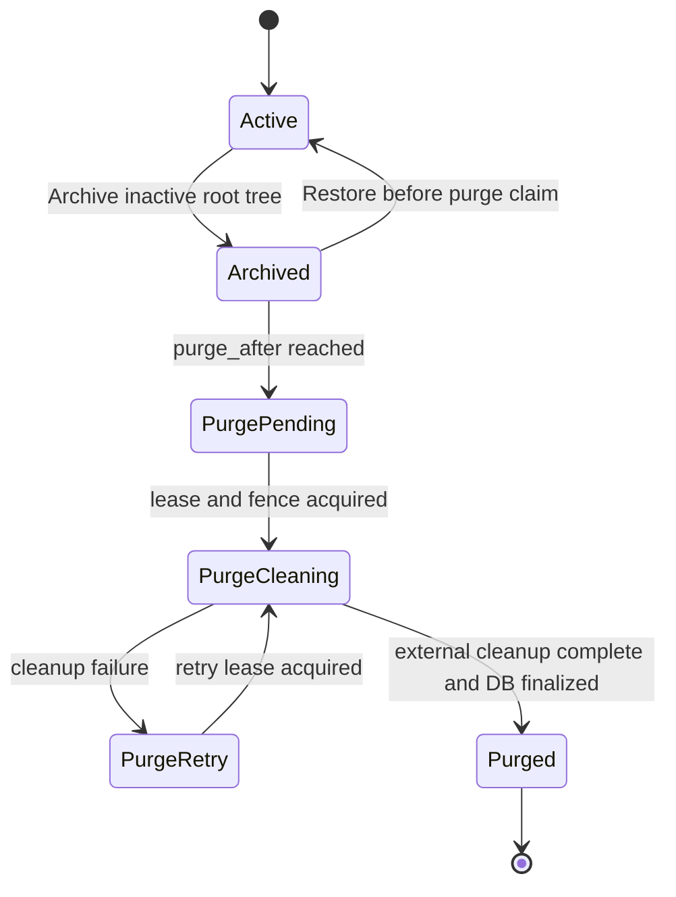

# Archived Session Retention and Durable Purge

## Problem

AgentSession archive currently removes an inactive non-primary session from active lists but does not define a retention deadline, archived-session browser, or restore flow. A separate public delete API can hard-delete a session, while the product direction is to make archive reversible and use expiration as the only ordinary permanent-deletion path.

The deletion boundary is no longer one visible AgentSession. A root SessionAgent owns a tree of child SessionAgents and linked child AgentSessions. Purging only the root row or deleting rows before external-resource cleanup can leave active child work, object-storage blobs, or Git worktrees without durable ownership metadata.

## Goals

- Provide an instance-wide archive-retention policy managed by system administrators.
- Default to 30 days and support unlimited retention.
- Snapshot a purge deadline when a root session is archived, changed later only by explicit administrator-selected recalculation.
- Let administrators choose whether a retention change affects only new archives or recalculates existing archives whose purge has not started.
- Let users browse and restore archived sessions until purge starts.
- Remove the separate user-facing permanent-delete feature.
- Permanently delete the complete SessionAgent subtree after expiration.
- Delete subtree ModelFile and Artifact blobs as part of purge.
- Bind ExchangeFiles to a root-session retention owner when first used and delete remaining bound blobs during purge.
- Preserve independent TTL cleanup for unbound uploads and as an earlier expiry boundary for bound files.
- Clean up Azents-owned worktrees before deleting their ownership metadata.
- Make purge durable, retryable, observable, and idempotent.
- Prevent archived sessions from resuming due to stale worker or broker state.

## Non-goals

- Archiving or purging team-primary sessions.
- Per-workspace, per-Agent, or per-user archive retention overrides.
- User-selected purge deadlines.
- A user-facing immediate-delete action.
- Cross-root ExchangeFile sharing or reference counting.
- Historical ExchangeFile ownership reconstruction from event URI scanning.
- Replacing the existing global scheduled-task infrastructure.
- Providing long-term storage for Artifact, ExchangeFile, or runtime workspace files.

## Current behavior

### Archive

`POST /chat/v1/agents/{agent_id}/sessions/{session_id}/archive`:

- accepts active root non-primary sessions;
- rejects team-primary and running root sessions;
- marks only the requested AgentSession as `archived`;
- stores `ended_at`;
- removes the session from active lists;
- marks context worktrees cleanup-pending and schedules cleanup through FastAPI `BackgroundTasks`.

There is no archived-session list or restore API. Child AgentSessions in the SessionAgent subtree are not transitioned as part of root archive.

### Hard delete

`DELETE /chat/v1/sessions/{session_id}` is public. `ChatSessionService.delete_session()` attempts worktree cleanup and then calls `AgentSessionRepository.delete_by_id()`, which resolves the linked SessionAgent descendants and deletes all linked AgentSession rows.

Database cascades remove most session-owned rows. However, external blob and filesystem cleanup cannot be made reliable if their ownership metadata is deleted first.

### Worker and broker boundary

Redis maintains per-session message queues, ownership locks, owner heartbeats, and activity keys. Message queues have a longer TTL than activity state.

The repository methods that claim owner generation or transition a session to running do not consistently require `status = active`. A wake-up queued before archive can therefore reach a worker after archive unless admission is fenced explicitly.

### Files

- ModelFile has an AgentSession cascade foreign key and physical object-storage state tracked by `blob_deleted_at`.
- Artifact is TTL-owned by current policy but also has an AgentSession cascade foreign key.
- ExchangeFile is workspace/Agent-scoped and has no AgentSession association.
- The Agent upload endpoint can create an ExchangeFile before a session exists.
- Session-aware ExchangeFile creation methods validate a session but cannot persist ownership in the current schema.
- Existing-session input materialization authorizes attachments in the Agent namespace, while the new-session first-message path stores raw attachment URIs without binding them.
- Original and generated preview-thumbnail ExchangeFiles are persisted together, but only the original points to the thumbnail row.
- Physical blob deletion is already modeled as retryable and separate from logical unavailable/deleted status.

### Worktrees

Worktree allocation rows are stored under SessionAgentContext. Their creator AgentSession references use `SET NULL`, while deleting the context cascades the allocation rows.

The current repository lookup by session resolves the shared context and can return allocations created by multiple subtree sessions. Cleanup ownership validation still requires each request to match the allocation's actual creator AgentSession. Root-only cleanup is therefore not a correct tree cleanup boundary.

## Product lifecycle



Restore is permitted only while the durable purge job has not entered fencing or cleanup. Zero-day retention makes the archive immediately eligible for the next scheduler pass but does not skip the Archived state transaction.

## System setting

Add a typed DB-backed file-lifecycle settings section rather than a generic string key-value setting.

Suggested logical model:

| Field | Type | Meaning |
| --- | --- | --- |
| `archived_session_retention_days` | integer \| null | Non-negative whole days; `null` means unlimited |
| `revision` | bigint | Optimistic-concurrency and snapshot identity |
| `updated_at` | timestamptz | Last update time |
| `updated_by_user_id` | FK | System administrator that changed the policy |

The initial row uses `archived_session_retention_days = 30`.

PATCH semantics follow the repository-wide partial-update convention:

- omitted retention field: leave the value unchanged;
- explicit `null`: set unlimited retention;
- integer: set the finite retention value;
- `application_scope = "new_archives_only"`: preserve existing archive snapshots; this is the default;
- `application_scope = "recalculate_existing"`: durably recalculate eligible existing archives against the new value.

`application_scope` is a request decision, not persistent policy state. When a new retention value is supplied and the scope is omitted, it defaults to `new_archives_only`. `recalculate_existing` may also be requested with the retention field omitted, in which case the server creates a new revision that reapplies the current value to eligible existing archives. A request that omits the value and selects `new_archives_only` is a no-op and is rejected.

The Admin API must reject negative, fractional, boolean-coerced, or otherwise invalid values. Zero is valid and must receive destructive-policy warning copy in Admin UI. Before a `recalculate_existing` update, the server provides an impact preview containing:

- archived roots whose deadlines would change;
- roots that would become immediately purge-eligible;
- pending purge jobs that would be cancelled by unlimited retention;
- unlimited archives that would receive finite deadlines;
- roots already in fencing or cleanup and therefore excluded.

The preview is advisory because archive, restore, and purge may race with confirmation. The settings revision and authoritative applied/skipped counts are returned by the update operation.

## AgentSession archive metadata

Add root archive metadata:

| Field | Type | Meaning |
| --- | --- | --- |
| `archived_at` | timestamptz \| null | Explicit archive boundary |
| `purge_after` | timestamptz \| null | Stable eligibility time; null for unlimited |
| `archive_policy_revision` | bigint \| null | System setting revision used at archive |
| `archive_retention_days_snapshot` | integer \| null | Display and audit snapshot; null for unlimited |

Create a partial index on finite archived deadlines:

```sql
CREATE INDEX ... ON agent_sessions (purge_after)
WHERE status = 'archived' AND purge_after IS NOT NULL;
```

Only the root AgentSession needs the deadline snapshot. Descendant AgentSessions follow the root's lifecycle but are also marked archived so all direct worker and write boundaries can reject them without repeated root resolution.

`ended_at` remains existing lifecycle metadata and is not the retention source of truth.

## Existing-archive retention recalculation

Applying a setting revision to existing archives is durable batch work rather than an unbounded Admin request transaction. Store revision-bound progress with at least target retention, status, cursor, affected/skipped/immediately-eligible counters, updater, and lifecycle timestamps.

For each bounded batch:

1. Select archived root sessions whose `archive_policy_revision` is older than the target revision and whose purge job is absent or has `fencing_started_at = null`.
2. Lock roots and purge jobs in stable order.
3. Revalidate that purge fencing has not started.
4. Recompute from the original archive boundary: `purge_after = archived_at + target retention`.
5. Update `archive_policy_revision` and `archive_retention_days_snapshot`.
6. Create, reschedule, or cancel pending purge work to match the recalculated deadline.
7. Commit the batch and advance durable progress.

For unlimited retention, step 4 stores `purge_after = null` and step 6 cancels only purge work that has not started. For a finite value, a calculated deadline at or before the current time becomes immediately eligible for the normal purge scheduler. Recalculation never performs deletion itself.

Roots entering `fencing` or `cleaning` before their batch is locked are counted as skipped and remain irreversible. Restore may remove a root from the candidate set. A root archived after the setting update already snapshots the target revision and is naturally excluded.

Only one existing-archive recalculation may be active at a time. Retention-value changes are rejected until the active recalculation completes, while unrelated system settings may still change. This keeps partial application and revision ordering observable.

## ExchangeFile retention ownership

Add nullable root-retention ownership to ExchangeFile rather than a many-to-many reference model.

| Field | Type | Meaning |
| --- | --- | --- |
| `retention_root_session_id` | AgentSession FK \| null | Root AgentSession whose purge may delete the file |
| `retention_bound_at` | timestamptz \| null | Time the previously unbound upload was claimed |

Index `retention_root_session_id` together with lifecycle status for bounded purge lookup. The root-session relationship is lifecycle ownership, not a statement that only the root AgentSession may display or consume the file. Child AgentSessions in the same SessionAgent tree share the root retention unit.

Pre-session uploads keep both fields null. ExchangeFiles created from an existing root or child AgentSession store the resolved root owner immediately, including generated preview-thumbnail rows.

All user-input entry points must claim referenced ExchangeFiles in the same database transaction that durably accepts the input:

1. Parse and deduplicate ExchangeFile URIs.
2. Resolve and lock the source rows in stable order.
3. Resolve generated preview rows and include them in the same lock and claim set.
4. Verify workspace, Agent, user access, and available status.
5. Require each row to be unbound or already bound to the same root retention unit.
6. Set root ownership on unbound rows.
7. Persist the new session/input or existing-session input and commit once.

A conditional update or row lock prevents two root sessions from simultaneously claiming the same upload. Same-root retries are idempotent. A row already owned by another root causes the input transaction to fail rather than silently accepting an attachment that the session does not own.

The new-session first-message path must therefore create the root AgentSession, claim attachments, and persist the buffered input in one transaction. Existing message, input, and edit paths use the same claim boundary. ModelFile materialization may perform object-store work outside that transaction, but later resolution must require matching root retention ownership instead of Agent namespace alone.

Ordinary ExchangeFile TTL remains valid. For a bound file, the effective terminal boundary is the earlier of its own `expires_at` and owning-root purge. Expiry while archived remains possible and restore does not recreate the file. An unbound upload that is never accepted into a session remains solely TTL-owned.

## Durable purge job

The global scheduler task state prevents duplicate task execution but does not represent independent retry progress for many destructive session workflows. Add a per-root purge job table.

Suggested logical fields:

| Field | Purpose |
| --- | --- |
| `id` | Job identity |
| `root_session_id` | Stable root identity retained after deletion |
| `eligible_at` | Snapshotted purge eligibility |
| `status` | `pending`, `fencing`, `cleaning`, `retry_wait`, `completed`, `cancelled` |
| `fencing_started_at` | Irreversible-boundary marker; non-null jobs cannot be restored or rescheduled |
| `attempt_count` | Retry count |
| `lease_owner`, `lease_expires_at` | Per-job execution lease |
| `next_attempt_at` | Bounded-backoff retry time |
| `last_error_kind`, `last_error_summary` | Operator-safe failure detail |
| `policy_revision` | Retention setting snapshot |
| resource counters | Non-content audit and observability counts |
| lifecycle timestamps | Created, started, last-attempt, completed, cancelled |

The completed job must not retain transcript text, titles, file names, prompts, storage credentials, or file bytes. `root_session_id` must not use `ON DELETE CASCADE`; the job is the purge tombstone after session deletion.

Unlimited archive does not create runnable purge work. Restore cancels only purge work whose `fencing_started_at` is null.

## Archive transaction

Archive operates on the root retention unit.

1. Resolve the requested AgentSession and require a root non-primary session.
2. Lock the root and all descendant AgentSession rows in stable order.
3. Require every subtree session to be inactive and have no active AgentRun.
4. Read the current system file-lifecycle setting revision.
5. Calculate `purge_after = archived_at + retention_days`, or null for unlimited.
6. Mark the entire subtree archived.
7. Store archive metadata on the root.
8. Create or replace the pending purge job for finite retention.
9. Commit without deleting worktrees or file resources.

Archive remains idempotent only at the service level where appropriate. The public route may continue to return not-found semantics for a session that is no longer active rather than silently changing an existing deadline.

## Restore transaction

1. Resolve and lock the archived root and purge job.
2. Reject restore if job status is `fencing` or `cleaning`.
3. Lock the subtree.
4. Mark the subtree active.
5. Clear root archive metadata.
6. Mark finite purge work cancelled.
7. Commit.

Restore does not recreate resources. The design therefore requires archive itself to avoid irreversible ModelFile or worktree cleanup. Independently expiring TTL resources may still be unavailable after restore, consistent with their own policies.

## Worker fencing

Archived subtree sessions must fail closed at every execution admission boundary.

Required guards include:

- owner-generation claim requires an active AgentSession;
- `mark_running` and input-wakeup running transitions require active status;
- pending command and input admission require active status;
- worker message processing discards wake-ups for missing or archived sessions;
- recovery does not claim pending/running AgentRuns for archived sessions;
- any continuation or internally generated wake-up rechecks active status.

Archive rejects a subtree with active work instead of trying to stop it implicitly. Purge still performs defensive fencing in case of stale state or an older worker:

- increment or otherwise invalidate the durable owner generation;
- persist system-owned stop intent where an active run is detected;
- send stop signals for every affected session;
- wait for terminal run state before resource deletion;
- clear message queue, ownership lock, owner heartbeat, and activity keys.

Extend the broker abstraction with a session-state purge operation rather than reaching into Redis from the purge service.

## Scheduler workflow

Register `archived_session_purge` in the existing scheduler registry. A five-minute interval is sufficient because retention is day-granularity. Use the existing global task lease plus per-job leases and bounded batches.

One pass:

1. Claim due jobs using `FOR UPDATE SKIP LOCKED` and a bounded limit.
2. Revalidate root status, deadline, and job identity.
3. Fence the subtree.
4. If any run remains active, transition to retry-wait without external deletion.
5. Clean required external resources.
6. Verify cleanup completion.
7. Delete the DB subtree in one final transaction.
8. Mark the purge job completed.

A lease expiry allows another scheduler instance to resume the same job. Every phase must derive pending work from durable state rather than process memory.

## ModelFile cleanup

Purge lists ModelFiles for every AgentSession in the subtree independently of model-input-head GC cursors.

For each bounded batch:

1. Mark available ModelFiles deleted when not already deleted.
2. Attempt object-storage deletion for rows without `blob_deleted_at`.
3. Treat an already absent object as successful deletion.
4. Persist `blob_deleted_at`.
5. Retry failures without deleting the AgentSession rows.

Active-run pins should be absent after fencing. If pins remain, treat them as a consistency failure rather than bypassing them silently.

The final DB transaction may cascade ModelFile metadata only after every targeted row has confirmed physical deletion.

## Worktree cleanup

Purge resolves the shared SessionAgentContext and all non-cleaned allocations before deleting the context.

The cleanup service should expose a context/tree operation that:

- iterates each allocation using its recorded `created_by_agent_session_id`;
- applies ADR-0092 ownership validation;
- removes the worktree and Azents-created branch through typed runner operations;
- removes the Agent project-catalog projection and linked context project where applicable;
- records `cleaned` or retryable failure state.

A runner-unavailable result is retryable. The DB subtree remains until every allocation is cleaned. The purge workflow must not call the current root-session cleanup shape against allocations created by child sessions.

## Artifact cleanup

Artifact keeps its ordinary configurable TTL, but owning-session purge is an earlier terminal boundary.

Purge lists Artifacts for every AgentSession in the subtree. For each bounded batch it:

1. Transitions remaining available rows to expired or an equivalent terminal purge state.
2. Deletes blobs that do not yet have `blob_deleted_at`.
3. Treats an already absent object as successful deletion.
4. Persists `blob_deleted_at`.
5. Removes metadata only after blob deletion is confirmed, or leaves it for the final controlled cascade.

An Artifact already completed by ordinary TTL cleanup needs no new object-store operation. A deletion failure keeps the purge job retryable and preserves its metadata.

The purge workflow uses targeted repository/service operations rather than calling the global file-lifecycle pass. The current global pass intentionally separates lifecycle transition and later blob deletion across scheduler passes; session purge must attempt both within the same durable purge workflow.

## Bound ExchangeFile cleanup

Purge lists ExchangeFiles by `retention_root_session_id`, including generated preview rows. For each bounded batch it applies the same terminal transition, idempotent blob deletion, `blob_deleted_at`, and retry rules as Artifact cleanup.

Source and preview resources are one cleanup set even though the current schema stores only the source-to-preview link. Binding both rows at creation or claim time makes purge lookup independent of that directional link.

Unbound ExchangeFiles are not scanned from events and are not touched by session purge. They continue through ordinary TTL cleanup. Historical ExchangeFiles created before retention ownership is deployed also remain unbound and expire through their existing TTL rather than receiving inferred ownership.

"Immediate deletion" means the durable purge job attempts the file deletion in its cleanup phase instead of waiting for a later ordinary TTL. It does not move object-store deletion into the archive HTTP request.

## Final DB deletion

Finalization requires all of the following:

- root and descendants remain archived;
- no active AgentRun exists;
- stale worker generations are fenced;
- broker state is cleared;
- required ModelFile blobs are deleted;
- every subtree Artifact blob is deleted or already absent;
- every bound ExchangeFile and preview blob is deleted or already absent;
- every owned worktree is cleaned.

Then call an internal subtree-deletion service or repository operation. Database cascades remove SessionAgents, descendant AgentSessions, events, runs, input buffers, action execution state, toolkit state, ModelFile metadata, and other session-owned rows.

The public route must never call this operation directly.

## API design

### Admin API

Suggested endpoints:

- `GET /admin/system/v1/settings/file-lifecycle`
- `POST /admin/system/v1/settings/file-lifecycle/archive-retention/preview`
- `PATCH /admin/system/v1/settings/file-lifecycle`
- `GET /admin/system/v1/settings/file-lifecycle/retention-applications/{application_id}`

The preview accepts the proposed retention value and returns impact counts without changing state. PATCH accepts the expected settings revision and `application_scope`. A `recalculate_existing` response returns the durable application ID and initial authoritative counts; the application endpoint exposes progress and final applied/skipped counts.

Only live DB-backed `system_admin` users may access these endpoints. Responses include current retention, revision, updater, and application semantics. Concurrent update uses revision comparison rather than last-write-wins.

### Main Web API

Suggested endpoints:

- `GET /chat/v1/agents/{agent_id}/sessions/archived`
- `POST /chat/v1/agents/{agent_id}/sessions/{session_id}/restore`

Archive responses or archived-list items should include `archived_at`, `purge_after`, and retention mode so the UI does not reconstruct deadlines locally.

Remove `DELETE /chat/v1/sessions/{session_id}` from the public contract. Keep the underlying deletion operation internal to purge.

## UI design

### Main Web

Add an archived-session surface under the Agent session area. Each row displays:

- session title fallback;
- archive time;
- scheduled permanent-deletion time or Unlimited;
- Restore action.

Do not show a permanent-delete action. Archive confirmation text includes the actual configured retention. Zero-day configuration must clearly state that cleanup may start immediately after archive.

### Admin Web

Add archive retention to the system file-lifecycle settings surface:

- whole-day number input;
- Unlimited control;
- default value of 30 days;
- application-scope choice with `New archives only` selected by default;
- `Recalculate existing archives` as the explicit destructive-impact option;
- warning for zero days;
- an impact preview showing affected, immediately eligible, cancelled, newly scheduled, and excluded counts;
- a confirmation step when existing deadlines will change;
- progress and final counts for the durable recalculation application.

If recalculation shortens deadlines, the confirmation states that sessions already older than the new TTL become eligible for the next five-minute purge pass. If it extends deadlines or sets Unlimited, the preview shows how many pending purge jobs will be rescheduled or cancelled.

## Error handling

- Archive while any subtree session is active: conflict with actionable stop guidance.
- Restore after purge fencing starts: conflict indicating deletion has begun.
- Missing session after completed purge: not found.
- Stale settings revision: reject the update and require a new preview.
- A second existing-archive recalculation while one is active: conflict with the active application identity.
- Recalculation batch failure: preserve revision-bound progress and retry without partially updating one root.
- ExchangeFile already claimed by another root, expired, or unavailable: reject the input transaction without partial claim.
- External cleanup failure: durable retry state, structured log, and failed scheduler attempt summary.
- Worktree ownership validation failure: do not delete the path; preserve job and allocation metadata for operator investigation.
- Inconsistent root/subtree status: fail the job and preserve data.
- System setting read failure: fail archive rather than creating an unspecified deadline.

Logs and metrics must not contain transcript or secret values. Runtime error delivery continues through the existing logging integration.

## Security and permissions

- Only system administrators can change retention policy.
- Ordinary workspace members with existing session access may archive and restore eligible sessions.
- Archive and restore must preserve current workspace-access checks and 404-safe cross-workspace behavior.
- ExchangeFile claim validates workspace membership, Agent namespace, and root-retention ownership before input acceptance.
- Purge is system-owned and has no user-supplied path or storage key.
- Worktree deletion continues to require recorded ownership validation and reserved-root validation.
- The Admin API must expose no deployment secrets.

## Observability

Publish structured counters and gauges for:

- retention recalculation applications by status and target revision;
- recalculated, immediately eligible, cancelled, and skipped root counts;
- oldest incomplete recalculation age;
- due and claimed purge jobs;
- completed and retrying jobs;
- oldest overdue job age;
- fencing wait count;
- ModelFile deletion attempts and failures;
- Artifact deletion attempts and failures;
- bound ExchangeFile and preview deletion attempts and failures;
- ExchangeFile claim conflicts;
- worktree cleanup attempts and failures;
- finalization failures;
- archived-session count by finite/unlimited mode.

Retain operator-safe `last_error_kind` and bounded summaries on purge jobs. Manual scheduler trigger remains the recovery mechanism; no user-facing force-delete action is added.

## Migration and rollout

### Schema rollout

- Add system file-lifecycle settings with default 30 days.
- Add durable retention recalculation application state.
- Add AgentSession archive metadata and partial deadline index.
- Add durable purge job state.
- Add nullable ExchangeFile root-retention ownership and indexes.
- Add targeted Artifact and ExchangeFile purge repository/service operations.
- Do not modify executed migration files; add new migrations.

### Existing archived sessions

Do not calculate historical deadlines as `ended_at + 30 days`, because old sessions could become immediately deletable on deployment.

At feature activation:

- preserve the best available historical archive timestamp for display;
- assign finite existing archived roots a new grace deadline of activation time plus 30 days;
- build subtree-consistent archive state;
- create pending jobs only after the schema and fencing guards are deployed.

Existing ExchangeFiles are not backfilled by scanning event or message URIs. They remain unbound and continue to expire under their existing TTL. All newly created session-origin files and all uploads accepted by new inputs use prospective root-retention ownership.

### Activation

1. Deploy schema, settings, subtree archive/restore, and worker guards.
2. Remove public hard delete and stop archive-time worktree cleanup.
3. Deploy purge job and cleanup code with final deletion disabled or report-only.
4. Observe candidate counts and cleanup readiness.
5. Enable final deletion after the grace period and operational verification.

No long-term environment-variable fallback is introduced for the DB-backed setting.

## Test Strategy

### E2E primary verification matrix

| Scenario | Expected evidence |
| --- | --- |
| Default settings | Admin UI and API show 30 days and `New archives only` is selected |
| Permission boundary | system admin can edit; ordinary user and workspace owner cannot |
| Future-only update | existing purge deadlines remain unchanged while new archives use the new revision |
| Recalculation preview | affected and immediately eligible counts are shown before confirmation |
| Shorter TTL recalculation | pending roots use `archived_at + new TTL` and overdue roots become due for the next purge pass |
| Longer TTL recalculation | pending purge jobs move to the later recomputed deadline |
| Recalculate to Unlimited | pending jobs are cancelled and deadlines become null |
| Recalculate from Unlimited | archived roots receive finite deadlines and pending jobs |
| In-progress exclusion | fencing/cleaning roots are previewed and skipped |
| Recalculation progress | Admin UI shows durable applied/skipped counts until completion |
| Unlimited | newly archived session shows no purge deadline and remains restorable |
| Finite archive | archived row shows server-provided archive and purge times |
| Restore | subtree returns to active list before purge claim |
| Zero-day retention | archive succeeds, then scheduler owns purge asynchronously |
| Subtree behavior | root, child, and nested AgentSessions archive and purge together |
| Active child safety | archive is rejected when any descendant has active work |
| Wake-up fencing | delayed broker wake-up cannot resume archived child or root |
| ModelFile cleanup | blob deletion is confirmed before DB metadata disappears |
| ModelFile failure | injected object-storage failure preserves session and retries |
| Worktree cleanup | root- and child-created allocations clean with correct ownership |
| Worktree failure | unavailable runner preserves context and retry state |
| Pre-session upload | upload remains unbound until the first accepted input |
| ExchangeFile atomic claim | source and preview bind to one root; a competing root cannot claim them |
| Same-tree ExchangeFile use | root and child sessions resolve files owned by the same retention root |
| ExchangeFile purge | bound source and preview blobs are deleted before session metadata disappears |
| Unbound ExchangeFile | abandoned and historical unbound files remain on ordinary TTL |
| Artifact purge | subtree Artifact blobs are deleted before session metadata disappears |
| Artifact/Exchange failure | injected object-storage failure preserves session and retries |
| Public surface | no permanent-delete action or public session DELETE route |
| Migration grace | pre-existing archived session is not immediately purged |

### E2E plan

Use the real Main Web and Admin Web flows for settings, archive browser, restore, and absence of permanent delete. Use seeded root sessions with nested SessionAgents and controlled file/worktree fixtures. Drive the scheduler through its manual trigger boundary rather than waiting for wall-clock intervals.

Record evidence as screenshots for Admin/Main Web states plus API/database assertions in the E2E output. The final purge scenario must verify both user-visible not-found state and external-resource state.

### Fixture and seed requirements

- system admin and ordinary workspace member;
- Agent with team-primary and non-primary root sessions;
- nested SessionAgent tree with terminal and active variants;
- ModelFiles with present and already-missing blobs;
- unbound ExchangeFile upload plus a source/preview pair bound to the root;
- cross-root ExchangeFile claim race fixture;
- Artifacts with present and already-missing blobs across root and child sessions;
- root- and child-created worktree allocations;
- purge jobs in pending, cleaning, retry-wait, and completed states;
- retention recalculation applications in pending, running, retrying, and completed states;
- archived roots with finite, unlimited, overdue, restored, fencing, and cleaning variants;
- existing archived-session migration fixture.

### Credential and prerequisite snapshot

Object-storage and runner-backed cleanup tests require the same deterministic local/testenv services used by current file and worktree E2E coverage. Live external credentials are not required. If a real Git runner is unavailable in the normal E2E environment, use the typed runner test implementation and reserve testenv for focused filesystem verification.

### CI policy

Deterministic archive, restore, setting permissions, fencing, job state, and object-storage lifecycle tests are required CI tests. Runner filesystem cleanup may be split into a required deterministic typed-runner test and an optional live/testenv verification when the environment lacks a real runtime provider.

Optional live tests may skip only when their declared runtime prerequisite is absent. Functional failures after prerequisites are available must fail rather than skip.

### Lower-level verification

- Repository tests for deadline selection, recalculation candidate selection, subtree locking, `SKIP LOCKED`, and cascade scope.
- Service tests for archive/restore races, policy snapshot behavior, recalculation revision ordering, and finite/unlimited transitions.
- ExchangeFile repository/service tests for same-root idempotency, cross-root claim races, preview ownership, and session-origin creation.
- Broker tests for full session-state purge and archived wake-up rejection.
- Scheduler tests for lease expiry, bounded retry, targeted file cleanup, partial cleanup, and idempotency.
- Migration tests for existing archived-session grace behavior.
- API contract tests for revision conflict and permission denial.

## Validation findings

- Current Admin system API has no DB-backed settings domain or retention-impact preview surface.
- Current archive only updates the requested AgentSession and starts worktree cleanup immediately.
- Current public delete resolves and deletes linked SessionAgent descendants.
- Worker ownership and run-state transitions need active-status guards.
- Current worktree lookup is context-wide while cleanup ownership remains creator-session-specific.
- ModelFile and Artifact metadata currently cascade from AgentSession, so blob cleanup must finish before final subtree deletion.
- Artifact already has targeted session ownership and retryable `blob_deleted_at` state, making immediate purge cleanup a bounded extension of the current lifecycle service.
- ExchangeFile deliberately removed session/runtime associations and already has independent TTL.
- Agent upload can precede session creation, so ExchangeFile ownership must be nullable until input acceptance.
- The new-session first-message route currently bypasses attachment materialization and ownership; every input entry point must move to a common claim boundary.
- Preview thumbnails are separate ExchangeFile rows and must be claimed and purged with the source.
- Existing worktree cleanup is request/background-task driven rather than scheduler-owned; purge must assume execution ownership.
- Existing scheduler infrastructure provides global task leases, retry policies, durable task state, and manual triggering but needs per-root purge work state.
- ADR-0079, ADR-0092, and the exclusive-TTL portions of ADR-0080 require explicit superseding decisions.

## Alternatives considered

- Automatically recalculate all existing deadlines on every setting change: rejected because it can make sessions immediately purgeable without an explicit destructive-impact choice.
- Never allow existing deadline recalculation: rejected because administrators need a controlled way to shorten, extend, enable, or remove retention before purge starts.
- Recalculate existing deadlines inside the Admin request transaction: rejected because an unbounded archive population needs durable batching, progress, and retries.
- Delete directly from the archive request: rejected because external cleanup is not an atomic request operation.
- Keep archive-time worktree cleanup: rejected because it breaks meaningful restore.
- Depend only on database cascades: rejected because external ownership metadata would disappear before cleanup confirmation.
- Keep Artifact or bound ExchangeFile blobs after owning-session purge: rejected because those resources have no remaining product owner and their metadata would otherwise be detached or lost.
- Scan event/message URIs during purge to find ExchangeFiles: rejected because history shape is not authoritative ownership state.
- Add a many-to-many ExchangeFile/session reference table: rejected because cross-root sharing is not a product requirement; nullable root ownership is simpler and still supports pre-session upload.
- Bind upload to a session at upload time: rejected because the composer can upload before the new AgentSession exists.
- Use one global scheduler cursor without per-session jobs: rejected because independent destructive workflows need durable retries and leases.

## Implementation phases

1. Add DB-backed retention settings, impact preview, durable existing-archive recalculation, archive metadata, and purge jobs.
2. Add subtree archive/restore and worker admission fencing.
3. Add ExchangeFile root-retention ownership and unify input acceptance around atomic attachment claims.
4. Add targeted ModelFile, Artifact, bound ExchangeFile, and worktree purge cleanup with report-only finalization.
5. Remove the public permanent-delete surface, migrate existing archives with grace deadlines, and enable final deletion after operational verification.
6. Update current specs and generated API clients in the implementation stack; this design phase does not modify current-behavior specs.
