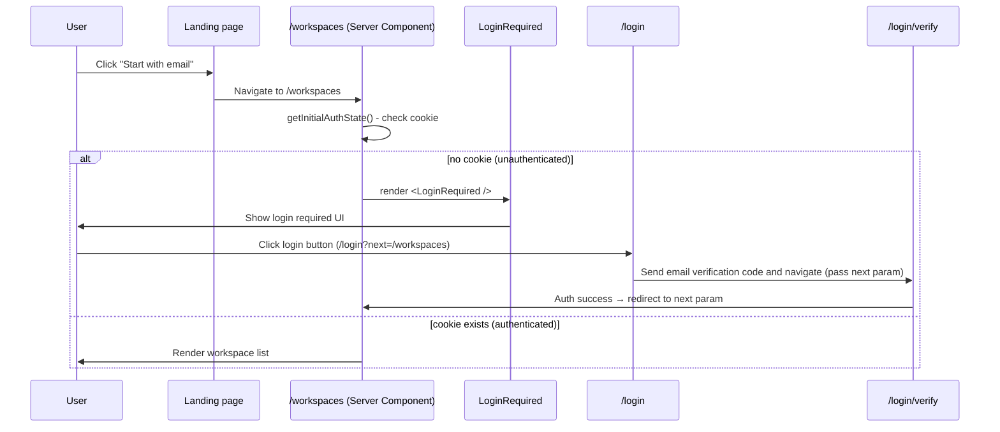
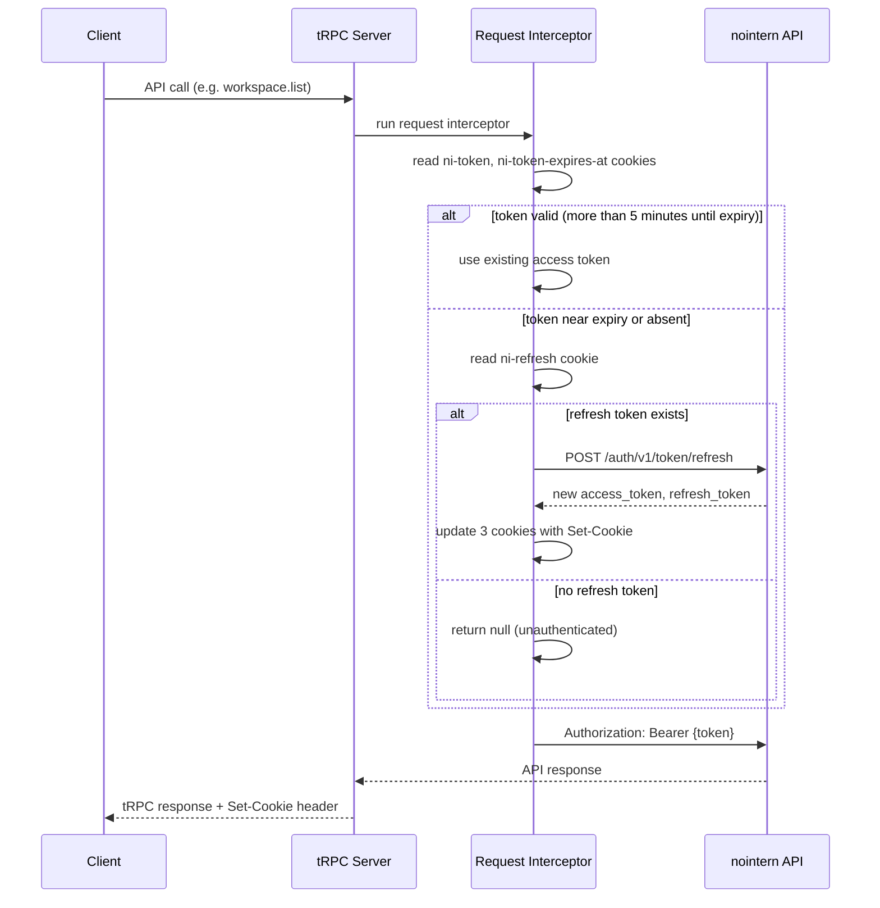

# nointern-web Login Guard Design

## Overview

Access control pattern for pages requiring authentication. Applies azents(web) login guard pattern to nointern-web.

## Authentication Model Differences

| Item | azents (web) | nointern-web |
|------|----------------|-------------|
| Auth method | JWT + `auth.me` endpoint | Stateless Bearer token (cookie) |
| Token storage | encrypted cookie (AES-256-GCM) | httpOnly cookie (plaintext) |
| Token refresh | Request interceptor (proactive) | Request interceptor (proactive) |
| User lookup | `auth.me` tRPC call | no dedicated endpoint |
| UI library | MUI | Mantine v8 |

Because nointern has no `auth.me` endpoint, server-side authentication state is judged by **cookie existence** (`ni-token` or `ni-refresh`).

## Architecture



## Implementation Details

### 1. `getInitialAuthState()` — server-side auth state check

```typescript
// shared/lib/getInitialAuthState.ts
import "server-only";
import { cache } from "react";
import { cookies } from "next/headers";
import { COOKIE_NAMES } from "@/shared/lib/cookies";

type InitialAuthState =
  | { status: "authenticated" }
  | { status: "unauthenticated" };
```

- Judge by existence of `ni-token` or `ni-refresh` cookie.
- Even if only refresh token exists, treat as `authenticated` (interceptor refreshes automatically).
- Use React `cache()` to prevent duplicate calls in same request.
- Use `server-only` import to block inclusion in client bundle.

### 2. `<LoginRequired />` — component shown when unauthenticated

- Mantine-based UI
- Create login link with current path included in `next` query param
- Preserve query params too (`pathname + searchParams`)

### 3. Protected page pattern

```typescript
// app/(app)/workspaces/page.tsx
export default async function Page() {
  const authState = await getInitialAuthState();

  if (authState.status !== "authenticated") {
    return <LoginRequired />;
  }

  return <WorkspacesListPage />;
}
```

### 4. Pass `next` param through login flow

1. `LoginRequired` → `/login?next=/workspaces`
2. `useLoginStep` → `/login/verify?...&next=/workspaces`
3. `useVerifyStep` → redirect to `next` param on auth success (default: `/workspaces`)

## File Structure

```
features/auth/
├── components/
│   ├── LoginRequired.tsx    ← NEW: unauthenticated UI
│   ├── LoginStep.tsx
│   └── VerifyStep.tsx
├── containers/
│   ├── useLoginStep.ts      ← MODIFY: pass next param
│   └── useVerifyStep.ts     ← MODIFY: redirect to next param
├── pages/
│   ├── LoginPage.tsx
│   └── VerifyPage.tsx
├── schemas.ts
└── types.ts

shared/lib/
└── getInitialAuthState.ts   ← NEW: server-side auth check
```

## Token Auto Refresh (Proactive Refresh)

Apply azents(web) pattern: before API call, check whether token is near expiry and refresh automatically.

### Cookie Structure

| Cookie | Purpose | maxAge |
|------|------|--------|
| `ni-token` | Access token | none (session cookie) |
| `ni-refresh` | Refresh token | 30 days |
| `ni-token-expires-at` | Access token expiration time (Unix ms) | none (session cookie) |

### Refresh Flow



### Implementation Files

| File | Role |
|------|------|
| `shared/lib/cookies.ts` | read/write cookies, expiration check, Set-Cookie builder |
| `trpc/context.ts` | Request interceptor, refreshTokenIfNeeded, dual-client pattern |
| `trpc/routers/auth.ts` | Set cookies through resHeaders |

### Key Design Decisions

1. **Dual-client pattern**: Separate `refreshClient` (no interceptor) and `client` (with interceptor) to prevent infinite loop.
2. **Proactive refresh**: Refresh 5 minutes before expiry to minimize 401 errors.
3. **resHeaders pattern**: Set Set-Cookie through tRPC `resHeaders` instead of `cookies()` API (tRPC compatibility).
4. **No encryption needed**: Unlike azents, use only httpOnly cookie without encryption (no COOKIE_SECRET required).

## Future Extensions

- If `auth.me` endpoint is added, `getInitialAuthState` can validate token validity too.
- Apply same pattern to other protected pages (`/workspaces/create`, `/w/[handle]`).
