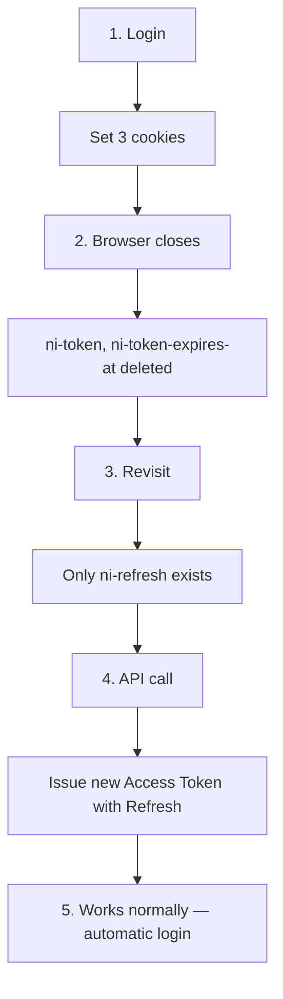
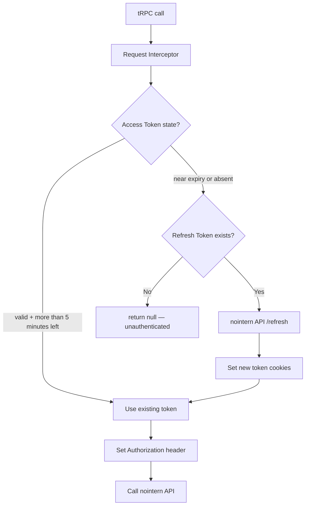
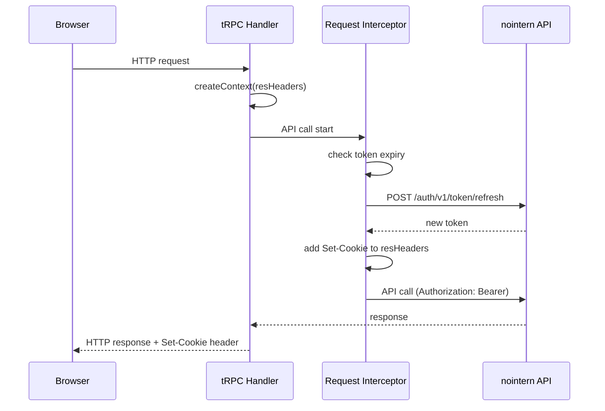
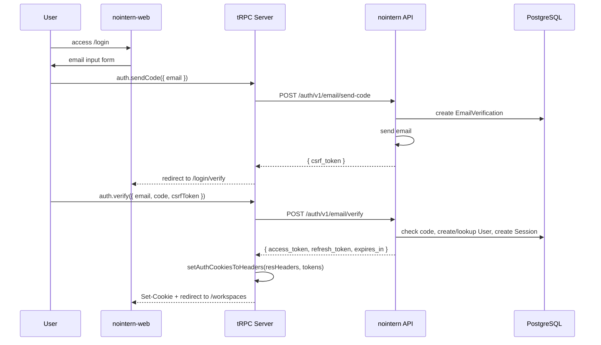
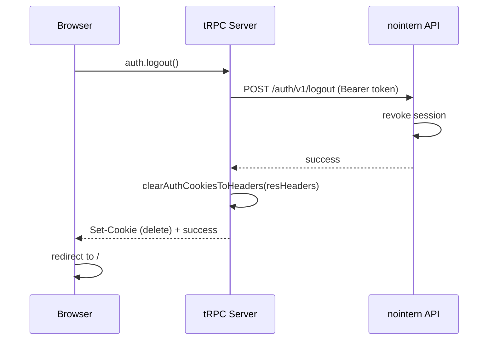
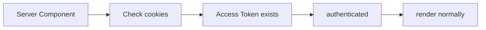
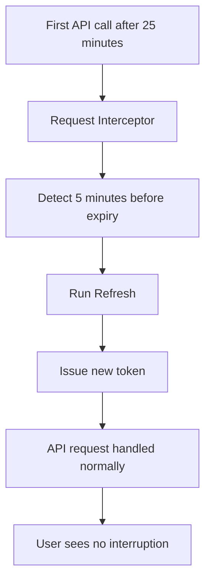
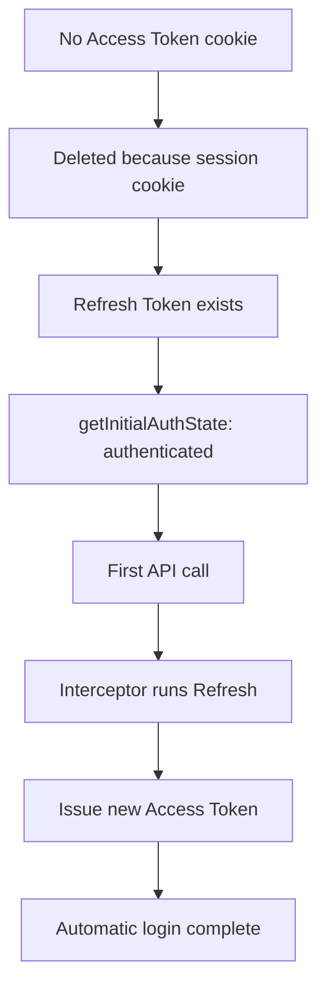
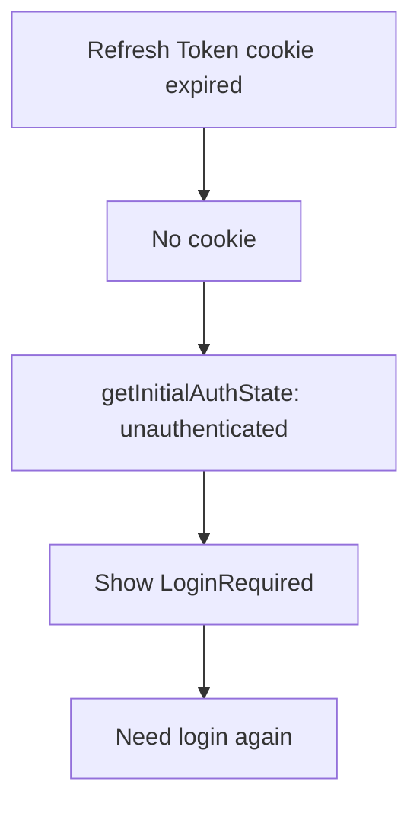

# nointern-web Authentication System

## Architecture Overview

Next.js web serves as **BFF (Backend For Frontend)**. It safely manages tokens between browser and nointern API.

```mermaid
flowchart LR
    Browser -->|tRPC<br/>cookie sent| NextJS[Next.js Server]
    NextJS -->|@azents/public-client<br/>Bearer token| API[nointern API]
```

**Core principles**:
- Tokens are not exposed to browser JavaScript (httpOnly cookies).
- All token management is handled by Next.js server.
- Client only knows auth state, not token itself.
- Use `@azents/public-client` (OpenAPI generated client).

### Differences from azents(web)

| Item | azents (web) | nointern-web |
|------|----------------|-------------|
| Token encryption | AES-256-GCM (COOKIE_SECRET required) | none (httpOnly is sufficient) |
| Auth method | Google/Apple OAuth + email | email verification code only |
| User lookup | `auth.me` tRPC → API call | no dedicated endpoint |
| Auth state judgment | based on `auth.me` response | cookie existence |
| UI library | MUI | Mantine v8 |
| Token refresh | Request interceptor (same pattern) | Request interceptor (same pattern) |

## Token Storage Strategy

### HTTP-only Cookies

| Storage | XSS vulnerable | CSRF vulnerable | Choice |
|--------|----------|-----------|------|
| localStorage | vulnerable | safe | - |
| normal cookie | vulnerable | vulnerable | - |
| HTTP-only cookie | safe | defended by SameSite | **selected** |

### Cookie Structure

| Cookie key | Content | httpOnly | maxAge | Purpose |
|---------|------|----------|--------|------|
| `ni-token` | Access token (plaintext) | O | none (session cookie) | API auth |
| `ni-refresh` | Refresh token (plaintext) | O | 30 days | token refresh |
| `ni-token-expires-at` | expiry time (Unix ms) | O | none (session cookie) | decide refresh timing |

**Session cookie strategy**: Access token and expiry time are set as session cookies and deleted when browser closes. Only refresh token is kept for 30 days, enabling automatic login on revisit.



## JWT Token System

### Access Token

| Item | Content |
|------|------|
| Purpose | all API access (global) |
| Issued when | email verification code succeeds, token refresh |
| Expiration | 30 minutes |

**JWT Payload:**
```json
{
  "sub": "<user_id>",
  "sid": "<session_id>",
  "exp": "<timestamp>",
  "iat": "<timestamp>"
}
```

### Refresh Token

| Item | Content |
|------|------|
| Purpose | Access Token refresh |
| Issued when | auth success, token refresh |
| Expiration | 180 days |

## Token Refresh Mechanism (Proactive Refresh)

### When to Refresh?

**Proactively refresh 5 minutes before expiration**

```mermaid
gantt
    title Access Token lifetime (30 minutes)
    dateFormat X
    axisFormat %s

    section Token state
    Valid period :0, 25
    Refresh point :crit, 25, 30
```



- Refresh after expiration causes API request failure → retry required → worse UX.
- Proactive refresh provides uninterrupted experience.

### Where to Refresh?

**Automatically in tRPC context Request Interceptor**



### Infinite Loop Prevention (Dual-client Pattern)

Refresh request itself is also API call → passes interceptor → tries refresh again?

**Solution**: separate refresh-only client

```mermaid
flowchart LR
    subgraph Main["Main Client (with interceptor)"]
        M[normal API request]
    end
    subgraph Refresh["Refresh Client (without interceptor)"]
        R[/refresh request only]
    end
```

### resHeaders Pattern

In tRPC environment, use tRPC `resHeaders` instead of Next.js `cookies()` API to safely set cookies.



## Auth State Management

### Server-side — getInitialAuthState()

```typescript
// shared/lib/getInitialAuthState.ts
const accessToken = cookieStore.get(COOKIE_NAMES.ACCESS_TOKEN)?.value;
const refreshToken = cookieStore.get(COOKIE_NAMES.REFRESH_TOKEN)?.value;

if (accessToken || refreshToken) {
  return { status: "authenticated" };
}
return { status: "unauthenticated" };
```

- If `ni-token` or `ni-refresh` cookie exists, treat as **authenticated**.
- Even with only refresh token, treat as authenticated (interceptor auto-refreshes).
- Use React `cache()` to prevent duplicate calls within same request.
- Use `server-only` import to block client bundle inclusion.

### Protected Page Pattern

```typescript
// app/(app)/workspaces/page.tsx
export default async function Page() {
  const authState = await getInitialAuthState();

  if (authState.status !== "authenticated") {
    return <LoginRequired />;
  }

  return <WorkspacesListPage />;
}
```

`<LoginRequired />` renders login link including current path as `next` query param.

## Login Flow

### Email Verification Code Method



**CSRF protection**: Pass `csrf_token` from `send-code` response as URL query param and send it together on `verify` request.

### Logout Flow



- interceptor automatically refreshes token before calling logout API.
- Cookies are deleted even if server request fails (fail-safe).

## Session Persistence Scenarios

### Page Refresh



### Keeping Tab Open for Long Time



### Revisit After Browser Close



### Revisit After Long Inactivity (30 days+)



## Security Checklist

### XSS Defense
- [x] Use HTTP-only cookies (JavaScript cannot access)
- [x] Token is not exposed to client JavaScript

### CSRF Defense
- [x] SameSite=Lax cookie setting
- [x] tRPC handles only same-origin requests
- [x] Use CSRF token in email verification flow

### Token Security
- [x] Access Token short lifetime (30 minutes)
- [x] Refresh Token can be force-terminated server-side by session revoke
- [x] Delete Access Token on browser close with session cookie
- [x] Proactive refresh before expiration

### Transport Security
- [x] Secure flag in Production (HTTPS only)

### Security Level Comparison with azents(web)

| Item | azents | nointern-web | Note |
|------|----------|-------------|------|
| Cookie encryption | AES-256-GCM | none | nointern accepts token exposure risk as httpOnly is enough |
| Refresh Token rotation | grace period method | replaced on every refresh | nointern follows server settings |
| COOKIE_SECRET | required | unnecessary | lower operational burden |

## Backend API

### Auth Endpoints (`/auth/v1/`)

| Method | Path | Description | Auth |
|--------|------|------|------|
| POST | `/auth/v1/email/send-code` | send auth code | not required |
| POST | `/auth/v1/email/verify` | verify code + issue JWT | not required |
| POST | `/auth/v1/token/refresh` | refresh token | not required (refresh token body) |
| POST | `/auth/v1/logout` | revoke session | Bearer token |

### Response Format

**verify / refresh response:**
```json
{
  "access_token": "eyJhbG...",
  "refresh_token": "abc123...",
  "expires_in": 1800
}
```

## Code Structure

### Main Files

| File | Role |
|------|------|
| `shared/lib/cookies.ts` | cookie read/write, expiry check, Set-Cookie builder |
| `trpc/context.ts` | API client + request interceptor + proactive refresh |
| `trpc/routers/auth.ts` | auth tRPC router (sendCode, verify, refreshToken, logout) |
| `shared/lib/getInitialAuthState.ts` | server component auth state lookup |
| `trpc/api-error.ts` | API error utility (HTTP → tRPC error conversion) |
| `features/auth/` | login UI components and containers |

### Cookie Utilities (cookies.ts)

```typescript
// read
getAccessToken(): Promise<StoredAccessToken | null>
getRefreshToken(): Promise<string | null>

// expiry check
isTokenExpiringSoon(expiresAt: number): boolean  // true if within 5 minutes

// cookie setting via resHeaders
setAuthCookiesToHeaders(resHeaders: Headers, tokens: AuthTokens): void
clearAuthCookiesToHeaders(resHeaders: Headers): void
```

### tRPC Context (context.ts)

```typescript
// Request interceptor: runs before every API call
client.interceptors.request.use(async (request) => {
  const accessToken = await refreshTokenIfNeeded(refreshClient, resHeaders);
  if (accessToken) {
    request.headers.set("Authorization", `Bearer ${accessToken}`);
  }
  return request;
});
```

### tRPC Auth Router (auth.ts)

```typescript
// sendCode: send email verification code
// verify: verify code + set cookies (setAuthCookiesToHeaders)
// refreshToken: manual token refresh (usually interceptor handles automatically)
// logout: revoke server session + delete cookies (clearAuthCookiesToHeaders)
```

## Environment Variables

| Variable | Required | Description |
|------|------|------|
| `PUBLIC_API_URL` | O | nointern API server URL (default: `http://localhost:8010`) |
| `NODE_ENV` | O | `development` / `production` / `test` |

> Unlike azents(web), `COOKIE_SECRET` is unnecessary (no encryption used).

## Related Documents

- [Login guard design](./auth-guard.md) — protected page access control pattern
- [Unified email authentication design](../nointern/email-login-onboarding.md) — backend API and full auth flow
- [azents web auth](../web/auth.md) — reference implementation (encrypted cookies + OAuth)
