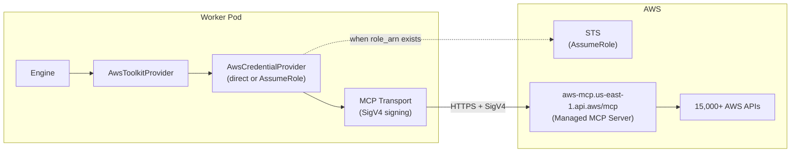

# AWS Toolkit Design

> Prior example: [GCP Toolkit Design](gcp-observability-toolkit.md)
>
> References:
> - [AWS MCP Server official docs](https://docs.aws.amazon.com/aws-mcp/latest/userguide/what-is-mcp-server.html)
> - [AWS MCP Server setup guide](https://docs.aws.amazon.com/aws-mcp/latest/userguide/getting-started-aws-mcp-server.html)
> - [MCP Server tool descriptions](https://docs.aws.amazon.com/aws-mcp/latest/userguide/understanding-mcp-server-tools.html)
> - [mcp-proxy-for-aws (GitHub)](https://github.com/aws/mcp-proxy-for-aws)
> - [awslabs/mcp (68 official OSS servers)](https://github.com/awslabs/mcp)

## Overview

AWS Toolkit implementation that directly connects over HTTPS to AWS Managed MCP Server. It provides Observability, Cost, and Infrastructure as single Toolkit by accessing 15,000+ AWS APIs.

**User scenarios:**
1. "Show recent 1-hour error logs" → `aws___call_aws` (CloudWatch Logs `FilterLogEvents`)
2. "Analyze this month's cost" → `aws___call_aws` (Cost Explorer `GetCostAndUsage`)
3. "Check EKS cluster status" → `aws___call_aws` (EKS `DescribeCluster`)
4. "Show EC2 instance list" → `aws___call_aws` (EC2 `DescribeInstances`)
5. "Tell me how to use this API" → `aws___search_documentation` + `aws___suggest_aws_commands`

## Discussion Points and Decisions

### 1. MCP server selection

**Servers investigated:**

| Server | Provider | Coverage | Transport | Auth |
|------|--------|---------|-----------|------|
| AWS Managed MCP Server | AWS (official, preview) | 15,000+ APIs (all) | Streamable HTTP | SigV4 |
| `awslabs.cloudwatch-mcp-server` | AWS (official OSS) | CloudWatch only (11 tools) | stdio | boto3 |
| `awslabs.billing-cost-management-mcp-server` | AWS (official OSS) | Cost only (15+ tools) | stdio | boto3 |
| `awslabs.eks-mcp-server` | AWS (official OSS) | EKS only | stdio | boto3 |
| `awslabs.cloudtrail-mcp-server` | AWS (official OSS) | CloudTrail only (5 tools) | stdio | boto3 |
| other 68 awslabs servers | AWS (official OSS) | service-specific | stdio | boto3 |

**Decision: AWS Managed MCP Server**

- Covers 15,000+ APIs with single endpoint — no service-specific servers needed.
- 8 tools: `aws___call_aws` (API execution) + documentation search + API guide.
- **Zero infra change** like GCP (handles SigV4 signing in Transport layer).
- `aws___search_documentation` + `aws___suggest_aws_commands` tools help LLM learn API syntax.

**Rejected alternatives:**

- **awslabs stdio servers (cloudwatch, billing, etc.)**: service-specific tools are rich, but stdio-based and require sidecar. Infra complexity increases greatly, and Managed Server generically covers same API, so cost is excessive compared with additional value. **Do not use.**
- **`mcp-proxy-for-aws` sidecar**: runs stdio→HTTP bridge as sidecar. Possible, but if SigV4 signing is handled directly in Transport layer, implementation works without sidecar.

### 2. Authentication method

**Problem:** AWS MCP Server uses SigV4 auth. Unlike GCP Bearer token, each request requires signature including request body.

**Options:**
- A) `mcp-proxy-for-aws` sidecar (delegates SigV4 signing)
- B) Direct SigV4 signing in Transport layer (`botocore.auth.SigV4Auth`)
- C) Access Key → STS `AssumeRole` → temporary credential → Bearer-like usage (impossible — SigV4 required)

**Decision: B — Direct SigV4 signing in Transport layer**

Rationale:
- **Zero infra change** — direct HTTPS connection from Worker Pod without sidecar (same as GCP).
- `botocore.auth.SigV4Auth` provides standard signing logic — no direct implementation needed.
- Implement as `httpx.Auth` subclass and integrate naturally into existing MCP transport.
- `botocore` is boto3 dependency, so likely already installed.

Implementation:
```python
class AwsSigV4Auth(httpx.Auth):
    """Add AWS SigV4 signature to httpx request."""

    def __init__(self, access_key: str, secret_key: str, region: str, service: str):
        self._credentials = Credentials(access_key, secret_key)
        self._signer = BotoSigV4Auth(self._credentials, service, region)

    def auth_flow(self, request: httpx.Request) -> Generator:
        # Convert httpx Request → AWSRequest
        aws_request = AWSRequest(
            method=request.method,
            url=str(request.url),
            data=request.content,
            headers=dict(request.headers),
        )
        self._signer.add_auth(aws_request)
        # Copy signed headers to httpx request
        for key, value in aws_request.headers.items():
            request.headers[key] = value
        yield request
```

**mcp_transport.py change:**
Add `auth: httpx.Auth | None = None` parameter to `_mcp_session()`, `list_tools()`, `call_tool()`. Pass `auth=auth` when creating httpx.AsyncClient.

### 3. Credential storage + Role Assume

**Support two authentication methods:**

#### A) Direct Access Key usage (default)

Authenticate directly with IAM User Access Key. Simple and intuitive.

#### B) Access Key + Role Assume

Call STS `AssumeRole` with Access Key, obtain temporary credentials, then use them. Useful for cross-account access or least-privilege principle.

Flow:
```
Access Key (stored credential)
  → STS AssumeRole(role_arn, session_name, duration)
  → temporary Access Key + Secret Key + Session Token (valid 1 hour)
  → used for SigV4 signing (auto refresh)
```

**Config + Secrets model:**

```python
class AwsSecrets(BaseModel):
    """AWS credentials (encrypted storage)."""

    access_key_id: str
    secret_access_key: str

class AwsToolkitConfig(BaseModel):
    """AWS Toolkit settings."""

    region: str = Field(default="us-east-1", ...)
    role_arn: str | None = Field(
        default=None,
        description="IAM Role ARN to Assume (direct Access Key if absent)",
    )
    external_id: str | None = Field(
        default=None,
        description="ExternalId for AssumeRole (used in cross-account)",
    )
    allow_write: bool = Field(default=False, ...)
    timeout: float = Field(default=30.0, ...)
```

- If `role_arn` is None, use Access Key directly (method A).
- If `role_arn` exists, use temporary credential after STS AssumeRole (method B).
- `external_id` is extra security for cross-account assume.
- Store encrypted in encrypted_credentials (same pattern as GCP SA Key).

**AwsCredentialProvider implementation:**

```python
class AwsCredentialProvider:
    """AWS credential management. Direct Access Key or AssumeRole."""

    def __init__(
        self,
        access_key_id: str,
        secret_access_key: str,
        region: str,
        role_arn: str | None = None,
        external_id: str | None = None,
    ) -> None:
        self._base_credentials = Credentials(access_key_id, secret_access_key)
        self._region = region
        self._role_arn = role_arn
        self._external_id = external_id
        self._assumed_credentials: Credentials | None = None
        self._assumed_expiry: datetime | None = None
        self._lock = asyncio.Lock()

    async def get_credentials(self) -> Credentials:
        """Return valid credentials."""
        if self._role_arn is None:
            return self._base_credentials

        # AssumeRole: auto refresh 5 minutes before expiry
        if self._is_assumed_valid():
            return self._assumed_credentials
        async with self._lock:
            if self._is_assumed_valid():
                return self._assumed_credentials
            return await self._assume_role()

    async def _assume_role(self) -> Credentials:
        """Call STS AssumeRole and obtain temporary credentials."""
        async with httpx.AsyncClient(timeout=30.0) as client:
            # STS API call (SigV4 signed)
            ...
        return assumed_credentials
```

**Use cases:**

| Scenario | Setting |
|---------|------|
| single-account monitoring | Access Key only (no role_arn) |
| Cross-account monitoring | Access Key + role_arn + external_id |
| least privilege | Access Key (STS only) + role_arn (actual permissions) |

### 4. Region selection

**Decision: user sets default region, agent can specify another region if needed**

Set default region through `--metadata AWS_REGION` parameter of AWS Managed MCP. Agent can specify different region when calling `aws___call_aws`.

### 5. Read/Write permission separation

**Difference from GCP:** GCP filters by `readOnlyHint` at tool level. AWS Managed MCP separates at IAM level.

| IAM Action | Description |
|---|---|
| `aws-mcp:CallReadOnlyTool` | read-only tools (documentation, list_regions, etc.) |
| `aws-mcp:CallReadWriteTool` | `aws___call_aws` tool (actual AWS API call) |

**Decision: `allow_write` flag in Config + IAM guide**

- `allow_write: false` (default): do not filter out `aws___call_aws` tool? guide to remove `aws-mcp:CallReadWriteTool` from IAM policy
- `allow_write: true`: expose all tools
- Actual blocking is performed by IAM policy (if agent attempts write, IAM denies)

Also apply tool-level filtering as additional defense:
- If `allow_write: false`, exclude `aws___call_aws` tool in `create_tools()`.
- Agent cannot even see tool capable of calling write API.

## Architecture

### Full Flow



**Core: no sidecar.** Worker Pod directly connects to AWS Managed MCP via HTTPS + SigV4.

### Comparison with GCP Toolkit

| Item | GCP | AWS |
|------|-----|-----|
| MCP server | separate URL per service (6) | single URL |
| Tool count | sum by service (65+) | 8 (including generic `call_aws`) |
| Auth | Bearer token (JWT exchange) | SigV4 (sign every request) |
| Read/Write separation | `readOnlyHint` tool filtering | IAM action + tool exclusion |
| Multiple connections | parallel `list_tools` per service | single connection |
| Infra change | none | none (Transport change only) |

## Data Model

### Config Model

```python
class AwsToolkitConfig(BaseModel):
    """AWS Toolkit settings."""

    region: str = Field(
        default="us-east-1",
        description="Default AWS region",
        pattern=r"^[a-z]{2}-[a-z]+-\d$",
    )
    allow_write: bool = Field(
        default=False,
        description="Allow write operations (aws___call_aws)",
    )
    timeout: float = Field(
        default=30.0,
        description="MCP tool call timeout (seconds)",
        ge=1.0,
        le=300.0,
    )
```

### Credential Model

```python
class AwsSecrets(BaseModel):
    """AWS IAM credentials (encrypted storage)."""

    access_key_id: str
    secret_access_key: str
```

### DB Storage

| Field | Content |
|------|------|
| `toolkit_type` | `"aws"` |
| `config` (JSONB) | `{"region": "ap-northeast-2", "allow_write": false, "timeout": 30}` |
| `encrypted_credentials` | encrypted `{"access_key_id": "AKIA...", "secret_access_key": "..."}` |

## Provided Tools (8)

Tools provided by AWS Managed MCP Server:

| Tool | R/W | Description |
|------|:---:|------|
| `aws___search_documentation` | R | search AWS docs, API reference, best practices |
| `aws___read_documentation` | R | convert AWS docs to markdown and read |
| `aws___retrieve_agent_sop` | R | step-by-step guide for common AWS tasks |
| `aws___recommend` | R | recommend related AWS docs |
| `aws___list_regions` | R | list AWS regions |
| `aws___get_regional_availability` | R | regional service/feature availability |
| `aws___suggest_aws_commands` | R | AWS API syntax guide (including new APIs) |
| `aws___call_aws` | **W** | **execute 15,000+ AWS APIs** (core tool) |

If `allow_write: false`, expose only 7 read-only tools excluding `aws___call_aws`.

### Tool Usage Flow (Agent Perspective)

```
User: "Show recent error logs"

1. aws___search_documentation("CloudWatch Logs FilterLogEvents API")
   → confirm API usage

2. aws___suggest_aws_commands("filter log events in CloudWatch Logs")
   → construct exact API parameters

3. aws___call_aws({
     "service": "logs",
     "operation": "FilterLogEvents",
     "parameters": {
       "logGroupName": "/aws/ecs/my-app",
       "filterPattern": "ERROR",
       "startTime": 1711411200000
     }
   })
   → return log result
```

## Provider Implementation

### AwsSigV4Auth (httpx integration)

```python
class AwsSigV4Auth(httpx.Auth):
    """Add AWS SigV4 signature to httpx request."""

    def __init__(
        self,
        access_key_id: str,
        secret_access_key: str,
        region: str,
        service: str = "aws-mcp",
    ) -> None:
        self._credentials = Credentials(access_key_id, secret_access_key)
        self._service = service
        self._region = region

    def auth_flow(self, request: httpx.Request) -> Generator[httpx.Request, httpx.Response, None]:
        aws_request = AWSRequest(
            method=request.method,
            url=str(request.url),
            data=request.content,
            headers=dict(request.headers),
        )
        BotoSigV4Auth(self._credentials, self._service, self._region).add_auth(aws_request)
        for key, value in aws_request.headers.items():
            request.headers[key] = value
        yield request
```

### mcp_transport.py Change

```python
async def list_tools(
    server_url: str,
    headers: dict[str, str],
    timeout: float,
    *,
    proxy_url: str | None = None,
    auth: httpx.Auth | None = None,  # added
) -> tuple[list[McpBaseTool], bool]:
```

Add same `auth` parameter to `_mcp_session`, `call_tool`, `test_mcp_transport`. Pass `auth=auth` when creating httpx.AsyncClient.

### AwsToolkitProvider

```python
class AwsToolkitProvider(ToolkitProvider[AwsToolkitConfig]):

    slug: ClassVar[str] = "aws"
    name: ClassVar[str] = "AWS"
    description: ClassVar[str] = (
        "Amazon Web Services — CloudWatch, Cost Explorer, EC2, ECS, "
        "EKS, Lambda, S3, RDS, and 15,000+ more APIs"
    )
    system_prompt: ClassVar[str] = dedent("""\
        You have access to AWS tools via the AWS MCP Server.
        Use aws___search_documentation to find API usage.
        Use aws___suggest_aws_commands to get correct API syntax.
        Use aws___call_aws to execute AWS API calls.
        The default region is configured in the toolkit settings.""")
    config_model: ClassVar[type[BaseModel]] = AwsToolkitConfig
```

### resolve flow

```python
async def resolve(self, config, context) -> Toolkit[AwsToolkitConfig]:
    secrets = AwsSecrets.model_validate_json(context.credentials_json)

    # Credential provider (direct or AssumeRole)
    credential_provider = AwsCredentialProvider(
        access_key_id=secrets.access_key_id,
        secret_access_key=secrets.secret_access_key,
        region=config.region,
        role_arn=config.role_arn,
        external_id=config.external_id,
    )

    return AwsToolkit(
        credential_provider=credential_provider,
        default_region=config.region,
        allow_write=config.allow_write,
        timeout=config.timeout,
        proxy_url=context.mcp_proxy_url,
    )
```

**SigV4 Auth creation (at create_tools time):**
```python
# inside AwsToolkit.create_tools()
credentials = await self._credential_provider.get_credentials()
sigv4_auth = AwsSigV4Auth(
    access_key_id=credentials.access_key,
    secret_access_key=credentials.secret_key,
    session_token=credentials.token,  # exists for AssumeRole
    region="us-east-1",
    service="aws-mcp",
)
```

### create_tools flow

```python
async def create_tools(self, config, context) -> list[FunctionTool]:
    endpoint = "https://aws-mcp.us-east-1.api.aws/mcp"
    headers = {}  # SigV4 auth automatically adds headers

    mcp_tools, use_streamable_http = await mcp_list_tools(
        endpoint, headers, self._timeout,
        proxy_url=self._proxy_url,
        auth=self._sigv4_auth,
    )

    tools = []
    for tool in mcp_tools:
        # exclude aws___call_aws if allow_write is false
        if not self._allow_write and tool.name == "aws___call_aws":
            continue
        tools.append(wrap_mcp_tool(..., auth=self._sigv4_auth))
    return tools
```

### Connection Test

```python
async def test_connection(self, config, credentials_json, *, proxy_url=None):
    secrets = AwsSecrets.model_validate_json(credentials_json)
    auth = AwsSigV4Auth(
        secrets.access_key_id, secrets.secret_access_key,
        "us-east-1", "aws-mcp",
    )
    endpoint = "https://aws-mcp.us-east-1.api.aws/mcp"
    try:
        tools, _ = await mcp_list_tools(endpoint, {}, 10.0, auth=auth)
        return TestConnectionResult(
            success=True,
            message=f"Connected. {len(tools)} tools available.",
        )
    except Exception as exc:
        net_msg = extract_network_error(exc)
        if net_msg is None:
            raise
        return TestConnectionResult(success=False, message=net_msg)
```

## Frontend (UI/UX)

### AwsConfigFields Component

```
┌─────────────────────────────────────────────────┐
│ AWS Settings                                    │
│                                                 │
│ Region *                                        │
│ ┌─────────────────────────────────────────────┐ │
│ │ ap-northeast-2 (Seoul)              ▼       │ │
│ └─────────────────────────────────────────────┘ │
│                                                 │
│ Access Key ID *                                 │
│ ┌─────────────────────────────────────────────┐ │
│ │ AKIA...                                     │ │
│ └─────────────────────────────────────────────┘ │
│                                                 │
│ Secret Access Key *                             │
│ ┌─────────────────────────────────────────────┐ │
│ │ ••••••••••••••••••••                        │ │
│ └─────────────────────────────────────────────┘ │
│                                                 │
│ ▼ Role Assume (optional)                       │
│   Role ARN                                      │
│   ┌───────────────────────────────────────────┐ │
│   │ arn:aws:iam::123456789012:role/MyRole     │ │
│   └───────────────────────────────────────────┘ │
│   ⓘ If set, this Role is assumed with Access   │
│     Key and APIs are called with temporary      │
│     credentials. Useful for cross-account       │
│     access.                                    │
│                                                 │
│   External ID (optional)                        │
│   ┌───────────────────────────────────────────┐ │
│   │                                           │ │
│   └───────────────────────────────────────────┘ │
│   ⓘ Extra security for cross-account AssumeRole│
│                                                 │
│ ☐ Allow write operations                       │
│   ⚠ When enabled, agent can create, modify,     │
│     or delete AWS resources. Configure least    │
│     privilege with IAM policy.                  │
│                                                 │
│ ⓘ Required IAM permissions:                    │
│   • aws-mcp:InvokeMcp (required)               │
│   • aws-mcp:CallReadOnlyTool (required)        │
│   • aws-mcp:CallReadWriteTool (when write on)  │
│   + service-specific permissions required for   │
│     actual AWS APIs                            │
│     (e.g. cloudwatch:GetMetricData,             │
│      ce:GetCostAndUsage, ec2:DescribeInstances)│
│                                                 │
│ ┌──────────────────┐                            │
│ │ Test Connection  │                            │
│ └──────────────────┘                            │
│ ✅ Connected. 8 tools available.                │
│                                                 │
│ ▼ Advanced Settings                             │
│   Timeout: [30] seconds                         │
└─────────────────────────────────────────────────┘
```

### IAM Policy Guide

Dynamically provide IAM policy example depending on selection:

**Read-only (default):**
```json
{
  "Version": "2012-10-17",
  "Statement": [
    {
      "Effect": "Allow",
      "Action": [
        "aws-mcp:InvokeMcp",
        "aws-mcp:CallReadOnlyTool"
      ],
      "Resource": "*"
    },
    {
      "Effect": "Allow",
      "Action": [
        "cloudwatch:GetMetricData",
        "cloudwatch:DescribeAlarms",
        "logs:FilterLogEvents",
        "ce:GetCostAndUsage",
        "ec2:Describe*",
        "ecs:Describe*",
        "eks:Describe*"
      ],
      "Resource": "*"
    }
  ]
}
```

**Read+Write:**
Add `aws-mcp:CallReadWriteTool` above + necessary service-specific write permissions.

## Infrastructure

### Changes

| Item | Change |
|------|------|
| Pod spec | none |
| ConfigMap/Secret | none |
| Docker image | none |
| NetworkPolicy | none (`*.api.aws` is public IP) |
| **mcp_transport.py** | add `auth: httpx.Auth \| None` parameter |

**Only code change:** add `auth` parameter to `mcp_transport.py` (can also be used later by GCP toolkit).

### Dependency

`botocore` — for SigV4 signing. It is transitive dependency of boto3, so likely already installed. Add if absent.

## Feasibility Verification

| Item | Status | Note |
|------|------|------|
| Managed MCP Server availability | ✅ | preview, free |
| Direct SigV4 signing | ✅ | standard `botocore.auth.SigV4Auth` |
| httpx Auth integration | ✅ | `httpx.Auth` subclass |
| mcp_transport change | ✅ | add `auth` parameter (backward-compatible) |
| Existing API compatibility | ✅ | Toolkit CRUD unchanged |
| Infra change | ✅ | none |
| Network security | ✅ | `*.api.aws` is public IP |

### Risks

| Risk | Impact | Mitigation |
|--------|------|------|
| Managed MCP Server preview discontinued | entire tool unavailable | wait for preview release, or manually configure as generic MCP |
| SigV4 signing complexity | implementation bug | use botocore standard library, no direct implementation |
| `aws___call_aws` generality | LLM may not know API syntax | `search_documentation` + `suggest_commands` tools guide |
| Access Key leak | AWS resource access | Fernet encryption, least privilege IAM, read-only default |

## Implementation Plan

### Phase 1: mcp_transport.py — add auth parameter

1. Add `auth: httpx.Auth | None = None` to `_mcp_session()`.
2. Add same to `list_tools()`, `call_tool()`, `test_mcp_transport()`.
3. Pass `auth=auth` when creating httpx.AsyncClient.
4. Existing call sites unaffected (default None).

### Phase 2: Backend — Provider + SigV4 Auth

1. Add `ToolkitType.AWS = "aws"`.
2. Define `AwsToolkitConfig`, `AwsSecrets` models.
3. Implement `AwsSigV4Auth(httpx.Auth)` (using botocore).
4. Implement `AwsToolkit`, `AwsToolkitProvider`.
5. Register in `get_toolkit_registry()`.
6. Verify/add `botocore` dependency.

### Phase 3: Frontend — AwsConfigFields

1. `AwsConfigFields.tsx` (Region select, Access Key input, write toggle, IAM guide).
2. Add `aws` branch to `ToolkitForm.tsx`.

## Alternatives Considered

### 1. awslabs stdio servers (cloudwatch, billing, eks, etc.)

Run service-specific stdio servers as mcp-proxy sidecar. Rich tools such as CloudWatch (11 tools) + Cost (15+ tools) + EKS.
Rejected: stdio-based, so sidecar required. Managed Server covers same APIs for much less infra complexity. **Do not use.**

### 2. `mcp-proxy-for-aws` sidecar

Run AWS-provided stdio→HTTP bridge as sidecar.
Rejected: sidecar required = infra change. Avoidable by direct SigV4 handling in Transport layer.

### 3. Community server (`alexei-led/aws-mcp-server`)

Community server wrapping AWS CLI. Executes CLI commands with `aws_cli_pipeline` tool.
Rejected: official Managed Server provides same function more safely. CLI parsing dependency unnecessary.
