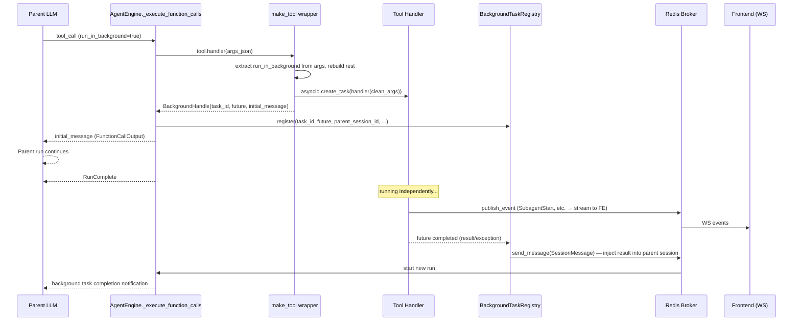

# Background Tool Call Design

## Overview

Support a **general background tool call mechanism** at engine level so tool execution can be separated from blocking flow, allowing parent agent to continue other work without waiting for result.

### User scenarios

1. Agent delegates long-running task such as “analyze this repo thoroughly” to subagent, and can immediately respond when user asks other questions.
2. Agent launches build/test command through shell__execute_code in background and prepares context with other tools until completion notification arrives.
3. User says “this looks long, start it in background and do something else first”, and LLM chooses `run_in_background=true`.

### Core principles

- **General framework**: usable by any “background-capable tool”, not subagent-specific.
- **Return-type-based dispatch**: if Handler returns `BackgroundHandle`, engine treats it as background. No separate spec-level flag needed.
- **LLM discovery through schema**: if Tool `input_schema` has `run_in_background` property, LLM can call it in background.
- **Handler unchanged**: most tools can be enabled through `make_tool` ergonomics helper (`supports_background=True`) without handler code changes.
- **Parent independence**: background task survives even after parent run ends.

### References

- GitHub Issue: [#2559](https://github.com/azents/azents/issues/2559)
- Discussion: [#2591](https://github.com/azents/azents/discussions/2591)
- Discussion record: [`../adr/0010-background-tool-call.md`](../adr/0010-background-tool-call.md)

---

## Architecture

### Execution flow



### Layer responsibilities

| Layer | Responsibility |
|--------|------|
| Tool Handler | tool logic — default path does not need to know `run_in_background` |
| `make_tool` (ergonomics) | when `supports_background=True`, inject `run_in_background` into schema + wrap handler to return BackgroundHandle |
| Engine | if return value is `BackgroundHandle`, register with Registry + return initial_message + connect completion callback |
| `BackgroundTaskRegistry` | task tracking, cancel, per-session indexing, shutdown cleanup |
| Broker | result injection path (reuse existing `send_message`) |

**No spec-level flag**: `FunctionToolSpec` has no background-related field. Runtime dispatch by return type and LLM discovery through input_schema are sufficient. (Avoid duplicate representation.)

---

## Data Model

### `BackgroundHandle`

```python
# engine/types.py
@dataclasses.dataclass(frozen=True)
class BackgroundHandle:
    """Return type of background-running tool.

    If Tool handler returns this type, engine handles it as backgrounding.
    """

    task_id: str
    """Unique identifier within Registry (uuid7)."""

    future: asyncio.Task[str | FunctionToolResult]
    """Actually running task. Result is injected through broker on completion."""

    initial_message: str
    """Tool result string immediately returned to LLM (JSON recommended)."""
```

### No change to `FunctionToolSpec`

Do not add background-related field to `FunctionToolSpec`. Background support is represented by:
- **Runtime dispatch**: by handler return type (`BackgroundHandle` or not)
- **LLM discovery**: by presence of `run_in_background` property in `input_schema`

These two representations are enough; spec-level flag would be redundant.

### `BackgroundTask` (Registry entry)

```python
# engine/background.py (new)
@dataclasses.dataclass
class BackgroundTask:
    task_id: str
    parent_session_id: str
    tool_name: str
    future: asyncio.Task[str | FunctionToolResult]
    started_at: datetime
```

### Extend Handler return type

```python
# engine/types.py
FunctionToolHandler: TypeAlias = Callable[
    [str],
    Awaitable[str | FunctionToolResult | BackgroundHandle],
]
```

Existing handlers returned only `str | FunctionToolResult`, so this is backward compatible.

---

## Core Implementation (pseudocode)

### Extend `make_tool` (ergonomics only)

`make_tool` is an **optional ergonomics helper**. When `supports_background=True` is passed, it automatically injects schema + wraps handler. This parameter is not stored in `FunctionToolSpec`; it is used only inside make_tool.

```python
# engine/make_tool.py
def make_tool(
    handler: RawHandler,
    *,
    name: str,
    description: str,
    input_model: type[BaseModel],
    supports_background: bool = False,  # make_tool parameter (not stored in FunctionToolSpec)
) -> FunctionTool:
    """Tool factory.

    When supports_background=True, inject run_in_background parameter into schema
    and wrap handler so it can return BackgroundHandle.
    Even without this option, if handler directly returns BackgroundHandle,
    engine handles it identically.
    """
    schema = input_model.model_json_schema()
    if supports_background:
        schema.setdefault("properties", {})["run_in_background"] = {
            "type": "boolean",
            "default": False,
            "description": (
                "If true, run in background. Returns immediately with task_id. "
                "Result delivered as a new conversation turn when task completes."
            ),
        }

    spec = FunctionToolSpec(
        name=name,
        description=description,
        input_schema=schema,
    )

    if supports_background:
        wrapped = _wrap_with_background(handler, input_model)
    else:
        wrapped = _wrap_standard(handler, input_model)

    return FunctionTool(spec=spec, handler=wrapped)


def _wrap_with_background(
    raw_handler: RawHandler,
    input_model: type[BaseModel],
) -> FunctionToolHandler:
    """Wrap Handler as background-capable.

    Extract run_in_background from args:
    - True: run with asyncio.create_task and immediately return BackgroundHandle
    - False: normal synchronous execution (blocking)
    """
    async def wrapped(args_json: str) -> str | FunctionToolResult | BackgroundHandle:
        raw = json.loads(args_json)
        run_in_background = bool(raw.pop("run_in_background", False))
        clean_args = json.dumps(raw, ensure_ascii=False)
        if run_in_background:
            task_id = uuid7().hex
            future: asyncio.Task[str | FunctionToolResult] = asyncio.create_task(
                raw_handler(clean_args),
                name=f"bg_tool_{task_id}",
            )
            initial = json.dumps(
                {
                    "task_id": task_id,
                    "status": "running",
                    "note": (
                        "Running in background. You will receive a notification "
                        "when it completes. Use task_status to check progress or "
                        "task_stop to cancel."
                    ),
                },
                ensure_ascii=False,
            )
            return BackgroundHandle(
                task_id=task_id,
                future=future,
                initial_message=initial,
            )
        return await raw_handler(clean_args)

    return wrapped
```

### Engine: recognize `BackgroundHandle`

```python
# engine/engine.py — branch result inside _call_tool_handler
if isinstance(raw_result, BackgroundHandle):
    ctx.background_registry.register(
        task_id=raw_result.task_id,
        future=raw_result.future,
        parent_session_id=request.session_id,
        tool_name=fc_item.tool_call.name,
        on_complete=ctx.inject_background_result,  # broker.send_message wrapper
    )
    return _ToolExecResult(text=raw_result.initial_message)
```

(Add one branch above current `_call_tool_handler` `isinstance(raw_result, FunctionToolResult)` check.)

Inject `background_registry` and `inject_background_result` into `RunContext` so Engine can access them. Both are worker-level objects but needed at tool execution time, so pass through context.

### `BackgroundTaskRegistry`

```python
# engine/background.py (new file)
class BackgroundTaskRegistry:
    """Track background tasks by session."""

    def __init__(self) -> None:
        self._tasks: dict[str, BackgroundTask] = {}
        self._by_session: dict[str, set[str]] = {}

    def register(
        self,
        *,
        task_id: str,
        future: asyncio.Task[...],
        parent_session_id: str,
        tool_name: str,
        on_complete: Callable[[BackgroundTask], Awaitable[None]],
    ) -> None:
        task = BackgroundTask(
            task_id=task_id,
            parent_session_id=parent_session_id,
            tool_name=tool_name,
            future=future,
            started_at=datetime.now(UTC),
        )
        self._tasks[task_id] = task
        self._by_session.setdefault(parent_session_id, set()).add(task_id)
        future.add_done_callback(
            lambda _: asyncio.create_task(self._on_done(task, on_complete))
        )

    async def _on_done(
        self,
        task: BackgroundTask,
        on_complete: Callable[[BackgroundTask], Awaitable[None]],
    ) -> None:
        try:
            await on_complete(task)
        finally:
            self._tasks.pop(task.task_id, None)
            session_tasks = self._by_session.get(task.parent_session_id)
            if session_tasks is not None:
                session_tasks.discard(task.task_id)
                if not session_tasks:
                    self._by_session.pop(task.parent_session_id, None)

    def get(self, task_id: str) -> BackgroundTask | None:
        return self._tasks.get(task_id)

    def list_for_session(self, session_id: str) -> list[BackgroundTask]:
        return [self._tasks[tid] for tid in self._by_session.get(session_id, set())]

    async def cancel(self, task_id: str) -> bool:
        task = self._tasks.get(task_id)
        if task is None:
            return False
        task.future.cancel()
        return True

    async def cancel_all_for_session(self, session_id: str) -> None:
        for task_id in list(self._by_session.get(session_id, set())):
            await self.cancel(task_id)
```

### Result injection (`SessionHost.inject_background_result`)

```python
# worker/engine.py
async def inject_background_result(self, task: BackgroundTask) -> None:
    """Background task completion → inject new SessionMessage into parent session."""
    try:
        raw = task.future.result()
    except asyncio.CancelledError:
        return  # no separate notification needed if user/engine stopped it (cancel path handles it)
    except Exception as exc:
        text = (
            f"[Background task '{task.tool_name}' failed]\n"
            f"Task ID: {task.task_id}\n"
            f"Error: {exc}"
        )
    else:
        if isinstance(raw, FunctionToolResult):
            text = raw.content
        else:
            text = str(raw)
        text = (
            f"[Background task '{task.tool_name}' completed]\n"
            f"Task ID: {task.task_id}\n\n"
            f"{text}"
        )

    await self.broker.send_message(
        SessionMessage(
            agent_id=...,  # need to store agent_id in registry
            session_id=task.parent_session_id,
            messages=[
                InputMessage(
                    text=text,
                    user_id=None,
                    headers=[("x-background-task-id", task.task_id)],
                    metadata={"source": "background_task"},
                    attachments=[],
                )
            ],
            user_id=None,
            additional_system_prompt=None,
            interface=None,
            workspace_id=...,
            workspace_handle=None,
        )
    )
```

Registry entry must additionally store `agent_id`, `workspace_id` (needed to reconstruct SessionMessage).

### Companion tool: `task_status`

```python
# engine/tools/task.py (new)
class TaskStatusInput(BaseModel):
    task_id: str = Field(description="The background task ID returned by a previous tool call.")

async def task_status_handler(input: TaskStatusInput, ctx: ToolkitContext) -> str:
    task = ctx.background_registry.get(input.task_id)
    if task is None:
        return json.dumps({"task_id": input.task_id, "status": "not_found_or_completed"})
    return json.dumps({
        "task_id": task.task_id,
        "tool_name": task.tool_name,
        "status": "running" if not task.future.done() else "completed",
        "elapsed_seconds": (datetime.now(UTC) - task.started_at).total_seconds(),
        "started_at": task.started_at.isoformat(),
    })
```

### Companion tool: `task_stop`

```python
class TaskStopInput(BaseModel):
    task_id: str
    reason: str | None = Field(default=None)

async def task_stop_handler(input: TaskStopInput, ctx: ToolkitContext) -> str:
    task = ctx.background_registry.get(input.task_id)
    if task is None:
        return json.dumps({"task_id": input.task_id, "cancelled": False, "reason": "not_found"})
    # Permission: stop only task owned by same parent session.
    if task.parent_session_id != ctx.session_id:
        raise FunctionToolError(f"Cannot stop task owned by another session")
    await ctx.background_registry.cancel(input.task_id)
    return json.dumps({"task_id": input.task_id, "cancelled": True})
```

Bundle both tools as separate `BackgroundTaskToolkit` and auto-inject into background-capable agents. In initial subagent application, inject only into parent agent.

---

## Parent Run Independence — rewiring `check_stop` / `publish_event`

### Existing structure (blocking subagent)

```python
# tools/subagent.py
async def subagent_check_stop() -> bool:
    if parent_check_stop is not None and await parent_check_stop():
        return True
    if parent_task is not None and parent_task.done():  # ← problem
        return True
    return False
```

In blocking mode, parent_task is alive while subagent runs, so no issue. In background mode, subagent keeps running after parent task finished, so this condition immediately becomes True and incorrectly stops subagent.

### New structure

Background path removes `parent_task.done()` condition:

```python
# tools/subagent.py
async def subagent_check_stop() -> bool:
    # Keep only parent user stop propagation (worker-level stop signal)
    if parent_check_stop is not None and await parent_check_stop():
        return True
    # worker shutdown
    if ctx.shutdown_event is not None and ctx.shutdown_event.is_set():
        return True
    return False
```

`parent_check_stop` now checks **parent session stop request** (user stop, session delete, etc.), not whether parent engine.run has ended. Implement by referencing worker `_SessionRunner._stop_requested` event at session level.

### Rewire `publish_event`

Existing `RunContext.publish_event` delivers event to parent run adapter. When parent run ends, adapter is cleaned up, so background path switches to direct broker publish:

```python
# tools/subagent.py — background path
async def publish_to_broker(ev: EngineEvent | DurableEvent) -> None:
    await ctx.broker.publish_event(ctx.parent_session_id, ev)

# additionally WebSocketBroadcast for FE delivery
async def publish_to_ws(ev: EngineEvent | DurableEvent) -> None:
    # use WebSocketBroadcast directly instead of existing adapter.publish
    await ctx.ws_broadcast.publish(ctx.parent_session_id, serialize(ev))
```

Expose `broker` and `ws_broadcast` on `SubagentToolContext` so handler can use them selectively.

---

## Tool Application Plan

### Phase 1 (current implementation scope)

- **Framework**: `FunctionToolSpec.supports_background`, `BackgroundHandle`, `make_tool` auto-wrap, `BackgroundTaskRegistry`, `inject_background_result`, check_stop/publish_event rewiring
- **Subagent application**: set `supports_background=True` when calling `make_tool` in `engine/tools/subagent.py`
- **Companion tools**: add `task_status`, `task_stop` tools (BackgroundTaskToolkit)
- **FE**: extend `SubagentBlock` cross-run start/end matching

### Phase 2 (follow-up)

- Set `supports_background=True` on `shell__execute_code`
- Shell-specific tuning (consider increasing timeout, etc.)
- UX adjustment based on usage data

### Phase 3+ (deferred)

- Add `partial_output` field to `task_status`
- Monitor-style stream subscription tool (if needed)
- Apply to other long-running tools

---

## Lifecycle / Failure Scenarios

| Situation | Handling |
|------|------|
| Parent run completes normally + background running | keep background task; trigger new run through broker on completion |
| User stop request | `_SessionRunner._stop_requested` → registry cancels all tasks for session |
| Worker shutdown | `shutdown_event` → registry cancels all tasks (graceful 30 sec timeout) |
| Parent session deleted | Registry detects tasks of that session as orphan → cancel (follow-up implementation) |
| Background task failure (exception) | `inject_background_result` sends SessionMessage with error message to parent |
| Background task timeout | decide explicit timeout upper bound per tool. Subagent remains unlimited as before + depends on user stop. (Revisit in Phase 2) |
| Multiple background tasks concurrently | allow without limit. LLM checks via `task_status` and controls via `task_stop` |
| Worker crash | In-memory registry lost → task orphan. When next worker takes session lock, history is preserved. Subagent session itself is in DB, so not complete loss. (Redis-backed registry is future consideration) |

---

## API Change Impact

**None**. Public API is unchanged. All changes are internal engine/tool layer.

---

## Frontend (UI/UX)

### Current implementation

| File | Role |
|------|------|
| `SubagentBlock.tsx` | card UI — `isRunning` badge, result summary on completion |
| `SubagentDetailModal.tsx` | detail modal, realtime observation of subagent session |
| `useChatWebSocket.ts` | handles `subagent_stream_start`/`subagent_stream_end` events |
| `ChatView.tsx` | matches subagent_start/end, renders card |

### Changes for Background support

1. **Cross-run matching**: `subagent_stream_end` event must match previous run's `subagent_stream_start` even if it arrives in another parent run. Matching is based on `subagent_session_id`, so no change needed if current logic already searches entire message list. Need to verify: whether reference persists after group changes with new messages.
2. **Long-running UX**: If background subagent runs for 3+ minutes, card can scroll away. Mitigations to review in Phase 1:
   - Show elapsed time in SubagentBlock (`Running — 2:34 elapsed`)
   - On completion, toast notification + “View result” button scrolls to card
3. **`task_stop` visualization**: if LLM calls `task_stop`, badge changes to cancelled state (red/gray)

Simple wireframe:

```
┌─ Chat area ────────────────────────┐
│ 👤 Start research                   │
│ 🤖 Sure, starting in background     │
│ ┌─ 🔄 Subagent: researcher ────┐  │
│ │ Running — 1:23 elapsed        │  │
│ └───────────────────────────────┘  │
│ 👤 I'll do something else meanwhile│
│ 🤖 Sure                            │
│ ... (conversation continues) ...   │
│                                    │
│ 🔔 [Toast] Research complete       │
│ ┌─ ✅ Subagent: researcher ────┐  │
│ │ Completed — result: "..."    │  │
│ └───────────────────────────────┘  │
│ 🤖 Here is the research result     │
└────────────────────────────────────┘
```

---

## Infrastructure

**No change.** Continue using Redis broker. No Sandbox, ConfigMap, K8s change needed.

---

## Feasibility Verification

| Item | Verification method | Risk |
|------|----------|--------|
| `BackgroundHandle` return type extension | Extend Handler return type union; existing handlers unchanged | low |
| `make_tool` auto-wrap (ergonomics) | Dynamic Pydantic json_schema modification already used in existing subagent tool (dynamic enum). `supports_background` parameter is not stored in `FunctionToolSpec` — make_tool internal only | low |
| Registry lifecycle | fire-and-forget pattern already exists in `_generate_title_background` | low |
| check_stop rewiring | remove `parent_task.done()` — need verify impact on blocking path | medium |
| publish_event rewiring | WebSocketBroadcast path already exists; add broker + ws_broadcast exposure to handler | medium |
| trigger new run via broker.send_message | Scheduled task uses same pattern | low |
| FE cross-run matching | currently matches by `subagent_session_id`, independent of run boundary — code confirmation needed | low |

### Major risks

1. **Blocking path regression**: check_stop rewiring could unintentionally affect existing blocking subagent parent_task detection logic. Mitigation: build check_stop separately for blocking/background paths.
2. **Storing agent_id/workspace_id in Registry**: include fields needed for SessionMessage reconstruction in registry entry. Reflected in current design.
3. **LLM misuse of `run_in_background`**: short tasks might be run in background. Mitigation: clear guidance in tool description.

---

## testenv QA Scenarios

### Scenario 1: Subagent background call → parent continues response → receives completion notification

```python
# setup
user = seed.auth.create_user()
ws = seed.workspace.create(user)
agent = seed.agent.create(ws, role="AGENT")
researcher = seed.agent.create(ws, role="SUBAGENT")
seed.agent_subagent.link(agent, researcher, description="Research tasks")

# execute
session = seed.session.create(user, ws, agent)
events = live.chat.collect(session, "Research X in background, then ask me what else")
assert has_function_call(events, "subagent")  # background call
assert has_text_item(events, "background" )    # parent responds "background started"
# send new message
events = live.chat.collect(session, "Help me with Y while idle")
assert has_text_item(events, "Y")              # parent responds to Y
# wait for background completion
wait_until(lambda: any_function_call(session, "subagent") and task_completed(session))
events = live.chat.events(session)
assert has_subagent_end(events)                # completion event
assert has_text_item(events, "research")       # parent summarizes research result
```

### Scenario 2: Query running status with `task_status`

```python
session = seed.session.create(user, ws, agent)
events = live.chat.collect(session, "Research in background")
task_id = extract_task_id(events)

# request running status
events = live.chat.collect(session, f"Check status of task {task_id}")
assert has_function_call(events, "task_status")
status = extract_tool_result(events, "task_status")
assert status["status"] == "running"
```

### Scenario 3: Stop with `task_stop`

```python
session = seed.session.create(user, ws, agent)
events = live.chat.collect(session, "Research in background")
task_id = extract_task_id(events)

# cancel request
events = live.chat.collect(session, f"Cancel task {task_id}")
assert has_function_call(events, "task_stop")
status = extract_tool_result(events, "task_stop")
assert status["cancelled"] == True

# verify no completion notification afterward
time.sleep(5)
events = live.chat.events(session)
assert not has_subagent_end(events, result_contains="completed")
```

### Scenario 4: User stop → background also stops

```python
session = seed.session.create(user, ws, agent)
events = live.chat.collect(session, "Research in background")
# user stop
live.chat.stop(session)
# confirm background was also stopped
wait_until(lambda: not any_pending_background(session))
```

---

## testenv Impact

- **New seed block**: unnecessary. Existing agent/subagent seed covers this.
- **New scenario document**: add `testenv/nointern/scenarios/background-tool-call.md` (4 scenarios above).
- **Existing scenario impact**: subagent blocking scenarios work with `run_in_background=False` (default) — existing scenarios should not break.
- **docker-compose/preflight**: no impact.

---

## Implementation Plan

### Phase 1 — Framework + Subagent application

#### Scope

**Type definitions**:
- `engine/types.py`: add `BackgroundHandle`, extend `FunctionToolHandler` return type (`FunctionToolSpec` unchanged)

**make_tool extension**:
- `engine/make_tool.py`: `supports_background` option, `_wrap_with_background` function

**Registry + result injection**:
- `engine/background.py` (new): `BackgroundTaskRegistry`, `BackgroundTask`
- `worker/engine.py`: inject registry into `SessionHost`, `inject_background_result` method, graceful shutdown cleanup

**Engine integration**:
- `engine/engine.py`: recognize `BackgroundHandle` in `_call_tool_handler`, inject registry into `RunContext`
- Existing `_execute_function_calls` can stay unchanged; handled in engine result path

**Subagent application**:
- `engine/tools/subagent.py`:
  - set `supports_background=True` when calling `make_tool` in `create_unified_subagent_tool`
  - redesign `check_stop` (remove parent_task.done())
  - replace `publish_event` with broker publish (background path)

**Companion tools**:
- `engine/tools/task.py` (new): `task_status`, `task_stop` handler + BackgroundTaskToolkit

**Frontend**:
- `SubagentBlock.tsx`: elapsed time display, cancelled state
- `useChatWebSocket.ts`: verify cross-run subagent_stream_end handling
- Add toast notification if needed

#### Completion criteria

- On subagent background call, tool_call immediately returns task_id.
- Background subagent keeps running after Parent run `RunComplete`.
- On background completion, result is delivered to parent through new SessionMessage.
- Status query and stop are possible through `task_status` / `task_stop` tools.
- User stop / worker shutdown cleanly stops background.
- FE visually distinguishes background subagent state.
- Full E2E scenarios (4 above) pass.

### Phase 2 — Shell application + verification

#### Scope

- Add `supports_background=True` to execute_code tool `make_tool` call in `engine/tools/shell.py`.
- Revisit Shell-specific timeout policy (current max 120s → increase for background?).
- Reflect UX feedback based on usage data.

### Phase 3+ — Follow-up

- Add `partial_output` field to `task_status`.
- Monitor-style stream subscription tool (if needed).
- Redis-backed registry (if worker crash resilience needed).
- `force_background` override on AgentSubagent junction (force specific subagent always background).

---

## Alternatives Considered

### Option E1: Engine hooks `run_in_background` (rejected)

Engine intercepts `run_in_background` parameter from tool args and wraps handler call with asyncio.create_task.

- Rejection reason: wrong abstraction — engine intervenes in tool semantics. Removing parameter from args breaks transparency of handler contract.
- Adopted option (E2 + make_tool): tool layer owns background semantics, engine only provides infrastructure.

### Option: inject result by extending poll_messages (rejected)

Add `BackgroundTaskResultEvent` to `PollMessages` return type and receive result after tool execution.

- Rejection reason: requires engine.py signature change and does not work after parent run ends.
- Adopted option: trigger new run through broker.send_message — independent from parent run state.

### Option: Subagent frontmatter-style background (deferred)

Add `run_in_background: bool` field to `AgentSubagent` junction so manager pre-decides.

- Deferral reason: increases initial implementation complexity. Per-call LLM judgment is sufficient. Can add later as `force_background` override if needed.

### Option: Redis-backed registry (deferred)

Store metadata in Redis to prevent task metadata loss on worker crash.

- Deferral reason: graceful shutdown covers most cases currently. Low benefit compared with implementation complexity. Decide after observing crash impact in production data.

### Option: initial implementation of `task_output` (partial_output) (deferred)

Query intermediate output of running task.

- Deferral reason: meaning of “partial output” for subagent is ambiguous (intermediate LLM text? tool result?), and designing unified interface with shell is separate task. Redesign in Phase 3+ based on actual need.
