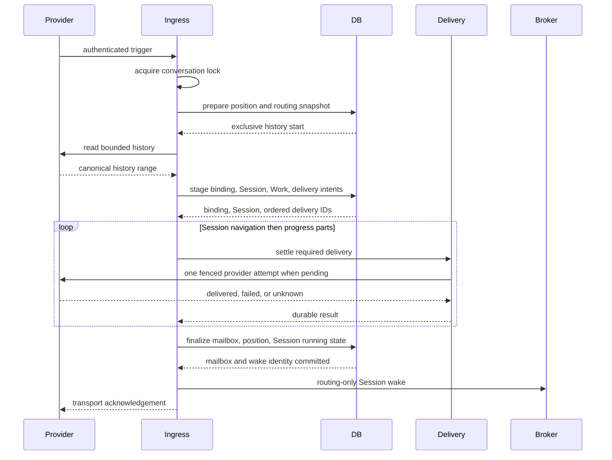

# External Channel Binding and Admission Ordering Design

- Snapshot: `binding-260731`
- Requirements:
  [binding-260731/REQ](../requirements/binding-260731-admission-ordering.md)
- Decisions:
  [binding-260731/ADR](../adr/binding-260731-admission-ordering.md)
- Document reference: `binding-260731/DESIGN`

## Current Behavior and Gaps

The binding table stores both a status enum and `disconnected_at`, and repository,
management API, generated clients, tests, and Session Channels consume the status
field. The two values represent the same terminal boundary and can drift.

Synchronous provider ingress currently resolves provider history, then one final
transaction creates or reuses the binding and Session, persists initial provider
controls, enqueues the mailbox input, advances the conversation position, marks the
Session running, and commits wake-recovery identity. The controls are delivered only
after the transaction. This does not enforce provider-visible initialization before
Agent execution.

Outbound Channel Work and delivery validation currently reject operations based on
connection health. That health is produced by HTTP validation and persistent
Gateway/Socket lifecycle, while actual outbound messages use provider REST APIs.

Discord delivery-thread creation has access to the current routed Agent projection but
does not consistently use its name as the provider creation title.

## Architecture

### Binding authority

`external_channel_bindings.disconnected_at` is the only connectedness authority:

- `NULL`: the current connected relationship;
- non-`NULL`: terminal historical relationship.

`disconnect_reason` remains diagnostic terminal metadata. `connected_at` remains the
creation timestamp. Repository method names use `connected`, not `active`, where they
describe binding connectedness.

The binding has no initialization status. Initialization progress belongs to the
existing durable delivery attempts and Channel Work projection parts.

### Ordered ingestion

`prepare`, `stage`, and `finalize` are short database transactions. Provider history
and delivery happen between transactions. The same conversation lock and absolute
transport deadline cover the sequence.

### Stage result

The stage result contains only durable identities and a typed outcome:

- stage status;
- reason;
- binding ID and Session ID for a ready stage;
- ordered required delivery-attempt IDs;
- an optional non-admission control delivery for selector/access outcomes; and
- its connection ID when such a control exists.

A ready stage requires a binding, Session, and at least one required delivery ID. A
non-ready stage cannot carry binding/Session or required-delivery identities.

The required order is:

1. one-time Session navigation;
2. every initial progress projection part in stable part order.

Idempotent intent creation returns existing attempt IDs even when already delivered.
This allows a retry to prove initialization without issuing another provider mutation.

### Required delivery coordinator

The coordinator reads delivery status from PostgreSQL:

- `delivered`: continue;
- `pending`: invoke the shared action service once through its normal start/settle
  fences, then observe the durable result;
- `attempting`: wait briefly and re-read within the transport deadline;
- `failed`, `unknown`, `not_attempted`, missing, or deadline expiration: stop and
  return a retryable incomplete-initialization outcome.

The coordinator does not turn an ambiguous result into `pending` and does not create a
replacement intent. The existing provider-control recovery loop may classify stale
attempts, but only a durable `delivered` result permits finalization.

### Mailbox finalization

The final transaction re-locks and validates:

- current HTTP or lease-fenced ingress authority;
- conversation position and replay boundary;
- active provider resource;
- the exact staged binding and Session;
- route, Agent, principal block, and access authority; and
- every staged delivery attempt as belonging to the binding and being `delivered`.

Only then does it:

- enqueue the deterministic canonical mailbox item;
- mark the Session running for input wake-up;
- compare-and-set the conversation position;
- initialize thread position state; and
- commit the mailbox wake-recovery identity.

Position mismatch restarts history preparation. Any other changed authority fails
closed without mailbox, position, or wake mutation.

### Deadline allocation

The transport keeps one absolute outer deadline so Slack HTTP, Slack Socket, and
Discord Gateway retain deterministic acknowledgement behavior. Optional history
identity and permalink enrichment use a bounded soft budget that expires before the
outer deadline. When the soft budget is exhausted, history remains valid with bounded
fallback identity/link presentation.

The remaining interval is reserved for the required stage/delivery/finalize path.
Required work never starts an optional enrichment operation after its reserve boundary.
Deadline expiration during required delivery leaves the staged durable state
retryable and does not acknowledge success.

### Outbound REST authority

Channel action commit, delivery start, runtime-delivery revalidation, file transfer,
and access/manager control delivery keep their existing ownership and credential
checks. Connection `active`, `degraded`, `reconnect_required`, Gateway lease, Socket
heartbeat, and gap fields are not outbound authorization inputs.

Terminal connection disconnect continues to:

- set connection terminal state;
- clear encrypted credentials;
- disconnect owned bindings;
- make resources unavailable or deleted as required; and
- commit local revocation before provider cleanup.

These durable effects, rather than ingress health, revoke outbound delivery.

### Discord title

The delivery target already projects the current routed Agent name. Discord
root/thread provisioning passes a sanitized title derived from that name to the
high-level provider adapter only when a new provider conversation target is created.

Title normalization:

- trims surrounding whitespace;
- substitutes the existing safe product fallback only when the name is blank;
- applies the provider-specific maximum length without appending identifiers; and
- retains no additional title state after the provider target is created.

Existing `delivery_channel_id` or provider thread labels always win and prevent a
rename request.

## Data Model and Migration

Generate one Alembic revision from the current migration head.

Upgrade:

1. verify every row is internally consistent:
   `active` has no `disconnected_at`, and `disconnected` has one;
2. fail with a content-free aggregate diagnostic if inconsistent rows exist;
3. drop status-based binding indexes and partial unique indexes;
4. create route and Session lookup indexes without the status column;
5. create the connected-resource partial unique index using
   `WHERE disconnected_at IS NULL`;
6. drop the `status` column; and
7. drop the `external_channel_binding_status` PostgreSQL enum.

Downgrade:

1. recreate the enum;
2. add the status column;
3. backfill `active` when `disconnected_at IS NULL`, otherwise `disconnected`;
4. make the column non-null;
5. restore the previous indexes and unique predicate; and
6. remove replacement indexes whose definitions differ.

Historical migrations remain immutable. Runtime code and the new migration no longer
reference the removed enum after upgrade.

## API, Generated Clients, and Web

`ManagedBinding.status` is removed from the public OpenAPI schema. The response keeps
`connected_at`, `disconnected_at`, and `disconnect_reason`.

Regenerate:

- public OpenAPI JSON;
- Python public client; and
- TypeScript public client.

Session Channels derives its connected presentation from
`binding.disconnectedAt == null`. It displays terminal metadata when
`disconnectedAt` is present and removes `active`/`disconnected` binding-status
translation keys that are no longer used. There is no compatibility field or legacy
fallback.

## Failure and Recovery

| Boundary | Failure result | Retry behavior |
| --- | --- | --- |
| Before stage commit | No new binding or intent | Repeat preparation |
| After stage commit, before provider attempt | Binding and pending intents remain | Reuse the same identities |
| Provider returns known failure | Attempt is terminal failed | Do not admit mailbox |
| Provider result is ambiguous | Attempt is terminal unknown | Do not replay or admit |
| Process stops while attempting | Ledger remains attempting until stale recovery | Never infer success |
| Required delivery completes, before finalize | Delivered attempts remain | Retry verifies and finalizes |
| Authority changes before finalize | No mailbox/position/wake mutation | Fail closed |
| Finalize commits, before broker wake | Mailbox item is wake-recovery identity | Duplicate ingress recovers wake |
| Redis lock disappears or Redis restarts | Current operation may fail retryably | Durable DB state remains authoritative |

The Redis deadline helper accepts an operation factory so it does not create a
coroutine after the deadline has already expired.

## Security and Diagnostics

- Provider payloads, message bodies, credentials, raw IDs, URLs, and exception text do
  not enter logs or migration diagnostics.
- Delivery evidence exposes only operation type, durable status, bounded error kind,
  and aggregate timing/count data.
- Every post-stage mutation revalidates the current authority rather than trusting
  caller-provided IDs.
- Provider mutation remains one-attempt and credentials remain adapter-local.

## Removal and Replacement

| Existing unit or behavior | Why it becomes obsolete | Replacement or remaining authority | Removal boundary | Absence verification |
| --- | --- | --- | --- | --- |
| Binding status enum and DB column | Duplicates terminal timestamp and preserves a forbidden active/inactive concept | `disconnected_at` | Migration, RDB/domain models, repositories, API, clients, UI | Repository-wide search has no runtime/schema/client/UI references after generation |
| Status-based binding indexes | Depend on removed column | Connected partial index on `disconnected_at IS NULL` plus plain lookup indexes | Migration and model metadata | Schema model test and migration upgrade/downgrade assertions |
| One final admission transaction | Admits execution before required provider initialization | Stage → delivery → finalize | Ingestion protocol and mailbox store | Unit tests assert no mailbox/position/wake before delivered attempts |
| Post-ack initial Session/progress controls | Ordering is too late for required initialization | Synchronously settled durable intents | Transport ingress orchestration | Slack/Discord E2E evidence orders deliveries before acknowledgement and wake |
| Connection-health outbound guard | Couples REST delivery to ingress transport | Durable binding/Session/Agent/route/resource/credential/capability authority | Work, action, file, and control delivery validation | Tests cover degraded and reconnect-required connection health |
| Generic Discord creation title | Does not identify the routed Agent | Bounded current Agent name at creation | Discord provisioning adapter | E2E verifies new title and preserved existing title |

## Test Strategy

### Unit and repository tests

- Binding model and repository tests cover connected lookup, uniqueness, explicit
  disconnect, repeated disconnect, and non-reactivation.
- Migration integration tests cover consistent existing rows, inconsistency
  preflight, upgrade schema, preserved data, downgrade backfill, and index predicates.
- Ingestion tests prove stage ordering, deterministic intent reuse, Session navigation
  before all progress parts, failed/unknown/incomplete delivery rejection, authority
  revalidation, position restart, mailbox idempotency, and wake recovery.
- Work and delivery tests prove outbound REST attempts remain allowed for degraded and
  reconnect-required ingress health while disconnect, missing credentials, invalid
  ownership, inactive Agent/Session, and unavailable resources still reject.
- Conversation-lock tests prove an already-expired deadline creates no Redis coroutine.
- Slack history tests prove optional enrichment cannot consume the required admission
  reserve.
- Discord provisioning tests prove bounded Agent-name title creation and no rename of
  an existing provider target.

### Deterministic E2E

The fake Slack and Discord providers record sanitized operation names and ordering
only.

Required scenarios:

1. new Slack HTTP conversation: Session navigation, initial progress, mailbox wake,
   then acknowledgement;
2. retry after staged delivery interruption: same binding, Session, delivery IDs, and
   mailbox identity;
3. existing Slack binding: no duplicate provider initialization;
4. new Discord conversation: Agent-derived title, ordered progress, mailbox wake;
5. existing Discord thread: provider title is unchanged;
6. known and ambiguous provider failures: no mailbox, position advancement, wake, or
   successful transport acknowledgement; and
7. degraded/reconnect-required ingress health: existing bound outbound REST reply is
   attempted.

Tests fail rather than skip when deterministic provider prerequisites are part of the
repository fixture. Live provider tests remain optional and must emit only sanitized
aggregate evidence.

### Quality gates

- Python Ruff, format check, Pyright, focused tests, and full `pytest`;
- Alembic graph and migration integration tests;
- public OpenAPI dump and Python/TypeScript client regeneration;
- TypeScript format, lint, typecheck, and relevant web tests;
- deterministic External Channel E2E;
- Helm checks only if deployment files change; and
- independent code review and spec review before PR creation.

## Traceability

| Requirement | ADR decisions | Design mechanisms |
| --- | --- | --- |
| binding-260731/REQ-1 | ADR-D1 | Timestamp-only connectedness, terminal disconnect, partial unique index, API/UI removal |
| binding-260731/REQ-2 | ADR-D2, ADR-D3 | Ordered stage, Session navigation, progress delivery, finalize, wake |
| binding-260731/REQ-3 | ADR-D2, ADR-D3 | Short transactions, external provider I/O, deterministic delivery ledger |
| binding-260731/REQ-4 | ADR-D3 | Durable delivered-status verification and fail-closed finalization |
| binding-260731/REQ-5 | ADR-D4 | Outbound authority independent from connection health |
| binding-260731/REQ-6 | ADR-D5 | Creation-only bounded Agent-name Discord title |

## Feasibility

| Area | Result | Evidence |
| --- | --- | --- |
| Timestamp-only binding | Feasible | `disconnected_at` already exists and all terminal lifecycle paths already set it |
| Ordered admission | Feasible | The ingestion service already owns the lock/deadline and the delivery ledger is idempotent |
| Delivery-before-mailbox | Feasible | Provider action service operates outside caller transactions and persists terminal status |
| Crash-safe retry | Feasible | Binding, delivery attempts, mailbox identity, and conversation position are durable |
| Health-independent outbound | Feasible | Delivery targets already carry credentials and REST adapters do not require Gateway ownership |
| Discord Agent title | Feasible | Delivery targets already project routed Agent name and provisioning is centralized |
| Public contract migration | Feasible with coordinated regeneration | OpenAPI and both generated public clients are repository-owned |
| Fixed 2.5-second transport budget | Conditional | Optional enrichment must yield a reserve and provider delivery may still require provider retry |

The remaining deadline risk is non-blocking for implementation: required delivery
continues to fail retryably rather than acknowledge incomplete admission when the
provider cannot complete within the transport deadline.
