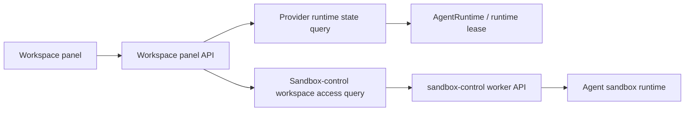

# Sandbox Runtime / Workspace State Boundary

## Context

Recent production incidents exposed that the Workspace panel API and UI collapse two different control planes into one state:

- **Provider control** owns whether an Agent sandbox runtime exists, is starting, running, hibernated, deleting, lost, or failed to restore.
- **Sandbox control** owns operations inside a runtime that provider control has already considered present: workspace file list/read/write, shell command dispatch, checkpoint create/restore hooks, and command-stream readiness.

The current Workspace API returns a single Agent Workspace state union such as `READY`, `RESTORING`, `RESTORE_FAILED`, or `SANDBOX_INACTIVE`. That shape made `READY` imply both "runtime exists" and "workspace file API is usable". In production this broke down: provider control showed the Agent sandbox Pod was running, but sandbox-control worker requests returned `Sandbox control connection is unavailable`. The UI then rendered a red error with no stop/reset action, leaving the user stuck even though the system had already judged the runtime to exist.

## Findings

### Existing responsibility split

The provider-control design already defines provider lifecycle as a distinct boundary. `sandbox-provider-control.md` states that provider lifecycle exists before a sandbox container starts and must not be modeled as sandbox-control commands. Its failure-mode table also calls out "provider reports running but sandbox-control absent" as a mismatch between actual runtime state and command plane readiness.

The Agent Workspace project design separately defines `/home/sandbox` as the materialized workspace inside an active sandbox. It treats `AgentRuntime` as the durable owner of sandbox lifecycle and checkpoint state, while file APIs are views into the active runtime filesystem.

### Current code paths that mix the responsibilities

- `AgentWorkspaceFileService.get_workspace()` reads `AgentRuntime.runtime_state` and then immediately tries `attach_active_runtime()`, which waits on sandbox-control readiness. A control-plane problem can therefore rewrite a provider runtime state into `RESTORING`.
- `WorkspaceReadyResponse` contains runtime actions (`stop_action`, `reset_action`) only when workspace manifest read succeeded. If later `readAgentWorkspacePath` fails, the frontend converts the failure into a generic `ERROR` and drops those actions.
- `WorkspaceRestoringResponse` only exposes `can_start_sandbox`; it does not say whether provider control believes a runtime exists and can be stopped.
- `start_sandbox` currently serves both "provider desired state should be running" and "retry workspace/control readiness" semantics.

### Operational symptom

The observed production state was:

1. Provider/Kubernetes showed the sandbox Pod running.
2. Sandbox-control worker calls failed with "connection unavailable".
3. Workspace UI had no stop button because the control failure was rendered as a generic workspace error.

This is not only a UX issue. It means the API does not expose the source of truth for runtime existence separately from workspace command-plane usability.

## Goals

1. Make provider runtime state explicit in every workspace panel response.
2. Make sandbox-control workspace access state explicit and nested under runtime state, not vice versa.
3. Preserve runtime lifecycle actions whenever provider control judges a runtime to exist, even if sandbox-control is unavailable.
4. Keep state transitions idempotent:
   - Start means desired provider runtime state is running.
   - Stop means desired provider runtime state is stopped/hibernated.
   - Reset means explicitly discard durable runtime/workspace state and start fresh.
5. Remove implicit reset or fallback paths. Users must explicitly choose retry or reset when data may be discarded.
6. Treat "runtime running but workspace unavailable" as a first-class recoverable state with user actions.

## Non-Goals

- This design does not change provider controller internals or introduce a new persistence backend for Kubernetes.
- This design does not require backward-compatible response fields. The API and generated client can change together.
- This design does not make sandbox-control fully stateless by itself. It assumes the existing Redis registry/command bus remains the cross-replica routing layer.

## Proposed API Model

Replace the single Agent Workspace state union with a response that has two orthogonal sections:

```ts
type AgentWorkspacePanelResponse = {
  runtime: SandboxRuntimePanelState;
  workspace: SandboxWorkspaceAccessState;
  actions: SandboxRuntimeActions;
};
```

### Runtime state

Runtime state is provider-control owned. It answers: "Does an Agent sandbox runtime exist or should it exist?"

```ts
type SandboxRuntimePanelState =
  | { type: "NOT_STARTED" }
  | { type: "STARTING" }
  | { type: "RUNNING"; runtimeId: string }
  | { type: "HIBERNATED"; runtimeId: string }
  | { type: "STOPPING"; runtimeId: string }
  | { type: "RESETTING"; runtimeId: string }
  | { type: "RESTORE_FAILED"; runtimeId: string; detail: string }
  | { type: "LOST"; runtimeId: string; detail: string };
```

Mapping rules:

- `AgentRuntime.runtime_state == ACTIVE` maps to `RUNNING` even if sandbox-control attach/file operations fail.
- `RESTORING` maps to `STARTING` or `RESETTING` depending on transition reason if available. If reason is not available initially, map to `STARTING` and add reason support in the implementation.
- `PERSISTING` maps to `STOPPING`.
- `HIBERNATED` maps to `HIBERNATED`.
- `EXPIRED` maps to `RESTORE_FAILED` when checkpoint restore is not possible.
- Missing runtime maps to `NOT_STARTED`.

### Workspace access state

Workspace access state is sandbox-control owned. It answers: "Given the runtime state, can the UI inspect `/home/sandbox` now?"

```ts
type SandboxWorkspaceAccessState =
  | { type: "UNAVAILABLE"; reason: "RUNTIME_NOT_RUNNING" }
  | { type: "CONNECTING" }
  | { type: "READY"; manifest: WorkspaceManifest }
  | {
      type: "CONTROL_UNAVAILABLE";
      detail: string;
      retryAfterMs: number;
    }
  | {
      type: "READ_FAILED";
      detail: string;
    };
```

Mapping rules:

- Runtime `NOT_STARTED`, `HIBERNATED`, `STOPPING`, and `RESTORE_FAILED` return workspace `UNAVAILABLE`.
- Runtime `STARTING` or `RESETTING` returns workspace `CONNECTING`.
- Runtime `RUNNING` attempts a bounded sandbox-control manifest read:
  - success -> `READY`
  - control route/stream unavailable -> `CONTROL_UNAVAILABLE`
  - file read/list error after control route exists -> `READ_FAILED`
- Workspace access errors must not change provider runtime state.

### Actions

Actions are runtime actions, not workspace actions:

```ts
type SandboxRuntimeActions = {
  start?: WorkspaceActionResponse;
  stop?: WorkspaceActionResponse;
  reset?: WorkspaceActionResponse;
  retryWorkspace?: WorkspaceActionResponse;
};
```

Action rules:

- `RUNNING` always exposes `stop` and `reset`, even when workspace access is `CONTROL_UNAVAILABLE` or `READ_FAILED`.
- `NOT_STARTED`, `HIBERNATED`, `RESTORE_FAILED`, and `LOST` expose `start` when the user can request a running runtime.
- `RESTORE_FAILED` and `LOST` expose `reset`.
- `STARTING`, `RESETTING`, and `STOPPING` should generally expose no destructive action except refresh. If the implementation supports cancel/stop in these states, add it explicitly later.
- `retryWorkspace` is a UI/query refresh action only. It must not mutate provider desired state.

## Backend Design

### Split service methods internally

`AgentWorkspaceFileService.get_workspace()` should become orchestration over two narrower queries:

1. `resolve_runtime_panel_state(session)`:
   - Reads `AgentRuntime` and provider lifecycle state.
   - Does not call sandbox-control.
   - Produces runtime state and runtime actions.

2. `resolve_workspace_access(runtime_state)`:
   - Only runs if runtime state is `RUNNING`.
   - Attempts bounded sandbox-control attach/manifest read.
   - Produces workspace access state.
   - Never rewrites runtime state.

This makes the code reflect the domain boundary:



### Start/stop/reset semantics

- `start_sandbox` sets/ensures provider desired runtime state is running. It may return runtime `STARTING`/workspace `CONNECTING`; it must not imply workspace access is ready.
- `stop_sandbox` uses provider/runtime identity. It must remain available when runtime is `RUNNING`, even if sandbox-control access is unavailable.
- `reset_sandbox` is explicit data discard. It must mark runtime as `RESETTING` before invalidating checkpoints or deleting/recreating provider runtime.
- A cancelled HTTP request must not cancel an already accepted reset operation.

### Error handling

- Provider-control errors are runtime errors and affect `runtime.type`.
- Sandbox-control route/stream errors affect only `workspace.type`.
- File read/list errors after successful runtime state must not hide runtime actions.
- Any API response that says runtime `RUNNING` must include `stop`.

## Frontend Design

The frontend container should stop deriving runtime lifecycle from workspace file queries.

Recommended UI ADT:

```ts
type WorkspacePanelState =
  | { type: "NO_SESSION" }
  | { type: "LOADING" }
  | { type: "RUNTIME_INACTIVE"; start; reset? }
  | { type: "RUNTIME_TRANSITIONING"; runtime; refresh }
  | { type: "RUNTIME_RUNNING_WORKSPACE_READY"; stop; reset; manifest; directory }
  | { type: "RUNTIME_RUNNING_CONTROL_UNAVAILABLE"; stop; reset; refresh; detail }
  | { type: "RUNTIME_RUNNING_WORKSPACE_ERROR"; stop; reset; refresh; detail }
  | { type: "RUNTIME_RESTORE_FAILED"; start; reset; detail };
```

UI rules:

- If runtime is running, show `Stop Sandbox` regardless of workspace access.
- If workspace access is unavailable, show:
  - primary `Stop Sandbox`
  - secondary `Refresh`
  - dim/confirm `Reset Sandbox`
- Do not show "Retry restore" for sandbox-control access failures. Restore retry is only for provider/runtime restore failures.
- Do not render generic `ERROR` for recoverable runtime-running workspace failures.

## Migration Plan

1. Add the new response models and service split.
2. Regenerate nointern public client.
3. Update Workspace panel container/component to consume `runtime`, `workspace`, and `actions`.
4. Delete old `READY`/`RESTORING`/`RESTORE_FAILED` response mapping and old UI state branches.
5. Update tests to assert:
   - runtime `RUNNING` + workspace `CONTROL_UNAVAILABLE` includes `stop/reset`.
   - runtime `RUNNING` + directory read error does not become generic error.
   - reset first exposes `RESETTING` before checkpoint invalidation.
   - start while reset is in progress remains idempotent.
6. Update current spec after CI passes.

## Test Strategy

E2E is primary for user-visible behavior:

| Scenario | Expected UI |
|---|---|
| Runtime not started | Start button visible |
| Runtime running and workspace ready | File browser visible, stop visible |
| Runtime running but sandbox-control unavailable | Error panel with stop, refresh, reset |
| Runtime restore failed | Retry restore and reset visible |
| Reset in progress then refresh | Transitioning/connecting state, no restore retry |

Backend unit tests:

- `resolve_runtime_panel_state` maps provider runtime states without calling sandbox-control.
- `resolve_workspace_access` maps sandbox-control errors without changing runtime state.
- `get_workspace` always includes `stop` when runtime is `RUNNING`.
- `reset_sandbox` is shielded from request cancellation.

Frontend tests/stories:

- Add a story for `RUNTIME_RUNNING_CONTROL_UNAVAILABLE`.
- Add a story for `RUNTIME_RUNNING_WORKSPACE_ERROR`.
- Verify both states render `Stop Sandbox` and a dimmed reset button with confirm.

Live/diagnostic validation:

- In production or a live staging environment, force sandbox-control connection loss while leaving the provider runtime running.
- Confirm provider/Kubernetes still reports the sandbox runtime.
- Confirm Workspace panel shows stop/reset actions.
- Confirm `Stop Sandbox` transitions provider runtime toward stopped/hibernated without requiring sandbox-control workspace file access.

## Open Questions

1. Do we need a durable transition reason on `AgentRuntime` to distinguish `STARTING` from `RESETTING`, or can the UI initially show a generic `CONNECTING` state?
2. Should provider-control expose a direct "runtime observed running but control missing" health field, or should Workspace API derive it from runtime `RUNNING` plus sandbox-control access failure?
3. Should `stop_sandbox` force-delete provider runtime when sandbox-control is unavailable, or first attempt graceful hibernate/checkpoint and then surface a separate failure?
