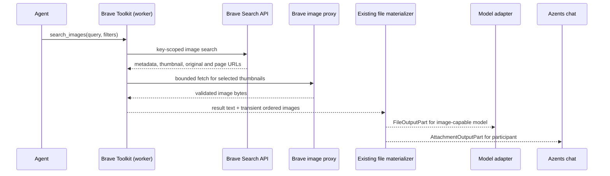

# Brave Search Native Toolkit Design

- Snapshot: `brave-260925`
- Requirements: [brave-260925/REQ](../requirements/brave-260925-native-search-toolkit.md)
- Decisions: [brave-260925/ADR](../adr/brave-260925-native-search-toolkit.md)
- Document reference: `brave-260925/DESIGN`
- Mode: Collaborative; requester owns material decisions.

## Current Behavior and Gap

`ToolkitConfig` already supplies encrypted credentials, Workspace-shared and Agent-owned scopes, enabled state, redacted edits, connection tests, source-scoped client tools, and deferred Tool Search. Registry entries produce native `FunctionTool`s. Remote service Toolkit calls do not require managed Runtime. Brave has no registry entry or settings form today.

The event pipeline distinguishes `FileOutputPart` (ModelFile-backed model image input) from `AttachmentOutputPart` (Exchange-backed participant delivery). Client tools can return transient `generated_files` to the existing materializer, which prepares both parts under Session/Run authority and uploads bytes before committing file metadata with the tool result. This mechanism currently assumes **one image per client-tool result**: `_attach_client_resources` rejects any other count, and `_validate_unique_outputs` rejects multiple images sharing one tool-call ID. Image search must extend this exact client-result boundary to support multiple ranked images in one result. The frontend already renders attachment output from client-tool results as ordinary conversation files; it does not treat FileParts as UI files.

The External Channel capability accepts text messages independently of Brave. Brave needs to return image and source URLs; channel publication/presentation policy is outside this Toolkit. The existing Runtime `present_file` and `read_image` tools are not part of this flow.

## Requirement and Decision Trace

| Requirement | Mechanism | Verification |
| --- | --- | --- |
| `brave-260925/REQ-1` | M1 encrypted registered Toolkit; connection check and redacted UI | Shared and Agent-only management E2E; credential boundary tests |
| `brave-260925/REQ-2` | M2 direct Brave client; M3 five stable native tools | Provider mapping tests; five-tool E2E |
| `brave-260925/REQ-3` | M4 dual-file multi-image result; M5 bounded proxy acquisition | Single search, multiple visible images E2E |
| `brave-260925/REQ-4` | M4 same-result ModelFiles; model capability lowering | Vision and text-only model E2E |
| `brave-260925/REQ-5` | M3 image and source URLs in bounded result text; M6 unchanged External Channel | Channel text handoff E2E |
| `brave-260925/REQ-6` | M1, M2, M4, M5 server-side execution and security | Runtime-free E2E; auth, timeout, 429 tests |

`brave-260925/ADR-D1` authorizes direct API access and the narrow exception to the external-service SDK preference; no MCP server, process, or Runtime credential injection is introduced.

## Architecture and Ownership

Brave is the search-result authority; Azents owns only Toolkit configuration, result normalization, and the resulting user/model file lifecycles. The key remains encrypted in existing Toolkit storage and is resolved server-side. A registered Provider creates one native Toolkit per effective enabled config, exposing names prefixed by the existing ToolkitConfig slug (for example `brave_search__search_news`). Disabled or missing-key configurations expose no executable Brave tools. Existing deferred Tool Search discovers the five tools; `always_expose_tools` remains the manager's existing option. Provider-hosted `web_search` stays separate.

## Provider Client and Tool Contracts

`ToolkitType.BRAVE_SEARCH` and a registered `BraveSearchToolkitProvider` use one validated, redacted `api_key` credential and a small config for default country, search language, safe-search policy, and bounded timeout. No missing-key/disconnected or disabled config exposes executable tools. A key revoked after configuration cannot be detected without network contact: its next search fails with an actionable authentication error rather than silently falling back; no new persistent connection-status authority is introduced. A connection test is explicit: it makes one minimal search request and reports auth, entitlement, rate-limit, and network failures without returning the key. Because an actual API call may consume quota, the test UI states this before the user runs it. Edits preserve a blank redacted key using the existing credential edit contract.

The approved direct client talks to the fixed official Brave Search API host with `X-Subscription-Token` and no model-supplied base URL, header, or arbitrary target. The five static native functions map to:

| Tool | Provider operation | Core output |
| --- | --- | --- |
| `search_context` | LLM Context | Bounded extracted snippets with titles and source URLs |
| `search_web` | Web Search | Ranked title, snippet, URL, optional published metadata |
| `search_news` | News Search | Article title, source, timestamp when present, URL |
| `search_images` | Image Search | Ranked image and page URLs, titles, dimensions, bounded image attachments |
| `search_videos` | Video Search | Video title, creator/source when present, URL, description |

Validate tool input per endpoint rather than pretending parameters are identical: `q` length/word limits; supported country and language codes; applicable `freshness`, `count`, safe-search, and pagination ranges. In particular, Image Search has no offset; `search_context` controls source and token budgets rather than returning a raw Web Search page. Preserve source URL exactly when it is valid HTTP(S), with bounded strings and counts. Use `results.properties.url` as the original image URL, `results.thumbnail.src` as the Brave-proxied thumbnail, and `results.url` as the **source page**, never interchange these fields. For channel text, emit the valid original image URL or the proxied thumbnail URL if the original is absent, plus the source page. Tool descriptions distinguish Web search from model-ready context and news.

## Image Result Admission

A normal `search_images` call fetches a small, ranked selection of Brave-proxied thumbnails on the worker side before finishing its single tool call. Admit only HTTPS `imgs.search.brave.com` thumbnail URLs with no userinfo or alternate port; send no API key or browser cookies to that host, disable redirects and proxy environment inheritance on this fetch, and enforce connection/read deadlines, per-item and aggregate byte limits, decoded media-type verification, and dimension/pixel limits. Never fetch an arbitrary result page or original image URL as an implicit side effect. The remaining returned results may remain text-only with direct image and source links when the requested count exceeds the automatic attachment budget; mark download failures textually so a result is not claimed to be visible when it is not. Image content from untrusted pages remains tool data, never a prompt instruction.

For each validated selected thumbnail, create a `GeneratedFileOutput` with stable search rank as `output_index`, verified MIME and SHA-256, and a bounded filename. The existing client-tool materializer commits an Exchange attachment and ModelFile for each item; extend only its **client-tool** multi-image admission to accept distinct `(call_id, output_index)` pairs, assemble FilePart/AttachmentPart pairs in rank order, and preserve accompanying text. Do not weaken provider-generated-image call identity validation. Deterministic file IDs already include run, generation, call ID, and output index: an identical retry reuses admitted resources, while changed bytes at the same identity fail closed instead of overwriting prior files. Resource admission failure returns an explicit tool failure; no half-published Exchange or ModelFile reference is displayed. An individual proxy download failure is omitted before materialization and reported with that result's URL in the bounded textual output.

Every model sees bounded title, URL, and source metadata. For an image-input-capable model the same tool result lowers each ModelFile-backed FilePart to image input; the existing generic `input_file` byte budget does **not** apply to image parts. Enforce image-specific byte/dimension and aggregate admission limits before persistence, with normalization where needed. For a text-only model the existing lowerer supplies an unsupported-image placeholder; tool text must state that its visual content was not inspected. The frontend receives the AttachmentParts and renders them in the normal standalone image attachment surface. This is **automatic search-result delivery**, not a separate present or inspect tool. Returned original image URLs are references, not downloaded originals; the attached file is explicitly the search thumbnail.

## Failure, Security, and Operations

- 401/403: actionable invalid key or insufficient subscription message without leaking any credential or raw header; no silent fallback to a model-provider-hosted search.
- 429 and quota failure: surface retry/limit information safely; respect bounded backoff or retry guidance from response headers, never an unbounded retry loop. Timeout, malformed JSON, or malformed results fail clearly or omit isolated invalid entries with a count. Bound response size before parsing and tool text before return.
- Use existing Session/Run ownership checks and cleanup for output objects; no new session authority, Redis dependency, public image-fetch endpoint, or Runtime egress permission is required.
- Redact query, API key, response body, and third-party image URLs from default operational logs; record operation category, HTTP status class, duration, returned count, images admitted/skipped, and explicit failure category. Keep endpoint/version mapping local to the Provider client for change control.
- A configuration or key rotation takes effect through the existing Toolkit revision lifecycle. Removal/disable stops future tool availability; an already prepared call follows current snapshot and Session authorization rules. Deployment rollback removes the new Provider/UI registrations; existing unknown-type ToolkitConfig rows must not silently resolve to another provider. No database migration is expected because `toolkit_type` is stored as a string and credentials use existing encrypted storage. Verify OpenAPI diff before client regeneration; generate clients only for an actual contract change.

## Test Strategy

E2E is the primary product proof. Add a deterministic, testenv-only Brave upstream fixture and stable image byte fixtures; keep the production API endpoint and proxy-host admission fixed. Testenv composition supplies an isolated HTTP transport for the Brave client so the synthetic upstream can answer API and allowed-thumbnail requests without making the production client accept a user-configurable base URL or weakening its URL checks. The existing E2E stack already supports deterministic model and external-service fakes, but this Brave transport/fixture and its worker wiring are **new required test work**, not an existing fixture. Do not require a real API key in required CI. An E2E run must exercise:

1. Workspace-shared and Agent-only Toolkit creation/edit/disable with key redaction and no leaked credential in tool output;
2. Runtime-free Agent selecting all five distinct tool functions through Tool Search and receiving mapped results;
3. One `search_images` call returning at least two ranked images, rendered to the participant as attachments, with matching source and image URLs in model-visible text;
4. an image-capable model receiving the corresponding FileParts and a text-only model receiving useful links plus an explicit inability to inspect pixels;
5. a connected External Channel message reusing the returned image/source URLs without a second Brave tool or automatic Toolkit publication;
6. individual invalid thumbnail, revoked key, 429, missing entitlement, timeout, and storage/admission failure with correct no-leak and no-half-attachment behavior.

Add focused unit/contract tests for parameter bounds, all five response decoders, URL field distinction, fixed-host image-fetch validation, multi-image client-result preparation/identity and cleanup, provider-generated-image regression, provider registry/credential redaction, and file-part lowering. E2E fixture setup must seed only a synthetic API key and a deterministic upstream; snapshot the setup, expected event counts, tool call count, attachment URIs, image thumbnails, and model-input shape as CI evidence. Required CI fails on fixture/contract mismatch and must not skip a missing test prerequisite. A separately configured real-Brave smoke test is optional and skips if no permitted key is provided; it is not a required-CI dependency. Browser screenshots of image result/attachment presentation supplement event-level assertions. No external paid-service call runs in ordinary CI.

## Feasibility and Authority Audit

- `REQ-1` feasible: registry, encrypted ToolkitConfig credentials, scopes, and redacted management paths exist; provider-specific form/validation is new work. Revoked credentials are detected when contacted, not through a new persisted connection state.
- `REQ-2` feasible: official API documentation covers the five exact operations; typed mapping and static tool registration are new work. `ADR-D1` supplies direct-HTTP authority.
- `REQ-3` conditional on a required existing-boundary change: materializer presently enforces one client image per call, so relax only the client-result multi-image branch with deterministic rank identities and tests. Exchange UI output is already supported.
- `REQ-4` feasible: ModelFile rich-input lowering and model capability filtering already exist; image-specific and aggregate admission limits plus text-only copy require coverage.
- `REQ-5` feasible: all necessary provider URL fields exist; existing External Channel sends text without any Toolkit-specific channel behavior.
- `REQ-6` conditional on the new isolated testenv transport and security tests: remote server Toolkit execution and file materialization use Session/Run authority independently of managed Runtime; bounded proxy acquisition, timeout, and failure tests remain required.

Every material mechanism below is authorized by confirmed Requirements, the accepted ADR, and/or retained current Specs. No new user-visible mode, secondary credential authority, persistence table, implicit channel publication, or provider-hosted search override is introduced. There is no blocker to an implementable design. Actual paid-provider compatibility remains an optional post-implementation smoke check; official docs and deterministic tests establish design feasibility without a private key.

## Design Authority

- Design revision: `1`

| ID | Material design mechanism | Authority | Classification |
| --- | --- | --- | --- |
| M1 | Persist and resolve encrypted key-backed native Brave Toolkit using existing shared/Agent-owned scopes and Runtime-free Toolkit binding | `brave-260925/REQ-1`, `REQ-6`; Toolkit Spec | `required` |
| M2 | Own direct, fixed-host Brave Search HTTP integration for the five approved endpoints, without operating a Brave MCP server | `brave-260925/ADR-D1`; `REQ-2`, `REQ-6` | `decided` |
| M3 | Expose five distinct client function tools with bounded typed outputs and attributable URLs, separate from hosted `web_search` | `brave-260925/REQ-2`, `REQ-5`; Toolkit and Agent Specs | `required` |
| M4 | Automatically materialize ordered multi-image search results in one client-tool call as both model-only FileParts and participant-visible Exchange attachments | `brave-260925/REQ-3`, `REQ-4`; Conversation Spec | `derived` |
| M5 | Obtain only bounded Brave-proxied thumbnails server-side with fixed-host network validation for automatic image delivery | `brave-260925/REQ-3`, `REQ-4`, `REQ-6`; existing Session/file security boundaries | `derived` |
| M6 | Leave External Channel publication/presentation to its existing capability and provide image/page URLs in the search result | `brave-260925/REQ-5`; External Channel Spec | `required` |

## Removal and Replacement

| Existing unit or behavior | Removal authority | Replacement or remaining authority | Removal boundary | Absence verification |
| --- | --- | --- | --- | --- |
| Client-tool generated-image path rejects multiple images with one call ID and requires exactly one output | `brave-260925/REQ-3`, `REQ-4` | Ordered multi-image client-result admission with distinct `(call_id, output_index)`; provider-image constraints remain | `engine/events/provider_output.py` client-result assembly/identity only | Two-image one-call tests pass; duplicate rank rejected; provider-tool generation tests remain green |
| Other behavior | None: no existing Brave integration or obsolete toolkit state found | Existing Toolkit, hosted search, channel, Runtime and credential contracts remain | No unrelated removal | Registry and E2E tests verify other providers and hosted search unchanged |

## Non-Blocking Risks and Assumptions

- Search thumbnails are bounded representations, not guaranteed full-resolution originals. Original image URLs may be unavailable or stop resolving; source-page and thumbnail URL remain distinct in text.
- Search results and external image content are untrusted; operational logs and model tool output must stay bounded. Live Brave response drift is detectable by optional smoke and typed parsing, not by required CI using paid calls.
- A connection test can consume Brave quota; invoke it only on explicit request and disclose that on the UI.

## Design Approval

- Mode: `Collaborative`
- Decision owner: requester
- Approved on: 2026-09-25 (KST)
- Approved Design revision: `1`
- Approved authority IDs: `M1`, `M2`, `M3`, `M4`, `M5`, `M6`
- Approved scope: Direct Brave Search API integration through a key-backed native Toolkit with five distinct tools; one-call bounded multi-image model and participant outputs; fixed-host proxy-thumbnail admission; explicit External Channel publication by its existing capability; no managed Runtime or Brave MCP server dependency. Approved by the requester with the subsequent instruction to implement on 2026-09-25.
