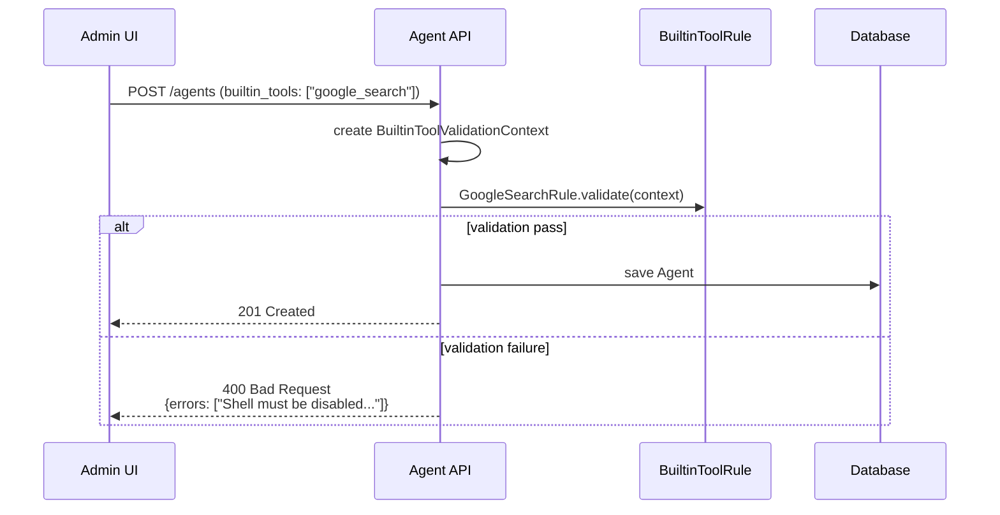
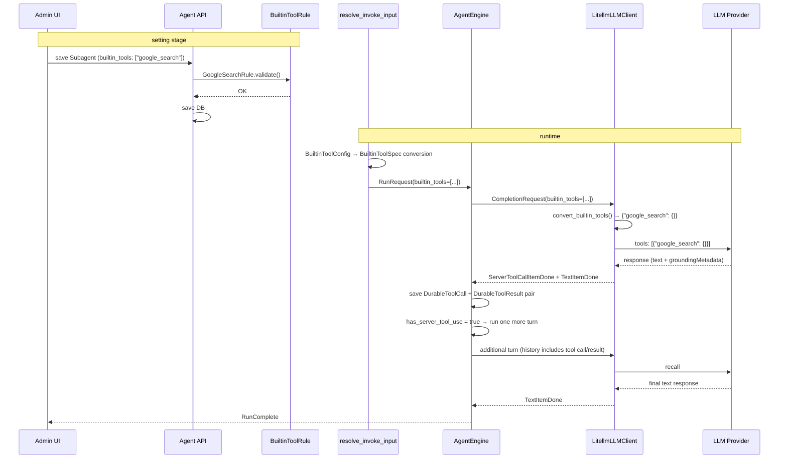

# Built-in Tool Design

## Overview

Support provider-side server-executed tools (Google Search, Web Search, etc.) in NoIntern. Unlike existing function-call tools, these do not require client handler; provider server executes them and includes result in response.

### Core Design Principles

| Principle | Description |
|------|------|
| **Provider-dependent** | each built-in tool depends on specific provider. Do not create unified abstraction |
| **Reuse existing structure** | store with existing DurableToolCall + DurableToolResult without new DB schema |
| **Plugin-based validation** | define constraints per built-in tool as plugins |
| **Subagent pattern** | isolate exclusive tools into subagent |

### Function Tool vs Built-in Tool

| Category | Function Tool | Built-in Tool |
|------|--------------|--------------|
| Declaration | `name` + `description` + `input_schema` | provider-specific format (minimal config) |
| Execution | client handler executes → returns result | provider server automatically executes |
| ReAct loop | tool_call → handler → result → LLM recall | call + result immediately stored → execute one more turn |
| Storage | DurableToolCall → (handler) → DurableToolResult | immediately store DurableToolCall + DurableToolResult pair |

## Domain Model

### BuiltinToolSpec

```python
@dataclasses.dataclass(frozen=True)
class BuiltinToolSpec:
    """Provider built-in tool spec.

    Tool executed server-side and does not need handler.
    Provider-specific declaration format is determined by name.
    """

    name: str  # "google_search", "anthropic_web_search", "openai_web_search"
    config: dict[str, object] = dataclasses.field(default_factory=dict)
```

### CompletionRequest extension

```python
@dataclasses.dataclass(frozen=True)
class CompletionRequest:
    # ... existing fields ...
    builtin_tools: list[BuiltinToolSpec] = dataclasses.field(default_factory=list)
```

### RunRequest extension

```python
@dataclasses.dataclass(frozen=True)
class RunRequest:
    # ... existing fields ...
    builtin_tools: list[BuiltinToolSpec] = dataclasses.field(default_factory=list)
```

### LLMProviderModel metadata

Declare supported built-in tool list in `LLMProviderModel.metadata`:

```json
{
  "supported_builtin_tools": ["google_search"],
  "max_input_tokens": 1048576
}
```

### Agent settings

Add built-in tool settings to Agent `model_parameters`:

```python
class BuiltinToolConfig(BaseModel):
    """Built-in tool setting to enable on Agent."""

    name: str  # "google_search"
    config: dict[str, object] = Field(default_factory=dict)


class ModelParameters(BaseModel):
    # ... existing fields ...
    builtin_tools: list[BuiltinToolConfig] = Field(default_factory=list)
```

## Built-in Tool Validation

### Validation Rule Plugin

Define constraints per built-in tool as plugin:

```python
class BuiltinToolRule(ABC):
    """Base for built-in tool validation rule."""

    name: ClassVar[str]  # built-in tool name

    @abstractmethod
    def validate(self, context: BuiltinToolValidationContext) -> list[str]:
        """Run validation. Return error message list (empty means pass)."""
        ...


@dataclasses.dataclass(frozen=True)
class BuiltinToolValidationContext:
    """Context needed for validation."""

    agent_role: AgentRole  # AGENT | SUBAGENT
    shell_enabled: bool
    has_toolkits: bool  # whether additional toolkit is attached
    provider_model: LLMProviderModel
```

### Google Search Rule Example

```python
class GoogleSearchRule(BuiltinToolRule):
    """Google Search is exclusive tool — cannot be used with other tools."""

    name = "google_search"

    def validate(self, ctx: BuiltinToolValidationContext) -> list[str]:
        errors: list[str] = []

        # provider compatibility
        supported = ctx.provider_model.metadata.get("supported_builtin_tools", [])
        if self.name not in supported:
            errors.append(
                f"Model '{ctx.provider_model.model_identifier}' does not support Google Search."
            )

        # subagent only
        if ctx.agent_role != AgentRole.SUBAGENT:
            errors.append("Google Search can only be enabled on subagents.")

        # Shell must be disabled
        if ctx.shell_enabled:
            errors.append(
                "Shell must be disabled when Google Search is enabled."
            )

        # no additional toolkit
        if ctx.has_toolkits:
            errors.append(
                "No additional toolkits allowed when Google Search is enabled."
            )

        return errors
```

### Web Search Rule (Unified Web Search)

`web_search` is tool that unifies provider-specific web search under one name:

```python
class WebSearchRule(BuiltinToolRule):
    """Web Search — automatically routes into provider-specific format."""

    name = "web_search"

    _GEMINI_PROVIDERS = frozenset({
        LLMProvider.GOOGLE_GEMINI,
        LLMProvider.GOOGLE_VERTEX_AI,
    })

    def validate(self, ctx: BuiltinToolValidationContext) -> list[str]:
        errors = []

        # provider compatibility (common)
        supported = ctx.provider_model.metadata.get("supported_builtin_tools", [])
        if self.name not in supported:
            errors.append(f"Model does not support Web Search.")

        # Gemini: exclusive constraints (same as existing Google Search)
        if ctx.provider_model.provider in self._GEMINI_PROVIDERS:
            if ctx.agent_role != AgentRole.SUBAGENT:
                errors.append("Web Search on Gemini: subagent only.")
            if ctx.shell_enabled:
                errors.append("Web Search on Gemini: shell must be disabled.")
            if ctx.has_toolkits:
                errors.append("Web Search on Gemini: no additional toolkits.")

        # OpenAI/Anthropic: no additional constraints
        return errors
```

### Validation Rule Registry

```python
BUILTIN_TOOL_RULES: dict[str, BuiltinToolRule] = {
    "google_search": GoogleSearchRule(),
    "web_search": WebSearchRule(),
}
```

### Validation Flow on Agent Save



## LLM Request Path

### Built-in Tool Declaration Conversion

Add provider-specific conversion functions to `runtime/llm.py`:

```python
def _convert_google_search(
    bt: BuiltinToolSpec, model: str
) -> dict[str, object] | None:
    """Google Search → Gemini/Vertex AI only."""
    if not model.startswith(("gemini/", "vertex_ai/")):
        return None
    return {"google_search": bt.config or {}}


def _convert_web_search(
    bt: BuiltinToolSpec, model: str
) -> dict[str, object] | None:
    """web_search → automatically convert to vendor-specific format.

    Determined by bt.vendor (LLMModel.vendor).
    If vendor absent, fallback to model prefix (gemini/, openai/, anthropic/).
    Multi-vendor providers such as vertex_ai/, bedrock/ require vendor.
    """
    vendor = bt.vendor
    if not vendor:
        if model.startswith("gemini/"):
            vendor = "google"
        elif model.startswith("openai/"):
            vendor = "openai"
        elif model.startswith("anthropic/"):
            vendor = "anthropic"

    if vendor == "google":
        return {"google_search": bt.config or {}}
    if vendor == "openai":
        return {"type": "web_search_preview"}
    if vendor == "anthropic":
        tool_def = {"type": "web_search_20250305"}
        if bt.config:
            tool_def.update(bt.config)
        return tool_def
    return None


_BUILTIN_TOOL_CONVERTERS = {
    "google_search": _convert_google_search,
    "web_search": _convert_web_search,
}
```

### Vendor-specific Conversion Mapping

`web_search` conversion is determined by **model vendor (LLMModel.vendor), not hosting provider**. Correct format is applied even on multi-vendor platforms such as Vertex AI and Bedrock.

| `web_search` + vendor | API format | Example |
|---------------------|----------|------|
| Google | `{"google_search": {config}}` | Gemini on GCP / Vertex AI |
| OpenAI | `{"type": "web_search_preview"}` | GPT on OpenAI |
| Anthropic | `{"type": "web_search_20250305", ...config}` | Claude on Anthropic / Vertex AI |
| Other | ignored (unsupported) | Llama, etc. |

### build_responses_kwargs integration

```python
def build_responses_kwargs(request: CompletionRequest) -> dict[str, object]:
    kwargs = {... }
    tools = convert_tools(request.tools) or []

    # Add built-in tools
    tools.extend(convert_builtin_tools(request.builtin_tools, request.model))

    # existing image_generation handling (kept separate)
    if request.image_generation:
        ...

    if tools:
        kwargs["tools"] = tools
    ...
```

### resolve_invoke_input conversion

```python
async def resolve_invoke_input(...) -> Result[RunRequest, ResolveError]:
    ...
    # builtin_tools setting → BuiltinToolSpec conversion
    builtin_tools = []
    if params and params.builtin_tools:
        for bt_config in params.builtin_tools:
            builtin_tools.append(
                BuiltinToolSpec(name=bt_config.name, config=bt_config.config)
            )

    return Success(
        RunRequest(
            ...
            builtin_tools=builtin_tools,
        )
    )
```

## LLM Response Path

### Streaming Event

New streaming event to parse server-side tool response:

```python
@dataclasses.dataclass(frozen=True)
class ServerToolCallItemDone:
    """Server-side tool call + result complete.

    Intermediate event for creating DurableToolCall + DurableToolResult pair.
    """

    tool_call: ToolCall  # name, id, arguments
    result_content: str  # normalized text for masking
    raw_call_item: dict[str, object]  # for raw round-trip
    raw_result_item: dict[str, object]  # for raw round-trip
```

Add to `CompletionStreamEvent`:

```python
CompletionStreamEvent = (
    ContentDelta
    | ToolCallDelta
    | ...
    | ServerToolCallItemDone  # added
    | StreamEnd
)
```

### LiteLLM Client Parsing

Parse provider-specific server tool response in `LitellmLLMClient.stream()`:

```python
# inside ResponseCompletedEvent handling
for item in completed_response.output:
    # existing: ResponseFunctionToolCall → ToolCallItemDone
    # existing: ResponseOutputMessage → TextItemDone
    # ...

    # parse server tool response (provider-specific)
    elif _is_server_tool_use(item):
        result_item = _find_matching_result(items, item)
        yield ServerToolCallItemDone(
            tool_call=ToolCall(id=..., name=..., arguments=...),
            result_content="[server-executed tool result]",
            raw_call_item=item.model_dump(),
            raw_result_item=result_item.model_dump() if result_item else {},
        )
```

> Concrete provider-specific parsing logic is finalized after litellm compatibility research.

## Engine Handling

### ServerToolCallItemDone handling

```python
case ServerToolCallItemDone() as item:
    # immediately save as DurableToolCall + DurableToolResult pair
    yield durable(
        DurableToolCall(
            id=uuid7().hex,
            tool_calls=[item.tool_call],
            raw_output=item.raw_call_item,
        )
    )
    yield durable(
        DurableToolResult(
            id=uuid7().hex,
            tool_call_id=item.tool_call.id,
            content=item.result_content,  # masking text
            raw_output=item.raw_result_item,
        ),
        flush=True,
    )
    # add to tool_calls → existing "run next turn if tool_calls exists" logic works as-is
    tool_calls.append(item.tool_call)
```

### Next turn execution — keep existing logic

Existing logic that runs next turn when tool_calls is non-empty works as-is. Whether server/client tool, if there is tool call, always run next turn.

Handler execution filters only tool calls without result:

```python
# keep existing branch
if not tool_calls:
    yield internal(TurnCompleteEvent(usage=usage), flush=True)
    yield ephemeral(RunComplete(usage=usage))
    return

# handler execution: only tool calls without result
yield internal(TurnCompleteEvent(usage=usage), flush=True)
for tool_call in tool_calls:
    if _has_result(tool_call):  # server tool → result already saved, skip
        continue
    # existing handler execution logic ...
```

### Model Switch Handling

Existing normalized fallback in `build_input_items()` works as-is:

- **same model**: `raw_output` round-trip (pass raw as-is when `source_model == model`)
- **different model**: normalized fallback → convert to `function_call` + `function_call_output` pair. `function_call_output.output` contains masking text (`"[server-executed tool result]"`).

## Admin UI

### LLMProviderModel settings

Add built-in tool support list settings to model registration/edit screen:

```
LLM Provider Model settings
├── Provider: [Google Gemini ▾]
├── Model Identifier: [gemini-2.5-flash]
├── Image generation: [✓]
├── Thinking: [ ]
└── Built-in Tools          ← new section
    ├── [✓] Google Search
    ├── [ ] Code Execution
    └── [ ] URL Context
```

Checkable built-in tool list is filtered by selected provider.

### Agent/Subagent settings

After model selection, if the model supports built-in tools, additional feature settings section is displayed:

```
Subagent settings
├── Name: [Google Search Bot]
├── LLM Model: [Gemini 2.5 Flash ▾]
├── Shell: [disabled]
├── Toolkits: (none)
└── Additional features                ← dynamic by model
    └── Google Search
        ├── [✓] Enabled
        └── (inline message on validation error)
           ⚠ "Shell must be disabled when Google Search is enabled."
```

Validation errors are shown inline in corresponding feature settings area.

## Data Flow



## Implementation Plan

### Phase 1: Core type + Google Search integration

- Define `BuiltinToolSpec` type
- `convert_builtin_tools()` (Google Search converter)
- Add `builtin_tools` field to `CompletionRequest`, `RunRequest`
- Integrate into `build_responses_kwargs()`
- Research + implement litellm Google Search response parsing

### Phase 2: Engine handling

- `ServerToolCallItemDone` streaming event
- Save server tool call/result pair in engine + skip handler
- Execute additional turn after server tool use

### Phase 3: Validation + Agent settings

- `BuiltinToolRule` ABC + `GoogleSearchRule`
- `supported_builtin_tools` in `LLMProviderModel.metadata`
- validation on Agent save
- `builtin_tools` field in `ModelParameters`

### Phase 4: Admin UI

- built-in tool checklist in LLMProviderModel settings
- Additional features section + validation error display in Agent/Subagent settings

## Related Documents

- [Built-in Tool discussion](../adr/0011-builtin-tools.md) — design decision process
- [ShellEnvironment design](./shell-environment.md) — shell_enabled, subagent Shell disable
- [image_generation migration issue](../issues/image-generation-builtin-migration.md) — future integration plan
