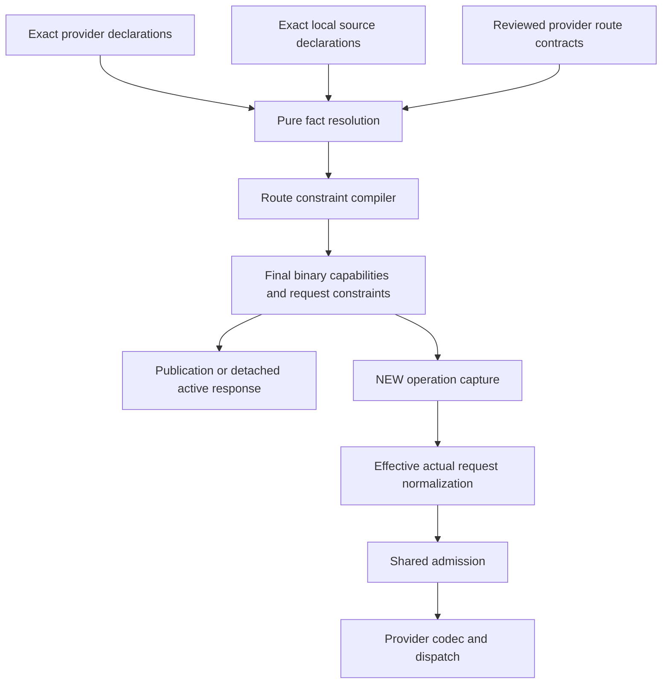

# Complete Model Capability Support Design

## Scope and Current Gap

[capabilities-261004/REQ](../requirements/capabilities-261004-complete-support-contract.md) requires a complete corrective implementation, not a permissive unknown-state hotfix. [capabilities-261004/ADR](../adr/capabilities-261004-complete-support-contract.md) fixes definitive binary support, separate facts and route constraints, shared actual-request admission, and independent real-model verification.

Current capability generation mixes producer declarations, source enrichment, SDK representability and conservative display projection. Consumers then select different parts of that object. Stored selections preserve obsolete metadata even for a new operation. Some internal requests bypass admission, and conditional validation can use a saved reasoning default after an explicit provider setting replaces it.

The replacement retains exact identities, inventory, configured order, settings, permissions, owner fences and frozen operation snapshots. It does not refresh remote catalogs, rewrite production rows, substitute models or authorize deployment.

## Design Authority

- Design revision: `2`

| ID | Material design mechanism | Authority | Classification |
| --- | --- | --- | --- |
| M1 | One final binary feature view; source diagnostics and request constraints are subordinate metadata | REQ-1, ADR-D1 | decided |
| M2 | Pure declaration resolution followed by route constraint compilation, shared by listing and active metadata | REQ-2, REQ-4, ADR-D2 | decided |
| M3 | Exact current authorized local declarations are compiled for active response projections and NEW operations without changing user configuration | REQ-3, REQ-4, ADR-D1, ADR-D2; unchanged exact-identity and snapshot constraints | derived |
| M4 | Effective provider request normalization precedes common admission for every lowerer and internal text operation | REQ-3, ADR-D2 | decided |
| M5 | Frozen operation, retry and quota captures remain immutable; drift concerns user configuration, not compiled metadata | REQ-3, fixed historical/owner constraints, ADR-D2 | existing |
| M6 | Independent exact-route researched expectations and bounded live evidence gate completion | REQ-5, ADR-D3 | decided |
| M7 | Bounded historical decoding provides readability only; final contract replaces old support authority without a data migration | REQ-1, REQ-4, fixed historical constraints, ADR-D1 | derived |
| M8 | Preserve pre-cutover canonical efforts; retain raw ultra evidence without a selectable alias or direct dispatch extension | REQ-6, ADR-D4 | required |

References in this table refer to the same snapshot. Identifiers, local helper boundaries, deterministic fixture composition and equivalent data-only structures are agent-owned implementation details, not additional authorities.

## Architecture and Ownership

Producer ingress owns typed presence-aware decoding. Omission, null, explicit false and explicit empty lists remain distinguishable inputs. A reviewed exact-route contract can establish support omitted from a listing; an SDK profile or similarly named model cannot. Explicit denial remains negative and conflicts remain diagnostic evidence.

The compiler owns final feature membership, supported effort levels, defaults, limits and route exclusions. It is deterministic and has no SQL, network, credential, environment, filesystem or mutable SDK lookup. Runtime profiles own encoding traits only and apply the captured final capability view; they do not compile model facts during dispatch.

Repositories own authorized exact local capture and transaction lifetimes. Pure core helpers compile captured data; services sequence completed repository calls and project detached outputs. No repository imports a service to obtain business logic. The web application uses generated contract types and one capability helper. Configuration potential is membership, while actual request constraints are enforced against a complete normalized request.

## Final Contract

`ModelCapabilities` uses `capability_schema_version = 3`. The final boolean/list fields are the sole stored support view. `supported_features()` and `supports(feature)` derive feature membership from those fields rather than persisting a second competing list. False and absent membership mean unsupported. Reasoning effort lists contain provider-declared values in the existing seven-value canonical domain when the route can encode them losslessly. Raw `ultra` is preserved in original declarations and diagnostics but is excluded from selectable efforts and dispatch without an alias, matching the pre-cutover behavior required by REQ-6.

`ModelRequestConstraints` stores a known default and feature-specific conjunctions over actual reasoning effort and actual client function-tool presence. A conditional feature is still present or absent; a failing request condition is not an unknown feature. Limits remain descriptive numeric metadata. Original coverage and codec exclusion diagnostics do not become capability states.

Public JSON contains no semantic contract or unknown badge. Generated clients, fixtures, model controls, builtin validation and runtime gates all adopt the same final fields.

## Exact Active Metadata Adoption

Configured identity consists of workspace-authorized integration, provider and literal model identifier. The central capture queries only those identities, preserving configured order and deduplicating reads. It reuses catalog scope resolution and owner locks. Source enrichment uses the existing narrow exact-key source reader, with values and field presence retained for revalidation.

Stored normalized capability booleans are not compiler evidence. Current stored provider declarations and canonical evidence, exact applicable local source rows, and reviewed route contracts are inputs. A legacy v2 normalized row is a valid container for those declarations; its marker does not block recompilation. The pure compiler receives no saved capability parameter.

A central compiled view applies capabilities to copies of selections/options. Identity, settings, order, pricing and user intent remain unchanged. The implementation initially requires no process cache. Any later equivalent cache must key actual declaration content/presence, source scope and actual compiler/codec revision, not wall time.

### Response and Mutation Boundaries

Agent detail/list, chat model controls and Workspace default read responses project detached current compiled metadata. Mutation reads remain raw. AgentRepository is not globally overlaid: unrelated PATCH operations normalize and resave existing options, so a global overlay would become an unintended settings rewrite. Explicit create/save can capture compiled metadata through its ordinary authorized configuration write; read-only requests cannot.

Private Slack/Discord model editors use the same exact local compiler after authorization for new/reopened editors, pages, draft updates and fresh Apply validation. These repository-owned transactions project detached option views under shared input locks without saving Agent metadata. Immutable mutation replay and already-applied drafts return before metadata capture. Existing explicit Apply, option fingerprints, profile generations and private disclosure boundaries remain unchanged.

Required metadata failures retain the configured identity and report a specific existing diagnostic/failure. They do not select an alternative model, enable unknown support, omit a candidate or create a speculative public state.

### NEW Operations and Revalidation

Foreground preparation captures local declarations, compiles before profile normalization, and uses the same compiled view for both unlocked preparation and locked snapshot creation. Locked preparation revalidates user identity/settings/order/intent and captured catalog/source inputs. Changed inputs use the existing bounded prewrite drift/retry outcome.

Background title, compaction and historical-memory operations compile only in their NEW-operation branch. Their existing owner-lock groups can use bounded deterministic CPU compilation on already captured local data; external I/O remains outside transactions. Capture and source revalidation preserve existing owner-generation, operation, cursor and integration fences.

Retry, quota advance, takeover and operation reuse consume the frozen operation. `resolve_model_candidate_runtime` is not an active metadata refresh boundary. Configuration drift signatures exclude compiled capabilities, provenance, display metadata and prices but include actual ordered identities, scoped settings, semantic intent and applicable configuration generation.

## Effective Request Admission

`EffectiveModelRequest` distinguishes omitted reasoning, explicit clearing, effort, budget, adaptive and disabled forms. Explicit native body overrides and provider-specific thinking settings win according to the installed encoder's actual precedence. Only genuine omission can use a captured known default for conditions; a budget/adaptive/clear does not inherit an effort.

Normalization includes actual ordinary and custom client tool declarations, synthetic output tools, parallel behavior, strict function schemas, native structured response, reasoning summary, sampling and builtin tools. Bedrock synthetic output tools require function support but do not imply native structured-response support. Google/Bedrock validation uses encoded thinking/budget/effort, not author settings that the codec discarded.

Both native Responses and Pydantic lowerers admit the effective request before expensive media loading or provider dispatch. Internal title/compaction/memory text helpers validate the same effective settings and output parameters using captured assembly capabilities. Preparation validation is separate from complete physical request validation and cannot override it.

## Security, Failures and Observability

Existing workspace/integration ownership, enabled credential checks, catalog scope, exact source matching and worker claim fences remain authoritative. No cross-host same-name borrowing is introduced. Compiler diagnostics contain content-free capability evidence and route exclusions; credentials, provider prompt text and opaque instruction payloads are excluded.

Unsupported membership and unsatisfied request conditions produce deterministic feature errors. Invalid typed declarations are distinguished from genuine unsupported features through existing metadata diagnostics. A failed sync retains usable last-good local declarations. Compilation cannot turn missing credentials or an unauthorized integration into a usable route.

## Historical Reads, Rollout and Recovery

A bounded legacy decoder can read old descriptors and preserve justified historical positive fields while translating absent support to false. It never enables current support from unknown or legacy normalized booleans. No new operation treats the historical decoder as a substitute for current exact declaration compilation.

This PR does not include deployment or a relational migration. A later authorized deployment must drain incompatible old active work before the new runtime contract is activated and avoid mixed-binary continuation. Frozen operations are not rewritten in place. Existing historical provenance remains readable. Rollback requires the same coordinated operation boundary; reverting code must not silently rewrite configuration or operation snapshots.

Current publication validation must require the final raw schema marker and compiler generation, while existing source and publication fences remain intact. Any required persistent database writer-guard change is a separate explicitly reviewed migration, not an implicit action of active recompilation.

## Removal and Replacement

| Existing unit or behavior | Removal authority | Replacement or remaining authority | Removal boundary | Absence verification |
| --- | --- | --- | --- | --- |
| Final semantic descriptor and unknown support branches | REQ-1, ADR-D1 | Final v3 boolean/list membership | All active core, UI and runtime consumers | Search active paths; legacy decoder tests |
| Mixed provider/source/codec transformations | REQ-2, REQ-4, ADR-D2 | Typed fact resolution and pure route compiler | Publication and exact active compilation | Provider matrix and ingress replay tests |
| Consumer-specific conservative support gates | REQ-3, ADR-D1, ADR-D2 | Shared feature membership and effective-request admission | Configuration, lowerers, internal helpers | Consumer audit plus request probes |
| Saved defaults authorizing overwritten native reasoning | REQ-3, ADR-D2 | Actual provider setting normalization | Every provider encoder | Effort/budget/adaptive/disabled precedence tests |
| Mutable capability metadata in user configuration drift | REQ-3, ADR-D2, frozen capture constraint | User configuration signature | Fresh preparation and mid-operation checks | Genuine drift and no-drift-loop tests |
| Runtime profile fact compilation | REQ-4, ADR-D2 | Captured final capabilities plus codec traits | Model factory/profile assembly | No source compiler fallback at dispatch |
| Old semantic fixtures and generated API surfaces | REQ-1, REQ-4 | Final contract fixtures and regenerated clients | Backend/web tests and API models | Generated diff and type checks |
| Frozen history and captured operation provenance | Fixed historical constraint | Retained bounded historical reader | History only, never active authority | Frozen reuse/retry tests |

## Test Strategy

### Primary End-to-End Matrix

1. Start from old saved exact choices and current preserved provider declarations. Active Agent/Workspace/chat read shows corrected support without modifying stored configuration or refreshing remotely.
2. Create a foreground operation with the same identity/settings/order. Profile normalization and the physical request preserve known tool/reasoning/image support. Catalog/source drift before write retries rather than mixing generations.
3. Create title, compaction and historical-memory operations with the same central compilation. Frozen retry/quota reuse performs no current metadata lookup.
4. Change real user settings or candidate order and observe ordinary safe reprepare; metadata-only publication does not cause a loop.
5. Exercise provider-specific actual request settings, synthetic/custom function tools and strict schemas at the lowerer boundary.

Full remote provider coverage is not deterministic in CI. Local repository/worker composition tests are primary for state and fences; SDK mock-transport serializer tests prove actual wire shape without provider execution. Testenv fixture support is needed only when existing database/E2E prerequisites cannot express the capture/revalidation scenarios. Synthetic fixtures contain no live credentials and retain explicit declaration presence.

### Independent Model Evidence

Research expected values before comparison, recording exact provider/account/model/route, declaration fields and source. Compare compiler output, selected read projection, web interpretation and actual SDK request fields. Available authorized live probes establish only the exact tested scope. A serializer result is never reported as provider acceptance.

### CI and Evidence Policy

Run backend Ruff, configured type checker and relevant complete test suite; regenerate API clients and run web format/lint/typecheck/build and capability/model-option tests. Evidence records commands, counts, expected versus actual values and scoped live outcomes, without tokens or private account information. Missing optional live credentials are explicit skips/incomplete lanes; required deterministic mismatches fail delivery. Independent review follows integration and must not reuse a cancelled hotfix review result.

## Authority and Feasibility Validation

The eight mechanisms trace to confirmed outcomes, accepted decisions or unchanged identity/operation constraints. None grants remote refresh, production mutation, alternate selection or automatic saved-setting rewrite. Existing exact catalog scope resolution, narrow source reads and source-value revalidation make M3 feasible without a new inventory model. Existing model-operation snapshots and owner locks support M5. Shared lowerers and assembly metadata support M4. Full integration and real-model comparisons remain completion gates, not assumed success.

## Design Approval

- Mode: `Collaborative`
- Decision owner: requester
- Direct corrective implementation: explicitly requested on 2026-10-04.
- Revision recorded: `2`
- Authority IDs audited: `M1, M2, M3, M4, M5, M6, M7, M8`
- Revision-bound standalone Design approval: not claimed. This document records the implementation mechanisms derived from the requested repair; it does not invent an additional approval or authorize operational changes.
