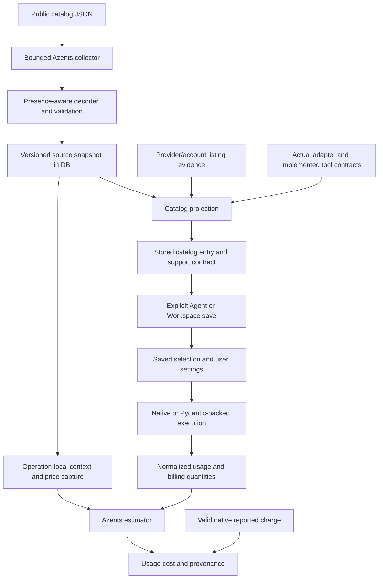

# Evidence-Backed Model Support Design

- Snapshot: `capability-261002`
- Reference: `capability-261002/DESIGN`
- Requirements: [capability-261002/REQ](../requirements/capability-261002-evidence-backed-model-support.md)
- Decisions: [capability-261002/ADR-D1–D3](../adr/capability-261002-evidence-backed-model-support.md)
- Design revision: `2`
- Mode: Collaborative; decision owner: requester.
- Implementation evidence baseline: `602b1720e4cc707d4326113273fa7349b7bbbd0b`.
- Historical comparison: pre-cutover `5e39a0484cd0d378a5143cc9c9ba4b7dfa26bb08`, cutover `13aac68a450c53cb10062f7f177d29e3f0efbe65`, cleanup `4d9178876057511b12da04107b4f75e1d44248f1`.
- Approval: requester approved revision 2 and M1–M13 on 2026-10-02. The requester subsequently requested implementation. This does not authorize PR merge or production operations.

## 1. Outcome and Scope

Use LiteLLM public catalog JSON as the single maintained dataset for model facts and estimated prices. Azents owns collection, interpretation, persistence, catalog projection and cost arithmetic. Native/provider adapters remain execution owners. Provider/account availability and valid provider-returned charges keep their existing higher-authority scopes.

Implement the accepted choices:

1. **D1:** data only, no LiteLLM runtime; remove direct Azents genai-prices authority and estimator.
2. **D2 Option B:** versioned producer-contract interpretation of partial effort flags, with explicit arrays first and no-evidence unknowns retained.
3. **D3 Option B:** one replacement release without a pre-collected source prerequisite. Optional estimates/enrichment may be unavailable initially, while stored catalogs and saved selections remain readable.

No provider/authentication migration, additional generic catalog, automatic model substitution, saved-effort clamping, new batch workflow or new image-model discovery is introduced. Historical documents, executed migrations and recorded costs are not rewritten.

## 2. Current Behavior and Gaps

Current `services/model_metadata_source.py` selects a genai-prices DB source; `core/model_metadata_source.py` persists genai matching and price rules; `core/model_pricing.py` reconstructs and evaluates those rules. System OpenAI/Anthropic/Gemini inventory is source-owned. Other supported conversation providers are integration-owned.

`engine/providers/model_profiles.py` still consults Pydantic OpenAI profiles for native OpenAI/ChatGPT metadata and constructs an incomplete effort set. `services/model_metadata_projection.py` can intersect explicit provider lists with that set. Boolean/list defaults also turn sparse listing omissions into negative evidence. Strict function schemas currently borrow structured-response support, and some tool support derives from prices or model names.

The immediate pre-cutover implementation was already HTTP JSON plus an Azents-owned decoder. Reuse its architectural separation and regression evidence, not its unconditional reasoning baseline, media advertisement, strict-schema conflation, source-match visibility gate or old price fallback policies.

Current cost behavior contains valuable independent guarantees: native-charge precedence, explicit usage inclusion, missing-specialized-rate rejection and operation-local provenance. Retain these guarantees while replacing their source and calculator.

## 3. Design Authority

All material mechanisms below trace to confirmed intent, accepted decisions or retained current contracts. Local identifiers and equivalent helper placement are implementation details, not additional authorities.

| ID | Material mechanism | Authority | Classification |
| --- | --- | --- | --- |
| M1 | One bounded data-only collector and versioned descriptive source snapshot | REQ-4, REQ-7, ADR-D1 | decided |
| M2 | Presence-aware, exact-scope model evidence and provider precedence | REQ-1, REQ-3, ADR-D1 | required |
| M3 | Explicit-array-first, versioned effort interpretation without name inheritance or clamping | REQ-1–3, ADR-D2 | decided |
| M4 | Effective support bounded by actual transport, with unknown/conditional semantics and separate response/tool contracts | REQ-2, REQ-3, REQ-5 | derived |
| M5 | Existing catalog ownership and provider-specific visibility, with price-independent eligibility | REQ-3, REQ-4, current model-catalog Spec | existing |
| M6 | Self-contained saved capability contract and unchanged historical snapshot behavior | REQ-2, REQ-3, REQ-5 | derived |
| M7 | Operation-local context and price capture with saved-limit precedence | REQ-6, current model-catalog Spec | existing |
| M8 | Azents-owned complete-total estimator over typed captured price rules | REQ-6, ADR-D1 | decided |
| M9 | Existing scheduler/admin/attempt/generation lifecycle applied to the new source | REQ-4, ADR-D1, current model-catalog Spec | existing |
| M10 | Direct genai removal with disclosed retained stock usage-counter parsing | REQ-7, ADR-D1 | decided |
| M11 | Immediate replacement with unavailable optional metadata and retained stored projections | REQ-4–6, REQ-8, ADR-D3 | decided |
| M12 | Database writer-contract fencing, pointer integrity and old-producer drain | REQ-4, REQ-5, REQ-8, ADR-D3 | derived |
| M13 | Explicit source/revision diagnostics, failure retention and forward recovery without automatic old-source fallback | REQ-4, REQ-6, REQ-8, ADR-D1/D3 | derived |

M4/M6 require persisted unknown/conditional semantics because booleans alone cannot satisfy REQ-2/3 while saved dispatch remains source-independent. The additive serialization described below implements that requirement; it does not create an independent capability source or a new permission workflow.

M12 must protect the database publication boundary because old binaries do not execute new application checks. Its guards supplement the existing attempt/generation checks, rather than replace them.

## 4. Architecture and Responsibility

The dataset is unified, not the lifetime of every snapshot. A saved capability contract can come from source revision A while a later request captures price revision B. Both remain identifiable; price refresh does not update saved capabilities.

Retain the service/repository transaction boundary: remote source/provider I/O occurs outside database transactions; repositories own publication and generation fencing. Normal picker reads, save resolution and dispatch never collect remote metadata.

## 5. Source Contract and Collection — M1/M2/M9

### 5.1 Source identities

Use a new source identity distinct from retired `genai_prices`:

- source key: `litellm_catalog`;
- source kind: `litellm_json`;
- source schema: `1` under that distinct identity;
- conversation projection schema: `2`;
- capability contract version: `2`;
- independently versioned source interpreter and estimator revisions.

These names can change before implementation if repository naming requires it; their separation, versioned meaning and database predicates must remain equivalent. Never relabel a genai payload as a LiteLLM snapshot or direct old readers to a new incompatible payload.

Reuse generic source persistence. New provenance records source URL, fetch time, raw document digest, canonical content digest, interpreter/schema revision and available publisher revision/ETag. The publisher may not expose a semantic version. A content-derived data revision is truthful; an installed LiteLLM package version is not. Collection time is excluded from content-deduplication identity.

### 5.2 Bounded collection

The collector uses the public JSON URL through the existing controlled-source configuration boundary. Replace the direct genai URL configuration with the new generic source URL; do not keep a legacy alias. Source data cannot change fetch endpoints, credentials or runtime provider endpoints.

Enforce explicit timeout, response-size and JSON-shape limits. Reject duplicate object keys and invalid numeric values in consumed fields. No downloaded code, helper module, expression or source regex is executed. The official schema and pinned upstream examples are development fixtures; production consumes JSON through Azents's versioned decoder rather than downloading a new parser.

Exclude `sample_spec` and `fallback_generalizations` from model counts and candidates. Unrecognized optional descriptive fields are not false facts. Invalid mandatory identity or malformed consumed structures reject source publication with bounded diagnostics and retain the previous new-source snapshot. Recognized but unsupported price rules are recorded as unsupported evidence so they cannot silently disappear from a purported complete estimate.

Preserve enough source evidence to reproduce consumed facts, including field presence and exact source keys. Uninterpreted payload data remains an ingestion/provenance blob, never an input to model construction, tool execution or pricing arithmetic.

### 5.3 Typed source records

The canonical contract contains:

- exact source provider/hosting/API namespace and source model key;
- source-declared aliases/relationships, with explicit scope;
- display, lifecycle, endpoint and modality facts when supplied;
- presence-aware capability facts, exact effort arrays, per-level flags and explicit defaults;
- independent input/output limits, without inventing an ordinary/default input window;
- typed price rules, required dimensions, and unsupported-rule diagnostics;
- references to source/interpreter provenance.

The domain decoder distinguishes **absent**, **explicit null**, **valid value**, and **invalid value** before constructing effective capabilities. Explicit null is field-level unknown, not an opt-out default. Type-invalid consumed declarations do not become an apparently valid narrowed list.

Exact lookup and source-declared aliases must preserve host/API scope. A source namespace prefix can be removed only by the explicit provider adapter's identity mapping; arbitrary path stripping, fine-tune normalization, family regex inheritance and direct-provider facts transferred to cloud/OAuth routes are excluded. Conflicting canonical source identities reject the affected system projection rather than selecting an arbitrary winner. An ambiguous optional enrichment for an integration candidate is diagnosed as unknown and does not hide that provider-visible model.

## 6. Evidence Merge and Effective Support — M2/M4/M5

Do not reuse default-filled `ModelCapabilities` as evidence that a provider supplied false or an empty list. Each listing adapter emits a typed evidence mask/value contract from fields actually returned. The same distinction must survive candidate serialization and replay.

Merge at the semantic-field level:

1. Exact provider/account declarations own their documented scope. Explicit false and empty are decisive for that fact.
2. Exact adopted source facts fill absent provider fields. A complete lower-authority list does not narrow a richer higher-authority list.
3. Versioned source-contract derivation applies only in its verified scope, with separate provenance.
4. Actual wire support, implemented content lowering and registered executors constrain effective selectable support.
5. Unknown evidence remains unknown internally; conservative effective authorization is not relabeled as an explicit model denial.

Related facts must remain coherent: an empty effort list means no advertised effort control, not necessarily no internal reasoning. Contradictory source reasoning denial and positive efforts produce diagnostics and no fabricated union. A stronger account declaration can resolve a weaker source conflict within its exact scope.

### Concern-specific rules

- **Function tools:** require model evidence plus an implemented function-call route.
- **Strict function schemas:** derive from the actual provider/endpoint schema contract and known function support, not `supports_response_schema`.
- **Structured responses:** independent model evidence plus actual response-format lowering. New title-generation decisions consume this field, not strict-function support.
- **Parallel calls:** source/provider declaration plus actual function/tool-mode constraints; SDK field presence alone is not an all-model guarantee.
- **Native web:** descriptive model/tool evidence plus implemented configurable tool ownership, never a web-search price key.
- **Client image generation:** retain code-owned client-tool authorization; provider-hosted image denial does not deny the separate client executor.
- **Media:** expose only implemented input/output paths. Source audio/video flags do not implement native rich-file lowering. Visual PDF requires the established route-specific vision/file contract, not cross-host inference.
- **Parameters:** distinguish wire support from model support. Native Responses does not advertise stop/top-k; temperature/top-p wire support does not establish model acceptance.
- **Limits:** positive explicit input/output maxima retain their meanings. Missing/zero/ambiguous legacy `max_tokens` does not become an invented input/output/context limit. The existing effective default-from-maximum rule can remain at runtime without writing it as an explicit source default.
- **Execution options:** existing reviewed Fast/Ultrafast rules and account service-tier declarations remain separate. A price tariff does not authorize an execution option.

### Provider matrix

| Provider route | Inventory/evidence boundary |
| --- | --- |
| OpenAI API | System source inventory; exact native Responses/text eligibility and descriptive facts. No Pydantic model-profile capability lookup. Unknown eligibility cannot be proved by model-name prefix. |
| Anthropic API | System source inventory; exact source facts and actual Anthropic lowering, not universal effort support from reasoning=true. |
| Gemini API | System source inventory; exact source facts and implemented Google route; no audio/video advertisement without lowering. |
| ChatGPT OAuth | Account candidates and explicit account arrays/limits/tools first; only exact verified ChatGPT-source enrichment. No native OpenAI name-policy substitution. |
| xAI API / OAuth | Listing visibility; consume returned context/reasoning/search metadata where present, preserve omission/false/empty, then exact scoped enrichment. Keep client Imagine distinct. |
| Kimi OAuth | Preserve provider-visible IDs and image evidence. Empty effort control does not become low/medium/high because internal reasoning exists. |
| Bedrock | Preserve account/region inventory and actual Bedrock API namespace. No generic-source match visibility gate; no direct Anthropic facts borrowed by name. |
| Vertex | Preserve project/location inventory and actual Google/Anthropic protocol scope. Sparse defaults do not erase evidence; direct Gemini/Anthropic rows are not cloud authority. |
| OpenRouter | Account-visible IDs and declared restrictions, including literal publisher paths and empty sets. Compatible transport does not imply every OpenAI capability. |

Image-generation catalog purpose and reviewed explicit image-model registry remain unchanged. Existing freshness sorting may use model identifiers for presentation; it must not become capability evidence.

## 7. Versioned Effort Interpretation — M3

Interpretation provenance identifies the pinned producer semantics and Azents rule revision. Upstream changes require decoder/fixture review, not automatic executable-helper adoption.

Order:

1. Preserve complete exact account/provider lists in their scope.
2. Within a source record, explicit `supports_reasoning=false` is terminal: produce denied reasoning control with a known empty supported-effort set, and do not enter array or flag-default evaluation. If positive flags or a nonempty array contradict that denial, retain a conflict diagnostic rather than unioning or enabling their values. A stronger account/provider declaration is resolved separately by the precedence in step 1; this terminal rule governs the lower-authority source record itself.
3. A valid `reasoning_effort_levels` array is authoritative over per-level flags, including `[]`. Preserve every supported canonical value and do not add a baseline to an exact array.
4. A null/invalid array is not omission; retain unknown/error diagnostics instead of falling through into a claimed complete set.
5. Only an absent array and at least one valid boolean effort flag enable a flag convention. Generic reasoning=true or all-null flags alone do not.

The initially verified default convention is scoped to exact `openai` records on the native OpenAI Responses route and exact `chatgpt` records on the native ChatGPT route. Other routes preserve their exact arrays and explicitly declared values, constrained by their actual lowering; native omission defaults are not transferred to another host without an established route contract.

| Level | true | false | omitted after valid flag gate | explicit null |
| --- | --- | --- | --- | --- |
| none / minimal / low | explicit supported | explicit denied | contract-derived supported (opt-out) | unknown |
| medium / high | no consumed per-level flag | no consumed per-level flag | contract-derived baseline | not applicable |
| xhigh / max | explicit supported | explicit denied | contract-derived not advertised (opt-in) | unknown |

A level that remains unknown is not selectable solely from that unknown, but it does not erase independently known supported values. Track whether the represented effort set is complete. An explicit default effort is independent; never infer default from array order, presence of none, or a generic medium constant.

No model-name cases, bare-name twin inheritance, Azure special cases outside the supported routes, SDK-enum defaults or nearest-effort remapping are copied. Unsupported requested effort follows the existing incompatibility outcome; it is not silently changed.

## 8. Saved Capability Contract, APIs and Runtime — M4/M6

### 8.1 Additive self-contained semantics

Retain existing `ModelCapabilities` fields as effective authorization views. Add a nullable, versioned semantic descriptor for newly projected snapshots. It carries typed support states (`supported`, `unsupported`, `unknown`, `conditional`), effort-set completeness, explicit/default-effort evidence, response-format support separate from strict tools, and any justified parameter/tool predicates. Field names are local choices; these semantics are required.

The descriptor is not a second writable authority. The producer derives and validates the existing boolean/list views from it once. User input continues to select stored integration/model IDs; users do not submit source facts or mutate these derived fields. Store raw source evidence/provenance with the catalog projection separately from the bounded semantic contract needed by dispatch.

Unknown evidence renders existing optional controls conservatively; no new unknown-state configuration mode is added. Known subsets remain selectable where individually justified. A conditional support claim includes the predicate needed to validate it; it is not represented as unconditional true.

### 8.2 Historical selections

Absence of the new descriptor identifies a historical selection. Decode and preserve its existing semantic behavior; do not synthesize current evidence, query a new catalog, or rewrite its stored JSON on reads. The explicit saved-selection preservation requirement authorizes this historical decoding boundary, not a legacy metadata source fallback.

New explicit selections copy the complete stored versioned contract. Existing selections are enriched only through the normal explicit reselection/save flow. Agent/Workspace comparison, candidate-chain resolution, context display and diagnostics must not accidentally treat additive decoding as a user change.

New structured-response consumers use the new separate field. Historical consumers retain the historical contract where needed rather than reclassifying old strict flags as new source facts. No new projection may use the old conflation.

### 8.3 Dispatch and conditions

Native OpenAI lowerers receive saved semantics directly and never invoke Pydantic profiles or mutable source lookups for capabilities. Pydantic-backed construction retains actual library formatting/protocol behavior; normalized saved support and tested adapter options must not be silently overridden by missing stock model knowledge.

For new contracts, resolve effective effort from explicit request then a known saved model default. Omission is not none. Enforce a conditional parameter only when its predicate is justified and captured. Do not switch reasoning off, drop an explicitly selected parameter or clamp effort to make a request legal. Unknown model sampling in the adopted OpenAI JSON remains unknown; reasoning=false or none support does not establish affirmative sampling support. Existing historical behavior is not retroactively changed by new metadata rules.

Where incompatible combinations can be requested through existing interfaces, validate with the same saved contract at selection/profile preparation and lowerer entry. Do not add new sampling controls solely for this redesign.

API work is additive: catalog/selectable-option/Agent/Workspace responses carry the new semantic descriptor where their existing model-selection shape exposes capabilities. Regenerate OpenAPI clients using the repository workflow. Update the current UI consumers to use effective support/conditions without changing the integration-first workflow. Authorization, pagination, stale/empty states, image settings and existing processing-speed exclusivity remain unchanged.

## 9. Local Context and Pricing Capture — M7

`ModelMetadataService` captures only the selected new source. With no new source, return a typed absent capture, not a genai/package fallback. Known saved maxima avoid capture; missing maxima can use exact scoped new-source evidence with the existing provider-default floor and final fallback behavior.

Capture one immutable pricing record per operation, including source snapshot/hash/key, interpreted rules, estimator revision and aware request time. No post-response rematching or new-source lookup is allowed. A foreground/lightweight budget retains its shared capture behavior; list display capture remains bounded as today.

Keep the literal execution identity separate from source lookup identity. Missing/ambiguous price match is unavailable, not a reason to change the selected model or hide a provider-visible entry. Already recorded prices and provenance are not recalculated.

## 10. Azents Price Evaluator — M8

Use typed rates and explicit billing dimensions, not a producer library API. Source values are USD per named unit; token rates are per token, not genai's former per-million unit. Parse rates deterministically and use decimal arithmetic before the existing finite output conversion.

### 10.1 Accounting

- Honor explicit prompt/cache and output/reasoning inclusion flags from normalized usage.
- Partition ordinary input, cache reads/writes and directed media once; reject negative remainders and inconsistent TTL partitions.
- Keep the existing ordinary-output tariff behavior for reasoning when no separate reasoning tariff applies; do not require a separate reasoning price universally.
- Do not generalize that rule to separately identified cache/media/tool quantities: those need their applicable specialized rates.
- Explicit finite zero can be valid. Boolean, negative, NaN/infinite or malformed amounts are invalid; missing is not zero.
- A valid finite nonnegative native charge, including zero, wins under the existing charge-validation policy.

### 10.2 Bounded rule vocabulary

Normalize exact rate base names, longest first. In particular `cache_creation_input_token_cost_above_1hr` is a TTL tariff, not a context threshold. Supported metric families include ordinary input/output, cache read/write, explicit TTL writes, separately priced reasoning and directed audio/image token counters.

For a supported base, consume the bounded vocabulary `BASE [TIER] [above_THRESHOLD_tokens] [TIER]`, where at most one unambiguous semantic tier is present. Accept both observed tier/threshold orders. Named tariffs are standard, priority, flex, batches and ultrafast, but a tariff is used only with trustworthy existing billing evidence. No batch workflow is added.

Select a whole-request context bracket at the highest threshold strictly below the captured context count. Use a supplied valid billing-context input count when present; otherwise use normalized inclusive prompt tokens, including cache tokens, rather than uncached prompt tokens. Equality stays in the lower bracket. Do not assume progressive marginal pricing. Select rates within the applicable service tier; do not replace a missing premium rate with Standard. Unchanged metrics may retain an explicitly applicable same-tier base rate only under the modifier contract.

Off-peak rules use captured request time: UTC hours, start-inclusive/end-exclusive, overnight OR semantics and equal endpoints meaning full day. Weekday matching uses the current instant's calendar day in the declared IANA weekday timezone, default UTC; it does not move the UTC hour window. Override only specified rates. Do not overwrite an explicit one-hour cache tariff with a general write override. Invalid required timezone/window rules are unavailable, not silently repaired.

Directed search prices preserve per-query versus per-thousand-call units. If search-context size is unknown, only equal low/medium/high rates permit a context-independent estimate. A code-interpreter output item is not a billed session, and text tokens do not determine image dimensions, seconds, geography or residency.

### 10.3 Complete totals and source limits

When a used component/rule has missing rates, unknown dimensions or unsupported semantics, return the existing typed unavailable outcome for the whole total. Do not publish a misleading token-only subtotal. Preserve safe reason categories such as source unavailable, model unmatched, invalid usage/price, unsupported tier/rule and unknown billable component.

The adopted dataset does not provide arbitrary effective-start-date schedules equivalent to genai fixtures. Current captured rates remain usable for current dispatch; retrospective price discovery is not introduced. Retained snapshots explain already captured estimates, not prices absent from those snapshots.

The inspected data contains no real model record with a file-search call tariff. A billable file-search quantity without applicable rates or a native charge therefore remains unavailable. The model/tool stays usable. Never infer a capability from a price field.

## 11. Synchronization and Diagnostics — M9/M13

Retain system scheduler/admin ownership, six-hour scheduled refresh, existing integration creation/configuration/explicit/stale triggers, cooldown/backoff policy, credential failure classification and configuration-generation fencing. Integration sync captures the new source locally but does not collect it.

The first source fetch uses the normal scheduled or administrator path; startup and migrations do not fetch. Under D3, deployments may initially have no new source. System catalogs retain their current projections until a valid source is available. A new integration projection may publish provider-visible facts without optional source enrichment; it must carry the new projection contract.

After a successful new-source snapshot exists, transport/schema/material-reduction failure retains that source and current catalog projections. Keep current reduction guard outcomes; count valid model records separately from non-model entries and aliases so counts remain meaningful. Invalid interpretation is not represented as a successful empty catalog.

Provenance/fingerprints include source identity/schema/hash, interpreter revision, capability-contract/projection version, actual adapter/policy revision and applicable runtime dependencies. Native OpenAI does not require a Pydantic model-profile fingerprint. Retired genai producer version is not new source provenance. Actual transitive usage-parser dependencies can remain truthful runtime dependency diagnostics, not price authority.

Diagnostics distinguish source absence during transition, update failure with last-good data, source conflict, field unknown, unsupported price dimension, stale projection and incompatible old writer. Logs contain counts, bounded keys and safe categories, not credentials, full provider responses or downloaded payloads. Existing API readiness does not require successful remote catalog collection.

## 12. One-Release Transition and DB Fence — M11/M12

### 12.1 No prepared production source

The migration and new release do not require a successful JSON fetch or customer model listing. They retain old catalog current pointers, entries, saved selections and recorded costs. They clear only the retired genai source authority's current pointer and establish the new source identity with no current snapshot. No payload decoding or historical cost calculation occurs in the migration.

New operations then use only the new source. Until collection succeeds, estimates are source-unavailable and missing-limit enrichment follows the existing no-source policy. Old stored projections are historical read data, not an active genai evaluator. There is no shadow runtime mode, dual-source read or automatic fallback.

### 12.2 Writer admission and pointer validation

Implement DB-enforced compatibility checks in addition to app locks/CAS/generation checks:

- Freeze the retired `genai_prices` authority after clearing its current pointer. Reject its new insertion/update/deletion and reject new or updated genai source snapshots. Retain old source payloads/attempts as inert history.
- Admit new source snapshot writes only for the new key/kind/schema; a non-null new authority pointer must reference that same contract.
- For conversation catalog candidates, require projection schema `2`, no active genai provenance, and a matching new source reference when supplied. System candidates require a new source; integration candidates may have no source. Image-generation purpose is exempt from this conversation rule.
- On **change** of a conversation catalog's current pointer, verify target existence, catalog ownership, projection schema and source contract. Allow an unchanged old pointer while updating latest-attempt/operational fields. Do not allow clearing a successful pointer as a bypass.
- Candidate reuse must be checked at pointer publication: the old repository can publish a pre-existing snapshot without INSERT, so insertion-only or new-code-only validation is insufficient.
- Retired source attempts may report bounded failure but may not record new successful publication after cutover. Current compatible attempts retain their normal lifecycle.

The migration takes the relevant table locks in a documented fixed order and installs the contract atomically. It terminalizes in-progress retired source attempts with an explicit migration diagnostic, without fabricating replacement success.

### 12.3 Pointer and deletion integrity

Current source/catalog current pointers lack relational FKs. Add deferred `NO ACTION` pointer FKs and enforce owner/type checks through the publication guard. Preflight existing pointer consistency; fail visibly on inconsistent data rather than deleting or nulling catalog pointers.

Deferred existence checks must allow the existing transaction that replaces a pointer then deletes the old snapshot, and parent integration/catalog deletion cascades. Prevent deleting a currently referenced snapshot and prevent source deletion from stripping provenance through the current source FK's `SET NULL` behavior. Retain retired source authority/snapshots for this cutover; do not introduce a new purge operation. Do not blanket-prohibit deletion of every superseded catalog snapshot.

Keep nullable historical genai provenance columns/values inert where needed for old rows and rollout-safe reads. New projections leave them null and use generic source/adapter provenance. Removing active genai authority does not require deleting factual historical vocabulary or breaking old ORM reads prematurely.

### 12.4 Old readers, saves and in-flight requests

DB write guards cannot prevent an old binary from ignoring additive capability fields or evaluating an already captured in-memory price record. The release procedure must therefore drain old save/dispatch producers and retire old collectors/publishers before version-2 projections are exposed to request-serving binaries. Do not promise arbitrary mixed-version application execution is safe.

Use one release's deployment ordering, not a pre-collected source phase: drain/stop old producers, apply the SQL-only migration, activate the new request and sync producers, and let normal refresh collect data. Existing in-flight requests may complete with the evidence captured before the switch; do not rebind them midway. Static persisted catalogs and saved selections survive restart. The design does not promise zero application rollout interruption.

Do not drop historical columns while an old ORM reader remains active. If the deployment system cannot enforce producer drain/ordering, it is a rollout blocker; database triggers alone are not a substitute. This must be verified in release preparation, not discovered through production mutation during design.

### 12.5 Recovery and rollback

Normal recovery is retry/administrator refresh or a corrected forward release. A first-fetch failure leaves catalogs readable and optional costs unavailable; later failure retains the last good new source. No genai automatic fallback is available.

A binary-only rollback after writer-contract migration is not supported: old writers are deliberately rejected and old readers cannot safely interpret new semantics. The migration's default downgrade rejects authority reversal without partial guard removal. Emergency return to an old release requires separately authorized, stopped/drained producers and a verified matching schema/data restoration procedure, typically the corresponding pre-transition backup. Do not silently reactivate retained genai rows. This follows the existing explicit/irreversible migration convention rather than adding an automatic rollback mode.

## 13. Removal and Replacement

| Existing unit/behavior | Removal authority | Replacement or remaining authority | Boundary / absence verification |
| --- | --- | --- | --- |
| Direct genai dependency and imports in source/price modules | ADR-D1, REQ-7 | JSON collector, typed source records, Azents evaluator | Remove direct manifest/import/call references; transitive stock counter parser explicitly remains |
| `UpdatePrices.fetch`, genai URL config and active `genai_prices` selection | ADR-D1/D3 | New controlled-source configuration/key | No alias or fallback; retired DB authority frozen |
| genai snapshot reconstruction and price matching/evaluation | ADR-D1, REQ-6 | Captured exact-scope source records and typed price rules | Poison old price APIs in runtime tests; recorded historical costs unchanged |
| Native OpenAI capability extraction from Pydantic profiles | REQ-1/2, ADR-D1/D2 | Evidence merge plus native wire contract | Native producer/dispatch profile lookup poison tests |
| Profile-ceiling intersections over explicit provider arrays | REQ-1/3 | Presence-aware per-field precedence | Account arrays and explicit empty survive JSON roundtrip and request tests |
| Response-schema/strict-tool conflation and price-derived tool support | REQ-2 | Independent facts and implemented route/executor contracts | Separate positive/negative fixtures and session-title consumer tests |
| Default-filled sparse evidence and unsupported media/parameter inference | REQ-2/3 | Explicit evidence states plus implemented transport constraints | Sparse/false/null/empty matrix, no unimplemented media/control claims |
| Old active source/projection provenance assumptions | ADR-D1/D3 | New source/contract revisions and DB guards | New rows cannot cite genai authority; old history retained, not relabeled |
| Old authoritative normalization tests | REQ-8 | New source-contract assertions plus retained lifecycle/snapshot tests | Document intentional differences; no blanket restoration of old behavior |
| Old primary source/runtime requirements | Confirmed new Requirements | This new immutable development snapshot after implementation | Do not edit implemented predecessor documents |
| Current Living Spec and generated clients | REQ-2/4/8 | Implementation-aligned Spec and generated schema | Update during implementation, not as if this Design already ran |

Retain the unmerged provider-parity fixes by intent and test coverage, not blind cherry-pick. In particular retain sparse-listing, Kimi/Bedrock/Vertex/OpenRouter/ChatGPT evidence cases and strict-schema separation; exclude the earlier per-model OpenAI web allowlist mechanism.

## 14. Test Strategy

### E2E-first product matrix

Use deterministic provider/source fixtures to test system and integration catalog refresh -> stored picker -> explicit Agent/Workspace save -> supported controls -> actual adapter/mock-provider request -> usage/cost reporting. Refresh source afterward and prove saved selection JSON/settings are not changed. Cover source absent, last-good after failure, explicit empty listing, stale, failed-without-snapshot and generation mismatch. Preserve image-generation purpose and processing-speed exclusivity.

The test substrate is needed for synthetic OAuth/account lists, provider responses, source errors and seeded migrations without real credentials. Mock transport proofs are protocol evidence, not claims of live model acceptance. Optional live provider tests can supplement but cannot replace required deterministic CI.

### Source/effort fixtures

- Exact array including all seven values; exact empty; sparse flags; explicit false; null versus omission; invalid enum/type; all flags null/no flags; conflicting declarations.
- Explicit reasoning=false with only a negative effort flag must terminate with no efforts, never enter baseline derivation; a contradictory positive list/flag produces a diagnostic without enabling controls. Stronger exact account evidence remains a separate precedence case.
- Flag-gated opt-out/opt-in rules in accepted scope; contract-derived versus explicit provenance; no flag-default transfer to other hosts.
- Canonical/alias identity and collision cases; non-model top-level keys; no fallback regex execution.
- Catalog -> saved selection -> SDK request preservation of xhigh/max; no native Pydantic profile lookup; no mutable metadata lookup on dispatch.
- Unknown sampling, separate strict/structured/parallel support, implemented PDF/media boundary, client versus hosted image and web independent of prices.

### Estimator fixtures

- Per-token versus per-million units; explicit zero versus missing; finite/nonnegative validation.
- Inclusive/exclusive cache and reasoning equality; TTL partition mismatch and negative remainders.
- Exact context threshold/equality; both suffix orders; one-hour cache base distinct from token threshold; missing premium cache tariff.
- Normal/overnight/all-day UTC windows, weekday timezone boundary, invalid timezone, partial off-peak override.
- Search-context ambiguity/equal tariffs; correct per-query/per-thousand units; missing file-search fee; session/media dimensional unknowns.
- Valid native charge precedence including zero; invalid-charge behavior; immutable captured-rule/time replay after source refresh.
- Unsupported historical-date rule is not silently converted to current price; previously recorded costs stay unchanged.

### Migration and concurrency fixtures

- Upgrade populated old-only DB with no network and no new source. Old catalogs/selections remain byte-stable; new source absent is accepted.
- Execute old SQL shapes for begin-attempt, source dedup/reuse, candidate INSERT and reused-candidate pointer swap. Verify rejection and last-good preservation.
- New system requires correct source; new integration permits null source with schema2; image purpose remains valid.
- Cross-catalog/nonexistent/old-schema pointer, pointer clear, current-snapshot deletion and source-provenance stripping are rejected.
- Unchanged-pointer attempt update, valid replace-then-delete and parent cascade deletion succeed.
- Concurrent migration/old writer, source CAS, attempt supersession and integration generation races are synchronized deterministically.
- In-flight captures and old save/dispatch drain are explicit release-compatibility tests; a no-op price calculation test is not a substitute.
- Unsafe downgrade rejects before partially removing guards.

### Dependencies and evidence

Poison genai cost/updater entry points while running stock provider mock streams; allow and count expected bundled usage extraction. Azents must ignore upstream computed cost in favor of its captured evaluator/native charge. Check direct dependency removal without asserting absence from the transitive graph.

Fixture manifests record source bytes/hash, interpreter/schema revision, provider response version and deterministic expected outputs. CI artifacts include validation results, normalized field/provenance diffs, saved-selection before/after comparison, mock request bodies without secrets, numeric estimator expectations and migration SQL-state outcomes. Run configured Ruff, formatting, type checking and focused pytest, generated-client checks and relevant E2E before shipping. Missing live credentials only skips optional live tests; required fixture/schema/wire failures fail CI.

## 15. Requirement-Level Feasibility

| Requirement | Static evidence and conclusion |
| --- | --- |
| REQ-1 | Old owned decoder and current richer listing/source fields show recovery is possible; actual wire tests remain implementation gates. Feasible with explicit unknowns. |
| REQ-2 | Existing separate native lowerer and provider adapters expose real wire/tool boundaries. Sampling/model support gaps remain unknown, not a blocker requiring another source. Feasible. |
| REQ-3 | Source presence states and candidate raw fields are available; current boolean defaults must not be used as evidence. Additive saved semantics preserve distinctions. Feasible. |
| REQ-4 | Existing source/attempt repositories and catalog pointers support stored publication. New schema/pointer DB predicates and integrity tests are required. Feasible at schema-design level; not yet executed. |
| REQ-5 | Current stored-entry save and snapshot dispatch already provide the right ownership. Descriptor absence preserves historical behavior; old-producer drain prevents stripping new fields. Feasible with stated rollout precondition. |
| REQ-6 | Current usage IR has explicit inclusion/billing dimensions. Captured JSON has ordinary/cache/context/tier/time rules; unsupported/date/specialized cases are nullable. Feasible within honest source coverage. |
| REQ-7 | Exactly three direct production import boundaries were identified. Stock Pydantic usage extraction remains intentionally transitive; no implicit updater was found in the current direct stream path. Feasible for the approved scoped removal. |
| REQ-8 | Commit-pinned ten-provider historical matrix, old/current tests and concrete old SQL write shapes identify restoration/exclusion obligations. One-release no-prefetch path is structurally feasible. |

This is static feasibility, not passing implementation or migration evidence. No live account, cluster, database, authentication or inference operation was performed for the design. Executable migration/adapter/E2E proofs are release acceptance gates, not claims already satisfied.

### Evidence Index

Repository evidence is pinned to the baseline commit above:

- Source and local capture: `services/model_metadata_source.py`, `services/model_metadata.py`, `core/model_metadata_source.py`, `repos/model_metadata_source.py`.
- Projection and snapshot save: `services/model_metadata_projection.py`, `services/llm_catalog/__init__.py`, `services/model_candidate_selection.py`, `core/llm_catalog.py`, `core/agent.py`.
- Persistence and old candidate reuse: `rdb/models/model_metadata_source.py`, `rdb/models/llm_catalog.py`, `repos/llm_catalog/__init__.py` (candidate reuse and pointer publication).
- Runtime and costs: `engine/providers/model_profiles.py`, `engine/providers/model_factory.py`, `engine/events/openai_responses.py`, `engine/events/pydantic_ai_adapter.py`, `engine/events/pydantic_ai_output.py`, `engine/events/model_usage_pricing.py`, `core/model_pricing.py`.
- Historical source/normalizer/lifecycle tests: the pre-cutover `services/llm_catalog/source_metadata.py`, `source_sync_test.py`, `system_projection_test.py`, `integration_projection_test.py`, and `core/model_pricing.py`.

Paths in this list are relative to `python/apps/azents/src/azents/`. The historical and current test assertions are evidence of behavior, not proof that every old advertised feature was provider-valid.

The reviewed upstream data contract is pinned to LiteLLM commit `615ed7900f3bcfd09b324c38c5123eb6ed4769da`:

- [Catalog JSON](https://github.com/BerriAI/litellm/blob/615ed7900f3bcfd09b324c38c5123eb6ed4769da/model_prices_and_context_window.json).
- [Published JSON schema](https://github.com/BerriAI/litellm/blob/615ed7900f3bcfd09b324c38c5123eb6ed4769da/model_prices_and_context_window.schema.json).
- [Effort interpretation evidence](https://github.com/BerriAI/litellm/blob/615ed7900f3bcfd09b324c38c5123eb6ed4769da/litellm/router_utils/reasoning_effort_capability.py).
- [Time-window interpretation evidence](https://github.com/BerriAI/litellm/blob/615ed7900f3bcfd09b324c38c5123eb6ed4769da/litellm/litellm_core_utils/llm_cost_calc/utils.py).

The source JSON digest inspected was `d0b0717de0d1f9cade95ee4ef528f9d7004160401e611f485bf21cf48bdd5b59`. These references justify reviewed descriptive semantics, not importing upstream executable behavior. Applicable redistribution notices must accompany any bundled fixture/data copies.

## 16. Delivery and Operational Risks

Implementation can be reviewed as cohesive units (source/evidence contract, projection/saved consumers, estimator, DB fence and cutover, verification/spec cleanup), but must ship as one replacement release under D3 rather than exposing a production shadow mode. A shipping plan must cite M1–M13 and may not introduce a new source, default, fallback or rollout mode.

Remaining non-blocking risks: upstream optional-field growth, incomplete exact capability/price data, stale source facts, preserved historical selections with old semantics, and short-lived optional-metadata unavailability after replacement. Each has an explicit unknown, last-good, saved-snapshot or diagnostic boundary. If old-producer drain cannot be enforced, that is a deployment blocker, not permission to weaken the contract.

## 17. Design Approval

- Mode: Collaborative.
- Decision owner: requester.
- Approved on: `2026-10-02`.
- Approved Design revision: `2`.
- Approved authority IDs: `M1, M2, M3, M4, M5, M6, M7, M8, M9, M10, M11, M12, M13`.
- Scope: data-only unified catalog/pricing; versioned source interpretation and saved support semantics; direct genai removal with retained usage parser; immediate no-prefetch replacement with DB writer fencing and producer drain; stored-read/selection/cost guarantees and deterministic verification.

The requester approved this complete revision after authority and feasibility review and then explicitly requested implementation. Implementation plans must preserve this exact authority set and report Design delta: None. PR merge and production operations remain separate authorization boundaries.

### Revision record

- Revision 1: complete initial mechanism set M1–M13.
- Revision 2: authority-preserving semantic correction makes explicit source reasoning denial terminal before flag defaults, and fixes the context-bracket counter definition. Mechanism IDs and accepted authorities are unchanged.
