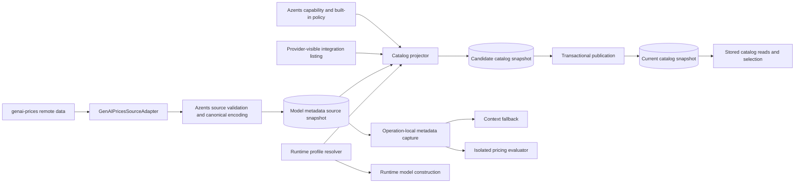

# Runtime-Aligned Model Metadata Design

- Snapshot: `catalog-261001`
- Document reference: `catalog-261001/DESIGN`
- Requirements: [catalog-261001/REQ](../requirements/catalog-261001-runtime-aligned-model-metadata.md)
- Decisions: [catalog-261001/ADR](../adr/catalog-261001-runtime-aligned-model-metadata.md)
- Mode: Collaborative
- Decision owner: Requester

## Summary

Azents replaces the remaining LiteLLM-shaped model metadata authority with an Azents-owned, durable source built from the Pydantic ecosystem's `genai-prices` data and one shared runtime model-profile resolver. `genai-prices` supplies independently refreshed model identity, context, lifecycle, matching, and pricing evidence. The shared resolver supplies the execution compatibility contract actually used by native OpenAI and Pydantic-routed provider construction.

The existing scheduler, Admin operations, source attempts, last-success behavior, system and integration catalog snapshots, stored read paths, saved Agent selection semantics, context fallback, and cost provenance remain. The transition is staged: build and validate shadow source and candidate projections, switch readers and catalog pointers explicitly, reproject existing integration catalogs without requiring provider calls, then remove every active LiteLLM schema and runtime identity.

## Current Behavior and Requirement Gaps

The current system already has the correct lifecycle shape:

- `model_catalog_system_projection` runs every six hours and the Admin API can refresh all or one system catalog.
- Source collection records a source-only sync attempt, serializes publication with a PostgreSQL advisory transaction lock, validates a remote payload, rejects superseded or materially smaller results, and retains the latest successful source on failure.
- System and integration projections are stored snapshots. Normal reads return stored state and never fetch metadata or provider listings.
- Integration sync owns throttling, retry, stale refresh, configuration-generation fencing, and customer-credential failure classification.
- `ModelMetadataService` captures one local source snapshot for context fallback and per-dispatch pricing provenance.
- Saved Agent and Workspace model selections copy normalized capabilities and do not follow later mutable catalog rows.

The gaps are:

- The active source table, repositories, services, environment variable, diagnostics, tests, and payload vocabulary remain LiteLLM-specific.
- Capability projection consumes LiteLLM support flags while execution now uses native OpenAI or Pydantic provider models and Azents profile overrides.
- The current pricing decoder is tied to LiteLLM field names rather than the maintained pricing rules in `genai-prices`.
- Pydantic AI can consult its process-global bundled `genai-prices` snapshot for context and best-effort response cost. That implicit state cannot become Azents catalog, context, pricing, or telemetry authority.

## Requirement and Decision Traceability

| Requirement | Design mechanisms | ADR authority |
| --- | --- | --- |
| `catalog-261001/REQ-1` | Shared runtime model-profile resolver and capability normalization | `catalog-261001/ADR-D1` |
| `catalog-261001/REQ-2` | Azents-owned source adapter, attempts, validation, source authority, and scheduler/Admin invocation | `catalog-261001/ADR-D2`, `ADR-D3` |
| `catalog-261001/REQ-3` | Candidate projection, explicit publication, projection fingerprint, and source provenance | `catalog-261001/ADR-D1` through `ADR-D4` |
| `catalog-261001/REQ-4` | Existing system/integration ownership, trigger, retry, fencing, and stored-read paths | Existing Model Catalog Spec plus `ADR-D2`, `ADR-D4` |
| `catalog-261001/REQ-5` | Captured metadata view and isolated pricing evaluator | `catalog-261001/ADR-D3` |
| `catalog-261001/REQ-6` | Existing copied selection snapshots and drift-only catalog updates | Existing Model Catalog Spec |
| `catalog-261001/REQ-7` | Final cleanup boundary and repository/database absence gates | `catalog-261001/ADR-D4` |
| `catalog-261001/REQ-8` | Shadow preparation, transactional cutover, bounded reprojection, and coordinated rollback | `catalog-261001/ADR-D4` |

## Architecture

### Authority boundaries

- **Remote metadata source:** `genai-prices` provider and model data collected by Azents. It is evidence for inventory, matching, context, lifecycle, and pricing, not execution compatibility by itself.
- **Execution compatibility:** `RuntimeModelProfileResolver`, shared by catalog projection and model construction. It owns provider protocol, effective model class, Pydantic provider profile, Azents profile overrides, native OpenAI policy, and implemented native-tool intersection.
- **Integration availability:** the existing authenticated provider listing for the exact integration.
- **Product capability policy:** Azents built-in-tool registry, selectable execution-option policy, provider-specific conservative visibility policy, and media handling implemented by the lowerer and adapters.
- **Durable current authority:** PostgreSQL source and catalog current pointers. Process-local decoded views are caches only.

## Source Collection and Canonical Snapshot

### Direct dependency and public boundary

`python/apps/azents` declares `genai-prices` directly at the version compatible with the pinned `pydantic-ai-slim` release. Azents does not rely on a transitive import contract.

`GenAIPricesSourceAdapter` invokes the public `UpdatePrices.fetch()` operation with the configured source URL and bounded request timeout. Because the operation is synchronous, the scheduler service runs it in an owned worker thread with a bounded wait. It never calls `UpdatePrices.start()`, never installs the result into `genai_prices.data_snapshot`, and never mutates process-global pricing state.

The production default source URL is the public `genai-prices` update artifact. `GENAI_PRICES_SOURCE_URL` can replace it for controlled deployments and deterministic testenv. The setting is operator-controlled, not workspace- or user-controlled. Production accepts HTTPS; deterministic local test configuration may use its existing internal HTTP fixture endpoint.

### Canonical payload schema

The adapter converts the typed `DataSnapshot` into `ModelMetadataSourcePayloadV1`. The persisted representation contains only JSON values and explicitly models:

- source provider ID and bounded provider metadata;
- canonical source model ID and display name;
- model matching expression as a typed `equals`, `starts_with`, `ends_with`, `contains`, `regex`, `and`, or `or` tree;
- nullable context window and deprecated state;
- unconditional or ordered conditional price sets;
- start-date and UTC time-of-day constraints;
- decimal prices, supported billing-unit identifiers, and threshold tiers;
- provider fallback relationships required for supported Azents providers.

The adapter rejects unknown match clauses, malformed constraints, non-finite or negative prices, duplicate canonical provider/model identities, invalid context limits, and billing units that cannot be represented safely. A future upstream field is ignored only when it is outside Azents's declared consumed schema; a future consumed variant requires a schema revision.

The canonical content hash is calculated from stable JSON serialization of the normalized payload. Raw response ordering and non-consumed comments do not create a new source snapshot. Provenance records the remote URL, source kind `genai_prices`, adapter schema version, installed `genai-prices` version, provider count, model count, content hash, and collection time.

### Provider identity mapping

One explicit mapping relates Azents semantic providers to source provider IDs. The initial mapping covers at least:

- OpenAI and ChatGPT OAuth → `openai`;
- Anthropic → `anthropic`;
- Google Gemini and Google-family Vertex models → `google`;
- AWS Bedrock → `aws`;
- xAI API key and xAI OAuth → `x-ai`;
- Kimi OAuth → `moonshotai`;
- OpenRouter → `openrouter`.

The source ID never becomes an execution prefix. Vertex publisher identity and Bedrock publisher/family remain provider-listing and runtime-resolver inputs. Ambiguous provider fallback does not cross an Azents provider boundary unless the mapping explicitly authorizes it.

## Runtime Model Profile Resolution

### Shared resolver contract

`RuntimeModelProfileResolver.resolve()` is a pure, credential-free operation with these inputs:

- semantic `LLMProvider`;
- exact provider model identifier;
- optional publisher and family evidence;
- optional provider-listing capability evidence;
- optional source model record;
- optional saved assembly metadata needed for opaque Bedrock resources.

It returns:

- reviewed native protocol and runtime model kind;
- the partial profile supplied to runtime model construction;
- normalized `ModelCapabilities` and supported execution options;
- projectability/selectability outcome with a diagnostic reason;
- source match identity;
- deterministic resolver revision and projection fingerprint inputs.

### Profile composition

For Pydantic-routed providers, the resolver composes the stock provider/model profile with the same Azents partial profile currently embedded in `ProviderModelFactory`. It also applies the effective model class's supported native-tool intersection. Bedrock retains literal model profile lookup and the current bounded family fallback for opaque resources. Vertex selects Google or Anthropic protocol from its reviewed publisher/model identity.

For OpenAI and ChatGPT OAuth, the resolver applies the same model-family and native Responses policy used by `OpenAIResponsesLowerer`, `OpenAIResponsesModelAdapter`, built-in capability policy, and execution-option resolution. It does not create a fake `ProviderModelFactory` path.

`ProviderModelFactory` and native OpenAI request preparation consume resolver output. Inlined profile construction is removed so runtime and catalog cannot diverge.

The supplied runtime profile explicitly contains the captured or saved `context_window` key, including explicit `None` when unknown. This prevents Pydantic AI from silently filling context from its process-global bundled snapshot. Azents does not use Pydantic AI's best-effort `ModelResponse.usage.cost` as product cost provenance; provider-reported native charges and the captured Azents pricing view retain their existing precedence.

### Capability normalization and precedence

Capability projection applies these rules:

1. Exact semantic provider and model identity select the runtime protocol and model kind.
2. Runtime profile and adapter support define the maximum executable capability set.
3. Explicit provider-listing evidence can narrow support and can fill provider-owned facts not represented by the profile.
4. The source model record fills inventory, context, lifecycle, and pricing facts; it cannot enable an execution capability denied by step 2.
5. Azents built-in-tool and execution-option policy intersects the executable set with implemented product support.
6. Missing evidence leaves the individual capability disabled or unknown according to the existing field contract; it does not hide an otherwise provider-visible integration model.

System catalog candidates additionally pass provider-family and conversation-model hygiene checks. A price record alone is not enough to expose an embedding, image-only, speech-only, or otherwise unsupported model. The resolver returns a typed hidden reason for each rejected candidate.

## Persistence Model

### Model metadata source authority

A new logical authority and snapshot replace `litellm_source_snapshots`:

- `model_metadata_sources`
  - `source_key` primary identity, initially `genai_prices`;
  - `current_snapshot_id`;
  - `latest_attempt_id`;
  - timestamps.
- `model_metadata_source_snapshots`
  - `id`;
  - `source_key`;
  - `source_kind`;
  - `source_schema_version`;
  - `source_url`;
  - `source_hash`;
  - `producer_name` and `producer_version`;
  - provider and model counts;
  - canonical payload JSON;
  - creation time.

`(source_key, source_schema_version, source_hash)` is unique. The authority row makes current source selection explicit rather than inferring it from the latest timestamp. Source attempt rows continue to use `llm_catalog_sync_attempts` with `catalog_id = null`, but their source key, failure codes, messages, hints, and diagnostics become source-neutral.

### Catalog projection provenance

`llm_catalogs` gains a nullable `rollback_snapshot_id` used only during the
approved cutover window. It points to the exact pre-cutover current snapshot for
that catalog and is not returned by normal read APIs. Ordinary publication before
cutover leaves it null. Cutover publication assigns it once while switching the
current pointer; later replacement publications preserve the pinned rollback
snapshot until cleanup.

`llm_catalog_snapshots` gains a nullable replacement source FK during the shadow stage and explicit projection provenance:

- metadata source snapshot ID;
- projection schema version;
- runtime profile resolver revision;
- `pydantic-ai` version;
- `genai-prices` version;
- projection fingerprint.

The projection fingerprint hashes the source snapshot identity and hash, resolver revision, dependency versions, provider projection policy revision, and catalog scope/provider/configuration generation. A source hash match does not suppress reprojection when runtime compatibility or Azents policy changes.

A candidate snapshot is a complete `llm_catalog_snapshots` row with entries that
is not yet referenced by `llm_catalogs.current_snapshot_id`. Ordinary publication
locks the catalog, verifies the candidate fingerprint and any integration
configuration generation, points the catalog to the candidate, and deletes only
superseded snapshots that are not protected by `rollback_snapshot_id`.

Cutover publication additionally requires `rollback_snapshot_id` to be null. It
pins the exact prior current snapshot in `rollback_snapshot_id`, points current to
the replacement candidate, and retains the pinned snapshot and entries through the
entire post-cutover/pre-cleanup window. A catalog with an existing rollback pin
cannot start a second cutover. Obsolete shadow candidates remain deletable.

### Public and persisted entry metadata

The public catalog response shape remains unchanged. `source_metadata` becomes a bounded, source-neutral projection containing fields such as source kind, source provider/model identity, context, and lifecycle evidence. It does not expose the complete price payload or library-specific executable objects. `projection_metadata` records resolver revision, match outcome, conservative hidden reasons, and provider-listing precedence without LiteLLM keys.

Saved Agent and Workspace model selections continue to copy only their existing semantic model snapshot and normalized capabilities. They do not acquire a mutable FK to source or catalog rows.

## Synchronization Lifecycle

### Source synchronization

`ModelMetadataSourceSyncService.sync_current_source()` performs:

1. create a source-only running attempt and mark an abandoned prior running attempt failed;
2. fetch and decode the public typed source outside a database transaction;
3. normalize and hash the payload;
4. lock the source authority by source key;
5. verify the attempt is still latest;
6. compare global and supported-provider counts with the current source to reject a material unexplained reduction;
7. insert or reuse the content-addressed snapshot;
8. move the source authority current pointer and mark the attempt succeeded.

Fetch, validation, supersession, and reduction failures record generic failure codes and safe diagnostics. Logs include source key, versions, counts, hash, elapsed time, and outcome, never payload or credentials.

### System catalog synchronization

The scheduler and Admin service call the same orchestration boundary:

1. synchronize or read the current metadata source according to the operation;
2. enumerate source models for OpenAI, Anthropic, and Gemini through the explicit provider mapping;
3. resolve each model through `RuntimeModelProfileResolver`;
4. apply existing hygiene and product policy;
5. create a complete candidate snapshot with projection provenance;
6. publish it transactionally.

An unchanged source can still create and publish a new projection when the resolver or policy fingerprint changes. Refreshing one system provider does not create a different source authority.

### Integration catalog synchronization

Existing provider listing remains unchanged and authoritative for visibility. Integration projection reads the current source snapshot and resolves every exact provider-visible candidate through the shared resolver.

- ChatGPT OAuth, xAI, Kimi OAuth, and OpenRouter remain directly visible without requiring a source match.
- xAI optional enrichment changes from legacy alias lookup to explicit source match rules and cannot gate visibility.
- Bedrock and Vertex retain provider-visible availability and reviewed exact semantic identity. Runtime profile resolution replaces target-specific LiteLLM match gating.
- Credential/configuration failure, throttling, retry, stale refresh, running recovery, and configuration-generation fencing remain unchanged.

### Normal reads and execution

Picker, Agent, Workspace, and Admin status reads use stored catalog state only. Integration stale refresh remains best-effort background work under the existing policy.

`ModelMetadataService` reads `model_metadata_sources.current_snapshot_id`, captures one immutable snapshot for a logical calculation, and returns a decoded `CapturedModelMetadataSource`. Known saved context maxima continue to avoid source reads.

Per physical model dispatch, pricing capture matches the exact semantic provider/model against the captured source view and freezes the applicable model/pricing evidence. The output normalizers continue to prefer a supported provider-reported charge; otherwise they evaluate the captured pricing evidence. A missing or unsupported rule yields `cost_usd = null` and no fabricated provenance.

Decoded source views may be cached by `(snapshot_id, source_hash, source_schema_version)` in process memory. The cache is bounded and evictable and never changes database authority.

## Staged Migration, Rollout, and Rollback

### Phase 1: foundation and shadow preparation

- Add the generic source authority and snapshot schema and nullable replacement source/projection provenance fields.
- Add the direct dependency, source adapter, shared runtime profile resolver, generic repositories, source service, candidate projection creation, and deterministic fixtures.
- Keep current runtime metadata readers and current catalog pointers unchanged.
- Extend the scheduled system task to collect the new source and create candidate system projections while the existing path still publishes current catalogs.
- Validate source counts, representative capabilities, pricing parity, and candidate completeness in production diagnostics.

No public read or runtime behavior changes in this phase. Rollback is an ordinary application rollback; shadow rows can remain inert or be deleted.

### Phase 2: authority cutover and bounded reprojection

A readiness gate requires a current validated `genai_prices` source and a candidate projection for every system catalog with the expected resolver fingerprint.

The cutover release:

- changes `ModelMetadataService` and runtime pricing capture to the generic source authority with no legacy fallback;
- publishes the prepared system candidates while pinning each exact pre-cutover
  current snapshot as its rollback snapshot;
- changes scheduler/Admin system refresh to the replacement path only;
- changes normal integration projection to the replacement resolver and source;
- runs an idempotent, bounded integration reprojection coordinator.

The coordinator locks one catalog at a time and uses its current entries as the last stored provider-visibility evidence. It re-resolves exact provider/model identities without provider network calls, creates a replacement snapshot, and publishes only if the catalog configuration generation and current snapshot remain unchanged. A concurrently completed normal provider sync wins through the existing latest-attempt and generation rules. Batches continue until every current conversation catalog has replacement provenance.

Before cleanup, a coordinated rollback locks each catalog, verifies that its
rollback pin still names the retained pre-cutover snapshot, repoints current to
that snapshot, deletes replacement current and shadow snapshots, clears the pin,
and deploys the prior source reader. Runtime never performs this fallback
automatically.

### Phase 3: cleanup

Cleanup begins only when queries and API probes prove:

- every current conversation catalog has replacement source/projection provenance;
- no current entry contains legacy source or projection metadata keys;
- runtime context and pricing reads use the generic source authority;
- no active source attempt or current source pointer uses the legacy source key;
- repository search finds no active LiteLLM code, configuration, diagnostic, fixture, or scheduler identity outside factual historical records.

The cleanup migration removes the legacy source table and constraints, old source FK/column, legacy rows and attempts, temporary shadow code, environment variable, failure codes, tests, and fixtures. The replacement catalog source FK becomes the final generic `source_snapshot_id` contract if a temporary migration name was required.

The same cleanup transaction clears every rollback pin and deletes its retained
pre-cutover snapshot only after the final absence and backup gates pass.

After cleanup, rollback requires the matching pre-cleanup database backup and previous application release. Application-only rollback is unsupported.

## Failure, Retry, and Recovery

- Remote timeout, transport, invalid JSON, typed decoding, and schema failures mark the source attempt failed and retain current source and catalogs.
- A newer source attempt supersedes an older completion under the authority lock.
- Material global or provider-specific model-count reduction is quarantined with counts and action guidance.
- Projection failure leaves the current catalog pointer unchanged.
- Candidate publication revalidates source identity, resolver fingerprint, catalog current pointer, and integration configuration generation.
- Runtime with no replacement source after the cutover boundary returns unknown context fallback and estimated price rather than reading legacy state or fetching remotely; the cutover readiness gate prevents this during planned rollout.
- Provider-reported cost remains usable without metadata source availability.

## Security and Permissions

- The source URL is deployment configuration and never accepts workspace or request input.
- Source fetch follows one deployment-controlled HTTPS URL with the public
  genai-prices client's redirects-disabled behavior and bounded request timeout.
  The public client buffers the complete response and does not expose a
  response-size control, so the adapter does not claim one.
- Payload validation occurs before persistence or projection.
- Admin catalog operations retain live persisted `system_admin` authorization.
- Integration listing continues to use the integration's existing credential boundary; metadata source synchronization never receives customer credentials.
- Logs and attempt diagnostics exclude source payloads, model request content, credentials, and provider error bodies.

## Observability

Source collection emits structured fields for source key, source kind, adapter schema, package version, source hash, provider/model counts, previous counts, reduction decision, elapsed time, attempt ID, and result.

Projection emits catalog ID, scope, provider, integration ID when applicable, source snapshot ID, projection fingerprint, resolver revision, fetched/matched/hidden counts, hidden-reason counts, and publication outcome.

Cutover dashboards or reports track:

- source readiness and latest failure;
- system candidate readiness by provider;
- current catalogs by old versus replacement provenance;
- integration reprojection backlog and failures;
- context/pricing unmatched rates;
- forbidden legacy identity counts.

No metric or log treats Pydantic AI's process-global best-effort cost as Azents cost authority.

## Test Strategy

### E2E primary verification matrix

| Scenario | Primary evidence |
| --- | --- |
| Create an integration and wait for automatic catalog sync | Existing required public model-selection E2E, updated to deterministic replacement source fixtures |
| Read, search, select, and save a projected model | Existing integration-first picker/API E2E with replacement capabilities and source-neutral metadata |
| Credential update triggers sync while name-only update does not | Existing required E2E remains unchanged |
| Failed integration sync exposes attempt state and retains a current snapshot | Existing failure E2E plus last-success fixture |
| System administrator refreshes one/all system catalogs | Required Admin API or browser E2E against deterministic source data |
| Runtime context fallback uses the captured replacement snapshot | Required E2E turn marker assertion with source-only context fixture |
| Estimated usage cost carries replacement snapshot provenance | Required event/history E2E with deterministic usage and price fixture |
| Provider-reported cost wins over local estimate | Required deterministic OpenRouter-style fixture or backend integration test when E2E transport cannot report cost |
| Existing saved selection remains unchanged after source/profile refresh | Required E2E that refreshes metadata, rereads the Agent, and executes the saved selection |
| Cutover preserves current reads while replacement candidates are prepared | Upgrade/migration E2E or deployment validation scenario with seeded pre-cutover database |

### E2E plan

The deterministic testenv metadata endpoint serves a bounded genai-prices-compatible fixture through `GENAI_PRICES_SOURCE_URL`. The fixture contains system-provider models, aliases/match expressions, context, lifecycle, basic and tiered prices, and controlled reduction/malformed variants. It does not require public network access.

Required CI runs the normal model-selection suite, Admin system-catalog refresh coverage, context/pricing execution coverage, and one seeded upgrade scenario. Live provider tests are optional diagnostics only; missing credentials skip them, while deterministic fixture failures fail CI.

### Backend and migration verification

- Source adapter golden tests cover every supported match clause, constraint, tier, decimal, provider mapping, and invalid payload class.
- Profile parity tests cover OpenAI native, ChatGPT OAuth, Anthropic, Gemini, Bedrock model IDs and ARNs, Vertex Google/Anthropic, xAI, Kimi, and OpenRouter.
- Source service tests cover unchanged hash, supersession, abandoned attempt recovery, remote failure, malformed source, global reduction, provider-specific reduction, and last-success retention.
- Repository tests cover authority pointers, content-addressed uniqueness, candidate creation, publication atomicity, and integration generation fencing.
- Pricing tests compare supported canonical fixtures with typed genai-prices results and cover concurrent different-snapshot evaluation.
- Migration tests seed legacy source rows, current system and integration snapshots, xAI enrichment metadata, source-only attempts, cost provenance references, and pinned pre-cutover rollback snapshots.
- Cleanup tests assert schema and active-row absence plus repository-wide tracked search exclusions limited to historical documents and executed migration history.

### Fixture and evidence requirements

Fixtures record source schema version, source hash, producer version, provider/model counts, expected capability projections, expected cost results, and expected hidden reasons. Upgrade evidence records pre- and post-cutover current snapshot IDs, source provenance, API read availability, reprojection backlog, and absence-query results.

## API, Client, and UI Impact

Public and Admin route shapes remain unchanged. Existing clients do not require regeneration unless implementation discovers that currently exposed source/projection metadata must be narrowed through a typed response change. Admin and picker copy remains source-neutral and does not mention LiteLLM or genai-prices.

The Admin page continues to show provider-level status and refresh controls. Detailed source and cutover diagnostics remain operational logs, database state, or a separate internal report rather than new end-user controls.

## Assumptions and Non-Blocking Risks

- `genai-prices` public fetch and typed model can evolve. Exact dependency pinning, canonical adapter schema versions, and golden fixtures bound that risk.
- The public source fetch buffers the complete response before decoding. The
  source URL is therefore restricted to the trusted operator-controlled artifact,
  and process/runtime resource limits remain the outer memory bound; a future
  public streaming API can replace this boundary without changing source
  authority.
- `genai-prices` does not provide every modality, output limit, or provider-specific runtime constraint. The shared resolver, provider listing, and Azents product policy supply execution facts; unknown values remain conservative.
- New remote models can arrive before a Pydantic/Azents profile recognizes their complete behavior. System projection can hide a non-projectable model, while provider-visible integration models remain selectable only under their existing conservative policy.
- Post-fetch canonical decoding enforces bounded provider/model counts and process-local pricing-view cache limits. The public fetch still buffers the complete transport response, so these bounds do not claim a transport peak-memory cap. The source task timeout and cache sizing are implementation tuning, not additional authority.
- Foundation, cutover, and cleanup require separate reviewable delivery phases; implementation plans may decompose them but cannot change this Design's authority.

## Feasibility Assessment

| Requirement | Status | Repository evidence |
| --- | --- | --- |
| `REQ-1` | Feasible | Provider profile construction is already centralized in `engine/providers/model_factory.py`; extraction into a shared pure resolver is bounded and OpenAI native policy already has explicit lowerer/adapter boundaries. |
| `REQ-2` | Feasible | Existing scheduler, Admin operations, source attempts, advisory locking, and last-success source logic can be retained; public `UpdatePrices.fetch()` supplies the typed fetch boundary. |
| `REQ-3` | Feasible | Current repository already creates complete snapshots and atomically changes current pointers; candidate creation and explicit publication are incremental repository mechanisms. |
| `REQ-4` | Feasible | Public response shapes, integration trigger policy, throttling, fencing, and stored read paths do not expose the source repository type. |
| `REQ-5` | Feasible | `ModelMetadataService`, `normalize_model_pricing`, and output normalizers already capture snapshot-local provenance; the source view and evaluator can replace the current field decoder. |
| `REQ-6` | Feasible | Agent and Workspace selections already copy catalog capabilities rather than storing mutable catalog FKs. |
| `REQ-7` | Feasible | Active LiteLLM use is bounded to catalog metadata code, persistence, config, diagnostics, and fixtures; executable package/import removal is already complete. |
| `REQ-8` | Feasible | Existing current pointers permit shadow candidates and atomic publication; integration entries provide stored visibility evidence for network-free bounded reprojection. |

No feasibility blocker remains. The principal implementation risk is adapter fidelity for genai-prices matching and pricing rules, addressed by ADR-D3 golden parity fixtures and isolated snapshot evaluation.

## Design Authority

- Design revision: `2`

| ID | Material design mechanism | Authority | Classification |
| --- | --- | --- | --- |
| M1 | Shared credential-free runtime model-profile resolver used by projection and execution | `catalog-261001/REQ-1`, `catalog-261001/ADR-D1` | `decided` |
| M2 | Azents-owned remote source synchronization, attempts, validation, current source authority, and durable snapshots | `catalog-261001/REQ-2`, `catalog-261001/ADR-D2` | `decided` |
| M3 | Replayable versioned genai-prices canonical source contract and isolated operation-local pricing view | `catalog-261001/REQ-2`, `REQ-5`, `catalog-261001/ADR-D3` | `decided` |
| M4 | System catalog inventory from the current source plus runtime resolver and product hygiene | `catalog-261001/REQ-1`, `REQ-3`, `catalog-261001/ADR-D1`, `ADR-D3` | `derived` |
| M5 | Integration availability remains provider-owned and joins stored metadata/profile projection | `catalog-261001/REQ-3`, `REQ-4`, current Model Catalog Spec | `existing` |
| M6 | Projection fingerprint includes source, resolver, dependency, policy, and integration-generation inputs | `catalog-261001/REQ-3`, `catalog-261001/ADR-D1`, `ADR-D3` | `derived` |
| M7 | Context fallback and estimated cost use one captured generic source snapshot with nullable outcomes | `catalog-261001/REQ-5`, `catalog-261001/ADR-D3` | `decided` |
| M8 | Existing saved selection snapshot semantics remain unchanged | `catalog-261001/REQ-6`, current Model Catalog Spec | `existing` |
| M9 | Shadow preparation, explicit cutover with one pinned pre-cutover rollback snapshot per catalog, network-free bounded integration reprojection, coordinated rollback, and cleanup gate | `catalog-261001/REQ-8`, `catalog-261001/ADR-D4` | `decided` |
| M10 | Final active schema, runtime, config, diagnostics, telemetry, API fixtures, and persisted current metadata contain no LiteLLM identity or fallback | `catalog-261001/REQ-7`, `catalog-261001/ADR-D4` | `required` |
| M11 | Public/Admin catalog response shapes and integration-first picker behavior remain stable | `catalog-261001/REQ-4`, current Model Catalog Spec | `existing` |
| M12 | Remote-source and provider work remains outside normal read and dispatch paths | `catalog-261001/REQ-2`, `REQ-4`, current Model Catalog Spec | `required` |

## Removal and Replacement

| Existing unit or behavior | Removal authority | Replacement or remaining authority | Removal boundary | Absence verification |
| --- | --- | --- | --- | --- |
| `LiteLLMSourceLoader`, sync service/error, repository, and data/RDB types | `catalog-261001/REQ-7`, ADR-D2 through ADR-D4 | Generic model metadata source adapter, service, repository, and types | Cleanup phase after source and catalog cutover | Tracked code search excluding factual historical records; import/type tests |
| `litellm_source_snapshots` table, constraints, `litellm_version`, and legacy FK | `catalog-261001/REQ-7`, ADR-D4 | `model_metadata_sources` and `model_metadata_source_snapshots`; final generic catalog source FK | Cleanup migration | Schema inspection and migration tests |
| `litellm_model_cost`, `LITELLM_MODEL_COST_MAP_URL`, LiteLLM failure codes and diagnostics | `catalog-261001/REQ-7` | `genai_prices`, `GENAI_PRICES_SOURCE_URL`, source-neutral failures | Cutover and cleanup | Environment/config, DB row, log fixture, and source-key queries |
| LiteLLM metadata capability decoder and alias expansion | `catalog-261001/REQ-1`, `REQ-7`, ADR-D1 | Shared runtime resolver plus explicit source match adapter | Cutover | Capability parity tests and repository search |
| LiteLLM-shaped pricing field decoder | `catalog-261001/REQ-5`, `REQ-7`, ADR-D3 | Replayable genai-prices pricing view | Cutover | Pricing parity and unknown-rule tests |
| Optional xAI LiteLLM enrichment | `catalog-261001/REQ-3`, `REQ-7`, ADR-D1 | Exact genai-prices source match as optional fill-only evidence | Cutover | xAI projection tests with matched, unmatched, and malformed metadata |
| Pydantic AI implicit global context/cost authority | `catalog-261001/REQ-1`, `REQ-5`, ADR-D1 through ADR-D3 | Explicit context in runtime profile and Azents captured pricing provenance | Runtime resolver cutover | Tests with conflicting global snapshot proving Azents result wins |
| Legacy source terms in active tests, scheduler descriptions, source/projection metadata, and testenv env | `catalog-261001/REQ-7` | Source-neutral or genai-prices-specific current terminology | Cleanup | Required grep and deterministic E2E payload assertions |
| Historical ADR, Design, Spec change history, and executed migration text | `catalog-261001/REQ` Non-Goals | Factual historical record | None | Review confirms references are historical, not active authority |

## Design Approval

- Mode: `Collaborative`
- Decision owner: Requester
- Approved on: `2026-10-01`
- Approved Design revision: `2`
- Approved authority IDs: `M1, M2, M3, M4, M5, M6, M7, M8, M9, M10, M11, M12`
- Approved scope: Replace the active LiteLLM metadata authority with Azents-owned
  durable genai-prices source snapshots and a shared runtime profile resolver;
  preserve stored catalog, selection, context, pricing, and synchronization
  behavior; use staged shadow preparation, cutover with one pinned pre-cutover
  rollback snapshot per catalog, bounded reprojection, coordinated rollback, and
  cleanup; and remove every active LiteLLM schema, runtime, configuration,
  diagnostic, and fixture identity without a legacy fallback.
