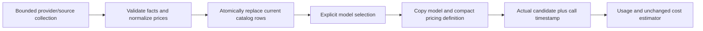

# Current Model Catalog and Embedded Pricing Design

- Snapshot: `catalogspeed-261003`
- Document reference: `catalogspeed-261003/DESIGN`
- Requirements: [catalogspeed-261003/REQ](../requirements/catalogspeed-261003-current-model-data.md)
- Decisions: [catalogspeed-261003/ADR](../adr/catalogspeed-261003-current-model-data.md)
- Repository evidence baseline: `8beee8cada07a9b708c82425bfae7fda75888e37`.
- Scope: final technical design only. No implementation, migration execution, or deployment is authorized.

## Outcome and Scope

Keep one current set of model data for each existing source/catalog scope. Normalize prices at catalog maintenance, copy the selected model's compact price definition when it is selected, and use that definition during execution. Remove catalog content hashing and the snapshot/candidate/history graph rather than caching it or moving it to another executor.

Ordinary input still waits for the current model/foreground-tool boundary. Toolkit context/prompt/admission checks still run at their intended boundaries. Model choice, reasoning, output quality, and stream waiting remain unchanged. The unclassified slow mailbox-promotion sample is a separate diagnostic item, not a claimed consequence of this design.

## Design Authority

- Design revision: `2`

| ID | Material mechanism | Authority | Classification |
| --- | --- | --- | --- |
| M1 | Latest-only per-model source and scoped conversation/image rows | `catalogspeed-261003/REQ-1`, `catalogspeed-261003/ADR-D1` | decided |
| M2 | Atomic publication, exact prepared-input validation, work ownership and current authorization | `catalogspeed-261003/ADR-D1`, unchanged scope/authorization Spec | decided |
| M3 | Normalize existing typed price rules and copy server-resolved definitions into selections | `catalogspeed-261003/REQ-2`, `catalogspeed-261003/ADR-D2` | decided |
| M4 | Cheap physical-call price capture and revision-free new cost provenance | `catalogspeed-261003/REQ-3`, `/REQ-4`, `catalogspeed-261003/ADR-D2` | decided |
| M5 | One-time missing-price initialization of existing executable selections | `catalogspeed-261003/ADR-D3` | decided |
| M6 | Exact optional-context lookups within existing operation boundaries | `catalogspeed-261003/ADR-D3`, unchanged context precedence Spec | decided |
| M7 | Current-data API/CLI/UI contracts and regenerated clients | `catalogspeed-261003/ADR-D4` | decided |
| M8 | Destructive coordinated cutover, guard replacement, and absence verification | `catalogspeed-261003/REQ-3`, `/REQ-6`, `catalogspeed-261003/ADR-D4` | decided |
| M9 | Retained estimator, history, selection, purpose and execution semantics | `catalogspeed-261003/REQ-5`, unchanged model-catalog/engine Specs | existing |

Relevant unchanged authority is in [Model Catalog](../spec/domain/model-catalog.md), especially catalog scopes, image visibility/defaults, selected-model semantics and estimator behavior, and [Agent Execution](../spec/flow/agent-execution-loop.md). This Design does not use its own feasibility as authority for new behavior.

## Current Behavior and Gaps

| Current unit | Confirmed gap | Replacement |
| --- | --- | --- |
| `model_metadata_sources` -> immutable `model_metadata_source_snapshots` | Retains content-addressed source history and current pointers | Current source owner and current per-model rows |
| `llm_catalogs.current_snapshot_id`, `llm_catalog_snapshots`, persisted candidates | Snapshot/provenance graph remains even though replaced current projections are deleted | Direct current scoped entry replacement |
| Source collector raw/canonical hashes and projection fingerprints | Unnecessary catalog hashing and deduplication | Strict validation and ordinary current-data publication |
| `ModelMetadataSourceRepository._build_snapshot` | Re-serializes/validates/hashes the whole source at read | Compact current model reads; no source restoration at dispatch |
| `AgentEngineAdapter.prepare_model_call` -> `_capture_model_pricing` | Captures whole source for every physical call | Candidate-local normalized price definition |
| `normalize_model_pricing` | Snapshot ID/hash are currently required for price availability | Publication normalization plus cheap call-local capture |
| Optional missing-maximum consumers | Can still restore the whole source even after price capture changes | Exact current normalized source-model lookup |
| Public/admin catalog contracts | Expose snapshot/generation identifiers and candidate operations | Current status, usability, counts and last-success metadata |

The implementation must replace the responsibility boundaries of these units rather than leave obsolete structures behind nullable flags or alternate paths.

## 1. Current Data and Ownership

### 1.1 Source data

Retain a stable source owner identified by `source_key`. It stores only current collection authority and current synchronization status. Store validated current model facts as per-model rows keyed by exact source/provider namespace and exact producer model key within that source. The rows carry the descriptive facts needed by current projection, normalized price rules/issues or an unavailable outcome, and an aware collection timestamp.

The complete source dataset is validated during collection. Do not persist raw document bodies, canonical whole-source blobs, prior model-data payloads, content hashes, or immutable source revision rows. Strict numeric/identity/shape validation, source-kind/schema interpretation and bounded transport validation remain; they are not content revision mechanisms.

Current per-model rows support indexed exact metadata lookup without loading the entire source. The allowed source family remains the current data-only contract. A retained retired source family must not become price authority during migration simply because an old projection references it.

### 1.2 Scoped model catalogs

Preserve system identity `(provider, purpose)` and integration identity `(provider_integration_id, purpose)`. Preserve Workspace authorization, enabled integration checks, purpose isolation, literal model identifiers, selectable visibility and reviewed image-model restrictions.

Conversation and image-generation entries are current rows keyed by stable catalog owner and exact provider model identifier. Refresh upserts incoming rows and deletes keys removed from the accepted current set in one transaction. New rows have ordinary row identities; these identities do not become dataset revisions. Selections copy model information, so deleted current rows are not live authority for an older saved selection.

Catalog owners contain current counts, last-success time and latest synchronization status. Image-purpose owners additionally carry current usability as the replacement for their existing generation-current checks. Conversation selection keeps its existing predicates; current/stale status is diagnostic and adds no save/admission gate. Owners contain no current snapshot pointer, source snapshot foreign key, projection fingerprint, or published catalog configuration generation.

### 1.3 Synchronization status

Use only one current status/diagnostic record per source/catalog owner. Keep last-success time distinct from latest attempt start/end, failure, backoff, cooldown and automatic-retry-block facts. Preserve the existing refresh schedule and policy; do not introduce an additional scheduler or operational mode.

An opaque active request identity is allowed solely to reject superseded work. It is not a content identity, data revision, selection reference, public catalog identifier, or retained attempt history. It is cleared or replaced as ordinary work ownership changes. General Job Runtime logs/history remain separate and must not preserve catalog payload bodies as an indirect archive.

## 2. Publication, Reads and Concurrency

### 2.1 Collection and preparation

Provider SDK calls, HTTP collection, raw source parsing, normalization and full-set preparation occur outside a publication transaction. Prepared data is transient in memory; there is no stored non-current candidate table or reusable candidate operation.

Preserve existing source-shrink safeguards and their established thresholds: global removal of at least 50 models and at least 2%, or provider removal of at least 5 and at least 20%, is rejected through the existing policy. Rejection updates only current diagnostic state and preserves current successful data. This does not retain the rejected payload or create a revision.

### 2.2 Commit protocol

Source collection and affected system-catalog replacement commit together. Integration replacement commits its own authorized current entry set after provider discovery.

Acquire locks in this common order:

1. Integration authority, where applicable.
2. Source owner rows.
3. Catalog owner rows sorted by stable identity.
4. Current model entry rows.

The order applies to claims, invalidation, publication and coherent reads. System publication does not acquire integration locks after source/catalog locks.

Under the owner locks:

- Revalidate active work ownership and relevant current authorization.
- Validate the prepared model set and its scope.
- Upsert current data and remove obsolete keys atomically.
- Update purpose-appropriate current status, image usability, success metadata and synchronization state.

No external I/O occurs inside this transaction. Do not skip identical-content publication through hashing, fingerprints, or dataset IDs.

### 2.3 Source freshness without a revision surrogate

An active work token cannot prove which source values were published. Token absence before and after a refresh has an ABA problem; the same token can also exist before and after its payload changes.

For source-dependent prepared publication, lock the source owner and compare the exact relevant typed current values and presence/absence with preparation inputs. System projection checks the complete relevant provider rowset, including added or removed keys. Integration projection checks every exact adopted key/namespace that could influence its prepared entries. Include all facts, normalized pricing/issues and descriptive provenance used by preparation.

If inputs changed, release the transaction and reprepare through the existing operation/retry boundary. A final stale result does not become current data. This is concurrency validation, not content deduplication: equal values do not create/reuse a snapshot or suppress an otherwise authorized overwrite. No content hash, generation counter, stored prepared payload or replacement dataset token is introduced.

### 2.4 Credential changes and coherent selection

Retain the existing integration credential/configuration counter. It protects actual user secret/config/enabled changes and existing OAuth refresh races, and does not retain model-data history. Do not replace it with ordinary `updated_at`, which also changes for unrelated names/runtime refreshes.

Invalidate image catalog usability in the same integration-update transaction. A publisher discovered under old credentials must fail its current integration check for either purpose. Only an authorized image replacement makes image entries usable again. Exact image selection/execution checks current integration authority, usability and the exact current model; no old catalog generation is a selection authority.

Do not add that usability predicate to conversation selection or saved conversation execution. Conversation retains its current-entry, exact identifier, selectable visibility and existing integration/Workspace checks, including stale-readable behavior. Neither the API nor UI may turn a diagnostic stale/current status into a stronger conversation save or admission rule.

Read status/authorization and entry/pricing coherently with a shared catalog owner lock or equivalent single SQL projection. Selection copies one coherent current model and price definition before releasing that read scope.

## 3. Normalized Pricing and Selected Models

### 3.1 Compact stored definition

Reuse the existing `CatalogPriceRules` representation and calculator. A shared typed persisted definition contains rules or an explicit unavailable reason, stable descriptive source/model key, and aware collection time. Provider and exact model identity are already owned by the parent catalog entry/selection and are validated at the server-side matching boundary.

Losslessly retain:

- Decimal rates as strings in normalized JSON, with their exact units.
- Nullable rates and ordered/duplicate tariffs.
- Service tiers, context thresholds, search-context dimensions.
- Off-peak windows, weekdays, timezone and overrides.
- Unsupported/invalid issues, metrics, dimensions and invalid flags.

Raw source numeric validation remains strict; accepting normalized Decimal strings does not loosen raw numeric source interpretation. Some invalid/unsupported specialized evidence remains in `issues` for usage-time applicability checks; it must not disappear or cause an unrelated catalog-wide publication failure.

Catalog collection decodes raw price evidence once. Scoped projection copies only an exact valid match and its normalized definition. No alias/family/account borrowing supplies price authority.

### 3.2 Selection boundary

Extend the existing common selected-model contract with the compact pricing definition. `ModelCatalogReadService.resolve_agent_model_selection` copies it from the server-resolved current entry alongside the existing capabilities and settings. Agent and Workspace explicit candidate selection use this boundary.

Mutation input still supplies only approved selection identities/settings; clients cannot submit authoritative rates. Catalog price output is descriptive data, not client-controlled execution authority.

Catalog refresh does not rewrite saved selected models or prices. Ordinary non-selection edits preserve them. Explicit selection/save captures current data. Existing operation/inference propagation carries the full selection to Primary, fallback, lightweight, compaction and subagent paths; do not add a new model-resolution mode.

Historical persisted selected-model JSON lacking the new pricing field decodes read-only as absent, including unchanged terminal operation candidates. New server-resolved selections always populate a typed available/unavailable definition. Historical decoding does not fill or save data, resolve a deleted catalog pointer, or access a source. If an actual dispatch still lacks a definition, local estimation is unavailable under Section 3.3; no legacy price authority is restored.

### 3.3 Physical call and usage

At each actual physical dispatch, create a small immutable envelope from that candidate's saved definition and the aware request time. This step performs no pricing DB lookup, source JSON restore, raw-price interpretation, hashing or cache operation. Compact typed data is still validated at its existing persisted-data load boundary, and existing integration/admission checks still execute.

The request time is per physical call, not the time the model was selected. Off-peak/weekday conditions use that call time. Usage completion uses the captured candidate/time even if the current catalog changes in the meantime. Actual fallback candidates use their own prices, never the primary candidate's prices.

Retain the existing estimator and all tier/cache/reasoning/media/tool rules. Finite nonnegative provider-reported charges, including zero, retain priority. Missing definitions or unsupported required dimensions produce unavailable whole totals; there is no zero, partial subtotal, current-catalog lookup, lazy fill or old-source fallback.

Both Responses and PydanticAI output normalization use the same cheap capture contract. Title generation keeps its existing text-only behavior and gains no new billing tracking.

### 3.4 Provenance and history

New estimates record method, exact provider/model, applied tier, descriptive source/model key, collection time and the code estimator version. They do not contain source snapshot IDs, content hashes, catalog foreign keys or a newly archived full pricing payload. Code/schema interpretation versions are not catalog data revisions.

Previously stored event JSON and costs are not rewritten or recalculated. Historical opaque snapshot/hash provenance may remain readable in those immutable records; it never authorizes a current selection or causes a lookup of deleted catalog history.

## 4. Existing Selections and Optional Context

### 4.1 One-time price-only initialization

During migration, fill only missing embedded-price fields using exact current catalog entries in the saved candidate's existing scope. Inventory:

- Agent canonical selectable options and existing primary/lightweight mirrors.
- Workspace default selectable options and existing default selection mirrors.
- Current Session inference selection.
- Nonterminal durable operation candidate selections, including title/compaction where persisted, for future dispatch.

Do not change model identity, capabilities, settings, labels or present validated price definitions. The copied data is the migration-time current price; do not label it as a recovered historical selection-time rate. Unmatched, removed or unsupported scope/evidence is explicitly unavailable. A hidden exact model receiving informational price data acquires no new execution permission.

Do not replace an already-started physical attempt's frozen price or mutate completed operation/event/cost history. Coordinate cutover so old in-memory dispatch cannot continue after schema removal. After migration there is no ordinary-read enrichment or per-turn backfill.

### 4.2 Optional missing-maximum lookup

Price capture is not the only current whole-source consumer. Replace remaining full-source optional-context captures in candidate resolution, compaction preparation, subagent context and Agent context display with indexed exact current source-model reads.

Only selections missing a saved maximum need that read. Group requested exact keys within the existing paired-operation boundary and use one coherent source view. Preserve saved maximum precedence, known default floor, maximum-as-default, explicit caps, and the 128,000-token unknown fallback. Do not change saved capabilities, merge unrelated Toolkit checks, broaden provider matching or add a global context cache.

This replacement changes the data read inside an intended operation, not the operation/check boundary itself.

## 5. Contract and Surface Changes

### Current APIs and UI

Remove catalog/source response fields and commands representing snapshot IDs, candidate publication/cutover, catalog data generations, raw/canonical hashes and fingerprints. Replace current snapshot status with last-success time, latest sync status and existing counts/failure/retry facts; image responses additionally expose usability in place of existing generation-current authority. Conversation status does not add a client/server selection gate. Do not expose active work tokens as model-data IDs.

Current catalog entries and saved-model responses carry the server-owned normalized price definition where the contract includes that model data. Mutation inputs do not accept it as authority. Image default availability and explicit-selection support remain unchanged.

Update public/admin API DTOs, service projections, CLI commands, generated Python/TypeScript clients, the main-web TRPC catalog mapping and admin catalog status types/labels. Use the existing OpenAPI/client generation workflow during implementation, never manual edits to generated files. Preserve layout and existing localized behavior; no new pricing dashboard or picker workflow is added.

### Impact map

| Area | Principal implementation paths |
| --- | --- |
| Source storage/collection | `rdb/models/model_metadata_source.py`, `repos/model_metadata_source.py`, `repos/model_metadata_operations.py`, `services/catalog_source_collection.py`, `services/model_metadata_source.py` |
| Catalog current rows/publication | `rdb/models/llm_catalog.py`, `repos/llm_catalog/`, `repos/llm_catalog_operations.py`, `services/model_metadata_projection.py`, `services/llm_catalog/` |
| Credential invalidation/image authority | `repos/llm_provider_integration/`, `services/image_generation_catalog/`, existing ChatGPT/xAI/Kimi OAuth repositories |
| Selection/normalized prices | `core/agent.py`, `core/catalog_price_rules.py`, `core/model_pricing.py`, `services/model_options.py`, `services/workspace_model_settings/` |
| Call/usage capture | `engine/events/engine_adapter.py`, `engine/events/model_usage_pricing.py`, both output normalizers, `core/model_operation.py`, `core/inference_profile.py` |
| Exact context data | `services/model_metadata.py`, `repos/model_metadata_read.py`, `engine/run/resolve.py`, `worker/run/executor.py`, `engine/tools/subagent.py`, Agent context and Session title services |
| Contracts/UI/clients | public integration and admin model-catalog API DTOs, both OpenAPI documents, public/admin Python/TypeScript clients, main-web TRPC, admin model-catalog feature |
| Data transition | `db-schemas/rdb/migrations/versions/`, `db-schemas/rdb/revision`, current selected-model JSON columns and nonterminal operation JSON |

## 6. Migration, Rollout and Recovery

### Migration sequence

Generate a new linear migration through the existing Alembic workflow when implementation is explicitly requested. Do not edit executed migrations.

1. Establish writer/reader quiescence and verify the ordinary database backup.
2. Identify current allowed source rows, current conversation/image projections and executable selected-model fields. Validate identity/scopes and report malformed data rather than silently repairing it.
3. Create latest-only source-model storage/current entry pricing and status fields. Copy only currently authoritative data and normalize prices without hashing.
4. Initialize missing selected-price fields under Section 4.1. Do not overwrite valid definitions or historical artifacts.
5. Initialize image catalog usability from actual pre-cutover current authorization; a stale image integration generation stays unusable. Preserve conversation selection predicates and stale-readable behavior.
6. Replace snapshot/authority guard functions and triggers, including those installed by `c8bc0a5dcab0`, with current owner/purpose/allowed-source/credential enforcement. Remove obsolete pointer FKs and indexes deliberately.
7. Drop old source/catalog snapshot history, persisted candidates, hashes/fingerprints, retired source-family history and append-only catalog/source attempt tables. Preserve one latest diagnostic state with its policy facts.
8. Verify all invariants and absence obligations before committing the migration as successful. Advance the migration revision only through the normal validated workflow.

Do not create a raw-source archive, shadow revision table, tombstone catalog history or retained old-reader fallback to make the transition easier. Historical Agent diagnostic JSON may remain inert; it cannot resolve deleted pointers.

### Deployment and rollback

Old catalog readers/writers and queued/claimed obsolete catalog publication work must not resume after schema cutover. Drain/cancel that exact work through existing deployment/job ownership boundaries, apply the migration, then run only the matching new server/worker/scheduler/client code. Do not add a dual-write period or product maintenance mode.

Backup restoration is the emergency rollback boundary: stop writers, restore matching schema/data and previous release. It may lose post-cutover writes. Removed catalog history cannot be recreated by a nominal downgrade, and migration stamping is not verification. Prefer a verified forward fix when restoration would discard required new records.

This is an operational design prerequisite, not authorization for any live action.

## 7. Failure and Security Behavior

- Collection/normalization failure or rejected reduction preserves last successful current data and updates latest status only.
- Superseded work, changed relevant source inputs or changed credentials cannot publish; reprepare through the existing bounded operation policy outside locks.
- Partial publication/migration fails atomically.
- Integration-scoped visibility never falls back to another account or system inventory.
- Reviewed image identifiers and credential-visible intersections remain authoritative; provider-default behavior remains synthetic where currently supported.
- Clients cannot forge stored price rules through selection mutation input.
- Price/source misses do not authorize different models and do not stop otherwise valid output merely because a local estimate is unavailable.
- Existing optional-context and cost behavior is retained without old whole-source runtime access.
- Work ownership tokens and the integration configuration counter are concurrency/authorization mechanisms only; no payload history or data revision semantics are attached to them.

## 8. Observability and Performance Verification

Use current structured log fields and existing Job diagnostics. Separate collection, normalization, exact metadata read, publication lock/commit, selection read, model preparation and provider stream times. Do not log provider credentials, source bodies, selected pricing payloads or model content.

Primary absence evidence is zero whole-catalog pricing restores, zero raw-price interpretation at dispatch, and zero catalog content-hash computations. A missing-maximum path reads only its exact requested current model metadata. No benchmark result is claimed until implementation is measured.

Compare equivalent model/candidate/data conditions before and after implementation. Provider stream time is reported separately; do not claim model-generation time was optimized. Keep success/failure/missing samples distinct and preserve measurement commands/environment in a one-time report. The slow mailbox-promotion sample remains unclassified and receives no false causal attribution.

## 9. Test Strategy

### E2E primary verification matrix

Use existing required model-selection, provider-image-generation and per-prompt inference E2E surfaces with deterministic provider/source fixtures. Extend testenv prerequisites only to expose the needed deterministic catalog/rate/usage and synchronization controls, not a new production execution mode.

| Scenario | Expected observation |
| --- | --- |
| Collect A, select model, execute | Server copies normalized rates; exact selected candidate estimates from its own embedded rules |
| Refresh rates A -> B, execute old selection, explicitly reselect | Old selection retains A; explicit selection obtains B; no runtime catalog-price read |
| Replace/remove source and catalog rows | Only current sets remain; removed identifiers are absent from current picker data; saved selection authority is unchanged |
| Failed collection/projection/reduction | Prior current data and purpose-specific authority remain; latest failure/backoff facts are visible; no rejected payload/history persists |
| Conversation/image and two-account isolation | Scope/visibility/defaults unchanged; no cross-account price or model borrowing |
| Credential change during provider fetch | Old discovery cannot publish for either purpose; image usability stays false until authorized publication; conversation predicates remain unchanged |
| Source changes while preparing | Exact changed values and added/removed relevant keys reject stale publication |
| Work token ABA and capture during refresh | Token reuse/absence does not authorize stale data; exact input comparison protects publication |
| Selection read overlaps replacement | Model/capability/price/status come from one coherent authorized view |
| Actual fallback/lightweight/subagent/compaction | The actual candidate's embedded definition is used; intentional wait/check boundaries unchanged |
| Existing price-less selections and resumable runs | Price-only initialization covers mirrors/Workspace/Session/nonterminal candidates; no capability, label or historical cost rewrite |
| Historical terminal selection and provenance decoding | Absent price fields and old opaque provenance remain readable without mutation, catalog lookup or new execution authority |
| Missing/invalid/specialized pricing | Existing unavailable/whole-total semantics and zero-provider-charge precedence remain |
| Missing context maximum | Exact narrow lookup preserves all established context precedence and fallback rules |
| Coordinated migration | Old work cannot resume; current data/authorization preserved; forbidden history/hash structures absent |

### Fixture and prerequisite requirements

Seed two catalog datasets with equal exact identities but different prices, source key additions/removals, missing and partially unsupported rules, multiple providers/account scopes, stale integration configuration, and pre-migration selected-model JSON. Include lossless Decimal values, nullable rates, duplicate tariffs, all supported tiers/context/search dimensions, off-peak boundaries and cache/media/TTL receipts.

Fixture snapshots contain no real credentials or user data. Required deterministic tests use existing testenv provider/SDK adapters. Optional live-provider checks require explicit existing credentials and skip with a stated prerequisite reason when absent; they must never replace mandatory deterministic coverage or be reported as passed when skipped. No paid model call is necessary to verify the price-authority and removal contracts.

### Focused unit/repository checks

- Retain `core/catalog_price_rules_test.py` and `core/model_pricing_test.py` calculator parity.
- Lossless DB/selection/operation-candidate round trips for every price-rule field.
- Replace source-capture-per-dispatch tests with zero source/normalization/hash calls for price capture in both output adapters.
- Preserve `engine/events/model_usage_pricing_test.py` provider-charge and modality semantics.
- Preserve context precedence through revised exact-row reads in context-source tests.
- Cover server-side selection copying and ordinary non-selection update preservation in model-options/Agent/Workspace tests.
- Repository race tests use explicit barriers and authoritative state, not arbitrary sleeps.
- Migration fixtures cover guard replacement, stale image usability, unchanged conversation predicates, malformed data failure, current-only copy, nonterminal versus completed history, obsolete queued work and unsupported rollback.
- Historical terminal operation JSON and old opaque cost provenance have explicit read/decode regressions; decoding must not write, look up deleted pointers or restore a price-source fallback.
- Absence checks cover active catalog code, schema, current APIs/DTOs/CLI, generated clients and UI. Executed migrations and opaque historical event JSON are explicitly outside active-path absence scans.

### CI and evidence

Run relevant backend quality/type/unit/repository checks, OpenAPI/client regeneration verification, TypeScript type/lint/build checks and required E2E for every affected purpose/path. Preserve deterministic fixtures, catalog row counts, API examples, race ordering and preparation timing artifacts. Functional/migration tests and benchmarks are implementation acceptance work, not tests executed by this design task.

## 10. Removal and Replacement

| Existing unit or behavior | Removal authority | Replacement/remaining authority | Boundary | Absence verification |
| --- | --- | --- | --- | --- |
| Immutable source snapshots and current pointers | `REQ-1`, `ADR-D1/D4` | Current owner + exact current source-model rows | Migration + repositories | No history table/FK/read path |
| Catalog snapshot/candidate graph | `REQ-1`, `ADR-D1/D4` | Direct current scoped rows and atomic publication | Schema/services/CLI | No persisted candidates or snapshot interfaces |
| Raw/canonical hashes and projection fingerprints | `REQ-3`, `ADR-D1/D4` | Strict validation and current authority | Collector/read/projection/schema | No active catalog hash calls/fields/indexes |
| Whole-source price restore and snapshot/hash availability gate | `REQ-4`, `ADR-D2` | Embedded definition plus request time | Both physical-call/output paths | Zero price source reads/decodes/hashes |
| Whole-source optional context captures | `ADR-D3` | Exact current indexed maximum read | Existing context operation boundaries | No whole-source execution capture |
| Append-only source/catalog attempts and produced pointers | `ADR-D4` | One latest status with policy facts | Status/API/schema | No payload/attempt revision archive |
| Snapshot/generation public fields and candidate commands | `ADR-D4`, D1 scope clarification | Current time/status/counts and existing image authority | API/CLI/clients/UI | Updated generated contracts; no stronger conversation predicate |
| Old pointer/immutability DB guards | `ADR-D4` | Current owner/purpose/source/credential enforcement | New linear migration | Old guards absent; invalid writes still rejected |
| Old selected-price omissions | `ADR-D3` | One-time exact price-only initialization | Existing executable saved data | Missing fields accounted for; no lazy runtime fill |
| Retained integration configuration authority | unchanged Spec, `ADR-D1` | Existing current credential/OAuth fence | Integration/admission | Stale-credential races still fail safely |
| Historical recorded costs and native event artifacts | `REQ-5`, `ADR-D2/D4` | Existing immutable history | No data rewrite | Before/after history equivalence; no deleted-pointer execution |

Historical Requirements/ADRs/Designs and executed migrations are immutable historical inputs, not cleanup targets. Living Specs are updated when implementation changes current behavior, not during this design-only task.

## 11. Feasibility and Delivery Boundaries

Repository-grounded feasibility is **feasible, conditional on implementation verification and coordinated data cutover**. Existing typed estimator, server-side selection normalization, common candidate propagation, DB operation repositories and integration authority make the design implementable without changing Agent waiting or Toolkit boundaries.

The main risks are lossless price serialization, incomplete saved-selection inventory, stale-credential publication, exact source input comparison, old work surviving destructive schema change, and backup restoration losing post-cutover writes. The test and cutover requirements address these risks; no already-completed implementation or measured speedup is claimed.

A later explicit implementation request can use reviewable delivery boundaries: typed pricing/selection contracts; latest-only persistence/publication plus migration; execution/context/contract removal; complete fixture/client/E2E/performance verification. Intermediate work must not be deployed as a dual-authority runtime mode. This is not a shipping plan or authorization to create PRs now.

## Design Approval

- Mode: `Autonomous`
- Decision owner: delegated bounded technical design reviewer.
- Approved on: `2026-10-03`.
- Approved Design revision: `2`.
- Approved authority IDs: `M1`, `M2`, `M3`, `M4`, `M5`, `M6`, `M7`, `M8`, `M9`.
- Approved scope: latest-only catalog data and atomic publication, embedded normalized prices and cheap call capture, exact optional-context reads, price-only current-data transition, purpose-preserving contracts, coordinated destructive cutover and complete removal/verification obligations.
- Authority audit: passed in both directions; no remaining material correction.
- Feasibility: feasible conditional on implementation verification and coordinated cutover. No actual performance improvement or migration success is claimed.
- Implementation approval: not granted. A material mechanism/scope change requires renewed revision-bound technical Design review.
