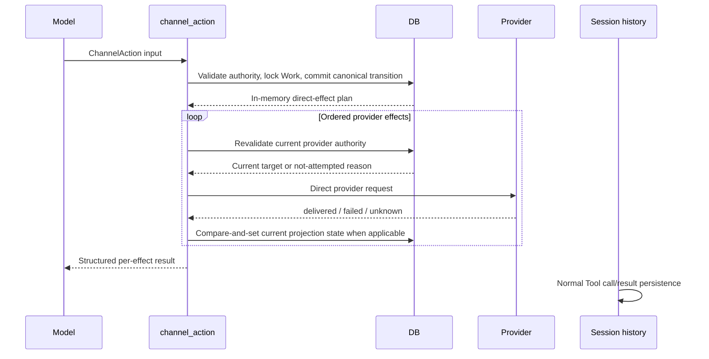

# Immediate External Channel Provider Delivery Design

- Snapshot: `channel-260802`
- Requirements: [`channel-260802/REQ`](../requirements/channel-260802-immediate-provider-delivery.md)
- ADR: [`channel-260802/ADR`](../adr/channel-260802-immediate-provider-delivery.md)
- Design reference: `channel-260802/DESIGN`

## Current Behavior and Requirement Gaps

`channel_action` currently commits three kinds of state in one transaction:

1. canonical Channel Work;
2. a durable Channel Action containing the Tool call identity and input; and
3. one or more durable delivery attempts containing rendered provider requests.

The service commits those records, claims each delivery attempt, performs provider
I/O, persists the outcome, runs delivery-specific catch-up or cleanup, and finally
marks the Channel Action complete. Engine cancellation separately recovers a
committed Channel Action into a synthetic Tool result.

The same delivery-attempt table also owns setup, access, presence, settings,
initial-progress, disconnect, and cleanup controls. A Worker loop scans pending
controls and terminalizes stale attempts. Session Channels exposes the latest
delivery rows through the public management API and generated clients.

This differs from the confirmed Requirements in the following ways:

| Requirement | Current gap |
| --- | --- |
| `channel-260802/REQ-1` | External Channel adds acceptance, completion, duplicate-call recovery, and cancellation recovery around an otherwise synchronous Tool call. |
| `channel-260802/REQ-2` | Tool input and provider outcomes are copied into dedicated Action and delivery history, and management exposes that second history. |
| `channel-260802/REQ-3` | Non-Tool controls create durable pending work consumed by request paths and a Worker drain. |
| `channel-260802/REQ-4` | Slack current progress status depends on the latest delivery row, Discord projection parts reference delivery attempts, and access-control cleanup obtains its message identity from delivery history. |
| `channel-260802/REQ-5` | Immediate outcomes are persisted before being returned and are later reconstructed during cancellation or recovery. |
| `channel-260802/REQ-6` | Runtime-provider completion and claim settlement can be persisted on the delivery row for later settlement. |
| `channel-260802/REQ-7` | Models, repositories, services, Worker composition, lifecycle finalizers, API contracts, UI, generated clients, tests, specs, PostgreSQL types, and tables consume the legacy workflow. |

## Architecture

### Agent-requested publication

`channel_action` becomes one ordinary foreground Tool implementation with an
in-memory provider plan and in-memory outcomes.



The canonical transaction never persists an operation plan, rendered provider
payload, Tool-call duplicate key, pending provider work, or provider result. It
returns an immutable process-local plan containing only what the current Tool
execution needs after commit.

Initial validation occurs before the canonical transaction commits. Invalid input,
unavailable binding authority, invalid Channel Work transition, unavailable file
source, or failed preflight authorization raises the normal Tool error and performs
no provider mutation.

After commit, every provider effect is revalidated against the current Agent,
Session, binding, resource, route, connection, credential generation, capability,
and Runtime file authority that applies to that effect. Authority loss after the
canonical commit produces a `not_attempted` effect outcome; it does not roll back the
committed Channel Work.

Provider effects retain their current semantic order:

- reply parts execute in provider-visible order;
- continuing progress effects execute after any reply effects;
- a finishing action attempts progress deletion only after every required final
  reply effect is delivered;
- a skipped finish cleanup is returned as `not_attempted`; and
- no later effect compensates an earlier successful provider mutation.

### Non-Tool provider controls

Canonical setup, access, participation, mailbox, binding, connection, Session, and
Agent lifecycle transactions return zero or more process-local direct-control plans.
The caller commits canonical state first and then attempts each plan once through the
provider adapter.

Protocol-specific ordering remains unchanged. For example, a Discord interaction
response that must be acknowledged before a follow-up provider operation passes an
in-memory plan to the existing post-response boundary. The plan is never serialized
or handed to a durable scheduler. Process termination before that boundary omits the
effect.

Control results never alter the already committed mailbox admission, Session wake,
AgentRun, access decision, binding transition, connection transition, archive, or
decommission result. Failed and unknown controls emit safe logs and metrics only.

## Ownership and Sources of Truth

| Concern | Authoritative state after this design |
| --- | --- |
| Agent-requested Tool input and immediate result | Normal Session history |
| Current Channel Work title, tasks, status, and desired progress | `external_channel_works` |
| Current provider progress identity and projection state | `external_channel_work_projection_parts` owned by one Channel Work |
| Current access-control provider identity needed for later deletion | The owning access request |
| Binding, resource, route, connection, credential, and capability authority | Existing External Channel domain records |
| Provider operation plan and rendered payload | Process-local memory during the direct call |
| Historical provider attempts and outcomes | None |
| Pending or recoverable provider work | None |

Session history is not queried to reconstruct Channel Work, provider targets,
projection state, pending effects, or lifecycle cleanup. Current domain records are
not interpreted as a replacement execution history.

## Direct Effect Plan and Outcome

The direct orchestration layer replaces `ChannelActionCommit`,
`ChannelWorkDelivery`, and `ChannelDeliveryTarget` with process-local types:

- a canonical Tool transition result containing binding, Work identity, Work status,
  and state revision;
- ordered provider-effect plans containing semantic operation, part ordinal,
  expected owner revision, and a live target locator;
- provider targets resolved or revalidated immediately before I/O; and
- sanitized effect outcomes containing operation, part ordinal, status, safe reason,
  and safe detail.

The plan may carry encrypted credentials or already decrypted provider credentials
only within the current process and only when a terminal transition must purge the
durable credential before post-commit cleanup. Credential-bearing plan fields are
excluded from representations and logs.

Rendered Slack blocks, Discord embeds/components, file manifests, provider
coordinates, message keys, and credentials are not persisted as direct-effect
plans. Provider presentation remains derived from canonical state and current
resource labels at the live call boundary.

Provider adapters continue to classify outcomes as:

- `delivered`: the provider confirmed the requested mutation;
- `failed`: the provider confirmed rejection or a safe local failure occurred;
- `unknown`: provider mutation may have occurred but cannot be confirmed; and
- `not_attempted`: the direct orchestrator intentionally did not invoke the
  provider.

Slack and Discord clients may use one bounded process-local operation key for a
provider-supported duplicate fence within that live invocation. The key is derived
from the current Tool call or current domain owner plus effect ordinal, is not stored
as a new Azents record, and does not authorize later retry or replay. Discord nonce
generation no longer depends on a delivery-attempt identifier.

## Tool Contract

The `channel_action` input schema and provider-neutral `finish` and `continue`
semantics remain unchanged.

The result changes to the structure authorized by `channel-260802/ADR-D1`:

```json
{
  "binding": "opaque-binding-handle",
  "state": "active",
  "state_revision": 4,
  "outcomes": [
    {
      "operation": "reply",
      "part": 0,
      "status": "delivered"
    },
    {
      "operation": "progress_update",
      "part": 0,
      "status": "unknown",
      "reason": "provider_outcome_unknown",
      "detail": "The provider outcome could not be confirmed."
    }
  ]
}
```

The exact safe reason vocabulary is bounded and provider-neutral. The result does
not contain Action IDs, delivery IDs, provider message keys, provider payloads, raw
provider identifiers, credentials, file data, or recovery metadata.

Normal Session Tool execution records the call and result. Engine cancellation uses
the generic cancelled Tool result and does not query External Channel state or
synthesize a recovered provider outcome.

## Current Progress Projection

`external_channel_work_projection_parts` becomes the sole current progress
projection state for both Slack and Discord.

Each row represents one currently owned provider-visible progress part:

- `work_id`;
- `part_ordinal`;
- the desired-progress revision associated with the current status;
- `status`;
- nullable current provider message key; and
- ordinary row creation/update metadata that is not interpreted as provider-attempt
  history.

The table no longer contains `latest_delivery_attempt_id` or any link to an
operation record. `external_channel_works.progress_provider_message_key` is removed;
Slack uses projection part ordinal `0`, while Discord retains its ordered pages.

The durable projection status set contains:

- `present`: the current provider message identity is confirmed;
- `failed`: the latest explicit projection mutation for the represented desired
  revision was confirmed unsuccessful;
- `unknown`: the represented mutation may have occurred and must not be blindly
  repeated; and
- `deleted`: confirmed absence for a previously owned part.

No durable `pending` status remains. A live request stays in process memory. If the
process or task ends before a result is applied, the prior current projection state
remains and its revision differs from the newer desired revision, which management
reports as stale or missing.

### Planning

The canonical Work transaction updates desired state and determines the direct
effects from the prior current projection:

- no part plus desired content plans `progress_create`;
- `present` with a message key and a newer desired revision plans
  `progress_update`;
- an extra `present` part beyond the new Discord page count plans
  `progress_delete`;
- `failed` may be targeted by a later explicit newer desired revision using update
  when a key exists or create when no key exists;
- `unknown` is not automatically repeated for the same revision; and
- finishing Work plans ordered deletes only for confirmed `present` parts.

Confirmed `message_not_found` updates current projection state but does not trigger
an automatic replacement create. A later explicit Channel Work revision may plan a
new create. Successful older completions do not trigger catch-up delivery.

### Applying outcomes

After provider I/O, a short transaction locks the owner and projection part. The
outcome is applied only when the owner identity and expected desired revision still
match the plan.

- Delivered create or update records `present` and the returned/current message key.
- Delivered delete clears the key and records `deleted`.
- Failed mutation records `failed`, retaining a known key when it still identifies
  the provider object.
- Ambiguous mutation records `unknown`, retaining a previously known key but never
  inventing an identity.
- A stale completion cannot overwrite a newer part state or desired revision.

No outcome application creates a secondary provider effect. Catch-up, replacement,
cleanup continuation, and recovery occur only through a later explicit Tool or
lifecycle operation that is independently authorized by current domain state.

## Access-Control Projection

An access request gains minimal owner-local control projection fields:

- nullable current control message key; and
- current control projection status.

The access-control create executes directly after the access request commits.
Delivered creation records the current key. Failed or ambiguous creation records only
the current safe status needed to prevent unsafe later deletion.

An Allow, Deny, or Block decision captures the current access-control target inside
the decision transaction, commits the decision, and then attempts one direct delete.
The delete outcome compare-and-sets the access request's current projection state.
Repeated decisions do not retry a failed or ambiguous delete.

Setup prompts, Agent selectors, joined/left presence, binding-settings notices, and
other controls that have no later provider mutation retain no provider result state.
Their owning service may pass an in-memory plan across its immediate post-commit or
post-response boundary only.

## File Publication

Runtime and Exchange files keep the existing live authorization, declared-size
validation, provider capability checks, bounded streaming, and provider-specific
publication behavior.

The direct Tool execution owns the complete lifecycle:

1. resolve and validate manifests before canonical commit;
2. acquire the current Runtime or Exchange authority during the Tool execution;
3. stream files through the current provider client;
4. obtain the immediate provider outcome;
5. acknowledge or settle Runtime claims before returning when possible; and
6. return the provider outcome through the Tool result.

Provider success remains `delivered` even if later Runtime claim cleanup fails after
provider confirmation. Cleanup failure is logged safely and the bounded Runtime
claim expires or is reclaimed by its existing Runtime lifecycle. No External Channel
record stores provider-completed recovery data, and no idle hook or Worker later
replays or settles the provider mutation.

Cancellation does not shield or persist External-Channel-specific settlement. The
generic Tool cancellation path applies. If cancellation occurs after provider
mutation begins, the Session may contain only the generic cancelled result and the
provider outcome may be ambiguous, as allowed by `channel-260802/REQ-5`.

## Provider Controls and Lifecycle

### Ingress and participation

Mailbox ingestion transactions return direct plans for:

- Agent selector controls;
- access-approval controls;
- setup-required controls;
- joined-presence controls;
- binding-settings controls; and
- initial Channel Work progress.

The caller commits canonical admission first. Provider failure cannot remove the
mailbox item, prevent Session wake, or prevent AgentRun creation. Initial progress
applies its immediate result to the owning Work projection part but is never drained
by a Worker.

### Binding, connection, Session, and Agent termination

Lifecycle repositories stop creating cleanup intent IDs. Instead, while locks and
current credentials are available, they return bounded in-memory cleanup plans for:

- left-presence;
- current Slack or Discord progress-part deletion; and
- any provider-owned control cleanup already required by the current transition.

Canonical terminal state commits first. Terminal connection paths capture the
credential-bearing target before credential purge and retain it only in memory.
Post-commit cleanup revalidates the same terminal connection, route, resource,
binding, Session, owner revision, and purge boundary currently required by the
provider authority checks.

Archive and decommission services consume the in-memory plans once after commit.
Session purge has no delivery-preparation phase. Purge cleanup deletes the remaining
Session-owned access requests, Work projection parts, Work, and bindings in
restrictive ownership order. Finalizers verify only remaining canonical domain
roots; Action and delivery counts disappear.

## Engine and Worker Changes

The External Channel Tool removes:

- lookup by `(session_id, client_tool_call_id)`;
- duplicate-payload comparison;
- Action-result recovery before Runtime preflight;
- idle Runtime-provider settlement drain; and
- External-Channel-specific cancelled Tool-result reconstruction.

The engine retains its normal behavior of executing foreground Tool calls in
parallel and durably appending each normal Tool result. No per-binding lock, queue,
or recovery mode is added.

The Agent Worker removes `ExternalChannelProviderControlService`, its dependency,
background task, stale-attempt terminalization, pending-control scan, shutdown
handling, and composition tests. Request, interaction, management, and lifecycle
services invoke the shared direct provider executor themselves after commit.

## Management API and Web

The public Session Channels projection removes:

- `ManagedDelivery`;
- `ManagedBinding.deliveries`; and
- repository queries for the latest delivery attempts.

`ManagedWork` retains canonical Work fields, `progress_projected`, and
`projection_state`. Both fields derive only from owner-local projection parts:

- `synchronized`: every desired part is `present` at the desired revision;
- `missing`: desired progress has no owned part;
- `stale`: a known part is failed, deleted, or at an older revision;
- `delete_failed`: finished/no-desired Work retains a failed present-part deletion;
- `unknown`: any required part is ambiguous; and
- `none`: no progress is desired and no current part remains.

Session Channels removes the Delivery section, row component, translations, and
Storybook delivery fixtures. It continues to show current Channel Work and
projection state.

The public OpenAPI schema is regenerated after the backend projection changes.
Generated Python and TypeScript `ManagedDelivery` models, exports, documentation,
tests, and `deliveries` fields are removed only through the normal OpenAPI client
generation workflow.

Management mutation response fields named `cleanup_delivery_count` are renamed to a
provider-neutral direct-cleanup count where they still expose a useful sanitized
count. They never expose operation identifiers or outcomes.

## Persistence and Migration

One new Alembic revision follows current head `772e7ab22a8e`. Historical migrations
remain unchanged.

The upgrade performs these operations in dependency order:

1. add the minimal access-request control projection fields;
2. adapt `external_channel_work_projection_parts` for record-free current state;
3. create Slack projection part ordinal `0` from the current
   `external_channel_works.progress_provider_message_key` when that key exists;
4. conservatively convert existing projection-part `pending` state to `unknown`
   without consulting delivery rows;
5. remove `external_channel_work_projection_parts.latest_delivery_attempt_id` and
   its foreign key;
6. remove `external_channel_work_projection_parts.deleted_at` if no remaining
   current-state consumer requires it;
7. remove `external_channel_works.progress_provider_message_key`;
8. drop `external_channel_delivery_attempts`;
9. drop `external_channel_actions`; and
10. drop the PostgreSQL Action and delivery enum types after all dependent columns
    are gone.

The migration does not read Action or delivery rows to populate Session history,
access-control identity, errors, outcomes, timestamps, projection status, or another
table. Existing access controls whose only provider identity is in a delivery row
lose that cleanup identity when the rows are deleted. This is the required
no-backfill behavior.

Current Slack Work message identities are preserved because they already belong to
the Work domain, not to delivery history. Existing Discord projection-part identities
and statuses are preserved except that `pending` becomes conservative `unknown`.
No provider operation runs during migration.

The downgrade recreates the removed schema and enum types without reconstructing
discarded Action or delivery data. It can move surviving current Slack projection
identity back to the legacy Work column for structural compatibility, but it does
not recreate historical attempts or outcomes.

The rollout is coordinated: migrated schema and new code are deployed as one
cutover. There is no dual-read, dual-write, feature flag, compatibility view,
fallback table, or mixed-version contract. Database backup is the only way to
recover discarded historical rows.

## Failure and Concurrency Behavior

| Situation | Result |
| --- | --- |
| Initial input, binding, file, or authority validation fails | Normal Tool error; no provider mutation |
| Canonical Work commit succeeds, then authority is revoked before provider I/O | Effect is `not_attempted`; Work remains committed |
| Provider confirms rejection | Effect is `failed`; no retry or compensation |
| Provider result is ambiguous | Effect is `unknown`; no replay |
| One of several direct effects fails | Later effects follow the defined order and dependency; completed earlier effects remain visible in the result |
| Final reply is not fully delivered | Progress cleanup is `not_attempted`; Work remains finished |
| Process stops before a control executes | Control is omitted; canonical state remains |
| Process stops during provider I/O | Outcome may be ambiguous and is not reconstructed |
| Stale provider completion returns after a newer Work revision | Compare-and-set rejects the stale state update; no catch-up mutation is generated |
| Parallel calls create competing provider objects | Current-state compare-and-set selects only a current owner; provider objects not covered by a provider duplicate fence may remain orphaned and are not automatically reconciled |
| Provider success is followed by Runtime claim cleanup failure | Tool reports provider delivery, logs safe cleanup failure, and bounded claim lifecycle handles expiration |

Normal parallel Tool execution can expose provider-level races that the removed
outbox previously attempted to reconcile. This is an accepted consequence of the
ordinary Tool and no-recovery requirements, not a blocker or authorization for a
new queue.

## Security and Privacy

- Direct provider I/O preserves current Workspace, Agent, Session, binding, route,
  resource, connection, capability, credential-generation, and file-authority
  checks.
- Terminal cleanup credentials are captured only in memory, excluded from object
  representation, and never logged or stored in Session history.
- Tool outcomes use bounded provider-neutral reasons and details. They exclude raw
  provider responses, message keys, channel IDs, tenant IDs, callback data,
  credentials, payloads, file bytes, and sensitive URLs.
- Operational logs and metrics identify only provider, semantic effect category,
  safe status, and stable safe error category.
- Management APIs expose current canonical and projection state but no provider
  operation payload or history.

## Observability

Agent-requested publication is observable through normal Tool call/result history.
Non-Tool controls emit:

- a counter by provider, control category, and `delivered`, `failed`, `unknown`, or
  `not_attempted`;
- a bounded latency metric by provider and semantic operation; and
- one structured safe log for failed or unknown direct execution.

There is no operations endpoint, pending gauge, recovery counter, delivery-history
query, or replay command. Runtime claim expiration remains observable through the
existing Runtime transfer subsystem rather than External Channel delivery state.

## Test Strategy

### E2E-first verification matrix

| Scenario | Public behavior and evidence |
| --- | --- |
| Slack text and progress | Signed Slack callback creates a Session; Session history contains one `channel_action` call/result with ordered `outcomes` and no Action/delivery/provider IDs; provider fake records the expected reply/progress; management exposes current Work without `deliveries`. |
| Slack provider rejection and ambiguity | Fake failure controls produce `failed` and `unknown` Tool outcomes; provider evidence shows no automatic second mutation after the Tool finishes. |
| Slack Runtime and Exchange files | Existing file journey verifies live authorization, bounded streaming, provider completion, one immediate Tool result, and no idle or Worker settlement dependency. |
| Discord text and progress | Signed Discord callback or Gateway fake creates the binding; direct reply/progress outcomes are recorded in Session history; multipart/page evidence remains ordered; management derives projection state from current parts. |
| Discord Runtime file publication | Add a deterministic Discord multipart journey using the existing Runtime file Tool flow and sanitized fake file count/byte evidence. |
| Control failure independence | Configure Slack and Discord fake control failure, admit canonical input, and verify Session wake and AgentRun completion still occur while no background retry creates a second provider call. |
| Access-control cleanup | Create and decide an approval request through public APIs; verify one direct control create and at most one post-decision delete, including failed/unknown delete without replay. |
| Binding or connection disconnect | Disconnect through public management APIs; verify canonical terminal projection commits and each captured presence/progress cleanup is attempted at most once. |
| Session archive | Archive through the public Session API; verify bindings and Work become terminal and direct provider cleanup occurs without a later Worker attempt. |
| Management contract | Generated public client reads Session Channels without `ManagedDelivery` or `deliveries`; Web Session Channels renders Work and projection state without a Delivery section. |

### E2E plan

Extend `testenv/azents/e2e/src/tests/azents/public/test_external_channels.py`
rather than introducing DB-driven journeys. Reuse:

- Slack and Discord provider fakes;
- signed Slack callbacks and Discord interactions/Gateway inputs;
- the deterministic OpenAI proxy that emits `channel_action`;
- the Docker Runtime provider for file flows;
- public management and Session history APIs; and
- sanitized provider evidence endpoints.

The existing Slack and Discord fakes already support confirmed failure and
transport/provider ambiguity scenarios. Extend only the deterministic request
sequencing or sanitized evidence needed for direct execution and Discord Runtime
files.

E2E setup and assertions must not write product database rows. All state is created
through public APIs, UI-equivalent management calls, signed provider callbacks, or
provider fakes.

### Unit and integration verification

Backend tests cover:

- canonical Work commit returning an in-memory plan without Action/delivery inserts;
- live authority revalidation and `not_attempted`;
- provider status classification and ordered partial outcomes;
- projection-part compare-and-set for delivered, failed, unknown, stale, and delete;
- access-request current control identity;
- no automatic progress replacement, catch-up, retry, or Runtime settlement drain;
- terminal in-memory credential capture and post-commit revalidation;
- generic engine cancellation with no External Channel recovery branch;
- Worker composition without provider control; and
- lifecycle/finalizer counts without Action or delivery state.

Migration tests upgrade a populated pre-cutover schema and verify:

- current Slack and Discord projection identities survive through owner state;
- existing pending projection parts become unknown;
- no Action or delivery data is copied;
- both tables, delivery foreign keys, and delivery-only PostgreSQL enum types are
  absent; and
- downgrade restores schema only, not removed row history.

Frontend tests and stories verify the Delivery section is absent and every remaining
projection-state label renders naturally.

### CI and evidence policy

All fake-backed journeys are deterministic CI requirements and fail rather than skip.
No live Slack or Discord credential test is required. Optional live-provider smoke
tests, if run separately, must not be used as merge evidence.

Failure evidence contains only safe scenario names, counts, statuses, byte counts,
part ordinals, and boolean assertions. It must not print provider payloads, tokens,
raw identifiers, URLs, message content, file content, or credentials.

## Authority Audit

### Requirement to mechanism

| Requirement | Authorized mechanisms |
| --- | --- |
| `channel-260802/REQ-1` | M1 direct Tool execution, M2 immediate structured outcomes, M3 normal Session history, M8 removal of special engine/Worker execution |
| `channel-260802/REQ-2` | M2 identifier-free Tool result, M3 single Session-history authority, M9 management-history removal, M11 destructive persistence removal |
| `channel-260802/REQ-3` | M5 post-commit direct controls, M8 Worker removal, M10 in-memory lifecycle cleanup, M12 logs and metrics |
| `channel-260802/REQ-4` | M1 commit-before-call state, M4 owner-local current projection, M6 live authority checks, M9 current management projection, M10 lifecycle cleanup |
| `channel-260802/REQ-5` | M2 failed/unknown Tool outcomes, M5 non-recovered controls, M12 non-Tool observability |
| `channel-260802/REQ-6` | M6 live file authority and M7 direct streaming/claim expiration |
| `channel-260802/REQ-7` | M8 engine/Worker removal, M9 API/UI/generated contract removal, M11 schema and compatibility-path removal |

Every Requirement has at least one credible mechanism and verification path.

### Mechanism to authority

- M1, M3, M5, M7, M8, M11, and M12 are directly required by confirmed
  Requirements.
- M2 is exactly `channel-260802/ADR-D1`.
- M4 is exactly `channel-260802/ADR-D2`.
- M6 combines the confirmed requirement to retain direct authorization with the
  unchanged current External Channel authorization and Runtime file-authority
  boundaries. It adds no new authority source.
- M9 is the necessary combination of delivery-history removal and retained current
  Work projection.
- M10 is the necessary combination of post-commit direct controls, retained current
  projection identity, and terminal credential purge.

No mechanism introduces another persistent operation record, queue, retry mode,
recovery mode, compatibility path, runtime mode, setting, or second source of truth.
Every authoritative removal has a terminal boundary or an explicit replacement in
the Removal and Replacement table.

## Feasibility

| Requirement | Status | Repository evidence |
| --- | --- | --- |
| `channel-260802/REQ-1` | Feasible | `ExternalChannelActionService.execute` already commits canonical state and awaits provider I/O before returning; the durable plan can be replaced by an in-memory plan while retaining the direct call. |
| `channel-260802/REQ-2` | Feasible | Normal Session history already records `client_tool_call` and `client_tool_result`; Action lookup, management `ManagedDelivery`, Web Delivery rows, and generated contracts are isolated and removable. |
| `channel-260802/REQ-3` | Feasible | Ingestion, interaction, management, and lifecycle call sites already invoke provider delivery after canonical transactions; the Worker drain is separately composed and can be removed. |
| `channel-260802/REQ-4` | Feasible | Channel Work and Discord projection parts already own current desired state and message identity; Slack current identity can move into the same part model, and access requests already own the lifecycle that requires later control deletion. |
| `channel-260802/REQ-5` | Feasible | Slack and Discord provider clients already return safe `delivered`, `failed`, and `unknown` classifications; the result can be returned directly instead of settled into a row. |
| `channel-260802/REQ-6` | Feasible | Runtime/Exchange authorization and streaming services already run inside the current Tool execution; removing persisted settlement leaves existing bounded Runtime claim expiration as the terminal cleanup boundary. |
| `channel-260802/REQ-7` | Feasible | The affected ORM models, repositories, engine recovery branch, Worker task, lifecycle/finalizer references, management API/UI, generated clients, tests, specs, tables, foreign keys, and enum types are identifiable; current Alembic head is `772e7ab22a8e`. |

No Requirement or accepted ADR decision is blocked. The primary implementation risk
is breadth: backend domain, engine, lifecycle, migration, generated clients, Web,
E2E, and living specs must move together so no second authority remains reachable.

## Non-Blocking Risks

- Ordinary parallel Tool execution may leave provider-visible orphan content when
  two creates race and the provider has no duplicate fence. The design records only
  one current owner and performs no automatic repair.
- Deleting historical delivery rows removes operator diagnostics immediately. Safe
  logs and metrics are intentionally non-historical replacements, not another audit
  store.
- Existing access-control messages whose identity exists only in a legacy delivery
  row may remain visible after migration because no identity is backfilled.
- A coordinated destructive cutover does not support old application instances
  after migration. Deployment orchestration must prevent mixed-version serving.
- Migration of current Slack identity into projection parts preserves the identity
  but cannot prove historical synchronization after delivery history is deleted.

## Design Authority

- Design revision: `1`

| ID | Material design mechanism | Authority | Classification |
| --- | --- | --- | --- |
| M1 | Commit canonical Channel Work, then execute provider effects directly in the ordinary Tool call | `channel-260802/REQ-1`, `channel-260802/REQ-4` | `required` |
| M2 | Return ordered per-effect outcomes with no Action, delivery, or provider identifiers | `channel-260802/ADR-D1` | `decided` |
| M3 | Use normal Session history as the sole durable Agent-requested execution history | `channel-260802/REQ-1`, `channel-260802/REQ-2` | `required` |
| M4 | Keep minimal current provider projection state on the owning domain object | `channel-260802/ADR-D2` | `decided` |
| M5 | Execute non-Tool provider controls once after canonical commit without durable work or recovery | `channel-260802/REQ-3`, `channel-260802/REQ-5` | `required` |
| M6 | Revalidate current authorization, targeting, capability, and Runtime file authority at the direct provider boundary | `channel-260802/REQ-4`, `channel-260802/REQ-6`, unchanged External Channel authorization Specs | `derived` |
| M7 | Keep file streaming and Runtime claim handling inside the live Tool and allow bounded claim expiration after interruption | `channel-260802/REQ-6` | `required` |
| M8 | Remove special engine cancellation/duplicate recovery and the provider-control Worker | `channel-260802/REQ-1`, `channel-260802/REQ-3`, `channel-260802/REQ-7` | `required` |
| M9 | Remove management delivery history while retaining current Work projection state | `channel-260802/REQ-2`, `channel-260802/REQ-4`, `channel-260802/REQ-7`, `channel-260802/ADR-D2` | `derived` |
| M10 | Replace lifecycle cleanup intent rows with bounded in-memory post-commit plans and current owner state | `channel-260802/REQ-3`, `channel-260802/REQ-4`, `channel-260802/ADR-D2` | `derived` |
| M11 | Destructively remove Action and delivery persistence, dependencies, and contracts in one coordinated migration with no backfill or fallback | `channel-260802/REQ-2`, `channel-260802/REQ-7` | `required` |
| M12 | Limit non-Tool failure evidence to safe logs and metrics | `channel-260802/REQ-3`, `channel-260802/REQ-5` | `required` |

## Removal and Replacement

| Existing unit or behavior | Removal authority | Replacement or remaining authority | Removal boundary | Absence verification |
| --- | --- | --- | --- | --- |
| `external_channel_actions` table and ORM/data models | `channel-260802/REQ-2`, `channel-260802/REQ-7` | Normal Session Tool call/result and canonical Channel Work | New migration plus repository/service removal | Migration schema assertion and repository search |
| `external_channel_delivery_attempts` table and ORM/data models | `channel-260802/REQ-2`, `channel-260802/REQ-7` | In-memory direct effects; owner-local current projection only | New migration plus all call-site replacement | Migration schema assertion, no model/import/query references |
| Action/delivery PostgreSQL enum types, indexes, and constraints | `channel-260802/REQ-7` | Ephemeral provider-neutral Python outcome types where needed | New migration after dependent columns/tables are removed | PostgreSQL type and constraint absence checks |
| `latest_delivery_attempt_id` projection FK | `channel-260802/REQ-4`, `channel-260802/REQ-7`, `channel-260802/ADR-D2` | Work-owned projection part revision/status/key | New migration and projection repository rewrite | Schema and code search |
| Slack Work-level progress message key | `channel-260802/ADR-D2` | Slack projection part ordinal `0` | Current-state migration then column removal | Migration data assertion |
| `find_existing_action` and duplicate-payload validation | `channel-260802/REQ-1`, `channel-260802/REQ-2` | Normal Tool call execution and Session history | Tool/service rewrite | Unit tests and code search |
| Engine recovered Channel Action result | `channel-260802/REQ-1`, `channel-260802/REQ-5` | Generic cancelled Tool result | Engine execution cleanup | Cancellation test and no External Channel import |
| Delivery claim/start/settle/recovery services | `channel-260802/REQ-1`, `channel-260802/REQ-5`, `channel-260802/REQ-6` | Direct provider executor and current-state CAS | Replace channel-action service responsibilities | Service tests and method absence |
| Provider-control Worker loop | `channel-260802/REQ-3`, `channel-260802/REQ-7` | Immediate post-commit callers | Worker composition removal | Worker composition test and no background task |
| Idle Runtime settlement drain | `channel-260802/REQ-6`, `channel-260802/REQ-7` | Live settlement plus Runtime claim expiration | Remove Session idle hook call | Tool hook test and code search |
| Lifecycle cleanup intent IDs and delivery preparation | `channel-260802/REQ-3`, `channel-260802/REQ-7` | In-memory cleanup plans captured under lifecycle locks | Lifecycle repository/service result rewrite | Archive, disconnect, decommission tests |
| Purge preparation/verification delivery counts | `channel-260802/REQ-7` | Canonical root cleanup and verification only | Lifecycle/finalizer data model rewrite | Purge/finalizer tests |
| Access-control identity lookup through delivery rows | `channel-260802/REQ-4`, `channel-260802/ADR-D2` | Access-request-owned current projection key/status | Access repository/service and migration fields | Access decision tests |
| `ManagedDelivery` and `ManagedBinding.deliveries` | `channel-260802/REQ-2`, `channel-260802/REQ-7` | Current `ManagedWork.projection_state` | Backend schema, OpenAPI regeneration, Web removal | Generated client and API contract tests |
| Session Channels Delivery UI and translations | `channel-260802/REQ-2`, `channel-260802/REQ-7` | Current Channel Work section | Web component/story cleanup | Component/story and visual assertion |
| Delivery-specific unit/E2E fixtures and assertions | `channel-260802/REQ-7` | Direct-outcome and current-projection assertions | Test rewrite | Test search and CI |
| Delivery-ledger behavior in External Channel Specs | `channel-260802/REQ-7` | Implemented direct execution behavior | Living Spec updates in implementation PR | `/spec-review` and spec code-path verification |

## Design Approval

- Mode: `Collaborative`
- Decision owner: Requester
- Approved on: `2026-08-02`
- Approved Design revision: `1`
- Approved authority IDs: `M1`, `M2`, `M3`, `M4`, `M5`, `M6`, `M7`, `M8`,
  `M9`, `M10`, `M11`, `M12`
- Approved scope: Replace External Channel Action and Delivery Attempt persistence
  with direct Tool and post-commit provider execution, Session-history-only Tool
  history, owner-local current projection state, complete legacy workflow removal,
  and the migration, API, Web, generated-client, lifecycle, observability, and
  verification boundaries defined by this Design.
