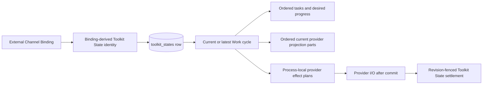

# Selective External Channel Response Design

- Snapshot: `channel-260803`
- Requirements: [`channel-260803/REQ`](../requirements/channel-260803-selective-response.md)
- ADR: [`channel-260803/ADR`](../adr/channel-260803-selective-response.md)
- Design reference: `channel-260803/DESIGN`

## Current Behavior and Requirement Gaps

Channel Work is currently split between `external_channel_works`, which owns the
binding-scoped Work lifecycle and desired progress, and
`external_channel_work_projection_parts`, which owns current provider Tracker identity
and projection outcome. Ingress creates active Work before Session wake, Channel Action
locks and changes that Work before provider I/O, provider outcomes update projection
parts only for the expected desired revision, idle continuation and compaction read
active Work, Session Channels reads the latest Work, and lifecycle paths finish or
delete Work with the binding.

The External Channel Toolkit exposes only `finish` and `continue`. Its static prompt
requires publication for External Channel input, and the runtime does not carry the
current typed input source into `TurnContext`. Consequently, an Agent cannot finish
eligible Channel Work without a provider effect and cannot safely distinguish the
External Channel scope in which silent completion is authorized.

| Requirement | Current gap |
| --- | --- |
| `channel-260803/REQ-1` | Prompt guidance treats each External Channel input as requiring publication rather than a contextual participation judgment. |
| `channel-260803/REQ-2` | No Channel Action mode finishes Work without reply, progress, file, or cleanup effects. |
| `channel-260803/REQ-3` | No silent-completion validator protects `pending` or `in_progress` tasks. |
| `channel-260803/REQ-4` | Typed mailbox/event source exists, but it is not propagated to the Toolkit turn boundary. |
| `channel-260803/REQ-5` | Channel Work and its current provider projection remain in dedicated tables rather than binding-specific Toolkit State. |

## Requirement and ADR Traceability

| Requirement | Design mechanisms |
| --- | --- |
| `channel-260803/REQ-1` | External-response judgment prompt, conservative uncertainty rule, Tool description and schema guidance. |
| `channel-260803/REQ-2` | Eligible `ignore` transition, empty provider-effect plan, unchanged retained projection, finished Work result. |
| `channel-260803/REQ-3` | Canonical unfinished-task validation before state save or provider planning. |
| `channel-260803/REQ-4` | Ephemeral typed turn provenance, binding-scoped `ignore` eligibility, ordinary-turn schema without `ignore`. |
| `channel-260803/REQ-5` | Per-binding Toolkit State identity from `channel-260803/ADR-D1`, typed payload, CAS mutation, migration, management and lifecycle adapters, removal of dedicated tables. |

`channel-260803/ADR-D1` determines that every binding uses an independent Toolkit
State row rather than one Session-wide map or one row per historical Work cycle.

## Architecture and Ownership

### Canonical state boundary

Each binding owns one Toolkit State row with this identity:

- `agent_id`: the Agent owning the binding's AgentSession;
- `session_id`: `binding.agent_session_id`;
- `toolkit_namespace`: `external_channel`; and
- `state_name`: `channel_work:{binding_id}`.

The binding remains the relational discovery, routing, authorization, and lifecycle
root. The Toolkit State payload becomes the only Channel Work and current provider
projection authority. No binding-to-state registry, copied foreign key, shadow Work
row, dual-write path, or fallback reader is added.

A repository-level `ExternalChannelWorkStateStore` adapts the generic
`ToolkitStateRepository` for binding-specific Work operations. It accepts the caller's
`AsyncSession`, derives the identity from validated binding and AgentSession authority,
loads a typed payload, and saves the whole payload with the Toolkit State version as an
optimistic compare-and-set. It does not commit transactions and does not perform
provider I/O.



### Preserved ownership boundaries

| Concern | Authority after the change |
| --- | --- |
| Binding, resource, route, connection, response mode, and credentials | Existing External Channel relational records |
| Current or latest Channel Work and current Tracker projection | Binding-specific `toolkit_states` payload |
| Agent-requested Tool call and result history | Existing Session event history |
| Provider effect plan and immediate outcome | Process-local memory for the current operation |
| External-input eligibility for `ignore` | Ephemeral typed model-turn provenance |
| Session archive/restore/purge | Existing lifecycle orchestrator and generic Toolkit State Session cascade |

## Toolkit State Contract

The payload is a strict versioned Pydantic model derived from `ToolkitStateModel`.
Equivalent local type and field names may vary, but the persisted contract contains:

```text
schema_version
binding_id
work_cycle_id
status
title
ordered tasks
state_revision
desired_progress_revision
desired_progress
finished_at
ordered projection_parts
```

Each projection part contains `part_ordinal`, `desired_progress_revision`, projection
status, and nullable `provider_message_key`. Tasks retain their stable ID, title,
status, optional details, optional output, and ordered labeled sources. Desired
progress remains the existing typed provider-neutral snapshot and retains the existing
64 KiB serialized-size validation before canonical mutation.

`work_cycle_id` is a stable opaque identifier used wherever current code uses the Work
row ID, including Slack revision-derived block IDs, provider operation seeds, and
stale-result fencing. Migration copies the selected legacy Work ID exactly. A new cycle
allocates a new UUID; Toolkit State row identity remains unchanged.

### Work-cycle replacement rules

- An absent state receives a new active cycle when ingress or a valid explicit Channel
  Action requires Work.
- An active cycle is reused idempotently by repeated ingress.
- A finished latest cycle is replaced by a new active cycle on the next accepted
  ingress. The replacement resets title and tasks, starts the checking desired
  progress, initializes revisions consistently with current ingress behavior, clears
  `finished_at`, and clears every prior projection part.
- Finishing a cycle retains it as the latest managed Work until a later cycle replaces
  it or Session purge removes the row.
- Older non-current Work history is not retained in another table or Toolkit State row.

## Canonical Mutation and Concurrency

The Work state store performs a bounded CAS loop. Every attempt reloads and validates
the latest typed payload, reruns a side-effect-free state mutator, and saves with the
observed Toolkit State version. A conflict retries from current state; retry exhaustion
raises a normal conflict failure and produces no provider effect.

Relational authority continues to be checked before mutation:

- direct Channel Action locks and validates the active AgentSession and binding and
  validates Agent, route, connection, and resource;
- ingress uses its existing caller-owned binding/admission transaction;
- lifecycle operations lock affected bindings in stable order; and
- provider outcome settlement revalidates current binding/provider authority and then
  applies only a matching state revision.

No database transaction spans provider I/O. A successful canonical save commits before
an effect is attempted. Process-local effect plans carry `binding_id`,
`work_cycle_id`, part ordinal, and expected desired-progress revision. Outcome
settlement reloads the current binding state and changes a projection part only when
both the cycle ID and expected revision still match. A replaced cycle or newer desired
snapshot makes the result stale and therefore a no-op.

## Runtime Flows

### Ingress and initial Activity Tracker

Synchronous ingestion validates or creates the binding, resolves its Agent and Session,
and ensures active Work through the state store inside the existing admission
transaction. Initial progress planning uses `binding_id` plus the expected
`work_cycle_id`; it no longer discovers Work by a dedicated table primary key.

The initial provider projection preclaim is written into the Toolkit State payload
before the caller commits. The provider plan is attempted once after the current
acknowledgement boundary. Its result settles the matching projection part through the
same cycle-and-revision fence. Mailbox acceptance, wake recovery, and AgentRun creation
remain independent from provider success.

### `continue` and `finish`

Current validation, revision changes, rendering, effect order, and one-attempt provider
semantics remain unchanged. The only storage change is that the transition replaces the
typed Toolkit State payload rather than ORM Work and projection rows.

- `continue` may reply and may replace the complete title/task snapshot. A progress
  change advances the existing state and desired-progress revisions and derives the
  necessary create, update, or delete plans from current projection parts.
- `finish` still requires a final reply, finishes the cycle, advances revisions, clears
  desired progress, and attempts Tracker deletion only after required reply delivery.

### Provider outcome settlement

Reply outcomes remain ordinary Tool results with no durable provider history. Progress
outcomes update only current projection state. Delivered create/update stores the
current provider message key; delivered delete clears it; confirmed failure or
ambiguous outcome stores the corresponding current status. No retry, replay,
reconciliation, compensation, or delivery-attempt record is introduced.

### Management, idle continuation, and compaction

Session Channels continues returning the existing `ManagedWork` public shape. The
management repository resolves every listed binding's Toolkit State and adapts the
payload to the existing status, title, tasks, revisions, `finished_at`, and derived
projection state. No public API or generated-client shape changes.

Idle continuation and compaction load connected bindings in stable order and include
only payloads whose latest cycle is active. Finished cycles are excluded. The existing
compaction snapshot remains provider-neutral and omits diagnostic revisions and
projection outcomes.

### Lifecycle

Binding termination loads the binding's state, finishes an active cycle, clears desired
progress, advances revisions, and captures deletion plans for retained present
projection parts before setting the terminal binding timestamp. It retains the same
post-commit leave-presence and Tracker-cleanup behavior.

Session archive performs that transition for every connected binding. Restore verifies
that restored bindings remain disconnected and every retained latest cycle is
finished. External Channel purge explicitly deletes its namespace rows for the Session
while reporting Work cleanup counts, then deletes bindings. The existing
`session.toolkit-state` participant and `toolkit_states.session_id` cascade remain the
final ownership safety boundary. Agent decommission continues to require generic
Toolkit State absence and removes the obsolete route-owned Work-table check.

Provider-resource loss and route/connection/default removal use the same state-store
termination helper rather than bulk-updating a Work table.

## Selective Response and `ignore`

### Typed turn provenance

The runtime adds an ephemeral closed turn-provenance type. External provenance contains
the binding IDs present in an External Channel invocation or in the existing External
Channel continuation metadata. Ordinary user input, Goal continuation, agent messages,
and action messages are non-external provenance.

Mailbox promotion returns provenance with its typed promoted events. Initial Run input
and model-boundary polling carry it through `RunInputPollResult`, `PollMessagesResult`,
and `InputPollResult`. The execution loop keeps the active provenance for model calls
that follow Tool results without new user input. A new actionable input boundary
replaces it. This preserves the originating External Channel scope through Tool
follow-ups without transcript reverse-search or durable authorization state.

A boundary containing both external and non-external actionable input is conservatively
not `ignore`-eligible. External-only provenance is eligible only for its recorded
binding IDs. This prevents an ordinary chat publication request from borrowing silent
completion authority from an unrelated active binding.

`TurnContext` receives the active provenance. On ordinary turns, `channel_action`
retains the existing `finish | continue` schema. On eligible external-only turns, the
Toolkit exposes an otherwise equivalent schema whose mode additionally permits
`ignore`. The service also receives the eligible binding set and revalidates it, so
schema visibility is not the sole authorization check.

### `ignore` contract and transition

`ignore` requires one eligible binding and accepts no message, title, task update, or
files. Runtime validation rejects any supplied publication or Work-update field.

After existing Agent, Session, binding, route, connection, and resource checks, the
canonical mutator loads the active Work cycle and rejects the operation when any task
is `pending` or `in_progress`. Rejection occurs before state save and before provider
planning. Tasks absent or all `completed`/`failed` are eligible.

An eligible transition:

1. marks the current cycle `finished`;
2. advances `state_revision` and `desired_progress_revision`;
3. sets `finished_at`;
4. clears desired progress;
5. retains current projection parts as current observation data; and
6. returns an empty provider-effect plan.

Therefore it sends no reply, progress mutation, file, or Tracker deletion. A retained
Tracker may derive as stale in Session Channels because provider state remains while no
progress is desired. The result uses the existing Channel Action result shape with an
empty outcomes list. `ignore` is not added to the adjacent-turn publication verbosity
guard because it produces no publication.

## Prompt and Tool Guidance

The static External Channel prompt adds the pre-discovery participation rule:

- treat provider messages as conversation context, not necessarily instructions;
- generally prefer a useful response;
- normally respond to mentions and direct instructions;
- allow no response only when clearly unrelated or explicitly requested;
- let an explicit request not to respond override a mention; and
- respond when relevance is uncertain.

The static prompt continues to state that normal assistant output is not delivered to
the provider. The Tool description and input schema explain `finish`, `continue`, and
the conditionally available `ignore` mode, including its empty-field and finished-task
constraints. No dynamic prompt, provider-specific prompt, or transcript-derived
instruction is added.

## Migration, Rollout, and Rollback

### Forward migration

One Alembic revision performs the destructive cutover in a transaction:

1. acquire locks that prevent concurrent legacy Work/projection writes during the
   selection and drop boundary;
2. select the active Work for each binding, or otherwise its latest Work ordered by
   creation identity;
3. aggregate every selected Work's projection parts by ordinal;
4. insert one `external_channel/channel_work:{binding_id}` Toolkit State row with the
   binding's Agent and Session identity, payload schema version, row version `1`, the
   preserved Work ID, and the complete current projection;
5. fail on a pre-existing conflicting identity or invalid source payload rather than
   overwrite it;
6. verify the selected binding count equals the inserted state count;
7. drop `external_channel_work_projection_parts` and
   `external_channel_works`, their constraints and indexes, and the Work-status
   PostgreSQL type when unused; and
8. retain the shared projection-status PostgreSQL type because access-control
   projection still uses it.

The migration and new application code form one cutover. There is no compatibility
window, feature flag, dual-write, shadow validation mode, or fallback read. Legacy
writes committed before the migration lock are included. Legacy processes attempting
later Work access fail rather than silently write data that the new authority cannot
observe, so rollout must replace old application workers immediately after the
migration.

### Downgrade and recovery

The downgrade recreates the legacy Work table and projection-part table, converts every
External Channel Work Toolkit State row into one current/latest Work row with its
preserved `work_cycle_id`, recreates ordered projection parts, verifies reconstruction,
and then removes only those External Channel state rows. This supports application
rollback without keeping two live authorities.

A failed forward migration rolls back transactionally and leaves the legacy tables
canonical. A payload validation failure after deployment is surfaced as an application
error and operator signal; runtime code does not reinterpret malformed JSON or fall
back to removed tables. Recovery repairs or restores the canonical Toolkit State row
before retry.

## Public Contracts, Security, and Permissions

The Session Channels API, `ManagedWork` schema, generated clients, binding handles,
response modes, task statuses, provider delivery result shape, and existing Slack and
Discord presentation remain unchanged. `ignore` is an LLM Tool mode rather than a
public management API enum.

Every state operation validates the Toolkit State Agent and Session identity against
the requested binding. A caller cannot select another Session's state by constructing a
state name. Existing Session, Agent, route, resource, connection, credential,
capability, and file-authority checks remain mandatory. Turn provenance carries only
source kind and binding IDs; it contains no provider credential, message body, or new
execution identity.

## Failure, Retry, and Recovery

- Toolkit State CAS conflicts retry a bounded number of times from freshly validated
  state. Exhaustion fails the current operation before provider I/O.
- Provider I/O remains one attempt after canonical commit. Failure or ambiguity changes
  only matching current projection state and creates no durable retry work.
- A stale provider outcome whose cycle or desired revision no longer matches is ignored.
- A Worker shutdown before provider I/O leaves committed canonical state and current
  conservative projection exactly as current immediate-delivery semantics require.
- `ignore` has no post-commit provider phase and is complete when the canonical
  transaction commits.
- Archive, restore, purge, and decommission use the existing retry ownership of their
  lifecycle orchestrators; no Toolkit-specific scheduler is added.

## Observability and Operational Risks

Structured logs and metrics distinguish Toolkit State identity conflicts, malformed
payloads, stale provider outcomes, migration count mismatches, ineligible `ignore`
scope, and unfinished-task rejection. Logs include safe Agent, Session, binding,
cycle, revision, and operation identifiers where applicable and never serialize
credentials, provider bodies, file contents, or full Toolkit State JSON.

The principal rollout risk is an old application process accessing removed Work
tables after the migration. Deployment ordering and immediate process replacement
bound that failure window; dual-write is intentionally not used. The principal runtime
risk is a malformed state payload, which fails closed and remains observable rather
than being silently reset.

## Delivery Plan: Exactly Two PRs

The feature is delivered as exactly two sequential PRs.

### PR 1 — Toolkit State migration

PR 1 contains the typed Work state contract and store, every Work/projection reader and
writer cutover, migration and downgrade, removal of dedicated tables/models/repository
paths, management and lifecycle adaptation, relevant Living Spec updates, and migration,
repository, lifecycle, management, integration, and E2E regression tests. It preserves
current `finish` and `continue` behavior and is independently deployable.

### PR 2 — `ignore` and prompt update

PR 2 is based on PR 1 and contains typed turn provenance, conditional Tool schema and
service authorization, the `ignore` transition, static prompt and Tool guidance,
selective-response tests, E2E scenarios, final Living Spec updates, and temporary plan
cleanup. No third cleanup, documentation, or follow-up PR is created.

The complete two-PR stack is created before CI monitoring. PR 2 must not be merged or
deployed before PR 1.

## Test Strategy

### E2E primary verification matrix

| Scenario | Required evidence |
| --- | --- |
| Existing Slack and Discord `continue`/`finish` | Same replies, Tracker create/update/delete order, Tool outcomes, and Session Channels projection after PR 1. |
| Migration with active Work | Preserved cycle ID, title, tasks, revisions, desired progress, provider message key, and active continuation. |
| Migration with only finished history | Latest Work remains visible; older non-current history is absent. |
| Independent bindings in one Session | Separate Toolkit State rows and versions; concurrent changes do not overwrite another binding. |
| Worker restart/handoff and Session archive/restore | Active state survives restart/handoff; archive finishes it; restore does not reactivate it. |
| Session purge and Agent decommission | External Work state is absent through Toolkit State cleanup/cascade and finalizers succeed. |
| Clearly unrelated External Channel message | Eligible `ignore` finishes Work with zero provider requests. |
| Explicit do-not-respond mention | `ignore` is available and produces no provider effect. |
| Mention/direct instruction without opt-out | Prompt fixture selects normal response path. |
| Uncertain relevance | Prompt fixture selects response rather than `ignore`. |
| Pending or in-progress task | `ignore` fails before state mutation and provider request; Work remains active. |
| Empty or all-terminal tasks | `ignore` succeeds and stops idle continuation. |
| Ordinary chat external-publication request | Tool schema omits `ignore`; forced service invocation also fails scope validation. |
| Tool follow-up from External Channel input | `ignore` eligibility and binding set survive the Tool result follow-up. |
| Mixed ordinary and External Channel boundary | `ignore` is not exposed. |

### Test layers

- Migration tests seed active and multiple finished Work rows plus all projection
  statuses, run upgrade, inspect typed Toolkit State JSON and removed schema, run
  downgrade, and verify reconstructable current/latest state.
- Repository tests cover cycle replacement, CAS conflict retry, stale cycle/revision
  settlement, projection derivation, lifecycle termination, restore validation, purge,
  and independent bindings.
- Engine and worker tests cover typed provenance from initial mailbox promotion and
  boundary polling, preservation across Tool follow-up, and replacement by new input.
- Toolkit tests cover ordinary versus eligible schemas, cross-field validation,
  binding authorization, unfinished-task rejection, empty outcomes, prompt wording,
  compaction, and idle continuation.
- Existing provider presentation and delivery tests remain regression evidence because
  PR 1 must not alter provider-visible behavior.

### Fixtures and prerequisites

Deterministic Slack and Discord proxy fixtures are extended to recognize `ignore`,
record zero provider requests for it, and expose prompt-selection evidence for clear,
explicit, mention/direct, uncertain, and mixed-input cases. Existing local provider
credentials and runtime profiles are sufficient; no live customer credential or new
external service is required.

### Evidence and CI policy

Required evidence consists of migration assertions, focused Python unit/integration
results, deterministic proxy journals, Session Channels API projections, and E2E
pass/fail output for both providers. All deterministic tests are mandatory in CI and
must fail rather than skip when their fixture prerequisites are missing. Optional live
provider smoke tests may skip only when explicitly gated credentials are absent and are
not acceptance evidence for the feature.

## Feasibility

| Requirement | Status | Repository evidence |
| --- | --- | --- |
| `channel-260803/REQ-1` | Feasible | External Channel already owns a static prompt and Tool description, allowing pre-discovery and mode-specific guidance without a dynamic prompt. |
| `channel-260803/REQ-2` | Feasible | Canonical transitions already commit before provider I/O and return process-local effects; an empty effect tuple is a supported result shape. |
| `channel-260803/REQ-3` | Feasible | Tasks are typed and validated in the canonical repository path before mutation, so unfinished status can fail atomically. |
| `channel-260803/REQ-4` | Feasible | External invocation and continuation already have closed mailbox/event kinds; the run polling and `TurnContext` chain can carry an ephemeral source value without new persistence. |
| `channel-260803/REQ-5` | Feasible | Toolkit State already provides PostgreSQL durability, typed JSON, independent identity, CAS, Session cascade, and caller-owned transaction participation. Every Work reader has binding/Session authority sufficient to derive the row. |

No confirmed Requirement or accepted ADR decision is blocked. The forward migration
requires coordinated application replacement, but its transaction locks and reversible
downgrade provide a credible no-data-loss cutover without an additional authority.

## Alternatives and Non-Blocking Risks

Rejected persistence alternatives are recorded in `channel-260803/ADR-D1`. The Design
also rejects transcript reverse-search for `ignore` scope because typed mailbox and run
boundaries already possess the source, and rejects a durable authorization flag because
eligibility belongs to the current input turn.

Non-blocking implementation risks are bounded CAS conflicts during concurrent progress
settlement, migration duration proportional to retained Work rows, and deterministic
prompt-fixture maintenance. These affect implementation care and testing but require no
new product behavior, persistence mode, or requester decision.

## Design Authority

- Design revision: `1`

| ID | Material design mechanism | Authority | Classification |
| --- | --- | --- | --- |
| M1 | One independent `external_channel/channel_work:{binding_id}` Toolkit State row per binding | `channel-260803/ADR-D1` | `decided` |
| M2 | One typed payload is the sole current/latest Work and provider-projection authority | `channel-260803/REQ-5`, `channel-260803/ADR-D1` | `required` |
| M3 | Stable `work_cycle_id` preserves provider rendering and stale-result fences across migration and changes on cycle replacement | `channel-260803/REQ-5`; unchanged External Channel delivery Spec | `derived` |
| M4 | Caller-owned transaction plus Toolkit State CAS commits canonical state before one-attempt provider I/O | `channel-260803/REQ-5`; unchanged External Channel delivery Spec | `derived` |
| M5 | Transactional backfill followed by removal of dedicated Work/projection storage with no compatibility authority | `channel-260803/REQ-5` | `required` |
| M6 | Management, continuation, compaction, archive, restore, purge, and decommission resolve the same binding state | `channel-260803/REQ-5` | `required` |
| M7 | Ephemeral typed External Channel turn provenance, including binding IDs, authorizes `ignore` and survives Tool follow-up only | `channel-260803/REQ-4`; unchanged typed mailbox/event contracts | `derived` |
| M8 | `ignore` is binding-scoped, fieldless, rejects unfinished tasks before mutation, finishes Work, and returns no provider effects | `channel-260803/REQ-2`, `channel-260803/REQ-3`, `channel-260803/REQ-4` | `required` |
| M9 | Static prompt owns selective participation judgment while Tool description/schema own mode constraints | `channel-260803/REQ-1`; Toolkit prompt-placement project constraint | `derived` |
| M10 | Existing ingress, response modes, task statuses, explicit publication, provider ordering, and public management shape remain unchanged | `channel-260803/REQ-3`, `channel-260803/REQ-4`, `channel-260803/REQ-5`; confirmed fixed constraints | `existing` |
| M11 | Downgrade reconstructs the single retained current/latest legacy representation before removing the new state rows | `channel-260803/REQ-5`; destructive-migration recovery requirement with no second live authority | `derived` |

## Removal and Replacement

| Existing unit or behavior | Removal authority | Replacement or remaining authority | Removal boundary | Absence verification |
| --- | --- | --- | --- | --- |
| `external_channel_works` table, indexes, FK relationships, and Work-specific PostgreSQL status type | `channel-260803/REQ-5` | Binding-specific Toolkit State payload; Python Work status remains part of the typed contract | PR 1 migration after verified backfill | Schema inspection and repository-wide search find no table/model reference; migration tests prove upgrade and downgrade |
| `external_channel_work_projection_parts` table, indexes, and Work FK | `channel-260803/REQ-5` | Ordered projection parts inside the same Toolkit State payload; shared projection-status type remains for access controls | PR 1 migration after verified aggregation | Schema inspection, state payload assertions, and no table/model references |
| `RDBExternalChannelWork`, `RDBExternalChannelWorkProjectionPart`, dedicated CRUD/locking helpers, and table-shaped fixtures | `channel-260803/REQ-5` | `ExternalChannelWorkStateStore`, typed payload models, and state-focused fixtures | PR 1 code cutover | Repository search plus focused repository, management, lifecycle, and fixture tests |
| Work-table reads in ingress, Channel Action, provider settlement, management, lifecycle, resource loss, and decommission finalization | `channel-260803/REQ-5` | Binding-derived Toolkit State reads and CAS mutations | PR 1 | Call-path tests and search for removed ORM symbols |
| `external_channel_works` entry in the External Channel lifecycle ownership manifest | `channel-260803/REQ-5` | Existing `session.toolkit-state` participant owns `toolkit_states`; External Channel lifecycle mutates/deletes its namespace rows | PR 1 | Lifecycle schema tests and manifest snapshot |
| Static instruction that every marked External Channel request must publish | `channel-260803/REQ-1`, `channel-260803/REQ-2` | Selective-response judgment plus explicit publication/eligible-ignore guidance | PR 2 | Toolkit prompt tests and deterministic model fixture evidence |
| `finish | continue`-only Tool schema on eligible External Channel turns | `channel-260803/REQ-2`, `channel-260803/REQ-4` | Conditional eligible schema adds `ignore`; ordinary schema remains unchanged | PR 2 | Schema projection and forced-service authorization tests |
| Public Session Channels Work contract | None; it is retained | Existing `ManagedWork` API and generated clients | No removal | OpenAPI diff and management E2E show unchanged shape |
| Provider-specific response mode, delivery ordering, and task-status behavior | None; it is retained | Existing External Channel Specs | No removal | Existing Slack/Discord regression tests |

## Design Approval

- Mode: `Collaborative`
- Decision owner: `Requester`
- Status: `Approved`
- Approved on: `2026-08-03`
- Approved Design revision: `1`
- Approved authority IDs: `M1, M2, M3, M4, M5, M6, M7, M8, M9, M10, M11`
- Approved scope: `Binding-specific Toolkit State cutover for current/latest Channel Work and provider projection, followed by External Channel-only silent ignore completion and selective-response prompt guidance, delivered as exactly two sequential PRs.`
