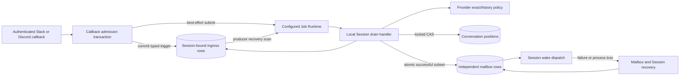

# Batched External Channel Conversation Ingress Design

- Snapshot: `channel-260810`
- Document reference: `channel-260810/DESIGN`
- Requirements:
  [`channel-260810/REQ`](../requirements/channel-260810-batched-conversation-ingress.md)
- Decisions:
  [`channel-260810/ADR`](../adr/channel-260810-batched-conversation-ingress.md)
- Mode: Collaborative
- Decision owner: Requester

## Summary

External Channel conversation callbacks stop performing provider history reads and
mailbox admission synchronously. After transport authentication and the current
admission filters resolve one immutable target Session, the callback inserts one
content-free trigger into a Session-bound PostgreSQL ingress queue and asks the common
Job Runtime to drain that Session.

The initial Job Runtime is a bounded Local backend stored as one process-lifetime
`AppContext` singleton. External Channel producers and Scheduler use the same runtime
contract. Scheduler keeps its existing due discovery, PostgreSQL state, lease, and retry
ownership; External Channel keeps retry and queue state in its own domain tables. The
runtime owns no durable handler queue.

One Session drain owns one durable lease. Its first batch contains one trigger and
later backlog batches contain at most ten. Items are processed in durable queue order.
Provider content remains request-local until one final transaction compare-and-set
advances the relevant conversation cursors, creates one mailbox row per canonical
provider message, applies retry-tail transitions, and removes successful, suppressed,
or bounded-failure ingress rows. A non-empty mailbox commit produces one post-commit
Session wake. Completed ingress outcomes are not retained; bounded failures emit
sanitized structured logs.

## Current Behavior and Gaps

The current synchronous flow is documented by
[External Channel Provider Ingress](../spec/flow/external-channel-provider-ingress.md).
It authenticates the callback, reads provider history, creates one mailbox envelope
containing several provider messages, advances the conversation position, and dispatches
a wake inside one 2.5-second transport deadline. Provider tail latency therefore still
controls durable receipt.

The current mailbox contract stores `ExternalChannelInvocationMailboxPayload.items`
inside one `mailbox_items` row. The nested canonical message payload uses
`authorization = context_only | authorized_invocation`. Pending chat projection,
historical events, prompt rendering, title derivation, OpenAPI, fixtures, and tests all
consume that naming.

The current Scheduler flow is documented by
[Periodic Execution](../spec/flow/periodic-execution.md). It already owns durable
schedule state and PostgreSQL row leases separately from `LocalTaskExecutor`, but the
executor is Scheduler-specific and does not track process-wide tasks or drain them as a
shared application resource.

The current durable wake authority remains valid: under
[ingress-260801/ADR-D1](../adr/ingress-260801-reliable-external-channel-execution.md),
conversation position owns provider-range ordering and mailbox state owns accepted input
and pending wake recovery. This Design preserves that authority and introduces no
separate wake record.

## Requirement Traceability

| Requirement | Design mechanisms | Verification |
| --- | --- | --- |
| `channel-260810/REQ-1` | DB-only callback admission, immutable Session target, existing setup/access paths outside the queue | Signed Slack and typed Discord admission E2E; fail-closed unit matrix |
| `channel-260810/REQ-2` | Active ingress tables, idempotent insertion, producer-local submission, recovery scan | delayed-provider, process-loss, duplicate-delivery E2E |
| `channel-260810/REQ-3` | Per-Session drain state, first-batch flag, queue-order key, bounded claims | paused-first-batch and eleven-item backlog E2E |
| `channel-260810/REQ-4` | Provider policy registry, exact/history separation, active-trigger correlation, `prompt_role` | Slack/Discord normalization, out-of-order correlation E2E |
| `channel-260810/REQ-5` | One provider message per mailbox row, stable mailbox ordering, atomic successful-subset commit, one wake | mailbox-row and public history/live evidence |
| `channel-260810/REQ-6` | attempt/age budget, retry-tail order, bounded failure deletion and log | rate-limit, Retry-After, redelivery, sanitization tests |
| `channel-260810/REQ-7` | tentative per-conversation cursor map, final locked CAS, suppression deletion | same-batch 20-before-19 and stale-CAS concurrency tests |
| `channel-260810/REQ-8` | active-queue diagnostics, metrics, sanitized failure logs, no completed rows | diagnostic CLI/repository tests and log redaction assertions |

## Architecture



The Local backend does not transport work between processes. PostgreSQL domain state
allows any eligible producer replica to recover a lost local submission and acquire the
Session drain lease.

## Common Job Runtime

### Runtime contract

A code registry maps closed handler keys to typed handlers. The initial registry has at
least:

- one handler for a claimed Scheduler task key; and
- one handler for an External Channel Session ingress drain.

A job request contains a handler key, a stable execution key, an absolute deadline, and
a JSON-safe typed payload. Domain code does not import Local or Temporal implementation
APIs. Local execution creates a task-local DI container rooted in the current
`AppContext` dependency graph; the Runtime itself is stored only through
`AppContext.get_variable()`. It never retains request-scoped sessions or provider
callback objects.

The runtime returns a handle with a typed structured outcome. Scheduler awaits the
handle and records its existing durable result. External Channel submission is
fire-and-observe: durable ingress state remains the recovery authority if the handle is
lost or cancelled.

### AppContext singleton and shutdown

`get_job_runtime()` uses `AppContext.get_variable()` to create exactly one runtime per
process. It does not install a FastAPI dependency override. Production API, External
Channel Gateway, and Scheduler processes each host one Local runtime because each is a
long-lived producer. Co-located devserver roles share one `AppContext` and therefore one
runtime instance.

`AppContext` gains a two-phase close hook:

1. pre-close callbacks run before ordinary `AsyncExitStack` resource teardown;
2. normal managed resources then close in reverse creation order.

The Job Runtime registers one idempotent pre-close callback. It atomically closes new
submission, snapshots the process-wide task registry, and waits for all accepted tasks.
Every accepted task already has an absolute handler deadline. A task exceeding that
deadline is cancelled; cancellation cleanup receives one short code-defined grace, and
the runtime records a safe terminal outcome before removing the task from the registry.
Task removal and shutdown snapshots use one lock so teardown cannot miss an accepted
task.

Each task uses a task-local DI container backed by the still-open `AppContext`. This
allows the application root container to drain without invalidating active background
handlers; lower-level AppContext resources close only after the runtime pre-close wait
finishes.

### Concurrency and deduplication

The Local backend uses one bounded semaphore and a registry keyed by the stable
execution key. Repeated submission of an already registered execution key returns the
same handle rather than creating another task. External Channel uses a Session-scoped
execution key, so callbacks in one process coalesce into one drain task while different
Sessions may run concurrently.

Concurrency limits and cancellation grace are validated code defaults in this snapshot;
they are not new Admin-managed settings. Handler definitions own their individual
absolute timeout. The runtime never starts one OS thread per job.

### Backend selection

One instance-wide configuration value selects the Job Runtime backend. `local` is the
implemented and default backend in this snapshot. `temporal` is a reserved closed value
that fails startup with an explicit unavailable-backend error until a future approved
snapshot installs the Temporal implementation. There is no silent fallback to Local.

When Temporal is implemented, the same configuration selects it for every registered
handler in the distributed deployment. Helm exposes one value to all producer roles and
Scheduler; it does not expose per-handler routing. Standalone may continue selecting
Local.

## Ingress Persistence

### Session drain state

A new External Channel ingress-session table has one active row per Session with queued
work. It stores:

- immutable Session identity;
- current drain lease owner, generation, acquisition, and expiration;
- whether the first batch after the idle boundary remains unclaimed;
- current batch identity and safe timestamps; and
- creation/update timestamps.

The row is created with the first queue item and deleted when no ingress items remain.
It is domain state, not a generic job record. Conditional lease acquisition permits one
active drain across producer replicas. Lease expiry makes an interrupted drain
recoverable. The first successful claim clears the first-batch flag and claims one
item; later claims under the same non-empty drain lifecycle claim at most ten.

### Ingress item

A new External Channel ingress-item table stores only active content-free triggers. An
item includes:

- immutable ingress identity and Session identity;
- current queue-order key;
- provider, connection, tenant, event kind, conversation scope, Resource, Binding, and
  provider message locator identities required by the approved admission;
- exact trigger position, message key, participant identity, and invocation identity;
- active state: `pending`, `processing`, or `retry_waiting`;
- attempt count, first-created time, next-attempt time, processing owner/generation, and
  active batch identity; and
- safe timestamps.

No raw callback, message body, credentials, signatures, interaction tokens, private
URLs, provider history, completed status, terminal reason, or tombstone is stored.

A unique active-lifecycle identity converges duplicate delivery while the row exists.
Bounded failure deletes the row. A later provider redelivery ahead of the cursor may
create a new row and retry budget, as required.

The item ID remains immutable. Retry-tail movement assigns a new monotonically ordered
queue key, preserving the original identity and attempt age while allowing later items
to proceed.

## Callback Admission

Authenticated transports keep their existing signature, Guild/Team, connection,
message-kind, response-mode, participant-access, Binding, and Session checks. The normal
conversation callback path is split before provider I/O:

1. normalize one bounded typed trigger locator;
2. authenticate transport and current connection authority;
3. apply mention/response-mode, Bot/App exclusion, participant access/block, active
   Binding, and target Session filters;
4. ensure and lock the Session drain-state row, then insert or reuse the active ingress
   row in the same transaction; and
5. after commit, submit the Session execution key to the Local Job Runtime.

The callback returns its provider acknowledgement after durable insertion and does not
wait for Local task acceptance, provider exact-message reads, history reads, mailbox
admission, or Session wake.

Final queue-empty deletion locks that same drain-state row before checking for remaining
items. A concurrent callback therefore either inserts before the empty check or waits
for deletion and recreates the drain state before inserting; it cannot commit an orphan
item without a recoverable Session owner.

Unconnected setup, selection, access approval, and Binding establishment remain outside
the Session queue. Their existing replay boundaries may call the same DB-only admission
operation only after one target Session has been resolved. Settings changes after
insertion do not reroute or reclassify the retained trigger.

Every callback already delivered by Slack or Discord independently attempts insertion.
A failure handling an earlier callback does not close or poison the later callback
admission path. Transport-level connection failures remain owned by the provider
manager lifecycle.

## Session Drain and Batch Formation

An eligible producer recovery loop scans only active ingress-session rows whose lease
is absent or expired and submits their Session execution keys. The API and External
Channel Gateway producer runtimes run this bounded scan on startup and periodically.
The scan is a wake mechanism; it does not claim or execute generic job rows.

The drain handler conditionally acquires one Session lease. It then repeats:

1. claim one item if `first_batch_pending` is true, otherwise claim at most ten due
   items in queue-key order;
2. assign one batch identity and mark those items processing;
3. resolve items sequentially in that same order outside a database transaction;
4. finalize the whole batch in one short transaction; and
5. immediately claim the next due backlog batch while rows remain.

Arrivals after a claim retain later queue keys and wait for the next batch. A retry-wait
item is not due and does not block later due items. When no due item remains, the
handler releases its lease. If retry-wait items remain, the recovery scan resubmits the
Session when their earliest due time arrives. When no rows remain, finalization deletes
the Session drain-state row.

Cross-Session fairness is provided only by the Job Runtime concurrency bound. Within one
Session, strict queue order and cursor semantics take priority over provider-I/O
parallelism.

## Provider Resolution and Cursor Semantics

### Typed provider policies

A provider policy registry resolves one ingress item into:

- zero or more ordered history messages before the exact trigger;
- exactly one exact trigger message;
- the observed exclusive-start cursor and final trigger position; or
- a retryable or bounded-failure classification with safe retry metadata.

Slack and Discord retain their existing adopted-SDK exact/history clients, bounds,
identity validation, rate-limit mapping, and attachment metadata rules. Provider content
exists only in the drain task's memory until final mailbox admission.

### Same-batch cursor view

The handler maintains one tentative cursor per canonical connection/conversation while
it processes the claimed queue order. Before avoidable provider work, it reads the
current durable cursor and suppresses an item already at or behind that value. A
successful prepared item advances the tentative cursor before the next same-conversation
item is evaluated. The handler never resorts by provider position.

The final transaction locks all affected conversation-position rows in deterministic
identity order. It verifies that each initial durable cursor still matches the
preparation snapshot, then replays the batch's tentative advances in queue order. A
stale cursor invalidates all uncommitted provider content for the affected batch; no
mailbox row or queue completion is committed from the stale preparation. The handler
performs a bounded coordination retry from the current cursor without treating the
conflict as a provider attempt.

Only successful canonical admission updates `read_through_position`. Retry, bounded
failure, queue movement, and suppression do not.

### Invocation correlation

Before mailbox payloads are built, the final transaction correlates each returned
provider message identity with active admitted ingress rows for the same connection and
conversation. A match assigns:

- `prompt_role = invocation`; and
- the matching ingress invocation identity.

An unmatched provider-history message receives `prompt_role = context`, regardless of
visible mention text. The exact trigger receives its own row's invocation identity.

Correlation includes pending, retry-waiting, and currently claimed rows, including
later items in the same processing batch. Therefore a position-20 trigger may materialize
position 19 as an invocation history item before the queued position-19 processing
attempt is cursor-suppressed. Deleting the later suppressed queue row does not alter the
already committed mailbox payload.

## Atomic Mailbox Admission and Wake

### Independent mailbox rows

The External Channel mailbox payload becomes a single-message closed payload. Every
canonical provider message is represented by one `mailbox_items` row with:

- one canonical `ExternalChannelMessagePayload`;
- one provider-message idempotency identity;
- its own FIFO position;
- provider position and provenance;
- `prompt_role = context | invocation`; and
- optional omission metadata attached to the first retained history message.

A context-omitted reminder is emitted during promotion immediately before that message;
it does not create another provider-message mailbox row. An ingress result with `n`
history messages and one exact trigger therefore creates exactly `n + 1` mailbox rows.

The mailbox kind is renamed from the batch-shaped External Channel invocation name to a
single External Channel message name. Pending chat projection and promotion process one
row at a time. Initial-title eligibility remains attached only to the exact eligible
human invocation message.

### Stable FIFO ordering

Mailbox ordering gains a stable order-group plus sequence within the group. Existing
rows backfill their own ID as the order group and sequence zero. New ordinary mailbox
rows do the same. All message rows produced from one ingress processing batch share one
new ordered group and receive contiguous sequence values following processing-batch
queue order and per-item provider-history order.

Mailbox reads and FIFO locks order by group, sequence, then ID. This makes the required
order explicit and allows migration to split one legacy multi-message row at its exact
existing FIFO position without relying on gaps between UUIDv7 values.

### Final transaction

After every claimed item has a current prepared outcome, one transaction:

1. re-locks the Session drain state and claimed ingress rows;
2. locks and validates all affected conversation positions;
3. correlates returned messages with active admitted trigger rows;
4. creates or reuses all independent mailbox rows for successful items in deterministic
   order;
5. advances successful conversation cursors in queue order;
6. moves retryable items to new queue-tail keys and sets their due times;
7. deletes successful, suppressed, and bounded-failure ingress rows;
8. updates or deletes the Session drain-state row; and
9. marks the Session runnable through the existing mailbox wake transition when at
   least one mailbox row exists.

Any failure rolls back the complete mailbox successful subset and every cursor/queue
transition in that transaction. Retryable and bounded-failure items never contribute a
mailbox row.

After commit, the handler issues one routing-only Session wake if and only if the batch
committed at least one mailbox row. Broker failure does not roll back or delete mailbox
rows. Existing mailbox pending-state checks, terminal idle rechecks, and stuck-Session
recovery remain the correctness path. Duplicate wake delivery is harmless; there is no
separate durable wake record.

## Retry, Bounded Failure, and Recovery

One ingress lifecycle has at most five provider attempts including the first and may
remain retryable for at most five minutes from its original creation. Default delays are
2, 10, 30, and 60 seconds with bounded jitter. Provider `Retry-After` is accepted only
when it fits within the remaining age budget.

A retry transition increments the attempt count, assigns a new queue-tail key, stores
only the safe next-attempt time, and returns the item to `retry_waiting`. Cursor coverage
is checked before every provider retry.

Attempt exhaustion, age exhaustion, an excessive `Retry-After`, or a provider-classified
non-retryable failure produces a bounded failure. The final transaction deletes the
item without cursor advancement. After final cursor and ownership checks succeed and
the deletion is staged, the transaction path emits a sanitized structured failure log
before committing. The log is keyed by ingress identity, provider, safe failure
category, attempt count, and age. Logs are diagnostic rather than correctness authority;
message content, participant labels, credentials, private URLs, and raw provider errors
are excluded.

After all final cursor and ownership checks succeed, bounded-failure logs are emitted
before the transaction commits the corresponding row deletions. Logging is not
transactional: a commit failure after emission may cause a later retry to emit the same
logical failure again. The stable ingress identity is therefore included for log-sink
deduplication, while no queue correctness depends on exact-once logging.

Process termination while items are processing leaves their Session lease and item
processing ownership to expire. A producer recovery scan then resubmits the Session.
Provider content prepared before termination is absent from PostgreSQL and is fetched
again. Idempotent mailbox identities and final cursor CAS prevent duplicate canonical
input.

## Prompt Role and Presentation Contract

`ExternalChannelMessagePayload` replaces `authorization` with:

```text
prompt_role = context | invocation
```

The change applies to mailbox payloads, durable Event payloads, pending chat
presentation, live events, history projection, prompt rendering, response lowering,
context accounting, Session/thread title derivation, filters, OpenAPI schemas, and all
fixtures and tests. Human-readable prompt output uses `Prompt role:` rather than
`Authorization:`.

Prompt role never participates in callback permission, Session routing, mailbox
eligibility, retry, cursor, or wake decisions. Code paths that require an exact
invocation, such as initial title derivation, test `prompt_role == invocation` together
with the existing human-author and eligibility conditions.

No alias, compatibility model validator, dual-read payload, fallback label, or old enum
value remains after migration.

## Configuration and Runtime Packaging

The server configuration gains one Job Runtime backend selector with Local as the
default. Helm supplies the same selector to API, External Channel Gateway, Scheduler,
and standalone packaging. A mismatched producer-role configuration is rejected by
render/config tests; there is no per-handler value.

Production keeps the existing API, External Channel Gateway, Scheduler, and Worker
Deployments. No External Channel worker, generic Background Worker Deployment, or
per-domain Pod is added. API and Gateway processes host the External Channel producer
recovery loop. Scheduler continues using its own Deployment and delegates claimed
handler execution to its Local Job Runtime.

Devserver shares one `AppContext`, DI base, Job Runtime, and handler registry across its
co-located API, Worker, Scheduler, and optional testenv surfaces. Reload packaging must
preserve one runtime owner in each active devserver child process rather than allowing
each FastAPI app factory to create an independent AppContext.

## Security and Permission Boundaries

- Transport authentication and admission filtering complete before queue insertion.
- Queue rows contain no canonical content or raw callback material.
- Provider history remains the only canonical content source.
- A history mention is not re-authorized from text; invocation role requires active
  admitted-trigger identity correlation.
- Connection and Session technical availability are revalidated during processing, but
  ordinary response-mode, access, and Binding selection are not re-decided or rerouted.
- All failure logs use closed safe categories and allowlisted identifiers.
- Redis remains optional and is not required for queue correctness, ordering, recovery,
  or wake evidence.

## Migration and Rollout

### Database migration

One new forward migration:

1. creates active ingress-session and ingress-item tables, constraints, indexes, and
   active-state enums;
2. adds mailbox order-group and order-sequence columns and backfills existing rows;
3. splits every pending legacy External Channel multi-message mailbox envelope into
   single-message rows sharing the original order group and contiguous sequences;
4. moves omission state onto the first retained history message payload;
5. rewrites pending mailbox and durable Event JSON from `authorization` values to
   `prompt_role` values;
6. renames the persisted mailbox kind to the single-message contract; and
7. validates that no old key, old value, or multi-message External Channel envelope
   remains before committing.

Previously executed migrations are not edited. Historical Event content and pending
mailbox input are preserved; only their canonical field and row shape change.

### Coordinated rollout

The payload rewrite has no compatibility reader, so mixed old/new application versions
are not supported. Existing Slack HTTP, Slack Socket, and Discord Gateway message
quiesce controls stop new normal message admission. Operators drain in-flight
synchronous callback work, apply the migration, deploy all affected producer/API/Worker
roles, then release quiesce.

The migration is transactional and fails closed on malformed legacy payloads or an
unrepresentable ordering invariant. Deployment proceeds only after preflight reports
all legacy rows transformable.

### Rollback

Application rollback across the canonical payload rewrite is not supported because old
code cannot read the new contract and retaining a dual reader is explicitly forbidden.
Operational rollback means restoring the pre-migration database backup and the old
application version together before ingress is reopened. After migration commit, the
supported recovery is roll-forward.

A future Temporal adoption uses a new approved snapshot. This migration installs only
the Local backend and the global backend-selection boundary.

## Observability

Active-queue repository queries and a read-only operator CLI expose:

- pending, processing, and retry-waiting counts;
- provider and connection identity;
- Session age and oldest queue age;
- attempt count, current batch identity, and next-attempt time; and
- lease owner/expiry without message bodies.

Metrics expose backlog size, oldest age, claimed batch size, processing duration,
retry count, bounded-failure count, cursor suppression count, mailbox rows committed,
post-commit wake attempts/failures, runtime active-task count, and shutdown drain time.

Only bounded failures emit retained diagnostic logs. Successful and suppressed queue
completion do not create durable outcome rows or success logs. Existing Session-creation
logging remains unchanged and separately governed by its current redaction contract.

## Test Strategy

### E2E primary verification matrix

| Journey | Primary evidence |
| --- | --- |
| Slack HTTP callback with blocked provider history | acknowledgement after durable queue insertion; later independent mailbox/history events |
| Discord Gateway callback backlog | every delivered callback obtains an ingress identity even when an earlier resolution fails |
| Idle then backlog batching | first claim size one; subsequent claims at most ten; no accumulation delay |
| Same-conversation out-of-order 20 then 19 | message 19 committed as invocation history; queued 19 later cursor-suppressed |
| Independent mailbox cardinality | `n` history plus exact trigger yields `n + 1` pending/promoted message identities in order |
| Mixed batch outcomes | successful subset commits atomically; retry/failure items create no mailbox rows; one wake attempt |
| Retry tail and Retry-After | later items proceed; bounded delays respected; excessive delay logs failure and removes row |
| Failed-trigger redelivery | new lifecycle ahead of cursor; suppression after another success advances cursor |
| Wake dispatch failure | committed mailbox input is eventually consumed through existing recovery without provider resend |
| Process shutdown | new submission closes and teardown waits for tracked bounded tasks |
| Migration | historical events preserved, pending envelopes split in place, old contract absent |

### E2E plan and fixtures

The existing deterministic Slack and Discord provider fakes are extended with:

- exact/history barriers that hold one provider operation until released;
- ordered callback injection for several Sessions and conversations;
- configurable history pages containing earlier admitted trigger identities;
- rate-limit and `Retry-After` sequences;
- safe operation counters without message-content evidence; and
- one injectable post-commit wake failure.

The testenv API gains credential-free inspection and release operations for active
ingress state, claimed batch sizes, mailbox row identities, and fake-provider barriers.
It never exposes queue message bodies because none are stored.

No live provider credential is required for the primary matrix. Optional live smoke
tests may verify SDK compatibility but cannot substitute for deterministic E2E and do
not run as a required CI lane. Required deterministic tests fail rather than skip when
the provider fake, PostgreSQL migration, or Runtime fixture is unavailable.

Evidence consists of public callback acknowledgements, public pending/live/history
projections, sanitized testenv state, database migration assertions, and captured
allowlisted logs. Raw provider callbacks, credentials, and message bodies are excluded
from retained evidence.

### Lower-level verification

- repository tests cover idempotent insertion, first/subsequent claims, lease reclaim,
  tail movement, state-row deletion, and active diagnostics;
- Job Runtime tests cover AppContext singleton identity, execution-key coalescing,
  concurrency bounds, deadline cancellation, two-phase teardown, and task-local DI;
- Scheduler tests prove existing lease/retry semantics while using the common runtime;
- provider policy tests cover error classification and exact/history separation;
- transaction tests cover cursor CAS, correlation, mailbox ordering, atomic rollback,
  and no-wake empty batches;
- migration integration tests prove field rewrite, row splitting, FIFO preservation, and
  absence of legacy keys/values; and
- static searches reject legacy prompt-role names, batch-shaped payloads, generic job
  queues, per-handler backend selection, and direct Temporal imports in domain code.

## Feasibility Validation

| Requirement | Status | Repository evidence and conclusion |
| --- | --- | --- |
| `REQ-1` | Feasible | Current Slack/Discord authentication, normalization, response-mode, access, Binding, and Session resolution already exist before final mailbox admission; the callback path can stop after a new DB-only insertion. |
| `REQ-2` | Feasible | PostgreSQL repository/migration patterns and provider transport locators support content-free durable receipt. `AppContext.get_variable()` already supplies process-lifetime lazy resources, while a new pre-close phase can drain accepted Runtime tasks before the existing `AsyncExitStack` releases DB/provider resources. |
| `REQ-3` | Feasible | Conditional row claims and leases already exist in Scheduler and External Channel repositories. A drain-row lock serializes callback insertion against queue-empty deletion, and an indexed mutable queue key supports first-one, later-ten, retry-tail, and reclaim semantics. |
| `REQ-4` | Feasible | Existing typed Slack/Discord exact/history adapters and deterministic provider fakes support separate policies; active ingress identities provide invocation correlation without parsing visible mention text. |
| `REQ-5` | Feasible | `MailboxService.enqueue_many` already admits several rows in one transaction, but the current repository orders only by UUIDv7 mailbox ID. Explicit order-group/sequence columns are therefore required and sufficient to split legacy envelopes without moving their FIFO position. |
| `REQ-6` | Feasible | Active row attempt/age fields and provider-fake rate-limit scenarios support retry-tail and bounded-failure behavior without completed outcome storage. |
| `REQ-7` | Feasible | `ExternalChannelRepository` already exposes a row lock and conditional `advance_conversation_position_if_current`. Sequential preparation with a tentative map and final deterministic lock order preserves same-batch cursor visibility without holding DB locks across provider I/O. |
| `REQ-8` | Feasible | Active rows contain every approved diagnostic field. The current testenv API has no External Channel ingress surface, but its guarded devtools pattern is reusable; existing logging/metrics conventions and sanitized provider evidence support the required operator and redaction checks. |

Cross-cutting authority mechanisms also have concrete repository paths:

- `M2` and `M9`: Scheduler already calls through `TaskExecutor`;
  `AppContext.get_variable()` supplies a process-lifetime singleton;
  `di.Container.copy()` creates a task-local container without inheriting the parent
  dependency cache; and `ModelStreamCleanupRegistry` demonstrates strong task ownership,
  done-callback outcome consumption, bounded cancellation, and shutdown drain patterns.
- `M3`: API, External Channel Gateway, Scheduler, and Worker Deployments already consume
  the same Helm `server-env` ConfigMap, so one backend selector can be rendered
  consistently and rejected at startup before any unsupported Temporal path runs.
- `M7` and `M10`: existing forward migrations already rewrite `mailbox_items.payload`
  and durable Event JSON. The new migration additionally introduces explicit FIFO
  columns, splits legacy envelopes, changes the mailbox kind, and validates total
  removal of the old prompt-role contract.
- `M11` and `M12`: API/Gateway long-lived loops, guarded testenv route mounting, and
  provider-fake sanitized evidence stores provide the required lifecycle and
  deterministic diagnostics patterns; only the new ingress-specific scan and
  inspection surfaces must be added.

No confirmed Requirement or accepted ADR decision is blocked. The coordinated payload
migration and shared-devserver AppContext are broad changes but have credible forward
migration and deterministic verification paths. Current non-reload devserver packaging
creates independent FastAPI AppContexts in addition to the Worker/Scheduler container;
implementation must replace those factories with externally owned shared-context app
construction. Reload child processes may remain separate processes, but each child must
still own exactly one AppContext and one Local Runtime.

## Removal and Replacement

| Existing unit or behavior | Removal authority | Replacement or remaining authority | Removal boundary | Absence verification |
| --- | --- | --- | --- | --- |
| Provider history and mailbox work inside the 2.5-second callback path | `REQ-2` | DB-only callback admission plus Local Job Runtime drain | Normal Slack/Discord conversation callbacks; interactive controls remain separate | callback tests show no provider history before acknowledgement |
| Scheduler-only `LocalTaskExecutor` | `ADR-D1` | Common Job Runtime Scheduler adapter | Scheduler handler execution only; schedule state/lease remain | no Scheduler direct handler call or `LocalTaskExecutor` class |
| Multi-message `ExternalChannelInvocationMailboxPayload` | `REQ-5` | Single-message External Channel mailbox payload | pending persistence, promotion, live/history projection | migration/static tests find max one provider message per row |
| `authorization`, `context_only`, `authorized_invocation`, `Authorization:` | `REQ-4` | `prompt_role`, `context`, `invocation`, `Prompt role:` | persisted JSON, models, renderers, OpenAPI, fixtures, tests | repository and DB post-migration absence checks |
| Callback failure closes/poisons later delivered Discord message callbacks | `REQ-2` | independent durable insertion attempt per callback | message admission callback handling; Gateway lifecycle failures remain authoritative | deterministic backlog E2E |
| Normal-message dependence on Redis conversation lock for correctness | `REQ-2`, fixed Redis constraint | PostgreSQL Session drain lease and cursor CAS | queued normal conversation processing; setup/interactive coordination may retain existing lock | Redis-unavailable E2E still drains accepted queue |
| Immediate per-trigger mailbox wake | `REQ-3`, `REQ-5` | one post-batch wake after atomic successful subset | normal conversation ingress only | wake counter equals non-empty processing batches |
| Completed ingress outcome retention proposal | revised `REQ-6`, `REQ-8` | None; queue row deletion and failure-only log | successful, suppressed, bounded-failure completion | schema and repository tests show no completed state/table |
| Independent devserver AppContext creation by each FastAPI app factory and the Worker/Scheduler container | `ADR-D1` | one shared devserver AppContext, DI base, and Job Runtime | co-located standalone packaging, including testenv when enabled | singleton identity and devserver lifecycle test |
| Legacy pending mailbox/event JSON | `REQ-4`, `REQ-5` | transformed canonical payloads | one forward database migration | migration integration and static absence checks |

## Assumptions and Non-Blocking Risks

- Provider callbacks can still be redelivered after a bounded failure. Without a
  completed tombstone, such a trigger starts a new lifecycle unless the cursor has
  advanced; this is the confirmed contract.
- Failure logs are diagnostic and cannot be transactionally atomic with PostgreSQL row
  deletion. The stable ingress identity permits downstream log deduplication around a
  rare crash boundary; no correctness behavior depends on the log.
- Strict per-Session queue order intentionally leaves provider I/O sequential within one
  batch. Cross-Session runtime concurrency supplies throughput.
- A future Temporal backend may require an outbox for transactional handoff, but this
  snapshot neither creates that outbox nor claims Temporal is runnable.
- Coordinated rollout is required because compatibility readers are prohibited.

## Design Authority

- Design revision: `1`

| ID | Material design mechanism | Authority | Classification |
| --- | --- | --- | --- |
| M1 | DB-only, Session-bound callback admission before provider I/O | `channel-260810/REQ-1`, `REQ-2` | `required` |
| M2 | One common producer-local Job Runtime for External Channel and Scheduler | `channel-260810/ADR-D1` | `decided` |
| M3 | One instance-wide configured backend with no per-handler Local/Temporal mixing | `channel-260810/ADR-D2` | `decided` |
| M4 | Active Session drain state with one first item and later batches of at most ten | `channel-260810/REQ-3`, `ADR-D1` | `derived` |
| M5 | Sequential tentative cursor evaluation plus final locked CAS and atomic batch finalization | `channel-260810/REQ-3`, `REQ-5`, `REQ-7` | `derived` |
| M6 | Provider-specific exact/history policies and active-trigger invocation correlation | `channel-260810/REQ-4`, `REQ-7` | `required` |
| M7 | One independent mailbox row per provider message, stable FIFO group/sequence ordering, and one recoverable post-batch wake | `channel-260810/REQ-5`, `ingress-260801/ADR-D1` | `derived` |
| M8 | Retry-tail lifecycle with bounded failure deletion, no completed outcomes, and failure-only logs | `channel-260810/REQ-6`, `REQ-8` | `required` |
| M9 | AppContext singleton runtime with task registry and pre-resource shutdown drain | `channel-260810/ADR-D1`, periodic-execution current lifecycle | `derived` |
| M10 | Canonical `prompt_role` contract and no-compatibility persisted-data migration | `channel-260810/REQ-4`, `REQ-5` | `required` |
| M11 | Producer-local recovery scans that resubmit active Session domain state | `channel-260810/REQ-2`, `ADR-D1` | `derived` |
| M12 | Active-queue operator diagnostics and sanitized bounded-failure observability | `channel-260810/REQ-8` | `required` |

## Design Approval

- Mode: Collaborative
- Decision owner: Requester
- Approved on: 2026-08-10
- Approved Design revision: `1`
- Approved authority IDs: `M1` through `M12`
- Approved scope: DB-only Session ingress admission, common producer-local Job Runtime,
  globally selected future backend boundary, bounded Session batching, provider
  resolution and cursor finalization, independent mailbox rows and one recoverable
  wake, retry/failure recovery, AppContext lifecycle, canonical `prompt_role`
  migration, producer recovery scans, and active-queue observability
