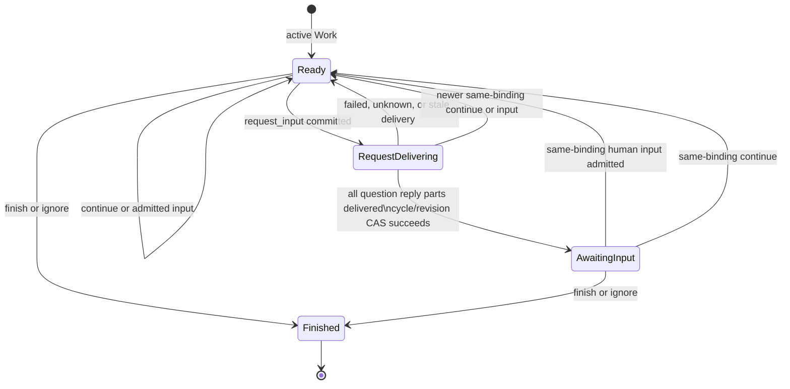

# External Channel Input Request Action Design

- Snapshot: `channel-260831`
- Document reference: `channel-260831/DESIGN`
- Requirements: [channel-260831/REQ](../requirements/channel-260831-request-input-action.md)
- ADR: [channel-260831/ADR](../adr/channel-260831-request-input-action.md)

## Current Behavior and Gaps

`channel_action` currently exposes `finish`, `continue`, and `ignore` at every active
binding boundary. Channel Work Toolkit State stores one active or finished cycle per
binding. The External Channel idle hook snapshots every active Work and emits one
binding-aware continuation containing all active binding handles.

This behavior satisfies ordinary autonomous continuation but cannot represent active
work waiting for participant input. `finish` and `ignore` terminate Work, while
`continue` preserves continuation eligibility. The common idle-continuation pipeline
is durable and may combine External Channel, Goal, and Scheduled Task inputs, so a
process-local or next-Run-only suppression does not provide the required boundary.

## Requirement and Decision Traceability

| Requirement | Accepted authority | Design mechanism |
| --- | --- | --- |
| `channel-260831/REQ-1` | `channel-260831/ADR-D1` | Add `request_input`; preserve the active Work cycle and supported progress fields. |
| `channel-260831/REQ-2` | `channel-260831/ADR-D1` | Persist binding-scoped awaiting state and exclude only awaiting Work from the External Channel idle hook. |
| `channel-260831/REQ-3` | `channel-260831/ADR-D2` | Clear and fence awaiting state on same-binding admitted human input or `continue`. |
| `channel-260831/REQ-4` | `channel-260831/ADR-D3` | Set awaiting state only after confirmed reply delivery and reject stale settlement by cycle/revision CAS. |

## Architecture and Ownership

The existing ownership boundaries remain authoritative:

- `ChannelActionInput` and `ExternalChannelActionMode` own the model-facing action
  contract.
- `ExternalChannelWorkRepository` owns binding, Work-cycle, revision, and state
  transitions.
- `ExternalChannelActionService` owns commit-before-call orchestration, provider
  delivery outcomes, and post-delivery awaiting settlement.
- `ExternalChannelWorkStateStore` remains the sole persisted Work state boundary.
- Existing Slack and Discord ingress services own accepted human-message admission.
  A dedicated repository mutation resumes awaiting Work only after a canonical
  mailbox enqueue reports `created`; provisioning and binding-reuse helpers do not
  invoke that mutation.
- `ExternalChannelToolkit._on_session_idle` owns External Channel continuation
  selection; the common `IdleContinuationService` remains unchanged and continues to
  merge independent continuation sources.
- Existing Slack Work presence and Discord Gateway typing projections own participant
  processing indicators and read the same awaiting state.

No provider adapter, interaction endpoint, webhook callback, or frontend reply UI
becomes a source of waiting-state authority.

The feature adds no new database, row, table, advisory, Session, Binding, or
long-lived transaction lock. Existing authorization locks remain unchanged. Every new
concurrent transition uses `ExternalChannelWorkStateStore` bounded CAS and canonical
`state_revision`.

## Tool Interface

`channel_action.mode` adds `request_input`.

`request_input` has these validation rules:

- `message` is required because awaiting state cannot be established without an
  ordinary participant-visible question or feedback request.
- `binding` uses the existing exact active-binding handle and authorization checks.
- `files` remain optional and require the ordinary message and existing outbound-file
  authority.
- `title` and `todo_update` remain optional. When supplied, they use the same title,
  task uniqueness, size, and unfinished-task validation as `continue`.
- The mode is nonterminal and preserves active Work.
- Scheduled Task-bound Channel Action rejects `request_input`; Scheduled Tasks retain
  `continue` plus `submit_scheduled_task_result` as their separate lifecycle.

The description states that `request_input` asks through a normal channel message,
pauses only the selected binding's automatic continuation, and resumes through
same-binding input or `continue`.

## Persisted State

Channel Work Toolkit State advances to schema version 4 and adds:

```text
awaiting_input_run_id: string | null
```

A non-null value means the active Work has a confirmed participant-visible input
request and is excluded from External Channel idle continuation. The Run ID provides
bounded diagnostic and fencing context but is not exposed in compaction, management,
provider progress, or public API responses.

The existing `status` remains `active` or `finished`. Awaiting input is orthogonal to
Work lifecycle, Tracker visibility, progress projection, and task status.
`awaiting_input_run_id` may be non-null only while status is active. Finish, ignore,
cycle replacement, binding termination, and Session cleanup clear it; a finished Work
payload must contain null.

Every authoritative transition that can invalidate an input request advances
`state_revision`:

- the initial `request_input` canonical transition;
- a same-binding `continue`, including a message-only continue;
- admission of a newly created same-binding human mailbox item;
- awaiting settlement after confirmed delivery; and
- existing terminal transitions.

This makes `state_revision` the common stale-result fence without adding a second
request-order authority or a new lock.

## State Transitions



`RequestDelivering` is an orchestration phase, not a persisted lifecycle status. The
initial action clears any prior `awaiting_input_run_id`, advances `state_revision`,
and captures the resulting Work cycle and revision for settlement.

## Delivery and Settlement

The direct action transaction continues to commit canonical Work and provider effect
plans before provider I/O. For `request_input`, it does not establish awaiting state
in that transaction.

After provider effects complete, `ExternalChannelActionService` evaluates only the
ordinary `REPLY` effects that carry the question and attachments. Awaiting settlement
is attempted only when every required reply part is `delivered`.

Settlement performs a bounded CAS mutation requiring:

- the same Agent, Session, and binding ownership;
- active Work;
- the exact captured Work cycle;
- the exact captured `state_revision`; and
- no newer terminal or invalidating transition.

A successful settlement stores the current `run_id` in
`awaiting_input_run_id` and advances `state_revision`. A CAS mismatch is a safe no-op.
The returned tool result reports the final canonical revision and whether awaiting
state was established.

Failed, unknown, and not-attempted reply outcomes do not set awaiting state. A process
failure after provider delivery but before settlement also leaves Work ready for
continuation. This fail-open choice may produce an additional message but cannot
silently wait on an unconfirmed question.

## Same-Binding Resume and Invalidation

The Work repository adds a dedicated admission mutation that is called only after an
eligible same-binding human mailbox enqueue returns `created`. `ensure_active_work`
continues to own provisioning, cycle creation, visibility promotion, and presence
identity fill, but does not clear awaiting state. The admission-only mutation:

- preserve the current active cycle, title, tasks, desired progress, Tracker identity,
  and projection observations;
- clear `awaiting_input_run_id`;
- advance `state_revision`, even when the Work was already ready, so an in-flight older
  request cannot settle after the admitted input; and
- continue ordinary Session wake and mailbox execution.

A same-binding `continue` applies the same invalidation before optional message and
progress handling. It always advances `state_revision`. Another binding's ingress or
Channel Action touches only that binding's state and cannot invalidate this marker.
Provisioning, history collection, duplicate mailbox admission, and failed ingestion do
not invoke the resume mutation.

## Presence and Typing

Awaiting Work remains active and keeps its existing Activity Tracker and tasks, but it
does not project active processing presence:

- Slack Work presence readers parse the awaiting field and project the Work's desired
  state as `idle` rather than `processing`.
- Discord Gateway typing target readers exclude awaiting Work cycles.
- Same-binding admitted input or continue clears awaiting state through CAS; the next
  ordinary presence reconciliation may project Slack processing and Discord typing
  again.

No provider mutation is performed inside the awaiting-state transaction. Existing
presence and typing managers observe the committed state through their normal polling
or renewal cycle. Tracker visibility and provider message identity are unchanged.

## Idle Continuation

The External Channel idle hook loads active Work and partitions it by awaiting state.
It emits no continuation when every active binding is awaiting input. When ready and
awaiting bindings coexist, it emits one External Channel continuation containing only
the ready binding handles.

Goal, Scheduled Task, and other hook providers are not filtered. The common true-idle
fence, pending mailbox checks, continuation mailbox creation, and Session wake logic
remain unchanged.

## Compaction and Projection

Compaction continues to include every active Work so its title, tasks, awaiting
indicator, and remaining execution state survive context compaction. The question
itself remains ordinary transcript content handled by the general summary and
continuity policy; the Work snapshot does not create a second deterministic copy. The
model-visible Channel Work snapshot adds only a provider-neutral
`Awaiting participant input` indication and does not expose the requesting Run ID,
state revisions, delivery outcomes, or provider message identities.

Provider Activity Trackers remain present and unchanged while awaiting input. Public
management Work status remains active. This snapshot does not add provider-specific
waiting controls or a new public Work lifecycle enum.

## Persistence Migration and Rollout

Implementation generates an Alembic revision that validates every targeted
`external_channel` Toolkit State whose name starts with `channel_work:`. It upgrades
schema version 3 payloads to version 4 by adding `awaiting_input_run_id: null`, updating
both payload and row schema versions, and advancing the Toolkit State CAS version.
Downgrade is allowed only after clearing the optional awaiting field and returns Work
to ready continuation semantics because older code cannot preserve input waiting.

The migration follows the existing fail-closed Channel Work JSON migration pattern and
does not import application models. Shipping uses a coordinated backend restart.
Every component that reads or writes Channel Work Toolkit State is stopped or replaced
as one deployment boundary. This explicitly includes Channel Action and idle workers,
External Channel ingress, management and API readers, Slack Work presence managers,
Discord Gateway typing managers, and lifecycle cleanup. The version-4 migration
completes before homogeneous new backends expose `request_input`. Release verification
checks the database revision and the deployed version of every reader/writer group. No
mixed-version reader, feature flag, provider interaction mechanism, or generalized
rollout controller is added.

## Failure, Retry, and Recovery

- Provider rejection, transport failure, or ambiguous delivery leaves Work ready.
- A late settlement after same-binding input, continue, finish, ignore, replacement
  cycle, disconnect, archive, or decommission fails its CAS and cannot restore waiting.
- Retry or recovery of the same Run reuses canonical Work state and existing provider
  operation fences. Awaiting state is not inferred from model text or tool-result text.
- Process loss after awaiting settlement is safe because Toolkit State is durable.
- Process loss before settlement is fail-open and may permit one additional
  continuation.
- Binding termination and Session cleanup delete or terminalize Work through existing
  lifecycle paths; no separate awaiting cleanup worker is required.
- Every terminal or replacement transition clears `awaiting_input_run_id`; model and
  migration validation reject finished Work with a non-null value.

## Security and Privacy

All existing binding ownership, route, connection, resource, credential, participant,
file, and message-limit checks remain mandatory. The new state stores only internal
Run identity and no provider body, response content, interaction token, webhook secret,
or participant credential. Ordinary ingress authorization remains the only response
admission boundary.

## Observability

The sanitized `channel_action` result includes whether awaiting state was established
and the final Work revision. Structured diagnostics distinguish delivered-and-settled,
delivery-fail-open, and stale-settlement outcomes without recording question or
response bodies. Existing provider outcomes remain the delivery evidence.

## Test Strategy

### E2E primary verification matrix

- Slack conversational Work sends `request_input`, publishes one ordinary question,
  creates no External Channel continuation at the completed Run boundary, admits a
  normal same-binding response, and restores continuation eligibility.
- Discord exercises the same provider-neutral lifecycle without buttons, modals,
  components, or interaction callbacks.
- A same-binding `continue` after awaiting input restores continuation eligibility
  without changing another binding.
- Slack processing presence becomes idle and Discord typing stops while awaiting, then
  both resume after same-binding input or continue without deleting the Tracker.

Existing External Channel testenv transport, mailbox admission, and deterministic
provider fixtures are sufficient. No live provider credentials or new interactive
webhook fixture are required. Evidence includes provider publication count, canonical
Work state, state revision, continuation mailbox rows, Run identity, and binding
identity.

### Focused deterministic coverage

- Tool schema and validation for required message and supported optional fields.
- Scheduled Task-bound rejection.
- Repository transitions for request, settlement, continue invalidation, terminal
  actions, and multiple bindings.
- Admission tests prove that only a newly created canonical same-binding human mailbox
  item resumes Work; provisioning, history, duplicate, and failed admission do not.
- Concurrency tests where continue or admitted input wins before delayed delivery
  settlement.
- Concurrency tests assert that the feature adds no new lock path and completes through
  existing bounded Toolkit State CAS retries.
- Failed and unknown delivery remain ready.
- Idle hook includes only ready binding handles and preserves other hook sources.
- An intervening Goal, TurnAction, Scheduled Task, or other-source Run neither clears
  awaiting state nor re-adds the awaiting binding to External Channel continuation.
- Slack presence and Discord typing target projection stop and resume from awaiting
  state while Tracker visibility remains unchanged.
- Compaction renders awaiting state without internal IDs.
- State validation and terminal-transition tests require null awaiting state for
  finished or replacement Work.
- Toolkit State schema version 3-to-4 upgrade and downgrade validation.

All deterministic E2E and migration tests are required CI checks and must fail rather
than skip. Live provider smoke tests, if run separately, remain optional and diagnostic.

## Feasibility

The design is feasible with current repository boundaries:

- Channel Work already has binding-scoped CAS state and `state_revision`.
- Direct actions already separate canonical commit from provider I/O and return typed
  outcomes.
- Ingress already exposes authoritative `mailbox_result.created` boundaries where a
  dedicated same-binding resume mutation can run without changing provisioning.
- The idle hook already receives binding snapshots and can filter handles without
  changing the common continuation service.
- Slack presence and Discord typing already validate Channel Work Toolkit State and can
  filter awaiting Work without a provider-specific state store.
- Existing migrations demonstrate validated versioned Channel Work JSON upgrades.
- Existing Toolkit State CAS and `state_revision` provide the required concurrency
  fence without a new lock.

The coordinated restart approved by `channel-260831/ADR-D4` provides homogeneous
understanding of the new state before mode exposure. No feasibility blocker remains.

## Alternatives and Non-Blocking Risks

- A participant may answer with an unrelated eligible message; without provider-native
  reply correlation, that input still resumes Work. This matches the confirmed normal
  ingress boundary.
- Fail-open provider ambiguity may create an additional continuation after a question
  was actually delivered.
- Requiring every reply part to be confirmed delivered is conservative for messages
  with attachments but avoids waiting on partial publication.

## Design Authority

- Design revision: `3`

| ID | Material design mechanism | Authority | Classification |
| --- | --- | --- | --- |
| M1 | Add nonterminal `request_input` while preserving active Work | `channel-260831/REQ-1`, `channel-260831/ADR-D1` | `decided` |
| M2 | Persist binding-scoped awaiting state orthogonally to Work lifecycle | `channel-260831/REQ-2`, `channel-260831/ADR-D1` | `decided` |
| M3 | Resume and invalidate only from newly created same-binding canonical human input or continue | `channel-260831/REQ-3`, `channel-260831/ADR-D2` | `decided` |
| M4 | Confirm delivery before waiting and fence late settlement by cycle/revision | `channel-260831/REQ-4`, `channel-260831/ADR-D3` | `decided` |
| M5 | Preserve the common durable idle-continuation pipeline and independent hook sources | Current Agent Execution Loop and External Channel Delivery Specs, `channel-260831/REQ-2` | `existing` |
| M6 | Use ordinary Slack and Discord messages and ingress without interactive webhook UX | `channel-260831/REQ` fixed constraints and non-goals | `required` |
| M7 | Reject `request_input` for Scheduled Task-bound Channel Actions | `channel-260831/REQ` non-goals, current External Channel Delivery Spec | `derived` |
| M8 | Version and migrate Channel Work Toolkit State for durable awaiting state | `channel-260831/REQ-2`, `channel-260831/ADR-D1`, current Channel Work Toolkit State ownership | `derived` |
| M9 | Deploy the state upgrade and mode through one coordinated backend restart | `channel-260831/ADR-D4` | `decided` |
| M10 | Use existing Toolkit State CAS and Work revision without adding a lock | `channel-260831/REQ` fixed constraints, `channel-260831/ADR-D5` | `decided` |
| M11 | Stop Slack processing presence and Discord typing while awaiting, preserving the Tracker | `channel-260831/REQ-2`, `channel-260831/ADR-D6` | `decided` |

## Removal and Replacement

| Existing unit or behavior | Removal authority | Replacement or remaining authority | Removal boundary | Absence verification |
| --- | --- | --- | --- | --- |
| Agent workaround that finishes Work or rewrites tasks only to stop continuation | M1, M2 | Explicit `request_input` and awaiting state | Tool guidance, state transition tests, Agent behavior | E2E verifies preserved tasks and no immediate continuation |
| Unconditional External Channel continuation for every active binding | M2, M3 | Ready-only binding selection | External Channel idle hook | Multi-binding idle-hook and E2E evidence |
| Next-Run-only or process-local suppression | M2, M3, M5 | Durable binding-scoped awaiting state | No transient suppression path is added | Restart/recovery and unrelated-continuation tests |
| Provider-specific interactive response proposal | M6 | Ordinary provider message and existing ingress | No new interaction route, callback, component, or webhook state | Repository and route absence search |
| Channel Work Toolkit State schema version 3 | M8 | Version 4 with nullable awaiting Run identity | Generated validated migration and state model | Migration round-trip tests and schema search |
| Mixed-version mode exposure during rolling deployment | M9 | Homogeneous backend restart before mode availability | Deployment procedure and release verification | Revision and worker-version evidence before mode use |
| New lock-based waiting coordination | M10 | Existing bounded Toolkit State CAS and `state_revision` | No new lock path in action, settlement, admission, idle, or presence code | Lock-call absence search and concurrency tests |
| Active processing presence for awaiting Work | M11 | Slack idle presence and no Discord typing; Tracker retained | Presence and Gateway target projection | Projection tests and provider-neutral E2E evidence |

## Design Approval

- Mode: `Collaborative`
- Decision owner: requester
- Approved on: `2026-08-31`
- Approved Design revision: `3`
- Approved authority IDs: `M1, M2, M3, M4, M5, M6, M7, M8, M9, M10, M11`
- Approved scope: add a binding-scoped `request_input` action that publishes an
  ordinary question, waits only after confirmed delivery, suppresses External Channel
  continuation until same-binding human input or continue, rejects stale waiting
  settlement without provider-specific interaction UX or new locks, stops processing
  presence while awaiting, preserves the Work Tracker, and deploys through a
  coordinated homogeneous backend restart.
