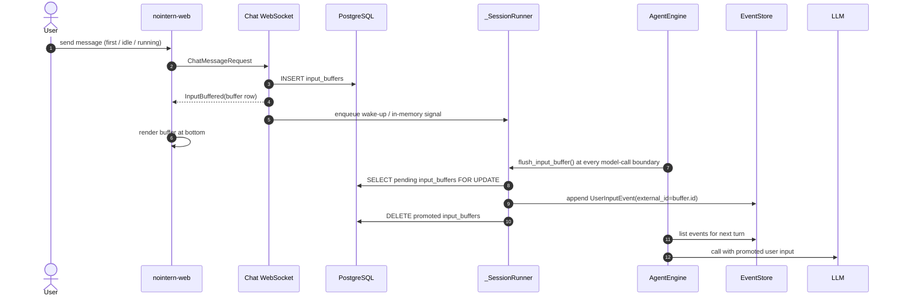
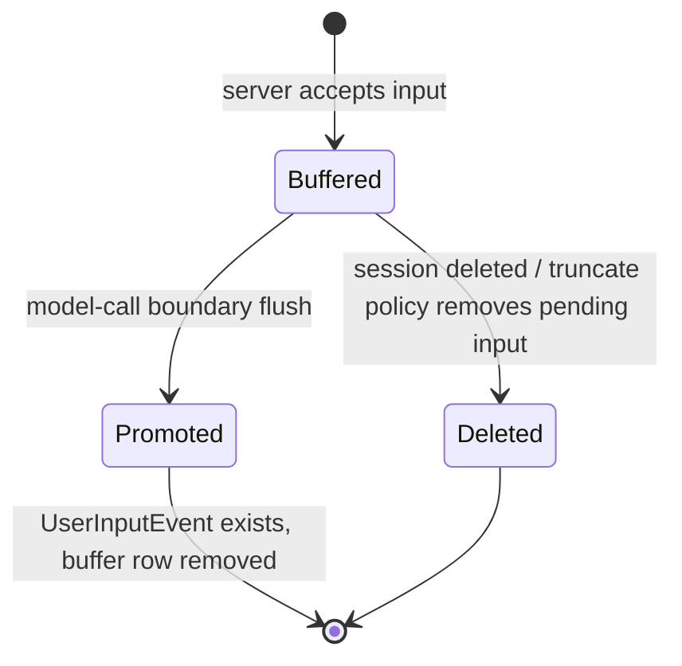

# Chat Input Buffer Design

## Problem Definition and Background

Follow-up messages sent by a user during a run currently remain in `_SessionRunner._queue` and are stored as `UserInputEvent` when engine calls `poll_messages()`. Therefore, even if server received the WebSocket message, if user refreshes before next model-call boundary or worker dies, the message does not appear in REST history. Frontend optimistically appends user bubble in `sendMessage()` and ignores durable `user_input` echo, so server state and UI state become temporarily separated.

This feature represents "input accepted but not yet injected into model" as separate RDB buffer. Every Web chat user input first enters buffer regardless of whether run is running, idle, or first message. Buffer is not event history; it is flushed at every model-call turn start and promoted to `UserInputEvent`. UI renders event list and buffer list together, but buffer list is always rendered at bottom of chat regardless of time or event id.

## Goals

- Durably preserve input from immediately after server accepts chat input until model-call boundary.
- Make first message, idle-state message, and in-run follow-up message all use same buffer → flush path for consistent input handling semantics.
- Preserve meaning of `events` as "items finalized as model history or system event".
- Render buffered message as bottom pending area independent from event ordering.
- At model-call boundary, promote buffer rows to `UserInputEvent`, using buffer id as event `external_id` for dedup.
- REST history reload, WebSocket reconnect, and stuck recovery operate from same RDB buffer state.
- User can immediately delete buffered message not yet injected into model without confirmation.
- Preserve existing UX for in-run command blocking, stop request, and poll injection after tool execution.

## Non-goals

- Do not add queued/pending event type to `events` table.
- Do not insert buffer into middle of event timeline or sort by event id.
- Do not use localStorage as replacement source for server durable state.
- Do not change meaning of hibernate in this design.
- This design is not implementation phase breakdown. Actual work split is handled in separate implementation plan.

## Current State

- `EngineWorker.process_message()` stores first/normal input with `EventStore.append()` before engine execution. In target state, this direct storage path is also unified into buffer flush.
- Additional input during run accumulates in `_SessionRunner._queue`; after tool execution, `poll_messages()` drains queue and converts to `UserInputEvent`.
- `GET /chat/v1/sessions/{id}/messages` paginates only event repository and returns `run_state` together.
- nointern-web immediately appends user bubble with temporary id (`user-${Date.now()}`) when sending message, and does not display durable `user_input` event from WebSocket.

## Target State



State model is separated as follows.



## User-visible Behavior

- When user sends message, after server accepts it, it appears as pending user bubble at bottom regardless of run state. First message also appears pending briefly through same path and then is injected at first model-call boundary.
- Even after refresh or WebSocket reconnect, message not yet injected reappears at bottom through buffer list in REST history.
- When buffer is injected into next model turn, pending bubble disappears and same content appears as normal `user_input` bubble in event history.
- buffered message does not move to past position in event history. Before injection it is always at bottom, and after injection appears at position defined by event history.
- When multiple messages are sent consecutively, display in pending area by accepted order based on buffer row id or created_at.
- Each pending bubble provides delete button. When user clicks, it is removed from buffer without confirmation dialog, and message not yet injected is not delivered to model.
- In-run slash command is blocked as before. Stop request is not saved as buffer row.

## Main Data and State Changes

### `input_buffers` table

Table name is `input_buffers` for simplicity. One row means one user input accepted by server.

| Field | Description |
|---|---|
| `id` | uuid7 hex. buffer row id and later `events.external_id` value after promotion |
| `session_id` | `agent_sessions.id` FK, ON DELETE CASCADE |
| `agent_runtime_id` | FK for query/recovery optimization and runtime boundary check |
| `user_id` | Web input author. nullable decision for system/external input extension must be finalized before implementation |
| `content` | user input body |
| `headers` | header snapshot promoted to `UserInputEvent.headers` |
| `metadata` | input metadata JSONB such as source, client id, timezone |
| `attachments` | Exchange URI based attachment snapshot |
| `images` | image input snapshot. shape compatible with existing `UserInputEvent.images` |
| `created_at` | server accepted time. used for display order inside pending area and audit |

Required constraints:

- `session_id` index supports pending query in REST history and session delete cascade.
- `(session_id, id)` is used for buffer internal ordering and idempotent query.
- Buffer promotion must prevent two workers from promoting same row concurrently through `SELECT ... FOR UPDATE SKIP LOCKED` or equivalent single-owner claim.

### Event Promotion Rules

- model-call boundary means "immediately before next LLM call". Existing post-tool-execution point where `poll_messages()` runs and pre-run first LLM call point are treated as same kind of boundary.
- First turn also starts with buffer flush without exception. Therefore, Web chat input no longer has separate storage path that directly `EventStore.append()`s `run_request.user_messages`.
- Boundary flush reads pending buffer rows in accepted order and converts them to `UserInputEvent`.
- `external_id` of converted event envelope is buffer `id`.
- event append and buffer deletion are grouped in same transaction.
- Even if `events` append is no-op due to unique conflict, if event for same buffer id already exists, buffer row can be removed.

### API / WebSocket Contract Changes

REST history response provides pending buffers of current session as separate collection in addition to existing event page and `run_state`. Exact schema names are finalized in OpenAPI and frontend types during implementation, but semantics must be as follows.

```json
{
  "items": ["event history page"],
  "has_more": false,
  "run_state": "running",
  "input_buffers": [
    {
      "id": "buffer uuid7 hex",
      "content": "message text",
      "attachments": [],
      "created_at": "2026-05-19T00:00:00Z"
    }
  ]
}
```

WebSocket receive path sends an ack with `InputBuffered` semantics to live client after input save succeeds. Wire event type name is user-facing contract, so use English. Example: `input_buffered`. This event is not durable `events` row; it is live notification to reflect buffer row in frontend pending area.

Frontend state stores event messages and buffered messages separately. Rendering must not be `visibleMessages = eventMessages + bufferedMessages`; instead render event list and append separate bottom pending block. This prevents event pagination and buffer ordering from mixing.

Delete contract targets pending buffer row. `DELETE /chat/v1/sessions/{session_id}/input-buffers/{buffer_id}` deletes row if still pending and sends buffer changed notification. Already flushed row cannot be deleted; UX observes pending bubble disappeared and promoted to normal user input bubble. In this case delete API can choose either idempotent success or 404, but frontend must treat both as "no longer pending".

## Permission and External System Integration Changes

- Buffer creation is allowed only for input that passes existing chat session access check.
- REST history returns buffer list with same workspace/session access permission as existing `ChatSessionService.list_messages()`.
- Exchange attachment URI is stored as snapshot in buffer row, but file bytes still use existing Exchange Storage as source.
- Redis broker/in-memory queue may remain as wake-up signal and in-run delivery channel, but it is not source of truth for accepted-but-not-injected input.

## Crash / Restart / Failure Semantics

| Situation | Expected semantics |
|---|---|
| crash after WS receive before broker enqueue | row exists in `input_buffers`, so REST reload shows pending. stuck/recovery or next run wake-up must flush |
| crash after broker enqueue before `poll_messages()` | buffer row remains, so no message loss |
| crash before flush transaction | buffer row remains and next flush retries |
| error during flush transaction | transaction rollback restores buffer row and event append together |
| crash after flush commit before response | buffer row deleted and `UserInputEvent` exists, so REST history shows event |
| duplicate flush attempt for same buffer | `external_id=buffer.id` dedups event duplication |
| Redis loss | RDB buffer remains. If no separate wake-up, next recovery scan or additional user activity must process it |

Operationally, buffer row should normally remain only briefly. Old pending row signals worker wake-up/recovery problem, so it is metric/alert candidate.

## Delete Semantics

- session delete removes `events` and `input_buffers` together through `agent_sessions` cascade.
- pending buffer has not yet been injected into model, so it is not target event of run boundary truncate. When user deletes after specific run boundary, remaining pending buffers in current session are also deleted. Since action reverts to past state, not-yet-injected input is no longer valid next input.
- standalone buffer row delete API is required UX. User can click delete without confirm, and deleted buffer is excluded from future flush target.

## Rollout / Migration / Failure Modes

- migration adds `input_buffers` table and required FK/index. Existing events data backfill is unnecessary.
- If old worker and new API mix during deploy, old worker may not flush buffer. Safe rollout deploys API/worker as same version set or adds compatibility gate so worker unaware of buffer flush does not process new messages.
- frontend can have backward-compatible reader that treats absent `input_buffers` field as empty list. However, after feature enable, server must provide the field.
- failure mode can accumulate pending rows. Operational dashboard/logs should show session id, oldest pending age, row count.

## Acceptance Criteria

- Message sent during run appears as pending user bubble at bottom after server ack even after refresh.
- First message and idle-state message also first appear as pending buffer, then are promoted to `UserInputEvent` at first model-call boundary.
- Before next LLM call after tool execution, all pending buffers are promoted to `UserInputEvent`.
- After promotion, buffer row disappears and REST history displays event history.
- Reprocessing same buffer id does not create duplicate `events` row.
- buffered messages are always rendered below event list regardless of event id/created_at.
- No pending buffers remain after session delete.
- Clicking pending buffer delete button removes row without confirm and does not inject into model.
- In-run slash command and stop request are not stored as buffer rows.
- Server pending state is restored through REST reload without depending on WebSocket optimistic-only user bubble.

## Test Strategy

Product behavior verification is E2E primary. Unit/integration tests support fast stabilization of transaction, repository, dedup, and engine boundary.

### E2E primary verification matrix

| Behavior | E2E verification | Fixture / prerequisite | Evidence |
|---|---|---|---|
| bottom pending display after in-run input acceptance | send first message to agent running long-running tool, then send follow-up during tool execution | test agent, deterministic long-running tool, authenticated web user | Playwright trace/screenshot, REST messages response snapshot |
| first input buffer consistency | send first message in new session and verify pending display before first model-call, then promotion | authenticated web user, deterministic agent | WS event log, screenshot, REST messages response |
| refresh recovery | page reload after follow-up ack before LLM injection | tool delay must be longer than reload window | pending bubble screenshot after reload, network response |
| boundary flush | after tool completion, next assistant response reflects follow-up | fake/deterministic model or test toolkit response | final assistant text, DB/event evidence via public API |
| multi-pending ordering | send 2+ follow-ups during run | same session, stable created order | pending block order screenshot |
| pending delete | click pending bubble delete button | before pending row is flushed | bubble removal screenshot, REST buffer absence |
| command/stop exclusion | try `/compact` and stop request during run | run active state | command blocked UI, no pending command bubble |
| session delete cascade | delete session with pending buffer | owner with delete permission | session list/history 404 or pending absence evidence |

### Fixture / prerequisite / evidence policy

- E2E fixture does not create product state with direct DB INSERT/UPDATE/DELETE. Prepare workspace, agent, model/toolkit prerequisite through user path or testenv fixture API.
- long-running tool uses deterministic test toolkit not dependent on external SaaS credential. Live tests requiring external credentials are optional and skipped when credential absent.
- evidence leaves at minimum Playwright trace or screenshot, part of REST `GET /messages` response, and WebSocket `input_buffered` receive log proving behavior.
- Required CI runs deterministic E2E only. Live provider/external integration tests run only with separate label or environment variable, and missing prerequisite is recorded as skip, not failure.
- testenv support is used only for fixture/prerequisite to make long tool window stable for E2E. Product behavior itself is verified in browser E2E.

## QA Checklist

### QA-1: in-run message acceptance and pending display

- **What to check**: Verify message sent while run is active appears as bottom pending bubble after server ack.
- **Why it matters**: durable feedback that sent message was accepted by server is core UX.
- **How to check**: Run long-running tool, send follow-up before tool completes, then check screen and WebSocket event.
- **Expected result**: `input_buffered` ack arrives and message appears in pending area under event list.
- **Execution result**: TBD
- **Fixes applied**: TBD

### QA-1b: first input also uses buffer path

- **What to check**: Verify first user message in new session is promoted at model-call boundary after buffer ack, not direct event storage.
- **Why it matters**: core consistency requirement that every turn starts with buffer flush.
- **How to check**: Send message in new chat and verify WebSocket ack, pending display, then `UserInputEvent` promotion in order.
- **Expected result**: first message also appears pending after `input_buffered`, then promotes into event history before first LLM call.
- **Execution result**: TBD
- **Fixes applied**: TBD

### QA-2: pending recovery after refresh

- **What to check**: Verify message does not disappear after page reload while pending.
- **Why it matters**: main purpose is closing pre-poll persistence gap.
- **How to check**: Reload immediately after follow-up ack and check REST history response and screen.
- **Expected result**: row exists in REST response `input_buffers`, and same message appears at UI bottom.
- **Execution result**: TBD
- **Fixes applied**: TBD

### QA-3: model-call boundary promotion

- **What to check**: Verify pending input is promoted to `UserInputEvent` before next LLM call after tool completion.
- **Why it matters**: buffer is not permanent queue; it must be injected into next model turn.
- **How to check**: Verify deterministic agent response reflects follow-up and pending disappears after reload.
- **Expected result**: pending bubble is removed, user input appears in event history, and assistant response reflects that input.
- **Execution result**: TBD
- **Fixes applied**: TBD

### QA-4: duplicate promotion prevention

- **What to check**: Verify user input event is not duplicated when same buffer id is reprocessed due to recovery/retry.
- **Why it matters**: crash/restart safety depends on idempotent promotion.
- **How to check**: induce flush retry in integration test or controlled E2E diagnostic and query history.
- **Expected result**: only one `UserInputEvent` corresponding to same buffer id exists in session history.
- **Execution result**: TBD
- **Fixes applied**: TBD

### QA-5: bottom rendering ordering

- **What to check**: Verify buffered message always displays at bottom even when its timestamp/id is later or earlier than event.
- **Why it matters**: user input requirement says buffer is not mixed into event timeline.
- **How to check**: Send in-run follow-up in session with many existing assistant/tool events and check position after pagination/reload.
- **Expected result**: pending messages appear in separate area below all rendered events.
- **Execution result**: TBD
- **Fixes applied**: TBD

### QA-6: deletion and exclusion rules

- **What to check**: Verify pending bubble delete, session delete cascade, command/stop exclusion work.
- **Why it matters**: if buffer table preserves orphan row or wrong input type, history/recovery is contaminated.
- **How to check**: Click pending bubble delete button and check REST/screen. Delete session with pending buffer and check history/list. Try `/compact` and stop during run.
- **Expected result**: deleted buffer disappears and is not injected. Pending row of deleted session is not queryable, and command/stop does not appear as pending bubble.
- **Execution result**: TBD
- **Fixes applied**: TBD

## Open Questions

- Required scope of this design is Web chat user input. Whether external inputs such as Slack/Discord/Scheduled should be unified into same table remains extension decision.
- Final REST response field name and WebSocket ack event type name must be decided when changing OpenAPI/client types. This design uses semantic baseline names `input_buffers` and `input_buffered`.
- Need operational policy for old pending buffer: alert threshold and whether to add automatic reinjection/wake-up job.

## Accepted Decisions

- Main decision follows [chat-260519/ADR](../adr/chat-260519-chat-input-buffer.md): use separate RDB input buffer and promote to `UserInputEvent` at model-call boundary.
- Table name is simple `input_buffers`.
- Web chat user input is always first stored in buffer regardless of run state.
- Every model-call turn starts with buffer flush. First turn is no exception.
- buffered messages are handled as separate collection from event history and always rendered at UI bottom.
- User can delete buffered message without confirm.
- buffer id is used as `external_id` of promoted event.
- queued/pending state is not mixed into `events`.
