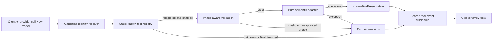

# Chat Known-Tool Specialized Renderers

## Problem

Chat Activity now presents internal work as one ordered event stream, but each client tool still expands through `ToolCallCard` and each provider tool through `ProviderToolCallCard`. These generic cards preserve raw arguments, raw output, status, and attachments, but they require users to interpret implementation payloads to answer basic questions:

- What operation occurred?
- What resource did it affect?
- Is a process still running or did it exit?
- Did a patch touch one file or several?
- Which results or references are relevant?

Known tools should communicate those facts directly without weakening the permanent Generic compatibility boundary established by ADR-0173 and retained by ADR-0174.

## Goals

- Give validated first-party tools concise, localized, operation-specific summaries.
- Present each useful known payload field once, without repeating it in a generic technical dump.
- Keep one calm disclosure per ordered Activity event rather than nesting cards.
- Isolate malformed payloads, schema drift, adapter defects, and renderer defects to one call.
- Keep unknown, historical, Toolkit-owned, disabled, and not-yet-implemented tools fully inspectable through Generic rendering.
- Preserve Activity membership, event order, live-to-durable identity, attachments, status, and boundaries.
- Roll out specialization by complete presentation family with deterministic acceptance gates.

## Non-goals

- Persisting UI summaries, renderer identifiers, or presentation models in backend events.
- Inferring Toolkit ownership or operation identity from model-visible name prefixes.
- Specializing dynamically installed Toolkit operations without a canonical versioned operation contract.
- Semantically interpreting arbitrary text output.
- Moving attachment-bearing events into Activity or changing file delivery behavior.
- Replacing Goal, Todo, Subagent Tree, provider attachment, or other existing user-facing surfaces.
- Exposing raw commands, file content, patch bodies, memory values, prompts, or messages in collapsed summaries.

## Current Behavior

The frontend retains raw durable events and live partial events, projects them into `ChatMessage` view models, and then builds ordered Activity events in `toolActivityPresentation.ts`.

Client tool calls use `ActiveToolCall`:

- exact call name;
- raw JSON argument string;
- optional immutable `toolkitSource` snapshot;
- raw textual result;
- lifecycle status; and
- attachments.

Provider calls use `ProviderToolCall`:

- canonical provider semantic name;
- semantic input projected to an argument string;
- semantic output and references flattened into one output string;
- lifecycle status; and
- attachments.

The canonical client result event already contains optional `metadata`. Runtime process tools and `apply_patch` populate structured metadata; Phase 1 retains it on `ActiveToolCall`. Provider events already contain typed `references`, but the current `ProviderToolCall` projection flattens them into output text and drops their structure for a later provider slice.

Activity expansion delegates client and provider calls to separate generic card components. Those components also own different disclosure and status treatments, so introducing bespoke components directly would multiply inconsistent interaction behavior.

## Accepted Decisions

The architectural decisions are recorded in [ADR-0176](../adr/0176-render-known-tools-through-validated-frontend-adapters.md).

1. Only canonical source-aware identities may authorize specialization.
2. Pure phase-aware frontend adapters validate and adapt payloads before React rendering.
3. One shared event disclosure shell owns interaction, lifecycle, accessibility, single-presentation, and Generic fallback.
4. Adapters map tools into a small closed set of presentation families.
5. Family activation is gated by complete contract coverage rather than release dates.
6. Structural validation and collapsed-summary prominence are independent gates.
7. Generic fallback remains permanent and local to each call.

## Architecture



### Selection identity

Client identity is resolved before registry lookup:

- `toolkitSource !== null`: never eligible for a builtin renderer;
- `toolkitSource === null` and exact allowlisted name: eligible for that builtin registry entry;
- any other source-less name: Generic.

Provider identity is the exact canonical semantic name within the provider-call event family. It does not share a namespace with client tools.

Conceptual registry identities include a frontend contract version, for example:

- `client:builtin:read:v1`;
- `client:builtin:apply_patch:v1`;
- `provider:web_search:v1`.

The version is frontend-owned and identifies the adapter contract. It is not written to transcript events.

### Adapter result

The registry returns one of two UI outcomes:

```text
ToolPresentationResult
  specialized
    presentation: KnownToolPresentation
  generic
    reason:
      unregistered
      unsupported-phase
      invalid-arguments
      invalid-output
      adapter-error
```

The Generic reason is not user-facing. It supports tests, local diagnostics, and bounded defect reporting only.

### Lifecycle validation

| Phase | Eligibility |
| --- | --- |
| `preparing` | Always Generic because final arguments may not exist. |
| `running` | Specialized only after argument validation. The presentation may describe requested work but cannot imply output-derived success. |
| `completed` | Validate arguments and the renderer-declared terminal output policy. |
| `failed`, `cancelled`, `interrupted` | Validate arguments and any safe structured failure metadata the renderer explicitly supports; preserve canonical lifecycle state. |
| Unknown provider history state | Generic. |

Each adapter declares one terminal output policy:

- `none`: no output is required or interpreted;
- `opaque-text`: arbitrary text may be displayed once as a primary result block but is not semantically interpreted;
- `structured`: semantic detail is derived only from a strict structured decoder.

Unknown additive object fields are tolerated when they cannot change interpretation. Missing fields, wrong types, ambiguous unions, or unknown discriminators fail validation.

### Frontend projection additions

No backend event, persistence, or public API change is required for the initial design.

The frontend view models gain optional canonical data already present in events:

```text
ClientToolResultPayload
  existing fields
  metadata?: Record<string, unknown>

ActiveToolCall
  existing fields
  resultMetadata?: Record<string, unknown>

```

`client_tool_result.payload.metadata` is copied without interpretation into the matched `ActiveToolCall`. Provider-reference retention remains Phase 3 work.

The merge path must carry metadata through the local `ClientToolResultPayload`, `FunctionCallOutputUpdate`, and `applyFunctionCallOutput` models before it reaches `ActiveToolCall`. This is a frontend projection correction over an already public canonical event field.

Raw argument and output strings remain separate canonical inputs to the disclosure shell. Adapters cannot replace or reconstruct them.

Raw result metadata is intentionally not exposed as a universal dump. Metadata may contain tool-specific internal values that have not passed a prominence or privacy review. A specialized adapter displays only validated and family-approved derived fields. If metadata is absent or invalid, the existing arguments and output remain inspectable through Generic rendering.

## Presentation Model

`KnownToolPresentation` contains structured values only:

```text
KnownToolPresentation
  registryId
  family
  actionKey
  subject?
  qualifier?
  detail
```

- `actionKey` is a closed localization key, not prose.
- `subject` is a reviewed bounded value type such as a normalized path label or safe count.
- `qualifier` is a closed structured value such as range, recursive mode, overwrite mode, exit status, or truncation state.
- `detail` is one closed family model.

Raw-data availability is not adapter output. The shared shell derives it directly
from the retained argument and output strings so an adapter defect cannot hide
diagnostic access.

Adapters cannot return React elements, arbitrary localized strings, Markdown, or HTML.

### Closed presentation families

| Family | Purpose | Example semantic detail |
| --- | --- | --- |
| Resource operation | Read, create, update, or delete one resource | normalized path, offset/range, overwrite mode, content length without content |
| Search or list | Search within a scope or list matching resources | scope, expanded-only pattern, recursion/exclude settings, safe result count when structured |
| Mutation or diff | Apply replacements or multi-file changes | target path, replace-all flag, structured file actions and line counts |
| Command or process | Start, poll, or write to a process | safe work directory, process state, exit code, truncation flags |
| State mutation | Read or change Goal, Todo, or Memory state | operation, safe status/count, privacy-reviewed resource label |
| Collaboration | Spawn, message, follow up, wait for, or interrupt an agent | operation, privacy-reviewed target label, state/count |
| Provider references | Provider search or research with canonical references | reference kind, safe title, URI stripped of unsafe parts, count |

A new unique interaction requires a new closed family variant and explicit review of accessibility, fallback, prominence, and residual-data behavior. Registry entries cannot inject arbitrary components.

## Shared Tool Event Disclosure

Phase 1 evolves the client `ToolCallCard` into the shared disclosure shell. `ProviderToolCallCard` remains Generic until provider references and lifecycle preservation receive their own contract-complete slice.

### Collapsed row

The row contains:

1. one disclosure chevron;
2. one family icon or lifecycle indicator;
3. localized action label;
4. optional dimmed subject and qualifier;
5. canonical running, completed, failed, cancelled, or interrupted state.

The row follows the compact inline language of Activity rather than rendering another bordered card inside the expanded Activity. Long subjects truncate visually, while the accessible name retains the bounded full subject.

The row follows a minimum-information rule:

- show the action, one primary subject, and lifecycle state;
- add a qualifier only when it materially changes interpretation;
- hide defaults, empty values, internal limits, and implementation terminology; and
- never repeat the same fact in the action, subject, qualifier, and status.

The summary never includes arbitrary adapter prose. A typical localized structure is:

```text
<Action> · <subject> · <qualifier>
```

Examples are illustrative, not persisted strings:

- `Read · src/features/chat/types.ts · chars 3,800–11,300`
- `Searched files · src/features/chat`
- `Applied patch · repository · 3 files`
- `Ran command · completed · exit 0`
- `Interacted with process · running`

### Expanded content

Expansion renders in this order:

1. the primary result;
2. only the few semantic facts required to understand that result; and
3. no generic technical dump.

Expanded content normally contains one to three information units. It omits fields already communicated by the event row, default settings, empty values, internal caps, and low-value diagnostics. Family views prefer the result itself over a property table.

The single-presentation rule applies to the semantic row and body. The separate raw modal is an intentional diagnostic exception and may contain source values already represented semantically.

Within an expanded Activity, a specialized event row may show a subdued `…` action when retained arguments or output exist. It opens a separate `View raw data` modal containing the exact retained argument string and deterministic retained output projection. Raw content is never repeated inline below the semantic presentation. Generic events do not show the action because arguments and output are already their primary expanded content.

The disclosure trigger and `…` trigger are sibling controls in the event-row container. An event whose row already communicates the complete semantic result does not render an empty expanded panel; it exposes only the row and, when raw data exists, the independent `…` action.

The shell owns maximum heights, scrolling, copy behavior, modal focus handling, and labels. Family views do not create nested cards or another outer disclosure.

Generic rendering uses the same shell with the original tool name and arguments/output as its primary expanded content. This keeps interaction and status behavior consistent across specialized and unknown tools without pretending that a semantic adapter succeeded.

### Rendering failure isolation

Adapter selection and adaptation are wrapped in a safe pure boundary. The specialized family view is wrapped in a call-local React error boundary.

If either fails:

- the same call immediately renders Generic;
- the Activity remains expandable;
- adjacent ordered events are unaffected;
- arguments and output remain available through Generic; and
- attachment and lifecycle ownership do not change.

The fallback component must not depend on the failed presentation model.

## Prominence and Privacy Policy

Validation proves payload shape; it does not approve collapsed display.

Every family maintains an explicit subject allowlist and bounds:

- one line only;
- deterministic maximum character length;
- deterministic maximum item/count display;
- control characters removed;
- workspace roots normalized to a shorter display form where approved;
- URI credentials, query strings, and fragments removed before any approved URI display.

The following remain expanded-only by default:

- command text and stdin;
- file content;
- patch bodies;
- edit `old_string` and `new_string`;
- memory content;
- Goal objective text;
- prompts and inter-agent messages;
- provider excerpts;
- arbitrary textual output;
- attachment URIs; and
- credential- or query-bearing URIs.

A provider reference title, memory name, resource name, or agent target is not automatically approved merely because it is structured. Its family review must explicitly allow it; otherwise the compact summary uses only operation, type, count, or lifecycle state.

## Tool Mapping and Rollout

### Phase 1: stable runtime families

Phase 1 exercises the architecture without backend changes.

| Tool | Family | Collapsed prominence | Structured expanded detail | Output policy |
| --- | --- | --- | --- | --- |
| `read` | Resource operation | normalized path; range only for a partial read | file content result; omit repeated path and default limits | opaque text |
| `grep` | Search or list | normalized search scope | search pattern and results without repeating the scope; omit default recursion/excludes | opaque text |
| `glob` | Search or list | safe normalized pattern or workspace scope | matched paths; omit default excludes | opaque text |
| `write` | Resource operation | normalized path | row-only success state; full content stays in `View raw data` | none |
| `edit` | Mutation or diff | normalized path | row-only success state; old/new content stays in `View raw data` | none |
| `apply_patch` | Mutation or diff | normalized base path | changed-file list with action and line counts | structured |
| `delete` | Resource operation | normalized path | no expanded semantic body when the row fully explains success | opaque text |
| `exec_command` | Command or process | operation and lifecycle only; command remains hidden | process output, plus exit/truncation only when relevant | structured |
| `write_stdin` | Command or process | poll/write operation and lifecycle only; stdin remains hidden | process output and only the mode/status facts needed to interpret it | structured |

`apply_patch` and process adapters use `client_tool_result.metadata` only after validating its exact `kind` discriminator and required fields. A missing, malformed, unknown discriminator, or incompatible metadata shape makes the terminal call Generic rather than parsing the model-visible output text. Process output may still render once as an opaque primary result block while structured metadata supplies status, exit, and truncation facts.

Failed `apply_patch` calls derive the base path only from validated arguments because failure metadata does not guarantee `base_path`. Process failures may lack structured process metadata; those terminal calls become Generic rather than assuming that every failure has an exit status or process snapshot.

`read`, `grep`, and `glob` display opaque terminal output once when it is the primary result. `write`, `edit`, and `delete` use their concise row-only outcome. None of these adapters parse model-visible result text for counts or success facts.

### Phase 2: state and collaboration

Candidate tools include:

- Memory: `list_memories`, `get_memory`, `search_memories`, `save_memory`, `delete_memory`;
- Goal/Todo: `create_goal`, `get_goal`, `update_goal`, `update_todo`;
- Subagent: `spawn_agent`, `send_message`, `followup_task`, `wait_agent`, `interrupt_agent`, `list_agents`.

Before activation, each family receives a prominence and privacy review. Goal text, memory content, task content, prompts, agent messages, and target identifiers remain expanded-only unless a narrower derived value is explicitly approved.

### Phase 3: provider tools

Candidate identities include `web_search`, `file_search`, `code_interpreter`, and `image_generation`.

Provider reference families consume the canonical structured `references` retained by the frontend projection. They do not parse the flattened `References:` text. Provider output appears once as a primary result block unless a provider-specific structured output contract replaces it with a faithful semantic presentation.

Phase 3 also widens the frontend `ProviderToolCall` lifecycle union and projection so canonical `cancelled` and `interrupted` states are not collapsed into `failed`. This is a frontend view-model correction and does not change the canonical provider event contract.

Attachment-bearing provider calls continue to render outside Activity according to the established attachment boundary. Specialization does not duplicate or relocate delivered images or files.

## Localization

The shell and family views own localization. Registry adapters return semantic keys and structured values only.

Locale additions cover:

- action keys by operation;
- lifecycle and failure labels;
- family detail labels;
- `View raw data` and raw arguments/output modal labels;
- counts, ranges, exit states, truncation, recursion, overwrite, poll, and write modes; and
- accessible names for collapsed and expanded states.

Localized output must remain natural in Korean, English, French, and Japanese. Adapters never concatenate translated fragments into a fixed English word order.

## Accessibility and Responsive Behavior

- The event summary is one keyboard-focusable disclosure control.
- `aria-expanded` reflects the current state.
- The accessible name includes the localized action, bounded full subject, qualifier, and lifecycle state.
- Status is not communicated by color alone.
- Family icons are decorative when the textual action is present.
- The `…` raw-data action has an explicit accessible label and does not capture the event disclosure action.
- The raw-data modal traps focus, restores focus to its trigger, and preserves code semantics.
- The raw-data modal is keyed by stable semantic call identity. Live-to-durable replacement refreshes its retained content in place when the trigger survives; otherwise it closes before focus restoration so it cannot show stale data or target an unmounted control.
- Long paths and labels truncate in the collapsed row without expanding horizontal layout.
- On mobile, the status may move below the action/subject line, but the interaction remains one disclosure and semantic content order does not change.
- Reduced-motion settings suppress nonessential transitions.

## Error Handling and Observability

Normal compatibility outcomes are not product errors:

- unregistered identity;
- Toolkit-owned call;
- unsupported lifecycle phase;
- malformed or drifted historical payload; and
- missing optional structured metadata.

These outcomes render Generic without warning UI or production alert noise.

Adapter exceptions and specialized renderer exceptions are implementation defects. This feature does not call a Sentry SDK directly. If an approved frontend logging boundary exists, it may receive only:

- registry identity and frontend contract version;
- client/provider call kind;
- lifecycle phase;
- bounded reason code; and
- application version.

It must not receive arguments, output, parsed values, paths, subjects, call IDs unless operationally required, reference or attachment URIs, excerpts, or unsafe exception messages. If no approved logging boundary exists, local fallback and deterministic tests are sufficient; adding telemetry is not an implementation prerequisite.

Diagnostic reporting failure cannot block Generic fallback.

## Code Organization

The implementation should keep registry logic separate from the existing Activity grouping projection.

Implemented ownership:

- `knownToolPresentation.ts`: discriminated presentation result types, exact first-party identity selection, Zod validation, and pure adaptation;
- `ToolCallCard.tsx`: shared client disclosure, localized semantic detail, raw-data modal, Generic parity, and call-local renderer boundary;
- `toolActivityPresentation.ts`: unchanged grouping/order policy;
- `useChatSessionContainer.ts` and `toolCallMerge.ts`: retain client result metadata in the call view model.

Do not create an `index.ts` barrel. Pure adapters must remain importable by Node tests without React or browser initialization.

## Migration and Compatibility

There is no data migration.

Historical behavior is deterministic:

- a historical source-less call with an exact active builtin identity may specialize if its payload validates;
- a historical Toolkit call remains Generic even if its visible name matches a builtin;
- malformed or older shapes remain Generic;
- a later frontend release may add or remove an exact renderer without rewriting transcript data; and
- raw diagnostics remain the compatibility source of truth.

## Delivered Scope

One rollbackable PR implements the complete Phase 1 client slice:

- validated source-less builtin renderers for `read`, `grep`, `glob`, `write`, `edit`, `apply_patch`, `delete`, `exec_command`, and `write_stdin`;
- retained client result metadata for validated patch and process details;
- local Generic fallback for unregistered, Toolkit-owned, malformed, unsupported-phase, and incompatible terminal metadata calls;
- a specialized-only Raw data modal without a duplicated inline technical dump;
- English, Korean, French, and Japanese labels; adapter unit tests; and real component stories.

Memory, Goal/Todo, Subagent, and provider renderers are intentionally deferred. They require the prominence/privacy and canonical-contract work described above before activation.

## Test Strategy

### Primary E2E verification matrix

| Scenario | Desktop | Mobile | Expected result |
| --- | --- | --- | --- |
| Mixed Activity with specialized and Generic calls | Yes | Yes | One ordered Activity; each event keeps order and independent disclosure. |
| Running to completed client call | Yes | Yes | Summary never implies success while running; durable result enriches the same event without identity change. |
| Failed/cancelled/interrupted call | Yes | Yes | Canonical status remains visible; failure result is concise and raw payload remains separately reachable. |
| Malformed registered payload | Yes | Representative | Only that call becomes Generic; Activity remains usable. |
| Toolkit call whose visible name matches a builtin | Yes | Representative | Call remains Generic because `toolkitSource` is present. |
| Attachment-bearing tool result | Yes | Yes | Existing standalone delivery and Activity boundary remain unchanged. |
| Long paths, commands, output, and categories | Yes | Yes | Collapsed row remains bounded; sensitive raw values remain expanded-only. |
| Locale coverage | Korean and English | Korean representative | Word order, truncation, counts, and accessible names remain natural. |
| Dark/light theme | Both | Representative | Status and hierarchy remain legible without nested card noise. |

The deterministic E2E fixture should seed canonical history/live events rather than depend on model choice. It must cover a client call/result pair, a provider call, a Toolkit-owned collision case, malformed JSON, structured metadata, and an adjacent Generic call. A separate live-transition fixture should verify that a running call is replaced by its durable terminal counterpart without duplicate rows or lost expansion state.

### E2E plan

- Expand Activity and every representative tool event.
- Assert transcript order before and after expansion.
- Assert that reviewed summary fields appear and forbidden raw fields do not appear while collapsed.
- Assert represented fields appear only once.
- Open `… → View raw data` and assert exact raw arguments/output in the separate modal.
- Force adapter and family renderer exceptions through test-only fixtures and assert local Generic fallback.
- Resize to the mobile viewport and repeat interaction and overflow assertions.
- Capture screenshots and accessibility snapshots as evidence.

### Unit and component tests

Pure adapter tests cover every registry identity and phase:

- valid arguments;
- malformed JSON;
- missing required fields;
- additive unknown fields;
- incompatible schema drift;
- preparing/running/completed/failed/cancelled/interrupted states;
- missing, valid, malformed, and unknown structured metadata;
- adapter exception;
- static disable switch;
- prominence bounds and forbidden-field exclusion;
- omission of defaults, empty values, and repeated fields; and
- exact retained argument-string and deterministic output-projection preservation in the separate modal.

Shared-shell and family component stories cover:

- Generic baseline;
- running, completed, failed, cancelled, and interrupted states;
- narrow and wide subjects;
- minimal one-to-three-unit semantic bodies;
- large raw arguments/output in the separate modal;
- renderer-boundary fallback;
- keyboard focus and expanded state;
- desktop/mobile widths; and
- light/dark themes.

### Testenv and fixture requirements

Phase 1 requires no external credentials. Testenv support is limited to deterministic canonical event/session seeds and, if needed, a controllable live-run projection for the running-to-durable transition. It should not invoke an LLM to produce exact tool payloads.

Provider live tests may require provider-specific prerequisites in Phase 3. Deterministic provider event projection and UI behavior remain mandatory CI tests without credentials. Optional live-provider validation may skip only when the documented credential or provider capability is absent; deterministic UI/E2E tests must fail rather than skip on product regressions.

Credential snapshots must contain availability/capability facts only and never secret values.

### Evidence and CI policy

Required evidence for each activated family:

- unit-test output;
- deterministic E2E trace;
- desktop and mobile component screenshots;
- light/dark representative screenshots;
- accessibility result;
- locale verification notes; and
- a fallback matrix showing every invalid case renders Generic.

Adapter unit tests, TypeScript checks, Storybook build, and deterministic E2E tests run in CI. Optional live-provider tests run separately and do not gate unrelated Phase 1 work when credentials are unavailable.

## Living Spec Impact

Implementation changes current conversation presentation and therefore must update `docs/azents/spec/domain/conversation.md` in the same implementation series. `docs/azents/spec/flow/file-exchange-storage.md` must be re-verified because it links the existing tool-card components and owns attachment-boundary behavior, even though that behavior is intentionally unchanged.

Run `/spec-review` before QA to determine whether `agent-execution-loop.md` needs only verification metadata or behavioral text changes after the final code paths are known.

## Feasibility Matrix

| Requirement | Result | Evidence |
| --- | --- | --- |
| Canonical builtin versus Toolkit distinction | Feasible | `ActiveToolCall.toolkitSource` is already durable/live and Activity already uses it without prefix inference. |
| Exact provider identity | Feasible | Provider calls retain canonical semantic `name`. |
| Pure argument validation | Feasible | Raw argument strings are retained; `zod` is already an azents-web dependency. |
| Structured patch/process terminal detail | Feasible with frontend projection work | Canonical client result events already carry `metadata`; the current view model drops it. |
| Structured provider references | Feasible with frontend projection work | Canonical provider events already carry typed references; the current view model flattens them. |
| No backend/API/persistence change for Phase 1 | Feasible | Required identity and structured metadata already exist in canonical events. |
| Per-call renderer isolation | Feasible | A local React error boundary can replace only the failed family view with Generic. |
| Separate raw diagnostic access without inline duplication | Feasible | Existing call view models retain raw argument and result/output strings, and Mantine already provides accessible modal primitives. |
| Activity order and boundary preservation | Feasible | Renderer selection occurs inside `eventDetail`; grouping and boundary projection can remain unchanged. |
| Toolkit-specific specialization | Blocked by current contract and intentionally deferred | `toolkit_source` identifies product ownership, not immutable operation identity/schema version. |
| Payload-free production defect telemetry | Conditional | Direct frontend Sentry calls exist, but no feature-local approved logging abstraction was identified; telemetry is optional and must not block implementation. |

No blocker prevents Phase 1 or the shared architecture.

## Remaining Risks and Assumptions

- Frontend registry schemas can drift from Python tool inputs. Tests must use canonical fixtures derived from current tool definitions, and drift must fail to Generic.
- Result metadata currently has no explicit per-tool schema version. Exact `kind` discriminators and strict required fields bound Phase 1 usage; incompatible changes fall back.
- Replacing two existing card shells can create subtle status or attachment regressions. Generic parity, minimal-field review, and existing story coverage are rollout gates.
- A compact summary can increase information prominence even when the same value already exists in raw detail. The separate family allowlist is required and cannot be replaced by structural validation.
- Provider semantic contracts may evolve independently. Provider adapters remain exact-name and schema-gated, with Generic fallback for unknown variants.

## Alternatives Considered

### Bespoke React component per tool

Rejected because it duplicates lifecycle, accessibility, disclosure, raw-data access, and fallback behavior and makes Activity visually inconsistent.

### Backend-generated presentation payloads

Rejected because grouping and tool detail presentation remain frontend policy, and current canonical events already contain the required Phase 1 data.

### Toolkit specialization by `toolkit_type` and visible name

Rejected because neither field is an immutable versioned operation identity. Product ownership is not sufficient evidence of payload semantics.

### Parse model-visible text output for semantic facts

Rejected because wording is not a stable contract. Opaque text remains raw unless a registered structured decoder validates canonical metadata or output.

### Summary-only specialization for every tool

Rejected because it creates a transitional contract, repeats validation work, and leaves the expanded experience as nested generic cards.

### Report every Generic fallback

Rejected because unregistered and historical payloads are expected compatibility outcomes. Only implementation exceptions may use bounded payload-free diagnostics.
