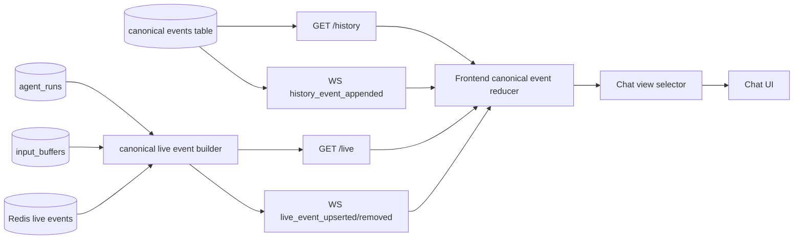

# Chat Canonical Event History/Live API Design

## Overview

Unify Chat screen contract as canonical events. Existing list messages endpoint is removed because it mixed message UI schema, run state, pending input, and active tool state in one response. The new API separates durable history and current live projection, while both return the same canonical event transport union.

This design was written by re-reviewing the draft from PR #4390. It preserves [ADR-0047](../adr/0047-chat-protocol-history-live-state.md)'s decision to "separate history and live state", but does not adopt bespoke live schema. Contract is canonical event.

## Problem Definition

Current Chat UI directly merges following sources in frontend.

- REST `ChatMessageListResponse.items`
- REST `run_state`, `run_phase`, `input_buffers`, `active_tool_calls`
- WS `content_delta`, `reasoning_delta`, `function_call_delta`
- WS `run_started`, `run_phase_changed`, `run_complete`, `run_stopped`
- WS `input_buffered`, `input_buffer_deleted`
- canonical event transport

This structure creates following problems.

- REST and WS deliver same transcript with different schemas.
- Streaming text, reasoning, tool argument draft accumulate only in browser memory and cannot be restored after reload/reconnect.
- Frontend has to infer priority between active tool call and completed tool result.
- Pending input has durable `input_buffers` source, but REST/WS update paths differ.
- `AgentRuntime.run_state`, `agent_runs.phase`, model pending UI state are mixed in one reducer.
- Screen cannot be restored from canonical events alone immediately after refresh.

## Goals

- Remove existing `GET /chat/v1/sessions/{session_id}/messages` endpoint.
- History API paginates only persisted canonical events.
- Live API returns only non-durable canonical event projections needed to restore current screen.
- REST and WS use canonical event transport without separate message UI schema or live schema.
- Frontend maps canonical event list to view model with reducer/selector.
- Pending input keeps `input_buffers` source but is represented as non-durable `user_message` canonical event projection in API.
- Streaming assistant/reasoning/tool draft/running tool/compaction are stored as non-durable canonical event projections in Redis live event store.
- Product behavior verification uses public REST/WS path in `testenv/azents/e2e` as primary.

## Non-goals

- Do not substantially redesign canonical event kind/payload itself in this feature.
- Do not change runtime lifecycle meaning of `AgentRuntime.run_state`.
- Do not move `input_buffers` storage to Redis.
- Do not promote OAuth/account-link prompt to durable DB row.
- Chat scroll anchoring, virtualized transcript layout, visual redesign are not target of this feature.
- Do not create new schema dedicated to version/revision.

## Current State

### Backend

- `python/apps/azents/src/azents/api/public/chat/v1/data.py`
  - `ChatMessageListResponse` returns `items`, `run_state`, `run_phase`, `input_buffers`, `active_tool_calls`.
- `python/apps/azents/src/azents/api/public/chat/v1/__init__.py`
  - `list_messages()` reads canonical history and input buffer from `ChatSessionService`, and reads `run_phase` and `active_tool_calls` from Redis `SessionActivity`.
  - `run_state` is runtime lifecycle signal based on `AgentRuntime.run_state`, not chat live contract.
  - WebSocket handler directly sends/publishes `input_buffered` after creating input buffer.
- `python/apps/azents/src/azents/runtime/canonical/engine_adapter.py`
  - Publishes `StreamProjection` as legacy `content_delta`, `reasoning_delta`, `function_call_delta`.
- `python/apps/azents/src/azents/repos/agent_execution/` and `rdb/models/agent_run.py`
  - `agent_runs` has run id, phase, status, active tool calls, stop requested, terminal timestamp.
- `python/apps/azents/src/azents/repos/input_buffer/`
  - `input_buffers` is durable source of pending input.

### Frontend

- `typescript/apps/azents-web/src/features/chat/types.ts`
  - `CanonicalChatEvent` union already exists.
  - Legacy WS event union also remains in same file.
- `typescript/apps/azents-web/src/features/chat/hooks/useChatWebSocket.ts`
  - Handles both canonical event and legacy event.
  - Accumulates streaming text/reasoning/function call delta in browser memory.
- `typescript/apps/azents-web/src/features/chat/containers/useChatSessionContainer.ts`
  - Converts REST `ChatMessageResponse`, `InputBufferResponse`, `ActiveToolCallResponse` to view model.
- `typescript/apps/azents-web/src/features/chat/hooks/useSubagentSession.ts`
  - subagent transcript also depends on legacy delta/run event shape.
- `typescript/apps/azents-web/src/trpc/routers/chat.ts`
  - Calls `chatV1ListMessages` from generated `@azents/public-client`.

### E2E

- `testenv/azents/e2e/src/tests/azents/public/test_chat_input_buffer.py`
  - verifies pending input path based on legacy `input_buffered`.
- `testenv/azents/e2e/src/tests/azents/public/test_agent_execution_persistence.py`
  - verifies canonical history reload, tool call/result, part of compaction.
- New E2E is needed for v2 canonical event API based streaming live projection, reconnect reload, legacy event removal.

## Discussion Points and Decisions

### 1. REST API shape

Options:

- A. Add canonical event and live data to existing `/messages`.
- B. Create `/history` and `/live`, and remove `/messages`.
- C. Return history and live together in one `/messages/v2`.

Decision: adopt B.

Rationale:

- `/messages` is the central contract of existing problem mixing message UI projection and runtime state.
- History is persisted, paginated, append-only; live is current, replaceable, non-durable.
- The two lifecycles must be separated at API path so frontend loading boundary and E2E assertions are also clear.

### 2. API payload contract

Options:

- A. Create separate live schema.
- B. Use only canonical event transport union for both REST/WS.
- C. Server fully returns frontend-specific UI message schema.

Decision: adopt B.

Rationale:

- canonical event is protocol contract for both history and live.
- separate live schema creates interpretation rules separate from canonical event contract and causes long-term drift.
- UI message schema is renderer concern, so frontend selector owns it.

### 3. Live event store

Options:

- A. Keep in Worker memory.
- B. Store as persisted event in Postgres canonical event table.
- C. Store in Redis as non-durable canonical event projection.

Decision: adopt C.

Rationale:

- Worker memory cannot restore across reload/reconnect/worker move.
- Streaming partial is not confirmed history, so do not store in persisted canonical event table.
- Redis has existing broker dependency and is suitable for TTL-based non-durable state.

### 4. Pending input representation

Options:

- A. Keep separate `PendingInput` API schema.
- B. Return `input_buffers` row as non-durable `user_message` canonical event projection.
- C. Append pending input as history event first.

Decision: adopt B.

Rationale:

- Storage source remains `input_buffers`.
- API contract is unified as one canonical event.
- Pending input is not persisted history before model-call boundary, so do not include in history API.

### 5. WS contract

Options:

- A. Keep sending legacy delta/run/input-buffer event.
- B. Send only `history_event_appended`, `live_event_upserted`, `live_event_removed`.
- C. Repeatedly send full list over WS.

Decision: adopt B.

Rationale:

- Payload is canonical event.
- Wrapper represents only transport action and is not separate domain schema.
- Client reducer upserts/removes canonical event into history list and live list.

## Target Architecture



## REST API

### `GET /chat/v1/sessions/{session_id}/history`

Returns only persisted canonical events. Paginates canonical event transport, not existing `ChatMessageResponse`.

```json
{
  "items": [
    {
      "id": "01J...",
      "session_id": "01J...",
      "kind": "assistant_message",
      "payload": {},
      "external_id": null,
      "model": "gpt-5.4",
      "created_at": "2026-06-04T00:00:00Z"
    }
  ],
  "has_more": false,
  "next_cursor": null
}
```

### `GET /chat/v1/sessions/{session_id}/live`

Returns only current non-durable canonical event projections. Response wrapper has only transport metadata like list and cursor. Domain payload is canonical event.

Projections that Live API may include:

| Source | Canonical event projection |
| --- | --- |
| `input_buffers` | `user_message` with `id = input_buffer.id`, `external_id = input_buffer.id` |
| streaming assistant text | `assistant_message` with stable live id |
| streaming reasoning | `reasoning` with stable live id |
| tool argument draft | `client_tool_call` with stable live id |
| running tool operation | `client_tool_call` or provider tool call projection |
| compaction in progress | `compaction_marker` projection |

Live API does not return persisted history. After run terminal, if matching persisted canonical event exists, corresponding live projection is removed or ignored.

### Removed endpoint

`GET /chat/v1/sessions/{session_id}/messages` is removed in final state. It can remain briefly during stack for frontend transition, but before cleanup, remove route, OpenAPI schema, and generated client usages.

## WebSocket contract

WS payload also uses canonical event.

| Type | Payload | Meaning |
| --- | --- | --- |
| `history_event_appended` | `CanonicalChatEvent` | persisted canonical event append |
| `live_event_upserted` | `CanonicalChatEvent` | add/update non-durable live event projection |
| `live_event_removed` | `{ "id": "01J..." }` | remove non-durable live event projection |

`live_event_removed` is transport action with only event id. It is not domain payload schema.

If patch gap, reconnect, or parse failure occurs, client rereads `/history` and `/live`.

## Backend Design

### API model

New response model reuses canonical event transport.

- `CanonicalChatEventResponse`
- `CanonicalChatEventPageResponse`
- `CanonicalLiveEventListResponse`

`ChatMessageResponse`, `ChatMessageListResponse`, `InputBufferResponse`, `ActiveToolCallResponse` are removed from chat screen contract. Delete if no other route uses them.

### Live event builder

Add `python/apps/azents/src/azents/services/chat/live_events/`.

- `redis_store.py`: Redis non-durable canonical event projection storage
- `builder.py`: assemble `agent_runs`, Redis live events, `input_buffers` into canonical event list
- `notifier.py`: publish WS transport action from write path

Builder does not create new live schema. It only creates ordered `CanonicalChatEventResponse` list.

### Mutation boundaries

- Stream projection delta handling point upserts Redis live canonical event projection.
- Tool draft/start/status change point upserts/removes Redis live canonical event projection.
- Input buffer create/delete/promote point upserts/removes live `user_message` projection.
- Persisted canonical event append point publishes `history_event_appended`.
- After run terminal or matching persisted event append, remove live event.

### Handoff rules

- Persisted history event takes precedence over matching live event.
- If live event and history event with same semantic id/external id coexist, client selector renders history.
- Redis live event clear failure does not break persisted transcript consistency.
- `/live` does not return stale live event for terminal run.

## Frontend Design

### State shape

Frontend state has two canonical event lists.

- `historyEvents`: persisted canonical events
- `liveEvents`: non-durable canonical event projections

`selectChatView(historyEvents, liveEvents)` creates existing `ChatMessage`/pending/tool view model. Component renders selector output rather than directly interpreting canonical events.

### Migration path

1. Add `/history`, `/live`, WS transport action type to Backend OpenAPI.
2. Regenerate public client. Do not directly edit generated files.
3. Change tRPC chat router to call `/history` and `/live`.
4. Change `useChatSessionContainer` to read canonical event page instead of `ChatMessageResponse`.
5. Remove legacy delta/run/input-buffer event branches from `useChatWebSocket` and handle only canonical event transport action.
6. Change `useSubagentSession` to use same canonical event reducer/selector or same contract.
7. Keep selector output in Message components to minimize visual churn.

## Infra and Operations

No new external infrastructure. Redis uses existing broker path.

Operational conditions:

- Redis live event key has TTL by session/run.
- Live event payload follows canonical payload redaction rules.
- Tool arguments are redacted/summarized at same level as existing active tool projection.
- Redis loss must only result in live display loss and must not break persisted canonical history consistency.

## Rollout and Removal Policy

During stack, existing `/messages` and legacy WS event can temporarily remain. Final cleanup completion conditions:

- `/messages` route and OpenAPI schema removed.
- Frontend uses only `/history` and `/live`.
- WS chat UI path consumes only `history_event_appended`, `live_event_upserted`, `live_event_removed`.
- Reducer branches for `content_delta`, `reasoning_delta`, `function_call_delta`, `run_started`, `run_phase_changed`, `input_buffered` removed.
- `AgentRuntime.run_state` is not used as model pending/chat live indicator.

## Feasibility Verification

| Item | Result | Basis |
| --- | --- | --- |
| Canonical event contract | possible | Frontend `CanonicalChatEvent` union and backend canonical event model already exist. |
| History API | possible | Canonical events table and repository exist. |
| Live API | possible | Redis, `input_buffers`, `agent_runs` sources exist. |
| WS transport action | possible | Existing Redis broadcast path delivers arbitrary JSON payload. |
| Frontend migration | possible | Legacy reducer is concentrated in `useChatWebSocket`/`useSubagentSession`. |
| E2E primary | needs reinforcement | input buffer/history E2E exists, but canonical live API based E2E is needed. |

## Test Strategy

Product behavior verification is E2E primary. Unit test, typecheck, static scan are supporting quality verification.

### E2E primary matrix

| Behavior | Primary path | Evidence |
| --- | --- | --- |
| History/live API split | public API `/history`, `/live`, removed `/messages` | JSON canonical event lists + 404/OpenAPI removal |
| Streaming assistant handoff | public WS + `/live` + `/history` | persisted history after removing live `assistant_message` |
| Reasoning partial handoff | public WS + `/live` + `/history` | persisted history after removing live `reasoning` |
| Tool partial lifecycle | public WS + deterministic tool | call/result history after removing live `client_tool_call` |
| Pending input projection | active run + follow-up input | live `user_message` from input buffer |
| Reconnect recovery | WS disconnect then `/history` and `/live` reload | restored view without duplicate |
| Redis live loss tolerance | live key loss after terminal history | persisted history priority rendering |
| Legacy event removal | WS trace + code search | no legacy reducer/event |

### Fixture and prerequisite requirements

- Public API authenticated user/session fixture
- Controllable streaming response fixture
- Deterministic client tool call fixture
- Long-running run fixture that can send follow-up input during active run
- WS raw event trace capture helper

### CI policy

- Deterministic E2E stays in required CI lane.
- Live provider path needing external credential is separated into optional/live lane.
- Unit/type/static checks run as supporting gate of implementation PR.

## QA Checklist

### QA-1. History/live API split

#### What to check

Check that `/history` and `/live` separately return canonical event lists, and existing `/messages` endpoint is removed.

#### Why it matters

History and live have different lifecycles, and existing mixed message endpoint must be removed.

#### How to check

Create session through public API in `testenv/azents/e2e`, then call `/history`, `/live`, existing `/messages`.

#### Expected result

`/history` returns persisted canonical events page. `/live` returns non-durable canonical event projections. `/messages` is removed from OpenAPI and route.

#### Execution result

Implemented in the stack. `/history` and `/live` are exposed, `/messages` is removed from route and OpenAPI, and `test_chat_input_buffer.py` now asserts `/messages` returns 404. Local Docker-based E2E execution was attempted on 2026-06-04 but was blocked before test body execution because the Docker daemon socket refused connection. CI or a Docker-capable runner must provide final product-path execution evidence.

#### Fixes applied

Added history/live API routes, removed the legacy aggregate route/schema, regenerated public OpenAPI, and updated E2E assertions to read split history/live state.

### QA-2. Streaming assistant handoff

#### What to check

Check that assistant streaming text is displayed as live `assistant_message` projection and only persisted `assistant_message` history remains after completion.

#### Why it matters

The structure accumulating streaming state only in browser memory must be removed so reload/reconnect is stable.

#### How to check

In E2E, send message to controllable streaming agent and observe WS live event, `/live`, and after completion `/history`.

#### Expected result

During streaming, `/live` has live `assistant_message`; after completion, it is removed from `/live` and persisted `assistant_message` exists in `/history`.

#### Execution result

Implementation stores streaming assistant text as live event projection and removes it after terminal history is available. Local product-path E2E execution is pending a Docker-capable runner; targeted backend and frontend type/lint checks passed in implementation PRs.

#### Fixes applied

Added live event store projection paths and frontend live event handling; removed legacy `content_delta` reducer dependency from the chat UI.

### QA-3. Tool canonical event lifecycle

#### What to check

Check that tool draft/running state is displayed as live canonical event projection and removed after terminal tool result.

#### Why it matters

Tool call/result backfill must be guaranteed by canonical event contract rather than frontend inference.

#### How to check

In E2E, induce deterministic tool call and check WS event, `/live`, `/history`.

#### Expected result

During execution, live `client_tool_call` projection exists; after completion, only persisted `client_tool_call` / `client_tool_result` pair remains in history.

#### Execution result

Implementation projects active tool calls through live events and persists completed tool call/result events in history. Full Docker E2E execution is pending CI or a Docker-capable runner.

#### Fixes applied

Added live tool-call projection storage and WebSocket `live_event_upserted` / `live_event_removed` handling; removed frontend `function_call_delta` reducer dependency.

### QA-4. Pending input canonical projection

#### What to check

Check that follow-up input during active run is restored as live `user_message` projection while keeping `input_buffers` source.

#### Why it matters

Pending input storage is retained, but API contract must unify as canonical event.

#### How to check

In E2E, send second message during active run and check `/live` and WS live event.

#### Expected result

Pending input appears as `user_message` projection in `/live`, disappears from `/live` after model-call boundary, and persisted `user_message` exists in `/history`.

#### Execution result

Covered by updated `test_chat_input_buffer.py`: active-run follow-up input is observed as `live_event_upserted`, visible through `/live`, then promoted to `/history`. Local E2E run was blocked by Docker daemon unavailability before execution.

#### Fixes applied

Changed pending input WebSocket/API contract from legacy `input_buffered` / `input_buffer_deleted` to live `user_message` projection and `live_event_removed`.

### QA-5. Reconnect recovery

#### What to check

Check that when WS is disconnected during streaming or tool execution and `/history` and `/live` are reread, state restores without duplication.

#### Why it matters

WS is realtime convenience path, and recovery must be possible with REST canonical event lists.

#### How to check

In E2E, disconnect WS, call `/history` and `/live` again, and reconstruct UI state.

#### Expected result

Persisted history and live projection render exactly once each, and stale live event is not shown.

#### Execution result

Frontend reload/reconnect path reads `/history` and `/live` together. Full browser/product-path E2E execution is pending CI or a Docker-capable runner.

#### Fixes applied

Updated chat session and subagent session loaders to use the split history/live API and event reducers.

### QA-6. Legacy event removal

#### What to check

Check that Chat UI does not depend on legacy `content_delta`, `reasoning_delta`, `function_call_delta`, `run_started`, `run_phase_changed`, `input_buffered` reducers.

#### Why it matters

To use canonical event as contract, source-specific legacy event path must be removed.

#### How to check

Check both E2E WS trace and code search.

#### Expected result

Chat UI state update consumes only canonical event transport actions.

#### Execution result

Static search on the implementation branch found no frontend/public API dependency on `input_buffered`, `input_buffer_deleted`, `content_delta`, `reasoning_delta`, `function_call_delta`, `run_started`, or `run_phase_changed`. `test_chat_input_buffer.py` no longer waits for legacy input buffer events and asserts `/messages` is removed.

#### Fixes applied

Removed legacy frontend event types/reducers, removed backend legacy input-buffer publications, removed the `/messages` route and schemas, and regenerated public OpenAPI.

## Acceptance Criteria

- ADR-0047's history/live split decision is preserved in the new canonical event API direction.
- Existing list messages endpoint is removed.
- New REST history API paginates persisted canonical events.
- New REST live API returns non-durable canonical event projections.
- WS chat contract transitions to canonical event transport actions.
- Frontend reducer state separates `historyEvents` and `liveEvents`.
- Legacy WS delta/run/input-buffer reducer branch is removed.
- Required E2E primary scenarios leave PASS evidence.
- During spec promotion, conversation/agent execution/chat flow specs match actual implementation.

## Implementation Plan Overview

Detailed phase plan is written in separate plan PR. Expected stack has following responsibility boundaries.

1. ADR + design
2. Multi-phase implementation plan
3. Backend canonical history/live API foundation
4. Redis live canonical event store and stream/tool integration
5. Input buffer live projection and WS canonical event actions
6. Frontend canonical event reducer/rendering migration
7. Legacy `/messages` and legacy WS event removal
8. E2E/testenv verification
9. Spec promotion
10. Cleanup

## Alternatives Considered

### Keep `/messages`

Rejected. Existing mixed contract itself is the cause of problem, so separate into new API.

### Separate live schema

Rejected. Since canonical event is contract, do not create separate live schema.

### Worker memory live state

Rejected. Cannot restore across reload, reconnect, worker movement.

### Store streaming partial as persisted canonical event

Rejected. Streaming partial is not confirmed history, so do not store in canonical event table.

### Server completes frontend UI message schema

Rejected. UI rendering concern mixes into API contract and drifts from canonical event contract.
