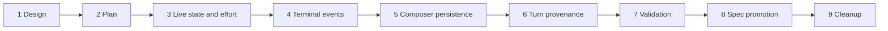

# Chat Run State Regression Hardening Implementation Plan

## Feature Summary

Implement [Chat Run State Regression Hardening](./chat-run-state-regression-hardening.md) as a stacked PR series. The work preserves arbitrary reasoning-effort strings through the frontend and wire contract, prevents invalid or stale snapshots from hiding active Runs, correlates terminal events by Run ID, separates Composer selection persistence from draft persistence, and stores immutable inference provenance with durable turn usage.

The stack prefix is `Chat Run State Hardening`.

## Boundaries and Non-goals

- Keep the identified defects independent in code and tests.
- Keep Sequential Input preparation failures terminal and non-retryable.
- Keep Session current inference state as the model-selection authority for each turn.
- Do not restore run-owned model selection or infer historical provenance from current Agent/Composer defaults.
- Do not edit adopted ADRs or executed migrations.
- Do not introduce a distributed live revision service. Frontend observation generations and request epochs order REST replacement against WebSocket state.
- Do not add browser-only provenance caches as authoritative history.

## Stack

### PR 1 — Design

**Branch:** `fix/chat-run-state-hardening-design`
**Base:** `main`

- Add the approved design.
- Add ADR-0141 for correlated terminal events.
- Add ADR-0142 for immutable turn usage provenance.

### PR 2 — Implementation plan

**Branch:** `fix/chat-run-state-hardening-plan`
**Base:** `fix/chat-run-state-hardening-design`

- Add this multi-phase implementation plan.
- Define phase boundaries, validation matrix, prerequisites, and spec impact.

### PR 3 — Frontend live-state resilience and opaque effort

**Branch:** `fix/chat-run-state-hardening-live-state`
**Base:** `fix/chat-run-state-hardening-plan`

Data/API/runtime changes:

- Widen public reasoning-effort request/response schema fields from a closed enum to nullable strings.
- Convert supported request strings to the canonical backend enum before typed InputBuffer/Session persistence; reject unsupported strings without a state write, and retain authoritative preparation-time capability validation.
- Regenerate public OpenAPI clients.
- Replace finite frontend effort parsing with opaque string preservation.
- Distinguish `run: null` from invalid non-null Run payloads.
- Preserve the current valid Run on invalid snapshots.
- Make valid active Run state override contradictory Session idle state in API/frontend projection.
- Add frontend observation generation and REST request-epoch guards for compound Run, partial-history, input-buffer, Todo, and action-execution snapshot replacement.
- Add structured diagnostics for malformed Run projection and backend Run/Session contradiction.

Tests:

- Frontend decoder/reducer tests for arbitrary strings, invalid-versus-absent Run, active-Run precedence, and compound stale snapshot suppression.
- Public request tests for supported expanded strings and backend rejection of unsupported strings before persistence.
- Backend projection tests for effective running state and contradiction logging.
- OpenAPI/client generation validation.

Dependencies: PR 2.

### PR 4 — Terminal event contract and finalization ordering

**Branch:** `fix/chat-run-state-hardening-terminal-events`
**Base:** `fix/chat-run-state-hardening-live-state`

Data/API/runtime changes:

- Add required `run_id` to `RunComplete`, `RunStopped`, and `live_run_cleared` payloads.
- Update all emitters, serializers, projectors, and hand-written public WebSocket envelope types. Regenerate clients only if the public OpenAPI schema is changed by the implementation.
- Require exact Run-ID match before frontend current-Run clearing.
- Remove unconditional `RunComplete` publication from `SessionRunnerErrorReporter.report_unhandled()`.
- Route unhandled failures with an active Run through the failed-run finalization boundary.
- Keep pre-Run errors as user-safe observations without terminal Run events.
- Preserve terminal/no-retry preparation failure behavior.

Tests:

- Serializer and projection contract tests require `run_id`.
- Stale Run A terminal events do not clear Run B.
- Pre-Run unhandled error emits no `RunComplete`.
- Active-Run unhandled error reaches durable terminal state before `RunComplete`.
- Preparation failure behavior remains terminal/no-retry.

Dependencies: PR 3 for frontend event handling and regenerated wire types.

### PR 5 — Composer selection persistence

**Branch:** `fix/chat-run-state-hardening-composer`
**Base:** `fix/chat-run-state-hardening-terminal-events`

Data/API/runtime changes:

- Preserve the current target and raw nullable effort after successful send.
- Add a dedicated agent/session-scoped last-selected-profile localStorage entry through Mantine persistence helpers.
- Keep draft and last-selected lifecycles separate.
- Validate stored target existence and fall through deterministically when the target was deleted.
- Apply restoration precedence from the approved design.

Tests:

- Successful send clears message/action draft while retaining profile.
- Reload without an unsent draft restores last-selected profile.
- Draft profile outranks last-selected profile.
- Deleted target removes only stale selection and falls through.
- Arbitrary raw effort survives both persistence paths.

Dependencies: PR 3 opaque effort state.

### PR 6 — Durable turn usage provenance

**Branch:** `fix/chat-run-state-hardening-turn-provenance`
**Base:** `fix/chat-run-state-hardening-composer`

Data/API/runtime changes:

- Extend `TurnMarkerPayload` with nullable applied inference provenance: target label, raw effort, `model_display_name`, effective context window, and effective compaction threshold.
- Capture the Session inference snapshot applied to the exact model call.
- Preserve historical marker decoding when provenance fields are absent.
- Expose the allowlisted snapshot through canonical history/live API schemas.
- Regenerate public OpenAPI and Python/TypeScript clients.
- Update token usage mapping and indicator rendering to prefer marker provenance; keep unavailable state for historical markers without it.

Tests:

- Engine/store round-trip for markers with and without provenance.
- Multi-turn Run records the per-turn Session snapshot rather than a single run-level selection.
- Public schema excludes provider/model identifiers and credentials.
- Frontend reload renders stable target, raw effort, display name, and effective limits after live Run cleanup.

Dependencies: PR 3 raw effort contract and PR 4 stable Run identity.

### PR 7 — Deterministic E2E and validation report

**Branch:** `fix/chat-run-state-hardening-validation`
**Base:** `fix/chat-run-state-hardening-turn-provenance`

- Add or extend deterministic public E2E coverage for all user-visible behavior.
- Add only the fixture controls required for arbitrary effort projection, client-tool pause, stale ordering, and delayed terminal delivery.
- Run focused backend and frontend suites plus deterministic E2E.
- Record commands, environment, evidence, failures found, fixes applied, and implementation/spec comparison in a validation design report.
- Fix validation-discovered defects in this PR unless the fix must be moved to the responsible earlier phase and the stack rebased.

Dependencies: PRs 3–6.

### PR 8 — Spec promotion

**Branch:** `fix/chat-run-state-hardening-spec`
**Base:** `fix/chat-run-state-hardening-validation`

- Run `/spec-review` against the complete implementation.
- Update the Conversation, Agent Execution Loop, Chat Session Resync, and Session Context Inspector living specs.
- Mark the design implemented only after validation passes.
- Update code paths, verification date, spec version, invariants, contracts, and test scenarios.

Dependencies: PR 7 validation evidence.

### PR 9 — Cleanup

**Branch:** `fix/chat-run-state-hardening-cleanup`
**Base:** `fix/chat-run-state-hardening-spec`

- Remove this temporary implementation plan.
- Remove only stale planning references identified during spec promotion.
- Do not include behavior changes or refactors.

Dependencies: PR 8.

## Cross-phase Dependencies

The stack remains linear so each later phase can consume the complete prior contract. PRs are created before CI monitoring begins. Rebase, retarget, and merge operations use the stacked-PR workflow and proceed front-to-back.

## E2E Primary Validation Matrix

| User-visible behavior | Primary deterministic path | Required assertion/evidence | Owning PR |
|---|---|---|---|
| Expanded supported effort survives | Public API writes `none`, `minimal`, `xhigh`, or `max` | Exact raw string in metadata, Composer, reload, and submission payload | 3, 7 |
| Unknown effort read compatibility | Response/projection fixture injects an unknown string without bypassing write validation | Exact raw string in frontend metadata, persistence, and attempted submission payload; backend rejection remains unchanged | 3, 7 |
| Running state through tool boundary | Paused deterministic client tool | Pending indicator and Stop remain visible until terminal event | 3, 7 |
| Contradictory Session idle | Controlled live projection | Running Run remains active; diagnostic captured | 3, 7 |
| Stale REST response | Delayed write/reconcile response plus newer WS event | Run, partial history, input buffers, Todo, and action executions do not regress | 3, 7 |
| Invalid non-null Run | Malformed fixture snapshot after valid Run | Existing Run remains; parse diagnostic captured | 3, 7 |
| Explicit Run absence | Newest REST baseline returns null after terminal cleanup | Current Run clears | 3, 7 |
| Stale terminal event | Run A delayed terminal after Run B starts | Run B remains active | 4, 7 |
| Pre-Run unhandled failure | Controlled preparation/dispatch exception before Run creation | User-safe error and no terminal Run event | 4, 7 |
| Active-Run unhandled failure | Controlled worker exception after Run activation | Durable failed state precedes matching `RunComplete` | 4, 7 |
| Selection after send | Select non-default target/effort and send | Composer keeps selection while text/action clears | 5, 7 |
| Selection after reload | Reload with no unsent draft | Last-selected target and raw effort restore | 5, 7 |
| Deleted selected target | Remove target after persistence | Deterministic fallback without stale submission | 5, 7 |
| Historical usage provenance | Complete Run, clear live state, reload | Usage retains target, raw effort, display name, and limits | 6, 7 |
| Historical marker compatibility | Load marker without provenance | Usage renders with provenance unavailable, no parse failure | 6, 7 |

## Fixture and Prerequisite Support

Existing deterministic public E2E authentication, model-listing, and execution fixtures remain the base. Add focused controls only when the current deterministic fixture cannot express a required ordering or failure:

- supported expanded effort strings for public write E2E and an arbitrary read-side effort string in response/projection fixtures without a production write-validation bypass;
- a client-tool execution barrier that the test can release;
- delayed REST response ordering;
- delayed terminal event delivery for an earlier Run;
- pre-Run and active-Run exception injection points.

These are internal deterministic controls and require no live credentials. Tests must use public API/UI paths for product state and must not write directly to the database. Required fixture setup failure fails CI rather than skipping.

## Validation Strategy by Phase

### PR 3

- TypeScript format, lint, typecheck, and focused chat tests.
- Backend Ruff, Pyright, and focused live projection tests.
- OpenAPI dump and public client regeneration checks.

### PR 4

- Backend terminal/finalizer/session-runner tests.
- Broker serializer and WebSocket projection tests.
- TypeScript terminal reducer tests and typecheck.

### PR 5

- ChatInput/component/container tests.
- Storybook states only if visible pure UI behavior changes.
- TypeScript format, lint, and typecheck.

### PR 6

- Engine event and message store tests.
- Public API schema tests and generated-client checks.
- Token usage frontend tests and typecheck.

### PR 7

- Full focused backend quality suite for changed modules.
- Full azents-web format, lint, typecheck, and build/Storybook checks affected by the stack.
- Deterministic E2E matrix.
- `git diff --check` and docs validation.

## Spec Impact Candidates

- `docs/azents/spec/domain/conversation.md`
  - terminal event identity, effective live running state, turn-marker payload.
- `docs/azents/spec/flow/agent-execution-loop.md`
  - finalization ordering and per-turn provenance capture.
- `docs/azents/spec/flow/chat-session-resync.md`
  - opaque effort, invalid/absent Run distinction, observation generation, terminal correlation, Composer restoration.
- `docs/azents/spec/flow/session-context-inspector.md`
  - durable historical usage provenance.

## Rollout and Compatibility

- Frontend and backend changes are delivered in one stack and deployed together.
- Historical `turn_marker` events without provenance remain readable.
- Newly produced terminal control events require `run_id`; no legacy missing-ID fallback is retained after the stack.
- Public effort fields become nullable strings, while backend capability validation remains authoritative.
- No executed migration is modified. No new database migration is expected because supported public strings are converted to the existing canonical enum before typed persistence; implementation must add a migration instead if that boundary cannot be preserved.

## Known Blockers

None. The deterministic test substrate may need small new controls in PR 7, but no external credential or manual environment action is required.

## Cleanup

After spec promotion, remove this plan in PR 9. The design, ADRs, living specs, tests, and implementation become the durable sources of truth.
